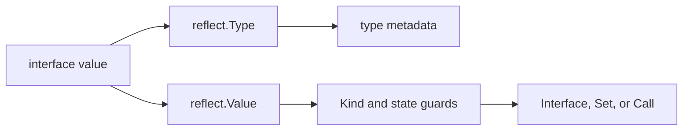

<TLDR>
  <TLDRCell label="what">
    <Term id="reflection">反射（reflection）</Term>让代码在运行时读取任意值的具体类型、结构和内容，并在满足严格条件时修改值或调用方法。
  </TLDRCell>
  <TLDRCell label="trap">
    `reflect.Value`的多数操作只接受特定`Kind`和状态；无效值、nil、不可设置字段或错误调用参数都会导致panic。
  </TLDRCell>
  <TLDRCell label="fix">
    先检查`IsValid`、`Kind`、`CanInterface`、`CanSet`和精确类型关系，再执行操作；类型在编译期已知时优先用接口或泛型。
  </TLDRCell>
</TLDR>

## 是什么，为什么存在

Go的`reflect`包提供运行时反射。它把接口值中的动态类型和值表示成`reflect.Type`与`reflect.Value`，让库在编译时不知道具体类型名称的情况下检查数据结构。编码器、校验器和RPC调度器都可能需要这种能力。

反射没有取消静态类型。它只是把一部分检查从编译期推迟到运行时，因此错误常以panic而不是编译错误出现。只有数据形状确实要到运行时才能确定时，这种代价才合理。

类型集合已知时，普通字段访问、窄接口或泛型通常更合适。它们让编译器检查更多契约，也更容易追踪控制流。反射适合集中在框架边界，不适合扩散到业务逻辑中。

反射也不是绕过可见性与类型规则的后门。未导出字段不能通过常规反射接口取出为`any`或修改，赋值仍须满足Go的类型关系。若一个方案必须依靠`unsafe`才能完成，它已经超出`reflect`的正常边界。

## 工作原理

### 接口值是入口

`reflect.TypeOf(input)`和`reflect.ValueOf(input)`都接收`any`。调用时，具体值先装入一个<Term id="interface-value">接口值（interface value）</Term>，其中保存动态类型和动态值。`TypeOf`读取类型部分，`ValueOf`返回操作动态值的句柄。

`Value.Interface()`完成反方向转换，把可导出的有效`Value`重新装成`any`。返回值的静态类型是`any`，动态类型仍是原类型。来自未导出字段的值不能安全执行该操作，所以应先检查`CanInterface()`。



这对应常说的三条反射定律：接口值可以转成反射对象，反射对象可以转回接口值，而修改要求目标可设置。这三句只是方向图，不是完整的安全检查。有效性、可见性、精确类型和业务权限仍需逐项验证。

### Type与Kind回答不同问题

`reflect.Type`描述完整类型身份，包括名称、包路径、元素类型、字段和方法。两个命名类型即使共享同一个<Term id="underlying-type">底层类型（underlying type）</Term>，它们的`Type`仍然不同。判断赋值、转换或接口实现关系时，应使用`AssignableTo`、`ConvertibleTo`或`Implements`。

`Kind`只表示底层存储类别，例如`Int64`、`Struct`、`Slice`或`Pointer`。自定义的`UserID`可以具有`Int64`这个`Kind`，但它并不因此等于`int64`。`Kind`适合选择可调用的`Value`方法，不能代替类型检查。

`TypeOf(nil)`返回`nil`，因为空接口没有动态类型。需要表示某个接口类型时，可以使用`reflect.TypeOf((*error)(nil)).Elem()`这样的类型令牌。这里的nil指针只用于携带`*error`的类型信息，不会被解引用。

### Value还带有操作状态

`reflect.Value`不只有类型和值，还记录有效性、可寻址性、可设置性和可导出性等状态。`ValueOf(nil)`返回无效`Value`；它的`IsValid()`为`false`，`Kind()`为`Invalid`。除少数明确允许的方法外，对它继续操作会panic。

种类为`Pointer`或`Interface`的值可以通过`Elem()`访问其内容。但nil指针或nil接口的`Elem()`会产生无效`Value`，不是一个可以继续解引用的零值。每次解引用都必须重新检查结果。

`IsNil()`也不是通用nil判断。它只适用于`Chan`、`Func`、`Interface`、`Map`、`Pointer`和`Slice`。把它用于整数、结构体或无效值会panic，因此必须先按`Kind`分支。

### 修改要求可设置

`ValueOf(record)`观察的是装入接口的副本，不能用`Set`修改原变量。要让调用方看到修改，应传入非nil指针，再用`Elem()`取得它指向的变量。目标字段还必须导出并且允许写入。

`CanAddr()`与`CanSet()`回答不同问题。可寻址只表示能够取得地址，可设置还受来源和可见性规则约束。写入前检查`CanSet()`，取出为接口前检查`CanInterface()`。

`Set`要求来源值可赋给目标类型。`SetInt`、`SetString`等专用方法仍要求目标具有兼容`Kind`，而且语言允许的数值操作未必符合业务范围。格式、范围和权限校验应该发生在反射写入之前。

### 结构体元数据与方法集

结构体的`Type`提供`NumField`、`Field`、`FieldByName`和`VisibleFields`等元数据入口。`StructField`包含字段名、类型、索引路径、导出状态和<Term id="struct-tag">结构体标签（struct tag）</Term>。标签本身只是字符串，含义由`json`、`xml`或自定义包定义。

`StructTag.Get`无法区分“键不存在”与“键存在但值为空”。这一区别影响行为时，应使用`Lookup`返回的布尔值。嵌入字段还可能产生提升或名称冲突，通用库应保存`StructField.Index`，而不是假设字段都在顶层。

类型的<Term id="method-set">方法集（method set）</Term>决定反射能找到哪些方法。`T`与`*T`的方法集不同，所以值可能找不到只属于指针接收者的方法。`Call`还要求实参数量和类型准确匹配，并会传播被调用函数的panic。

## 示例

下面四个程序依次加入只读检查、字段修改、动态调用和nil分类。它们把反射集中在很小的边界，并让所有失败路径都先于危险操作。每段输出都来自本地Go工具链实际运行。

### 读取类型、Kind与标签

`Account`同时包含命名整数类型、标签和未导出字段。循环从`Type`读取字段元数据，再从对应的`Value`读取内容。`CanInterface`让未导出字段留在反射边界内。

<Depth level="quick">

```go
package main

import (
	"fmt"
	"reflect"
)

type UserID int64

type Account struct {
	ID     UserID `json:"id"`
	Email  string `json:"email,omitempty"`
	secret string
}

func main() {
	account := Account{ID: 7, Email: "ada@example.test", secret: "token"}
	typ := reflect.TypeOf(account)
	value := reflect.ValueOf(account)

	fmt.Println(typ.Name(), typ.Kind(), typ.NumField())
	for index := 0; index < typ.NumField(); index++ {
		fieldType := typ.Field(index)
		tag, present := fieldType.Tag.Lookup("json")
		fieldValue := value.Field(index)
		fmt.Printf("%s type=%v kind=%v exported=%t tag=%q present=%t",
			fieldType.Name, fieldType.Type, fieldType.Type.Kind(), fieldType.IsExported(), tag, present)
		if fieldValue.CanInterface() {
			fmt.Printf(" value=%v", fieldValue.Interface())
		}
		fmt.Println()
	}
}
```

```text
Account struct 3
ID type=main.UserID kind=int64 exported=true tag="id" present=true value=7
Email type=string kind=string exported=true tag="email,omitempty" present=true value=ada@example.test
secret type=string kind=string exported=false tag="" present=false
```

</Depth>

`ID`的完整类型是`main.UserID`，而`Kind`是`int64`。这说明`Kind`相同不能证明两个值可直接赋值。未导出字段仍有元数据，但`CanInterface()`阻止代码把其中的值暴露为`any`。

### 验证后修改字段

`SetField`接受指针，因为调用方需要看到修改结果。它依次验证指针、结构体、字段可设置性和精确赋值关系。失败路径返回错误，不把反射panic当作输入校验机制。

```go
package main

import (
	"fmt"
	"reflect"
)

type Limits struct {
	Host   string
	Port   int
	secret string
}

func SetField(target any, name string, replacement any) error {
	root := reflect.ValueOf(target)
	if root.Kind() != reflect.Pointer || root.IsNil() {
		return fmt.Errorf("target must be a non-nil pointer")
	}
	value := root.Elem()
	if value.Kind() != reflect.Struct {
		return fmt.Errorf("target must point to a struct")
	}
	field := value.FieldByName(name)
	if !field.IsValid() || !field.CanSet() {
		return fmt.Errorf("field %q cannot be set", name)
	}
	next := reflect.ValueOf(replacement)
	if !next.IsValid() || !next.Type().AssignableTo(field.Type()) {
		return fmt.Errorf("%s expects %v, got %T", name, field.Type(), replacement)
	}
	field.Set(next)
	return nil
}

func main() {
	limits := Limits{Host: "api.internal", Port: 8080, secret: "token"}
	fmt.Println(SetField(&limits, "Port", 9090), limits)
	fmt.Println("type:", SetField(&limits, "Host", 42))
	fmt.Println("secret:", SetField(&limits, "secret", "changed"))
}
```

```text
<nil> {api.internal 9090 token}
type: Host expects string, got int
secret: field "secret" cannot be set
```

`Port`通过全部检查，所以写入原结构体。普通`int`不能赋给`string`，未导出字段即使可寻址也不能设置。生产代码通常还会用标签建立允许修改的字段清单，避免外部输入直接选择Go字段名。

### 约束动态方法调用

动态调度器不能在找到同名方法后立即调用。这个适配器只接受`func(string) string`一种签名，并用类型令牌进行精确比较。更宽的RPC系统还需要认证、参数解码、返回值处理和panic边界。

```go
package main

import (
	"fmt"
	"reflect"
)

type Commands struct{}

func (Commands) Status(orderID string) string {
	return "ready: " + orderID
}

func CallStringMethod(receiver any, name, argument string) (string, error) {
	receiverValue := reflect.ValueOf(receiver)
	if !receiverValue.IsValid() {
		return "", fmt.Errorf("receiver is nil")
	}
	method := receiverValue.MethodByName(name)
	if !method.IsValid() {
		return "", fmt.Errorf("no supported method %q", name)
	}
	typ := method.Type()
	stringType := reflect.TypeOf("")
	if typ.NumIn() != 1 || typ.In(0) != stringType ||
		typ.NumOut() != 1 || typ.Out(0) != stringType {
		return "", fmt.Errorf("method %q must have type func(string) string", name)
	}
	output := method.Call([]reflect.Value{reflect.ValueOf(argument)})
	return output[0].String(), nil
}

func main() {
	status, err := CallStringMethod(Commands{}, "Status", "A-104")
	fmt.Println(status, err)
	_, err = CallStringMethod(Commands{}, "Delete", "A-104")
	fmt.Println("missing:", err)
}
```

```text
ready: A-104 <nil>
missing: no supported method "Delete"
```

方法值的`Type`已经绑定接收者，所以`NumIn()`只计算显式的`orderID`参数。不存在的方法返回无效`Value`，因此先检查`IsValid()`。即使签名匹配，被调方法本身仍可能panic，调度边界必须另行决定是否恢复。

### 区分invalid、typed nil与空切片

空接口、装有nil指针的接口、nil切片和长度为零的非nil切片是四种不同状态。反射不会把它们折叠成一个“空”概念。下面的输出显示有效性、`Kind`、接口比较和`IsNil`各自回答什么。

```go
package main

import (
	"fmt"
	"reflect"
)

type Problem struct{}

func (*Problem) Error() string { return "problem" }

func main() {
	invalid := reflect.ValueOf(nil)
	fmt.Println("nil interface:", invalid.IsValid(), invalid.Kind())

	var problem *Problem
	var err error = problem
	typedNil := reflect.ValueOf(err)
	fmt.Println("typed nil:", err == nil, typedNil.Kind(), typedNil.IsNil())

	empty := reflect.ValueOf([]string{})
	nilSlice := reflect.ValueOf([]string(nil))
	fmt.Println("empty slice:", empty.IsNil(), empty.Len())
	fmt.Println("nil slice:", nilSlice.IsNil(), nilSlice.Len())
}
```

```text
nil interface: false invalid
typed nil: false ptr true
empty slice: false 0
nil slice: true 0
```

`err`是<Term id="typed-nil">带类型的nil（typed nil）</Term>：动态类型为`*Problem`，动态指针为nil，所以接口本身不等于`nil`。两个切片长度都为零，但只有一个切片为nil。序列化或补丁语义若区分“缺失”与“空集合”，这项差异必须保留。

## 陷阱

> [!PITFALL]
> 在检查有效性前调用`Type()`、`Elem()`或`Interface()`。`ValueOf(nil)`、失败的`FieldByName`以及nil指针的`Elem()`都可能产生无效`Value`。

**修复方法：** 每次使用可能返回无效值的API后立即检查`IsValid()`；确认`Kind`合适后，才能调用`IsNil()`或`Elem()`。

> [!PITFALL]
> 把`CanAddr()`当成`CanSet()`，或认为同包代码能通过反射修改未导出字段。可寻址值仍可能受可见性限制，直接`Set`会panic。

**修复方法：** 写入前检查`CanSet()`，取出为`any`前检查`CanInterface()`；需要修改的状态应通过导出字段、构造函数或方法公开。

> [!PITFALL]
> 只比较`Kind`，随后无条件使用`Convert`。同为`Int64`的命名类型可以有不同领域含义，数值转换还可能改变数值。

**修复方法：** 默认要求`AssignableTo`；确需转换时列出允许的源类型，并在转换前检查范围与业务约束。`ConvertibleTo`只证明语言允许转换，不证明数据有效。

> [!PITFALL]
> 用值接收者查找只存在于指针方法集中的方法。`MethodByName`会返回无效`Value`，随后直接`Call`就会panic。

**修复方法：** 明确要求调用方传`T`还是`*T`，检查方法值有效后再验证完整函数签名。动态调用还要确认参数数量、返回值数量和panic策略。

> [!PITFALL]
> 让请求参数直接成为`FieldByName`或`MethodByName`的名称。这会把所有可达的导出字段或方法变成未审查的外部操作面。

**修复方法：** 用固定映射把外部名称转换成允许的字段索引或方法，并在反射前完成认证、授权和输入校验。错误消息也不应泄露敏感字段值。

> [!PITFALL]
> 在类型已经确定的循环中反复发现字段、解析标签和查找方法。这样既模糊业务意图，也重复执行相同元数据工作。

**修复方法：** 先确认普通代码、接口或泛型不能更直接地表达需求；必须反射时，以`reflect.Type`为键缓存不可变解析计划，并用基准决定是否优化。

<Depth level="deep">

## 类型关系比Kind更严格

`AssignableTo`对应无需显式转换的赋值关系，通常是反射写入最稳妥的默认条件。`ConvertibleTo`对应语言允许的显式转换，范围更宽。整数类型之间可能允许转换，但目标宽度较小时数值可能变化，因此配置解析器不能把“可转换”当成“可接受”。

`Implements`判断一个类型是否实现接口，调用方向是`concrete.Implements(interfaceType)`，而且右侧必须是接口类型。没有运行时值时，可以通过`reflect.TypeOf((*MyInterface)(nil)).Elem()`取得接口类型。这个写法表达的是类型，不应与对业务指针解引用混为一谈。

类型身份也影响map键、方法选择和零值创建。`reflect.Zero(typ)`创建该精确类型的零值，不会只按`Kind`选择某个预声明类型。`reflect.New(typ)`返回指向新零值的指针`Value`，要用`Elem()`才能访问其中的变量。

### 赋值、转换与专用setter

`Value.Set(source)`遵循赋值规则，来源必须可赋给目标。`Value.Convert(targetType)`则先执行显式转换规则，并可能因不允许转换而panic。通用边界应先决定是否允许转换，而不是见到`ConvertibleTo`为真就自动执行。

`SetInt`接收`int64`，但可以写入不同宽度的有符号整数目标。目标是否溢出可以用`OverflowInt`预先判断。类型层面的许可与业务层面的范围仍是两套检查，例如端口还必须位于应用规定的范围内。

命名类型尤其容易暴露策略不清。`type Celsius int`与`type UserID int`可能有相同`Kind`，却不应互相转换。允许清单应基于精确`Type`和字段语义，而不是底层整数表示。

## invalid、nil与零值

无效`Value`表示“没有值”。它可能来自`ValueOf(nil)`、查找失败，或对nil指针执行`Elem()`。无效值与某个具体类型的零值不同；后者有有效`Type`，并可以由`reflect.Zero(typ)`构造。

带类型的nil则同时具有动态类型和nil动态值。接口比较会先看到动态类型，因此保存nil `*T`的接口不等于nil。反射代码需要先判断有效性，再只对六种可为nil的`Kind`调用`IsNil()`。

nil切片与非nil空切片都满足`Len() == 0`，但`IsNil()`不同。序列化、PATCH或数据库边界有时把它们解释成“未提供”与“显式清空”。反射帮助观察差异，却不能替应用选择语义。

### 解引用循环需要停止条件

为了同时接受`T`、`*T`或嵌套指针，生成代码常写一个重复`Elem()`的循环。循环每一轮都必须先确认当前值有效、`Kind`是`Pointer`或`Interface`，并处理nil。否则错误路径本身会panic。

无限解引用也会抹掉接口边界携带的信息。若调用约定明确要求`*Config`，只解引用一层通常比接受任意深度更容易解释。输入形状越宽，测试矩阵和错误语义就越复杂。

接口中的typed nil还可能触发方法调用。某些nil指针接收者方法自行处理nil，另一些会解引用并panic。反射不改变方法体契约，调用边界不能仅凭`MethodByName`成功就认定调用安全。

## 字段发现与元数据缓存

嵌入字段会让顶层名称解析出现多条索引路径。`FieldByName`遵循Go的提升规则，歧义时查找失败。序列化器通常需要自己的名称冲突策略，因此应先遍历`VisibleFields`或递归构建字段计划，再保存完整`Index`路径。

结构体标签不是可信输入验证器。`Get("json")`只返回字符串，不检查选项是否被目标包支持。自定义标签解析器要定义空值、重复键、非法语法与未知选项的行为，并在缓存计划时报告配置错误。

`reflect.Type`值可比较，适合用作缓存键。缓存可以保存不可变的字段索引、标签解析结果和转换函数，让每条记录只做值操作。不要缓存某次请求的`reflect.Value`，因为它可能保留数据并把生命周期或并发问题带入全局缓存。

### 并发性来自底层值

反射不会给底层数据自动加锁。若普通map不能承受某组并发读写，指向它的`reflect.Value`也不能。缓存元数据的map同样需要安全发布或同步，除非构建完成后只读。

一个可设置`Value`只是另一个存储位置的句柄。把它交给多个goroutine会共享同一状态，是否安全完全取决于等价的直接操作是否安全。并发测试应覆盖底层对象，而不是只验证缓存初始化。

反射边界若需要高吞吐，应先用基准定位成本。可以分别测量字段发现、标签解析、转换与实际业务调用，再决定缓存哪一层。没有测量结果时，只能说明可能的成本来源，不能给出倍数结论。

## 动态调用是权限边界

`MethodByName`只证明当前方法集存在一个导出方法，不证明请求方有权调用它。把请求字符串原样作为方法名，会把类型的公开方法集变成远程操作面。外部命令应该先映射到固定的内部处理器或允许方法。

找到方法后还要验证完整签名。方法值已经绑定接收者，因此其`Type`不含接收者参数；从类型取得的`Method.Type`则把接收者列为第一个输入。混淆这两种形态容易造成参数计数错误。

`Value.Call`会传播被调函数的panic。只有拥有工作单元失败策略的边界才适合`recover`，并且应记录堆栈、清理资源和区分预期错误与程序缺陷。给每次反射调用加一个吞掉所有panic的包装器，会把缺陷伪装成成功或普通错误。

### 选择反射、泛型或代码生成

泛型适合类型集合在编译期可表达、算法对每个类型相同的场景。接口适合调用方只需要一组行为的场景。两者都比动态字段名保留更多编译期检查。

代码生成适合结构已知但样板代码很多，而且构建流程能够管理生成产物的场景。生成器本身可以使用反射或语法树，但运行时路径保持静态。代价是生成步骤、差异审查与版本同步。

反射适合真正开放的运行时类型边界，例如通用编码库。成熟设计也常混合三者：反射只发现一次类型计划，缓存的函数完成重复操作，公开API则用泛型或接口保持类型清楚。选择标准是类型何时才可知，而不是哪种技术显得更灵活。

</Depth>

<Checkpoint id="go/reflection" />

## 延伸阅读

- [Go `reflect`包文档](https://pkg.go.dev/reflect)
- [Go Blog：The Laws of Reflection](https://go.dev/blog/laws-of-reflection)
- [Go语言规范：类型和值的属性](https://go.dev/ref/spec#Properties_of_types_and_values)
- [Go语言规范：方法集](https://go.dev/ref/spec#Method_sets)
