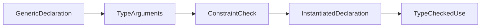

<TLDR>
  <TLDRCell label="what">
    A <Term id="type-parameter">type parameter</Term> is a placeholder type in a declaration; instantiation replaces each parameter with a type argument that satisfies its constraint.
  </TLDRCell>
  <TLDRCell label="trap">
    A constraint limits both accepted types and the operations generic code may perform. `comparable` permits `==`, but an interface type argument can still panic on a non-comparable dynamic value.
  </TLDRCell>
  <TLDRCell label="fix">
    Derive the smallest constraint from the relationships in the signature and the operations in the body, then test named types, zero values, and dynamic interface values.
  </TLDRCell>
</TLDR>

## What it is and why it exists

Type parameters let a function, type, alias, or method leave some types open until instantiation. In `func Last[S ~[]E, E any](values S) (E, bool)`, `S` is a slice type and `E` is its element type. One call still uses one set of concrete static types; it doesn't box every value in `any`.

Their central job is to express relationships between types. If the input is `[]Invoice`, the result should be `Invoice`; if a map key is `UserID`, its lookup argument should also be `UserID`. An ordinary interface value can hide a dynamic type, but it doesn't directly say that these positions must use the same concrete type.

Every type parameter has a constraint. The constraint determines which type arguments are valid and which operations the implementation may perform on parameter values. `any` provides only operations available to all types, `comparable` adds equality, and custom constraints can specify methods or type terms.

You'll encounter type parameters in reusable algorithms, containers, adapters, and the standard library's `slices`, `maps`, and `cmp` packages. If a parameter appears only once under an `any` constraint, it usually preserves no relationship, and an ordinary parameter or interface may be clearer.

## How it works

### Declaration and instantiation

A type parameter list follows the declaration name in square brackets. Every name must be present and have a constraint; adjacent parameters can share one constraint, as in `[K, V comparable]`. Within the declaration's scope, each parameter name denotes a type that hasn't been chosen yet.

Type arguments appear in square brackets, as in `Index[SKU, int]`. Instantiation establishes a concrete declaration and checks every argument against its corresponding constraint. `Index[SKU, int]` and `Index[string, int]` are different instantiated types; the fact that `SKU` has underlying type `string` doesn't make them identical.

A generic function must be instantiated before it can be called or used as a function value. A call can often omit some or all type arguments and let the compiler infer them. A generic type must still be instantiated when used; bare `Index` isn't shorthand for `Index[K, V]` without arguments.



### Constraints and type sets

A <Term id="generic-constraint">generic constraint</Term> is an interface. The interface defines a <Term id="type-set">type set</Term>, and a type argument must satisfy that set's rules. The compiler permits only operations supported by every candidate type in the set.

Method elements, embedded interfaces, and type terms narrow the candidates. Elements on separate lines intersect, while terms joined with `|` form a union within that element. Requiring both `~string` and `IsValid() bool` therefore means "has underlying type `string` and has this method," not either condition.

The plain term `string` contains only the predeclared type `string`. `~string` also contains named types such as `type OrderID string`, because their <Term id="underlying-type">underlying type</Term> is `string`. The tilde performs no conversion; it changes only the compile-time type set.

| Constraint | Representative accepted types | Operations the body may rely on |
| --- | --- | --- |
| `any` | Every type | Assignment, passing, and returning |
| `comparable` | Comparable types that satisfy its rules | `==`, `!=`, and use as a map key |
| `~int | ~int64` | Named or predeclared types with those underlying types | Integer operations common to the set |
| `interface { ~string; IsValid() bool }` | String-underlying types with the method | String operations and an `IsValid` call |

### Inference follows known relationships

<Term id="type-inference">Type inference</Term> unifies ordinary argument types, constraint relationships, and known types from a function context. For `[S ~[]E, E any]`, passing `Stages` first yields `S = Stages`; the underlying slice type of `Stages` then yields `E = string`.

A caller may provide only a prefix of the type argument list and let the compiler infer the rest. Explicit arguments must follow declaration order, so parameter order affects API ergonomics. Put a type that callers are likely to specify, and that helps infer the others, near the front.

Inference needs evidence. If a type parameter occurs only in the result and the call has no usable function-type context, the caller must provide that argument explicitly. The compiler doesn't freely work backward from whatever variable you later assign the result to in every context.

Go 1.27 extends function type inference to every assignment context involving functions, but constraints are still checked. Real call sites should cover named types, untyped constants, `nil`, and generic function values because they expose inference assumptions that simple literals miss.

### Receiver parameters and generic methods

A method on a generic type declares parameters corresponding one-for-one with the base type's parameters in its receiver specification. In `func (index Index[Key, Value]) Put(...)`, `Key` and `Value` are receiver type parameters used by the method. Their names needn't match `K` and `V` in `Index[K, V]`; the base type implies their constraints.

Go 1.27 also lets a method declare additional type parameters after the method name, such as `Apply[F any]`. A generic method has two declaration layers: receiver parameters describe the existing generic base type, while method parameters express relationships introduced by that operation.

Interface methods still can't declare type parameters, and a generic method can't implement an interface method. Keep behavior used through interface dispatch in ordinary methods. Use a generic method when an operation belongs to one concrete type and genuinely introduces another type relationship.

## Examples

### Inferring an element from a named slice

`Last` preserves both the slice type `S` and element type `E`. `~[]E` allows a named slice such as `Stages` to drive inference, while the Boolean distinguishes empty input from a valid zero-valued element.

<Depth level="quick">

```go
package main

import "fmt"

type Stages []string

func Last[S ~[]E, E any](values S) (E, bool) {
	if len(values) == 0 {
		var zero E
		return zero, false
	}
	return values[len(values)-1], true
}

func main() {
	stage, ok := Last(Stages{"build", "review", "publish"})
	fmt.Printf("%q %t\n", stage, ok)

	empty, ok := Last(Stages(nil))
	fmt.Printf("%q %t\n", empty, ok)
}
```

```text
"publish" true
"" false
```

<TryToBreak items={['a nil Stages value', 'a one-element slice', 'a named []int slice']} />

</Depth>

The call supplies no type arguments. The compiler derives both `S` and `E` from `Stages`, and the result retains element type `string`. If the declaration used only `[S any]`, the body couldn't apply `len` or indexing to `S` because `any` proves neither operation.

### Intersecting a type term with a method

`LabelledID` requires both a string underlying type and a validation method. The function can call `IsValid` and explicitly convert `id` to `string`. The predeclared `string` type lacks that method, so it doesn't satisfy the constraint.

```go
package main

import (
	"fmt"
	"strings"
)

type LabelledID interface {
	~string
	IsValid() bool
}

type OrderID string

func (id OrderID) IsValid() bool {
	return strings.HasPrefix(string(id), "ord-") && len(id) > 4
}

func Describe[T LabelledID](id T) string {
	if !id.IsValid() {
		return "invalid order"
	}
	return "order " + string(id)
}

func main() {
	fmt.Println(Describe(OrderID("ord-2048")))
	fmt.Println(Describe(OrderID("2048")))
}
```

```text
order ord-2048
invalid order
```

This constraint fits code that truly depends on both representation and behavior. If the body only calls `IsValid`, removing `~string` admits more valid implementations. If it only performs string operations, the validation method shouldn't be part of the constraint.

### Redeclaring parameters in a receiver

The key and value types of `Index` are chosen at instantiation. Its method receivers deliberately use `Key` and `Value` to show that these are new names corresponding to base-type positions, not types looked up in package scope.

```go
package main

import "fmt"

type Index[K comparable, V any] map[K]V

func NewIndex[K comparable, V any]() Index[K, V] {
	return make(Index[K, V])
}

func (index Index[Key, Value]) Put(key Key, value Value) {
	index[key] = value
}

func (index Index[Key, Value]) Lookup(key Key) (Value, bool) {
	value, ok := index[key]
	return value, ok
}

type SKU string

func main() {
	prices := NewIndex[SKU, int]()
	prices.Put(SKU("chair"), 79)
	prices.Put(SKU("lamp"), 35)

	price, ok := prices.Lookup(SKU("chair"))
	fmt.Println(price, ok)

	missing, ok := prices.Lookup(SKU("desk"))
	fmt.Println(missing, ok)
}
```

```text
79 true
0 false
```

`NewIndex` needs explicit `SKU` and `int` because it has no ordinary arguments that provide inference evidence. `Lookup` returns `(Value, bool)`, so a price of zero isn't confused with absence. A map's zero value is readable but not writable; the constructor initializes it before `Put`.

### Exposing the runtime edge of `comparable`

Since Go 1.20, an ordinary interface type can satisfy `comparable` even though it isn't strictly comparable. `Equal[any]` can therefore be instantiated. At the actual comparison, two interfaces containing the same non-comparable dynamic type still panic.

```go
package main

import "fmt"

func Equal[T comparable](left, right T) bool {
	return left == right
}

func showComparison(label string, compare func() bool) {
	defer func() {
		if problem := recover(); problem != nil {
			fmt.Printf("%s panic: %v\n", label, problem)
		}
	}()
	fmt.Printf("%s: %t\n", label, compare())
}

func main() {
	showComparison("integers", func() bool {
		return Equal(7, 7)
	})

	showComparison("interfaces", func() bool {
		var left any = []int{1}
		var right any = []int{1}
		return Equal(left, right)
	})
}
```

```text
integers: true
interfaces panic: runtime error: comparing uncomparable type []int
```

The example recovers only to make the boundary visible; recovery isn't a general fix. If keys or equality operands come from external dynamic values, use an explicit concrete key type or validate the dynamic type first. `comparable` can't turn arbitrary interface contents into safe keys.

## Pitfalls

### Treating a constraint as an implicit conversion

> [!PITFALL]
> `T ~int` means that `T` has underlying type `int`; it doesn't mean values in the body have already been converted to the predeclared type. A result of type `T` retains a static type such as `UserID` or `Score`.

**Fix:** write `int(value)` when a conversion is required, and check whether discarding the named type fits the API contract. If the algorithm can preserve `T`, keep the parameter and result in the same type parameter.

### Assuming `comparable` can never panic

> [!PITFALL]
> `comparable` proves that `==` is legal in the generic body, but it doesn't guarantee that every dynamic value inside an interface argument is strictly comparable. A slice, map, or function inside `any` can still panic during equality or map insertion.

**Fix:** prefer a concrete named type for domain keys. If interface keys are unavoidable, validate dynamic types before they enter the generic container, and test slices, maps, functions, and typed nil values.

### Expecting a result to invent inference evidence

> [!PITFALL]
> A call to `func Zero[T any]() T` has no ordinary arguments. In `value := Zero()`, the compiler has insufficient evidence to determine `T`, so the call is invalid.

**Fix:** write `Zero[Duration]()` or redesign the API so an input carries the type relationship. Don't add a meaningless dummy value merely to avoid a clear type argument.

### Confusing receiver and method parameters

> [!PITFALL]
> The `T` in a `Stack[T]` receiver corresponds to an existing base-type parameter. A Go 1.27 method's `Map[U any]` is an additional parameter owned by that method. Their scopes and purposes differ, and interface methods can't declare the latter kind.

**Fix:** identify whether the base type or one operation owns each parameter. Use an ordinary method for interface dispatch. When an additional type describes one transformation, use a Go 1.27 generic method or a standalone generic function.

### Ignoring the instantiated zero-value contract

> [!PITFALL]
> Fields of `var store Store[K, V]` take zero values based on the actual type arguments. A slice field usually accepts append immediately, but a nil map field panics on its first write; a returned zero `V` may also be valid data.

**Fix:** define whether the zero value of each representation is usable. Provide a constructor or lazy initialization for maps, and return `(V, bool)` or `(V, error)` from lookup and removal operations.

<Depth level="deep">

## Type-set algebra in practice

### Separate elements intersect

Every separate interface element narrows the type set. A method element retains types whose method sets include that method, an embedded interface retains its type set, and a single type term retains the type it denotes. A type must pass every element to satisfy the whole constraint.

This rule lets representation and behavior appear together. `interface { ~string; MarshalText() ([]byte, error) }` admits only types with underlying type `string` and that method. The predeclared `string` passes the first element but lacks the method, so it isn't in the final intersection.

An intersection can also be empty. If two incompatible terms appear as separate elements, no type can satisfy both. A constraint may look tidy while every instantiation fails, so compile at least one real domain type against a custom constraint instead of reviewing syntax alone.

### A union combines terms in one element

`~int | ~int64` is one union element, so either term can match. Other elements on separate lines still intersect with that union; after adding a method requirement, types from both branches must also implement the method.

Non-interface terms in a multi-term union must be pairwise disjoint. `int | ~int` is invalid because `~int` already contains `int`. This rule prevents one concrete type from entering the same union through overlapping branches.

A union is a closed list and won't automatically expand if the language gains another numeric type. If ordering comes from domain rules, accepting a comparison function is often clearer than maintaining a large numeric union. If the API intentionally fixes representation, the closed list is a useful boundary.

### The tilde checks only underlying type

In an approximation term `~T`, `T` must be its own underlying type and can't be a type parameter. Given `type UserID int`, write `~int` for the family; `~UserID` isn't the way to express it.

Sharing an underlying type doesn't make two named types directly assignable. `UserID` and `OrderID` retain different identities even if both have underlying type `int`. A constraint only proves that each can instantiate the algorithm separately; it creates no assignment compatibility between them.

Preserving the named type is usually safer than converting first. `func Double[T ~int](value T) T` returns the caller's original `T`, so a `UserID` doesn't silently become an `int` that can mix with unrelated numbers.

### Basic interfaces and constraint-only interfaces

A basic interface whose type set is described entirely by methods can be used as an ordinary variable type. An `io.Reader` value can hold different concrete implementations at runtime because methods completely express its interface semantics.

An interface containing a non-interface type term, `~T`, or a union isn't basic and can only be used as a constraint or embedded in another constraint. You can't declare an ordinary variable that holds "any ordered value" because such values don't share one runtime representation and operation rule.

Constraints and interface values therefore use related `interface` syntax for different jobs. A constraint filters static types at instantiation, while an interface value packages a dynamic type at runtime. Confusing the two often produces an unnecessary type switch.

## Inference, instantiation, and method boundaries

### Inference solves relationships in signatures

Function argument inference compares parameter and argument types. If a parameter is `[]E` and the argument is `[]Invoice`, it can solve `E = Invoice`. If the parameter is `S` with constraint `S ~[]E`, the compiler can also follow the constraint relationship to infer the element type.

When the same type parameter appears in several positions, those positions must produce compatible answers. `Pair[T any](left, right T)` doesn't silently choose `any` between an `int` and a `string`; `T` must be one concrete type in a single instantiation.

Untyped constants participate in representability and default-type rules. Inference for `Choose(1, 2.5)` can differ from inference for two already typed variables. Public API tests that use only integer literals easily miss problems exposed by named types and mixed constants.

### Explicit prefixes and parameter order

A type argument list can provide a prefix of the declared list and leave later arguments for inference. If callers often need to specify one parameter, putting it first permits a shorter partial instantiation; putting it later can force callers to spell earlier parameters too.

This isn't merely aesthetic. Once parameter order enters an exported API, call forms and function-value instantiation depend on it. Compile realistic call sites with callbacks, named collection types, and nil input before publishing the signature.

Don't add a type parameter for hypothetical future use. Every parameter adds another dimension for callers and inference to solve. Express the relationships needed now, then evolve the API when a new relationship becomes real.

### A receiver redeclares existing relationships

A method receiver on a generic base type must provide the same number of parameter names as the base type. Positions establish correspondence, and the base declaration supplies constraints; the method neither needs nor gets to rewrite those constraints in the receiver.

The receiver may rename parameters or use a blank identifier for one it doesn't need. Renaming can clarify local method semantics, but choosing different names in every method on one type raises the reading cost.

Ordinary method-set rules for value and pointer receivers still apply. Type parameters don't give a value receiver mutable identity, and they don't make `Container[T]` and `*Container[T]` satisfy every interface together.

### The new Go 1.27 generic-method boundary

Before Go 1.27, a method could use only type parameters introduced by its receiver; an operation needing a new `U` generally had to be a standalone generic function. Go 1.27 permits independent type parameters after a method name, so a concrete type can directly own a cross-type transformation.

A generic method still has to be instantiated before it is called or used as a function value. Inference can reduce explicit arguments, but it doesn't detach method parameters from constraints or change the identity of the receiver's base type.

Interface methods can't declare type parameters, so a generic method can't satisfy a parameterized interface method. If callers need uniform interface dispatch, put variation in the interface's own type parameters, an ordinary method signature, or a caller-provided function instead of relying on a generic interface method that doesn't exist.

## Strict comparability and the interface exception

### Comparable isn't strictly comparable

Go interface values support `==`, so interface types are comparable. Comparing two interface values with the same dynamic type also compares their dynamic values, though. If that dynamic type is a slice, map, or function, the comparison panics.

Strictly comparable types exclude interface types and composite types containing interfaces. Booleans, numbers, strings, pointers, and channels are strictly comparable. Arrays and structs are strictly comparable only when their components are too.

The type set of `comparable` contains strictly comparable non-interface types. The constraint-satisfaction exception added in Go 1.20 also permits ordinary comparable interface types as arguments. "The argument satisfies `comparable`" and "every runtime dynamic value is safe" are therefore different claims.

### Map keys carry the same risk

A generic map's `K comparable` compiles and is statically safe for concrete strictly comparable keys. If it is instantiated as `map[any]V`, inserting an interface containing a slice still panics during hashing.

Don't use `recover` to turn this design error into normal control flow. A stronger boundary normalizes external values into a `UserID`, string, or fixed-field struct and rejects unsupported dynamic shapes before constructing a key.

Test two interface values with the same non-comparable dynamic type because differing dynamic types compare unequal immediately and can hide the problem. Exercise both map insertion and direct `==`; they reach the risk through different operations.

## Diagnostics and API review

### Work backward from compiler errors

For an error such as `operator < not defined on T`, inspect `T`'s constraint before adding a type switch. List the operations the body needs, then decide whether they call for a standard constraint, a custom type set, a method constraint, or a caller-provided function.

Constraint failures can also originate at the call site. Expanding the inferred types, explicit arguments, and constraint side by side usually separates insufficient inference evidence, an argument outside the type set, and an operation that the set doesn't guarantee.

Compiler versions change available syntax and some inference contexts. A module using Go 1.27 generic methods should declare that minimum in `go.mod` and CI, or an older compiler will report version mismatch as what looks like a declaration error.

### Pin boundaries with compile assertions

Constraints aren't runtime objects you can enumerate. The most direct contract test instantiates them with representative types: include a predeclared type, a named type that should pass, and a rejected type in a negative compile test or analyzer fixture.

Runtime tests still matter. Zero values, nil maps, and dynamic interface behavior happen after instantiation, so proving constraint satisfaction doesn't prove the whole API contract. Observe results through public functions rather than compiler code-generation details.

Finally, check whether every type parameter really occurs on both sides of a relationship. If `[T any]` appears only once and the implementation doesn't depend on `T`, deleting it usually produces a smaller, more stable API.

</Depth>

<Checkpoint id="go/type-parameters" />

## Further reading

- [Go specification: type parameter declarations](https://go.dev/ref/spec#Type_parameter_declarations)
- [Go specification: type sets](https://go.dev/ref/spec#Type_sets)
- [Go specification: type inference](https://go.dev/ref/spec#Type_inference)
- [Go specification: satisfying a type constraint](https://go.dev/ref/spec#Satisfying_a_type_constraint)
- [Go blog: generic methods](https://go.dev/blog/generic-methods)
