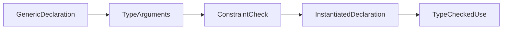

<TLDR>
  <TLDRCell label="what">
    <Term id="type-parameter">类型参数（type parameter）</Term>是声明中的占位类型；实例化时，每个参数由一个满足约束的类型实参替换。
  </TLDRCell>
  <TLDRCell label="trap">
    约束同时限制可接受的类型与泛型代码可执行的操作。`comparable` 允许 `==`，但接口类型实参仍可能因不可比较的动态值而在运行时 panic。
  </TLDRCell>
  <TLDRCell label="fix">
    从签名需要保持的类型关系和函数体需要的操作推导最小约束，再用命名类型、零值和接口动态值验证边界。
  </TLDRCell>
</TLDR>

## 是什么，为什么存在

类型参数让一个函数、类型、别名或方法把部分类型留到实例化时再确定。声明 `func Last[S ~[]E, E any](values S) (E, bool)` 后，`S` 表示切片类型，`E` 表示元素类型；一次调用仍只使用一组具体静态类型，不会把每个值装进 `any`。

它解决的核心问题是表达类型之间的关系。若输入是 `[]Invoice`，结果应是 `Invoice`；若 map 的键是 `UserID`，查找参数也应是 `UserID`。普通接口值可以隐藏动态类型，却无法直接表达这些位置必须使用同一具体类型。

每个类型参数都有约束。约束既决定哪些类型实参合法，也决定实现能对参数值执行哪些操作。`any` 只提供所有类型共有的操作；`comparable` 增加相等比较；带方法或 type term 的自定义约束可以更精确。

你会在通用算法、容器、适配函数和标准库的 `slices`、`maps`、`cmp` 中遇到类型参数。如果参数只出现一次且约束是 `any`，它通常没有保留任何关系，普通参数或接口可能更直接。

## 工作原理

### 声明与实例化

类型参数列表写在声明名称后的方括号中。每个名称都必须出现并带有约束，相邻参数使用同一约束时可以合写，例如 `[K, V comparable]`。参数名称只在声明的作用域内表示尚未确定的类型。

类型实参写在方括号中，例如 `Index[SKU, int]`。实例化会建立具体声明，并检查每个实参是否满足对应约束。`Index[SKU, int]` 与 `Index[string, int]` 是不同的实例化类型，`SKU` 的底层类型是 `string` 也不会让二者自动相同。

泛型函数必须先完成实例化，才能调用或作为函数值使用。调用点经常省略部分或全部类型实参，由编译器推断；泛型类型在使用时则必须实例化，不能把 `Index[K, V]` 简写成未带实参的 `Index`。



### 约束与类型集

<Term id="generic-constraint">泛型约束（generic constraint）</Term>是接口。接口定义一个<Term id="type-set">类型集（type set）</Term>，类型实参必须满足这个集合的规则。编译器只允许使用集合中每个候选类型都支持的操作。

方法元素、嵌入接口和 type term 会缩小候选集合。分行写出的元素取交集，`|` 连接的 term 在该元素内部取并集。因此，同时要求 `~string` 与 `IsValid() bool` 表示「底层类型是 `string`，并且具有该方法」，不是二选一。

普通 term `string` 只包含预声明类型 `string`。`~string` 还包含 `type OrderID string` 这样的命名类型，因为其<Term id="underlying-type">底层类型（underlying type）</Term>是 `string`。`~` 不执行转换，它只改变编译期类型集。

| 约束 | 接受的代表性类型 | 实现可依赖的能力 |
| --- | --- | --- |
| `any` | 任意类型 | 赋值、传递和返回 |
| `comparable` | 满足约束规则的可比较类型 | `==`、`!=`，也可作为 map 键 |
| `~int | ~int64` | 对应底层类型的命名或预声明类型 | 集合内共同支持的整数运算 |
| `interface { ~string; IsValid() bool }` | 带指定方法的字符串底层类型 | 字符串运算与 `IsValid` 调用 |

### 推断来自已知关系

<Term id="type-inference">类型推断（type inference）</Term>把普通实参类型、约束关系和函数上下文中的已知类型统一起来。对于 `[S ~[]E, E any]`，传入 `Stages` 后先得到 `S = Stages`，再由 `Stages` 的底层切片类型求出 `E = string`。

调用方可以只写开头一部分类型实参，让编译器推断剩余部分。显式参数必须按声明顺序提供，因此参数顺序会影响 API 是否顺手。通常把最可能需要显式指定、且能帮助推断其他参数的类型放在前面。

推断需要证据。某个类型参数只出现在返回值中，而调用上下文又没有适用的函数类型信息时，调用方必须明确写出实参。编译器不会因为你稍后把结果赋给某个变量，就在所有场景中任意反向猜测类型。

Go 1.27 把涉及函数的类型推断扩展到所有赋值上下文，但这没有取消约束检查。真实调用点仍应覆盖命名类型、未类型化常量、`nil` 和泛型函数值，因为这些输入比简单字面量更容易暴露推断假设。

### 接收器参数与泛型方法

泛型类型的方法要在接收器规格中声明与基类型一一对应的参数。`func (index Index[Key, Value]) Put(...)` 中的 `Key` 与 `Value` 是该方法使用的接收器类型参数；名称不必与 `Index[K, V]` 的 `K`、`V` 相同，约束由基类型定义隐含给出。

Go 1.27 还允许方法在方法名后声明自己的额外类型参数，例如 `Apply[F any]`。这类泛型方法与接收器参数是两层声明：接收器参数描述已有泛型基类型，方法参数描述该操作新增的类型关系。

接口方法仍不能声明类型参数，泛型方法也不能用来实现接口方法。需要参与接口分派的行为应保留普通方法；只属于一个具体类型、并且确实需要新增类型关系的操作才适合泛型方法。

## 示例

### 从命名切片推断元素类型

`Last` 同时保留切片类型 `S` 和元素类型 `E`。`~[]E` 让 `Stages` 这样的命名切片参与推断，空输入则用布尔值区分合法的元素零值。

<Depth level="quick">

```go
package main

import "fmt"

type Stages []string

func Last[S ~[]E, E any](values S) (E, bool) {
	if len(values) == 0 {
		var zero E
		return zero, false
	}
	return values[len(values)-1], true
}

func main() {
	stage, ok := Last(Stages{"build", "review", "publish"})
	fmt.Printf("%q %t\n", stage, ok)

	empty, ok := Last(Stages(nil))
	fmt.Printf("%q %t\n", empty, ok)
}
```

```text
"publish" true
"" false
```

<TryToBreak items={['nil 的 Stages 值', '只含一个元素的切片', '命名的 []int 切片']} />

</Depth>

调用点没有写任何类型实参。编译器从 `Stages` 同时得到 `S` 与 `E`，而返回值保持元素类型 `string`。若声明只写 `[S any]`，函数体就不能对 `S` 使用 `len` 或索引，因为 `any` 没有证明这些操作可用。

### 让 type term 与方法相交

`LabelledID` 同时要求字符串底层类型和校验方法。函数可以调用 `IsValid`，也可以把 `id` 显式转换成 `string`；预声明类型 `string` 没有该方法，因此不满足约束。

```go
package main

import (
	"fmt"
	"strings"
)

type LabelledID interface {
	~string
	IsValid() bool
}

type OrderID string

func (id OrderID) IsValid() bool {
	return strings.HasPrefix(string(id), "ord-") && len(id) > 4
}

func Describe[T LabelledID](id T) string {
	if !id.IsValid() {
		return "invalid order"
	}
	return "order " + string(id)
}

func main() {
	fmt.Println(Describe(OrderID("ord-2048")))
	fmt.Println(Describe(OrderID("2048")))
}
```

```text
order ord-2048
invalid order
```

这个约束适合算法确实同时依赖表示与行为的情况。若实现只调用 `IsValid`，去掉 `~string` 会接纳更多合法实现；若只处理字符串运算，校验方法也不应成为约束。

### 在接收器中重声明类型参数

`Index` 的键和值在实例化时确定。方法接收器故意使用 `Key`、`Value`，说明这些是与基类型位置对应的新名称，而不是从包级作用域寻找的类型。

```go
package main

import "fmt"

type Index[K comparable, V any] map[K]V

func NewIndex[K comparable, V any]() Index[K, V] {
	return make(Index[K, V])
}

func (index Index[Key, Value]) Put(key Key, value Value) {
	index[key] = value
}

func (index Index[Key, Value]) Lookup(key Key) (Value, bool) {
	value, ok := index[key]
	return value, ok
}

type SKU string

func main() {
	prices := NewIndex[SKU, int]()
	prices.Put(SKU("chair"), 79)
	prices.Put(SKU("lamp"), 35)

	price, ok := prices.Lookup(SKU("chair"))
	fmt.Println(price, ok)

	missing, ok := prices.Lookup(SKU("desk"))
	fmt.Println(missing, ok)
}
```

```text
79 true
0 false
```

`NewIndex` 必须显式得到 `SKU` 和 `int`，因为它没有普通实参提供推断证据。`Lookup` 返回 `(Value, bool)`，所以价格 `0` 不会与缺失混淆。map 的零值可读但不可写，构造函数保证 `Put` 前已经初始化。

### 暴露 `comparable` 的运行时边界

从 Go 1.20 起，普通接口类型可以满足 `comparable` 约束，即使它不是严格可比较类型。因此 `Equal[any]` 可以实例化；真正比较时，如果两个接口装入相同的不可比较动态类型，仍会 panic。

```go
package main

import "fmt"

func Equal[T comparable](left, right T) bool {
	return left == right
}

func showComparison(label string, compare func() bool) {
	defer func() {
		if problem := recover(); problem != nil {
			fmt.Printf("%s panic: %v\n", label, problem)
		}
	}()
	fmt.Printf("%s: %t\n", label, compare())
}

func main() {
	showComparison("integers", func() bool {
		return Equal(7, 7)
	})

	showComparison("interfaces", func() bool {
		var left any = []int{1}
		var right any = []int{1}
		return Equal(left, right)
	})
}
```

```text
integers: true
interfaces panic: runtime error: comparing uncomparable type []int
```

示例用 `recover` 只是为了把边界显示出来，不是推荐的通用修复。若键或相等比较来自外部动态值，应使用明确的具体键类型或先验证动态类型；`comparable` 不能把任意接口内容变成安全键。

## 陷阱

### 把约束当作隐式转换

> [!PITFALL]
> `T ~int` 表示 `T` 的底层类型是 `int`，并不表示函数体中的值已经转换成预声明类型。返回 `T` 时仍会保留 `UserID` 或 `Score` 的静态类型。

**修复方法：** 需要转换时明确写 `int(value)`，并确认丢失命名类型是否符合 API 契约。若算法可以保留 `T`，就让参数和返回值继续使用同一个类型参数。

### 误以为 `comparable` 永不 panic

> [!PITFALL]
> `comparable` 证明 `==` 在泛型函数体中合法，却不保证接口实参装入的每个动态值都严格可比较。`any` 中的切片、map 或函数仍会让相等比较或 map 插入 panic。

**修复方法：** 领域键优先使用具体命名类型。必须接收接口键时，在进入泛型容器前验证动态类型，并测试切片、map、函数和带类型的 nil 等边界值。

### 期待返回值凭空提供推断证据

> [!PITFALL]
> `func Zero[T any]() T` 的调用没有普通实参。写 `value := Zero()` 时，编译器没有足够信息确定 `T`，因此调用无效。

**修复方法：** 写成 `Zero[Duration]()`，或者重新设计 API，让输入参数携带类型关系。不要加入无意义的哑元值，只为省掉清楚的类型实参。

### 混淆接收器参数与方法参数

> [!PITFALL]
> `Stack[T]` 接收器中的 `T` 对应基类型已有参数。Go 1.27 的 `Map[U any]` 则是方法自己的额外参数；二者作用域与用途不同，接口方法也不能声明后一种参数。

**修复方法：** 先标出每个参数由基类型还是单次操作拥有。行为要参与接口分派时使用普通方法；额外类型只描述一次转换时，使用 Go 1.27 泛型方法或独立泛型函数。

### 忽略实例化后的零值契约

> [!PITFALL]
> `var store Store[K, V]` 的字段会按实际类型实参取得零值。切片字段通常可直接 append，nil map 字段却会在首次写入时 panic；返回的 `V` 零值也可能是合法数据。

**修复方法：** 为每个实例化后的表示定义零值是否可用。需要初始化 map 时提供构造函数或惰性初始化，查找与删除则用 `(V, bool)` 或 `(V, error)` 表达缺失。

## AI 时代

**生成代码在这里常犯的错**

模型常先写 `[T any]`，随后在函数体中对 `T` 使用 `<`、`+`、索引或字段选择，得到无法编译的实现。它也会把 `int` 写进 union 而遗漏 `~int`，意外拒绝 `UserID` 等领域类型；或者看到 `comparable` 就生成 `map[any]V`，完全忽略动态切片键会 panic。面向旧版 Go 的训练样本还会断言方法永远不能声明额外类型参数，与 Go 1.27 不符。

**让 AI 检查**

- 为每个类型参数列出推断来源、完整 type set，以及函数体中每项操作的约束依据。
- 用预声明类型、相同底层类型的命名类型、零值和装有切片的接口值编译并运行测试。
- 区分接收器类型参数、Go 1.27 方法类型参数与接口方法，并标出代码要求的最低 Go 版本。

**审查清单**

- 检查每个类型参数是否保持真实关系，而不是只出现一次的语法装饰。
- 检查约束是否既支持实现所需操作，又没有排除应当接纳的命名类型。
- 检查推断失败、nil 容器和接口动态值是否有明确测试，而不只测试整数字面量。

**提示词词汇**

使用准确术语：`type parameter`（类型参数）、`type argument`（类型实参）、`constraint`（约束）、`type set`（类型集）、`type term`（类型项）、`underlying type`（底层类型）、`constraint satisfaction`（约束满足）、`strict comparability`（严格可比较性）、`type inference`（类型推断）、`instantiation`（实例化）、`receiver type parameter`（接收器类型参数）和 `generic method`（泛型方法）。要求模型给出「声明、推断、约束检查、实例化、运行时动态值」的证据链。

<Depth level="deep">

## 类型集的代数规则

### 交集来自独立元素

接口的每个独立元素都会缩小 type set。方法元素保留方法集中包含该方法的类型，嵌入接口保留其 type set，单个 type term 保留该 term 表示的类型。一个类型必须通过所有元素，才能满足整个约束。

这种规则让表示与行为可以同时出现。`interface { ~string; MarshalText() ([]byte, error) }` 只接纳底层类型为 `string` 且具有该方法的类型。预声明 `string` 虽然符合第一个元素，却没有该方法，因此不在最终交集中。

交集也可能为空。两个互不相容的 term 分行出现时，没有类型能同时满足它们；声明本身可能看起来规整，但任何实例化都会失败。审查自定义约束时，应拿至少一个真实领域类型做编译断言，而不是只看语法。

### union 只合并同一元素中的 term

`~int | ~int64` 是一个 union 元素，匹配任一 term 即可。约束中的其他分行元素仍与这个 union 相交，所以增加方法要求后，两个分支中的类型都必须实现该方法。

多项 union 中的非接口 term 必须两两不相交。`int | ~int` 非法，因为 `~int` 已经包含 `int`。这个限制让一个具体类型不会通过同一 union 的多个重叠分支进入集合。

union 是封闭清单，不会因为语言以后加入新数值类型就自动扩展。若算法的顺序来自领域规则，接收比较函数往往比维护巨大的数值 union 更清楚；若 API 就要固定表示，封闭清单反而是有意的边界。

### `~` 只检查底层类型

在近似 term `~T` 中，`T` 必须是自身的底层类型，而且不能是类型参数。若 `type UserID int`，约束应写 `~int`，不能写 `~UserID` 来表示同一族类型。

底层类型相同不表示两个命名类型可直接互相赋值。`UserID` 与 `OrderID` 即使都以 `int` 为底层类型，也保留不同身份。约束只证明它们可以分别实例化算法，不会在两者之间建立赋值兼容性。

保留命名类型通常比先转换更安全。`func Double[T ~int](value T) T` 返回调用方原有的 `T`，所以 `UserID` 不会悄悄变成可与其他整数混用的 `int`。

### 基本接口与仅约束接口

只通过方法描述 type set 的基本接口可以作为普通变量类型。`io.Reader` 值能在运行时保存不同具体实现，因为它的接口语义完全由方法集表达。

包含非接口 type term、`~T` 或 union 的接口不是基本接口，只能用作约束或嵌入其他约束。不能声明一个普通变量来保存「任意有序值」，因为这样的值还需要一种统一的运行时表示与操作规则。

因此，约束与接口值虽然都使用 `interface` 语法，却承担不同角色。约束筛选实例化时的静态类型，接口值封装运行时动态类型；把二者混为一谈，常会产生多余的类型 switch。

## 推断、实例化与方法边界

### 推断求解签名中的关系

函数实参推断会比较形参与实参类型。形参是 `[]E` 而实参是 `[]Invoice` 时，`E` 可求为 `Invoice`；形参是 `S` 且约束为 `S ~[]E` 时，编译器还能沿约束关系求出元素类型。

同一类型参数出现在多个位置时，各位置必须给出相容答案。`Pair[T any](left, right T)` 不会在 `int` 与 `string` 之间自动选择 `any`，因为一次实例化中的 `T` 必须是一个具体类型。

未类型化常量会参与表示性与默认类型规则。`Choose(1, 2.5)` 的推断结果可能与两个已经带类型的变量不同。公共 API 的测试若只有整数字面量，容易漏掉命名类型和混合常量暴露的问题。

### 显式前缀与参数顺序

类型实参列表可以给出声明列表的前缀，再推断后续参数。若某个参数经常必须显式给出，把它放在前面可以让调用方写较短的部分实例化；放在后面则可能迫使调用方把前面的参数也写出。

这不是单纯的美观问题。类型参数顺序一旦进入导出 API，调用形式和函数值实例化都会依赖它。发布前应使用真实回调、命名集合类型与 nil 输入编译调用点。

类型参数不应仅为将来可能的用途提前加入。每增加一个参数，调用者和推断器都多一个需要求解的维度。先让签名表达当前关系，新增关系时再演进 API，通常更容易理解。

### 接收器重新声明已有关系

泛型基类型的方法接收器必须提供与基类型相同数量的参数名称。它们的位置决定对应关系，基类型定义决定约束；方法不需要也不能在接收器中改写这些约束。

接收器可以重命名参数，甚至使用空白标识符忽略不需要的一个。重命名有时能让方法局部语义更清楚，但同一类型的方法若不断更换名称，也会增加阅读成本。

值接收器与指针接收器的普通方法集规则仍然适用。类型参数不会让值接收器自动获得可变身份，也不会让 `Container[T]` 与 `*Container[T]` 同时满足所有接口。

### Go 1.27 泛型方法的新增边界

Go 1.27 以前，方法只能使用接收器带来的类型参数；需要新的 `U` 时通常写独立泛型函数。Go 1.27 允许方法名后出现独立类型参数，因此具体类型可以直接拥有跨类型转换操作。

泛型方法在调用或作为函数值使用前仍要实例化。推断可以减少显式实参，但不会让方法参数脱离其约束，也不会改变接收器基类型的身份。

接口方法禁止声明类型参数，因此泛型方法不能满足某个参数化接口方法。若调用方需要通过接口统一分派，应该把变化放进接口自身的类型参数、普通方法签名或调用方提供的函数，而不是依赖不存在的泛型接口方法。

## 严格可比较性与接口例外

### 可比较不等于严格可比较

Go 的接口值可以使用 `==`，所以接口类型属于可比较类型。但比较两个接口值时，如果它们装入相同的动态类型，运行时还必须比较动态值；动态类型为切片、map 或函数时，这一步会 panic。

严格可比较类型排除了接口类型，也排除了含接口字段的复合类型。布尔、数值、字符串、指针和通道是严格可比较的；数组与结构体则要求其组成部分也严格可比较。

`comparable` 的 type set 由严格可比较的非接口类型构成。Go 1.20 增加的约束满足例外又允许普通可比较接口类型作为实参，因此「实参满足 `comparable`」与「所有运行时动态值都安全」不是同一句话。

### map 键共享同一风险

泛型 map 的 `K comparable` 让声明可以编译，也保证具体严格可比较键在静态上安全。若实例化成 `map[any]V`，插入装有切片的键时仍会在哈希阶段 panic。

不要用 `recover` 把这种设计缺陷改造成正常控制流。更稳妥的边界是把外部值规范化为 `UserID`、字符串或固定字段结构体，并在构造键之前拒绝不支持的动态形状。

测试应覆盖动态类型相同但不可比较的两个接口值，因为不同动态类型会直接比较为不等，可能掩盖问题。map 插入与直接 `==` 都要测试，它们触发风险的路径不同。

## 诊断与 API 审查

### 从编译错误回到约束

出现 `operator < not defined on T` 一类错误时，先看 `T` 的约束，不要立刻加入类型 switch。列出函数体实际需要的操作，再判断应使用标准约束、自定义 type set、方法约束还是调用方提供的函数。

约束错误也可能出现在调用点。把报错中的推断类型、显式类型实参与约束逐一写开，通常能区分「推断证据不足」「实参不属于 type set」和「函数体使用了集合未保证的操作」。

编译器版本会改变可用语法和部分推断范围。包含 Go 1.27 泛型方法的模块应在 `go.mod` 和 CI 工具链中明确最低版本，避免旧编译器给出看似是声明错误的版本不匹配信息。

### 用编译断言固定边界

约束没有运行时对象可供遍历，最直接的契约测试是让代表性类型完成实例化。至少包含一个预声明类型、一个应接纳的命名类型，以及一个放在负向编译测试或分析样例中的拒绝类型。

运行时测试仍有必要。零值、nil map 与接口动态值的行为发生在实例化之后，单纯证明约束满足并不能证明 API 契约完整。测试应通过公开函数观察结果，而不是依赖编译器内部的代码生成策略。

最后检查类型参数是否真的出现在关系两端。若 `[T any]` 只出现一次、实现也不依赖 `T`，删掉它通常会得到更小、更稳定的 API。

</Depth>

<Checkpoint id="go/type-parameters" />

## 延伸阅读

- [Go 语言规范：类型参数声明](https://go.dev/ref/spec#Type_parameter_declarations)
- [Go 语言规范：类型集](https://go.dev/ref/spec#Type_sets)
- [Go 语言规范：类型推断](https://go.dev/ref/spec#Type_inference)
- [Go 语言规范：满足类型约束](https://go.dev/ref/spec#Satisfying_a_type_constraint)
- [Go 博客：泛型方法](https://go.dev/blog/generic-methods)
