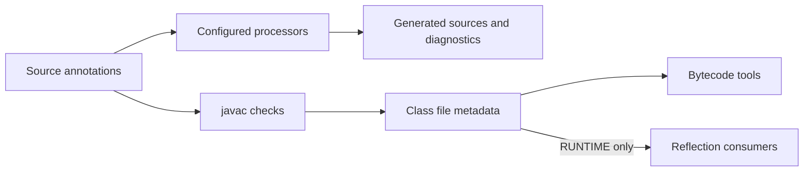

<TLDR>
  <TLDRCell label="what">
    An <Term id="annotation">annotation</Term> is structured metadata attached to a Java declaration or type use; it has an effect only when a compiler, processor, framework, or application reads it.
  </TLDRCell>
  <TLDRCell label="trap">
    Writing an annotation doesn't run a check or change behavior; the wrong `@Retention`, `@Target`, or reflection query can make metadata invisible or put it in the wrong place.
  </TLDRCell>
  <TLDRCell label="fix">
    Identify the consumer and reading phase first, then declare the target and retention explicitly and test the contract through compilation or reflection.
  </TLDRCell>
</TLDR>

## What it is and why it exists

A Java annotation is a structured record attached to a declaration such as a class, method, field, or parameter, or to certain uses of a type. It keeps “what extra meaning does this code have?” next to the program element being described instead of burying that information in naming conventions, external XML, or repeated registration code.

An annotation doesn't call a method, enforce authorization, or inject a dependency by itself. It is metadata whose semantics come from a consumer: the compiler checks `@Override`, a compile-time processor can generate files or report errors, and runtime code can use <Term id="reflection">reflection</Term> to read a `RUNTIME` annotation. Without a consumer, `@Audited` is only a behaviorless marker.

You'll encounter annotations in compiler diagnostics, test discovery, serialization mapping, dependency injection, route registration, and static analysis. They fit finite, declarative configuration that a tool can interpret consistently. An ordinary Java API is usually clearer when you need arbitrary control flow, dynamic data, or complex object relationships.

An annotation contract has three parties: the author declaring the annotation interface, the caller applying it, and the consumer reading it. Element names aren't enough; the contract must also specify allowed locations, how long metadata is retained, what defaults mean, repeat and inheritance rules, and what the consumer does when the annotation is absent.

## How it works

You declare an annotation interface with `@interface`. Its no-argument methods define annotation elements, and an annotation use supplies values for those elements. A sole element named `value` may omit its name, so `@Role("admin")` is equivalent to `@Role(value = "admin")`.

An annotation element's return type is limited to a primitive type, `String`, `Class`, an enum, another annotation, or a one-dimensional array of one of those types. Elements can't accept parameters or declare type parameters, and annotation values can't be `null`. A default belongs to the annotation interface rather than being copied into every use; changing it affects later reads of existing binary annotations.

### Meta-annotations define the contract

A <Term id="meta-annotation">meta-annotation</Term> annotates another annotation interface and controls its language-level behavior. The five common meta-annotations answer separate questions.

| Meta-annotation | What it controls | Typical decision |
| --- | --- | --- |
| `@Target` | Declaration or type contexts where the annotation may appear | Whether the consumer actually scans fields, methods, or type uses |
| `@Retention` | Whether metadata survives in source, class files, or runtime | Whether the consumer reads before compilation, from class files, or at runtime |
| `@Documented` | Whether Javadoc includes the annotation in public docs | Whether the annotation is part of the public API contract |
| `@Inherited` | Whether a class query searches its superclass chain | It affects class inheritance only, not interfaces or members |
| `@Repeatable` | Whether the same annotation type may appear repeatedly at one location | Whether the container remains compatible with the repeated annotation |

Without `@Target`, an annotation applies in most declaration contexts, but that doesn't make it applicable to type parameter declarations or type-use contexts. An explicit `@Target` lets the compiler reject misplaced uses and tells readers what the consumer should scan. Java 25 targets also include `TYPE_PARAMETER`, `TYPE_USE`, `MODULE`, and `RECORD_COMPONENT`.

A <Term id="retention-policy">retention policy</Term> determines the last phase in which a consumer can see the metadata. Omitting `@Retention` selects `CLASS`, not `RUNTIME`.

| Policy | Retained through | Typical consumer |
| --- | --- | --- |
| `SOURCE` | Source only; the compiler doesn't write it to class files | Compiler checks, source tools, and annotation processors |
| `CLASS` | Class files, without required reflection visibility | Bytecode analysis or transformation tools; this is the default |
| `RUNTIME` | Class files and runtime reflection | Runtime frameworks and application code |

The following diagram separates the three main consumption paths. The compiler always checks annotation syntax and applicability; build configuration and retention decide whether processors run and whether metadata remains visible at runtime.



### Declaration annotations and type-use annotations

A declaration annotation describes a program element, such as whether a method is a route. A <Term id="type-use-annotation">type-use annotation</Term> describes a particular occurrence of a type, such as the type argument in `List<@NonEmpty String>`. They can appear near each other in source while belonging to different reflection models.

Objects such as `Class`, `Method`, and `Field` implement `AnnotatedElement` and expose declaration-annotation queries. Type-use annotations are read through interfaces such as `AnnotatedType` and `AnnotatedParameterizedType`. Calling only `method.getAnnotation(...)` doesn't descend into nested type arguments in the return type.

### Predefined annotations

`@Override` asks the compiler to confirm that a method really overrides or implements an overridable declaration, preventing compilation after a rename or signature mistake. `@FunctionalInterface` confirms that an interface satisfies functional-interface rules, though an eligible interface without it can still be a lambda target.

`@Deprecated` marks an API that callers should stop using; `since` records the version in which deprecation began, while `forRemoval` signals an intent to remove it in a future release. A public API should usually also explain the replacement in the Javadoc `@deprecated` tag.

`@SuppressWarnings` changes compiler diagnostics but doesn't repair a type-safety problem. Place it on the smallest declaration that covers the issue and use a specific warning name recognized by the target compiler. `@SafeVarargs` is an even stronger assertion by the author; the compiler doesn't prove that the method body avoids polluting the varargs array.

## Examples

These four examples progress through runtime reading, repeatable annotations, inheritance boundaries, and type-use locations. The shown output comes from compiling and running the same sources with local OpenJDK 21.0.12; every example uses semantics supported by both Java 21 and Java 25.

### Define and read a runtime annotation

The first example stores an HTTP method and path as route metadata, then sorts methods by name before reading it. `method` has a default, so callers provide it only for a route other than `GET`.

<Depth level="quick">

```java
import java.lang.annotation.*;
import java.lang.reflect.Method;
import java.util.Arrays;
import java.util.Comparator;

enum HttpMethod { GET, POST }

@Retention(RetentionPolicy.RUNTIME)
@Target(ElementType.METHOD)
@interface Route {
    String path();
    HttpMethod method() default HttpMethod.GET;
}

class OrderController {
    @Route(path = "/orders")
    public void list() {}

    @Route(path = "/orders", method = HttpMethod.POST)
    public void create() {}
}

public class RouteAnnotations {
    public static void main(String[] args) {
        Arrays.stream(OrderController.class.getDeclaredMethods())
                .sorted(Comparator.comparing(Method::getName))
                .forEach(method -> {
                    Route route = method.getAnnotation(Route.class);
                    System.out.printf("%s %s -> %s()%n",
                            route.method(), route.path(), method.getName());
                });
    }
}
```

```text
POST /orders -> create()
GET /orders -> list()
```

</Depth>

`@Retention(RUNTIME)` is necessary for reflection to succeed, while `@Target(METHOD)` makes the compiler reject `@Route` on a field. Sorting isn't an annotation feature: `getDeclaredMethods()` doesn't promise declaration order, so stable output requires an explicit sort.

A real router must also handle duplicate paths, argument binding, accessibility, and invocation failures. The annotation provides a description for registration; it doesn't replace those runtime policies.

### Expand a repeatable annotation correctly

A <Term id="repeatable-annotation">repeatable annotation</Term> needs a container annotation whose `value()` returns an array of the repeated type. Reading code should call `getAnnotationsByType(Role.class)`, letting reflection handle both one annotation and the container form.

```java
import java.lang.annotation.*;
import java.util.Arrays;

@Retention(RetentionPolicy.RUNTIME)
@Target(ElementType.TYPE)
@Repeatable(Roles.class)
@interface Role {
    String value();
}

@Retention(RetentionPolicy.RUNTIME)
@Target(ElementType.TYPE)
@interface Roles {
    Role[] value();
}

@Role("reader")
@Role("auditor")
class ReportService {}

public class RepeatableAnnotations {
    public static void main(String[] args) {
        Role[] roles = ReportService.class.getAnnotationsByType(Role.class);
        System.out.println(Arrays.stream(roles)
                .map(Role::value)
                .toList());
        System.out.println(ReportService.class.getAnnotation(Role.class));
        System.out.println(ReportService.class.getAnnotation(Roles.class) != null);
    }
}
```

```text
[reader, auditor]
null
true
```

With two `@Role` uses at the same location, the class file represents them through their container, so the singular `getAnnotation(Role.class)` query returns `null`. The by-type query expands the container and preserves definition order; querying the container directly also sees it, but couples the caller to its storage form.

The container and repeated annotation must have compatible retention and targets. Giving `Role` `RUNTIME` while omitting `RUNTIME` from its container is a compile-time error, not a contract that silently loses half its data at runtime.

### Verify the boundary of `@Inherited`

`@Inherited` changes only the rules for querying annotations on classes. It doesn't make an implementing class inherit annotations from an interface, and it doesn't make an overriding method inherit annotations from the superclass method.

```java
import java.lang.annotation.*;

@Inherited
@Retention(RetentionPolicy.RUNTIME)
@Target(ElementType.TYPE)
@interface Audited {}

@Retention(RetentionPolicy.RUNTIME)
@Target(ElementType.METHOD)
@interface Operation {}

@Audited
class BaseService {
    @Operation
    public void run() {}
}

class ChildService extends BaseService {
    @Override
    public void run() {}
}

@Audited
interface AuditedContract {}

class ContractService implements AuditedContract {}

public class InheritedAnnotations {
    public static void main(String[] args) throws Exception {
        System.out.println("class: "
                + ChildService.class.isAnnotationPresent(Audited.class));
        System.out.println("interface: "
                + ContractService.class.isAnnotationPresent(Audited.class));
        System.out.println("method: "
                + ChildService.class.getMethod("run")
                        .isAnnotationPresent(Operation.class));
    }
}
```

```text
class: true
interface: false
method: false
```

`ChildService` doesn't declare `@Audited` directly, but its class query finds the annotation along the direct superclass chain. The interface path for `ContractService` doesn't participate, and the overriding `ChildService.run()` must declare `@Operation` itself unless a framework implements a different merge algorithm.

Frameworks often scan interfaces, bridge methods, superclass methods, and meta-annotations to offer richer semantics than core reflection. Don't restate one framework's merge rules as general rules of the Java language or `AnnotatedElement`.

### Read a nested type-use annotation

The last example puts `@NonEmpty` on the type argument of a `List`. The reading path starts at the method's annotated return type, enters the parameterized type, and queries its first type argument.

```java
import java.lang.annotation.*;
import java.lang.reflect.AnnotatedParameterizedType;
import java.lang.reflect.AnnotatedType;
import java.lang.reflect.AnnotatedElement;
import java.lang.reflect.Method;
import java.util.List;

@Retention(RetentionPolicy.RUNTIME)
@Target(ElementType.TYPE_USE)
@interface NonEmpty {}

class MessageApi {
    public List<@NonEmpty String> labels() {
        return List.of("urgent");
    }
}

public class TypeUseAnnotations {
    public static void main(String[] args) throws Exception {
        Method method = MessageApi.class.getMethod("labels");
        AnnotatedType result = method.getAnnotatedReturnType();
        AnnotatedType argument = ((AnnotatedParameterizedType) result)
                .getAnnotatedActualTypeArguments()[0];

        System.out.println(result.getType().getTypeName());
        System.out.println(annotationNames(argument));
        System.out.println(method.getDeclaredAnnotations().length);
    }

    static List<String> annotationNames(AnnotatedElement element) {
        return List.of(element.getAnnotations()).stream()
                .map(annotation -> annotation.annotationType().getSimpleName())
                .toList();
    }
}
```

```text
java.util.List<java.lang.String>
[NonEmpty]
0
```

The method declaration has no annotations, so `getDeclaredAnnotations()` has length `0`. The metadata sits inside the return type; a validator that inspects only the `Method` misses it.

`@NonEmpty` still doesn't check list elements by itself. A static analyzer, bytecode tool, or runtime validator has to define and implement its semantics before the type qualifier produces a diagnostic or behavior.

## Pitfalls

### Treating an annotation as behavior

> [!PITFALL]
> Generating `@RequiresRole("admin")`, `@Transactional`, or `@NonNull` doesn't establish authorization, transactions, or null checks. If the relevant consumer isn't installed, enabled, or present on that call path, program behavior doesn't change.

**Fix:** Identify the exact compiler, processor, framework component, or application code responsible for interpreting the annotation, then write a failing case for it. A security control must prove that an unauthorized request is rejected, not merely that reflection can see the annotation.

### Forgetting that the default retention is `CLASS`

> [!PITFALL]
> A custom annotation without `@Retention` enters the class file but isn't visible to `getAnnotation()` at runtime. Code often mistakes the resulting `null` for “no restriction,” turning configuration failure into a security problem.

**Fix:** A runtime consumer needs `RUNTIME`; compile-time-only work should prefer `SOURCE` or the policy it explicitly requires. Test visibility in the consumer's phase instead of checking only that an `@` marker exists in source.

### Mixing direct, inherited, and by-type queries

> [!PITFALL]
> `getDeclaredAnnotation()`, `getAnnotation()`, and `getAnnotationsByType()` have different search and container-expansion rules. A mechanical singular query misses repeatable annotations, while a mechanical inheritance query can misrepresent superclass configuration as directly declared on the subclass.

**Fix:** State whether the consumer accepts indirect presence, `@Inherited`, and repeatable containers. Test zero, one, and multiple annotations, plus superclass, interface, and overriding-method boundaries separately.

### Using targets and warning suppression that are too broad

> [!PITFALL]
> Omitting `@Target` permits many locations with no consumer semantics, while class-level `@SuppressWarnings` hides new problems across the class. A broad scope looks convenient but removes constraints the compiler could enforce.

**Fix:** List only the `ElementType` values the consumer really scans, and narrow warning suppression to the smallest declaration. Each suppression should correspond to a warning you understand and can't eliminate at that boundary.

### Assuming a processor runs automatically

> [!PITFALL]
> Putting a processor JAR only on the ordinary class path doesn't guarantee that Java 25 `javac` will execute it. The build may succeed without explicitly configured processing while omitting required generated code or diagnostics.

**Fix:** Configure the processor path or module path explicitly and express processing intent with `-processor`, `-proc:full`, or `-proc:only`. Continuous integration should compile from a clean generated directory and assert that the expected files or errors actually appear.

### Evolving a public annotation interface casually

> [!PITFALL]
> Adding an element without a default makes existing source uses omit a required value when recompiled. Removing an element, changing its type, or narrowing its target can also break source, processors, or reads of existing binary metadata.

**Fix:** Evolve an annotation interface as public API. A new element usually needs a semantically safe default; compatibility tests should include old and new callers, processors, and runtime readers.

<Depth level="deep">

## Processing rounds and discovery

<Term id="annotation-processing">Annotation processing</Term> works on the language model during compilation, not on runtime `Class` objects. A processor uses `RoundEnvironment` to inspect roots and elements marked with supported annotations, reports diagnostics through `Messager`, and can create new sources, class files, or resources through `Filer`.

Processing happens in rounds. If a round generates source, the compiler parses those files and starts another round; when no new files appear, it enters the final round. A processor shouldn't try to overwrite existing source or assume it is called only once. Generated names must be stable because creating the same file twice raises `FilerException`.

A `true` result from `process()` means the processor claims those annotation types, so later processors don't receive them; `false` lets other processors continue. The result isn't a “round succeeded” flag. Report errors as diagnostics, and preserve enough context around generation failures for compilation to stop or identify the fault.

Java 25 `javac` performs processing and compilation only when processing is explicitly configured, such as with `-processor`, a processor path, a processor module path, or `-proc:full`. `-proc:only` runs processing without subsequent compilation, while `-proc:none` disables it. Service-provider configuration still doesn't mean an ordinary class path triggers discovery when no processing option is present.

Processors use `Element` and `TypeMirror` from `javax.lang.model` because a type under compilation may not have a loadable `Class` yet. Trying to load source types through reflection fails around generated types, cross-compilation, module paths, and class files that haven't been written.

## Reflection visibility and repeatable containers

`AnnotatedElement` distinguishes directly present, indirectly present, present, and associated relationships. Singular `getDeclaredAnnotation()` sees direct presence only; plural `getDeclaredAnnotationsByType()` also unfolds a directly present container. The non-`Declared` variants additionally apply `@Inherited` rules to class queries.

When a repeatable annotation grows from one use to two, its binary representation changes from a direct annotation to a container holding both. Code that used `getAnnotation(RepeatableType.class)` can therefore change from returning an object to returning `null`, while `getAnnotationsByType()` crosses that representation change. Consumers supporting repeated semantics should use the by-type query from the beginning.

The annotation objects returned by reflection implement their annotation interfaces and provide specification-defined `equals()`, `hashCode()`, and `toString()` behavior. Business code shouldn't depend on the concrete proxy class name or try to mutate annotation values; if configuration must change at runtime, treat the annotation as an initial description and copy it into an application-owned configuration object.

## Annotation API evolution boundaries

An annotation element's default isn't a constant copied into every use. When an annotation is read, the runtime obtains an omitted value from the current annotation interface definition. Providing a default for a new element can therefore keep old binary uses readable by a new reader, though the new default semantics may still change behavior.

Removing an element or changing its return type deprives processors and reflection consumers of a member they compiled against. If a binary annotation's stored value no longer matches the current interface, accessing the element can also trigger delayed failures such as `IncompleteAnnotationException`, `AnnotationTypeMismatchException`, or `EnumConstantNotPresentException`.

Narrowing `@Target` mostly surfaces errors when callers are recompiled, while changing `@Retention` changes visibility in newly compiled class files. Safe evolution tests both source recompilation and old/new binary combinations, not only one startup of the current application.

</Depth>

<Checkpoint id="java/annotations" />

## Further reading

- [Java Language Specification 25: annotation interfaces](https://docs.oracle.com/javase/specs/jls/se25/html/jls-9.html#jls-9.6)
- [Java Language Specification 25: annotations](https://docs.oracle.com/javase/specs/jls/se25/html/jls-9.html#jls-9.7)
- [Java Language Specification 25: predefined annotation interfaces](https://docs.oracle.com/javase/specs/jls/se25/html/jls-9.html#jls-9.6.4)
- [Java SE 25 API: `java.lang.annotation`](https://docs.oracle.com/en/java/javase/25/docs/api/java.base/java/lang/annotation/package-summary.html)
- [Java SE 25 API: `AnnotatedElement`](https://docs.oracle.com/en/java/javase/25/docs/api/java.base/java/lang/reflect/AnnotatedElement.html)
- [Java SE 25 `javac` documentation](https://docs.oracle.com/en/java/javase/25/docs/specs/man/javac.html)
