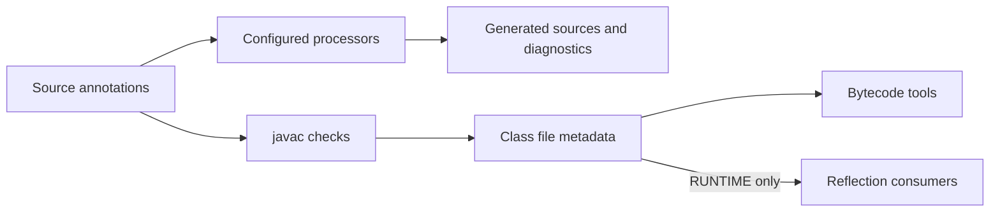

<TLDR>
  <TLDRCell label="what">
    <Term id="annotation">注解（annotation）</Term>是附在 Java 声明或类型使用位置上的结构化元数据；只有编译器、注解处理器、框架或应用代码读取它时，它才产生效果。
  </TLDRCell>
  <TLDRCell label="trap">
    写上注解不等于执行检查或改变行为；错误的 `@Retention`、`@Target` 或反射查询会让元数据不可见或出现在错误位置。
  </TLDRCell>
  <TLDRCell label="fix">
    先确定消费者与读取阶段，再明确目标和保留策略，并用编译测试或反射测试验证注解契约。
  </TLDRCell>
</TLDR>

## 是什么，为什么存在

Java 注解是一条结构化记录，可以附在类、方法、字段、参数等声明上，也可以附在某些类型使用位置上。注解把「这段代码具有什么额外含义」写在被描述的程序元素附近，而不必把这些信息放进命名约定、外部 XML 或重复的注册代码中。

注解本身不会调用方法、执行权限检查或注入依赖。它只是元数据，具体语义来自消费者：编译器能检查 `@Override`，编译期处理器能生成文件或报告错误，运行时代码能通过<Term id="reflection">反射（reflection）</Term>读取 `RUNTIME` 注解。若没有消费者，`@Audited` 只是一个没有行为的标记。

你会在编译器警告、测试发现、序列化映射、依赖注入、路由注册和静态分析中遇到注解。注解适合表达有限、声明式且能由工具统一解释的配置。需要任意控制流、动态数据或复杂对象关系时，普通 Java API 往往更清楚。

注解契约包含三方：声明注解接口的作者、把注解用于代码的调用方，以及读取它的消费者。只写清元素名称还不够；契约还要规定可标注位置、元数据保留到哪个阶段、缺省值含义、重复与继承规则，以及消费者找不到注解时的行为。

## 工作原理

注解接口使用 `@interface` 声明。它的无参数方法定义注解元素，调用注解时则为这些元素提供值。名为 `value` 的单个元素可省略名称，所以 `@Role("admin")` 等价于 `@Role(value = "admin")`。

注解元素的返回类型只能是基本类型、`String`、`Class`、枚举、另一个注解，或这些类型的一维数组。元素不能接收参数或声明类型参数，也不能用 `null` 作为值。缺省值属于注解接口，而不是复制到每个使用点；修改缺省值会影响之后读取既有二进制注解的结果。

### 元注解定义契约

<Term id="meta-annotation">元注解（meta-annotation）</Term>标注另一个注解接口，并控制它的语言级行为。最常用的五个元注解各自解决一个独立问题。

| 元注解 | 控制内容 | 常见判断 |
| --- | --- | --- |
| `@Target` | 注解可出现的声明或类型上下文 | 消费者实际检查字段、方法还是类型使用位置 |
| `@Retention` | 元数据保留到源代码、类文件还是运行时 | 消费者在编译前、类文件中还是运行时读取 |
| `@Documented` | Javadoc 是否把该注解纳入公开文档 | 注解是否属于公开 API 契约 |
| `@Inherited` | 类查询是否沿父类链查找该注解 | 只影响类继承，不影响接口或成员 |
| `@Repeatable` | 同一位置能否直接写多次同类注解 | 容器注解是否与重复注解保持兼容 |

没有 `@Target` 时，注解可用于大多数声明上下文，但不能因此用于类型参数声明或类型使用上下文。明确写出 `@Target` 能让编译器拒绝误放位置，也让读者知道消费者应扫描什么。Java 25 的目标还包括 `TYPE_PARAMETER`、`TYPE_USE`、`MODULE` 与 `RECORD_COMPONENT`。

<Term id="retention-policy">保留策略（retention policy）</Term>决定消费者在哪个阶段还能看到元数据。未声明 `@Retention` 时默认为 `CLASS`，不是 `RUNTIME`。

| 策略 | 保留范围 | 典型消费者 |
| --- | --- | --- |
| `SOURCE` | 仅源代码，编译器不会写入类文件 | 编译器检查、源码工具、注解处理器 |
| `CLASS` | 写入类文件，但不要求反射可见 | 字节码分析或转换工具；这是缺省值 |
| `RUNTIME` | 写入类文件，并供反射读取 | 运行时框架与应用代码 |

下面的流程图把三种主要消费路径分开。编译器总会检查注解语法与适用位置；是否运行处理器、是否把元数据保留到运行时，则由构建配置与保留策略决定。



### 声明注解与类型使用注解

声明注解描述一个程序元素，例如方法是否为路由。<Term id="type-use-annotation">类型使用注解（type-use annotation）</Term>描述某次具体的类型出现，例如 `List<@NonEmpty String>` 中的类型实参。两者可能写在相近位置，却属于不同的反射模型。

`Class`、`Method` 和 `Field` 等对象实现 `AnnotatedElement`，用于查询声明注解。类型使用注解则通过 `AnnotatedType`、`AnnotatedParameterizedType` 等接口读取。只调用 `method.getAnnotation(...)` 不会遍历返回类型中的嵌套类型实参。

### 预定义注解

`@Override` 让编译器确认方法确实覆盖或实现了可覆盖声明，能在重命名或签名写错时阻止编译。`@FunctionalInterface` 确认接口符合函数式接口规则，但没有它的合格接口仍可作为 lambda 目标。

`@Deprecated` 标出不建议继续使用的 API；`since` 记录进入弃用状态的版本，`forRemoval` 表示未来版本存在移除意图。公开 API 通常还应在 Javadoc 的 `@deprecated` 标签中说明替代方案。

`@SuppressWarnings` 只影响编译器诊断，不修复类型安全问题。应把它放在能覆盖问题的最小声明上，并使用目标编译器识别的具体警告名。`@SafeVarargs` 更是一项由作者作出的安全断言；编译器不会证明方法体没有污染可变参数数组。

## 示例

以下四个示例依次展示运行时读取、可重复注解、继承边界和类型使用位置。输出来自本地 OpenJDK 21.0.12 对相同源文件的实际编译与运行；示例只使用 Java 21 与 Java 25 都支持的语义。

### 定义并读取运行时注解

第一个示例把路由方法与路径作为元数据，再按方法名排序后读取。`method` 有缺省值，调用方只需为非 `GET` 路由显式提供它。

<Depth level="quick">

```java
import java.lang.annotation.*;
import java.lang.reflect.Method;
import java.util.Arrays;
import java.util.Comparator;

enum HttpMethod { GET, POST }

@Retention(RetentionPolicy.RUNTIME)
@Target(ElementType.METHOD)
@interface Route {
    String path();
    HttpMethod method() default HttpMethod.GET;
}

class OrderController {
    @Route(path = "/orders")
    public void list() {}

    @Route(path = "/orders", method = HttpMethod.POST)
    public void create() {}
}

public class RouteAnnotations {
    public static void main(String[] args) {
        Arrays.stream(OrderController.class.getDeclaredMethods())
                .sorted(Comparator.comparing(Method::getName))
                .forEach(method -> {
                    Route route = method.getAnnotation(Route.class);
                    System.out.printf("%s %s -> %s()%n",
                            route.method(), route.path(), method.getName());
                });
    }
}
```

```text
POST /orders -> create()
GET /orders -> list()
```

</Depth>

`@Retention(RUNTIME)` 是反射读取成功的必要条件，`@Target(METHOD)` 则让编译器拒绝把 `@Route` 放到字段上。排序不是注解机制的一部分；`getDeclaredMethods()` 不承诺返回声明顺序，因此需要稳定输出时必须显式排序。

真实路由器还要处理重复路径、参数绑定、可访问性和调用异常。注解只提供注册所需的描述，不能替代这些运行时策略。

### 正确展开可重复注解

<Term id="repeatable-annotation">可重复注解（repeatable annotation）</Term>需要一个容器注解，其 `value()` 返回重复注解数组。读取逻辑应调用 `getAnnotationsByType(Role.class)`，让反射 API 统一处理单个注解与容器形式。

```java
import java.lang.annotation.*;
import java.util.Arrays;

@Retention(RetentionPolicy.RUNTIME)
@Target(ElementType.TYPE)
@Repeatable(Roles.class)
@interface Role {
    String value();
}

@Retention(RetentionPolicy.RUNTIME)
@Target(ElementType.TYPE)
@interface Roles {
    Role[] value();
}

@Role("reader")
@Role("auditor")
class ReportService {}

public class RepeatableAnnotations {
    public static void main(String[] args) {
        Role[] roles = ReportService.class.getAnnotationsByType(Role.class);
        System.out.println(Arrays.stream(roles)
                .map(Role::value)
                .toList());
        System.out.println(ReportService.class.getAnnotation(Role.class));
        System.out.println(ReportService.class.getAnnotation(Roles.class) != null);
    }
}
```

```text
[reader, auditor]
null
true
```

当同一位置写了两个 `@Role` 时，类文件以容器形式表示它们，所以单数查询 `getAnnotation(Role.class)` 返回 `null`。按类型查询会展开容器并保持定义顺序；直接查询容器也能看到它，但会让调用代码依赖存储形式。

容器和重复注解的保留策略与目标必须兼容。只给 `Role` 写 `RUNTIME` 而遗漏容器的 `RUNTIME` 会被编译器拒绝，而不是在运行时悄悄丢失一半契约。

### 验证 `@Inherited` 的边界

`@Inherited` 只改变类上注解的查询规则。它不让实现类继承接口注解，也不让覆盖方法继承父类方法上的注解。

```java
import java.lang.annotation.*;

@Inherited
@Retention(RetentionPolicy.RUNTIME)
@Target(ElementType.TYPE)
@interface Audited {}

@Retention(RetentionPolicy.RUNTIME)
@Target(ElementType.METHOD)
@interface Operation {}

@Audited
class BaseService {
    @Operation
    public void run() {}
}

class ChildService extends BaseService {
    @Override
    public void run() {}
}

@Audited
interface AuditedContract {}

class ContractService implements AuditedContract {}

public class InheritedAnnotations {
    public static void main(String[] args) throws Exception {
        System.out.println("class: "
                + ChildService.class.isAnnotationPresent(Audited.class));
        System.out.println("interface: "
                + ContractService.class.isAnnotationPresent(Audited.class));
        System.out.println("method: "
                + ChildService.class.getMethod("run")
                        .isAnnotationPresent(Operation.class));
    }
}
```

```text
class: true
interface: false
method: false
```

`ChildService` 没有直接声明 `@Audited`，但类查询沿直接父类链找到了它。`ContractService` 的接口路径不参与该规则；`ChildService.run()` 覆盖方法也需要自己声明 `@Operation`，除非框架明确实现另一套合并算法。

框架常会扫描接口、桥接方法、父类方法和元注解，从而提供比核心反射更丰富的语义。不要把某个框架的合并规则误写成 Java 语言或 `AnnotatedElement` 的通用规则。

### 读取嵌套类型使用注解

最后一个示例把 `@NonEmpty` 放在 `List` 的类型实参上。读取路径从方法的带注解返回类型进入参数化类型，再查询第一个类型实参。

```java
import java.lang.annotation.*;
import java.lang.reflect.AnnotatedParameterizedType;
import java.lang.reflect.AnnotatedType;
import java.lang.reflect.AnnotatedElement;
import java.lang.reflect.Method;
import java.util.List;

@Retention(RetentionPolicy.RUNTIME)
@Target(ElementType.TYPE_USE)
@interface NonEmpty {}

class MessageApi {
    public List<@NonEmpty String> labels() {
        return List.of("urgent");
    }
}

public class TypeUseAnnotations {
    public static void main(String[] args) throws Exception {
        Method method = MessageApi.class.getMethod("labels");
        AnnotatedType result = method.getAnnotatedReturnType();
        AnnotatedType argument = ((AnnotatedParameterizedType) result)
                .getAnnotatedActualTypeArguments()[0];

        System.out.println(result.getType().getTypeName());
        System.out.println(annotationNames(argument));
        System.out.println(method.getDeclaredAnnotations().length);
    }

    static List<String> annotationNames(AnnotatedElement element) {
        return List.of(element.getAnnotations()).stream()
                .map(annotation -> annotation.annotationType().getSimpleName())
                .toList();
    }
}
```

```text
java.util.List<java.lang.String>
[NonEmpty]
0
```

方法声明自身没有注解，所以 `getDeclaredAnnotations()` 的长度为 `0`。元数据位于返回类型内部；如果只检查 `Method`，验证器会漏掉它。

`@NonEmpty` 仍然不会自动检查列表元素。静态分析器、字节码工具或运行时验证器必须定义并实现其语义，才能把这个类型限定变成诊断或行为。

## 陷阱

### 把注解当成行为

> [!PITFALL]
> 生成 `@RequiresRole("admin")`、`@Transactional` 或 `@NonNull` 并不会自动建立权限、事务或空值检查。若对应消费者未安装、未启用或未覆盖该调用路径，程序行为不会改变。

**修复方法：** 找出负责解释注解的具体编译器、处理器、框架组件或应用代码，并为它写一个失败用例。安全控制必须验证未授权请求确实被拒绝，不能只断言反射能看到注解。

### 忘记缺省保留策略是 `CLASS`

> [!PITFALL]
> 自定义注解若没有 `@Retention`，会进入类文件，但 `getAnnotation()` 在运行时看不到它。反射返回 `null` 常被错误处理成「没有限制」，这会把配置错误放大成安全问题。

**修复方法：** 运行时消费者需要 `RUNTIME`；只做编译期处理时优先选择 `SOURCE` 或明确需要的策略。测试消费者所在阶段的可见性，不要只测试源码中存在 `@` 标记。

### 混淆直接、继承与按类型查询

> [!PITFALL]
> `getDeclaredAnnotation()`、`getAnnotation()` 与 `getAnnotationsByType()` 的搜索和容器展开规则不同。机械使用单数查询会漏掉可重复注解，机械使用继承查询又可能把父类配置当作子类直接声明。

**修复方法：** 在消费者契约中明确是否接受间接存在、`@Inherited` 与重复容器。分别测试零个、一个、多个注解，以及父类、接口和覆盖方法边界。

### 用过宽的目标和警告抑制

> [!PITFALL]
> 省略 `@Target` 会允许许多没有消费者语义的位置，而类级 `@SuppressWarnings` 会隐藏整个类中的新问题。宽范围让注解看似方便，却削弱编译器能提供的约束。

**修复方法：** 只列出消费者真正扫描的 `ElementType`，并把警告抑制缩到最小声明。每个抑制都应对应一个已理解且无法在该边界消除的警告。

### 假定处理器会自动运行

> [!PITFALL]
> 仅把处理器 JAR 放到普通类路径上，不足以保证 Java 25 的 `javac` 执行它。未显式配置处理时，构建可能成功，却缺少应生成的代码或诊断。

**修复方法：** 在构建中显式配置处理器路径或模块路径，并用 `-processor`、`-proc:full` 或 `-proc:only` 表达处理意图。持续集成应清理生成目录后编译，并断言预期文件或错误确实产生。

### 随意演进公开注解接口

> [!PITFALL]
> 给现有注解新增没有缺省值的元素，会让旧源码在重新编译时缺少必需值。删除元素、改变类型或收窄目标，也会破坏源码、处理器或已有二进制元数据的读取。

**修复方法：** 把注解接口当作公开 API 演进。新增元素通常提供语义安全的缺省值；同时用旧使用方、新使用方、处理器和运行时读取器做兼容性测试。

## AI 时代

**生成代码在这里常犯的错**

模型经常生成自定义运行时注解却遗漏 `@Retention(RUNTIME)`，随后把反射返回的 `null` 当作无需验证。它还会为可重复注解调用 `getAnnotation()`、假定 `@Inherited` 沿接口和覆盖方法传播，或把类型实参注解当作方法声明注解读取。生成的处理器配置常停留在旧构建假设，只把 JAR 加入类路径，没有为 Java 25 显式启用处理。

**让 AI 检查**

- 为每个自定义注解列出消费者、读取阶段、`@Target`、`@Retention` 与「缺失时」策略。
- 为每个反射查询说明需要直接、继承、重复容器还是类型使用语义，并给出对应 API。
- 用目标 `--release` 和真实构建配置执行干净编译，证明处理器产生预期文件或诊断。

**审查清单**

- 在零个、一个和多个注解情况下测试查询，并覆盖父类、接口与覆盖方法。
- 确认权限、事务和验证由真实消费者执行，失败时采用安全的缺省行为。
- 检查处理器路径、显式启用选项、生成目录与增量构建缓存。

**提示词词汇**

使用准确术语：`annotation interface`（注解接口）、`annotation element`（注解元素）、`meta-annotation`（元注解）、`retention policy`（保留策略）、`declaration annotation`（声明注解）、`type-use annotation`（类型使用注解）、`directly present`（直接存在）、`indirectly present`（间接存在）、`repeatable container`（可重复注解容器）、`annotation-processing round`（注解处理轮次）。要求模型给出消费者与可见性矩阵；「加一个注解」没有定义可验证的行为。

<Depth level="deep">

## 编译期处理的轮次与发现

<Term id="annotation-processing">注解处理（annotation processing）</Term>在编译期间操作语言模型，而不是运行时 `Class` 对象。处理器通过 `RoundEnvironment` 查看本轮根元素和被支持注解标记的元素，通过 `Messager` 报告诊断，并可通过 `Filer` 生成新的源码、类文件或资源。

处理按轮次进行。若某轮生成新源码，编译器会解析这些文件并开始下一轮；没有新文件时进入最终轮。处理器不应尝试覆写已有源码，也不能假设自己只调用一次。生成名称必须稳定，同一文件重复创建会触发 `FilerException`。

`process()` 返回 `true` 表示本处理器认领了这组注解，后续处理器不会再收到它们；返回 `false` 则允许其他处理器继续处理。这个返回值不是「本轮成功」标志。错误应通过诊断报告，生成失败则要保留足够上下文让编译终止或定位问题。

Java 25 的 `javac` 只有在显式配置注解处理时才同时处理和编译，例如提供 `-processor`、处理器路径、处理器模块路径或 `-proc:full`。`-proc:only` 只运行处理而不继续编译，`-proc:none` 明确禁用处理。依赖服务提供者配置仍不代表普通类路径会在没有处理选项时自动触发扫描。

处理器使用 `javax.lang.model` 的 `Element` 和 `TypeMirror`，因为正在编译的类型可能还没有可加载的 `Class`。用反射尝试加载待处理源码，会在生成类型、交叉编译、模块路径和尚未写出的类文件上失败。

## 反射可见性与重复容器

`AnnotatedElement` 区分直接存在、间接存在、存在与关联四类关系。单数 `getDeclaredAnnotation()` 只看直接存在；复数 `getDeclaredAnnotationsByType()` 还会展开直接存在的容器。非 `Declared` 版本对类查询额外应用 `@Inherited` 规则。

当重复注解从一个变成两个时，二进制表示会从直接注解变成包含它们的容器。原来使用 `getAnnotation(RepeatableType.class)` 的代码可能因此从返回对象变成返回 `null`，而 `getAnnotationsByType()` 能跨越这个表示变化。消费者若支持重复语义，应从一开始使用按类型查询。

反射返回的注解对象实现对应注解接口，并提供规范定义的 `equals()`、`hashCode()` 与 `toString()` 行为。业务代码不应依赖具体代理类名称，也不应尝试修改注解值；需要运行时可变配置时，应把注解当作初始描述，再复制到自己的配置对象中。

## 注解 API 的演进边界

注解元素的缺省值不是写入每个使用点的常量副本。读取注解时，运行时会从当前注解接口定义取得未显式提供的缺省值。因此，为新元素提供缺省值可以让旧二进制使用点继续被新版读取器解释，但新缺省语义仍可能改变行为。

删除元素或改变元素返回类型会让处理器和反射消费者失去它们编译时依赖的成员。若二进制注解携带的值与当前接口不再匹配，访问元素时还可能出现 `IncompleteAnnotationException`、`AnnotationTypeMismatchException` 或 `EnumConstantNotPresentException` 等延迟失败。

收窄 `@Target` 主要在重新编译使用方时暴露错误，而修改 `@Retention` 会改变新编译类文件中的可见性。安全演进需要同时测试源码重编译和新旧二进制组合，不能只启动一次当前版本应用。

</Depth>

<Checkpoint id="java/annotations" />

## 延伸阅读

- [Java 语言规范 25：注解接口](https://docs.oracle.com/javase/specs/jls/se25/html/jls-9.html#jls-9.6)
- [Java 语言规范 25：注解](https://docs.oracle.com/javase/specs/jls/se25/html/jls-9.html#jls-9.7)
- [Java 语言规范 25：预定义注解接口](https://docs.oracle.com/javase/specs/jls/se25/html/jls-9.html#jls-9.6.4)
- [Java SE 25 API：`java.lang.annotation`](https://docs.oracle.com/en/java/javase/25/docs/api/java.base/java/lang/annotation/package-summary.html)
- [Java SE 25 API：`AnnotatedElement`](https://docs.oracle.com/en/java/javase/25/docs/api/java.base/java/lang/reflect/AnnotatedElement.html)
- [Java SE 25 `javac` 文档](https://docs.oracle.com/en/java/javase/25/docs/specs/man/javac.html)
