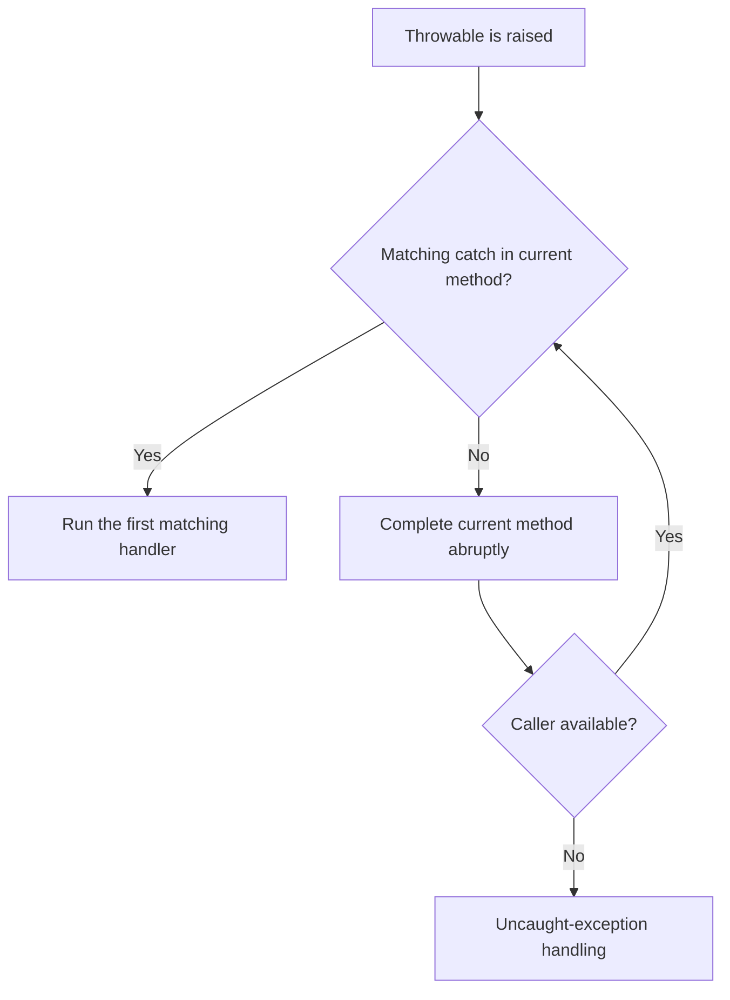

<TLDR>
  <TLDRCell label="what">
    A Java exception is a `Throwable` object that propagates up the call stack. `throw` raises it, a matching `catch` handles it, and `throws` makes a checked exception part of a method's contract.
  </TLDRCell>
  <TLDRCell label="trap">
    Broad catches, empty handlers, discarded causes, and manual resource cleanup turn real failures into misleading results that are hard to diagnose.
  </TLDRCell>
  <TLDRCell label="fix">
    Catch only at a boundary that can recover or translate the failure, preserve its cause, use try-with-resources, and handle interruption and suppressed exceptions explicitly.
  </TLDRCell>
</TLDR>

## What it is and why it exists

An exception is Java's object protocol for abrupt completion. Every exception is an instance of `Throwable` or one of its subclasses and can carry a type, message, cause, and stack trace captured when it was created. When a method cannot complete normally, it can throw an exception and leave the handling decision to a caller instead of mixing error codes into every return value.

Exceptions do not make a program recover automatically. They provide separation: low-level code reports a failure, while a boundary that knows the business policy decides whether to retry, fall back, translate, record, or terminate. With no matching handler, the exception continues through callers and ultimately reaches the thread's uncaught-exception mechanism.

You encounter checked exceptions in file, network, database, reflection, and concurrency APIs, and runtime exceptions in argument validation, illegal states, and programming defects. When reading an API, inspect both the `throws` clause and the documented unchecked exceptions with their triggering conditions.

### The `Throwable` hierarchy

Java's exception hierarchy starts at `Throwable`. The `Exception` branch represents failures an application may commonly handle, while the `Error` branch represents serious JVM, linking, or resource failures; ordinary business code should not usually catch an `Error` and continue.

| Branch | Must be caught or declared | Typical meaning | Examples |
| --- | --- | --- | --- |
| `Exception`, excluding `RuntimeException` | Yes | A failure contract callers must address explicitly | `IOException`, `InterruptedException` |
| `RuntimeException` and subclasses | No | An argument, state, or program violates a contract | `IllegalArgumentException`, `NullPointerException` |
| `Error` and subclasses | No | A serious failure applications usually cannot recover from | `OutOfMemoryError`, `LinkageError` |

A <Term id="checked-exception">checked exception</Term> belongs to a class for which the compiler performs catch-or-declare checking. The Java Language Specification defines these precisely as the classes in the `Throwable` hierarchy outside the `RuntimeException` and `Error` branches. A method calling code that may throw one must catch it or continue declaring it in a `throws` clause.

<Term id="unchecked-exception">Unchecked exceptions</Term> comprise runtime exception classes and error classes. The compiler does not require them in `throws`, but “not required” does not mean “undesigned”: public methods should still document important argument and state constraints, and callers should not catch `NullPointerException` instead of validating input.

### Choosing checked or unchecked

The choice depends on whether callers should be forced by the compiler to make a decision. A failure to read external data or complete a protocol handshake often requires callers to propagate, translate, or recover, so a checked exception can put that responsibility in the signature. A violated precondition or an operation forbidden by object state usually fits an unchecked type such as `IllegalArgumentException` or `IllegalStateException`.

“Can the caller recover?” is not a mechanical rule. The same low-level `IOException` may mean report-and-exit at a command-line entry point, become a domain exception in a service, or terminate only one record in a batch. The exception type describes the failure's meaning; the catch site expresses the strategy available at that layer.

A custom exception should provide a stable domain name and whatever structured context callers require. Do not place secrets, complete request bodies, or credentials in its message; exception messages routinely reach logs, monitoring, or API error mappings. When wrapping another failure, preserve it through a constructor that accepts a `cause`.

### Four syntax elements

`throw` is followed by a `Throwable` object and makes the current expression or statement complete abruptly. `throws` appears on a method or constructor signature and declares checked exception types that may propagate to the caller; it does not create or raise an object.

`try` bounds operations that may fail, and `catch` selects a handler using the exception object's runtime type. `finally` holds actions that must run after normal or abrupt completion, but closable resources should normally use try-with-resources because it preserves the relationship between primary and closing failures.

A multi-catch can group unrelated exception types with the same policy as `catch (TypeA | TypeB error)`. Its parameter is implicitly `final`, and the alternatives cannot include both a superclass and its subclass.

## How it works

### Throwing, matching, and unwinding

After `throw` executes, or an expression, method call, or class-loading operation raises an exception, the current path completes abruptly. The runtime first inspects the `try` around the throw site and selects, in source order, the first `catch` that can receive the exception's runtime type. If none matches, the current method exits and the search continues in its caller.



This process is stack unwinding. When an exception leaves a synchronized method or `synchronized` statement, its monitor is still released according to the language rules; registered `finally` actions and resource closures also run along the propagation path. An exception does not resume at the statement after the throw site unless higher-level code explicitly retries the whole operation.

Order `catch` clauses from specific to general. `NumberFormatException` is a subclass of `IllegalArgumentException`, so its handler must come first; the reverse order does not compile because the later branch is unreachable. The runtime does not automatically choose the “most specific” of several handlers: it chooses the first compatible one in source order.

After a handler completes, execution resumes after the entire `try` statement, not after the failed statement. Rethrowing the same object preserves its identity and original stack trace. When a new abstraction is required, create a domain exception and pass the old exception as its cause.

### Compile-time checking

The compiler analyzes which checked exceptions expressions and statements can throw. Code compiles only when a compatible `catch` handles each such exception in the current scope or the containing method or constructor covers it with `throws`. This makes failures part of the calling contract, but it neither proves a failure will occur nor enumerates all unchecked failures.

An overriding method cannot arbitrarily widen the checked exception contract. An implementation may stop throwing a declared checked exception or narrow it to a subtype, but it cannot surprise code calling through the parent type with a new, broader checked exception. Unchecked exceptions do not have this `throws` restriction.

Generics and precise rethrow can let the compiler infer a narrower thrown type than a variable declaration suggests. Basic application code should not use those techniques merely to shorten signatures; make the boundary semantics clear first, then let compiler inference keep the declaration accurate.

### Control flow through `finally`

A `finally` block runs after the `try` or selected `catch` and before a return completes or propagation continues. It fits restoring in-memory invariants, releasing locks that cannot be represented by `AutoCloseable`, and cleanup that must be tied to the current scope.

If `finally` itself completes abruptly with `return`, `throw`, `break`, or `continue`, it replaces the earlier return value or exception. That control flow is dangerous because the original failure can disappear completely. Keep `finally` focused on cleanup that does not change the primary result, and avoid returning from it.

“Always runs” is not a process-level guarantee. JVM termination, a process crash, or machine failure can prevent it, so `finally` cannot guarantee durable work across processes. Use transactions, idempotent recovery, or external coordination for those guarantees rather than language-level cleanup alone.

### Try-with-resources

Try-with-resources manages objects that implement `AutoCloseable`. Once a resource initializes successfully, leaving the `try` automatically calls `close()`; multiple resources close in reverse initialization order. If a later resource initializer fails, the resources initialized before it are still closed.

Since Java 9, a resource header may refer to an already assigned `final` or effectively final variable, as in `try (reader)`. A resource variable cannot be reassigned in the protected scope, keeping the object to close unambiguous.

When both the body and `close()` fail, the body exception remains primary and the closing failure becomes a <Term id="suppressed-exception">suppressed exception</Term>. Read these with `getSuppressed()`. If the body completes normally and closing fails, the closing exception itself propagates; suppressed does not mean ignored.

### Causes and suppressed exceptions

An <Term id="exception-cause">exception cause</Term> answers “which lower-level failure led to this exception.” A constructor or `initCause()` establishes it, and `getCause()` retrieves it. Preserving the cause during exception translation lets an upper layer use domain vocabulary while diagnostics can still reach an `IOException`, `SQLException`, or other root failure.

A suppressed exception answers a different question: “which additional cleanup failures happened while the primary failure was being delivered?” A cause usually forms a semantic chain, while suppressed exceptions are sibling secondary failures attached to a primary exception. Logging and reporting tools need the full object to preserve both; `getMessage()` alone is not enough.

A stack trace is normally recorded when the thread creates the exception object. Wrapping can add useful context, but logging and immediately rethrowing at every layer produces duplicate records. Log the complete exception once at a boundary that owns the request, task, or process outcome; intermediate layers should translate only when they can add meaning.

## Examples

### Catching runtime exceptions precisely

The first example separates text parsing failure from domain validation of a valid integer. Both exceptions are unchecked, but the calling boundary still applies a different policy to each.

<Depth level="quick">

```java title="ParseQuantity.java"
public class ParseQuantity {
    static int parse(String text) {
        int quantity = Integer.parseInt(text);
        if (quantity <= 0) {
            throw new IllegalArgumentException("quantity must be positive");
        }
        return quantity;
    }

    public static void main(String[] args) {
        for (String input : new String[] {"3", "zero", "-2"}) {
            try {
                System.out.println(input + " -> " + parse(input));
            } catch (NumberFormatException error) {
                System.out.println(input + " -> not an integer");
            } catch (IllegalArgumentException error) {
                System.out.println(input + " -> " + error.getMessage());
            }
        }
    }
}
```

```text
3 -> 3
zero -> not an integer
-2 -> quantity must be positive
```

</Depth>

`NumberFormatException` must precede its parent `IllegalArgumentException`. The code catches only failures it can translate into input feedback; an unrelated programming defect in `parse()` is not disguised as malformed input by a broad `catch (Exception)`.

### Translating a checked exception and preserving its cause

The next API layer does not want callers to depend on its reading implementation, so it translates `IOException` into a checked domain exception. The constructor retains the `cause`, giving the caller both a stable domain message and access to the lower-level type and message.

```java title="ExceptionTranslation.java"
import java.io.IOException;
import java.io.Reader;
public class ExceptionTranslation {
    static final class RuleLoadException extends Exception {
        RuleLoadException(String message, Throwable cause) {
            super(message, cause);
        }
    }

    static final class BrokenReader extends Reader {
        @Override
        public int read(char[] buffer, int offset, int length) throws IOException {
            throw new IOException("storage offline");
        }

        @Override
        public void close() {}
    }

    static char loadFirstRule(Reader source) throws RuleLoadException {
        try (source) {
            int value = source.read();
            if (value == -1) {
                throw new RuleLoadException("Shipping rules are empty", null);
            }
            return (char) value;
        } catch (IOException cause) {
            throw new RuleLoadException("Could not load shipping rules", cause);
        }
    }
    public static void main(String[] args) {
        try {
            loadFirstRule(new BrokenReader());
        } catch (RuleLoadException error) {
            System.out.println(error.getMessage());
            System.out.println("cause=" + error.getCause().getClass().getSimpleName()
                    + ": " + error.getCause().getMessage());
        }
    }
}
```

```text
Could not load shipping rules
cause=IOException: storage offline
```

`try (source)` uses an effectively final method parameter and guarantees its closure whether reading succeeds or fails. This example calls `getCause()` only on a path known to have a cause; general diagnostic code must allow it to be `null`.

### Observing close order and suppressed failures

This resource example deliberately fails in the body and in both `close()` calls to show which exception has propagation priority. A production resource should try to release its underlying resource before reporting a close failure, but callers still need visibility into that failure.

```java title="ResourceFailures.java"
public class ResourceFailures {
    static final class DemoResource implements AutoCloseable {
        private final String name;

        DemoResource(String name) {
            this.name = name;
            System.out.println("open " + name);
        }

        @Override
        public void close() throws Exception {
            System.out.println("close " + name);
            throw new Exception("close failed: " + name);
        }
    }

    public static void main(String[] args) {
        try (var input = new DemoResource("input");
             var output = new DemoResource("output")) {
            System.out.println("process");
            throw new Exception("processing failed");
        } catch (Exception primary) {
            System.out.println("primary=" + primary.getMessage());
            for (Throwable suppressed : primary.getSuppressed()) {
                System.out.println("suppressed=" + suppressed.getMessage());
            }
        }
    }
}
```

```text
open input
open output
process
close output
close input
primary=processing failed
suppressed=close failed: output
suppressed=close failed: input
```

The output first shows reverse-order closing. The body's `processing failed` remains primary, and the two later close failures appear in occurrence order in `getSuppressed()`. Hand-written nested `finally` blocks can easily lose this relationship.

### Restoring status after catching interruption

`InterruptedException` normally clears the thread's interrupted status when it is thrown. If this method cannot continue declaring it but an upper layer must still observe the cancellation request, restore the status after completing local cleanup.

```java title="PreserveInterrupt.java"
public class PreserveInterrupt {
    static void waitForSignal() {
        try {
            Thread.sleep(1_000);
        } catch (InterruptedException interrupted) {
            Thread.currentThread().interrupt();
            System.out.println("wait cancelled");
        }
    }

    public static void main(String[] args) {
        Thread.currentThread().interrupt();
        waitForSignal();
        System.out.println("interrupted=" + Thread.currentThread().isInterrupted());
    }
}
```

```text
wait cancelled
interrupted=true
```

`main` sets the current thread's interrupt status first, so `sleep()` throws immediately and the example does not depend on timing. After the handler restores the status, an upper layer can still observe the cancellation through `isInterrupted()`. Propagating `InterruptedException` from the method is the other correct policy.

## Pitfalls

> [!PITFALL]
> Catching `Exception` and returning `null`, an empty collection, or a default collapses “no result” and “operation failed” into one state, while also hiding defects such as `NullPointerException`. Catch only a type this layer can recover from or translate; otherwise let it propagate and keep the return type truthful about normal results.

> [!PITFALL]
> Constructing a replacement exception without passing the original breaks the cause chain, as in `throw new OrderLoadException("load failed")`. Provide a constructor that accepts `Throwable cause` and calls `super(message, cause)`, and pass the complete exception object to logging rather than only its message.

> [!PITFALL]
> Closing several resources manually in `finally` can replace the body failure, skip a resource, or swallow a closing failure. Make the resources `AutoCloseable` and use try-with-resources; when diagnosing a failure, inspect both `getCause()` and `getSuppressed()` on the primary exception.

> [!PITFALL]
> Treating a caught `InterruptedException` as an ordinary timeout clears a cancellation signal and breaks the owner's stop policy. Prefer propagation; when the signature cannot propagate it, complete necessary cleanup, call `Thread.currentThread().interrupt()`, and then return or raise a domain failure as the method contract requires.

> [!PITFALL]
> Returning from `finally`, or throwing a new exception there without a cause, replaces a result already produced by `try` or `catch`. Keep `finally` limited to bounded cleanup and do not return from it; let try-with-resources manage resources whose cleanup may fail.

> [!PITFALL]
> “Log and rethrow” at every layer produces several records for one failure, while an empty `catch` makes the failure disappear. Log the complete exception once at the boundary that owns a request, task, or process outcome; catch in intermediate layers only to recover or add domain meaning.

<Depth level="deep">

## Deep dive: exact exception boundaries

### `throws` is a static upper bound

`throws` describes which checked exceptions the compiler permits a method to propagate; it is not a runtime manifest of everything the call will raise. A method can declare a checked exception without throwing it on a particular call, and it can throw undeclared unchecked exceptions. Callers must not interpret “no exception in the signature” as “this call cannot fail.”

The compiler performs exception analysis over reachable expressions and statements. After a `catch` parameter covers a checked exception, the enclosing method need not declare that exception, but a new checked exception from the handler still must be caught or declared. Lambdas and method references must also fit the `throws` contract of their target functional interface.

Override rules preserve substitutability. If an interface method declares only `IOException`, an implementation may declare `FileNotFoundException` or no checked exception, but it cannot add an unrelated `SQLException`. Code calling through the interface type therefore does not have to guess about a new checked contract from the implementation.

### Handler tables and runtime matching

A compiled method uses an exception-handler table to describe protected instruction ranges, handler entries, and catchable types. When an exception is raised, the JVM searches the current frame for a compatible entry; if none exists, it pops that frame and inspects the caller. Source-level `finally` and try-with-resources compile to control flow that guarantees their cleanup semantics, not a special return channel that bypasses propagation.

Matching uses the exception object's actual class, not the declared type of the reference. If `Throwable failure = new IOException()` is thrown, `catch (IOException error)` still matches. Conversely, declaring a handler parameter more broadly does not change the object's type; it only reduces which subtype-specific APIs are statically available inside the handler.

Rethrowing with `throw error` normally preserves the same object and its original stack trace. `throw new DomainException(..., error)` creates a new outer node with its own creation site and a cause pointing to the old node. Rebuilding the same exception type merely to “refresh the stack” usually loses identity or context without adding meaning.

### A cause tree, not only a chain

The actual exception structure need not be linear. Each `Throwable` has at most one direct cause but may have several suppressed exceptions, and each of those nodes can have its own cause and suppressed exceptions. Complete diagnostic state is therefore closer to a tree.

`printStackTrace()` renders causes and suppressed exceptions, but a structured logging framework can do the same only when it receives the full exception object. Passing only `error.getMessage()` loses type, stack trace, cause, and suppressed list. An error response can stay terse while a server-side diagnostic event correlates to the full failure through a request identifier.

Exception messages are not stable machine protocols. JDK implementation details, operating-system paths, and lower-level library versions can change their text. Tests should assert type, domain fields, and cause relationships, and compare the entire message exactly only when your own API explicitly makes that text contractual.

### Cleanup-failure priority

Reverse close order in try-with-resources reflects nested resource dependencies: the wrapper created later closes before the underlying object it depends on. Every resource gets a close attempt; one close failure does not prevent the remaining resources from closing.

With an existing primary exception, later close failures are attached as suppressed exceptions and the primary continues propagating. With no body failure, the first close failure becomes primary and later close failures attach to it. That ordering matters when diagnosing a resource leak or a failed data flush.

`AutoCloseable.close()` is not required to be idempotent and may declare `Exception`. A custom resource should document its close contract and, where possible, release the underlying resource and mark itself closed before reporting failure. If a kind of failure is unsafe to suppress, `close()` should not throw it.

### Boundaries determine observable results

A library boundary usually propagates or translates exceptions, a task boundary records an exception as task failure, and an HTTP boundary maps domain failures to a small set of statuses and public messages. Each boundary should preserve internal diagnostics without handing untrusted callers internal type names, paths, or credentials.

Retry is also an exception policy, not a generic `catch` template. Retry only when the operation has suitable idempotency and the exception specifically represents a transient failure; argument errors, authentication failures, and most programming defects do not recover through repetition. Interruption says an owner wants work to stop and normally takes priority over the retry budget.

When testing an exceptional path, do not assert only that “an exception was thrown.” Also assert which side effects happened, whether resources closed, whether the cause survived, whether suppressed exceptions are ordered correctly, and whether the boundary's caller-visible information follows its contract.

</Depth>

<Checkpoint id="java/exceptions" />

## Further reading

- [Java Language Specification, Chapter 11: Exceptions](https://docs.oracle.com/javase/specs/jls/se25/html/jls-11.html)
- [Java Language Specification, Section 14.20: The `try` statement](https://docs.oracle.com/javase/specs/jls/se25/html/jls-14.html#jls-14.20)
- [Java SE 25 API: `Throwable`](https://docs.oracle.com/en/java/javase/25/docs/api/java.base/java/lang/Throwable.html)
- [Java SE 25 API: `AutoCloseable`](https://docs.oracle.com/en/java/javase/25/docs/api/java.base/java/lang/AutoCloseable.html)
- [Java SE 25 API: `InterruptedException`](https://docs.oracle.com/en/java/javase/25/docs/api/java.base/java/lang/InterruptedException.html)
