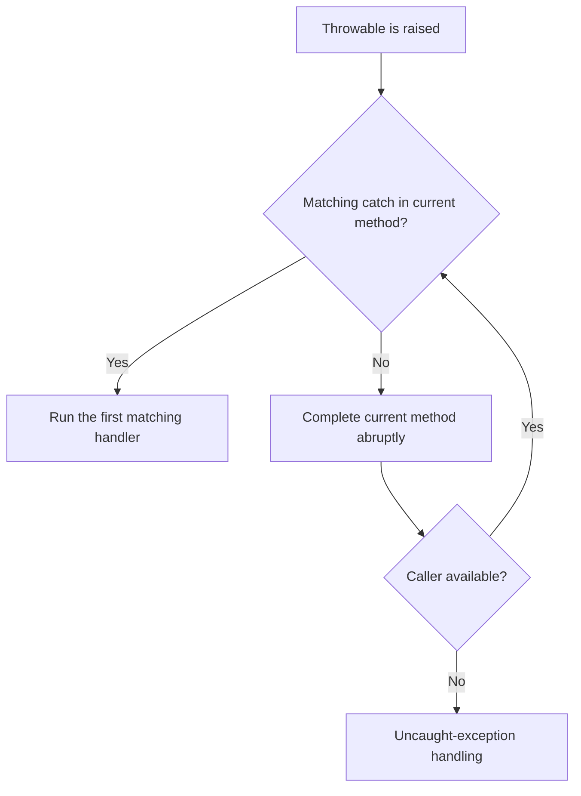

<TLDR>
  <TLDRCell label="what">
    Java 异常是沿调用栈传播的 `Throwable` 对象。`throw` 发出异常，匹配的 `catch` 处理异常，`throws` 则把检查型异常写进方法契约。
  </TLDRCell>
  <TLDRCell label="trap">
    宽泛捕获、空 `catch`、丢失原始原因和手工关闭资源，都会把真实故障改写成难以诊断的结果。
  </TLDRCell>
  <TLDRCell label="fix">
    只在能够恢复或转换语义的边界捕获异常，保留原因；资源使用 try-with-resources，并明确处理中断与被抑制异常。
  </TLDRCell>
</TLDR>

## 是什么，为什么存在

异常是 Java 表示非正常完成的一种对象协议。每个异常都是 `Throwable` 或其子类的实例，可以携带类型、消息、原因和创建时的栈轨迹。方法遇到无法按正常路径完成的情况时，可以抛出异常，把处理决定交给调用方，而不必把错误码混入每个返回值。

异常不会自动让程序“恢复”。它提供的是一种分离机制：底层代码报告失败，知道业务策略的边界决定重试、降级、转换、记录还是终止。如果没有匹配的处理器，异常会继续越过调用者，最终交给线程的未捕获异常处理机制。

你会在文件、网络、数据库、反射和并发 API 中遇到检查型异常，也会在参数校验、非法状态和程序错误中遇到运行时异常。阅读一个 API 时，既要看方法签名中的 `throws`，也要看文档记录的非检查型异常及其触发条件。

### `Throwable` 层次

Java 的异常层次以 `Throwable` 为根。`Exception` 分支用于应用通常可能处理的失败，`Error` 分支表示 JVM、链接或资源层面的严重问题；普通业务代码通常不应捕获 `Error` 后继续运行。

| 分支 | 编译器是否要求捕获或声明 | 常见含义 | 示例 |
| --- | --- | --- | --- |
| `Exception`，但不含 `RuntimeException` | 是 | 调用方必须显式面对的失败契约 | `IOException`、`InterruptedException` |
| `RuntimeException` 及其子类 | 否 | 参数、状态或程序逻辑违反契约 | `IllegalArgumentException`、`NullPointerException` |
| `Error` 及其子类 | 否 | 通常不适合由应用恢复的严重故障 | `OutOfMemoryError`、`LinkageError` |

<Term id="checked-exception">检查型异常（checked exception）</Term>是编译器执行捕获或声明检查的异常类。Java 语言规范精确定义为 `Throwable` 体系中除 `RuntimeException` 分支和 `Error` 分支以外的类。调用可能抛出检查型异常的方法时，当前方法必须用 `catch` 处理，或者在 `throws` 子句中继续声明。

<Term id="unchecked-exception">非检查型异常（unchecked exception）</Term>包括运行时异常类和错误类。编译器不强制把它们写进 `throws`，但“不强制”不等于“不需要设计”：公开方法仍应记录重要的参数约束与状态约束，调用方也不应靠捕获 `NullPointerException` 来替代输入校验。

### 选择检查型还是非检查型

类型选择取决于调用方是否应被编译器强制做出决定。外部数据读取失败、协议握手失败等情况，调用方往往需要传播、转换或恢复，检查型异常可以把这项责任放进签名。违反方法前置条件、对象状态不允许操作等问题通常使用 `IllegalArgumentException` 或 `IllegalStateException` 一类的非检查型异常。

“是否可能恢复”不是机械规则。同一种底层 `IOException` 在命令行入口可能意味着报告后退出，在服务层可能被转换为领域异常，在批处理单元中也可能只终止当前记录。异常类型应描述失败的语义，捕获位置则表达当前层能够采取的策略。

自定义异常应提供稳定的领域名称和调用方需要的结构化上下文。不要把敏感令牌、完整请求体或凭据拼进消息；异常消息经常进入日志、监控或 API 错误映射。若包装另一个失败，应通过带 `cause` 的构造器保存原始异常。

### 四个关键语法元素

`throw` 后面是一个 `Throwable` 对象，它让当前表达式或语句非正常完成。`throws` 位于方法或构造器签名中，声明可能向调用方传播的检查型异常类型；它本身不会创建或抛出对象。

`try` 划定可能失败的操作范围，`catch` 按异常对象的运行时类型选择处理器。`finally` 用于无论正常还是非正常路径都要执行的动作，但可关闭资源时通常应优先使用 try-with-resources，因为它保留主异常与关闭异常之间的关系。

多重捕获可以把处理策略相同、彼此无继承关系的类型写成 `catch (TypeA | TypeB error)`。多重捕获参数隐式为 `final`，而且不能把父类和子类同时列入同一个联合类型。

## 工作原理

### 抛出、匹配与栈展开

执行 `throw`，或由表达式、方法调用、类加载等操作产生异常后，当前执行路径会非正常完成。运行时先检查包围抛出点的 `try`，按照源码顺序选择第一个能接收该异常运行时类型的 `catch`。没有匹配项时，当前方法退出，搜索继续转到调用方。



这个过程称为栈展开。异常离开一个同步方法或 `synchronized` 语句时，相应监视器仍会按语言规则释放；已经注册的 `finally` 和资源关闭动作也会在传播路径上运行。异常不会回到抛出点继续执行，除非应用在更高层明确重试整个操作。

`catch` 的顺序从具体到一般。`NumberFormatException` 是 `IllegalArgumentException` 的子类，因此具体处理器必须位于一般处理器之前；反过来写会因后一个分支不可达而无法编译。多个处理器不是“最具体类型自动胜出”，真正规则是选择源码中第一个兼容项。

处理器结束后，控制流从整个 `try` 语句之后继续，而不是回到失败语句的下一行。如果处理器重新抛出同一对象，原栈轨迹和身份得以保留；如果建立新的抽象层，则应创建领域异常并把旧异常传为原因。

### 编译期检查

编译器分析表达式和语句可能抛出的检查型异常。某个检查型异常只有在当前范围被兼容的 `catch` 捕获，或由所在方法、构造器的 `throws` 覆盖时，代码才通过编译。这让失败成为调用契约的一部分，却不能证明运行时一定会抛出，也不能列出所有非检查型失败。

覆盖方法不能随意扩大检查型异常契约。实现类可以不再抛出原声明的检查型异常，或缩小为其子类，但不能让通过父类型调用的代码突然面对一个更宽的新检查型异常。非检查型异常不受这项 `throws` 限制。

泛型和精确重新抛出会让编译器推断比变量声明更窄的可抛类型。基础代码不应为追求短签名而滥用技巧；首先让边界语义清晰，再利用编译器保持声明准确。

### `finally` 的控制流

`finally` 在 `try` 或所选 `catch` 结束后运行，然后才完成返回或继续传播。它适合恢复内存中的不变量、释放不能由 `AutoCloseable` 表示的锁，以及执行必须与当前作用域绑定的清理。

如果 `finally` 自己用 `return`、`throw`、`break` 或 `continue` 非正常完成，它会替换此前的返回值或异常。这是危险的控制流：原失败可能完全消失。因此，`finally` 应专注于不会改变主结果的清理，并避免 `return`。

“一定执行”也不是进程级保证。JVM 终止、进程崩溃或机器失效时，不能依靠 `finally` 完成持久化承诺。需要跨进程保证的工作应使用事务、幂等恢复或外部协调，而不是只靠语言级清理。

### try-with-resources

try-with-resources 管理实现 `AutoCloseable` 的对象。资源初始化成功后，离开 `try` 时会自动调用 `close()`；多个资源按初始化的相反顺序关闭。如果后续资源初始化失败，先前已经成功初始化的资源仍会关闭。

Java 9 起，资源头可以引用已经明确赋值的 `final` 或事实 `final` 变量，例如 `try (reader)`。资源变量不能在受保护范围内重新赋值，这让关闭目标保持确定。

当主体和 `close()` 都失败时，主体异常继续作为主异常传播，关闭异常成为<Term id="suppressed-exception">被抑制异常（suppressed exception）</Term>。它们可以通过 `getSuppressed()` 读取。若主体正常完成而关闭失败，关闭异常本身就是需要传播的异常；被抑制不等于被忽略。

### 原因与被抑制异常

<Term id="exception-cause">异常原因（exception cause）</Term>回答“哪个较低层失败导致了当前异常”，由构造器或 `initCause()` 建立，并通过 `getCause()` 访问。异常转换时保留原因，可以让上层使用领域词汇，同时让诊断工具继续看到 `IOException`、`SQLException` 等根因。

被抑制异常回答的是另一件事：“传播主失败的同时，还有哪些清理失败发生”。原因通常形成语义链，被抑制异常则是附着在某个主异常上的并列次要失败。日志和错误报告工具需要保留两者，不能只输出 `getMessage()`。

栈轨迹通常在线程创建异常对象时记录。重复包装会增加上下文，但每一层都记录并立即重新抛出，也会产生重复日志。选择一个拥有请求、任务或进程结果的边界记录完整异常对象，中间层只在能增加语义时转换。

## 示例

### 精确捕获运行时异常

第一个示例把文本解析失败与合法整数的领域校验分开。两个异常都属于非检查型异常，但调用边界仍然按不同策略处理。

<Depth level="quick">

```java title="ParseQuantity.java"
public class ParseQuantity {
    static int parse(String text) {
        int quantity = Integer.parseInt(text);
        if (quantity <= 0) {
            throw new IllegalArgumentException("quantity must be positive");
        }
        return quantity;
    }

    public static void main(String[] args) {
        for (String input : new String[] {"3", "zero", "-2"}) {
            try {
                System.out.println(input + " -> " + parse(input));
            } catch (NumberFormatException error) {
                System.out.println(input + " -> not an integer");
            } catch (IllegalArgumentException error) {
                System.out.println(input + " -> " + error.getMessage());
            }
        }
    }
}
```

```text
3 -> 3
zero -> not an integer
-2 -> quantity must be positive
```

</Depth>

`NumberFormatException` 必须写在其父类 `IllegalArgumentException` 之前。代码只捕获它能转换成用户输入结果的异常；若 `parse()` 因无关程序错误失败，不会被一个宽泛的 `catch (Exception)` 伪装成输入格式问题。

### 转换检查型异常并保留原因

下一层 API 不希望把读取实现细节暴露给调用方，因此把 `IOException` 转换为领域内的检查型异常。构造器保留 `cause`，调用方既能看到稳定的领域消息，也能检查底层类型和消息。

```java title="ExceptionTranslation.java"
import java.io.IOException;
import java.io.Reader;
public class ExceptionTranslation {
    static final class RuleLoadException extends Exception {
        RuleLoadException(String message, Throwable cause) {
            super(message, cause);
        }
    }

    static final class BrokenReader extends Reader {
        @Override
        public int read(char[] buffer, int offset, int length) throws IOException {
            throw new IOException("storage offline");
        }

        @Override
        public void close() {}
    }

    static char loadFirstRule(Reader source) throws RuleLoadException {
        try (source) {
            int value = source.read();
            if (value == -1) {
                throw new RuleLoadException("Shipping rules are empty", null);
            }
            return (char) value;
        } catch (IOException cause) {
            throw new RuleLoadException("Could not load shipping rules", cause);
        }
    }
    public static void main(String[] args) {
        try {
            loadFirstRule(new BrokenReader());
        } catch (RuleLoadException error) {
            System.out.println(error.getMessage());
            System.out.println("cause=" + error.getCause().getClass().getSimpleName()
                    + ": " + error.getCause().getMessage());
        }
    }
}
```

```text
Could not load shipping rules
cause=IOException: storage offline
```

`try (source)` 使用事实 `final` 的方法参数，并保证读取成功或失败时都关闭它。这个示例只在已知存在原因的失败路径读取 `getCause()`；通用诊断代码必须允许原因是 `null`。

### 观察关闭顺序与被抑制异常

资源示例故意让主体和两个 `close()` 都失败，以显示哪一个异常拥有传播优先级。生产资源的 `close()` 应尽量释放底层资源后再报告失败，但调用方仍要能够看到关闭问题。

```java title="ResourceFailures.java"
public class ResourceFailures {
    static final class DemoResource implements AutoCloseable {
        private final String name;

        DemoResource(String name) {
            this.name = name;
            System.out.println("open " + name);
        }

        @Override
        public void close() throws Exception {
            System.out.println("close " + name);
            throw new Exception("close failed: " + name);
        }
    }

    public static void main(String[] args) {
        try (var input = new DemoResource("input");
             var output = new DemoResource("output")) {
            System.out.println("process");
            throw new Exception("processing failed");
        } catch (Exception primary) {
            System.out.println("primary=" + primary.getMessage());
            for (Throwable suppressed : primary.getSuppressed()) {
                System.out.println("suppressed=" + suppressed.getMessage());
            }
        }
    }
}
```

```text
open input
open output
process
close output
close input
primary=processing failed
suppressed=close failed: output
suppressed=close failed: input
```

输出先显示逆序关闭。主体的 `processing failed` 保持为主异常，随后发生的两个关闭失败按发生顺序出现在 `getSuppressed()` 中。手写嵌套 `finally` 很容易丢失这种关系。

### 捕获中断后恢复状态

`InterruptedException` 通常会在抛出时清除线程的中断状态。如果当前方法不能继续声明它，但上层仍需要观察取消请求，就应在完成本层清理后恢复状态。

```java title="PreserveInterrupt.java"
public class PreserveInterrupt {
    static void waitForSignal() {
        try {
            Thread.sleep(1_000);
        } catch (InterruptedException interrupted) {
            Thread.currentThread().interrupt();
            System.out.println("wait cancelled");
        }
    }

    public static void main(String[] args) {
        Thread.currentThread().interrupt();
        waitForSignal();
        System.out.println("interrupted=" + Thread.currentThread().isInterrupted());
    }
}
```

```text
wait cancelled
interrupted=true
```

`main` 先设置当前线程的中断状态，因此 `sleep()` 立即抛出，示例不依赖计时。处理器恢复状态后，上层仍能通过 `isInterrupted()` 看到取消信号。另一种正确策略是让方法声明并传播 `InterruptedException`。

## 陷阱

> [!PITFALL]
> 捕获 `Exception` 后返回 `null`、空集合或默认值，会把“没有结果”和“操作失败”压成同一种状态，还可能遮住 `NullPointerException` 等程序错误。修复方法是只捕获当前层能够恢复或转换的类型；无法处理时继续传播，并让返回类型保留正常结果的真实含义。

> [!PITFALL]
> 新建异常却不传入原异常，会切断原因链，例如 `throw new OrderLoadException("load failed")`。修复方法是提供接收 `Throwable cause` 的构造器并调用 `super(message, cause)`；记录异常时传递完整对象，而不是只记录消息文本。

> [!PITFALL]
> 用 `finally` 手工关闭多个资源，容易覆盖主体异常、漏关部分资源或吞掉关闭异常。修复方法是让资源实现 `AutoCloseable` 并使用 try-with-resources；排查失败时同时查看主异常的 `getCause()` 和 `getSuppressed()`。

> [!PITFALL]
> 捕获 `InterruptedException` 后当作普通超时继续运行，会清除取消信号并破坏上层的停止策略。修复方法是优先传播；签名不能传播时，完成必要清理后调用 `Thread.currentThread().interrupt()`，再按方法契约返回或抛出领域异常。

> [!PITFALL]
> 在 `finally` 中 `return` 或抛出新的无原因异常，会替换 `try` 或 `catch` 已经产生的结果。修复方法是让 `finally` 只做有界清理，不从中返回；清理可能失败的资源交给 try-with-resources 管理。

> [!PITFALL]
> 在每一层都“记录后重新抛出”，会让同一个失败产生多条重复日志，而空 `catch` 又会让失败完全消失。修复方法是在拥有一次请求、任务或进程结果的边界记录一次完整异常；中间层只有在能恢复或增加领域语义时才捕获。

<Depth level="deep">

## 深挖：异常边界的精确语义

### `throws` 是静态上界

`throws` 描述编译器允许方法传播的检查型异常，不是运行时发送异常的清单。方法可以声明某个检查型异常而在本次调用中不抛出，也可以抛出未列出的非检查型异常。调用方不能把“签名中没有异常”解释为“调用不会失败”。

编译器按可达表达式和语句执行异常分析。`catch` 参数覆盖某个检查型异常后，该异常不再需要由外层方法声明；处理器本身产生的新检查型异常仍要捕获或声明。lambda 和方法引用还必须满足目标函数式接口的 `throws` 契约。

覆盖规则维护了替换性。若接口方法只声明 `IOException`，实现方法可以声明 `FileNotFoundException`，也可以不声明检查型异常；它不能新增无关的 `SQLException`。通过接口类型调用的代码因此不必猜测具体实现带来的新检查型契约。

### 处理器表与运行时匹配

编译后的方法用异常处理器表描述受保护指令范围、处理器入口和可捕获类型。抛出异常时，JVM 在当前帧寻找兼容项；找不到时弹出该帧并检查调用者。源码中的 `finally` 和 try-with-resources 会编译成保证清理语义的控制流，而不是一种可绕过传播规则的特殊返回通道。

匹配依据异常对象的实际类，而不是引用变量的声明类型。写成 `Throwable failure = new IOException()` 后抛出，`catch (IOException error)` 仍能匹配。相反，把处理器参数声明得更宽不会改变对象类型，只会减少处理器内部可静态访问的专有 API。

重新抛出 `throw error` 通常保留同一个对象及其原始栈轨迹。调用 `throw new DomainException(..., error)` 会创建新的外层节点，它有自己的创建位置，并通过原因指向旧节点。为了“刷新堆栈”而无语义地重建同类型异常，通常只会丢失身份或上下文。

### 原因树而不只是链

实际异常结构不一定是一条直线。每个 `Throwable` 最多有一个直接原因，却可以有多个被抑制异常，而这些节点又可以各自拥有原因和被抑制异常。因此，完整诊断结构更接近树。

`printStackTrace()` 会展示原因和被抑制异常，但结构化日志框架只有在收到完整异常对象时才能做到同样的事。只传 `error.getMessage()` 会丢失类型、栈轨迹、原因和被抑制列表。错误响应可以保持简短，服务端诊断事件则应通过请求标识关联到完整故障。

异常消息不是稳定的机器协议。JDK 实现、操作系统路径和下层库版本都可能改变消息文本；测试应断言异常类型、领域字段和原因关系，只在消息属于你自己的明确契约时精确比较全文。

### 清理失败的优先级

try-with-resources 的逆序关闭对应嵌套资源依赖：后创建的包装层先关闭，随后才关闭它依赖的底层对象。每个资源都会获得关闭机会，一个关闭失败不会阻止其余资源关闭。

已有主异常时，后续关闭失败被附加为被抑制异常，主异常保持传播原因。没有主体失败时，第一个关闭失败成为主异常，之后的关闭失败附加到它。诊断资源泄漏或数据刷新失败时，这项顺序信息很重要。

`AutoCloseable.close()` 不保证幂等，也允许声明 `Exception`。自定义资源应记录自己的关闭契约，并尽可能先释放底层资源、标记已关闭，再报告失败。若某类失败不适合成为被抑制异常，就不应从 `close()` 抛出它。

### 边界决定可观察结果

库边界通常传播或转换异常，任务边界把异常记录为任务失败，HTTP 边界把领域失败映射为有限的状态与公开消息。每个边界都应保留内部诊断信息，但不把内部类型名、路径或凭据直接交给不受信任的调用者。

重试也是异常策略，而不是通用 `catch` 模板。只有操作具有合适的幂等性，而且异常明确表示暂时失败时才重试；参数错误、认证失败和大多数程序缺陷不会因重复调用而恢复。中断表示上层要求停止，通常应优先于重试预算。

测试异常路径时，不要只断言“抛出了某个异常”。还要断言副作用是否已经发生、资源是否关闭、原因是否保留、被抑制异常顺序是否正确，以及边界返回给调用方的信息是否符合契约。

</Depth>

<Checkpoint id="java/exceptions" />

## 延伸阅读

- [Java 语言规范第 11 章：异常](https://docs.oracle.com/javase/specs/jls/se25/html/jls-11.html)
- [Java 语言规范第 14.20 节：`try` 语句](https://docs.oracle.com/javase/specs/jls/se25/html/jls-14.html#jls-14.20)
- [Java SE 25 API：`Throwable`](https://docs.oracle.com/en/java/javase/25/docs/api/java.base/java/lang/Throwable.html)
- [Java SE 25 API：`AutoCloseable`](https://docs.oracle.com/en/java/javase/25/docs/api/java.base/java/lang/AutoCloseable.html)
- [Java SE 25 API：`InterruptedException`](https://docs.oracle.com/en/java/javase/25/docs/api/java.base/java/lang/InterruptedException.html)
