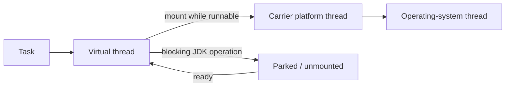

<TLDR>
  <TLDRCell label="what">
    Java 21 finalized virtual threads, record patterns, pattern switches, and sequenced collection interfaces, making blocking concurrency, data decomposition, and ordered collection operations more direct.
  </TLDRCell>
  <TLDRCell label="trap">
    Not everything in the Java 21 release notes is a stable API: Structured Concurrency and String Templates were previews, and the latter was later withdrawn.
  </TLDRCell>
  <TLDRCell label="fix">
    Lock the stable source boundary with `javac --release 21` and no preview flag, then review pinning and preview APIs against the runtime you actually deploy.
  </TLDRCell>
</TLDR>

## What it is and why it exists

Java 21 is the Java platform release from September 2023 and a migration baseline for which many vendors offer long-term support (LTS).
LTS is a vendor support policy, not a compatibility switch in the Java language; the actual support period comes from your JDK distributor.
For source code, the controlling questions are always the project's minimum release and whether it permits preview features.

This release advances the concurrency model, pattern matching, and collection APIs together.
A <Term id="virtual-thread">virtual thread</Term> lets the one-blocking-task-per-thread style scale to large numbers of concurrent tasks; <Term id="record-pattern">record patterns</Term> and <Term id="pattern-matching">pattern matching</Term> for `switch` put type tests, decomposition, and branching into one compiler-checked construct.
A <Term id="sequenced-collection">sequenced collection</Term> gives ordered collections a uniform way to access their first element, last element, and reverse view.

“Java 21 feature” does not mean that every proposal seen in Java 21 became a permanent API.
Virtual threads, record patterns, pattern switches, and sequenced collections were finalized in Java 21 and need no preview flag.
Structured Concurrency and String Templates were previews in that release; as of Java 25, Structured Concurrency is still preview, while the later String Templates proposal was withdrawn.

This topic is therefore a version-boundary guide, not a complete set of release notes.
It concentrates on stable capabilities ordinary applications encounter and calls out the preview history most likely to contaminate generated code copied from old tutorials.
Other JDK 21 changes in garbage collection, cryptography, and platform ports deserve evaluation in their own runtime or security context.

## How it works

### Stable features and preview proposals

The table describes the Java 21 source boundary and adds the later state visible from Java 25.
Only rows marked “Final” are available with `--release 21` and no `--enable-preview`.

| Capability | Java 21 status | Java 25 view | Core boundary |
| --- | --- | --- | --- |
| Virtual Threads, JEP 444 | Final | Stable API | Scales blocking tasks; does not add CPU capacity |
| Sequenced Collections, JEP 431 | Final | Stable API | Adds end operations and reverse views |
| Record Patterns, JEP 440 | Final | Stable syntax | Deconstructs records and composes through nesting |
| Pattern Matching for `switch`, JEP 441 | Final | Stable syntax | Adds type patterns, `when` guards, and `case null` |
| Structured Concurrency, JEP 453 | Preview | Fifth preview | API continued to change after Java 21 |
| String Templates, JEP 430 | Preview | Absent from Java 25 | A later third-preview proposal was withdrawn |

A <Term id="preview-feature">preview feature</Term> is fully implemented but not yet a permanent part of Java SE.
It requires explicit opt-in so developers can try the design and provide feedback; its syntax or API may change in the next release or disappear entirely.
Preview does not mean “stable but disabled by default,” so a successful build with preview flags is not proof of stable Java 21 compatibility.

### Virtual threads share carriers

A virtual thread is still an instance of `java.lang.Thread`, with the same blocking call-stack style, exception handling, and interruption model.
The difference is that the JDK schedules it and it does not occupy one operating-system thread for its entire lifetime.
While running Java code, the virtual thread mounts on a <Term id="carrier-thread">carrier thread</Term>; many blocking JDK operations unmount it so that carrier can run another virtual thread.



`Executors.newVirtualThreadPerTaskExecutor()` creates a new virtual thread for every submitted task.
It is not a pool whose size you tune, and it does not provide backpressure for database connections, remote quotas, or memory.
When a downstream resource supports only fixed concurrency, constrain resource access separately with a semaphore, connection pool, or service limit.

Virtual threads mainly help workloads that spend substantial time waiting.
CPU-bound work remains limited by processor cores, and creating more virtual threads does not make the computation itself faster.
They also support `ThreadLocal`, but support does not make a large per-task cache economical for short-lived threads.

### Record patterns and pattern switches

A record pattern deconstructs a value in record-component declaration order and binds typed local variables when the pattern succeeds.
Patterns can nest, so one branch can validate an outer record type and the shape of an inner record at once.
This does not bypass constructor validation or make mutable objects referenced by record components immutable.

A pattern <Term id="switch-expression">switch expression</Term> selects the first applicable label in source order.
A broad unguarded type pattern dominates narrower patterns after it, and the compiler rejects those unreachable branches.
An exhaustive switch over a sealed hierarchy usually needs no `default`, allowing a new branch to surface when consumers are recompiled.

`null` still needs a deliberate policy.
If `case null` exists, that branch handles it; without that label, a null selector still throws `NullPointerException`, and `default` does not catch it.
A guard follows its pattern with `when` and expresses an extra condition that matters only after the pattern matches.

### Sequenced collections expose reverse views

JEP 431 adds `SequencedCollection`, `SequencedSet`, and `SequencedMap` to represent collections with a defined encounter order uniformly.
`List`, `Deque`, `LinkedHashSet`, `SortedSet`, and corresponding map types consequently gain consistent end or reverse-access APIs.
Concrete types retain their own restrictions; for example, some unmodifiable and sorted collections cannot insert at an arbitrary end.

`reversed()` returns a view with the opposite order, not a copy of the elements.
Changes to the original appear through the reverse view and, where modification is supported, changes through the view write back to the original.
If you need a snapshot, copy the view explicitly and decide separately whether that copy must be unmodifiable.

### Apply version boundaries in order

For a migration, choose the source level first, classify final and preview features second,
and inspect deployment-runtime changes last.
That order prevents two common confusions: treating “runs on a new JDK” as “compiles for an old release,” and treating “appeared in release notes” as “still exists today.”

The build must cover production and test sources because test helpers can introduce newer syntax or APIs too.
Maven, Gradle, the IDE, and CI must express the same release target; setting only a bytecode target does not necessarily constrain both language syntax and the standard-library surface.

Recheck performance guidance and diagnostic switches after upgrading the runtime.
The virtual-thread public API has been stable since Java 21, but pinning behavior improved in Java 24, and a source-level check cannot report an implementation change like that.
Recording the source contract and runtime tuning target separately is more precise than saying only “the project uses Java 21.”

## Examples

### Deconstruct a sealed domain model

The first example combines record patterns, a `when` guard, `case null`, and exhaustiveness over a sealed hierarchy.
The two `Shipment` branches must run from specific to general; reversing them would let the unguarded case dominate the express case.

<Depth level="quick">

```java
public class PatternDelivery {
    sealed interface Delivery permits Pickup, Shipment {}
    record Pickup(String store) implements Delivery {}
    record Shipment(String city, int days) implements Delivery {}

    static String promise(Delivery delivery) {
        return switch (delivery) {
            case null -> "invalid delivery";
            case Pickup(String store) -> "collect at " + store;
            case Shipment(String city, int days) when days <= 2 ->
                "express to " + city;
            case Shipment(String city, int days) ->
                days + " days to " + city;
        };
    }

    public static void main(String[] args) {
        System.out.println(promise(new Pickup("Central")));
        System.out.println(promise(new Shipment("Lyon", 2)));
        System.out.println(promise(new Shipment("Nice", 4)));
        System.out.println(promise(null));
    }
}
```

```text
collect at Central
express to Lyon
4 days to Nice
invalid delivery
```

</Depth>

`Delivery` has only two permitted implementations, and the record cases cover every non-null value.
The explicit `case null` completes the input boundary, so no vague `default` is needed.
This program compiles and runs with `javac --release 21 -Xlint:all` and no preview flag.

### Give each blocking task a virtual thread

This batch creates one virtual thread for each order lookup and collects the results in deterministic order through `Future.get()`.
`Thread.sleep()` only stands in for database or network waiting; `virtual=true` in the output verifies where each task ran.

```java
import java.util.concurrent.Executors;

public class VirtualThreadBatch {
    record Result(int orderId, boolean virtual) {}

    static Result loadOrder(int orderId) throws InterruptedException {
        // Sleeping stands in for blocking database or network I/O.
        Thread.sleep(20);
        return new Result(orderId, Thread.currentThread().isVirtual());
    }

    public static void main(String[] args) throws Exception {
        try (var executor = Executors.newVirtualThreadPerTaskExecutor()) {
            var first = executor.submit(() -> loadOrder(101));
            var second = executor.submit(() -> loadOrder(102));
            var third = executor.submit(() -> loadOrder(103));

            System.out.println(first.get());
            System.out.println(second.get());
            System.out.println(third.get());
        }
    }
}
```

```text
Result[orderId=101, virtual=true]
Result[orderId=102, virtual=true]
Result[orderId=103, virtual=true]
```

Leaving the `try` closes the executor and waits for submitted tasks to finish.
That lifecycle boundary matters: if an executor lives indefinitely and submission is unbounded, cheap threads still cannot protect a downstream system.
A real service also needs policies for cancellation, interruption, timeouts, and partial failure.

### Observe write-through in a reverse view

The last example reads both ends of an `ArrayList` and retains its reverse view.
It changes the original and then removes an element through the view, demonstrating that both directions share the same contents.

```java
import java.util.ArrayList;
import java.util.List;

public class SequencedStops {
    public static void main(String[] args) {
        var stops = new ArrayList<>(List.of("Paris", "Lyon", "Nice"));
        var reverseView = stops.reversed();

        System.out.println(stops.getFirst() + " -> " + stops.getLast());
        System.out.println(reverseView);

        // A reversed collection is a view, so changes are visible both ways.
        stops.addFirst("Lille");
        System.out.println(reverseView);
        reverseView.removeFirst();
        System.out.println(stops);
    }
}
```

```text
Paris -> Nice
[Nice, Lyon, Paris]
[Nice, Lyon, Paris, Lille]
[Lille, Paris, Lyon]
```

`reverseView.removeFirst()` removes `Nice`, the last element of the original list.
When a caller needs independence, take `new ArrayList<>(stops.reversed())` at a deliberate point.
Copying changes ownership of the collection container; it does not recursively copy mutable elements.

## Pitfalls

> [!PITFALL]
> Copying `STR."Hello, \{name}"` or an early `StructuredTaskScope` example from Java 21 release material and treating it as stable Java 25 API causes compilation failure or version lock-in.

**Fix:** Classify each feature as final, preview, incubating, or withdrawn, then consult the JEP for the project's source release.
Stable Java 21 code must not contain String Templates or Structured Concurrency APIs; if you intentionally adopt a preview, pin compilation, runtime, and tests to the same JDK release.

> [!PITFALL]
> Putting virtual threads in a fixed-size pool or expecting them to accelerate a CPU-bound loop reintroduces queueing without adding compute capacity.

**Fix:** Create one virtual thread per independent blocking task and let the scheduler manage carriers.
Constrain scarce resources with semaphores, connection pools, or rate limiters; design and measure CPU-bound work around processor parallelism.

> [!PITFALL]
> Attaching a large `ThreadLocal` cache to every virtual thread can turn “threads are cheap” into memory pressure that grows linearly with tasks.

**Fix:** Inventory every thread-local value and its lifetime, retaining only small values that genuinely belong to task context.
Use bounded shared pools or explicit ownership for large buffers, then test heap use at realistic concurrency.

> [!PITFALL]
> Old advice says “virtual threads pin in `synchronized`, so replace it all with `ReentrantLock`.” That has context for long blocking critical sections on Java 21, but it is not a general rule after Java 24.

**Fix:** Review pinning against the deployed runtime.
JEP 491 in Java 24 removed nearly all monitor-induced pinning; on Java 25, choose locks by semantics and use JFR to find remaining native, class-loading, or initialization pins instead of rewriting mechanically.

> [!PITFALL]
> A broad `default` in an exhaustive sealed-type switch lets a newly permitted type fall silently into old behavior after recompilation.

**Fix:** For a closed hierarchy owned by the current module, list every branch and omit `default`, while deciding the `null` policy separately.
Put specific or guarded patterns before unguarded supertypes, and have CI compile every consumer.

> [!PITFALL]
> Treating `reversed()` as a snapshot lets later mutations of the original alter a cached response, output, or audit result unexpectedly.

**Fix:** Name the value `reverseView` and document its live-view semantics in the API contract.
Copy explicitly for an independent result, and use the appropriate copy or wrapper API when that result must also be unmodifiable.

## In the AI era

**What generated code gets wrong here**

Models frequently splice examples from different Java releases: they generate withdrawn `STR` templates in code labeled Java 21 or carry Java 21's `StructuredTaskScope.ShutdownOnFailure` construction into Java 25.
They also build fixed pools of virtual threads, omit downstream concurrency limits, claim all `synchronized` code pins on Java 25, or treat `reversed()` as a copy.
In pattern switches, recurring failures include placing an unguarded supertype first, hiding sealed-hierarchy evolution behind `default`, and forgetting that `default` does not catch `null`.

**Ask your AI to check**

- Run `javac --release 21 -Xlint:all` with JDK 25, list every syntax form and API outside the stable Java 21 boundary, and do not add a preview flag automatically.
- For each virtual-thread task, name the resource it waits for, that resource's concurrency limit, the cancellation path, and its `ThreadLocal` footprint; distinguish Java 21 from Java 25 pinning causes.
- List type coverage, dominance order, and null behavior for every pattern switch, then label each `reversed()` result as a view or an explicit copy.

**Review checklist**

- The build, CI, and IDE enforce the same `--release 21` baseline; every preview dependency has an exact JDK version plus compile-time and runtime flags.
- Virtual threads expand waiting work only, while real scarce resources set concurrency limits; interruption, cancellation, timeouts, and context memory are tested.
- Pattern branches remain reachable and exhaustive with an explicit null policy; sequenced-collection views have mutability and ownership consistent with the API contract.

**Prompt vocabulary**

Use the precise terms `Java 21 source level`, `final feature`, `preview feature`, `virtual thread per task`, `carrier thread`, `pinning`, `record pattern`, `pattern dominance`, `exhaustive switch`, and `reverse-ordered view`.
Ask the model to state the source level, runtime version, and whether preview is allowed before generating code; “use modern Java” is not a sufficient constraint.

<Depth level="deep">

## Version baselines and runtime evolution

### Source, class file, and runtime are separate axes

`javac --release 21` applies Java 21 language rules, targets the documented Java 21 standard-library API, and emits class files understood by Java 21.
The locally executed examples produce class-file major version 65.
Merely running `javac` from Java 25 without `--release` neither proves that Java 21 can load the result nor prevents references to APIs added after Java 21.

Third-party dependencies carry their own minimum runtime and class-file versions.
`--release 21` does not downgrade a dependency available only as Java 25 bytecode, and it does not prove identical reflection, proxy, service-loading, or native-library behavior on the older runtime.
Migration verification therefore combines source compilation, dependency resolution, and tests on every runtime you actually support.

### Preview class files are release-bound

Java 21 preview source requires `--release 21 --enable-preview` at compile time and `--enable-preview` at run time.
Preview class files are marked as depending on that release and cannot be treated like ordinary stable class files for a JVM of another major release.
A preview flag hidden in a build script is therefore part of the public compatibility contract, not a developer preference.

Structured Concurrency demonstrates the risk.
It was a first preview in Java 21 and remained a fifth preview in Java 25, with an API shape that evolved in between; copying constructors and subtask access from an old article is unreliable.
If production code needs long-lived source stability, wait for the API shape you need to become final or record the version lock, migration cost, and test matrix explicitly.

String Templates demonstrate more directly that a preview can disappear.
JEP 430 syntax describes an experiment in Java 21 and must not be taught as current Java 25 syntax.
Parameterized SQL, JSON serialization, and context-specific HTML escaping still belong to their respective APIs; ordinary interpolation never supplied those safety boundaries automatically.

### Pinning advice needs a runtime version

On Java 21, a virtual thread can pin its carrier when it blocks inside a `synchronized` block or method, so frequent, long-lived cases can limit scalability.
Diagnostics at that time included the `jdk.tracePinnedThreads` system property and a JFR event, both intended to locate critical sections that really block for a long time.
Brief, in-memory synchronization did not need blanket rewriting.

JEP 491, delivered in Java 24, changes that conclusion.
Virtual threads can now unmount in nearly all monitor-blocking cases, `jdk.tracePinnedThreads` is no longer an effective diagnostic switch, and the JFR event remains for residual pinning situations.
This is why a Java 21 feature guide is checked from Java 25: stable language features do not freeze JVM implementation advice forever.

Native code that calls back into Java and then blocks, class loading, and class initialization can still pin.
Pinning is not a data race or a wrong result; it is a scalability risk whose frequency and duration should be observed on the target runtime.
Lock choice should still start from correctness, readability, interruptible acquisition, and condition-waiting requirements.

### A virtual thread is not a resource permit

A virtual thread represents a schedulable task, not an available database connection, file descriptor, remote-request quota, or block of heap memory.
If every request calls a backend that supports 40 concurrent operations, creating 40,000 virtual threads merely moves the waiting point inside the system.
An explicit semaphore or connection pool states the real capacity and provides a testable boundary for timeouts and rejection.

Closing a thread-per-task executor waits for its tasks, but it does not design a cancellation policy.
The caller must still decide whether one failure cancels sibling tasks, whether a timeout interrupts work, and whether the blocking library responds to interruption.
Those needs motivate Structured Concurrency, but stable Java 21 code cannot pretend that its preview API is already fixed.

### Exhaustiveness still has a binary boundary

A pattern switch over a sealed hierarchy proves exhaustiveness at compile time from the permitted direct subtypes then visible.
Omitting `default` makes a new branch a clear error when consumers are recompiled, which is safer than silently retaining old behavior.
Already deployed consumer class files do not recompile themselves, so the release process still needs binary-compatibility tests.

The compiler supplies an exceptional path for an exhaustive switch without a match-all label, preventing normal completion with no selected branch if a novel runtime type appears.
That is a last line of defense, not version governance.
The upgrade order for domain models, consumers, and deployment units still belongs in the API compatibility policy.

</Depth>

<Checkpoint id="java/java21-features" />

## Further reading

- [JDK 21 project page and complete JEP list](https://openjdk.org/projects/jdk/21/)
- [JEP 444: Virtual Threads](https://openjdk.org/jeps/444)
- [JEP 440: Record Patterns](https://openjdk.org/jeps/440)
- [JEP 441: Pattern Matching for switch](https://openjdk.org/jeps/441)
- [JEP 431: Sequenced Collections](https://openjdk.org/jeps/431)
- [JEP 491: Synchronize Virtual Threads without Pinning](https://openjdk.org/jeps/491)
