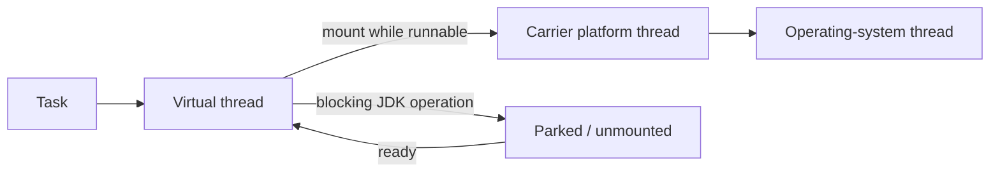

<TLDR>
  <TLDRCell label="what">
    Java 21 正式交付了虚拟线程、记录模式、模式 `switch` 和有序集合接口，让阻塞式并发、数据解构和有顺序的集合操作更直接。
  </TLDRCell>
  <TLDRCell label="trap">
    Java 21 发布说明中的特性不都属于稳定 API；结构化并发与字符串模板当时仍是预览特性，后者后来被撤回。
  </TLDRCell>
  <TLDRCell label="fix">
    用 `javac --release 21` 锁定稳定源码边界，不启用预览；再按实际运行时版本复核虚拟线程固定和预览 API 的行为。
  </TLDRCell>
</TLDR>

## 是什么，为什么存在

Java 21 是 2023 年 9 月发布的 Java 平台版本，也是许多供应商提供长期支持（LTS）的迁移基线。
LTS 是发行商的支持政策，不是 Java 语言中的兼容性开关；支持期限要以实际 JDK 发行商的承诺为准。
对源码而言，关键问题始终是项目声明的最低版本，以及是否允许预览特性。

这个版本同时改进了并发模型、模式匹配和集合 API。
<Term id="virtual-thread">虚拟线程（virtual thread）</Term>让一个阻塞任务对应一个线程的写法可以扩展到大量并发任务；<Term id="record-pattern">记录模式（record pattern）</Term>与<Term id="pattern-matching">模式匹配（pattern matching）</Term> `switch` 把类型检查、解构和分支放进同一个编译器检查的结构。
<Term id="sequenced-collection">有序集合（sequenced collection）</Term>则统一了首元素、尾元素和反向视图的访问方式。

“Java 21 特性”不等于“在 Java 21 中出现过的每项提案都已成为永久 API”。
虚拟线程、记录模式、模式 `switch` 和有序集合在 Java 21 中正式交付，无需预览开关。
结构化并发与字符串模板在该版本中只是预览；截至 Java 25，结构化并发仍是预览 API，而字符串模板的后续提案已经撤回。

因此，这个主题是一份版本边界指南，而不是完整发布说明。
它聚焦普通应用最常遇到的稳定能力，并明确标出旧教程最容易误导生成代码的预览历史。
垃圾收集器、密码学和平台移植等其他 JDK 21 变化，应按各自的运行时或安全主题评估。

## 工作原理

### 稳定特性与预览提案

下面的状态描述 Java 21 源码边界，并补充 Java 25 时可观察到的后续变化。
只有“正式”行可以在 `--release 21` 且不带 `--enable-preview` 时使用。

| 能力 | Java 21 状态 | Java 25 视角 | 核心边界 |
| --- | --- | --- | --- |
| 虚拟线程，JEP 444 | 正式 | 稳定 API | 提高阻塞式任务的可扩展性，不提高 CPU 数量 |
| 有序集合，JEP 431 | 正式 | 稳定 API | 提供两端操作与反向视图 |
| 记录模式，JEP 440 | 正式 | 稳定语法 | 解构记录类，可嵌套使用 |
| 模式 `switch`，JEP 441 | 正式 | 稳定语法 | 支持类型模式、`when` 守卫和 `case null` |
| 结构化并发，JEP 453 | 预览 | 第五次预览 | API 在后续版本中继续变化 |
| 字符串模板，JEP 430 | 预览 | 不在 Java 25 中 | 后续第三次预览提案已撤回 |

<Term id="preview-feature">预览特性（preview feature）</Term>已经完整实现，但尚未成为 Java SE 的永久组成部分。
它需要显式选择加入，让开发者试用并反馈设计；语法或 API 可以在下一版变化，也可以完全撤回。
预览不是“默认关闭的稳定功能”，因此不能把带预览开关的成功编译当作稳定 Java 21 兼容性证明。

### 虚拟线程共享载体

虚拟线程仍是 `java.lang.Thread` 实例，使用同样的阻塞式调用栈、异常处理和中断模型。
区别在于，它由 JDK 调度，不会在整个生命周期里独占一个操作系统线程。
虚拟线程运行 Java 代码时会挂载到一个<Term id="carrier-thread">载体线程（carrier thread）</Term>；许多 JDK 阻塞操作会让它卸载，载体随后可以运行别的虚拟线程。



`Executors.newVirtualThreadPerTaskExecutor()` 为每个提交的任务创建一个新虚拟线程。
它不是需要调节大小的线程池，也不会替数据库连接、远端配额或内存建立背压。
当下游资源只能承受固定并发量时，应使用信号量、连接池或服务自身的限额单独约束资源访问。

虚拟线程主要改善等待占比高的工作负载。
CPU 密集任务仍受处理器核心数限制，创建更多虚拟线程不会让计算本身更快。
它们还支持 `ThreadLocal`，但“支持”不代表适合给每个短命任务缓存大型对象。

### 记录模式与模式 `switch`

记录模式依据记录组件的声明顺序解构值，并在模式成功时绑定带类型的局部变量。
模式可以嵌套，因此一个分支能同时验证外层记录类型和内部记录形状。
这不会绕过构造器校验，也不会让记录组件引用的可变对象自动变成不可变对象。

模式 <Term id="switch-expression">`switch` 表达式（switch expression）</Term>按源码顺序选择第一个适用标签。
较宽的无守卫类型模式会支配后面的较窄模式，编译器会把不可到达的分支判为错误。
对密封层次进行穷尽匹配时通常不需要 `default`，这样新增分支会在重新编译消费者时暴露出来。

`null` 仍需要明确策略。
存在 `case null` 时会选择该分支；不存在时，选择器为 `null` 仍会抛出 `NullPointerException`，`default` 不会替它兜底。
守卫用 `when` 写在模式之后，适合表达模式已经匹配时才有意义的额外条件。

### 有序集合提供反向视图

JEP 431 引入 `SequencedCollection`、`SequencedSet` 和 `SequencedMap`，统一表示定义了遇见顺序的集合。
`List`、`Deque`、`LinkedHashSet`、`SortedSet` 及相应映射类型由此获得一致的两端或反向访问接口。
具体类型仍保留自己的约束，例如某些不可修改集合和排序集合不支持在任意一端插入。

`reversed()` 返回顺序相反的视图，不是元素副本。
原集合的变化会出现在反向视图中；如果该操作受支持，通过视图进行的变化也会写回原集合。
需要快照时，应显式复制视图，并同时决定副本是否必须不可修改。

### 按顺序应用版本边界

迁移时先确定源码级别，再区分正式与预览特性，
最后检查部署运行时带来的实现变化。
这个顺序能避免两种常见混淆：把“能在新 JDK 上运行”当成“能为旧版本编译”，以及把“曾在发布说明中出现”当成“今天仍存在”。

构建必须覆盖生产源码和测试源码，因为测试辅助类同样可能混入新语法或新 API。
Maven、Gradle、IDE 和 CI 也要表达同一个发布目标；只设置字节码目标版本，未必会同时限制语言语法和标准库表面。

升级运行时后再复核性能建议与诊断开关。
虚拟线程的公共 API 在 Java 21 已经稳定，但固定行为在 Java 24 得到改进，这类变化不会由源码级别检查提示。
把源码契约和运行时调优记录成两个字段，比笼统写“项目使用 Java 21”更准确。

## 示例

### 解构一个密封领域模型

第一个示例把记录模式、`when` 守卫、`case null` 和密封层次的穷尽检查放在一起。
两个 `Shipment` 分支必须按从具体到一般的顺序排列，否则无守卫分支会支配加急分支。

<Depth level="quick">

```java
public class PatternDelivery {
    sealed interface Delivery permits Pickup, Shipment {}
    record Pickup(String store) implements Delivery {}
    record Shipment(String city, int days) implements Delivery {}

    static String promise(Delivery delivery) {
        return switch (delivery) {
            case null -> "invalid delivery";
            case Pickup(String store) -> "collect at " + store;
            case Shipment(String city, int days) when days <= 2 ->
                "express to " + city;
            case Shipment(String city, int days) ->
                days + " days to " + city;
        };
    }

    public static void main(String[] args) {
        System.out.println(promise(new Pickup("Central")));
        System.out.println(promise(new Shipment("Lyon", 2)));
        System.out.println(promise(new Shipment("Nice", 4)));
        System.out.println(promise(null));
    }
}
```

```text
collect at Central
express to Lyon
4 days to Nice
invalid delivery
```

</Depth>

`Delivery` 只有两个允许的实现，两个记录分支已经覆盖所有非空值。
显式 `case null` 补上输入边界，所以这里不需要含糊的 `default`。
这段程序使用 `javac --release 21 -Xlint:all` 编译并运行，无需预览开关。

### 为每个阻塞任务创建虚拟线程

这个批处理为每个订单读取创建一个虚拟线程，并通过 `Future.get()` 按固定顺序收集结果。
`Thread.sleep()` 只模拟数据库或网络等待；输出中的 `virtual=true` 验证任务确实在虚拟线程上运行。

```java
import java.util.concurrent.Executors;

public class VirtualThreadBatch {
    record Result(int orderId, boolean virtual) {}

    static Result loadOrder(int orderId) throws InterruptedException {
        // 这里用休眠模拟阻塞式数据库或网络 I/O。
        Thread.sleep(20);
        return new Result(orderId, Thread.currentThread().isVirtual());
    }

    public static void main(String[] args) throws Exception {
        try (var executor = Executors.newVirtualThreadPerTaskExecutor()) {
            var first = executor.submit(() -> loadOrder(101));
            var second = executor.submit(() -> loadOrder(102));
            var third = executor.submit(() -> loadOrder(103));

            System.out.println(first.get());
            System.out.println(second.get());
            System.out.println(third.get());
        }
    }
}
```

```text
Result[orderId=101, virtual=true]
Result[orderId=102, virtual=true]
Result[orderId=103, virtual=true]
```

`try` 结束时会关闭执行器，并等待已提交任务完成。
这个生命周期边界很重要：如果执行器长期存活且提交速度没有限制，虚拟线程本身的低成本仍无法保护下游系统。
真实服务还必须为取消、中断、超时和部分失败制定策略。

### 观察反向视图的写穿行为

最后一个示例从 `ArrayList` 获取首尾元素，并保留它的反向视图。
先修改原列表，再通过视图删除元素，可以看到两个方向共享同一份内容。

```java
import java.util.ArrayList;
import java.util.List;

public class SequencedStops {
    public static void main(String[] args) {
        var stops = new ArrayList<>(List.of("Paris", "Lyon", "Nice"));
        var reverseView = stops.reversed();

        System.out.println(stops.getFirst() + " -> " + stops.getLast());
        System.out.println(reverseView);

        // 反向集合是视图，因此两个方向都能看到修改。
        stops.addFirst("Lille");
        System.out.println(reverseView);
        reverseView.removeFirst();
        System.out.println(stops);
    }
}
```

```text
Paris -> Nice
[Nice, Lyon, Paris]
[Nice, Lyon, Paris, Lille]
[Lille, Paris, Lyon]
```

`reverseView.removeFirst()` 删除的是原列表的最后一个元素 `Nice`。
如果调用方需要与原列表脱离，应在明确的时刻创建 `new ArrayList<>(stops.reversed())`。
复制只改变集合容器的所有权，不会递归复制其中的可变元素。

## 陷阱

> [!PITFALL]
> 从 Java 21 发布说明复制 `STR."Hello, \{name}"` 或早期 `StructuredTaskScope` 代码，并把它当作 Java 25 的稳定 API，会造成编译失败或版本锁定。

**修复：**先把每项特性标为正式、预览、孵化或已撤回，再按项目源码级别查对应 JEP。
稳定 Java 21 代码不应出现字符串模板或结构化并发 API；确实采用预览时，要把编译器、运行时和测试都绑定到同一 JDK 版本。

> [!PITFALL]
> 把虚拟线程放入固定大小的池，或期望它们加速 CPU 密集循环，会重新引入排队，却没有增加可用算力。

**修复：**为每个独立阻塞任务创建虚拟线程，让调度器管理载体。
用信号量、连接池或速率限制器约束稀缺资源；CPU 密集工作则按处理器并行度设计和测量。

> [!PITFALL]
> 给每个虚拟线程附加大型 `ThreadLocal` 缓存，可能把“线程很轻”变成按任务线性增长的内存压力。

**修复：**盘点所有线程局部值及其生命周期，只保留确实属于任务上下文的小值。
大型缓冲区应采用有界共享池或显式所有权，并用真实并发量进行堆内存测试。

> [!PITFALL]
> 旧建议常说“虚拟线程遇到 `synchronized` 就会固定，所以全部改成 `ReentrantLock`”，这对 Java 21 的长期阻塞临界区有背景，却不是 Java 24 以后的通用规则。

**修复：**按部署运行时审查固定。
Java 24 的 JEP 491 消除了几乎所有监视器导致的固定；Java 25 应按语义选择锁，并通过 JFR 排查剩余的原生调用、类加载或初始化固定，而不是机械改写。

> [!PITFALL]
> 在穷尽的密封类型 `switch` 中添加宽泛 `default`，会让新增允许类型在重新编译时悄悄落入旧逻辑。

**修复：**由当前模块拥有的闭合层次应列出全部分支并省略 `default`，同时单独决定 `null` 策略。
把更具体或带守卫的模式放在无守卫父类型模式之前，并让 CI 编译所有消费者。

> [!PITFALL]
> 把 `reversed()` 当作快照，会让原集合的后续修改意外改变缓存、响应或审计结果。

**修复：**把变量命名为 `reverseView`，并在 API 契约中说明它是活视图。
需要独立结果时显式复制；需要不可修改结果时再用合适的复制或包装 API 建立该保证。

## AI 时代

**生成代码在这里容易犯什么错**

模型经常把不同 Java 版本的示例拼在一起：在标称 Java 21 的代码中生成已撤回的 `STR` 模板，或把 Java 21 的 `StructuredTaskScope.ShutdownOnFailure` 构造方式带到 Java 25。
它还会为虚拟线程建立固定线程池、遗漏下游并发限制、声称所有 `synchronized` 在 Java 25 都会固定，或把 `reversed()` 返回值当成副本。
模式 `switch` 中，常见错误是把无守卫父类型放在前面、用 `default` 掩盖密封层次变化，或忘记 `null` 不会由 `default` 接住。

**让 AI 检查什么**

- 用 JDK 25 执行 `javac --release 21 -Xlint:all`，列出所有超出稳定 Java 21 边界的语法和 API，不要自动加入预览开关。
- 为每个虚拟线程任务标注它等待的资源、对应并发上限、取消路径和 `ThreadLocal` 占用，并区分 Java 21 与 Java 25 的固定原因。
- 列出每个模式 `switch` 的类型覆盖、支配顺序与 `null` 行为，再标明每个 `reversed()` 结果是视图还是显式副本。

**审查清单**

- 构建工具、CI 和 IDE 使用相同的 `--release 21` 基线；任何预览依赖都有精确 JDK 版本、编译开关和运行开关。
- 虚拟线程只扩大等待型任务，并发上限由真实稀缺资源决定；中断、取消、超时和上下文内存都经过测试。
- 模式分支保持可达且穷尽，`null` 策略明确；有序集合视图的可变性和所有权与 API 契约一致。

**提示词词汇**

使用准确术语：`Java 21 source level`（Java 21 源码级别）、`final feature`（正式特性）、`preview feature`（预览特性）、`virtual thread per task`（每任务一个虚拟线程）、`carrier thread`（载体线程）、`pinning`（固定）、`record pattern`（记录模式）、`pattern dominance`（模式支配）、`exhaustive switch`（穷尽 switch）和 `reverse-ordered view`（反向顺序视图）。
要求模型先声明源码级别、运行时版本和是否允许预览；“使用现代 Java”不足以约束输出。

<Depth level="deep">

## 版本基线与运行时演进

### 源码、类文件与运行时是三条轴

`javac --release 21` 同时采用 Java 21 语言规则、面向 Java 21 记录的标准库 API，并生成 Java 21 可识别的类文件。
本地执行示例得到的类文件主版本是 65。
仅在 Java 25 上运行未带 `--release` 的 `javac`，不能证明产物能在 Java 21 上加载，也不能阻止代码引用 Java 22 之后加入的 API。

第三方依赖另有自己的最低运行时和类文件版本。
`--release 21` 不会把一个只提供 Java 25 字节码的依赖降级，也不会证明反射、代理、服务加载或原生库在旧运行时行为相同。
迁移验证需要同时检查源码编译、依赖解析，并在实际支持的运行时上执行测试。

### 预览类文件绑定发布版本

Java 21 预览源码需要在编译时同时使用 `--release 21 --enable-preview`，运行时也要提供 `--enable-preview`。
预览类文件会被标记为依赖该发布版本，不能把它当作普通稳定类文件交给另一主版本 JVM。
构建脚本中隐藏的预览开关因此属于公开兼容性契约，而不是开发者个人偏好。

结构化并发说明了这种风险。
它在 Java 21 是第一次预览，到了 Java 25 仍是第五次预览，并且 API 形状已经演进；从旧文章复制构造器和子任务访问方式不可靠。
如果生产代码需要长期源码稳定性，应等所需 API 正式化，或把版本绑定、迁移成本和测试矩阵写入决策记录。

字符串模板更直接地证明预览可能消失。
JEP 430 的语法只能代表 Java 21 的试验设计，不能作为 Java 25 当前语法教授。
参数化 SQL、JSON 序列化和上下文相关的 HTML 转义仍应由各自 API 完成，普通字符串插值从来不会自动提供这些安全边界。

### 固定建议必须带运行时版本

Java 21 中，虚拟线程在 `synchronized` 块或方法内阻塞时可能固定到载体，因此频繁而长时间的此类固定会限制可扩展性。
当时的诊断包括 `jdk.tracePinnedThreads` 系统属性和 JFR 事件，适合定位真正长期阻塞的临界区。
短暂的内存内同步不需要为了虚拟线程而一律改写。

Java 24 交付的 JEP 491 改变了这个结论。
监视器内阻塞的虚拟线程现在几乎都能卸载，`jdk.tracePinnedThreads` 也不再是有效诊断开关；JFR 事件仍用于剩余固定情形。
这正是文章以 Java 25 复核 Java 21 特性的原因：语言特性保持稳定，不代表 JVM 实现建议永远不变。

原生代码回调 Java 后再阻塞、类加载和类初始化仍可能产生固定。
固定不等同于数据竞争或结果错误，它是可扩展性风险；应通过目标运行时上的观测确认其频率和持续时间。
锁的选择仍以正确性、可读性、可中断获取和条件等待需求为主。

### 虚拟线程不是资源许可证

一个虚拟线程代表可调度任务，不代表数据库连接、文件描述符、远端请求额度或堆内存已经可用。
如果每个请求同时访问只能承受 40 个调用的后端，那么创建 40,000 个虚拟线程只是把等待位置移动到系统内部。
明确的信号量或连接池能表达真正的容量，并为超时和拒绝提供可测试的边界。

关闭每任务执行器会等待任务结束，但不会自动设计取消策略。
调用方仍要决定首个失败是否取消兄弟任务、超时是否中断操作，以及阻塞库是否响应中断。
这些需求与结构化并发试图解决的问题有关，但稳定 Java 21 代码不能假装其预览 API 已经固定。

### 穷尽检查仍有二进制边界

密封层次的模式 `switch` 在编译时根据当时可见的允许直接子类型判断穷尽性。
省略 `default` 能让新增分支在消费者重新编译时变成明确错误，比静默旧逻辑更安全。
但已经发布的旧消费者类文件不会自行重新编译，因此部署流程仍需二进制兼容性测试。

编译器会为没有兜底标签的穷尽 `switch` 准备异常路径，避免运行时出现新类型时无分支却正常结束。
这是一道最后防线，不是版本治理方案。
领域模型、消费者和部署单元的升级顺序仍应由 API 兼容性策略明确规定。

</Depth>

<Checkpoint id="java/java21-features" />

## 延伸阅读

- [JDK 21 项目页与全部 JEP](https://openjdk.org/projects/jdk/21/)
- [JEP 444：虚拟线程](https://openjdk.org/jeps/444)
- [JEP 440：记录模式](https://openjdk.org/jeps/440)
- [JEP 441：模式 switch](https://openjdk.org/jeps/441)
- [JEP 431：有序集合](https://openjdk.org/jeps/431)
- [JEP 491：让虚拟线程在 synchronized 中不再固定](https://openjdk.org/jeps/491)
