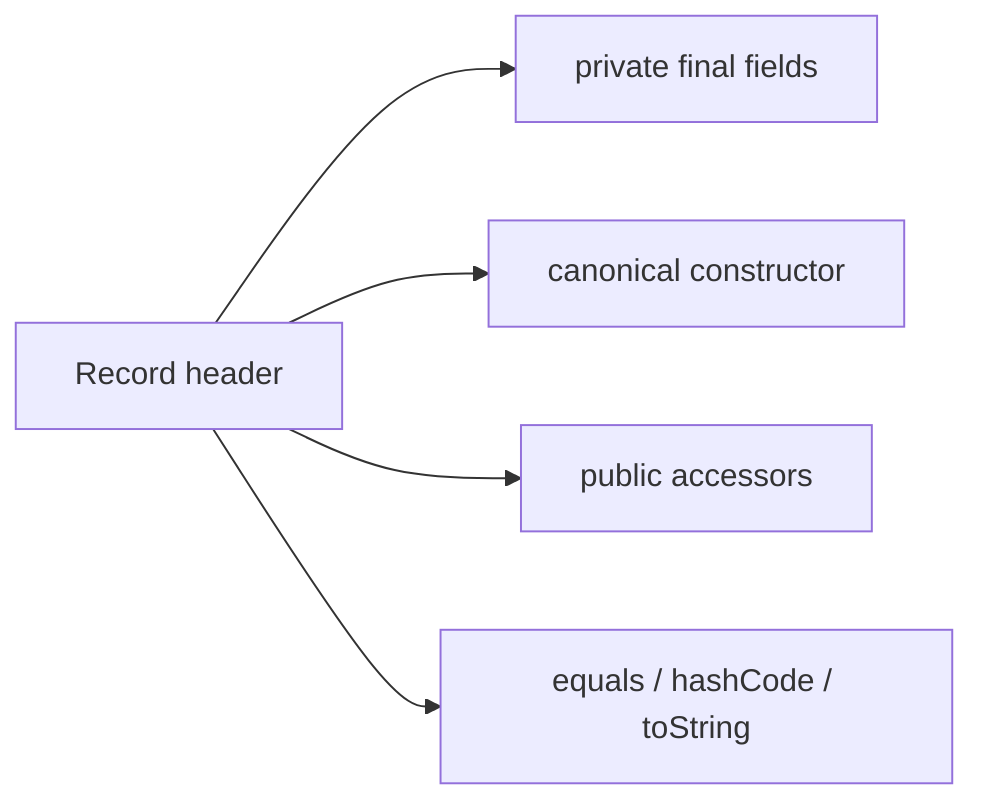

<TLDR>
  <TLDRCell label="what">
    A <Term id="record-class">record class</Term> declares a fixed set of data components in its header and gets a constructor, accessors, and value-oriented methods from the compiler.
  </TLDRCell>
  <TLDRCell label="trap">
    Component fields are `final`, but the objects they reference can still be mutable; a record provides only shallow immutability.
  </TLDRCell>
  <TLDRCell label="fix">
    Validate and copy mutable inputs in the canonical constructor so components, accessors, equality, and record patterns share one state contract.
  </TLDRCell>
</TLDR>

## What it is and why it exists

A record class is a restricted kind of class that represents a transparent group of values. In `record Point(int x, int y) {}`, the header defines the state, construction parameters, and public access API together. You no longer have to compare repeated code across fields, a constructor, getters, and `equals()` to discover the type's primary data shape.

“Transparent” matters more than saving keystrokes. A record promises that the components in its header fully describe its state, so the compiler derives the canonical constructor, same-named accessors, `equals()`, `hashCode()`, and `toString()`. Records fit data-centered types such as coordinates, parse results, boundary request objects, compound keys, and domain messages.

A record isn't a code generator or shorthand for an ordinary JavaBean. Its component accessor is named `name()`, not `getName()`; its type is implicitly `final` and can't extend another class; its instance state can't bypass the components through extra fields. Objects that need an extensible inheritance hierarchy, mutable identity, or hidden state usually still need ordinary classes.

Records became a final feature in Java 16. Record patterns became final in Java 21 and can deconstruct record values in `instanceof` and pattern `switch`. Neither syntax needs preview features when you target Java 25 LTS.

### A suitable modeling boundary

Before choosing a record, ask whether its components are the object's complete logical state. If passing every component back to the canonical constructor should produce a value equal to the original, the type follows the record design. Component names and order are public API, not merely storage details.

A record can implement interfaces, declare type parameters, and contain instance methods, static members, and nested types. It can therefore carry behavior closely tied to the data, such as unit conversion or formatting, but shouldn't hide remote calls, database updates, or cross-aggregate workflows inside an apparently plain value.

Don't choose a record merely because a class has many fields. An entity may need stable identity rather than equality across every field, a framework may require a controlled lifecycle, or a security model may forbid `toString()` from exposing every component. Establish the contract first, then choose the syntax.

## How it works

Each component in a record header corresponds to a same-named, same-typed `private final` instance field and a no-argument `public` accessor. The compiler also supplies a canonical constructor and three final object methods. Those object methods read component fields directly rather than calling accessors that might be overridden.

This diagram shows the main API derived from the record header. The body can add behavior, but it can't declare more non-`static` instance fields.



The derived members have these observable properties:

- Each component corresponds to a `private final`, non-static field.
- Each component has a same-named, same-typed, no-argument `public` accessor.
- The canonical constructor accepts every component in header order.
- `equals()` compares every component of the same record type.
- `hashCode()` is derived from every component's hash.
- `toString()` includes the record class name, component names, and component string representations.

Every record directly extends the abstract class `java.lang.Record`, but a declaration can't spell out `extends Record`. A record is implicitly `final`, so it can't serve as a base class. It can implement interfaces; when paired with a sealed interface, each record implementation automatically satisfies the requirement that a direct subtype close its branch.

### The canonical constructor

The <Term id="canonical-constructor">canonical constructor</Term> has parameter types corresponding to the components in order. If you omit it entirely, the compiler generates it and assigns each parameter to its field. In an explicit normal form, parameter names and types must match the components, and the code performs the field assignments.

A <Term id="compact-constructor">compact constructor</Term> omits the parameter list. Component names in its body denote implicit parameters, which the body can validate or rebind; after normal completion, the compiler assigns the final parameter values to fields in header order. This form is well suited to centralizing object invariants at the single entry point.

An auxiliary constructor can accept convenient inputs, but its first statement must delegate with `this(...)` to another constructor and ultimately reach the canonical constructor. No construction path can bypass component initialization or validation. A record can't use a no-argument constructor to create a half-filled object for later mutation unless that constructor supplies every component and completes the delegation.

The canonical constructor constrains component references, not the deep mutability of referenced objects. `List.copyOf()` for a list and `clone()` or `Arrays.copyOf()` for an array are ways to take ownership at construction. The right copy policy still depends on whether the elements are mutable.

### Equality and data shape

The default `equals()` accepts only an instance of the same record class, then compares components. Reference components use their `equals()` methods, primitive components use the corresponding wrapper comparison semantics, and `hashCode()` uses the same component set. Equality and hashing are therefore defined with the header; you can't treat one component as “display only” while expecting it not to affect equality.

Arrays are an important exception. An array inherits `Object.equals()` and therefore compares identity by default, so two distinct array components with identical contents make two record values unequal. If the logical state is a sequence, an unmodifiable `List` usually has better value semantics; when an array is required, copy it and deliberately design `equals()` and `hashCode()`.

Component order is also contractual. It determines canonical-constructor parameter order, the order returned by reflection, presentation in `toString()`, and positions in a record pattern. Reordering the header isn't a harmless internal refactor.

### Record patterns

A <Term id="record-pattern">record pattern</Term> first checks whether a value belongs to a named record type, then calls component accessors and passes their results to nested patterns or pattern variables. Variable names don't have to match component names, and `var` can ask the compiler to infer component types. Nested record patterns can deconstruct several record layers in the same data-shaped expression.

When record patterns consume a sealed hierarchy, the compiler can check a pattern `switch` for exhaustiveness. Don't use a broad `default` to hide a missing subtype; when one module owns all branches, listing the permitted record implementations makes a later extension surface when consumers are recompiled.

`null` doesn't match any record pattern. A pattern `switch` with a `null` selector throws `NullPointerException` unless it has `case null`; `default` doesn't replace an explicit null policy. Decide whether an API boundary rejects, converts, or handles null separately.

### Members and restrictions

A record body is a good place for derived calculations, static factories, constants, and interface implementations. An explicit accessor must keep the component's return type and be a no-argument, non-generic `public` instance method with no `throws` clause. The ability to override one doesn't mean its semantics should change casually.

These restrictions preserve the promise that the header is the state:

- A record can't declare extra non-`static` instance fields.
- It can't declare `abstract` or `native` instance methods.
- It can't explicitly extend another class and can't be extended.
- Components can't use names that conflict with certain no-argument `Object` methods, such as `hashCode` and `wait`.
- Local and member record classes are implicitly `static` and don't capture an enclosing instance.

## Examples

### Value semantics derived from the header

The first example declares only two components. Two independent instances are equal because their components match, so the second instance retrieves a `HashMap` value stored with the first.

<Depth level="quick">

```java
import java.util.HashMap;
import java.util.Map;

public class BasicRecords {
    record InventoryItem(String sku, int quantity) {}

    public static void main(String[] args) {
        var first = new InventoryItem("A-17", 12);
        var same = new InventoryItem("A-17", 12);
        Map<InventoryItem, String> locations = new HashMap<>();
        locations.put(first, "aisle-3");

        System.out.println(first);
        System.out.println("quantity=" + first.quantity());
        System.out.println("same=" + first.equals(same));
        System.out.println("lookup=" + locations.get(same));
    }
}
```

```text
InventoryItem[sku=A-17, quantity=12]
quantity=12
same=true
lookup=aisle-3
```

</Depth>

The output shows the derived `toString()`, component accessor, and `equals()` together. The `HashMap` lookup also relies on the matching derived `hashCode()`, with no additional boilerplate.

Before using any record value as a key, confirm that all its components keep stable hashes after insertion. These components are a `String` and an `int`, so external mutation can't change the key's logical state.

### Establishing invariants at construction

The next record uses a compact constructor to normalize an identifier and copy a caller-owned list. Mutating the source list after construction doesn't change the record's component, and the list returned by the accessor rejects structural mutation.

```java
import java.util.ArrayList;
import java.util.List;
import java.util.Locale;
import java.util.Objects;

public class ValidatedRecords {
    record OrderBatch(String id, List<String> items) {
        OrderBatch {
            id = Objects.requireNonNull(id).strip().toUpperCase(Locale.ROOT);
            items = List.copyOf(items);
            if (items.isEmpty()) {
                throw new IllegalArgumentException("items must not be empty");
            }
        }
    }

    public static void main(String[] args) {
        var source = new ArrayList<>(List.of("tea", "coffee"));
        var batch = new OrderBatch(" b-17 ", source);
        source.add("cocoa");

        System.out.println(batch);
        System.out.println(batch.items());
        try {
            batch.items().add("juice");
        } catch (UnsupportedOperationException error) {
            System.out.println(error.getClass().getSimpleName());
        }
    }
}
```

```text
OrderBatch[id=B-17, items=[tea, coffee]]
[tea, coffee]
UnsupportedOperationException
```

`id` and `items` in the compact constructor are implicit parameters. After they are reassigned, the compiler writes the new references to component fields, so every derived method observes the normalized state.

`List.copyOf()` copies the list structure, not its elements. The example uses immutable strings; if the elements are mutable, you must still decide whether to copy them, convert them to immutable values, or make their mutability explicit in the type contract.

### Deconstructing a sealed record hierarchy

The third example has two records implement one sealed interface. A pattern `switch` deconstructs their components, gives express delivery priority through a guard, and uses the final `Shipment` branch for all remaining shipments.

```java
import java.util.Objects;

public class PatternRecords {
    sealed interface Delivery permits Pickup, Shipment {}

    record Pickup(String orderId) implements Delivery {}

    record Address(String city, String country) {}

    record Shipment(String orderId, Address address, int days)
            implements Delivery {
        Shipment {
            Objects.requireNonNull(address, "address");
        }
    }

    static String label(Delivery delivery) {
        return switch (delivery) {
            case Pickup(String orderId) -> orderId + ": collect";
            case Shipment(String orderId, Address(String city, String country), int days)
                    when days <= 2 -> orderId + ": express to " + city;
            case Shipment(String orderId, Address(String city, String country), int days) ->
                    orderId + ": " + days + " days to " + city;
        };
    }

    public static void main(String[] args) {
        System.out.println(label(new Pickup("A-10")));
        System.out.println(label(
                new Shipment("B-20", new Address("Paris", "FR"), 2)));
        System.out.println(label(
                new Shipment("C-30", new Address("Oslo", "NO"), 5)));
    }
}
```

```text
A-10: collect
B-20: express to Paris
C-30: 5 days to Oslo
```

Branch order has semantics: the guarded special case must precede the unguarded `Shipment` pattern. A broader pattern placed first would dominate a later branch, and the compiler rejects that unreachable pattern label.

There is no `default` because the two permitted implementations of the sealed interface are both covered. If the hierarchy later permits another direct subtype, recompiling this consumer requires a branch for it.

The `Shipment` constructor also rejects a null `Address`. Without that invariant, both nested `Address` patterns would fail for a null component, and the exhaustive switch would throw `MatchException` at runtime.

### Inspecting component-annotation propagation

The last example defines a runtime annotation that may target a record component, field, method, and parameter. The compiler propagates a component annotation only where its own `@Target` permits, so reflection can observe it separately in all four places.

```java
import java.lang.annotation.ElementType;
import java.lang.annotation.Retention;
import java.lang.annotation.RetentionPolicy;
import java.lang.annotation.Target;

public class AnnotatedRecords {
    @Target({ElementType.RECORD_COMPONENT, ElementType.FIELD,
            ElementType.METHOD, ElementType.PARAMETER})
    @Retention(RetentionPolicy.RUNTIME)
    @interface Boundary {}

    record Account(@Boundary String id) {}

    public static void main(String[] args) throws ReflectiveOperationException {
        var component = Account.class.getRecordComponents()[0];
        var field = Account.class.getDeclaredField("id");
        var accessor = Account.class.getDeclaredMethod("id");
        var parameter = Account.class.getDeclaredConstructor(String.class)
                .getParameters()[0];

        System.out.println("component=" + component.isAnnotationPresent(Boundary.class));
        System.out.println("field=" + field.isAnnotationPresent(Boundary.class));
        System.out.println("accessor=" + accessor.isAnnotationPresent(Boundary.class));
        System.out.println("parameter=" + parameter.isAnnotationPresent(Boundary.class));
    }
}
```

```text
component=true
field=true
accessor=true
parameter=true
```

If the annotation targeted only `RECORD_COMPONENT`, it would be available only through `RecordComponent`; it wouldn't automatically appear on the field or accessor. The annotation also needs `RUNTIME` retention for runtime reflection to observe it.

When you explicitly declare an accessor, an annotation on the component isn't propagated to that accessor. A validator or serializer that depends on method annotations needs an integration test; don't guess which declaration a framework reads from the component's location alone.

## Pitfalls

> [!PITFALL]
> Calling a record “immutable” while a component directly references a list, map, array, or date object that its caller can still mutate.

`final` prevents a field from pointing to another reference; it doesn't prevent changes inside the referenced object. Such changes affect accessors, `toString()`, equality, and hashing, and a map entry may even become unreachable through the same mutated key object.

**Fix:** Check for null and establish ownership in the canonical constructor. Use a suitable <Term id="defensive-copy">defensive copy</Term>, including elements when necessary; for an array, consider returning another copy from an explicit accessor.

> [!PITFALL]
> Assuming an array component participates in default `equals()` and `hashCode()` by content like a list does.

Default array equality uses reference identity. Two records can be unequal even when their distinct arrays have identical contents, and mutations make a custom hash policy harder to preserve.

**Fix:** Prefer an unmodifiable `List` when the logical value is a sequence. If an array is required, copy at construction and access boundaries, implement object methods together with `Arrays.equals()` and `Arrays.hashCode()`, and add contract tests.

> [!PITFALL]
> Overriding a component accessor to mask, convert, or calculate a different value on demand.

Derived `equals()`, `hashCode()`, and `toString()` read fields directly, while record patterns call accessors. A transformed accessor can therefore make one object expose conflicting states during comparison, printing, copying, and pattern matching.

**Fix:** Let a component accessor return the component state itself and put derived representations in another clearly named method. Test the copy invariant: a record reconstructed from all accessor results should equal the original.

> [!PITFALL]
> Generating setters, extra instance fields, or a no-argument half-object constructor to satisfy old JavaBean assumptions.

Those members either fail to compile or defeat the fixed-data-shape purpose of a record. A framework version that only discovers `getName()` or depends on a mutable population flow doesn't become compatible merely because the type changed to a record.

**Fix:** Verify construction, naming, and annotation-discovery rules against the actual framework version. If the integration contract fundamentally requires a mutable bean, keep an ordinary class and convert it to an internal record at the boundary.

> [!PITFALL]
> Using record patterns at the wrong source level, or hiding missing sealed-hierarchy branches behind `default`.

Records are final from Java 16; record patterns and pattern `switch` are final from Java 21. Merely running a build on a newer JDK doesn't stop generated source from silently raising a project's minimum source version.

**Fix:** Compile with the project's promised `javac --release` value and don't enable preview for final syntax. For a sealed hierarchy whose subtypes you own, list every branch and let recompilation enforce completeness.

## In the AI era

**What generated code gets wrong here**

Generators often equate `record` with deep immutability and store mutable collections or arrays directly; they also copy ordinary-class templates that add setters, builder state, or extra instance caches. Another failure is transforming values in overridden accessors without noticing that object methods read fields while record patterns read accessors, breaking the copy invariant.

Models also confuse feature versions: they emit Java 21 record patterns in a Java 17 project or pair already-final syntax with preview flags. In framework code, they may assume any component annotation propagates to fields, accessors, and constructor parameters, ignoring the annotation's own `@Target` and `@Retention`.

**Ask your AI to check**

- List each component's mutability, ownership, and copy policy, including whether its elements remain mutable.
- Compile every record declaration and pattern `switch` with the project's actual `javac --release`, without preview enabled.
- Trace the allowed targets of each component annotation and the declaration the framework actually inspects, including explicit accessors.

**Review checklist**

- Mutate constructor arguments and accessor results, then confirm the record state and hashed keys remain stable.
- Verify that `equals()` and `hashCode()` use the same logical state, with dedicated tests for array components.
- Reconstruct the object from accessor results, then test equality, pattern branches, null, and a newly permitted sealed subtype.

**Prompt vocabulary**

Use the exact terms `record component`, `canonical constructor`, `compact constructor`, `shallow immutability`, `defensive copy`, `copy invariant`, `record pattern`, and `exhaustive switch`. State the target `--release`, component ownership, and annotation targets too; “make this modern Java” isn't a usable contract.

<Depth level="deep">

## Equality and the copy invariant

The core semantics of a record are not “generate a few methods”; the component list describes the value's state. For a value `r1` of record class `R`, reading each component and passing the results to the canonical constructor should normally produce an `r2` for which `r1.equals(r2)` is true. This copy invariant constrains explicit accessors and normalization logic.

Normalize in the constructor. If a constructor uppercases an identifier, the field, accessor, and object methods all observe the uppercase value, and copying through the accessor produces another equal object. If only the accessor uppercases it on demand, the field retains the original value and the copy may not equal its source.

Default `equals()` requires the same runtime record class; two different record classes don't become equal merely because their components happen to match. That prevents structurally similar domain types from mixing accidentally. When cross-type comparison is needed, compare an explicit shared value object or business key rather than weakening record type boundaries.

Floating-point components use corresponding wrapper comparison semantics rather than a simple `==`. This keeps derived equality reflexive and consistent with derived hashing. A numeric domain should still choose rounding, units, and normalization before storing a canonical value in a component.

## Reflection and annotation targets

`Class.isRecord()` reports whether a class is a record, and `Class.getRecordComponents()` returns `RecordComponent` objects in header order. Each object exposes its component name, generic type, corresponding accessor, and runtime annotations directly applicable to the component context. An ordinary class returns `null` from `getRecordComponents()`, which callers must not confuse with a zero-component record.

Annotation propagation is decided separately for each target. `FIELD` permits propagation to the implicit field, `METHOD` to the implicit accessor, `PARAMETER` to an implicit canonical-constructor parameter, and `RECORD_COMPONENT` retains the annotation on the component declaration itself. An annotation need not permit all of them.

An explicit accessor and an explicit normal canonical constructor change propagation details. In particular, component annotations don't propagate to an explicit accessor, so processors and frameworks must document whether they inspect components, fields, methods, or parameters. A reflection integration test is more reliable than observing that an annotation still appears somewhere after migration.

## Serialization and API evolution

Java native serialization treats record values differently from ordinary serializable objects and invokes the canonical constructor during deserialization. Constructor invariants therefore remain part of that boundary, but this doesn't make records a good long-term persistence format. Security and compatibility policies still need to address input validation, allowed types, and format evolution.

Component names, types, and order form a public shape. Adding a component changes the canonical-constructor signature, while removing or reordering components also breaks callers, reflection code, and record patterns. Review a published record header as an API signature, not as a private field list that can change freely.

The default `toString()` is useful for diagnostics, not a stable interchange format. It contains every component's string representation, can change with the header, and may expose tokens, email addresses, or internal identifiers. Don't protect sensitive values with a convention that “logs won't call it”; redesign the boundary type or provide a redacted logging representation.

External JSON, database, and messaging frameworks each define their own record support and naming rules. The language specification doesn't promise that a third-party framework accepts a constructor, annotation location, or missing field. Use real-version round-trip tests during an upgrade or migration, and manage the wire format separately from the Java source shape.

## Runtime boundaries of record patterns

A record pattern isn't special syntax for reading fields; it invokes record component accessors. Nested patterns continue matching from the outside inward, and the whole record pattern fails when a nested type pattern doesn't match. If an accessor throws a runtime exception, matching doesn't silently turn that exception into “no match.”

This mechanism again requires accessors to remain simple, stable, and faithful to components. Putting I/O, random values, or time-sensitive calculations in an accessor creates hidden side effects or unstable pattern results. Derived behavior belongs in an ordinary method; a pattern should only test and deconstruct state.

A generic record pattern can infer type arguments from the selector's static type, but it doesn't make non-reifiable generic checks suddenly available. The compiler still applies casting compatibility and pattern-dominance rules. When generated code uses a raw-type pattern, check whether it discarded static type information that could have been retained.

Exhaustiveness is a source-compilation guarantee, not universal protection for arbitrary deployment combinations. If a sealed hierarchy and its consumer are compiled separately and only the provider binary is replaced, the old consumer wasn't rechecked for a new branch. Libraries and services deployed across versions still need compatibility tests and an explicit upgrade order.

</Depth>

<Checkpoint id="java/records" />

## Further reading

- [Java Language Specification 25: record classes](https://docs.oracle.com/javase/specs/jls/se25/html/jls-8.html#jls-8.10)
- [Java Language Specification 25: patterns](https://docs.oracle.com/javase/specs/jls/se25/html/jls-14.html#jls-14.30)
- [Java SE 25 API: `java.lang.Record`](https://docs.oracle.com/en/java/javase/25/docs/api/java.base/java/lang/Record.html)
- [Java Object Serialization Specification 25: serialization of records](https://docs.oracle.com/en/java/javase/25/docs/specs/serialization/serial-arch.html#serialization-of-records)
- [JEP 395: Records](https://openjdk.org/jeps/395)
- [JEP 440: Record Patterns](https://openjdk.org/jeps/440)
