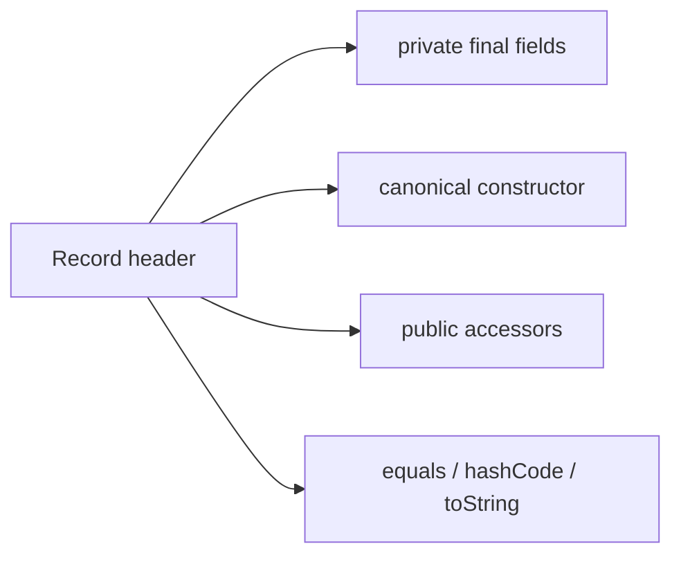

<TLDR>
  <TLDRCell label="what">
    <Term id="record-class">记录类（record class）</Term>用一个头部声明固定的数据组件，并由编译器派生构造器、访问器和值语义方法。
  </TLDRCell>
  <TLDRCell label="trap">
    组件字段是 `final`，但组件引用的对象仍可能可变；记录类只提供浅层不可变性。
  </TLDRCell>
  <TLDRCell label="fix">
    在规范构造器中校验并复制可变输入，让组件、访问器、相等性和记录模式共同遵守同一个状态契约。
  </TLDRCell>
</TLDR>

## 是什么，为什么存在

记录类是一种受约束的类，用来表示一组透明的值。声明 `record Point(int x, int y) {}` 时，头部同时给出状态、构造参数和公开访问接口。读者不必在字段、构造器、getter 与 `equals()` 之间核对重复代码，类型的主要数据形状一眼可见。

这里的“透明”比“少写代码”更重要。记录类承诺其状态由头部列出的组件完整描述，编译器据此派生规范构造器、同名访问器、`equals()`、`hashCode()` 和 `toString()`。它适合坐标、解析结果、请求边界对象、复合键和领域消息等以数据为中心的类型。

记录类不是自动生成器，也不是普通 JavaBean 的缩写。组件访问器名为 `name()`，不是 `getName()`；类型隐式为 `final`，不能继承其他类；实例状态也不能绕过组件另加字段。需要可扩展继承层次、可变身份或隐藏状态的对象通常仍应使用普通类。

记录类在 Java 16 成为正式特性。记录模式在 Java 21 成为正式特性，可在 `instanceof` 和模式 `switch` 中解构记录值。面向 Java 25 LTS 编写这两类语法时不需要启用预览特性。

### 合适的建模边界

选择记录类之前，先问组件是否就是对象的完整逻辑状态。如果从所有组件重新调用规范构造器，理应得到与原对象相等的值，这个类型就符合记录类的设计方向。组件名称与顺序都是公开 API，而不只是存储细节。

记录类可以实现接口、声明泛型参数，并拥有实例方法、静态成员和嵌套类型。它因此可以携带与数据紧密相关的行为，例如单位换算或格式化，但不应把远程调用、数据库更新或跨聚合工作流藏进看似纯粹的数据值。

不应仅因字段很多就选择记录类。实体可能需要稳定身份而不是按全部字段相等，框架可能要求受控的生命周期，安全模型也可能不允许 `toString()` 暴露所有组件。先确定契约，再决定语法。

## 工作原理

记录头部中的每个组件都会对应一个同名、同类型的 `private final` 实例字段，以及一个无参数的 `public` 访问器。编译器还提供规范构造器和三个最终对象方法。对象方法直接读取组件字段，而不是调用可能被重写的访问器。

下面的结构图展示记录头部派生出的主要 API。记录体可以补充行为，但不能再声明非 `static` 实例字段。



编译器派生的成员具有这些可观察属性：

- 每个组件对应一个 `private final` 非静态字段。
- 每个组件对应一个同名、同类型、无参数的 `public` 访问器。
- 规范构造器按头部顺序接收全部组件。
- `equals()` 按同一记录类型的全部组件比较。
- `hashCode()` 由全部组件的哈希值派生。
- `toString()` 包含记录类名、组件名和组件的字符串表示。

所有记录类都直接继承抽象类 `java.lang.Record`，但声明中不能写 `extends Record`。记录类隐式为 `final`，所以不能作为基类。它可以实现接口；配合密封接口时，每个记录实现天然满足直接子类型必须封闭的要求。

### 规范构造器

<Term id="canonical-constructor">规范构造器（canonical constructor）</Term>的参数类型与组件按顺序一一对应。完全省略它时，编译器生成构造器并把每个参数赋给对应字段。显式声明普通形式时，参数名和类型必须与组件匹配，并由代码完成字段赋值。

<Term id="compact-constructor">紧凑构造器（compact constructor）</Term>省略参数列表。构造器体内的组件名表示隐式参数，可以先校验或重新绑定；构造器体正常结束后，编译器再按头部顺序把最终参数值赋给字段。这个形式适合把对象不变量集中在唯一入口。

额外构造器可以提供便利输入，但第一条语句必须通过 `this(...)` 委托给另一个构造器，最终到达规范构造器。这样不会出现某条构造路径绕过组件初始化或校验。记录类不能用无参数构造器制造“稍后再填”的半成品，除非它明确为全部组件提供值并完成委托。

规范构造器建立的是组件引用本身的约束，而不是引用对象的深层不可变性。对列表使用 `List.copyOf()`、对数组使用 `clone()` 或 `Arrays.copyOf()`，都是在构造边界取得所有权的方式。具体复制策略取决于元素是否也可变。

### 相等性与数据形状

默认 `equals()` 只会接受同一个记录类的实例，然后按组件比较。引用组件采用其 `equals()`，基本类型采用对应包装类型的比较语义；`hashCode()` 使用同一组组件。相等性与哈希因此随头部一起定义，不能把某个组件当作“仅供展示”而又期待它不参与相等。

数组是一个重要例外。数组继承 `Object.equals()`，默认比较身份，所以两个内容相同但实例不同的数组组件会让两个记录值不相等。若逻辑状态是一段序列，通常用不可修改的 `List` 更贴近值语义；确实需要数组时，则要复制数组并明确设计 `equals()` 与 `hashCode()`。

组件顺序也属于契约。它决定规范构造器参数顺序、反射返回的记录组件顺序、`toString()` 的展示顺序，以及记录模式的解构位置。重排头部不是无害的内部重构。

### 记录模式

<Term id="record-pattern">记录模式（record pattern）</Term>先检查值是否属于指定记录类型，再调用组件访问器，把结果交给嵌套模式或模式变量。模式变量名不必与组件名一致，`var` 也可以让编译器推断组件类型。嵌套记录模式能够按对象的数据形状一次解构多层记录。

记录模式与密封层次结合时，编译器可以检查模式 `switch` 是否穷尽。不要用宽泛的 `default` 隐藏新子类型；由一个模块控制全部分支时，列出允许的记录实现，能让后续扩展在重新编译消费者时暴露遗漏。

`null` 不匹配任何记录模式。模式 `switch` 若没有 `case null`，选择器为 `null` 时会抛出 `NullPointerException`，`default` 也不会替代显式的空值策略。API 边界应先决定拒绝、转换还是专门处理空值。

### 成员与限制

记录体适合声明派生计算、静态工厂、常量和接口实现。显式访问器必须保持与组件相同的返回类型，且必须是无参数、非泛型、无 `throws` 的 `public` 实例方法。能重写不代表应随意改变访问器语义。

这些限制维护“头部就是状态”的承诺：

- 不能声明额外的非 `static` 实例字段。
- 不能声明 `abstract` 或 `native` 实例方法。
- 不能显式继承其他类，也不能被继承。
- 组件不能使用若干会与 `Object` 无参数方法冲突的名称，例如 `hashCode` 和 `wait`。
- 局部记录类和成员记录类隐式为 `static`，不捕获外围实例。

## 示例

### 由头部派生值语义

第一个示例只声明两个组件。两个独立实例因为组件相同而相等，所以第二个实例可以查到第一个实例写入 `HashMap` 的值。

<Depth level="quick">

```java
import java.util.HashMap;
import java.util.Map;

public class BasicRecords {
    record InventoryItem(String sku, int quantity) {}

    public static void main(String[] args) {
        var first = new InventoryItem("A-17", 12);
        var same = new InventoryItem("A-17", 12);
        Map<InventoryItem, String> locations = new HashMap<>();
        locations.put(first, "aisle-3");

        System.out.println(first);
        System.out.println("quantity=" + first.quantity());
        System.out.println("same=" + first.equals(same));
        System.out.println("lookup=" + locations.get(same));
    }
}
```

```text
InventoryItem[sku=A-17, quantity=12]
quantity=12
same=true
lookup=aisle-3
```

</Depth>

输出同时展示了派生的 `toString()`、组件访问器和 `equals()`。`HashMap` 查找还依赖与相等性一致的派生 `hashCode()`，不需要额外样板代码。

把记录值用作键之前，仍要确认所有组件在进入映射后保持哈希稳定。这里只包含 `String` 和 `int`，它们不会在外部修改后改变键的逻辑状态。

### 在构造边界建立不变量

下一个记录用紧凑构造器规范化标识，并复制调用方提供的列表。构造完成后修改原列表，不会改变记录持有的组件；访问器返回的列表也拒绝结构修改。

```java
import java.util.ArrayList;
import java.util.List;
import java.util.Locale;
import java.util.Objects;

public class ValidatedRecords {
    record OrderBatch(String id, List<String> items) {
        OrderBatch {
            id = Objects.requireNonNull(id).strip().toUpperCase(Locale.ROOT);
            items = List.copyOf(items);
            if (items.isEmpty()) {
                throw new IllegalArgumentException("items must not be empty");
            }
        }
    }

    public static void main(String[] args) {
        var source = new ArrayList<>(List.of("tea", "coffee"));
        var batch = new OrderBatch(" b-17 ", source);
        source.add("cocoa");

        System.out.println(batch);
        System.out.println(batch.items());
        try {
            batch.items().add("juice");
        } catch (UnsupportedOperationException error) {
            System.out.println(error.getClass().getSimpleName());
        }
    }
}
```

```text
OrderBatch[id=B-17, items=[tea, coffee]]
[tea, coffee]
UnsupportedOperationException
```

紧凑构造器中的 `id` 与 `items` 是隐式参数。对它们重新赋值后，编译器把新引用写入组件字段，因此派生方法看到的是规范化后的状态。

`List.copyOf()` 只复制列表结构，不会深复制元素。示例使用不可变字符串；若元素本身可变，还要决定复制元素、转换为不可变值，还是把可变性明确留在类型契约中。

### 解构密封的记录层次

第三个示例让两个记录实现同一个密封接口。模式 `switch` 解构组件，守卫优先识别快速配送，最后一个 `Shipment` 分支覆盖其余运输值。

```java
import java.util.Objects;

public class PatternRecords {
    sealed interface Delivery permits Pickup, Shipment {}

    record Pickup(String orderId) implements Delivery {}

    record Address(String city, String country) {}

    record Shipment(String orderId, Address address, int days)
            implements Delivery {
        Shipment {
            Objects.requireNonNull(address, "address");
        }
    }

    static String label(Delivery delivery) {
        return switch (delivery) {
            case Pickup(String orderId) -> orderId + ": collect";
            case Shipment(String orderId, Address(String city, String country), int days)
                    when days <= 2 -> orderId + ": express to " + city;
            case Shipment(String orderId, Address(String city, String country), int days) ->
                    orderId + ": " + days + " days to " + city;
        };
    }

    public static void main(String[] args) {
        System.out.println(label(new Pickup("A-10")));
        System.out.println(label(
                new Shipment("B-20", new Address("Paris", "FR"), 2)));
        System.out.println(label(
                new Shipment("C-30", new Address("Oslo", "NO"), 5)));
    }
}
```

```text
A-10: collect
B-20: express to Paris
C-30: 5 days to Oslo
```

分支顺序有语义：带守卫的具体情况必须出现在无守卫的 `Shipment` 模式之前。更宽的模式放在前面会支配后续分支，编译器会拒绝不可达的模式标签。

这里没有 `default`，因为密封接口的两个允许实现已经全部覆盖。以后新增允许的直接子类型时，重新编译这段消费者代码会要求处理新分支。

`Shipment` 构造器还会拒绝空的 `Address`。如果没有这个不变量，两个嵌套 `Address` 模式都会因组件为 `null` 而失败，穷尽 `switch` 随后会在运行时抛出 `MatchException`。

### 检查组件注解的传播

最后一个示例把一个运行时注解声明为可用于记录组件、字段、方法和参数。编译器只会把组件注解传播到其 `@Target` 允许的位置，反射因此能在四处分别看到它。

```java
import java.lang.annotation.ElementType;
import java.lang.annotation.Retention;
import java.lang.annotation.RetentionPolicy;
import java.lang.annotation.Target;

public class AnnotatedRecords {
    @Target({ElementType.RECORD_COMPONENT, ElementType.FIELD,
            ElementType.METHOD, ElementType.PARAMETER})
    @Retention(RetentionPolicy.RUNTIME)
    @interface Boundary {}

    record Account(@Boundary String id) {}

    public static void main(String[] args) throws ReflectiveOperationException {
        var component = Account.class.getRecordComponents()[0];
        var field = Account.class.getDeclaredField("id");
        var accessor = Account.class.getDeclaredMethod("id");
        var parameter = Account.class.getDeclaredConstructor(String.class)
                .getParameters()[0];

        System.out.println("component=" + component.isAnnotationPresent(Boundary.class));
        System.out.println("field=" + field.isAnnotationPresent(Boundary.class));
        System.out.println("accessor=" + accessor.isAnnotationPresent(Boundary.class));
        System.out.println("parameter=" + parameter.isAnnotationPresent(Boundary.class));
    }
}
```

```text
component=true
field=true
accessor=true
parameter=true
```

如果注解只把 `RECORD_COMPONENT` 列入目标，就只能通过 `RecordComponent` 读取，不会自动出现在字段或访问器上。注解还必须采用 `RUNTIME` 保留策略，运行时反射才能观察到它。

显式声明访问器时，组件上的注解不会自动传播到该访问器。依赖方法注解的校验器或序列化器需要集成测试，不能从组件位置猜测框架最终读取的声明。

## 陷阱

> [!PITFALL]
> 把记录类称为“不可变对象”，却让组件直接引用调用方仍能修改的列表、映射、数组或日期对象。

`final` 只禁止字段改指向另一个引用，不禁止引用对象内部变化。变化会影响访问器、`toString()`、相等性和哈希结果，作为映射键时甚至可能再也无法按同一个对象查到条目。

**修复方法：** 在规范构造器中执行空值检查并取得所有权。使用适合组件的防御性复制（defensive copy），必要时连元素一起复制；对数组还要考虑在显式访问器中返回副本。

> [!PITFALL]
> 认为数组组件会像列表一样按内容参与默认 `equals()` 与 `hashCode()`。

数组的默认相等性按引用身份判断。两个记录即使分别持有内容相同的数组，也可能不相等；数组内容变化还会让自定义哈希策略难以维持。

**修复方法：** 逻辑上表示序列时优先存储不可修改的 `List`。必须使用数组时，在构造和访问边界复制，并成对实现基于 `Arrays.equals()` 与 `Arrays.hashCode()` 的对象方法，同时为此编写契约测试。

> [!PITFALL]
> 重写组件访问器来掩码、换算或临时计算一个不同值。

派生的 `equals()`、`hashCode()` 与 `toString()` 直接读取字段，而记录模式会调用访问器。访问器返回不同表示时，同一个对象在比较、打印、复制和模式匹配中可能呈现互相冲突的状态。

**修复方法：** 让组件访问器返回组件状态本身，把派生表示放进另一个有明确名称的方法。测试复制不变量：用全部访问器结果重新构造的记录应与原值相等。

> [!PITFALL]
> 为满足旧式 JavaBean 假设而生成 setter、额外实例字段或无参数半成品构造器。

这些成员要么不允许编译，要么破坏记录类表达固定数据形状的目的。某些框架版本只查找 `getName()` 或依赖可变填充流程，也不会因为类型改成记录类就自动兼容。

**修复方法：** 在真实框架版本上验证构造、命名和注解发现规则。若集成契约本质上要求可变 Bean，就保留普通类，并在边界把它转换为内部记录值。

> [!PITFALL]
> 在不匹配的源码级别使用记录模式，或用 `default` 掩盖密封层次的遗漏分支。

记录类从 Java 16 起正式可用，记录模式与模式 `switch` 从 Java 21 起正式可用。仅在较新的 JDK 上运行构建，不会阻止生成代码偷偷提高项目的最低源码版本。

**修复方法：** 用项目承诺的 `javac --release` 值编译，并且不要为稳定语法启用预览。对拥有全部子类型的密封层次列出每个分支，让重新编译承担完整性检查。

## AI 时代

**生成代码在这里常犯的错**

生成器常把 `record` 等同于深层不可变，直接保存可变集合或数组；也会照搬普通类模板，添加 setter、builder 状态或额外实例缓存。另一类错误是重写访问器进行转换，却没意识到对象方法读字段、记录模式读访问器，结果破坏复制不变量。

模型还会混淆特性版本：在 Java 17 项目中生成 Java 21 的记录模式，或把已经正式的语法与预览开关绑定。面对框架代码，它可能假定任意组件注解都会传播到字段、访问器和构造参数，而忽略注解自己的 `@Target` 与 `@Retention`。

**让 AI 检查**

- 列出每个组件的可变性、所有权和复制策略，并指出元素是否仍可变。
- 用项目的实际 `javac --release` 编译全部记录声明和模式 `switch`，不启用预览。
- 跟踪每个组件注解允许的目标及框架真正检查的位置，包括显式访问器。

**审查清单**

- 修改构造参数和访问器返回值，确认记录状态与哈希键仍保持稳定。
- 验证 `equals()` 与 `hashCode()` 使用同一逻辑状态，并专门测试数组组件。
- 用访问器结果重建对象，再测试相等性、模式分支、空值与新增密封子类型。

**提示词词汇**

使用准确术语：`record component`（记录组件）、`canonical constructor`（规范构造器）、`compact constructor`（紧凑构造器）、`shallow immutability`（浅层不可变性）、`defensive copy`（防御性复制）、`copy invariant`（复制不变量）、`record pattern`（记录模式）和 `exhaustive switch`（穷尽 `switch`）。还应明确目标 `--release` 值、组件所有权和注解目标，而不是只要求“改成现代 Java”。

<Depth level="deep">

## 相等性与复制不变量

记录类的核心语义不是“自动生成若干方法”，而是组件列表定义值的状态描述。对记录类 `R` 的值 `r1`，依次读取组件并调用规范构造器得到 `r2`，通常应满足 `r1.equals(r2)`。这个复制不变量约束显式访问器与规范化逻辑的设计。

规范化应在构造器内完成。若构造器把标识转成大写，那么字段、访问器和对象方法都会看到大写值，使用访问器复制也会再次得到相等对象。若访问器才临时转大写，字段仍保存原值，复制结果就可能与原对象不相等。

默认 `equals()` 要求运行时记录类型相同，不会让两个组件恰好相同的不同记录类相等。这避免了不同领域类型因为结构偶然而混在一起。需要跨类型比较时，应比较明确的共享值对象或业务键，而不是削弱记录类的类型边界。

浮点组件遵循对应包装类的比较语义，而不是简单使用 `==`。这让派生相等性保持自反，并与派生哈希一致。涉及数值领域规则时，仍应先决定舍入、单位和规范化，再把规范值放入组件。

## 反射与注解目标

`Class.isRecord()` 判断类是否为记录类，`Class.getRecordComponents()` 按头部顺序返回 `RecordComponent` 数组。每个元素可以提供组件名、泛型类型、对应访问器和直接适用于组件位置的运行时注解。普通类会让 `getRecordComponents()` 返回 `null`，调用方不应把它与零组件记录混淆。

注解传播由目标位置分别决定。允许 `FIELD` 才会传播到隐式字段，允许 `METHOD` 才会传播到隐式访问器，允许 `PARAMETER` 才会传播到隐式规范构造器参数；允许 `RECORD_COMPONENT` 则让注解保留在组件声明自身。一个注解不必同时允许全部位置。

显式访问器与显式普通形式的规范构造器改变了传播细节。尤其是组件注解不会传播到显式访问器，因此处理器和框架应说明它读取组件、字段、方法还是参数。迁移普通类时，反射集成测试比“注解看起来还在”更可靠。

## 序列化与 API 演进

Java 原生序列化会以不同于普通可序列化对象的方式处理记录值，并在反序列化时调用规范构造器。这意味着构造器不变量仍是边界的一部分，但不代表记录类适合长期持久化。安全与兼容策略仍需围绕输入验证、允许类型和格式演进来设计。

组件名称、类型和顺序构成公开形状。新增组件会改变规范构造器签名，删除或重排组件也会破坏调用者、反射代码与记录模式。发布库时，应把记录头部当成 API 签名审查，而不是可以自由调整的私有字段列表。

默认 `toString()` 适合诊断，不是稳定交换格式。它会包含每个组件的字符串表示，既可能随头部变化，也可能泄露令牌、邮箱或内部标识。敏感值不应仅靠“日志不会调用它”的约定保护，应重新设计边界类型或提供经过筛选的日志表示。

外部 JSON、数据库与消息框架各自定义记录支持和命名规则。语言规范不会保证第三方框架接受某个构造器、注解位置或缺失字段。升级或迁移时，应使用真实版本做往返测试，并把线上格式与 Java 源码形状分开管理。

## 记录模式的运行边界

记录模式不是读取字段的特殊语法，它会调用记录组件访问器。嵌套模式按外层到内层继续匹配，某个嵌套类型模式失败时，整个记录模式不匹配。访问器若抛出运行时异常，匹配也不会把它静默变成“不匹配”。

这个机制再次要求访问器保持简单、稳定并忠实于组件。把 I/O、随机值或时间相关计算放进访问器，会让模式匹配产生隐藏副作用或不稳定结果。派生行为应该使用普通方法，模式只负责检查并解构状态。

泛型记录模式可以从选择器的静态类型推断类型参数，但不会让不可具体化的泛型检查突然变得可用。编译器仍应用强制转换兼容性与模式支配规则。看到生成的原始类型模式时，应检查是否丢失了本可保留的静态类型信息。

穷尽检查是源码编译时保证，不是任意部署组合的万能保护。密封层次与消费者分开编译、再只替换提供方二进制时，旧消费者没有经过新分支的重新检查。库与服务跨版本部署时仍需兼容性测试和明确的升级顺序。

</Depth>

<Checkpoint id="java/records" />

## 延伸阅读

- [Java 语言规范 25：记录类](https://docs.oracle.com/javase/specs/jls/se25/html/jls-8.html#jls-8.10)
- [Java 语言规范 25：模式](https://docs.oracle.com/javase/specs/jls/se25/html/jls-14.html#jls-14.30)
- [Java SE 25 API：`java.lang.Record`](https://docs.oracle.com/en/java/javase/25/docs/api/java.base/java/lang/Record.html)
- [Java 对象序列化规范 25：记录类的序列化](https://docs.oracle.com/en/java/javase/25/docs/specs/serialization/serial-arch.html#serialization-of-records)
- [JEP 395：记录类](https://openjdk.org/jeps/395)
- [JEP 440：记录模式](https://openjdk.org/jeps/440)
