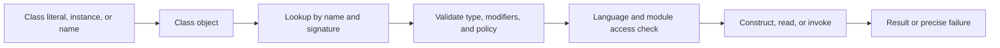

<TLDR>
  <TLDRCell label="what">
    <Term id="reflection">Reflection</Term> lets code inspect runtime types and members, then construct objects, access fields, or invoke methods when the signature isn't known until runtime.
  </TLDRCell>
  <TLDRCell label="trap">
    `getDeclaredMethod()` doesn't search superclasses, parameter types must match exactly, and `setAccessible(true)` can't cross a module boundary that hasn't been opened.
  </TLDRCell>
  <TLDRCell label="fix">
    Define lookup, visibility, exception, and allowed-type policies first, then cache validated metadata; use ordinary polymorphism whenever it expresses the contract.
  </TLDRCell>
</TLDR>

## What it is and why it exists

Java reflection is a set of runtime APIs for inspecting metadata about classes, interfaces, arrays, primitive types, and their members. The entry point is usually `Class<?>`; objects such as `Constructor`, `Method`, `Field`, and `RecordComponent` represent members. Obtaining those objects doesn't execute the underlying members: lookup, access checking, and execution are separate stages.

Reflection solves the problem of not knowing the concrete type or member when code is compiled. A test runner discovers annotated methods, a serializer reads a data shape, a dependency injection container selects a constructor from configuration, and a plugin boundary may receive only a class name. These systems handle open runtime input that a static call can't enumerate in source.

You'll also encounter reflection in diagnostic tools, IDEs, object mappers, and framework startup. It works well when code reads structured metadata and turns it into a validated execution plan. When business code already knows the interface or class, ordinary construction, method calls, and polymorphism are clearer and preserve compiler checks.

Reflection isn't a universal encapsulation bypass or a security sandbox. Member access remains subject to Java language access rules, module exports and opens, and the identity of the caller. Passing external strings directly to `Class.forName()` or `Method.invoke()` also turns class and method selection into an input-validation problem.

Runtime type information isn't the complete source program either. Type erasure removes some generic information, local variable names are generally unavailable, parameter names are reliable only with the right compiler option, and annotations without `RUNTIME` retention aren't visible through runtime reflection. A reflection consumer must define what missing metadata means instead of treating “not observed” as “doesn't exist.”

A dynamic requirement doesn't automatically require reflection. Discovery of implementations for a known service interface can use `ServiceLoader`, behavior can vary through a strategy interface, and builds can generate member-access code. When you choose reflection, you should be able to name the fact available only at runtime and say how failure is exposed to callers.

## How it works

The JVM maintains a runtime representation for each loaded type, and Java exposes it through `Class`. A class literal such as `Order.class` needs no instance; `order.getClass()` returns an object's actual runtime class; `Class.forName(name)` looks up a binary name and initializes the class by default. To load without initialization, use the overload that accepts an `initialize` flag and a class loader.

A `Class` object includes class-loader identity. The same binary name defined by different class loaders produces different runtime types, and casts plus `isAssignableFrom()` respect that distinction. In a plugin system, “same name but cannot cast” usually indicates a loader boundary rather than random reflection failure.

A reflective operation has five stages: obtain a runtime type, find a member under an explicit rule, validate modifiers and signature, establish access, then execute and convert the result. Keeping these stages in an adapter or startup phase lets business paths use already validated constructors or methods. Rescanning on every request also delays configuration errors until traffic reaches the path.



A reflection object describes a declaration but doesn't make a string-based call statically type-safe. A misspelled name produces `NoSuchMethodException`, an incompatible receiver or argument produces `IllegalArgumentException`, and failed access produces `IllegalAccessException`. An exception thrown by target code adds another wrapper.

### `Class` and type relationships

Every Java type has a corresponding `Class` object, including `int.class`, `void.class`, and `String[].class`. Generic code commonly uses `Class<?>`; when an API must return a known base type, `Class<T>` can connect a type token to its return type. It still can't represent the complete parameterized type `List<String>` because `List<String>.class` doesn't exist.

Choose the type test that matches the question. `candidate.isInstance(value)` is the dynamic counterpart of `instanceof`; `parent.isAssignableFrom(child)` asks whether a `child` value can be assigned to `parent`. Their argument directions differ, and generated code frequently reverses `isAssignableFrom()`.

`getName()` returns the JVM's name form, so an array name may be `[Ljava.lang.String;`. Human-facing diagnostics usually benefit from `getTypeName()` or `getSimpleName()`, but a simple name may be empty and doesn't uniquely identify a type. A persistent protocol must not depend on display names or compiler-generated names for local and anonymous classes.

| Goal | API | Important boundary |
| --- | --- | --- |
| Known type | `Order.class` | Needs no instance and performs no string lookup |
| Actual type of an instance | `value.getClass()` | `value` must not be `null` |
| Load by name | `Class.forName(name)` | Name, class loader, and initialization policy are all contractual |
| Dynamic instance test | `type.isInstance(value)` | Returns `false` for `null` |
| Dynamic assignment test | `target.isAssignableFrom(source)` | Direction means “can source be assigned to target?” |

Reflection can also expose compiler-generated declarations. Bridge methods, synthetic fields, and helper members for enums and inner classes may appear in scans. A framework should check `isBridge()`, `isSynthetic()`, and modifiers according to its contract instead of treating every returned member as user API.

Don't treat a returned member array as declaration order. If registration, output, or conflict resolution must be stable, sort by an explicit key and define a policy for duplicate signatures or annotations. Tests that depend on reflection order can break when the compiler, build shape, or runtime changes.

### Public members and declared members

`getMethod()` and `getMethods()` provide a view of `public` methods and include inherited members according to their rules. `getDeclaredMethod()` and `getDeclaredMethods()` look only at members declared directly by the current class but include non-`public` declarations. Field and constructor APIs use similar names; constructors are never inherited.

Method lookup by name also requires exact parameter types. `int.class` and `Integer.class` are different keys, `ArrayList.class` doesn't automatically match a parameter declared as `List`, and `null` can't tell the lookup which overload to choose. Reflection lookup doesn't perform Java source overload resolution for you.

| Query | Current class non-public member | Inherited public member | Typical use |
| --- | --- | --- | --- |
| `getMethod(name, types)` | No | Yes | Invoke a public API |
| `getDeclaredMethod(name, types)` | Yes | No | Inspect a declaration or a controlled framework contract |
| `getField(name)` | No | Yes | Read a public field |
| `getDeclaredField(name)` | Yes | No | Inspect the current class's data shape |
| `getConstructor(types)` | Public only | Not applicable | Construct a public type |
| `getDeclaredConstructor(types)` | Includes non-public | Not applicable | Construct inside a controlled container |

When scanning a hierarchy, don't mechanically loop over `getDeclaredMethods()` and take the first matching name. Overrides, bridge methods, interface defaults, and covariant returns all affect the candidates. First decide whether the contract needs the public invocation view or every layer's declaration view, then implement that algorithm.

If users can select an operation by string, map the string to an allowlist of validated signatures first. A public method isn't necessarily safe for remote invocation, and a method name isn't authorization. The allowlist should also fix the receiver type, argument conversion, result handling, and exception policy.

### Invocation, conversion, and exceptions

`Constructor.newInstance()` creates an object, `Method.invoke(receiver, arguments...)` executes a method, and `Field.get()` plus `Field.set()` read and write fields. A static method ignores the receiver argument, while an instance method requires a compatible object. Reflection boxes primitive results and permits specified unboxing and widening conversions, but it doesn't perform arbitrary narrowing or business string parsing.

For a varargs target, its last reflective parameter is still an array type. `Method.invoke()` is itself a varargs API, making the two array layers easy to confuse; the caller should build the final array according to the target declaration. Don't infer an overload or packing policy only from the runtime argument count.

If target code throws normally, `invoke()` throws an <Term id="invocation-target-exception">`InvocationTargetException`</Term>, with the original exception in `getCause()` or `getTargetException()`. Infrastructure should preserve that original cause and translate it according to its public contract. Catching `Exception` and logging only the wrapper message often loses the useful exception type and stack.

## Examples

These four examples progress through type inspection, exact construction and invocation, module access boundaries, and interface proxies. The output came from local OpenJDK 21.0.12 after compiling with `javac --release 21`; every API and behavior used is part of Java 25.

### Inspect a type and member origins

This example inspects a record's components, then looks up an inherited public method and a private method declared by the current type. It doesn't iterate an unordered method array, so its output is stable.

<Depth level="quick">

```java
import java.lang.reflect.RecordComponent;

interface Auditable {
    default String auditTag() { return "order"; }
}

record Order(String id, int cents) implements Auditable {
    public String label() { return id + ":" + cents; }
    private int tax() { return cents / 10; }
}

public class InspectMembers {
    public static void main(String[] args) throws Exception {
        Class<Order> type = Order.class;
        System.out.println("type: " + type.getName());
        System.out.println("record: " + type.isRecord());

        for (RecordComponent component : type.getRecordComponents()) {
            System.out.printf("component: %s -> %s%n",
                    component.getName(), component.getType().getSimpleName());
        }

        System.out.println("inherited public: "
                + type.getMethod("auditTag").getDeclaringClass().getSimpleName());
        System.out.println("private declared: "
                + type.getDeclaredMethod("tax").getDeclaringClass().getSimpleName());
    }
}
```

```text
type: Order
record: true
component: id -> String
component: cents -> int
inherited public: Auditable
private declared: Order
```

<TryToBreak items={['look up a method with Integer.class instead of int.class', 'remove the interface default method', 'add an overload with the same name']} />

</Depth>

`getMethod("auditTag")` finds the interface default through the public invocation view, so its declaring type is `Auditable`. `getDeclaredMethod("tax")` searches only `Order` and can therefore obtain the private declaration; obtaining the object doesn't grant invocation access.

Record components have a dedicated `RecordComponent` model. Treating a record as an ordinary field bag loses the relationships among component accessors, the canonical constructor, and component annotation locations; when record semantics matter, begin with `getRecordComponents()`.

### Construct, invoke, and unwrap precisely

The lookup states the constructor and method parameter types explicitly instead of deriving an overload from argument objects. The second call triggers validation inside the target method, and the caller unwraps the original exception.

```java
import java.lang.reflect.Constructor;
import java.lang.reflect.InvocationTargetException;
import java.lang.reflect.Method;

public class InvokeMembers {
    public static final class PriceRule {
        private final String currency;

        public PriceRule(String currency) {
            this.currency = currency;
        }

        public String discount(int cents, int percent) {
            if (percent < 0 || percent > 100) {
                throw new IllegalArgumentException("percent out of range");
            }
            return currency + " " + cents * (100 - percent) / 100;
        }
    }

    public static void main(String[] args) throws Exception {
        Constructor<PriceRule> constructor =
                PriceRule.class.getConstructor(String.class);
        Method discount = PriceRule.class.getMethod(
                "discount", int.class, int.class);

        PriceRule rule = constructor.newInstance("EUR");
        System.out.println(discount.invoke(rule, 2500, 20));

        try {
            discount.invoke(rule, 2500, 120);
        } catch (InvocationTargetException error) {
            Throwable cause = error.getCause();
            System.out.println(cause.getClass().getSimpleName()
                    + ": " + cause.getMessage());
        }
    }
}
```

```text
EUR 2000
IllegalArgumentException: percent out of range
```

`Constructor<PriceRule>` keeps the construction result at its concrete type without a downcast. `Method.invoke()` still returns `Object`, so a larger adapter normally validates the return type during startup and centralizes the cast.

Lookup failure, access failure, and target business failure belong to different layers. Wrapping all of them as “reflection failed” prevents callers from distinguishing deployment configuration errors, input signature errors, and an order-rule rejection; preserve causes and use stable domain categories when translating failures.

This price calculation demonstrates invocation semantics only; it doesn't define currency rounding. Production money code needs an explicit money type and rounding rule rather than a financial contract inferred from this integer example.

### Probe accessibility without forcing modules open

`trySetAccessible()` returns `true` when Java can suppress language access checks and `false` otherwise. The example can read a private field in its own nested application class, but by default it can't open `java.lang`, a package in `java.base` that isn't open to the current module.

```java
import java.lang.reflect.Field;

public class AccessBoundaries {
    private static final class Customer {
        private final String email;

        private Customer(String email) {
            this.email = email;
        }
    }

    public static void main(String[] args) throws Exception {
        Customer customer = new Customer("ada@example.com");
        Field email = Customer.class.getDeclaredField("email");
        boolean applicationAccess = email.trySetAccessible();
        System.out.println("application field: " + applicationAccess
                + " -> " + email.get(customer));

        Field stringStorage = String.class.getDeclaredField("value");
        System.out.println("JDK field: " + stringStorage.trySetAccessible());
    }
}
```

```text
application field: true -> ada@example.com
JDK field: false
```

`trySetAccessible()` makes access failure an explicit branch; `setAccessible(true)` throws `InaccessibleObjectException` in the same situation. Neither API authorizes an operation or proves that reading a sensitive field complies with application policy.

If a framework needs deep reflection, the inspected module should declare its supported runtime contract with `opens` or `open module`. Command-line `--add-opens` can help in a controlled migration or test, but silently adding it to production startup hides the fact that the module owner didn't promise the access.

Successful private-field access still couples the consumer to internal representation. A field rename, a switch from storage to computation, or a new invariant can break the consumer, so domain objects should prefer stable APIs and serialization boundaries need an explicit version policy.

### Build a diagnosable interface proxy

A JDK dynamic proxy creates an object at runtime that implements a supplied interface set and sends calls to an `InvocationHandler`. In addition to tracing domain calls, this handler treats `toString()`, `hashCode()`, and `equals()` explicitly and unwraps target exceptions.

```java
import java.lang.reflect.*;
import java.util.Arrays;
public class TraceProxy {
    interface Inventory {
        int reserve(String sku, int units);
    }
    static final class Warehouse implements Inventory {
        private int available = 8;
        public int reserve(String sku, int units) {
            if (units > available) throw new IllegalStateException("insufficient stock");
            available -= units;
            return available;
        }
        public String toString() { return "main warehouse"; }
    }
    public static void main(String[] args) {
        Inventory target = new Warehouse();
        Inventory traced = (Inventory) Proxy.newProxyInstance(
                Inventory.class.getClassLoader(),
                new Class<?>[] { Inventory.class },
                (proxy, method, arguments) -> {
                    if (method.getDeclaringClass() == Object.class) {
                        return switch (method.getName()) {
                            case "toString" -> "Trace[" + target + "]";
                            case "hashCode" -> System.identityHashCode(proxy);
                            case "equals" -> proxy == arguments[0];
                            default -> throw new AssertionError(method);
                        };
                    }
                    System.out.println(method.getName() + " " + Arrays.toString(arguments));
                    try {
                        return method.invoke(target, arguments);
                    } catch (InvocationTargetException error) {
                        throw error.getCause();
                    }
                });
        System.out.println(traced);
        System.out.println("remaining: " + traced.reserve("P-7", 3));
    }
}
```

```text
Trace[main warehouse]
reserve [P-7, 3]
remaining: 5
```

If the handler concatenates `proxy` into its log, it re-enters `toString()` and can recurse. The example gives object methods identity semantics for the proxy itself; a real system must decide whether those semantics should match the target rather than copying a template.

`method.invoke(target, arguments)` uses reflection again, so it wraps target exceptions. Unwrapping preserves runtime exceptions declared by the interface; checked exceptions are also constrained by the interface's `throws` clause, and an undeclared one may surface as `UndeclaredThrowableException`.

JDK proxies implement interfaces only. Frameworks that proxy a concrete class usually generate a subclass or transform bytecode, which introduces a different set of visibility, `final` member, and construction rules. Don't attribute a framework's class-proxy capability to `Proxy.newProxyInstance()`.

## Pitfalls

### Guessing a method signature from argument classes

> [!PITFALL]
> `argument.getClass()` turns `int` into `Integer`, retains an implementation class instead of the declared interface, and fails for a `null` argument. It can't reproduce compiler overload resolution.

**Fix:** make the invocation protocol carry explicit parameter types, or map an external operation name to a prevalidated `Method`. If you truly support overload resolution, implement primitive conversions, varargs, `null`, and ambiguity rules as a separate algorithm with full tests.

### Confusing `getMethod()` and `getDeclaredMethod()`

> [!PITFALL]
> Replacing every query with `getDeclaredMethod()` to reach private members makes inherited public methods disappear. Replacing in the other direction misses non-public declarations on the current class.

**Fix:** define whether you need the public invocation view or declaration view first. A hierarchy scan must handle superclasses, interfaces, overrides, and bridge methods explicitly, with a deterministic conflict rule.

### Treating `setAccessible(true)` as a master switch

> [!PITFALL]
> Module boundaries introduced in Java 9 can reject deep reflection; Java 25 doesn't open `java.base` or a third-party module merely because code called `setAccessible(true)`. Successfully suppressing a language check isn't business authorization either.

**Fix:** prefer public APIs. When a framework needs non-public access, have the package's owning module declare the contract with a qualified `opens`, and test `InaccessibleObjectException` as a deployment error instead of swallowing it and continuing.

### Losing the target exception

> [!PITFALL]
> `InvocationTargetException` wraps an exception from the target method. Logging only the wrapper message, returning `null`, or throwing a cause-free `RuntimeException` deletes the real failure type, stack, and recovery information.

**Fix:** distinguish lookup, access, argument conversion, and target execution failures. Unwrap `getCause()`, then rethrow or translate it according to the boundary contract while retaining the original cause in the exception chain.

### Trusting scan order and source shape

> [!PITFALL]
> The order of `getDeclaredMethods()` isn't a registration priority, and its results may include synthetic and bridge methods. Choosing the first array element lets the build artifact change conflict results.

**Fix:** filter members outside the contract, sort by a stable key, and reject ambiguity explicitly. Also verify parameter names, generic signatures, and annotations independently; visibility in an IDE doesn't prove runtime availability.

### Leaking a class loader through a cache

> [!PITFALL]
> A process-wide `Map<Class<?>, Method>` strongly references classes, members, and the class loaders that define them. In reloadable plugins or application servers, that can keep obsolete versions reachable after unload.

**Fix:** scope a cache to the framework context or class loader, consider `ClassValue`, and verify in unload tests that old loaders can be released. Add caching only when measurements justify it, and include the full signature and policy in each key.

<Depth level="deep">

## Reflective access and module boundaries

Ordinary reflective access first follows language access rules. A public member of a public type in a package exported to the caller is generally directly usable without suppressing checks. `AccessibleObject.canAccess(receiver)` reports current accessibility for the caller and receiver; static members require `null`, while instance members require a compatible receiver.

<Term id="reflective-access">Reflective access</Term> under the module system also distinguishes exports from opens. `exports` supports ordinary compile-time and runtime access to public types; `opens` lets named modules perform deep reflection on a package at runtime without making package-internal types directly available to source code. The qualified form `opens package.name to framework.module` is narrower than opening the boundary to every module.

`trySetAccessible()` reports success and suits an optional capability. `setAccessible(true)` throws `InaccessibleObjectException` on failure and suits an access requirement checked at startup. A framework shouldn't catch that exception and pretend a field is absent, because doing so disguises a deployment error as missing data.

Caller identity isn't an arbitrary `Class` supplied as an argument. The APIs use the code making the reflective call, so moving a helper into another module can change the outcome. Tests should run on the production module path instead of putting every class in the unnamed module on the class path.

Accessibility doesn't imply safe mutability. `final` fields, fields corresponding to record components, and JDK internal representation carry extra restrictions and invariants; reflective writes may fail or produce observations a consumer can't rely on. Construct, copy, and migrate objects through supported APIs.

## Generics and missing runtime information

`Field.getType()` and `Method.getReturnType()` return an erased `Class` view. Their `getGenericType()` and `getGenericReturnType()` counterparts return `Type`, which may be a `Class`, `ParameterizedType`, `TypeVariable`, `WildcardType`, or `GenericArrayType`. A consumer must process these interfaces recursively instead of casting every result to `ParameterizedType`.

A generic signature comes from class-file metadata and can't recover a concrete argument that was never recorded. When a runtime object is an `ArrayList<String>`, `object.getClass()` still returns only `ArrayList.class`; parameterization usually comes from a field, method, supertype declaration, or explicit type token. Sampling current elements to guess the type is incomplete and fails on an empty collection.

Compilers generate bridge methods for some generic overrides to preserve polymorphism after erasure. A scanner that registers both a bridge and the real implementation may execute an operation twice. Before filtering with `Method.isBridge()` and `isSynthetic()`, define whether the framework reads annotations from the interface declaration, the implementation declaration, or both.

Parameter names are another independent metadata channel. Without `-parameters`, `Parameter.getName()` may return a generated name such as `arg0`; `isNamePresent()` indicates whether the class file contains a real name. Routing or dependency injection must not use parameter names as stable keys without a build contract.

## Dynamic proxy contract boundaries

A <Term id="dynamic-proxy">dynamic proxy</Term> class is defined by a selected class loader and implements the interfaces supplied by its caller. The handler receives the proxy object, a `Method` representing the invoked declaration, and an argument array that may be `null` for a no-argument call. Passing `arguments` unconditionally to `Arrays.asList()` or reading its first element breaks no-argument methods.

`equals()`, `hashCode()`, and `toString()` are dispatched to the handler too, with their `Method` declared by `Object`. The handler must choose identity, target, or wrapper semantics for the proxy. Equality symmetry needs particular care if some methods delegate to the target while others stay on the proxy.

An interface default method doesn't automatically mean “invoke it directly on the target.” A handler may delegate to the target or call the proxy interface's default implementation with `InvocationHandler.invokeDefault()`. When several interfaces supply defaults with the same signature, selecting one is part of the proxy factory's contract.

Proxy interfaces must be visible to the selected class loader, and non-public interfaces add package and module constraints. When creating a proxy across a plugin boundary, verify which loader owns each interface identity; comparing only interface names recreates the “same name, different type” problem.

Logging, timing, retries, and transactions can all live in handlers, but composition order changes semantics. A retry inside a transaction differs from a retry outside it, and logs may record each attempt or one logical invocation. A dynamic proxy supplies the dispatch point; it doesn't define these policies.

## Designing a maintainable reflection layer

A reliable reflection layer usually separates discovery from execution. Discovery scans candidates, validates signatures and access, resolves annotations, and builds an immutable execution plan; execution only converts inputs, invokes the plan, and converts outputs. Configuration errors then fail at startup or registration instead of surfacing on an arbitrary production request.

An execution-plan key should contain the declaring type, member name, exact parameter types, static or instance policy, and any annotation version that affects selection. Caching only `className + "#" + methodName` lets overloads overwrite each other. With several class loaders, a string key can also merge types whose identities differ.

Measure before adding a cache, but don't base correctness on the slogan that reflection is always slow. Runtime implementations change, and lookup, access, invocation, boxing, and adapter code have different costs. A benchmark should use the production JDK, module path, invocation shape, and warm-up policy, while consuming results so optimization can't remove the work.

A public boundary shouldn't expose `Method`, `Field`, or unrestricted class names. Parse external input into a small domain operation such as `CREATE_ORDER`, then map that operation to an internal plan. Authorization, auditing, compatibility, and error messages can then target a stable protocol rather than Java implementation details.

Tests should cover one success path and each failure class: missing member, signature mismatch, unopened module, wrong receiver, target exception, and class-loader identity conflict. Sort scan results before snapshotting them, and assert the selection rule rather than freezing one runtime's return order as a contract.

</Depth>

<Checkpoint id="java/reflection" />

## Further reading

- [Java SE 25 `Class` API](https://docs.oracle.com/en/java/javase/25/docs/api/java.base/java/lang/Class.html)
- [Java SE 25 reflection package overview](https://docs.oracle.com/en/java/javase/25/docs/api/java.base/java/lang/reflect/package-summary.html)
- [Java SE 25 `AccessibleObject` API](https://docs.oracle.com/en/java/javase/25/docs/api/java.base/java/lang/reflect/AccessibleObject.html)
- [Java SE 25 `Method` API](https://docs.oracle.com/en/java/javase/25/docs/api/java.base/java/lang/reflect/Method.html)
- [Java SE 25 `Proxy` API](https://docs.oracle.com/en/java/javase/25/docs/api/java.base/java/lang/reflect/Proxy.html)
