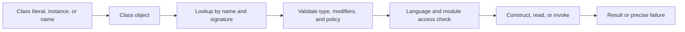

<TLDR>
  <TLDRCell label="what">
    <Term id="reflection">反射（reflection）</Term>让代码在运行时检查类型与成员，并在签名直到运行时才确定时构造对象、读写字段或调用方法。
  </TLDRCell>
  <TLDRCell label="trap">
    `getDeclaredMethod()` 不会搜索父类，参数类型必须精确匹配；`setAccessible(true)` 也不能越过未开放的模块边界。
  </TLDRCell>
  <TLDRCell label="fix">
    先写清查找、可见性、异常和允许类型策略，再缓存已验证的元数据；普通多态能表达契约时，不要使用反射。
  </TLDRCell>
</TLDR>

## 是什么，为什么存在

Java 反射是一组运行时 API，用来检查类、接口、数组、基本类型及其成员的元数据。入口通常是 `Class<?>`，成员则由 `Constructor`、`Method`、`Field`、`RecordComponent` 等对象表示。取得这些对象不会自动执行对应成员；查找、访问检查与执行是分开的阶段。

反射解决的是「编译代码时还不知道具体类型或成员」的问题。测试运行器需要发现带特定注解的方法，序列化器需要读取数据形状，依赖注入容器需要按配置选择构造器，插件边界可能只拿到类名。它们处理的是开放的运行时输入，普通静态调用无法把所有目标写死在源码中。

你也会在诊断工具、IDE、对象映射器和框架启动阶段遇到反射。反射适合读取结构化元数据并把它转换成经过校验的执行计划。业务代码若已经知道接口或类，普通构造、方法调用与多态通常更清楚，也能保留编译器检查。

反射不是通用的封装绕过器，也不是安全沙箱。访问一个成员仍受 Java 语言访问规则、模块导出与开放关系、调用方身份等条件约束。把外部字符串直接交给 `Class.forName()` 或 `Method.invoke()` 还会把类选择与方法选择变成输入验证问题。

运行时类型信息也不等于完整源码。类型擦除会移除某些泛型信息，局部变量名通常不可得，形参名只有使用合适编译选项时才可靠，非 `RUNTIME` 注解不会通过运行时反射出现。反射消费者必须定义元数据缺失时的行为，不能把「没读到」一律解释为「不存在」。

动态需求并不自动要求反射。已知服务接口的实现发现可交给 `ServiceLoader`，行为替换可交给策略接口，成员访问可在构建期生成代码。选择反射时，应能指出哪个事实只能在运行时获得，以及失败要怎样呈现给调用方。

## 工作原理

JVM 为已加载的类型维护运行时表示，Java API 通过 `Class` 暴露这份表示。类字面量 `Order.class` 不需要实例；`order.getClass()` 取得对象的实际运行时类；`Class.forName(name)` 按二进制名称查找类，并默认触发初始化。只想加载而不初始化时，可以使用带 `initialize` 参数和类加载器的重载。

`Class` 对象具有类加载器身份。同一个二进制名称若由不同类加载器定义，会产生不同的运行时类型，强制转换与 `isAssignableFrom()` 也会据此区分。插件系统中的「名字相同却不能转换」通常是类加载器边界问题，不是反射随机失效。

一次反射操作可以拆成五步：取得运行时类型、按明确规则查找成员、验证修饰符与签名、确认访问权限、执行并转换结果。把这几步集中在适配器或启动阶段，可以让业务路径只使用已经校验的构造器或方法。若每个请求都重新扫描成员，错误也会延迟到流量到达后才暴露。



反射对象描述某个声明，但不会把字符串调用变成静态类型安全的调用。名称拼错会产生 `NoSuchMethodException`，接收者或实参不兼容会产生 `IllegalArgumentException`，访问不成立会产生 `IllegalAccessException`。目标代码本身抛出的异常还会多一层包装。

### `Class` 与类型关系

每种 Java 类型都有对应的 `Class` 对象，包括 `int.class`、`void.class` 和 `String[].class`。泛型变量通常写成 `Class<?>`；当 API 必须返回已知基类型时，`Class<T>` 可以把类型令牌与返回类型关联起来。它仍不能表示 `List<String>` 的完整参数化类型，因为 `List<String>.class` 并不存在。

类型判断应选与问题匹配的 API。`candidate.isInstance(value)` 是动态版本的 `instanceof`；`parent.isAssignableFrom(child)` 判断 `child` 的值能否赋给 `parent`。两者参数方向不同，生成代码很容易把 `isAssignableFrom()` 写反。

`getName()` 返回 JVM 使用的名称形式，数组名称可能是 `[Ljava.lang.String;`。面向读者的诊断通常更适合 `getTypeName()` 或 `getSimpleName()`，但简单名可能为空且不能唯一标识类型。持久化协议不要依赖展示名称或本地类、匿名类的编译器生成名称。

| 目标 | API | 关键边界 |
| --- | --- | --- |
| 已知类型 | `Order.class` | 不依赖实例，也不按字符串查找 |
| 实例的实际类型 | `value.getClass()` | `value` 不能为 `null` |
| 按名称加载 | `Class.forName(name)` | 名称、类加载器和初始化策略都属于契约 |
| 动态实例检查 | `type.isInstance(value)` | 对 `null` 返回 `false` |
| 动态赋值检查 | `target.isAssignableFrom(source)` | 方向是「来源能否赋给目标」 |

反射看到的声明还可能由编译器生成。桥接方法、合成字段、枚举和内部类的辅助成员都可能出现在扫描结果中。框架应根据契约检查 `isBridge()`、`isSynthetic()` 与修饰符，而不是默认把每个返回成员都当成用户 API。

成员数组的顺序通常不应被当作声明顺序。需要稳定注册、输出或冲突处理时，应按明确键排序，并对重复签名或重复注解给出确定策略。依赖反射返回顺序的测试可能在编译器、构建方式或运行时变化后失效。

### 公开成员与已声明成员

`getMethod()` 和 `getMethods()` 面向 `public` 方法，并按各自规则包含继承成员。`getDeclaredMethod()` 和 `getDeclaredMethods()` 只看当前类直接声明的成员，但包含非 `public` 声明。字段与构造器 API 有相似命名，构造器不会被继承。

按名称查找方法还必须给出精确形参类型。`int.class` 与 `Integer.class` 不是同一个键，`ArrayList.class` 不会自动匹配声明为 `List` 的参数，`null` 也不能告诉查找器应选哪个重载。反射查找不会像 Java 源码调用那样替你执行重载解析。

| 查询 | 当前类非公开成员 | 继承的公开成员 | 典型用途 |
| --- | --- | --- | --- |
| `getMethod(name, types)` | 否 | 是 | 调用公开 API |
| `getDeclaredMethod(name, types)` | 是 | 否 | 检查某个声明或受控框架契约 |
| `getField(name)` | 否 | 是 | 读取公开字段 |
| `getDeclaredField(name)` | 是 | 否 | 检查当前类的数据形状 |
| `getConstructor(types)` | 仅公开 | 不适用 | 构造公开类型 |
| `getDeclaredConstructor(types)` | 包含非公开 | 不适用 | 受控容器内构造 |

扫描继承层次时，不要机械循环 `getDeclaredMethods()` 后取第一个同名方法。覆盖、桥接方法、接口默认方法和协变返回值都会影响候选集。先定义契约是「公开调用视图」还是「每层声明视图」，再实现对应算法。

如果 API 允许用户按字符串选择操作，应先把字符串映射到允许列表中的已验证签名。公开方法不代表适合远程调用，方法名也不代表授权。允许列表还应固定接收者类型、参数转换、返回值处理和异常策略。

### 调用、转换与异常

`Constructor.newInstance()` 创建对象，`Method.invoke(receiver, arguments...)` 执行方法，`Field.get()` 与 `Field.set()` 读写字段。静态方法的接收者参数会被忽略，实例方法需要兼容对象。反射会为基本类型结果装箱，并允许规定的拆箱与扩大转换，但不会执行任意缩小转换或业务字符串解析。

底层方法是可变参数方法时，它的最后一个反射形参仍是数组类型。`Method.invoke()` 自己也是可变参数 API，这两层数组容易混淆；调用方应按被调用方法的声明签名构造最后一个数组。不要根据运行时实参数量猜测一个重载或自动打包策略。

如果目标方法正常抛出异常，`invoke()` 会抛出<Term id="invocation-target-exception">调用目标异常（InvocationTargetException）</Term>，原始异常位于 `getCause()` 或 `getTargetException()`。基础设施层应保留原始原因，并按公开契约转换它。捕获 `Exception` 后只记录包装器消息，常会丢失真正的异常类型与堆栈。

## 示例

下面四个例子依次展示类型检查、精确构造与调用、模块访问边界，以及接口动态代理。输出来自本地 OpenJDK 21.0.12，源码使用 `javac --release 21` 编译；所用 API 与语义均属于 Java 25。

### 检查类型与成员来源

这个例子检查一个记录类的组件，并分别查找继承的公开方法与当前类型声明的私有方法。它没有遍历无序的方法数组，因此输出稳定。

<Depth level="quick">

```java
import java.lang.reflect.RecordComponent;

interface Auditable {
    default String auditTag() { return "order"; }
}

record Order(String id, int cents) implements Auditable {
    public String label() { return id + ":" + cents; }
    private int tax() { return cents / 10; }
}

public class InspectMembers {
    public static void main(String[] args) throws Exception {
        Class<Order> type = Order.class;
        System.out.println("type: " + type.getName());
        System.out.println("record: " + type.isRecord());

        for (RecordComponent component : type.getRecordComponents()) {
            System.out.printf("component: %s -> %s%n",
                    component.getName(), component.getType().getSimpleName());
        }

        System.out.println("inherited public: "
                + type.getMethod("auditTag").getDeclaringClass().getSimpleName());
        System.out.println("private declared: "
                + type.getDeclaredMethod("tax").getDeclaringClass().getSimpleName());
    }
}
```

```text
type: Order
record: true
component: id -> String
component: cents -> int
inherited public: Auditable
private declared: Order
```

<TryToBreak items={['把 int.class 改成 Integer.class 查找方法', '删除接口默认方法', '加入同名重载']} />

</Depth>

`getMethod("auditTag")` 从公开调用视图找到接口默认方法，所以声明类型是 `Auditable`。`getDeclaredMethod("tax")` 只在 `Order` 内查找，因此能取得私有声明；取得对象本身不等于已经获得调用权限。

记录组件有专门的 `RecordComponent` 模型。把记录当成普通字段集合会漏掉组件访问器、规范构造器和组件注解位置之间的关系；需要记录语义时，应从 `getRecordComponents()` 开始。

### 精确构造、调用并解包异常

查找代码明确写出构造器与方法的形参类型，不根据实参对象反推重载。第二次调用触发目标方法自己的校验，调用方解包后保留原始异常。

```java
import java.lang.reflect.Constructor;
import java.lang.reflect.InvocationTargetException;
import java.lang.reflect.Method;

public class InvokeMembers {
    public static final class PriceRule {
        private final String currency;

        public PriceRule(String currency) {
            this.currency = currency;
        }

        public String discount(int cents, int percent) {
            if (percent < 0 || percent > 100) {
                throw new IllegalArgumentException("percent out of range");
            }
            return currency + " " + cents * (100 - percent) / 100;
        }
    }

    public static void main(String[] args) throws Exception {
        Constructor<PriceRule> constructor =
                PriceRule.class.getConstructor(String.class);
        Method discount = PriceRule.class.getMethod(
                "discount", int.class, int.class);

        PriceRule rule = constructor.newInstance("EUR");
        System.out.println(discount.invoke(rule, 2500, 20));

        try {
            discount.invoke(rule, 2500, 120);
        } catch (InvocationTargetException error) {
            Throwable cause = error.getCause();
            System.out.println(cause.getClass().getSimpleName()
                    + ": " + cause.getMessage());
        }
    }
}
```

```text
EUR 2000
IllegalArgumentException: percent out of range
```

`Constructor<PriceRule>` 让创建结果保持具体类型，不需要向下强制转换。`Method.invoke()` 的返回类型仍是 `Object`，所以大型适配器通常在启动时验证返回类型，再把转换集中在一处。

查找失败、访问失败和目标业务失败属于不同层次。将它们全包装成「reflection failed」会让调用者无法区分部署配置错误、输入签名错误和订单规则拒绝；转换异常时应保留原因并使用稳定的领域分类。

这个价格计算只用于展示调用语义，不处理货币舍入。真实金额代码应使用明确的金额类型和舍入规则，而不是从这个整数示例推导财务契约。

### 测试可访问性而不强行打开模块

`trySetAccessible()` 在允许抑制语言访问检查时返回 `true`，否则返回 `false`。例子能读取应用自身嵌套类的私有字段，但默认不能打开 `java.base` 中未向当前模块开放的 `java.lang`。

```java
import java.lang.reflect.Field;

public class AccessBoundaries {
    private static final class Customer {
        private final String email;

        private Customer(String email) {
            this.email = email;
        }
    }

    public static void main(String[] args) throws Exception {
        Customer customer = new Customer("ada@example.com");
        Field email = Customer.class.getDeclaredField("email");
        boolean applicationAccess = email.trySetAccessible();
        System.out.println("application field: " + applicationAccess
                + " -> " + email.get(customer));

        Field stringStorage = String.class.getDeclaredField("value");
        System.out.println("JDK field: " + stringStorage.trySetAccessible());
    }
}
```

```text
application field: true -> ada@example.com
JDK field: false
```

`trySetAccessible()` 适合把访问失败变成显式分支；`setAccessible(true)` 在相同情况下会抛出 `InaccessibleObjectException`。两者都不是授权 API，也不会证明读取敏感字段符合应用策略。

框架若需要深度反射，应让被检查模块通过 `opens` 或 `open module` 声明受支持的运行时契约。命令行 `--add-opens` 可以用于受控迁移或测试，但把它悄悄加入生产启动参数会隐藏模块所有者没有承诺该访问。

对私有字段的成功访问仍会耦合内部表示。字段改名、从字段改为计算属性或增加不变量都可能破坏消费者，所以领域对象优先提供稳定 API，序列化边界则需要明确的版本策略。

### 创建可诊断的接口代理

JDK 动态代理在运行时创建一个实现给定接口集合的对象，并把调用交给 `InvocationHandler`。处理器在记录领域调用之外，还明确处理 `toString()`、`hashCode()` 与 `equals()`，并解包目标异常。

```java
import java.lang.reflect.*;
import java.util.Arrays;
public class TraceProxy {
    interface Inventory {
        int reserve(String sku, int units);
    }
    static final class Warehouse implements Inventory {
        private int available = 8;
        public int reserve(String sku, int units) {
            if (units > available) throw new IllegalStateException("insufficient stock");
            available -= units;
            return available;
        }
        public String toString() { return "main warehouse"; }
    }
    public static void main(String[] args) {
        Inventory target = new Warehouse();
        Inventory traced = (Inventory) Proxy.newProxyInstance(
                Inventory.class.getClassLoader(),
                new Class<?>[] { Inventory.class },
                (proxy, method, arguments) -> {
                    if (method.getDeclaringClass() == Object.class) {
                        return switch (method.getName()) {
                            case "toString" -> "Trace[" + target + "]";
                            case "hashCode" -> System.identityHashCode(proxy);
                            case "equals" -> proxy == arguments[0];
                            default -> throw new AssertionError(method);
                        };
                    }
                    System.out.println(method.getName() + " " + Arrays.toString(arguments));
                    try {
                        return method.invoke(target, arguments);
                    } catch (InvocationTargetException error) {
                        throw error.getCause();
                    }
                });
        System.out.println(traced);
        System.out.println("remaining: " + traced.reserve("P-7", 3));
    }
}
```

```text
Trace[main warehouse]
reserve [P-7, 3]
remaining: 5
```

处理器若在日志中拼接 `proxy`，会再次进入 `toString()`，容易产生递归。例子为对象方法定义了代理自身的身份语义；真实系统还应决定这些语义是否要与目标对象一致，而不是照抄模板。

`method.invoke(target, arguments)` 再次使用反射，因此目标异常会被包装。解包让接口声明的运行时异常保持原貌；对于检查型异常，代理调用还受接口 `throws` 子句约束，未声明的异常可能表现为 `UndeclaredThrowableException`。

JDK 代理只代理接口。需要代理具体类时，框架通常使用生成子类或字节码转换，那是另一套可见性、`final` 成员与构造规则。不要把框架的类代理能力归因于 `Proxy.newProxyInstance()`。

## 陷阱

### 用实参的运行时类猜测方法签名

> [!PITFALL]
> `argument.getClass()` 会把 `int` 变成 `Integer`，把实现类保留下来而不是声明的接口，还会在实参为 `null` 时失败。它无法复现编译器的重载解析。

**修复方法：** 让调用协议携带明确的参数类型，或把外部操作名映射到预先校验的 `Method`。若确实支持重载解析，就把基本类型转换、可变参数、`null` 和歧义规则写成独立算法并完整测试。

### 混淆 `getMethod()` 与 `getDeclaredMethod()`

> [!PITFALL]
> 为了访问私有成员而把所有查询改成 `getDeclaredMethod()`，会让继承的公开方法消失。反向替换又会漏掉当前类的非公开声明。

**修复方法：** 先定义需要公开调用视图还是声明视图。层次扫描要显式处理父类、接口、覆盖和桥接方法，并为冲突设定确定规则。

### 把 `setAccessible(true)` 当成万能开关

> [!PITFALL]
> Java 9 之后的模块边界可以拒绝深度反射；Java 25 不会因为调用了 `setAccessible(true)` 就自动打开 `java.base` 或第三方模块。成功抑制语言检查也不等于获得业务授权。

**修复方法：** 优先使用公开 API。框架需要非公开访问时，让拥有包的模块通过限定 `opens` 声明契约，并把 `InaccessibleObjectException` 作为部署错误测试，而不是吞掉后继续运行。

### 丢失目标异常

> [!PITFALL]
> 目标方法的异常被 `InvocationTargetException` 包装。只打印包装器消息、返回 `null` 或统一抛出无原因的 `RuntimeException`，会删除真正的失败类型、堆栈与恢复信息。

**修复方法：** 区分查找、访问、实参转换与目标执行失败。解包 `getCause()` 后按边界契约重新抛出或转换，并把原始原因保存在异常链中。

### 相信扫描顺序与源码形状

> [!PITFALL]
> `getDeclaredMethods()` 的顺序不是注册优先级，返回结果还可能包含合成方法与桥接方法。依赖数组第一个元素会让冲突结果随构建产物变化。

**修复方法：** 过滤契约不接受的成员，按稳定键排序，并显式拒绝歧义。形参名称、泛型签名与注解还需要分别验证是否存在，不能从 IDE 中可见就推断运行时一定可见。

### 缓存泄漏类加载器

> [!PITFALL]
> 进程级 `Map<Class<?>, Method>` 会强引用类、成员和定义它们的类加载器。可重载插件或应用服务器中，这可能让旧版本卸载后仍保持可达。

**修复方法：** 让缓存生命周期跟随框架上下文或类加载器，必要时使用 `ClassValue`，并在卸载测试中验证旧加载器可以释放。只有测量证明查找成本重要时才增加缓存，缓存键必须包含完整签名与策略。

## AI 时代

**生成代码在这里常犯的错**

模型常生成 `getDeclaredMethod(name, args[i].getClass())`，于是基本类型、接口形参、`null` 与重载立即出错；随后又用 `setAccessible(true)` 修补，并要求全局 `--add-opens`。它还会扫描并调用所有同名成员，不过滤 `static`、桥接或合成方法，或者把任意请求参数交给 `Class.forName()`，形成未授权的类型与操作选择。代理模板则容易在处理器日志中调用 `proxy.toString()` 造成递归，并在 `InvocationTargetException` 外层吞掉业务异常。

**让 AI 检查**

- 列出每个反射查询的名称、精确参数类型、继承规则、允许修饰符和歧义处理。
- 画出调用方模块、目标模块、`exports`、`opens` 与实际启动参数的访问矩阵。
- 对每个 `invoke()` 跟踪查找失败、访问失败、实参错误、目标异常和代理异常的最终公开形式。

**审查清单**

- 使用基本类型、接口实现、`null`、重载、继承方法以及桥接方法测试成员选择。
- 删除额外 `--add-opens` 后运行模块化测试，确认失败是明确部署诊断而不是静默跳过。
- 限制可加载类与可调用方法，并检查缓存、日志和代理对象方法不会泄漏类加载器或敏感值。

**提示词词汇**

使用准确术语：`reflection`（反射）、`member lookup`（成员查找）、`declared member`（已声明成员）、`reflective access`（反射访问）、`deep reflection`（深度反射）、`opens directive`（开放指令）、`InvocationTargetException`（调用目标异常）、`dynamic proxy`（动态代理）、`bridge method`（桥接方法）。要求模型输出「签名允许列表、模块访问矩阵、异常转换表」，而不是笼统要求「让反射更健壮」。

<Depth level="deep">

## 反射访问与模块边界

普通反射访问先遵守语言访问规则。一个公开类型中的公开成员如果位于对调用方导出的包中，通常可以直接使用，不需要抑制检查。`AccessibleObject.canAccess(receiver)` 可以针对当前调用方与接收者查询是否已经可访问；静态成员要求传入 `null`，实例成员要求兼容接收者。

<Term id="reflective-access">反射访问（reflective access）</Term>在模块系统中还区分导出与开放。`exports` 支持普通编译期和运行时访问公开类型；`opens` 允许指定模块在运行时对包执行深度反射，但不会让源码直接访问包内类型。限定形式 `opens package.name to framework.module` 比向所有模块开放边界更窄。

`trySetAccessible()` 返回是否成功，适合探测可选能力。`setAccessible(true)` 失败时抛出 `InaccessibleObjectException`，适合把访问作为必需启动条件。框架不应捕获后假装字段不存在，因为这会把部署错误伪装成数据缺失。

调用方身份不是作为参数传入的任意 `Class`。API 根据执行反射调用的代码判断权限，因此把辅助方法移动到另一个模块可能改变结果。测试应采用生产模块路径，而不只是把所有类放在未命名模块的类路径上。

可访问也不代表可安全写入。`final` 字段、记录组件对应字段和 JDK 内部表示有额外限制与不变量，反射写入可能失败或产生消费者无法依赖的观察结果。对象构造、复制与迁移应通过受支持 API 完成。

## 泛型与缺失的运行时信息

`Field.getType()` 与 `Method.getReturnType()` 返回擦除后的 `Class` 视图。对应的 `getGenericType()` 与 `getGenericReturnType()` 返回 `Type`，结果可能是 `Class`、`ParameterizedType`、`TypeVariable`、`WildcardType` 或 `GenericArrayType`。消费者必须按这些接口递归处理，不能把结果直接强制转换为 `ParameterizedType`。

泛型签名来自类文件元数据，不会恢复从未记录的具体实参。运行时对象是 `ArrayList<String>` 时，`object.getClass()` 仍只得到 `ArrayList.class`；通常要从字段、方法、父类型声明或显式类型令牌取得参数化信息。把当前元素抽样后猜类型既不完整，也会在空集合上失败。

编译器会为某些泛型覆盖生成桥接方法，以保持擦除后的多态。扫描处理器若同时注册桥接方法与真实实现，可能执行两次。检查 `Method.isBridge()` 和 `isSynthetic()` 之前，仍要明确框架是否需要看接口声明上的注解与实现声明上的注解。

形参名称是另一个独立元数据通道。没有 `-parameters` 时，`Parameter.getName()` 可能返回 `arg0` 一类合成名称，`isNamePresent()` 才表示类文件包含真实名称。路由或依赖注入不应在没有构建契约时把形参名当成稳定键。

## 动态代理的契约边界

<Term id="dynamic-proxy">动态代理（dynamic proxy）</Term>类由指定类加载器定义，并实现调用方提供的接口列表。处理器接收代理对象、代表所调用声明的 `Method`，以及无参调用时可能为 `null` 的实参数组。把 `arguments` 无条件交给 `Arrays.asList()` 或读取首元素会破坏无参方法。

`equals()`、`hashCode()` 与 `toString()` 也会分派给处理器，对应 `Method` 的声明类是 `Object`。处理器必须决定代理是使用身份语义、目标语义还是包装器语义。若一部分方法委托给目标、另一部分留在代理上，相等性的对称性尤其需要测试。

接口默认方法不会自动等同于「直接在目标上调用」。处理器可以选择委托目标，也可以使用 `InvocationHandler.invokeDefault()` 调用代理接口的默认实现。多个接口提供同签名默认方法时，选择哪一个属于代理工厂契约。

代理接口必须对所选类加载器可见，非公开接口还带有包与模块约束。跨插件边界创建代理时，应先验证接口身份来自哪一个加载器；仅比较接口名称会重现「同名不同类型」问题。

日志、计时、重试和事务处理都能写进处理器，但组合顺序会改变语义。重试放在事务外还是事务内、日志记录每次尝试还是一次逻辑调用，都应由显式装饰顺序决定。动态代理提供分派点，不替你定义这些策略。

## 设计可维护的反射层

可靠的反射层通常分为发现阶段与执行阶段。发现阶段扫描候选、验证签名与访问、解析注解并构造不可变执行计划；执行阶段只按计划转换输入、调用并转换输出。这样配置错误在启动或注册时失败，而不是随机落到某个生产请求上。

执行计划的键应包含声明类型、成员名、精确形参类型、静态或实例策略，以及影响选择的注解版本。只按 `className + "#" + methodName` 缓存会让重载互相覆盖。涉及多个类加载器时，字符串键还可能把身份不同的类型错误合并。

缓存是否必要要靠测量决定，但正确性不依赖「反射一定很慢」这种口号。现代运行时实现会变化，查找、访问、调用、装箱和适配器代码的成本也不同。基准应使用生产相同的 JDK、模块路径、调用形状与热身策略，并防止结果未使用而被优化掉。

公开边界不应泄露 `Method`、`Field` 或未经约束的类名。可以把外部输入解析成小型领域操作，例如 `CREATE_ORDER`，再映射到内部计划。这样授权、审计、版本兼容与错误消息都围绕稳定协议，而不是围绕 Java 实现细节。

测试至少覆盖一个成功路径和每类失败：找不到成员、签名不匹配、模块未开放、接收者错误、目标异常与类加载器身份冲突。对扫描结果做快照时先排序，并断言选择规则，而不是把某次运行时返回顺序固化为契约。

</Depth>

<Checkpoint id="java/reflection" />

## 延伸阅读

- [Java SE 25 `Class` API](https://docs.oracle.com/en/java/javase/25/docs/api/java.base/java/lang/Class.html)
- [Java SE 25 反射包概览](https://docs.oracle.com/en/java/javase/25/docs/api/java.base/java/lang/reflect/package-summary.html)
- [Java SE 25 `AccessibleObject` API](https://docs.oracle.com/en/java/javase/25/docs/api/java.base/java/lang/reflect/AccessibleObject.html)
- [Java SE 25 `Method` API](https://docs.oracle.com/en/java/javase/25/docs/api/java.base/java/lang/reflect/Method.html)
- [Java SE 25 `Proxy` API](https://docs.oracle.com/en/java/javase/25/docs/api/java.base/java/lang/reflect/Proxy.html)
