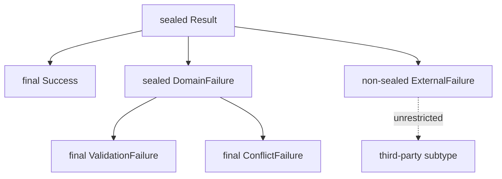

<TLDR>
  <TLDRCell label="what">
    A <Term id="sealed-class">sealed class</Term> or interface allows only named types to extend or implement it directly, expressing a controlled set of variants in the type system.
  </TLDRCell>
  <TLDRCell label="trap">
    `permits` controls only direct subtypes; a `non-sealed` branch reopens inheritance, while a broad `default` hides variants added later.
  </TLDRCell>
  <TLDRCell label="fix">
    Make each direct subtype choose `final`, `sealed`, or `non-sealed`, and review a closed hierarchy with an exhaustive pattern `switch` that has no `default`.
  </TLDRCell>
</TLDR>

## What it is and why it exists

An ordinary Java class lets any accessible code extend it, while a `final` class forbids all extension. A sealed type provides the middle ground: the root publishes a shared contract but limits which types can enter the hierarchy directly. It fits models with known variants, including results, commands, syntax-tree nodes, and business states.

`sealed` can modify either a class or an interface. Its `permits` clause lists the types allowed to extend the class or implement the interface directly, so this is an inheritance boundary rather than an instance-count boundary. Each permitted type can still have any number of instances with distinct fields and behavior.

Unlike an enum, a sealed hierarchy lets each variant have a different data shape and lets selected branches continue under further control. An enum represents a fixed set of constants; a sealed type represents a fixed set of direct types. Simple states without variant data often still suit enums, while data-bearing models commonly pair a sealed interface with <Term id="record-class">record classes</Term>.

Sealed classes became final in Java 17. Pattern matching for `switch` became final in Java 21, so Java 25 can perform exhaustive <Term id="pattern-matching">pattern matching</Term> over sealed hierarchies without preview features.

Sealing is not a security sandbox. It lets the compiler reject unpermitted direct subtypes, but it performs no authentication, input validation, or runtime authorization. Treat “only these implementations” as a domain invariant, not as access control.

### A suitable boundary

A sealed hierarchy is most useful when one module owns every direct variant and adding a variant should force consumers to be reviewed. The compiler can turn a hierarchy change into compilation failures, surfacing incomplete handling early.

Complete sealing conflicts with an extension goal when third parties must freely implement an interface, as with a driver or plugin SPI. You can preserve one deliberately designed `non-sealed` branch, but consumers can then be exhaustive only at that open branch; they cannot enumerate all its future descendants.

Use an enum when the alternatives have no distinct data or behavior. Use an ordinary interface when one module does not control the subtype set. A sealed type should describe a real ownership boundary, not merely demonstrate newer syntax.

## How it works

A sealed declaration controls its set of direct subtypes. The explicit form names those types after `permits`; the omitted form asks the compiler to infer direct subtypes declared in the same compilation unit. An explicit `permits` clause usually makes a hierarchy spread across files easier to understand.

Every permitted direct subclass must say how its branch continues:

- `final` ends the branch; a record class is implicitly `final`.
- `sealed` keeps controlling the next level of direct subtypes and has its own `permits` set.
- `non-sealed` removes restrictions below that branch, so descendants do not appear in the root type's `permits` clause.

In this diagram, the root directly permits only `Success`, `DomainFailure`, and `ExternalFailure`. Each branch's own modifier decides the second level; the root does not name every later descendant.



Location rules stop a permits list from naming arbitrary code that cannot evolve with it. If the root belongs to a named module, every directly permitted subtype must belong to that same named module, though they may be in different packages. In an unnamed module, directly permitted subtypes must be in the same package as the root.

A type in `permits` must be accessible to the root declaration and must directly extend or implement the root. The list is not a transitive closure: a grandchild belongs in the list of its direct sealed parent. Local and anonymous classes have no canonical name that a permits list can stably name, so they cannot be directly permitted subtypes.

### Exhaustive pattern switches

A <Term id="switch-expression">`switch` expression</Term> must cover every possible value of its selector type. For a sealed type, the compiler calculates type coverage from permitted direct subtypes; when a branch is `non-sealed`, one pattern matching that branch type can still cover all its descendants.

Listing the branches and omitting `default` makes a newly permitted type fail when consumers are recompiled. A broad `default` makes today's code compile, but swallows future variants and loses that evolution signal.

`null` does not automatically match a type pattern or `default`. A pattern `switch` given `null` throws `NullPointerException` unless it has `case null`. Reject null at the API boundary or spell out its business meaning explicitly.

### Declaration forms

A sealed class may be abstract or concrete and instantiable; `sealed` does not imply `abstract`. Only a class that declares an abstract method must also be marked `abstract`. A sealed interface otherwise follows the ordinary member and multiple-inheritance rules for interfaces.

A permitted subtype can be a top-level, member, or nested type. Keeping a small hierarchy in one enclosing class makes examples or private domain models compact and lets the compiler infer `permits` when it is omitted. Public APIs usually benefit from naming the variants explicitly.

### A hierarchy-design sequence

Start with the root type's meaning, not with a keyword. The root should provide a contract genuinely shared by every variant; if it is only a bag of unrelated types, sealing merely ties unrelated objects together.

Then make one explicit choice for every direct branch:

1. Is the branch complete and ended by `final` or a record class?
2. Does the branch own another controlled set of variants and therefore remain `sealed`?
3. Is the branch a deliberate extension point promised to outside implementers and therefore `non-sealed`?
4. When a root variant is added, which consumers must be recompiled for exhaustiveness checks?

Review this table together with module ownership. If separate teams publish the root and its direct subtypes independently, every change to the permitted set is a cross-team API change, not merely a local refactor.

Multiple inheritance of interfaces does not remove these rules. A class can implement several sealed interfaces, but each direct parent must permit it and its module or package position must satisfy each parent's constraints. Such intersecting hierarchies are difficult to evolve, so use them only when the domain truly needs both shared contracts.

## Examples

### A closed result type

The first example represents two processing results with a sealed interface. Both record implementations are implicitly `final`, so each branch closes immediately after the first level.

<Depth level="quick">

```java
public class SealedResult {
    sealed interface Result permits Success, Failure {}

    record Success(String receiptId) implements Result {}

    record Failure(String reason) implements Result {}

    static String describe(Result result) {
        return switch (result) {
            case Success success -> "accepted: " + success.receiptId();
            case Failure failure -> "rejected: " + failure.reason();
        };
    }

    public static void main(String[] args) {
        System.out.println(describe(new Success("R-204")));
        System.out.println(describe(new Failure("stock unavailable")));
    }
}
```

```text
accepted: R-204
rejected: stock unavailable
```

</Depth>

`describe` has no `default` and still satisfies the exhaustiveness requirement. If a third direct implementation is later added to `Result`, recompiling this code identifies the missing branch.

This model also preserves a separate data shape for each variant. `Success` carries a receipt identifier and `Failure` carries a reason, while callers can depend only on the shared `Result` type.

### Preserving one open branch

The second example opens only the courier branch. `Delivery` still has just two direct variants, but implementations of `Courier` may continue to appear.

```java
public class ExtensionBoundary {
    sealed interface Delivery permits Pickup, Courier {}

    record Pickup(String desk) implements Delivery {}

    non-sealed interface Courier extends Delivery {}

    record BikeCourier(String rider) implements Courier {}

    static final class PartnerCourier implements Courier {
        private final String company;

        PartnerCourier(String company) {
            this.company = company;
        }

        String company() {
            return company;
        }
    }

    static String route(Delivery delivery) {
        return switch (delivery) {
            case Pickup pickup -> "desk " + pickup.desk();
            case Courier courier -> "courier " + courier.getClass().getSimpleName();
        };
    }

    public static void main(String[] args) {
        System.out.println(route(new Pickup("A2")));
        System.out.println(route(new BikeCourier("Mina")));
        System.out.println(route(new PartnerCourier("Northwind")));
    }
}
```

```text
desk A2
courier BikeCourier
courier PartnerCourier
```

The `switch` matches the `Courier` interface itself, covering all current and future courier implementations. It is exhaustive over the direct branches of `Delivery`, but it cannot treat every concrete courier differently and remain future-exhaustive.

This design fits an API whose root model is controlled while one extension point is open. If business logic must know every concrete courier, `Courier` should not be `non-sealed`.

### Inferring variants in one compilation unit

The third example omits `permits`. All three direct implementations share a compilation unit with `Command`, so the compiler can infer the complete list; the record classes are implicitly `final`, while the ordinary `Pause` class ends inheritance explicitly.

```java
import java.util.List;

public class InferredPermits {
    sealed interface Command {
        String audit();
    }

    record Create(String orderId) implements Command {
        public String audit() {
            return "create " + orderId;
        }
    }

    record Cancel(String orderId, String reason) implements Command {
        public String audit() {
            return "cancel " + orderId + ": " + reason;
        }
    }

    static final class Pause implements Command {
        public String audit() {
            return "pause queue";
        }
    }

    public static void main(String[] args) {
        List<Command> commands = List.of(
                new Create("O-81"),
                new Cancel("O-82", "duplicate"),
                new Pause());
        commands.stream().map(Command::audit).forEach(System.out::println);
    }
}
```

```text
create O-81
cancel O-82: duplicate
pause queue
```

Omission does not change the runtime semantics. The compiled `Command` still records all three directly permitted types, and the reflection API can read them.

Moving `Pause` into another source file changes the compilation-unit boundary. At that point, add `permits Create, Cancel, Pause` explicitly to `Command` instead of expecting the compiler to scan the whole package.

### Inspecting the hierarchy with reflection

The fourth example uses <Term id="reflection">reflection</Term> to read each level's direct permits list. Sorting keeps the output independent of the order returned by the reflection API.

```java
import java.lang.reflect.Modifier;
import java.util.Arrays;
import java.util.Comparator;

public class InspectSealed {
    sealed interface Message permits TextMessage, SystemMessage {}

    record TextMessage(String body) implements Message {}

    sealed interface SystemMessage extends Message permits Warning, Shutdown {}

    record Warning(String detail) implements SystemMessage {}

    record Shutdown(int seconds) implements SystemMessage {}

    static String modifier(Class<?> type) {
        if (type.isSealed()) return "sealed";
        if (Modifier.isFinal(type.getModifiers())) return "final";
        return "non-sealed";
    }

    static void printHierarchy(Class<?> type, String indent) {
        System.out.println(indent + type.getSimpleName() + ": " + modifier(type));
        if (!type.isSealed()) return;

        Arrays.stream(type.getPermittedSubclasses())
                .sorted(Comparator.comparing(Class::getSimpleName))
                .forEach(child -> printHierarchy(child, indent + "  "));
    }

    public static void main(String[] args) {
        printHierarchy(Message.class, "");
    }
}
```

```text
Message: sealed
  SystemMessage: sealed
    Shutdown: final
    Warning: final
  TextMessage: final
```

`Class.isSealed()` reports whether a runtime type is sealed, and `Class.getPermittedSubclasses()` returns its directly permitted subtypes. Reflection has no separate modifier bit for `non-sealed`; within a known directly permitted branch, the example can only infer openness when a type is neither sealed nor `final`.

Do not use reflection results in place of ordinary polymorphism or a pattern `switch`. They are better suited to framework diagnostics, architecture tests, and development tools, because dynamic traversal turns domain handling into runtime dispatch that is harder to check.

## Pitfalls

> [!PITFALL]
> Treating `permits` as a complete list of all descendants produces duplicate or illegal declarations. A root lists only direct subtypes; a branch that remains sealed lists its own direct subtypes in its own `permits` clause.

**Fix:** draw the direct inheritance edges first, then choose `final`, `sealed`, or `non-sealed` for each direct branch. Review permits lists one level at a time instead of flattening the hierarchy.

> [!PITFALL]
> Mechanically adding `non-sealed` to remove a compilation error turns that branch into a permanent extension point. Arbitrary descendants can then appear without changing the root, and root consumers cannot enumerate them individually.

**Fix:** prefer records or `final` classes for data variants, and use `non-sealed` only when the API explicitly promises third-party extension. Match the whole open branch type in switches over the root.

> [!PITFALL]
> Adding `default` to the end of a switch over a sealed hierarchy hides new variants. The code keeps compiling, but a new type can fall into stale fallback behavior.

**Fix:** list each branch and omit `default` for a closed hierarchy that evolves with its consumers. If null is legal, use a separate `case null`; do not mix the null policy with the unknown-variant policy.

> [!PITFALL]
> Placing a permitted subtype in another package of the unnamed module fails compilation. The rule is not “always the same package”: a named module permits different packages within that module.

**Fix:** establish whether the build uses the Java module system. Keep direct permitted types in one package for the unnamed module; for a named module, keep them in that module and export only the packages that must be public.

> [!PITFALL]
> Treating a sealed hierarchy as a security boundary misses the real runtime risks. Whether reflection, deserialization, or input data is trusted is separate from which classes the compiler permits to extend a type directly.

**Fix:** implement authorization, input validation, and serialization allowlists separately. A sealed type expresses a type set; it does not establish that a caller or data source is trusted.

## In the AI era

**What generated code gets wrong here**

Generators often put a `sealed` root and its permitted subtypes in different packages of an unnamed module, or omit `final`, `sealed`, or `non-sealed` from an ordinary direct subtype. They also add `default` “for safety,” defeating the review signal from new variants; another common failure seals a plugin interface while claiming third parties can still implement it freely.

Generated pattern switches also neglect null and separate compilation. They may cover every variant in today's sources but never test an old consumer deployed with a new implementation class. For a `non-sealed` branch, a model may match current implementations one by one and incorrectly assume they form a closed set.

**Ask your AI to check**

- List every direct inheritance edge and verify that both ends satisfy the named-module or unnamed-module location rule.
- Find every pattern `switch` consuming the root type and explain the effect of `default`, `case null`, and each `non-sealed` branch.
- Simulate adding one permitted direct subtype, recompile all consumers, and test mixed old-and-new binary deployments.

**Review checklist**

- Every directly permitted subtype clearly ends, continues sealing, or deliberately opens its branch.
- Switches over closed hierarchies cover every direct branch without `default` and have an explicit null policy.
- The build compiles with the promised `--release` and module path, and tests separately deployed producers and consumers.

**Prompt vocabulary**

Use the exact terms `sealed class`, `sealed interface`, `permits clause`, `permitted direct subclass`, `non-sealed branch`, `exhaustive pattern switch`, and `separate compilation`. Asking for a “direct-subtype table” and “hierarchy-evolution test” exposes boundary errors more reliably than vaguely asking to “use sealed.”

<Depth level="deep">

## Deep dive: compilation units, class files, and evolution

### Inferred permits lists

Omitting `permits` does not open the hierarchy automatically to the whole package. The compiler looks only for declared direct subtypes in the sealed type's compilation unit and infers the permits list from them. Move one subtype into another source file and you must add an explicit `permits` clause, or that type no longer belongs to the inferred set.

The inferred form suits small nested hierarchies because every variant is visible in one file. Larger public APIs usually benefit from the explicit form: the permits list becomes a reviewable source contract, and moving a file does not silently change where inference comes from.

The compiler records directly permitted subtypes in the class file's `PermittedSubclasses` attribute. Runtime calls to `Class.isSealed()` and `getPermittedSubclasses()` read this class-file information, so reflection sees direct edges at each level rather than a recursively expanded set of every descendant.

### Source evolution and binary evolution

Adding a direct subtype to a sealed root is a source-incompatible change: a previously exhaustive `switch` lacks a branch when it is recompiled. That is exactly why omitting `default` is useful—the compiler lists the places that need review.

An already compiled consumer is not rechecked for exhaustiveness merely because the producer supplies a new class file. In Java 25, an enhanced `switch` with no applicable label throws `MatchException` at runtime, so separately releasing the hierarchy and its consumers demands more than a successful source build.

Library upgrade tests should cover at least two combinations: a new producer with recompiled consumers, and a new producer with old consumers that remain deployed. If a compatibility window cannot tolerate an exception, handle it with a versioned protocol, adapter, or controlled fallback rather than adding an unconditional `default` to every switch.

Removing or renaming a permitted type likewise affects consumers that reference it, serialization formats, and reflection tools. Sealing narrows the type set; it does not cancel the ordinary source, binary, and data-compatibility responsibilities of a Java API.

### Runtime-check boundaries

Class loaders still participate in type identity; classes with the same name but different defining loaders are distinct runtime types. Sealing constraints live in the defining class file and the JVM enforces the inheritance relationship during verification, but that does not guarantee every framework can construct, proxy, or deserialize the hierarchy unchanged.

A proxy tool that depends on generating runtime subclasses cannot arbitrarily extend a sealed class. Prefer interface proxies or composition, and run integration tests with the actual framework and runtime. Do not infer Java 25 class-file and sealed-hierarchy support from stale tool documentation.

### Treating compilation failure as a contract test

Part of a sealed hierarchy's value is that some code must not compile. Alongside successful runtime paths, a build test can declare a direct subtype absent from `permits` and assert that `javac --release 25` rejects it. The test verifies the public extension boundary and should not depend on the complete diagnostic text, whose wording can change across compiler versions.

Another contract test can temporarily add one permitted variant and confirm that every expected consumer fails because its `switch` is no longer exhaustive. If a consumer still compiles, check whether it uses a broad `default`, a root-type pattern, or an open-branch pattern; each may be intentional or may hide an omission.

Negative compilation tests must use the same module path and `--release` as the production build. Otherwise, the test may prove only that the package layout happens to fail, or may select an older language level instead of exercising the intended sealing constraint.

</Depth>

<Checkpoint id="java/sealed-classes" />

## Further reading

- [Java Language Specification 25: sealed classes](https://docs.oracle.com/javase/specs/jls/se25/html/jls-8.html#jls-8.1.1.2)
- [Java Language Specification 25: sealed interfaces](https://docs.oracle.com/javase/specs/jls/se25/html/jls-9.html#jls-9.1.1.4)
- [Java Language Specification 25: exhaustive switch](https://docs.oracle.com/javase/specs/jls/se25/html/jls-14.html#jls-14.11.1.1)
- [Java SE 25 API: `Class.isSealed()`](https://docs.oracle.com/en/java/javase/25/docs/api/java.base/java/lang/Class.html#isSealed())
- [JEP 409: Sealed Classes](https://openjdk.org/jeps/409)
