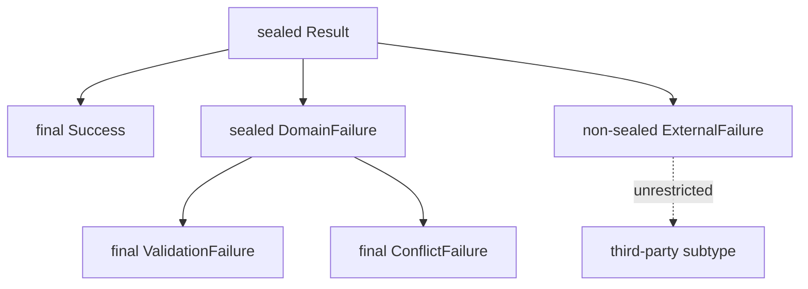

<TLDR>
  <TLDRCell label="what">
    <Term id="sealed-class">密封类（sealed class）</Term>或密封接口只允许声明中指定的类型直接继承或实现它，用类型系统表达一个受控的变体集合。
  </TLDRCell>
  <TLDRCell label="trap">
    `permits` 只约束直接子类型；任何 `non-sealed` 分支都会重新开放继承，而且宽泛的 `default` 会掩盖后来新增的变体。
  </TLDRCell>
  <TLDRCell label="fix">
    让每个直接子类型明确选择 `final`、`sealed` 或 `non-sealed`，并用无 `default` 的穷尽模式 `switch` 审核封闭层次。
  </TLDRCell>
</TLDR>

## 是什么，为什么存在

Java 的普通类默认允许任意可访问代码继承，`final` 类则完全禁止继承。密封类型提供中间选择：根类型公开共同契约，同时限定可以直接进入层次的类型。它适合结果、命令、语法树节点和业务状态等变体已知的模型。

`sealed` 可以修饰类，也可以修饰接口。`permits` 列出允许直接扩展类或实现接口的类型，因此这是继承边界，不是实例数量边界。每个获准类型仍然可以创建任意多个对象，并能携带不同字段和行为。

与枚举相比，密封层次允许各变体拥有不同的数据形状，也允许在受控位置继续分支。枚举表示固定的一组常量；密封类型表示固定的一组直接类型。简单的无数据状态通常仍适合枚举，带有变体专属数据的模型常与<Term id="record-class">记录类（record class）</Term>组合。

密封类在 Java 17 成为正式特性。Java 21 正式提供 `switch` 模式匹配，因此 Java 25 可以对密封层次执行穷尽的<Term id="pattern-matching">模式匹配（pattern matching）</Term>，无需启用预览特性。

密封并不是安全沙箱。它能让编译器拒绝未经许可的直接子类型，却不会执行身份认证、输入校验或运行时授权。把“只有这些实现”当成领域不变量，而不要把它当成访问控制机制。

### 适用边界

当根类型的所有直接变体由同一模块维护，并且增加变体应触发消费者复查时，密封层次最有价值。编译器可以把层次变化传播成编译错误，使遗漏的处理逻辑尽早暴露。

如果第三方必须自由实现接口，例如驱动或插件 SPI，完全密封通常与扩展目标冲突。可以保留一个刻意设计的 `non-sealed` 分支，但消费者只能穷尽到这个开放分支，无法枚举它未来的全部后代。

若各选项没有不同数据或行为，枚举更直接。若子类集合本来就不受一个模块控制，普通接口更诚实。密封类型应表达真实的所有权边界，而不是只为了使用新语法。

## 工作原理

一个密封声明控制的是直接子类型集合。显式形式在 `permits` 后写出这些类型；省略形式则由编译器从同一编译单元中声明的直接子类型推断。跨文件维护层次时，使用显式 `permits` 会让边界更清楚。

每个获准的直接子类必须继续说明该分支如何扩展：

- `final` 终止该分支；记录类隐式为 `final`。
- `sealed` 继续限制下一层直接子类型，并拥有自己的 `permits` 集合。
- `non-sealed` 取消该分支之后的限制，后代无需再出现在根类型的 `permits` 中。

下图中的根类型只直接许可 `Success`、`DomainFailure` 和 `ExternalFailure`。第二层由各分支自己的修饰符决定，而不是继续受根声明逐个点名。



位置规则防止许可列表指向无法共同演进的任意代码。若根类型属于具名模块，直接获准子类型必须属于同一个具名模块，但可以位于不同包。若根类型位于未命名模块，直接获准子类型必须与它位于同一个包。

`permits` 中的类型必须可由根声明访问，并且必须直接继承或实现根类型。列表不是传递闭包：孙类型写在其直接密封父类型的列表中。局部类和匿名类没有可供许可列表稳定引用的规范名称，不能成为密封类型的直接获准子类型。

### 穷尽的模式 switch

<Term id="switch-expression">`switch` 表达式（switch expression）</Term>必须覆盖选择器类型的所有可能值。对密封类型，编译器根据获准直接子类型计算类型覆盖范围；若某个分支是 `non-sealed`，一个匹配该分支类型的模式仍可覆盖它的所有后代。

逐个列出分支并省略 `default`，可以让新增获准类型在消费者重新编译时造成错误。宽泛的 `default` 虽然让当前代码通过，却也会吞掉未来变体，失去这项演进反馈。

`null` 不会自动匹配类型模式或 `default`。模式 `switch` 若收到 `null`，又没有 `case null`，会抛出 `NullPointerException`。应在 API 边界拒绝 `null`，或显式写出它的业务含义。

### 声明形式

密封类可以是抽象类，也可以是可实例化的具体类；`sealed` 本身不等于 `abstract`。只有声明抽象方法的类才必须同时标记为 `abstract`。密封接口仍遵循普通接口的成员与多继承规则。

获准子类型可以是顶层类型、成员类型或嵌套类型。把小型层次放进同一外层类，能让示例或私有领域模型保持紧凑，也让编译器在省略 `permits` 时完成推断。公开 API 通常更适合显式列出变体。

### 设计层次的顺序

先从根类型的语义开始，而不是从关键字开始。根类型应提供所有变体确实共享的契约；如果它只是一个没有共同含义的类型袋，密封只会把无关对象绑在一起。

然后对每个直接分支作出一次明确选择：

1. 分支是否已完整，由 `final` 或记录类终止？
2. 分支是否拥有另一组受控变体，需要继续使用 `sealed`？
3. 分支是否是刻意承诺给外部实现者的扩展点，需要使用 `non-sealed`？
4. 增加根变体时，哪些消费者必须因穷尽性检查而重新编译？

这份表应与模块所有权一起评审。若不同团队独立发布根类型和直接子类型，许可集合的每次变化都会成为跨团队 API 变更，而不只是局部重构。

接口的多继承不会取消这些规则。一个类可以同时实现多个密封接口，但它必须分别获得每个直接父接口的许可，并满足各自的模块或包位置约束。这样的交叉层次很难演进，只有领域模型确实需要两个共同契约时才应使用。

## 示例

### 封闭的结果类型

第一个示例用密封接口表示两种处理结果。两个记录实现都隐式为 `final`，所以每条分支在第一层之后立即闭合。

<Depth level="quick">

```java
public class SealedResult {
    sealed interface Result permits Success, Failure {}

    record Success(String receiptId) implements Result {}

    record Failure(String reason) implements Result {}

    static String describe(Result result) {
        return switch (result) {
            case Success success -> "accepted: " + success.receiptId();
            case Failure failure -> "rejected: " + failure.reason();
        };
    }

    public static void main(String[] args) {
        System.out.println(describe(new Success("R-204")));
        System.out.println(describe(new Failure("stock unavailable")));
    }
}
```

```text
accepted: R-204
rejected: stock unavailable
```

</Depth>

`describe` 没有 `default`，仍然满足穷尽性要求。如果以后把第三个直接实现加入 `Result`，重新编译这段代码就会指出遗漏分支。

这个建模也保留了每个变体自己的数据形状。`Success` 携带回执标识，`Failure` 携带原因，而调用方只需依赖共同的 `Result` 类型。

### 保留一个开放分支

第二个示例只开放配送员分支。`Delivery` 仍然只有两种直接变体，但 `Courier` 的实现可以继续增加。

```java
public class ExtensionBoundary {
    sealed interface Delivery permits Pickup, Courier {}

    record Pickup(String desk) implements Delivery {}

    non-sealed interface Courier extends Delivery {}

    record BikeCourier(String rider) implements Courier {}

    static final class PartnerCourier implements Courier {
        private final String company;

        PartnerCourier(String company) {
            this.company = company;
        }

        String company() {
            return company;
        }
    }

    static String route(Delivery delivery) {
        return switch (delivery) {
            case Pickup pickup -> "desk " + pickup.desk();
            case Courier courier -> "courier " + courier.getClass().getSimpleName();
        };
    }

    public static void main(String[] args) {
        System.out.println(route(new Pickup("A2")));
        System.out.println(route(new BikeCourier("Mina")));
        System.out.println(route(new PartnerCourier("Northwind")));
    }
}
```

```text
desk A2
courier BikeCourier
courier PartnerCourier
```

`switch` 匹配 `Courier` 接口本身，因此覆盖当前和未来的全部配送员实现。它能穷尽 `Delivery` 的直接分支，却不能对每一种具体配送员执行不同逻辑并同时保持未来穷尽。

这种设计适合根模型受控、某个扩展点开放的 API。若业务逻辑必须知道所有具体配送员，就不应把 `Courier` 声明为 `non-sealed`。

### 推断同一编译单元中的变体

第三个示例省略 `permits`。三个直接实现与 `Command` 位于同一编译单元，因此编译器可以推断完整列表；其中记录类隐式为 `final`，普通类 `Pause` 则显式终止继承。

```java
import java.util.List;

public class InferredPermits {
    sealed interface Command {
        String audit();
    }

    record Create(String orderId) implements Command {
        public String audit() {
            return "create " + orderId;
        }
    }

    record Cancel(String orderId, String reason) implements Command {
        public String audit() {
            return "cancel " + orderId + ": " + reason;
        }
    }

    static final class Pause implements Command {
        public String audit() {
            return "pause queue";
        }
    }

    public static void main(String[] args) {
        List<Command> commands = List.of(
                new Create("O-81"),
                new Cancel("O-82", "duplicate"),
                new Pause());
        commands.stream().map(Command::audit).forEach(System.out::println);
    }
}
```

```text
create O-81
cancel O-82: duplicate
pause queue
```

省略形式没有改变运行时语义。编译后的 `Command` 仍记录三个直接获准类型，反射 API 也能读到它们。

把 `Pause` 移到另一个源文件会改变编译单元边界。此时应在 `Command` 上显式加入 `permits Create, Cancel, Pause`，而不是期待编译器扫描整个包。

### 通过反射检查层次

第四个示例用<Term id="reflection">反射（reflection）</Term>读取每层的直接许可列表。排序让输出不依赖反射 API 返回数组的顺序。

```java
import java.lang.reflect.Modifier;
import java.util.Arrays;
import java.util.Comparator;

public class InspectSealed {
    sealed interface Message permits TextMessage, SystemMessage {}

    record TextMessage(String body) implements Message {}

    sealed interface SystemMessage extends Message permits Warning, Shutdown {}

    record Warning(String detail) implements SystemMessage {}

    record Shutdown(int seconds) implements SystemMessage {}

    static String modifier(Class<?> type) {
        if (type.isSealed()) return "sealed";
        if (Modifier.isFinal(type.getModifiers())) return "final";
        return "non-sealed";
    }

    static void printHierarchy(Class<?> type, String indent) {
        System.out.println(indent + type.getSimpleName() + ": " + modifier(type));
        if (!type.isSealed()) return;

        Arrays.stream(type.getPermittedSubclasses())
                .sorted(Comparator.comparing(Class::getSimpleName))
                .forEach(child -> printHierarchy(child, indent + "  "));
    }

    public static void main(String[] args) {
        printHierarchy(Message.class, "");
    }
}
```

```text
Message: sealed
  SystemMessage: sealed
    Shutdown: final
    Warning: final
  TextMessage: final
```

`Class.isSealed()` 判断运行时类型是否密封，`Class.getPermittedSubclasses()` 返回它的直接获准子类型。反射没有单独的 `non-sealed` 修饰符位；示例只能在已知直接获准分支中，把既不密封也非 `final` 的类型推断为开放分支。

不要用反射结果代替普通的多态或模式 `switch`。它更适合框架诊断、架构测试和开发工具，因为动态遍历会把领域处理逻辑变成较难检查的运行时分派。

## 陷阱

> [!PITFALL]
> 把 `permits` 当成所有后代的完整列表，会导致重复或非法声明。根类型只列直接子类型；下一层若继续密封，应在自己的 `permits` 中列出直接子类型。

**修复：**先画出直接继承边，再为每个直接分支选择 `final`、`sealed` 或 `non-sealed`。审查许可列表时按层检查，不要把层次压成一个平面名单。

> [!PITFALL]
> 为了消除编译错误而机械加入 `non-sealed`，会把该分支永久变成开放扩展点。后来出现的任意后代都无需修改根类型，也无法由根消费者逐一穷尽。

**修复：**数据变体优先使用记录类或 `final` 类；只有 API 明确承诺第三方扩展时才使用 `non-sealed`。同时让根层 `switch` 匹配整个开放分支类型。

> [!PITFALL]
> 在密封层次的 `switch` 末尾加入 `default`，会隐藏新增变体。代码继续编译，但新类型可能落入过时的兜底行为。

**修复：**对由同一模块共同演进的封闭层次逐个列出分支，并省略 `default`。若 `null` 合法，单独使用 `case null`；不要把空值策略混入未知变体策略。

> [!PITFALL]
> 在未命名模块中把获准子类放到另一个包，会导致编译失败。规则并不是“始终同包”：具名模块允许同模块中的不同包。

**修复：**先确认构建是否使用 Java 模块系统。未命名模块把直接获准类型放在同一包；具名模块则确保它们属于同一个模块，并导出实际需要公开的包。

> [!PITFALL]
> 把密封层次当成安全边界，会漏掉真正的运行时风险。反射、反序列化或输入数据是否可信，与编译器允许哪些类直接继承是不同问题。

**修复：**分别实施授权、输入校验和序列化白名单。密封类型只负责表达类型集合，不负责确认调用者或数据来源是否可信。

<Depth level="deep">

## 深入：编译单元、类文件与演进

### 隐式许可列表

省略 `permits` 不是让层次对整个包自动开放。编译器只从密封类型所在编译单元中查找声明的直接子类型，并据此推断许可列表。把其中一个子类型移动到另一个源文件后，必须显式写回 `permits`，否则它不再属于推断集合。

隐式形式适合小型嵌套层次，因为所有变体在一个文件中可见。大型公开 API 更适合显式形式：许可列表成为容易审查的源代码契约，文件移动也不会悄悄改变推断来源。

编译器会把直接获准子类型写入类文件的 `PermittedSubclasses` 属性。运行时的 `Class.isSealed()` 与 `getPermittedSubclasses()` 读取这项类文件信息，所以反射看到的是每层直接边，而不是自动展开的完整后代集合。

### 源码演进与二进制演进

向密封根类型加入直接子类型是源码不兼容变化：原本穷尽的 `switch` 在重新编译时会缺少分支。这正是省略 `default` 的价值，因为编译器把需要复查的位置列出来。

已编译消费者不会因为生产者换了类文件就自动重新进行穷尽性检查。Java 25 对运行时没有匹配标签的增强 `switch` 抛出 `MatchException`，因此分别发布层次与消费者时，单靠源码编译成功还不够。

库升级测试应覆盖至少两种组合：新生产者配重新编译的消费者，以及新生产者配仍在部署中的旧消费者。若兼容期不能容忍异常，应通过版本化协议、适配层或受控兜底明确处理，而不是在每个 `switch` 中无条件加入 `default`。

删除或重命名获准类型同样会影响引用它的消费者、序列化格式和反射工具。密封层次缩小了类型集合，却没有取消普通 Java API 的源代码、二进制和数据兼容性责任。

### 运行时检查的边界

类加载器仍参与类型身份判定；同名类由不同类加载器定义时不是同一个运行时类型。密封约束记录在定义类的类文件中，并在 JVM 验证继承关系时生效，但这不代表所有框架都能无修改地构造、代理或反序列化该层次。

依赖运行时生成子类的代理工具不能随意继承密封类。优先代理接口或组合对象，并用目标框架与实际运行时执行集成测试。不要根据工具的旧文档推断它已支持 Java 25 的类文件和密封层次。

### 把编译失败当成契约测试

密封层次的一部分价值来自某些代码必须无法编译。除了运行成功路径，还可以在构建测试中准备一个不在 `permits` 中的直接子类，并断言 `javac --release 25` 拒绝它。该测试验证的是公开扩展边界，不应依赖完整的诊断文本，因为不同编译器版本可能调整措辞。

另一项契约测试可以临时增加一个获准变体，并确认所有预期消费者都因非穷尽 `switch` 而失败。若某个消费者仍然编译，检查它是否使用了宽泛 `default`、根类型模式或开放分支模式；这些写法可能有意，也可能掩盖遗漏。

负向编译测试必须与生产构建使用同一模块路径和 `--release`。否则测试可能只证明了包布局偶然失败，或者错误地使用了较旧语言级别，而没有验证真正的密封约束。

</Depth>

<Checkpoint id="java/sealed-classes" />

## 延伸阅读

- [Java 语言规范 25：密封类](https://docs.oracle.com/javase/specs/jls/se25/html/jls-8.html#jls-8.1.1.2)
- [Java 语言规范 25：密封接口](https://docs.oracle.com/javase/specs/jls/se25/html/jls-9.html#jls-9.1.1.4)
- [Java 语言规范 25：穷尽 switch](https://docs.oracle.com/javase/specs/jls/se25/html/jls-14.html#jls-14.11.1.1)
- [Java SE 25 API：`Class.isSealed()`](https://docs.oracle.com/en/java/javase/25/docs/api/java.base/java/lang/Class.html#isSealed())
- [JEP 409：密封类](https://openjdk.org/jeps/409)
