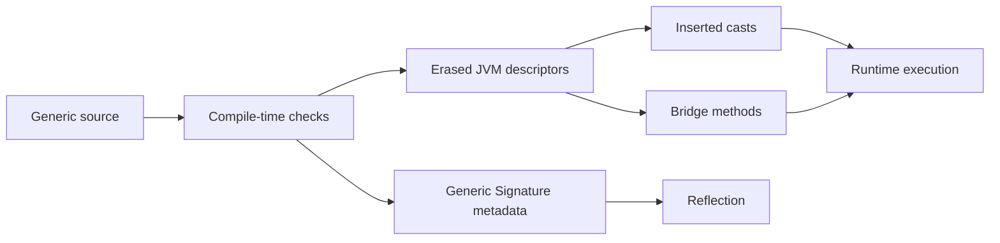

<TLDR>
  <TLDRCell label="what">
    The Java compiler checks generic constraints, then erases type parameters to their leftmost bound or `Object`; it also inserts required casts and generates bridge methods for some overrides.
  </TLDRCell>
  <TLDRCell label="trap">
    `List<String>` and `List<Integer>` objects don't have different runtime classes, and an unchecked cast doesn't validate elements, so a mistake often becomes a `ClassCastException` only when code reads an element.
  </TLDRCell>
  <TLDRCell label="fix">
    Keep compiler warnings visible and pass a `Class<T>`, `Type`, or factory when runtime code genuinely needs type information; every unchecked operation needs a small, provable invariant.
  </TLDRCell>
</TLDR>

## What it is and why it exists

Java type erasure maps generic source code onto ordinary classes and methods the JVM can execute. The compiler first checks type arguments at calls, such as rejecting an `Integer` added to a `List<String>`; when it emits the class file, the runtime representation of a parameterized type falls back to its raw class. A process therefore loads one `ArrayList` class rather than a new class for every combination of type arguments.

A type variable erases to its leftmost bound. With no explicit bound, `T` has the bound `Object`; `T extends CharSequence & Comparable<T>` erases to `CharSequence`. Parameterized types such as `List<String>` and `List<? extends Number>` both erase to `List`.

Erasure is the compatibility mechanism Java 5 used to migrate the existing JVM and nongeneric APIs to generics. Older APIs can interoperate with generic callers through raw types, at the cost of moving some checks to compile time only. A raw type isn't a different runtime container; it's a source-level view of the same declaration with some generic checks disabled.

“There are no generics at runtime” is too broad. An object usually can't tell you whether a list is a `List<String>` or `List<Integer>`, and JVM method descriptors use erased types; class files can still retain generic signatures for fields, methods, and supertypes in a `Signature` attribute. Reflection can therefore read that `Catalog.names` is declared as `List<String>`, but it can't recover type arguments once written by a caller from an arbitrary `ArrayList` object.

This boundary surfaces directly in reflection, serialization, dependency injection, proxies, generic arrays, and compiler warnings. Ordinary collection code rarely needs to reason about erasure explicitly. As soon as code tries to construct an object from `T`, test a parameterized type, or choose an overload by generic signature, it must state what information still exists at runtime.

## How it works

The compiler does more than delete angle brackets. It checks constraints from type parameters and wildcards, computes the erasure of every type variable and method signature, inserts casts at required read sites, and generates bridge methods that preserve some override relationships. Generic declaration metadata can coexist with erased executable descriptors.



### Erasure rules

These rules cover the main cases in application code:

| Source type | Erasure | Result |
| --- | --- | --- |
| `T` | `Object` | `T` has no explicit bound |
| `T extends Number` | `Number` | The leftmost bound is used |
| `T extends CharSequence & Comparable<T>` | `CharSequence` | Later bounds don't enter the erased type |
| `List<String>` | `List` | All type arguments are removed |
| `List<? extends Number>` | `List` | The wildcard isn't part of runtime class identity |
| `T[]` | `Object[]` or a bound array | The component uses the erasure of `T` |

Method erasure applies the same rules to every parameter and return type. Declarations that differ only in type arguments, such as `load(List<String>)` and `load(List<Integer>)`, both become `load(List)` and have a name clash in one class. A return type alone can't distinguish overloads.

### Where casts appear

The erased return type of `List<E>.get(int)` is `Object`. When source assigns `names.get(0)` to a `String`, the compiler inserts a checked conversion to `String` at the call result; normal parameterized writes are restricted at compile time. A raw type or unchecked conversion can bypass the write check and delay failure until a later read.

That delay explains many `ClassCastException` failures that appear far from the faulty line. Pollution happens when the wrong object enters the collection, but the exception may occur in another module, another thread, or much later at an implicit cast. Diagnosis should trace every raw assignment, unchecked cast, and generic varargs call upstream.

### Types fully represented at runtime

A <Term id="reifiable-type">reifiable type</Term> has enough runtime representation for operations that need runtime type checks, including array creation and `instanceof`. Nongeneric classes, raw types, primitive types, parameterized types whose arguments are all unbounded wildcards, and certain array types are reifiable. `List<?>` is reifiable; `List<String>` isn't.

You can therefore write `value instanceof List<?>`, but not `value instanceof List<String>`. The former proves only that the object is some kind of `List`; it says nothing about whether every element is a `String`. If element type is part of the input contract, validate each element or build a validation plan from trusted declaration metadata and explicit type tokens.

### Runtime type tokens

A <Term id="type-token">type token</Term> passes a runtime type to a generic API as an ordinary value. `Class<T>` represents reifiable types such as `String`, `Order`, or `int`, and connects compile-time `T` to runtime checks through `cast()`, `isInstance()`, and constructor lookup. It can't represent a complete `List<String>` because Java has no `List<String>.class` literal.

Nested parameterized types are usually described with `java.lang.reflect.Type`. The `Type` must come from real declaration structure, such as a field's generic type or a supertype signature that retains arguments; passing `List.class` alone can't recover `String`. A serialization API should distinguish its simple-type entry point accepting `Class<T>` from its parameterized-type entry point accepting a complete `Type`.

## Examples

These four examples progress through runtime classes, the leftmost bound, type tokens, and bridge methods. Their output came from local OpenJDK 21.0.12; the language rules and APIs they use were checked against the Java 25 specification and API documentation.

### Separate object type from declaration signature

Two `ArrayList` objects use different source type arguments but share one runtime class. Reflection can still read a field's declared generic signature; these facts don't conflict.

<Depth level="quick">

```java
import java.lang.reflect.ParameterizedType;
import java.util.ArrayList;
import java.util.List;

public class RuntimeTypes {
    static final class Catalog {
        List<String> names = List.of("pen");
    }

    public static void main(String[] args) throws Exception {
        var strings = new ArrayList<String>();
        var integers = new ArrayList<Integer>();
        var field = Catalog.class.getDeclaredField("names");
        var declared = (ParameterizedType) field.getGenericType();

        System.out.println("same runtime class: "
                + (strings.getClass() == integers.getClass()));
        System.out.println("runtime class: " + strings.getClass().getName());
        System.out.println("declared field: " + declared.getTypeName());
        System.out.println("type argument: " + declared.getActualTypeArguments()[0]);
    }
}
```

```text
same runtime class: true
runtime class: java.util.ArrayList
declared field: java.util.List<java.lang.String>
type argument: class java.lang.String
```

<TryToBreak items={['change the field to List<?>', 'change the field to raw List', 'keep only a list object and try to recover its type argument']} />

</Depth>

`getClass()` observes an object's actual class, so both results are `ArrayList`. `getGenericType()` observes the field declaration in the `Catalog` class file and returns a `ParameterizedType` describing `List<String>`; it doesn't inspect the object currently referenced by `names` or its elements.

If the field becomes a raw `List`, `getGenericType()` returns a `Class`, and a direct cast to `ParameterizedType` fails. Reflection code must branch on the actual kind of `Type` instead of assuming that every declaration is fully parameterized.

### Observe the leftmost bound

The first bound of `Slot<T>` is `CharSequence`. Ordinary reflection reports the erased parameter and return types, while generic reflection can still see the return type variable named `T`.

```java
import java.lang.reflect.Method;

public class ErasedBounds {
    static final class Slot<T extends CharSequence & Comparable<T>> {
        private T value;

        void put(T value) {
            this.value = value;
        }

        T get() {
            return value;
        }
    }

    public static void main(String[] args) throws Exception {
        Method put = Slot.class.getDeclaredMethod("put", CharSequence.class);
        Method get = Slot.class.getDeclaredMethod("get");

        System.out.println("put parameter: " + put.getParameterTypes()[0].getName());
        System.out.println("get return: " + get.getReturnType().getName());
        System.out.println("generic return: " + get.getGenericReturnType().getTypeName());
    }
}
```

```text
put parameter: java.lang.CharSequence
get return: java.lang.CharSequence
generic return: T
```

Reflective lookup must use `CharSequence.class`; passing `Object.class` or `Comparable.class` won't find the method. The leftmost bound determines the method descriptor and can affect binary compatibility. Treat a change to the leftmost bound of a published library's type parameter as an erased-signature change.

The generic return type `T` isn't a concrete argument from one invocation. To interpret it, a framework also needs a type-variable mapping from the declaration context; merely printing `T` can't tell it what a `Slot<String>` reference bound at a call site.

### Carry required information with `Class<T>`

This heterogeneous store uses `Class<T>` as both a key and runtime checker. Callers need no unchecked cast, and a missing value is handled separately from a type error.

```java
import java.util.HashMap;
import java.util.Map;
import java.util.NoSuchElementException;

public class TypedStore {
    private final Map<Class<?>, Object> values = new HashMap<>();

    public <T> void put(Class<T> type, T value) {
        values.put(type, type.cast(value));
    }

    public <T> T require(Class<T> type) {
        Object value = values.get(type);
        if (value == null) {
            throw new NoSuchElementException(type.getName());
        }
        return type.cast(value);
    }

    public static void main(String[] args) {
        var store = new TypedStore();
        store.put(String.class, "ready");
        store.put(Integer.class, 3);

        System.out.println(store.require(String.class).toUpperCase());
        System.out.println(store.require(Integer.class) + 4);
        try {
            store.require(Long.class);
        } catch (NoSuchElementException error) {
            System.out.println("missing: " + error.getMessage());
        }
    }
}
```

```text
READY
7
missing: java.lang.Long
```

The field type `Map<Class<?>, Object>` can't express the invariant that each value has the type named by its key, so this class maintains that invariant within a small boundary. Both `put()` and `require()` go through the same `Class`; don't expose an API that can mutate the map directly and bypass them.

This shape can store only one value per `Class`, and both `List<String>` and `List<Integer>` have only `List.class` as a key. When keys need parameterization, make the key object carry a complete `Type` and define equality, type validation, and construction policy together.

### Identify bridge methods

After erasure, `Decoder<T>.decode()` returns `Object`, while the implementation method returns `Integer`. The compiler generates a bridge returning `Object` so calls through the erased interface signature still dispatch to the implementation.

```java
import java.lang.reflect.Method;
import java.util.Arrays;
import java.util.Comparator;

public class BridgeMethods {
    interface Decoder<T> {
        T decode(String input);
    }

    static final class IntegerDecoder implements Decoder<Integer> {
        @Override
        public Integer decode(String input) {
            return Integer.valueOf(input);
        }
    }

    public static void main(String[] args) {
        Arrays.stream(IntegerDecoder.class.getDeclaredMethods())
                .filter(method -> method.getName().equals("decode"))
                .sorted(Comparator.comparing(method -> method.getReturnType().getName()))
                .forEach(BridgeMethods::printMethod);

        Decoder<Integer> decoder = new IntegerDecoder();
        System.out.println("decoded: " + (decoder.decode("42") + 1));
    }

    private static void printMethod(Method method) {
        System.out.printf("%s bridge=%s synthetic=%s%n",
                method.getReturnType().getSimpleName(),
                method.isBridge(), method.isSynthetic());
    }
}
```

```text
Integer bridge=false synthetic=false
Object bridge=true synthetic=true
decoded: 43
```

A reflection scanner sees two methods named `decode` with equal parameters and different return types. A framework that registers handlers by name without checking `isBridge()` may register twice or select the bridge. Whether to filter bridge methods is part of the framework's contract; it shouldn't delete every synthetic member indiscriminately.

Ordinary Java calls don't require manual bridge selection. When an interface reference calls the erased signature, JVM dispatch can enter the compiler-generated adapter and ultimately execute `IntegerDecoder.decode(String)`.

## Pitfalls

### Treating `List<?>` as `List<String>`

> [!PITFALL]
> `value instanceof List<?>` checks only the raw runtime class. Casting the value to `List<String>` afterward is still unchecked and doesn't iterate over or validate any element.

**Fix:** For untrusted input, accept a `List<?>`, validate every element with `String.class.isInstance()` or a domain parser, and report the failing position. If a trusted serialization schema supplies the type, pass a `Type` that expresses the full parameterized type instead of pretending `List.class` means `List<String>`.

### Distinguishing overloads by type arguments

> [!PITFALL]
> `read(List<String>)` and `read(List<Integer>)` have the same erased signature and can't coexist. Changing only the return type doesn't resolve the name clash.

**Fix:** Use different names that state the operations' semantics, or design one generic method that accepts a parser, mapping function, or type token. Don't add a meaningless dummy parameter just to evade the overload rule; that leaks an erasure limitation to every caller.

### Ignoring unchecked warnings

> [!PITFALL]
> A <Term id="raw-type">raw type</Term> assignment or unchecked cast turns off part of the compiler's proof. The resulting <Term id="heap-pollution">heap pollution</Term> often doesn't fail at the write; it fails on a later read where the compiler inserted a cast.

**Fix:** Enable `-Xlint:unchecked` in CI and review each warning. Put a necessary `@SuppressWarnings("unchecked")` on the smallest local scope and document a testable invariant, such as “only `push(E)` writes this private array.” If you can't state the reason, don't suppress it.

### Creating generic arrays or misusing generic varargs

> [!PITFALL]
> Java rejects `new List<String>[10]` because arrays check their runtime component type on writes while `List<String>` isn't reifiable. Generic varargs pass through an array transformation and can expose the same route to heap pollution.

**Fix:** Prefer `List<List<String>>` for container structure. When an API must return an array, let the caller supply an array constructor or concrete component class. Use `@SafeVarargs` only at an eligible declaration whose body neither writes incompatible values nor exposes the varargs array.

### Trying to write `T.class` or `new T()`

> [!PITFALL]
> An erased method has no `T.class` from a particular call, and a type parameter's bound doesn't describe an invocable constructor, so `new T()` is illegal too. Replacing it with `(T) new Object()` merely converts a compile error into a runtime failure.

**Fix:** Pass `Class<T>` when you only need a runtime check; pass `Supplier<? extends T>` or a named factory interface when you need construction. If the constructor shape is known only at runtime, centralize reflection and define access, exception, and caching policies.

### Processing bridge methods twice in reflection

> [!PITFALL]
> `getDeclaredMethods()` can return both the source method and a compiler-generated bridge. Registering callbacks by method name or annotation alone can create duplicate routes and can make behavior depend on unspecified method-array order.

**Fix:** First decide whether the scanner models source declarations or JVM call entries, then filter stably with `isBridge()`, `isSynthetic()`, and complete parameter and return types. Sorting and conflict handling must be explicit; “the first method” isn't a contract.

## In the AI era

**What generated code gets wrong here**

Models often produce uncompilable `value instanceof List<Order>`, `T.class`, or `new T()`, then silence the feedback with raw types and `@SuppressWarnings("unchecked")`. A subtler version is a JSON helper that accepts `Class<T>`: the caller passes `List.class`, and the helper casts a parsed `List<Map<String, Object>>` to `List<Order>`; the cast succeeds, then the first `Order` read fails. Generated reflection registries also tend to walk `getDeclaredMethods()` and select the first name match, registering a source method and its bridge twice.

**Ask your AI to check**

- List the erasure of every type variable, parameterized type, and method signature, and identify all post-erasure clashes.
- List every raw type, unchecked cast, and `@SuppressWarnings`, then name the testable invariant that makes each conversion safe.
- For every reflection or serialization entry point, state whether it carries `Class<?>` or a complete `Type`, and where nested type arguments are validated.

**Review checklist**

- Test every runtime entry point advertised as “type safe” with heterogeneous elements, empty input, nested parameterized types, and `null`.
- Compile generated code with `-Xlint:unchecked`; reject new warnings without a local proof and broad warning suppressions.
- Check that reflection scans handle bridge and synthetic methods deterministically and that overload selection doesn't rely on array order or an argument's accidental runtime class.

**Prompt vocabulary**

Use the exact terms `type erasure`, `erased signature`, `leftmost bound`, `reifiable type`, `raw type`, `unchecked cast`, `heap pollution`, `bridge method`, `type token`, and `generic Signature attribute`. Ask for an erasure table and a warning inventory; “make generics work at runtime” doesn't say which layer of type information the code needs to retain.

<Depth level="deep">

## What the class file retains

The JVM uses method descriptors to link and select call targets, and generic types in those descriptors are erased. For `Slot<T extends CharSequence & Comparable<T>>`, the descriptor for `put` accepts `CharSequence` and the descriptor for `get` returns `CharSequence`. This is the layer observed by ordinary reflection through `getParameterTypes()` and `getReturnType()`.

The compiler can also write a generic `Signature` attribute that describes type variables, parameterized fields, parameterized supertypes, and generic methods. `getGenericReturnType()`, `getGenericParameterTypes()`, and `getGenericSuperclass()` parse this metadata. It describes declarations; it isn't a per-object record of arguments.

Not every class file necessarily has the signature a consumer wants. A raw declaration has no type arguments, and other JVM languages or bytecode tools may emit different metadata; reflection APIs also define failures for malformed signatures and missing types. Framework code should handle “absent,” raw `Class`, and `ParameterizedType` as distinct cases.

The parameterized type written on a local variable at a call site usually doesn't become part of the referenced object's identity. After `new ArrayList<String>()` is assigned to `Object` and crosses an API boundary, reflection can't recover `String` from the object. If downstream code needs it, the type must travel explicitly in the protocol or live in declaration structure that can be read.

### The boundary between `Class<T>` and `Type`

`Class<String>` carries both a runtime `Class` object and a compile-time relation, so `String.class.cast(value)` returns `String`. That relation lets a simple type-token API avoid asking callers for unchecked casts. `Class<List>` can prove only that a value is a `List`, not that its elements have one type.

`Type` is the common interface for several reflective type representations, including `Class`, `ParameterizedType`, `TypeVariable`, `WildcardType`, and `GenericArrayType`. Code that consumes `Type` must process these shapes recursively instead of casting all of them to `Class<?>`. The argument of `List<? extends Number>`, for example, is a wildcard rather than a class that can be instantiated directly.

A “super type token” uses an anonymous subclass to place a parameterized supertype in a class-file signature, then reads it with `getGenericSuperclass()`. The technique can capture an explicitly written `List<Order>`, but raw subclasses, unresolved type variables, and dynamically assembled `Type` values still need defined handling. It doesn't undo erasure; it stores required information in another reflective declaration.

## Bridge methods and polymorphism

A generic override can change parameter or return types after erasure. If `Consumer<T>.accept(T)` is implemented by `StringConsumer.accept(String)`, the interface method erases to `accept(Object)` while the implementation accepts `String`. The compiler generates an `accept(Object)` bridge that casts the argument and delegates to `accept(String)`, preserving dynamic dispatch after the override.

A bridge method carries the bridge flag and normally the synthetic flag, exposed through reflection as `Method.isBridge()` and `isSynthetic()`. A cast inside a bridge can throw `ClassCastException`; this often happens when a raw interface reference bypasses generic checks and supplies the wrong type. An exception from compiler-generated code doesn't mean the JVM inserted a random business cast.

Bridge methods affect more than debugger output. Annotation frameworks, RPC routers, and test discovery systems that process every result from `getDeclaredMethods()` can treat one source operation as two candidates. On the other hand, a bytecode-level tool may need the bridge entry. The correct policy depends on whether the tool models source semantics, the Java reflection invocation view, or complete class-file structure.

When a published generic API changes bounds or override structure, check source and binary behavior separately. Recompiled source may select different generic constraints, existing binaries still link through old erased descriptors, and the generated bridge set can change. Library evolution tests should include old caller binaries instead of relying only on a clean rebuild.

## Reifiable types, arrays, and varargs

Arrays and generics have different runtime models. Arrays are covariant and reified: a `String[]` knows its component type is `String`, so writing an `Integer` through an `Object[]` reference immediately throws `ArrayStoreException`. Generics are invariant, so `List<String>` isn't assignable to `List<Object>`, and their element arguments usually aren't in the runtime class.

If Java allowed `List<String>[]`, the runtime array could know only that its component class was `List`. Another reference could store a `List<Integer>` and pass the array store check, after which a `String` read through the original variable would fail. The language prohibits arrays with non-reifiable component types instead of pretending the store check can validate nested arguments.

`List<?>[]` is legal because each element promises only to be some kind of `List`. It is rarely easier to use than `List<List<?>>`, and it doesn't let code add any arbitrary non-null object to the inner lists. Compilability alone doesn't give it a useful invariant for parameterized data.

Generic varargs construct an array at the call site, so the compiler warns on declarations or calls that may be unsafe. `@SafeVarargs` is a promise about the method body, not a switch that tells callers to disable type checking. Read-only iteration is often easy to justify; exposing the array, writing values with another parameterization, or passing it to code that may retain it all require another review.

When diagnosing heap pollution, the read that throws is only the endpoint. Start with unchecked and varargs warnings in the build, then search raw-type boundaries, reflection results, deserialization entry points, and array aliases. A test that inserts one wrong element and immediately follows the full consumer path is more representative than an assertion that the initial cast didn't throw.

</Depth>

<Checkpoint id="java/type-erasure" />

## Further reading

- [Java Language Specification 25: parameterized types](https://docs.oracle.com/javase/specs/jls/se25/html/jls-4.html#jls-4.5)
- [Java Language Specification 25: type erasure](https://docs.oracle.com/javase/specs/jls/se25/html/jls-4.html#jls-4.6)
- [Java Language Specification 25: reifiable types](https://docs.oracle.com/javase/specs/jls/se25/html/jls-4.html#jls-4.7)
- [dev.java: generics](https://dev.java/learn/generics/)
- [Java SE 25 API: `Method`](https://docs.oracle.com/en/java/javase/25/docs/api/java.base/java/lang/reflect/Method.html)
