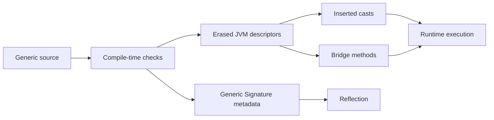

<TLDR>
  <TLDRCell label="what">
    Java编译器会检查泛型约束，再把类型参数擦除为其最左边界或`Object`；它还会插入必要的类型转换，并在某些覆盖关系中生成桥接方法。
  </TLDRCell>
  <TLDRCell label="trap">
    `List<String>`与`List<Integer>`的对象没有不同的运行时类，未经检查的转换也不会验证元素，因此错误常在读取元素时才变成`ClassCastException`。
  </TLDRCell>
  <TLDRCell label="fix">
    让编译器警告保持可见，并在确实需要运行时类型时显式传递`Class<T>`、`Type`或工厂；每个未经检查的操作都应有局部且可证明的不变量。
  </TLDRCell>
</TLDR>

## 是什么，为什么存在

Java的类型擦除（type erasure）把泛型源码映射到JVM可以执行的普通类和方法。编译器先用类型实参检查调用，例如阻止把`Integer`放进`List<String>`；生成类文件时，参数化类型的运行时表示再退回原始类。于是一个进程只需要加载一个`ArrayList`类，而不是为每组类型实参加载一个新类。

类型变量会擦除为最左边界。`T`没有显式边界时，边界是`Object`；`T extends CharSequence & Comparable<T>`则擦除为`CharSequence`。`List<String>`、`List<? extends Number>`等参数化类型都擦除为`List`。

擦除是Java 5向既有JVM与非泛型API迁移时采用的兼容机制。旧API可以通过原始类型与泛型调用方互操作，但代价是部分检查只能发生在编译期。原始类型不是另一个运行时容器，它只是对同一个声明关闭部分泛型检查的源码视图。

“运行时没有泛型”这句话过于粗糙。对象本身通常不能告诉你某个列表是`List<String>`还是`List<Integer>`，JVM方法描述符也使用擦除后的类型；类文件仍可在`Signature`属性中保存字段、方法和父类型声明的泛型签名。反射因此能读取`Catalog.names`声明为`List<String>`，却不能从任意`ArrayList`对象恢复调用方当初写的类型实参。

你会在反射、序列化、依赖注入、代理、泛型数组和编译器警告中直接碰到这条边界。普通集合代码很少需要手动考虑擦除，但只要代码试图根据`T`构造对象、判断参数化类型或按泛型签名选择重载，就必须明确运行时还剩什么信息。

## 工作原理

编译器对泛型代码做的事情不只是删除尖括号。它检查类型参数与通配符约束，计算每个类型变量和方法签名的擦除，必要时在读取位置插入转换，并生成维持覆盖关系所需的桥接方法。泛型声明元数据可以与擦除后的可执行描述符同时存在。



### 擦除规则

以下规则覆盖日常代码中的主要情况：

| 源码类型 | 擦除后 | 结果 |
| --- | --- | --- |
| `T` | `Object` | `T`没有显式边界 |
| `T extends Number` | `Number` | 使用最左边界 |
| `T extends CharSequence & Comparable<T>` | `CharSequence` | 后续边界不进入擦除类型 |
| `List<String>` | `List` | 删除全部类型实参 |
| `List<? extends Number>` | `List` | 通配符不进入运行时类身份 |
| `T[]` | `Object[]`或边界数组 | 数组元素使用`T`的擦除 |

方法的擦除会对所有形参类型和返回类型应用同一规则。两个声明如果只靠类型实参区分，例如`load(List<String>)`与`load(List<Integer>)`，都会得到`load(List)`，所以它们在同一个类中发生名称冲突。返回类型不能单独区分重载。

### 转换插在哪里

`List<E>.get(int)`的擦除后返回类型是`Object`。当源码把`names.get(0)`赋给`String`时，编译器会在调用结果处加入到`String`的检查转换；正常的参数化写入则在编译期受到限制。原始类型或未经检查的转换可以绕过写入检查，使异常延迟到之后的读取位置。

这种延迟解释了很多看似“在错误行之外”抛出的`ClassCastException`。污染发生在错误对象被写进集合时，异常却可能在另一个模块、另一个线程或很久之后的隐式转换处出现。诊断时要向上追踪所有原始类型赋值、未经检查的转换和泛型可变参数调用。

### 哪些类型可在运行时完整表示

<Term id="reifiable-type">可具体化类型（reifiable type）</Term>在运行时有足够完整的表示，可用于数组创建或`instanceof`等需要运行时类型检查的操作。非泛型类、原始类型、基本类型、类型实参全是无界通配符的参数化类型，以及某些数组类型都属于这一类。`List<?>`可具体化，`List<String>`则不可具体化。

因此可以写`value instanceof List<?>`，不能写`value instanceof List<String>`。前者只证明对象是某种`List`，不证明其中每个元素都是`String`。如果元素类型属于输入契约，就要逐个验证，或从可信的声明元数据和显式类型令牌建立验证方案。

### 运行时类型令牌

<Term id="type-token">类型令牌（type token）</Term>把运行时类型作为普通值传给泛型API。`Class<T>`能表示`String`、`Order`或`int`这样的可具体化类型，并通过`cast()`、`isInstance()`与构造器查询连接编译期`T`和运行时检查。它不能表示完整的`List<String>`，因为Java不允许写`List<String>.class`。

嵌套参数化类型通常用`java.lang.reflect.Type`描述。这个`Type`必须来自真实的声明结构，例如字段的泛型类型或保留了类型实参的父类型签名；单独传入`List.class`不能凭空恢复`String`。序列化API应明确区分接受`Class<T>`的简单类型入口与接受完整`Type`的参数化类型入口。

## 示例

下面四个例子依次观察运行时类、最左边界、类型令牌和桥接方法。输出来自本地OpenJDK 21.0.12；示例使用的语言规则与API已对照Java 25规范和API文档确认。

### 区分对象类型与声明签名

两个`ArrayList`对象使用不同的源码类型实参，却共享同一个运行时类。字段声明的泛型签名仍可由反射读取，这两个事实并不矛盾。

<Depth level="quick">

```java
import java.lang.reflect.ParameterizedType;
import java.util.ArrayList;
import java.util.List;

public class RuntimeTypes {
    static final class Catalog {
        List<String> names = List.of("pen");
    }

    public static void main(String[] args) throws Exception {
        var strings = new ArrayList<String>();
        var integers = new ArrayList<Integer>();
        var field = Catalog.class.getDeclaredField("names");
        var declared = (ParameterizedType) field.getGenericType();

        System.out.println("same runtime class: "
                + (strings.getClass() == integers.getClass()));
        System.out.println("runtime class: " + strings.getClass().getName());
        System.out.println("declared field: " + declared.getTypeName());
        System.out.println("type argument: " + declared.getActualTypeArguments()[0]);
    }
}
```

```text
same runtime class: true
runtime class: java.util.ArrayList
declared field: java.util.List<java.lang.String>
type argument: class java.lang.String
```

<TryToBreak items={['把字段改成无界通配符列表', '把字段改成原始类型List', '只保留一个列表对象并尝试恢复其类型实参']} />

</Depth>

`getClass()`观察对象的实际类，因此两个结果都是`ArrayList`。`getGenericType()`观察`Catalog`类文件中的字段声明，返回的`ParameterizedType`描述`List<String>`；它没有检查`names`当前引用的对象或其中的元素。

如果字段改成原始`List`，`getGenericType()`返回的是`Class`，直接转换为`ParameterizedType`会失败。反射代码必须按`Type`的实际种类分支，不能假设每个声明都参数化完整。

### 观察最左边界

`Slot<T>`的第一个边界是`CharSequence`。普通反射方法返回擦除后的形参和返回类型，泛型反射方法仍能看到返回类型变量名`T`。

```java
import java.lang.reflect.Method;

public class ErasedBounds {
    static final class Slot<T extends CharSequence & Comparable<T>> {
        private T value;

        void put(T value) {
            this.value = value;
        }

        T get() {
            return value;
        }
    }

    public static void main(String[] args) throws Exception {
        Method put = Slot.class.getDeclaredMethod("put", CharSequence.class);
        Method get = Slot.class.getDeclaredMethod("get");

        System.out.println("put parameter: " + put.getParameterTypes()[0].getName());
        System.out.println("get return: " + get.getReturnType().getName());
        System.out.println("generic return: " + get.getGenericReturnType().getTypeName());
    }
}
```

```text
put parameter: java.lang.CharSequence
get return: java.lang.CharSequence
generic return: T
```

反射查找必须使用`CharSequence.class`，传`Object.class`或`Comparable.class`都找不到该方法。最左边界不仅决定方法描述符，也会影响二进制兼容性；发布库修改类型参数的最左边界时，需要把它当作擦除签名变化来检查。

泛型返回类型`T`不是某次调用的具体实参。要解释它，框架还需要包含声明上下文的类型变量映射；只打印`T`并不能知道某个`Slot<String>`引用在调用点绑定了什么。

### 用`Class<T>`保留所需信息

这个异构存储把`Class<T>`同时用作键和运行时检查器。调用方不需要未经检查的转换，缺失值也与类型错误分开处理。

```java
import java.util.HashMap;
import java.util.Map;
import java.util.NoSuchElementException;

public class TypedStore {
    private final Map<Class<?>, Object> values = new HashMap<>();

    public <T> void put(Class<T> type, T value) {
        values.put(type, type.cast(value));
    }

    public <T> T require(Class<T> type) {
        Object value = values.get(type);
        if (value == null) {
            throw new NoSuchElementException(type.getName());
        }
        return type.cast(value);
    }

    public static void main(String[] args) {
        var store = new TypedStore();
        store.put(String.class, "ready");
        store.put(Integer.class, 3);

        System.out.println(store.require(String.class).toUpperCase());
        System.out.println(store.require(Integer.class) + 4);
        try {
            store.require(Long.class);
        } catch (NoSuchElementException error) {
            System.out.println("missing: " + error.getMessage());
        }
    }
}
```

```text
READY
7
missing: java.lang.Long
```

`Map<Class<?>, Object>`的字段本身不能表达“值的类型与键的类型一致”，所以这个类在一个很小的边界内维护该不变量。`put()`与`require()`都经过同一个`Class`；不要公开能绕过它们并直接修改映射的接口。

这个模式只能为每个`Class`保存一个值，而且`List<String>`与`List<Integer>`都只能使用`List.class`作为键。需要参数化键时，应让键对象携带完整`Type`，并把相等、类型验证和构造策略一起定义清楚。

### 识别桥接方法

`Decoder<T>.decode()`擦除后返回`Object`，实现方法返回`Integer`。编译器生成一个返回`Object`的桥接方法，使通过擦除后接口签名的调用仍分派到实现方法。

```java
import java.lang.reflect.Method;
import java.util.Arrays;
import java.util.Comparator;

public class BridgeMethods {
    interface Decoder<T> {
        T decode(String input);
    }

    static final class IntegerDecoder implements Decoder<Integer> {
        @Override
        public Integer decode(String input) {
            return Integer.valueOf(input);
        }
    }

    public static void main(String[] args) {
        Arrays.stream(IntegerDecoder.class.getDeclaredMethods())
                .filter(method -> method.getName().equals("decode"))
                .sorted(Comparator.comparing(method -> method.getReturnType().getName()))
                .forEach(BridgeMethods::printMethod);

        Decoder<Integer> decoder = new IntegerDecoder();
        System.out.println("decoded: " + (decoder.decode("42") + 1));
    }

    private static void printMethod(Method method) {
        System.out.printf("%s bridge=%s synthetic=%s%n",
                method.getReturnType().getSimpleName(),
                method.isBridge(), method.isSynthetic());
    }
}
```

```text
Integer bridge=false synthetic=false
Object bridge=true synthetic=true
decoded: 43
```

反射扫描器会看到两个名为`decode`、形参相同而返回类型不同的方法。按名称注册处理器的框架若不检查`isBridge()`，可能重复注册或选中桥接入口；是否过滤桥接方法应由框架契约决定，而不是把所有合成成员一概删除。

正常Java调用不需要手动选择桥接方法。接口引用调用擦除签名时，JVM分派会经过编译器生成的适配入口，最终执行`IntegerDecoder.decode(String)`。

## 陷阱

### 把`List<?>`当成`List<String>`

> [!PITFALL]
> `value instanceof List<?>`只检查原始运行时类。随后把该值转换为`List<String>`仍是未经检查的操作，也没有遍历或验证任何元素。

**修复：** 如果输入不可信，先接受`List<?>`，再用`String.class.isInstance()`或领域解析器验证每个元素，并把失败位置报告出来。若类型来自可信的序列化模式，则传递能表达完整参数化类型的`Type`，不要用`List.class`冒充`List<String>`。

### 用类型实参区分重载

> [!PITFALL]
> `read(List<String>)`与`read(List<Integer>)`的擦除签名相同，不能共存。换一个返回类型也不能解决方法名称冲突。

**修复：** 使用说明语义的不同方法名，或设计一个泛型方法并传入解析器、映射函数或类型令牌。不要添加无意义的哑元形参只为骗过重载规则，它会把擦除限制泄漏给每个调用方。

### 忽略未经检查警告

> [!PITFALL]
> <Term id="raw-type">原始类型（raw type）</Term>赋值和未经检查的转换会关闭部分编译期证明。由此产生的<Term id="heap-pollution">堆污染（heap pollution）</Term>通常不会在写入时失败，而会在后来读取并由编译器插入转换时失败。

**修复：** 在CI中启用`-Xlint:unchecked`，逐个审查警告。确实需要的`@SuppressWarnings("unchecked")`只放在最小局部范围，并写明可验证的不变量，例如“私有数组只能由`push(E)`写入”；无法说明理由就不要抑制。

### 创建泛型数组或滥用泛型可变参数

> [!PITFALL]
> Java禁止`new List<String>[10]`，因为数组会在写入时按运行时组件类型检查，而`List<String>`不可具体化。泛型可变参数会经过数组转换，同样可能暴露堆污染。

**修复：** 容器结构优先使用`List<List<String>>`。需要返回数组时，让调用方提供数组构造器或具体组件类；只有方法既不写入不兼容值、也不泄漏可变参数数组时，才在允许的位置使用`@SafeVarargs`。

### 试图写`T.class`或`new T()`

> [!PITFALL]
> 擦除后的方法没有某次调用的`T.class`，类型参数的边界也没有表达可调用构造器，所以`new T()`同样不合法。把代码改成`(T) new Object()`只是把编译错误变成运行时错误。

**修复：** 只需运行时检查时传`Class<T>`；需要构造时传`Supplier<? extends T>`或一个明确的工厂接口。若构造器形状在运行时才确定，集中使用反射并定义访问、异常和缓存策略。

### 反射扫描时重复处理桥接方法

> [!PITFALL]
> `getDeclaredMethods()`可以同时返回源码方法和编译器生成的桥接方法。只按方法名或注解注册回调，可能产生重复路由，也可能让结果取决于未规定的方法数组顺序。

**修复：** 先定义扫描的是源码声明语义还是JVM调用入口，再结合`isBridge()`、`isSynthetic()`、完整形参和返回类型做稳定筛选。排序和冲突处理必须显式，不能把“第一个方法”当成契约。

<Depth level="deep">

## 类文件保留了什么

JVM用方法描述符确定链接与调用目标，描述符中的泛型类型已经擦除。以`Slot<T extends CharSequence & Comparable<T>>`为例，`put`的描述符接收`CharSequence`，`get`的描述符返回`CharSequence`。这就是普通反射的`getParameterTypes()`与`getReturnType()`所观察的层。

编译器还可以写入泛型`Signature`属性，描述类型变量、参数化字段、参数化父类型和泛型方法。`getGenericReturnType()`、`getGenericParameterTypes()`与`getGenericSuperclass()`解析这层元数据。它描述声明，不是每个对象附带的一份实参记录。

并非每个类文件都一定带有需要的签名。原始类型声明没有类型实参，其他JVM语言或字节码工具也可能生成不同的元数据；反射API还定义了格式错误或缺失类型时的失败。框架应把“不存在”“是原始Class”“是ParameterizedType”分别处理。

局部变量在调用点写成什么参数化类型，通常不会变成被引用对象的身份。把`new ArrayList<String>()`赋给`Object`再传过API边界后，反射不能从对象恢复`String`。如果下游需要它，类型必须作为协议的一部分显式传递或存在于可读取的声明结构中。

### `Class<T>`与`Type`的边界

`Class<String>`同时携带一个运行时`Class`对象和编译期关系，所以`String.class.cast(value)`的返回类型是`String`。这个关系让简单类型令牌API不需要调用方自己写未经检查的转换。`Class<List>`只能证明值是`List`，无法证明元素类型。

`Type`是多个反射类型表示的共同接口，包括`Class`、`ParameterizedType`、`TypeVariable`、`WildcardType`和`GenericArrayType`。消费`Type`的代码要递归处理这些形状，不能一律转换成`Class<?>`。例如`List<? extends Number>`的实参是通配符，不是一个可直接实例化的类。

所谓“超类型令牌”利用匿名子类把参数化父类型写进类文件签名，再由`getGenericSuperclass()`读取。这个技巧能捕获调用方明确写出的`List<Order>`，但原始子类、未解析类型变量和动态组合的`Type`仍需定义处理规则。它没有取消擦除，只是把所需信息放进另一处可反射的声明。

## 桥接方法与多态

泛型覆盖可能在擦除后改变参数或返回类型。若`Consumer<T>.accept(T)`由`StringConsumer.accept(String)`实现，接口方法擦除为`accept(Object)`，而实现方法接收`String`。编译器生成`accept(Object)`桥接方法，在其中转换参数并委托给`accept(String)`，从而保持覆盖后的动态分派。

桥接方法会带有bridge标志，通常也带synthetic标志，反射通过`Method.isBridge()`与`isSynthetic()`暴露它们。桥接入口中的转换可能抛出`ClassCastException`；这常发生在原始接口引用绕过泛型检查并传入错误类型时。异常来自编译器生成的方法并不表示JVM随机插入了业务转换。

桥接方法不只影响调试输出。注解框架、RPC路由器和测试发现器如果逐个处理`getDeclaredMethods()`，可能把一个源码操作当成两个候选；另一方面，字节码级工具有时确实需要观察桥接入口。正确策略取决于工具处理源码语义、Java反射调用视图还是完整类文件结构。

修改公开泛型API的边界或覆盖结构时，要同时检查源码和二进制行为。源码重新编译可能选择不同的泛型约束，既有二进制仍按旧擦除描述符链接，而编译器生成的桥接集合也可能变化。库演进测试应包含旧调用方二进制，不应只做一次干净重编译。

## 可具体化类型、数组与可变参数

数组与泛型的运行时模型不同。数组是协变且可具体化的：`String[]`知道组件类型是`String`，通过`Object[]`写入`Integer`会立即抛出`ArrayStoreException`。泛型是不变的，`List<String>`不能赋给`List<Object>`，而且其元素实参通常不在运行时类中。

如果允许创建`List<String>[]`，运行时数组只能知道组件类是`List`。另一个引用可把`List<Integer>`写入而通过数组存储检查，之后从原变量读取`String`才失败。语言因此禁止创建组件类型不可具体化的数组，而不是假装数组存储检查能验证嵌套实参。

`List<?>[]`可以创建，因为每个元素只承诺是某种`List`。这很少比`List<List<?>>`更易用，也不能向任何内部列表写入除`null`外的任意对象。可编译不等于它为参数化数据建立了有用的不变量。

泛型可变参数在调用点构造数组，因此编译器会对可能不安全的声明或调用发出警告。`@SafeVarargs`是实现者对方法体的承诺，不是让调用方关闭类型检查的开关。只读遍历通常容易证明安全；把数组暴露出去、把不同参数化值写进去，或交给可能保存引用的代码都需要重新审查。

排查堆污染时，抛出异常的读取点只是终点。先查看构建日志中的unchecked与varargs警告，再搜索原始类型边界、反射返回值、反序列化入口和数组别名。加入一个错误元素后立即走完整消费路径的测试，通常比只断言“转换没有抛异常”更接近真实故障。

</Depth>

<Checkpoint id="java/type-erasure" />

## 延伸阅读

- [Java语言规范25：参数化类型](https://docs.oracle.com/javase/specs/jls/se25/html/jls-4.html#jls-4.5)
- [Java语言规范25：类型擦除](https://docs.oracle.com/javase/specs/jls/se25/html/jls-4.html#jls-4.6)
- [Java语言规范25：可具体化类型](https://docs.oracle.com/javase/specs/jls/se25/html/jls-4.html#jls-4.7)
- [dev.java：泛型](https://dev.java/learn/generics/)
- [Java SE 25 API：`Method`](https://docs.oracle.com/en/java/javase/25/docs/api/java.base/java/lang/reflect/Method.html)
