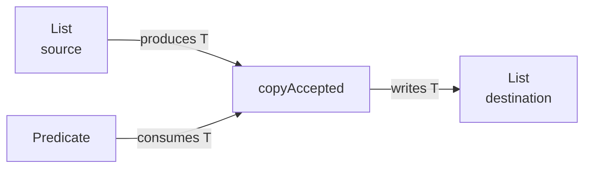

<TLDR>
  <TLDRCell label="what">
    A <Term id="wildcard">wildcard</Term> is an unknown type argument written as `?`. It lets an API accept a related family of parameterized types without giving up compile-time checking.
  </TLDRCell>
  <TLDRCell label="trap">
    `List<? extends T>` doesn't mean "a list you can write any `T` into," and reading `List<? super T>` doesn't promise a `T`. A wildcard limits the operations that are safe through the current reference.
  </TLDRCell>
  <TLDRCell label="fix">
    Use `? extends T` for a parameter that only produces `T` and `? super T` for one that only consumes `T`. Declare a named type parameter `<T>` when several positions must preserve the same unknown type.
  </TLDRCell>
</TLDR>

## What it is and why it exists

Java generics are <Term id="invariance">invariant</Term>. Although `Integer` is a subtype of `Number`, `List<Integer>` is not a subtype of `List<Number>`. If it were, code holding the `List<Number>` reference could add a `Double` and violate the original integer list's contract.

A wildcard expresses an unknown type where a parameterized type is used. `List<?>` is a list with an unknown element type; `List<? extends Number>` limits that unknown type to a subtype of `Number`; `List<? super Integer>` limits it to a supertype of `Integer`. These forms don't change the declaration of `List<E>`. They constrain what you can do through that reference.

Bounded wildcards provide use-site variance. `List<Integer>` is assignable to `List<? extends Number>`, giving a safe <Term id="covariance">covariant</Term> view; both `List<Number>` and `List<Object>` are assignable to `List<? super Integer>`, giving <Term id="contravariance">contravariant</Term> views. "View" describes a static type relationship here, not a newly allocated wrapper object.

You meet wildcards in collection copying, sorting, callback registration, stream operations, and bulk-write APIs. They work best at an API boundary where the implementation cares about "which type can I read?" or "which type can I write?" but not the exact element type. If the implementation must carry one unknown type through several parameters or a result, give that type a name.

PECS abbreviates "Producer Extends, Consumer Super." A producer supplies `T` to the current method, so it uses `? extends T`; a consumer receives `T` from the method, so it uses `? super T`. The role belongs to a parameter's data flow in one method, not permanently to a collection object.

## How it works

The compiler treats each wildcard as one unknown type constrained by its bounds. It doesn't guess from runtime elements or relax writes after inspecting existing contents. Every safe capability follows from the static declaration.

| Form | Safe read type | Values you can add through it | Typical role |
| --- | --- | --- | --- |
| `List<T>` | `T` | `T` and its subtypes | One named, bidirectional type |
| `List<?>` | `Object` | Only `null` | Observe type-independent properties |
| `List<? extends T>` | `T` | Only `null` | Producer of `T` |
| `List<? super T>` | `Object` | `T` and its subtypes | Consumer of `T` |

The actual type behind `? extends T` could be any subtype of `T`. Every value can be read as at least `T`, but writing an ordinary `T` could pollute a narrower list. The actual type behind `? super T` could be `T`, one of its supertypes, or `Object`; writing a `T` is safe, but a read can rely only on the common upper bound `Object`.

You can think of the unbounded `?` as `? extends Object` when the element type doesn't matter, but don't rewrite it as `Object`. `List<Object>` has a known element type and accepts any reference. `List<?>` has an unknown element type and accepts no non-null reference.

In the following flow, the source list and predicate supply capabilities to the method, while the destination list receives values from it. A predicate consumes a `T`, so its type also uses `? super T`.



At the call site, the compiler solves constraints for each named type parameter. For `copyAccepted(destination, source, predicate)`, one `T` must satisfy the source's production, the destination's consumption, and the predicate's input requirements together. If no such `T` exists, compilation fails.

Some safe operations first need a temporary name for an unknown type. <Term id="wildcard-capture">Wildcard capture</Term> introduces a fresh internal type for a `?` in one expression. A private generic helper can receive that captured type and use it consistently for reads and writes. Names such as `CAP#1` in compiler diagnostics are displays of these capture types.

PECS is a starting point for signature design, not a mechanical replacement rule. When one parameter both produces and consumes the same type, `List<T>` is usually more accurate. When a result must preserve a type relationship for its caller, return the named type instead of passing a wildcard burden downstream.

## Examples

These three programs move from unbounded observation to a complete PECS data flow and then wildcard capture. Every output was produced locally with OpenJDK 21.0.12 after compilation with `javac --release 21 -Xlint:all -Werror`; the code remains valid for the target Java 25 LTS.

### Observing any list

`summarize()` calls the type-independent `size()` method and treats a read as `Object`. It can accept a list of any element type and has no reason to declare an extra `<T>`.

<Depth level="quick">

```java title="InspectLists.java"
import java.util.ArrayList;
import java.util.List;

public class InspectLists {
    static String summarize(List<?> values) {
        Object first = values.isEmpty() ? "(empty)" : values.getFirst();
        return values.size() + " item(s), first=" + first;
    }

    public static void main(String[] args) {
        List<String> queues = List.of("fast", "bulk");
        List<Integer> attempts = List.of(1, 2, 3);

        System.out.println(summarize(queues));
        System.out.println(summarize(attempts));

        List<Object> mixed = new ArrayList<>(queues);
        mixed.add(3);
        System.out.println(mixed);
    }
}
```

```text
2 item(s), first=fast
3 item(s), first=1
[fast, bulk, 3]
```

</Depth>

The first two calls show that `List<?>` can observe both `List<String>` and `List<Integer>` uniformly. The final three lines use `List<Object>` instead. Its element type is known to be `Object`, so adding an `Integer` is legal. Both declarations look broad, but their write contracts differ.

`summarize()` doesn't mutate the list, but not because `List<?>` guarantees read-only access. It could still call `clear()`, `remove()`, and other operations that don't supply a new element. The API documentation and concrete collection implementation must state whether mutation is allowed.

### Connecting source, destination, and predicate with PECS

`copyAccepted()` connects three parameters with one `T`. The source produces `T`; the destination and predicate consume it. A caller can therefore copy from an integer source into a number destination and reuse a predicate that accepts any `Number`.

```java title="CopyAccepted.java"
import java.util.ArrayList;
import java.util.List;
import java.util.function.Predicate;

public class CopyAccepted {
    static <T> int copyAccepted(
            List<? super T> destination,
            Iterable<? extends T> source,
            Predicate<? super T> accepted) {
        int copied = 0;
        for (T value : source) {
            if (accepted.test(value)) {
                destination.add(value);
                copied++;
            }
        }
        return copied;
    }

    public static void main(String[] args) {
        List<Integer> readings = List.of(1, 3, 5, 2);
        List<Number> report = new ArrayList<>(List.of(1.5));
        Predicate<Number> atLeastThree = value -> value.doubleValue() >= 3;

        int copied = copyAccepted(report, readings, atLeastThree);
        System.out.println("copied=" + copied);
        System.out.println(report);
    }
}
```

```text
copied=2
[1.5, 3, 5]
```

<TryToBreak items={['an empty source', 'a source containing null', 'an unmodifiable destination']} />

The loop variable can be declared as `T` because the source's unknown element type is a subtype of `T`. `destination.add(value)` is legal because the destination's unknown element type is `T` or one of its supertypes. The whole operation needs neither casts nor raw-type warnings.

This signature doesn't promise that the destination is mutable, and it doesn't define a null policy. Passing `List.of()` as the destination throws `UnsupportedOperationException` on the first write. Whether a source containing `null` is valid depends on the predicate and method contract. Generics prove type relationships, not container capabilities or business validity.

### Capturing one unknown type

The public method only needs to say "a list of any element type." The helper names that one unknown type, so it can write an element just read from the same list back into it.

```java title="CaptureSwap.java"
import java.util.ArrayList;
import java.util.List;

public class CaptureSwap {
    static void swapFirstTwo(List<?> values) {
        if (values.size() < 2) {
            throw new IllegalArgumentException("at least two values required");
        }
        swap(values, 0, 1);
    }

    private static <T> void swap(List<T> values, int left, int right) {
        T saved = values.get(left);
        values.set(left, values.get(right));
        values.set(right, saved);
    }

    public static void main(String[] args) {
        List<String> stages = new ArrayList<>(
                List.of("validate", "publish", "notify"));
        swapFirstTwo(stages);
        System.out.println(stages);
    }
}
```

```text
[publish, validate, notify]
```

The `T` inside `swap()` isn't a public type parameter that callers must spell. The compiler uses the capture of `List<?>` for this helper invocation, so all three list operations share one type. The standard library's `Collections.swap(List<?>, int, int)` presents the same simple interface to callers.

Capture proves only that reading and writing back to the same unknown list is safe. Two `List<?>` parameters get different capture types even when their bounds match, so you cannot freely move an element from one to the other. A public signature must establish that relationship when cross-list transfer is required.

## Pitfalls

### Choosing a bound from the collection's name

> [!PITFALL]
> Calling one list permanently a "producer" or "consumer" picks the wrong bound as soon as a method changes the data flow. The same `List<Number>` can produce numbers in an aggregation method and consume integers in a fill method.

**Fix:** label each parameter from the current method's point of view. If the method reads `T` from it, it is a candidate for `? extends T`; if the method writes `T` into it, it is a candidate for `? super T`. If it does both, consider `List<T>` first.

### Reversing `extends` and `super`

> [!PITFALL]
> Generated copy methods often declare the destination as `List<? extends T>` and the source as `List<? super T>`. The destination then can't accept `T`, while the source can produce only `Object`; both ends lose the capability the implementation needs.

**Fix:** derive the signature from actual operations in the method body. Write down the required static result type of each `get()` and the argument type of each `add()`, then connect source and destination with one named `T`.

### Treating an upper bound as immutability

> [!PITFALL]
> `List<? extends Number>` prevents adding a non-null element through that reference, but it doesn't make the underlying list immutable. `clear()`, indexed removal, iterator removal, and some reorder operations may still succeed.

**Fix:** use an unmodifiable collection or a defensive copy when the contract requires no mutation, and document ownership. A wildcard governs element type safety. It doesn't govern aliasing, thread safety, or mutation permissions.

### Assuming two captures are equal

> [!PITFALL]
> Two `List<? extends Number>` parameters could refer to `List<Integer>` and `List<Double>`. Both can be read as `Number`, but their elements cannot therefore be exchanged. A helper can't manufacture proof that two unknown types are equal.

**Fix:** express a same-element requirement as `<T> void swapFirst(List<T> left, List<T> right)`. If data moves in only one direction, express that direction with `List<? extends T>` and `List<? super T>`.

### Leaking an unknown type in a return

> [!PITFALL]
> Returning `List<? extends Number>` leaves the caller with only an upper-bounded view. Downstream code often has to propagate the wildcard or add a cast. The return looks flexible but may throw away a relationship the implementation could have promised.

**Fix:** return `List<Number>` when that is the contract. When the result type depends on an input, declare `<T>` and return `List<T>`. Put a wildcard in a public result only when the abstraction genuinely hides one fixed but unknown subtype.

### Escaping a capture error with a raw type

> [!PITFALL]
> After seeing a `CAP#1` diagnostic, a model may replace the parameter with raw `List`, add a `(T)` cast, and silence it with `@SuppressWarnings("unchecked")`. That merely postpones a relationship error until a distant `ClassCastException`.

**Fix:** keep the evidence visible with `javac -Xlint:all -Werror`. If the operation only reads and writes the same unknown list, use a minimal capture helper. If several positions are related, declare the real relationship in the public signature instead of suppressing it.

## In the AI era

**What generated code gets wrong here**

Models often change a bidirectional `List<T>` to `List<?>` to "make it more flexible," then insert an unchecked cast in the body. They also reverse `extends` and `super` in copy methods, treat independent `CAP#` types as identical, or change a result to `? extends` and steadily degrade type information down the call chain. Another real failure is code that passes generic checks but writes to an unmodifiable destination, or mistakes "null is type-correct" for "null belongs in the business contract."

**Ask your AI to check**

- List every read, write, and return operation for each generic parameter, then prove the choice of `T`, `? extends T`, or `? super T` from those operations.
- Expand each `CAP#` in compiler diagnostics, identify the wildcard expression it came from, and state whether the code wrongly assumes two captures are equal.
- Compile representative subtype sources, supertype destinations, empty collections, and unmodifiable collections with `javac -Xlint:all -Werror` without adding warning suppressions.

**Review checklist**

- Use a capability table to check that every parameter can be read at the required static type and can safely receive each value the method writes.
- Find raw types, unchecked casts, broad `@SuppressWarnings`, and wildcard return types; require a local safety proof for each one.
- Test the null policy, empty input, unmodifiable collections, aliasing mutations, and lists with two different element subtypes in addition to the normal path.

**Prompt vocabulary**

Use the exact terms `invariance`, `use-site variance`, `unbounded wildcard`, `upper-bounded wildcard`, `lower-bounded wildcard`, `producer extends consumer super`, `wildcard capture`, `capture conversion`, and `type inference constraint`. Ask for a read/write capability table and the constraint relationships. "Make the generics more flexible" doesn't determine a safe signature.

<Depth level="deep">

## Bounds, containment, and capture

### An unknown type is not any type

The question mark in `List<?>` means one definite but unknown element type, not a type you can choose independently for every operation. The object might really be a `List<String>` or a `List<Integer>`. The compiler permits only operations safe for every possibility. This model predicts behavior more accurately than "`?` means `Object`."

`List<? extends Number>` likewise means one unknown type, except that it must be a subtype of `Number`. Reading as `Number` is safe for every candidate. Writing an `Integer` isn't, because the candidate might be `Double`. The bound limits the candidates; it doesn't replace the unknown type with the bound itself.

The direction of a lower bound is easier to misread. The actual element type of `List<? super Integer>` can be `Integer`, `Number`, or `Object`. An `Integer` is assignable to every candidate, so you can write one. A read based only on the static declaration must fall back to their common supertype, `Object`.

The Java Language Specification describes these assignments through wildcard containment. For example, `? extends Integer` is contained by `? extends Number`, while `? super Number` is contained by `? super Integer`. Everyday API design rarely needs the complete formal calculation, but it does require remembering that upper and lower bounds move in different subtype directions.

### `null` and structural mutation

`null` converts to every reference type, so the type system permits adding it to `List<?>`, `List<? extends T>`, and `List<? super T>`. That is a type permission, not design advice. A null-rejecting collection can still fail at runtime, and business code shouldn't add null merely to demonstrate a wildcard capability.

An upper-bounded view is often called "read-only," but that shorthand only describes the inability to add ordinary elements. `clear()` doesn't need an element type, and the parameter of `remove(Object)` isn't the list's `E`, so those methods can be called through the view. Whether the concrete implementation supports them is a separate runtime contract.

Unmodifiable and type-unknown are orthogonal properties. A `List<Integer>` can be unmodifiable, while a `List<? extends Number>` can refer to a mutable `ArrayList<Integer>`. Review element-type capabilities, mutation capabilities, and alias ownership separately.

### Each expression gets its own capture

Capture conversion creates a fresh type variable for a wildcard and derives its bounds from the wildcard and generic declaration. For `List<?>`, the fresh type's upper bound usually comes from the bound declared for `E` in `List<E>`. For `List<? extends Number>`, `Number` further limits that upper bound.

Capture happens at the expression level, so two independent wildcards aren't the same type merely because their spelling matches. A result from `left.get(0)` belongs to `CAP#1`, while `right.set(0, ...)` may require `CAP#2`. A common `Number` bound proves only that both are readable as `Number`, not that either can be written into the other.

A helper fits when a safe relationship already exists and only the anonymous type needs a name. Reading from and writing back to the same list has such a relationship. Moving a value between two unknown lists does not. If the helper still needs a cast, the public signature probably omits a real constraint or the operation itself is unsafe.

### Reading `CAP#1` diagnostics

Different `javac` releases may display capture errors with slightly different wording, but the core message is the same: one position requires a fresh captured type, while the expression supplies only its bound or another capture. `CAP#1` is not a class name you can declare in source.

To locate the error, split a long expression into local variables with explicit static types. Mark the origin of each question mark, then compare the required type at the failing position with the type actually supplied. This usually distinguishes a missing capture helper, a missing named relationship between parameters, and an inherently unsafe write.

Keep a capture helper private and small. Its job is to give the compiler a name for an existing unknown type, not to add an abstraction for callers. If the type parameter belongs to the public contract, putting `<T>` on the public method is clearer.

## Deriving an API from data flow

### Write capabilities before syntax

Before writing a signature, state the method's needs in plain language: "read `T` from source," "write `T` to destination," "test `T` with matcher," and "return the copy count." Then map those capabilities to `? extends T`, `? super T`, `Predicate<? super T>`, and `int` respectively.

This order prevents a class name from being mistaken for a role. A `Consumer<T>` object might itself be read from one outer collection and stored in another. The outer containers' variance still follows that outer data flow. Apply PECS to one type position relative to the current operation at a time.

| Need | Signature fragment | Relationship preserved |
| --- | --- | --- |
| Observe any list | `List<?> values` | Element type is irrelevant to the method |
| Read from a group of subtypes | `Iterable<? extends T> source` | Every element is usable as `T` |
| Write into a supertype container | `Collection<? super T> target` | Every `T` can be added safely |
| Test with logic for a supertype | `Predicate<? super T> test` | An existing supertype predicate is reusable |
| Preserve a type across input and output | `<T> T choose(T left, T right)` | Caller receives the same inferred `T` |

A named type parameter doesn't require two arguments to have the same runtime class. It requires the compiler to infer one `T` satisfying every position. Two different concrete subclasses can be passed to `T` parameters when the invocation context permits a common supertype for `T`.

Conversely, a `<T>` used in only one position often preserves no relationship. The `T` in `<T> int size(List<T> values)` affects neither the result nor another parameter, so the signature can usually be `int size(List<?> values)`. "Occurs once" is a review prompt, not an absolute rule; a bound can still expose members needed by the implementation.

### Bidirectional parameters need a named type

When a parameter both produces and consumes the same element type, `List<T>` grants both capabilities. Forcing `List<? extends T>` loses writes; forcing `List<? super T>` loses precise reads. Two opposite wildcards don't automatically recover the complete type inside one parameter.

In-place normalization, element replacement, and updates based on a current value are common examples. A public method such as `<T> void replaceAll(List<T> values, UnaryOperator<T> update)` says that the update and list share one element type. A more specific business contract may relax nested input and output positions separately.

Don't return `Object` merely to avoid writing `<T>`. A type parameter's purpose is to carry input information into a result position. A wildcard is useful when the caller needn't name the hidden type. Once the caller needs to continue using that relationship, hiding it loses information.

### Nested positions follow PECS too

Standard-library signatures often put bounds inside functional interfaces. `Predicate<? super T>` reuses a test written for a supertype of `T` because a predicate consumes `T`. `Supplier<? extends T>` can provide any subtype of `T` because a supplier produces `T`.

`Comparator<? super T>` lets `T` inherit or reuse an ordering defined for a supertype. Similarly, `<T extends Comparable<? super T>>` says that `T` must be comparable with itself, but that capability may be declared on a supertype. The inner `super` describes the parameter direction of `compareTo()`.

`Function<? super T, ? extends R>` shows contravariant input and covariant output together: the function may accept a supertype of `T` and return a subtype of `R`. Read such signatures from the innermost operation out. Mark whether the function receives or returns each type argument, then inspect the outer container's role.

More bounds don't make an API better. Each wildcard should correspond to a real call site and an explainable capability. If callers never need a supertype predicate or subtype supplier, a simpler signature may be easier to read and produce clearer inference failures.

## Inference, returns, and evolution

### Call-site constraints

Method-invocation inference combines argument types, target types, and declared bounds. A PECS signature lets the compiler seek an intermediate `T`: source elements convert to it, the destination accepts it, and function parameters are compatible with it. A diagnostic may print only one failed constraint even though every argument contributed to inference.

When a complex chain fails, first give the source, destination, and function object meaningful local static types. This reveals whether the source is too broad, the destination too narrow, or a lambda has an unexpected target type. Adding a cast immediately often removes useful diagnostic information and leaves the inconsistency for runtime.

An explicit type argument can help diagnosis, as in `Utility.<Integer>copyAccepted(...)`. It fixes the variable being solved and makes the remaining conflict clearer, but it can't make an unsafe call safe. If an explicit `T` works only with an unchecked cast, return to the data-flow contract.

### Ownership of return types

Parameter wildcards often give callers freedom, while return wildcards often restrict them. `List<? extends Number>` hides the exact element type: a caller can't safely add an ordinary `Number` or assign the result to `List<Number>`. That restriction should come from the abstraction, not from an implementation's temporary choice of subtype.

A factory that always delivers a list of numbers can construct and return `List<Number>`. A method that produces a result for a caller-supplied type can declare `<T> List<T>` and preserve that relationship. A wildcard result can be accurate when the API intentionally means "one fixed but unknown member of this type family," but its documentation must still state what callers can do.

Wildcard fields often expose the same problem. An object usually needs to preserve one stable element type across several methods, while a `List<?>` field prevents even its implementation from naming that type. If the type is part of the object's invariant, lifting the parameter to the class declaration is usually a better design.

### Changing a published signature

Widening a `List<T>` parameter to `List<? extends T>` may admit more source calls but removes writes the implementation previously had. Changing it to `List<? super T>` changes its read capability. A signature gains only a question mark on the page, yet both its implementation contract and callers' static contracts can change.

The erased JVM descriptor may remain the same, but source compatibility, overload selection, bridge methods, and generic signatures visible to reflection can still be affected. A published library needs separate tests for old binary callers, recompiled source callers, and tools that read generic metadata. Recompiling only the current module doesn't prove safe evolution.

Also review the readability of inference failures. An extremely permissive signature may accept more calls but report mistakes as long chains of upper- and lower-bound conflicts. If there is no real call site for the extra flexibility, a narrower, clearer contract is usually easier to maintain.

## Runtime boundaries and tests

### Wildcards work at compile time

Wildcards, like most generic information, primarily participate in compile-time checking. An ordinary `ArrayList<Integer>` object doesn't become a separate `ArrayList<? extends Number>` class at runtime. Assigning it to a wildcard reference allocates no wrapper and doesn't scan the collection.

Erasure doesn't make casts safe. Raw types or unchecked casts can put an incompatible object into a collection, and a compiler-inserted cast may fail later with `ClassCastException`. Wildcards are useful because they keep legitimate flexibility inside statically checked relationships.

When runtime code genuinely needs a concrete type, pass an explicit type token or validator such as `Class<T>`, a parser function, or a domain validator. You can't recover an erased element type from the question mark in `List<?>`, and inspecting the first element doesn't prove the type of the whole list.

### Testing a call matrix

One call with `List<Integer>` doesn't prove that bound directions are correct. Test a producer with inputs whose element types are `T` and a subtype of `T`. Test a consumer with destinations for `T`, a supertype, and `Object`. Keep one or two calls that should fail compilation as compile tests for the rejection boundary.

Runtime tests cover contracts that generics don't: empty collections, null, unmodifiable implementations, fixed-size lists, aliases, and predicate failures. For a mutating method, inspect both source and destination before and after the call so accidental sorting, deletion, or clearing of the source is visible.

Compile tests should enable all warnings and treat them as failures. A new raw type, unchecked cast, or broad warning suppression usually means generated code bypassed a relationship the signature should express. Any exception needs a local, reviewable safety invariant.

### A repair order

Use this order to reduce a difficult generic error:

1. Mark each parameter as producer, consumer, or bidirectional relative to the current method.
2. Add local static types to long expressions and locate the first conflicting constraints.
3. Check whether several positions need one named `T`; don't assume independent wildcards are equal.
4. Introduce a private capture helper only for reading and writing the same unknown type.
5. Consider explicit type arguments last. Don't add a cast or warning suppression without a stated safety invariant.

This order preserves the compiler's evidence. Most failures reduce to one of three causes: a bound points the wrong way, a signature omits a real type relationship, or a caller asks for an operation the type system can't guarantee safely. Identify the category before changing syntax.

</Depth>

<Checkpoint id="java/wildcards-pecs" />

## Further reading

- [Java Language Specification 25: type arguments and wildcards](https://docs.oracle.com/javase/specs/jls/se25/html/jls-4.html#jls-4.5.1)
- [Java Language Specification 25: capture conversion](https://docs.oracle.com/javase/specs/jls/se25/html/jls-5.html#jls-5.1.10)
- [Java Language Specification 25: method-invocation type inference](https://docs.oracle.com/javase/specs/jls/se25/html/jls-18.html#jls-18.5.2)
- [Java SE 25 API: `Collections.copy()`](https://docs.oracle.com/en/java/javase/25/docs/api/java.base/java/util/Collections.html#copy(java.util.List,java.util.List))
- [Dev.java: wildcards](https://dev.java/learn/generics/wildcards/)
