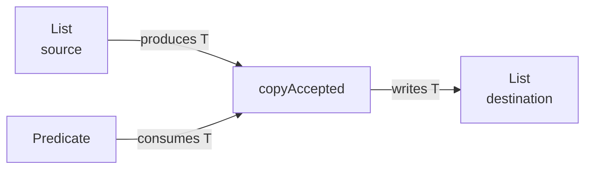

<TLDR>
  <TLDRCell label="what">
    <Term id="wildcard">通配符（wildcard）</Term>是`?`形式的未知类型实参。它让API接收一组相关的参数化类型，同时保留编译期类型检查。
  </TLDRCell>
  <TLDRCell label="trap">
    `List<? extends T>`不等于“可写入任意`T`的列表”，`List<? super T>`读取时也不能假定得到`T`。通配符限制的是当前引用可安全执行的操作。
  </TLDRCell>
  <TLDRCell label="fix">
    参数只生产`T`时用`? extends T`，只消费`T`时用`? super T`。需要在多个位置保留同一个未知类型时，声明命名类型参数`<T>`。
  </TLDRCell>
</TLDR>

## 是什么，为什么存在

Java泛型是不变的（<Term id="invariance">invariance</Term>）。即使`Integer`是`Number`的子类型，`List<Integer>`也不是`List<Number>`的子类型。否则，拿到`List<Number>`引用的代码可以写入`Double`，原来的整数列表便不再安全。

通配符在使用参数化类型的位置表达一个未知类型。`List<?>`表示元素类型未知的列表；`List<? extends Number>`把未知类型的上界限定为`Number`；`List<? super Integer>`则把未知类型的下界限定为`Integer`。这些写法不会改变`List<E>`的声明，只会限定你通过当前引用能做什么。

有界通配符为API提供使用点型变。`List<Integer>`可以赋给`List<? extends Number>`，形成安全的 <Term id="covariance">协变（covariance）</Term>视图；`List<Number>`和`List<Object>`都可以赋给`List<? super Integer>`，形成 <Term id="contravariance">逆变（contravariance）</Term>视图。这里的“视图”是静态类型关系，不是新建的包装对象。

你会在集合复制、排序、回调注册、流式操作和批量写入接口中遇到通配符。它们最适合API边界：实现只关心“能读出哪种类型”或“能写入哪种类型”，并不需要知道精确元素类型。实现若要把同一个未知类型贯穿多个参数或返回值，就应给它命名。

PECS是“Producer Extends, Consumer Super”的缩写。生产者向当前方法提供`T`，所以使用`? extends T`；消费者从当前方法接收`T`，所以使用`? super T`。角色属于某个参数在某个方法中的数据流，不属于集合对象本身。

## 工作原理

编译器把每个通配符看成一个受边界约束但名称未知的类型。它不会猜测运行时元素，也不会通过检查现有内容来放宽写入。安全能力完全来自静态声明。

| 形式 | 可安全读取为 | 可通过该引用新增 | 常见角色 |
| --- | --- | --- | --- |
| `List<T>` | `T` | `T`及其子类型 | 已命名、可双向使用的类型 |
| `List<?>` | `Object` | 只有`null` | 只观察元素类型无关的属性 |
| `List<? extends T>` | `T` | 只有`null` | `T`的生产者 |
| `List<? super T>` | `Object` | `T`及其子类型 | `T`的消费者 |

`? extends T`的实际类型可能是`T`的任一子类型。读取结果至少是`T`，但写入一个普通`T`可能污染更窄的列表。`? super T`的实际类型可能是`T`、某个父类型或`Object`，因此写入`T`安全，读取时却只能依赖共同上界`Object`。

无界通配符`?`可以理解为不关心元素类型的`? extends Object`，但不要把它改写成`Object`。`List<Object>`的元素类型已知为`Object`，可以加入任何引用；`List<?>`的元素类型未知，不能加入任何非`null`引用。

下面的数据流中，源列表和谓词都向方法提供能力，目标列表接收方法产生的值。谓词消费一个`T`，所以它的类型也使用`? super T`。



编译器在调用点为命名类型参数求解约束。对于`copyAccepted(destination, source, predicate)`，一个`T`必须同时满足源可生产、目标可消费、谓词可接收这三项要求。若没有这样的`T`，调用会在编译期失败。

有些安全操作需要先给未知类型一个临时名称。<Term id="wildcard-capture">通配符捕获（wildcard capture）</Term>会为一次表达式中的`?`引入新鲜的内部类型；私有泛型辅助方法可以接收这个捕获类型，并在方法体内一致地读写它。诊断中的`CAP#1`一类名称就是编译器对捕获类型的显示方式。

PECS是签名设计的起点，不是机械替换规则。参数同时生产和消费同一个类型时，`List<T>`往往更准确。返回值需要向调用方保留类型关系时，也应优先返回已命名的类型，而不是把通配符负担推给调用方。

## 示例

下面三个程序依次展示无界观察、完整的PECS数据流和通配符捕获。所有输出都来自本地OpenJDK 21.0.12；代码使用`javac --release 21 -Xlint:all -Werror`编译，并在目标Java 25 LTS上保持有效。

### 观察任意列表

`summarize()`只调用与元素类型无关的`size()`，并把读取结果当作`Object`。它可以接收任何元素类型的列表，却没有理由声明额外的`<T>`。

<Depth level="quick">

```java title="InspectLists.java"
import java.util.ArrayList;
import java.util.List;

public class InspectLists {
    static String summarize(List<?> values) {
        Object first = values.isEmpty() ? "(empty)" : values.getFirst();
        return values.size() + " item(s), first=" + first;
    }

    public static void main(String[] args) {
        List<String> queues = List.of("fast", "bulk");
        List<Integer> attempts = List.of(1, 2, 3);

        System.out.println(summarize(queues));
        System.out.println(summarize(attempts));

        List<Object> mixed = new ArrayList<>(queues);
        mixed.add(3);
        System.out.println(mixed);
    }
}
```

```text
2 item(s), first=fast
3 item(s), first=1
[fast, bulk, 3]
```

</Depth>

前两个调用证明`List<?>`可以统一观察`List<String>`与`List<Integer>`。最后三行改用`List<Object>`，这时元素类型已经确定为`Object`，所以加入`Integer`合法。两个声明看起来都很宽，但写入契约不同。

`summarize()`不会修改列表，却不是因为`List<?>`保证只读。它仍可以调用`clear()`、`remove()`等不要求提供新元素的方法。是否允许修改应由API文档和实际集合实现共同说明。

### 用PECS连接源、目标与谓词

`copyAccepted()`用一个`T`连接三个参数。源生产`T`，目标和谓词消费`T`；调用方因此可以从整数源复制到数值目标，并复用接收任意`Number`的谓词。

```java title="CopyAccepted.java"
import java.util.ArrayList;
import java.util.List;
import java.util.function.Predicate;

public class CopyAccepted {
    static <T> int copyAccepted(
            List<? super T> destination,
            Iterable<? extends T> source,
            Predicate<? super T> accepted) {
        int copied = 0;
        for (T value : source) {
            if (accepted.test(value)) {
                destination.add(value);
                copied++;
            }
        }
        return copied;
    }

    public static void main(String[] args) {
        List<Integer> readings = List.of(1, 3, 5, 2);
        List<Number> report = new ArrayList<>(List.of(1.5));
        Predicate<Number> atLeastThree = value -> value.doubleValue() >= 3;

        int copied = copyAccepted(report, readings, atLeastThree);
        System.out.println("copied=" + copied);
        System.out.println(report);
    }
}
```

```text
copied=2
[1.5, 3, 5]
```

<TryToBreak items={['空源列表', '包含null的源列表', '不可修改的目标列表']} />

循环中的`value`可以声明为`T`，因为`source`的未知元素类型一定是`T`的子类型。`destination.add(value)`合法，因为目标的未知元素类型一定是`T`或其父类型。整个过程不需要转换，也没有原始类型警告。

这个签名没有承诺目标可修改，也没有定义`null`策略。传入`List.of()`作为目标会在第一次写入时抛出`UnsupportedOperationException`；包含`null`的源是否可接受，则由谓词与方法契约决定。泛型只证明类型关系，不证明容器能力或业务有效性。

### 捕获一个未知类型

公开方法只需要表达“任意元素类型的列表”。辅助方法为这一个未知类型命名，因而可以把刚读出的元素写回同一个列表。

```java title="CaptureSwap.java"
import java.util.ArrayList;
import java.util.List;

public class CaptureSwap {
    static void swapFirstTwo(List<?> values) {
        if (values.size() < 2) {
            throw new IllegalArgumentException("at least two values required");
        }
        swap(values, 0, 1);
    }

    private static <T> void swap(List<T> values, int left, int right) {
        T saved = values.get(left);
        values.set(left, values.get(right));
        values.set(right, saved);
    }

    public static void main(String[] args) {
        List<String> stages = new ArrayList<>(
                List.of("validate", "publish", "notify"));
        swapFirstTwo(stages);
        System.out.println(stages);
    }
}
```

```text
[publish, validate, notify]
```

`swap()`中的`T`不是调用方必须写出的公共类型参数。编译器把`List<?>`的捕获类型用于这一次辅助调用，于是三次列表操作共享同一个类型。标准库的`Collections.swap(List<?>, int, int)`也向调用方提供这种简洁接口。

捕获只能证明从同一个未知列表读出再写回是安全的。两个`List<?>`参数各自获得不同捕获类型，即使它们的上界相同，也不能把一个列表的元素随意写入另一个列表。需要跨列表传递时，应在公开签名中明确建立关系。

## 陷阱

### 按集合名称选择边界

> [!PITFALL]
> 把某个列表永久称为“producer”或“consumer”，会在方法改变数据流时选错边界。同一个`List<Number>`在汇总方法中可以生产数值，在填充方法中又可以消费整数。

**修复方法：** 站在当前方法的角度逐个标注参数。方法从参数读取`T`，它就是`? extends T`候选；方法向参数写入`T`，它就是`? super T`候选；两者都需要时，先考虑`List<T>`。

### 反转`extends`与`super`

> [!PITFALL]
> 生成的复制方法常把目标写成`List<? extends T>`，把源写成`List<? super T>`。结果是目标不能接收`T`，从源读出时也只能得到`Object`，两端都失去所需能力。

**修复方法：** 从方法体中的实际操作反推签名。对每个`get()`写出所需的静态结果类型，对每个`add()`写出要传入的类型，然后用一个命名`T`连接源与目标。

### 把上界视为不可变保证

> [!PITFALL]
> `List<? extends Number>`阻止通过该引用加入非`null`元素，却不会让底层列表不可变。`clear()`、按索引删除、迭代器删除和某些重排操作仍可能成功。

**修复方法：** 需要不可修改契约时，使用不可修改集合或防御性副本，并在API中写清所有权。通配符负责元素类型安全，不负责别名、线程安全或修改权限。

### 假定两个捕获类型相同

> [!PITFALL]
> `List<? extends Number>`的两个参数可能分别指向`List<Integer>`和`List<Double>`。它们都能读取为`Number`，不代表元素可以在两者之间交换；辅助方法也不能凭空证明两个未知类型相同。

**修复方法：** 如果两个列表必须具有同一元素类型，用`<T> void swapFirst(List<T> left, List<T> right)`表达。若数据只单向移动，则用`List<? extends T>`和`List<? super T>`表达允许的方向。

### 在返回类型中泄漏未知类型

> [!PITFALL]
> 返回`List<? extends Number>`会让调用方只能获得一个上界视图，常迫使后续代码继续传播通配符或添加转换。返回类型看似灵活，实际可能丢失实现本来能够承诺的关系。

**修复方法：** 能承诺`List<Number>`时直接返回它；返回类型与输入相关时声明`<T>`并返回`List<T>`。只有抽象本身确实隐藏某个固定但未知的子类型时，才把通配符作为公开结果的一部分。

### 用原始类型绕过捕获错误

> [!PITFALL]
> 模型看到`CAP#1`诊断后，可能把参数改成原始`List`，加入`(T)`转换，再用`@SuppressWarnings("unchecked")`静音。这样只会把编译期关系错误推迟成远处的`ClassCastException`。

**修复方法：** 使用`javac -Xlint:all -Werror`保留证据。先判断操作是否只是同一列表的读回写；若是，使用最小的捕获辅助方法。若要连接多个位置，就在公开签名中声明真实关系，而不是压制警告。

<Depth level="deep">

## 边界、包含关系与捕获

### 未知类型不是任意类型

`List<?>`中的问号表示某一个确定但未知的元素类型，而不是每次操作都可以任选类型。一个对象可能实际是`List<String>`，也可能是`List<Integer>`；编译器只允许对所有可能类型都安全的操作。这种思路比“`?`就是`Object`”更能准确预测结果。

`List<? extends Number>`同样表示某一个未知类型，只是该类型必须是`Number`的子类型。读取为`Number`对所有候选都安全；写入`Integer`并非如此，因为实际候选可能是`Double`。边界约束候选集合，却没有把未知类型替换成边界本身。

下界的方向更容易误读。`List<? super Integer>`的实际元素类型可以是`Integer`、`Number`或`Object`。`Integer`能赋给每个候选类型，所以可以写入；读取结果若只依赖静态声明，则必须退回这些候选的共同父类型`Object`。

Java语言规范用通配符包含关系描述这些赋值。例如，`? extends Integer`被`? extends Number`包含，而`? super Number`被`? super Integer`包含。日常API设计通常不需要手算完整规则，但需要记住上下界在子类型方向上的差异。

### `null`与结构修改

`null`可以转换为任何引用类型，因此从纯类型系统角度，它可以加入`List<?>`、`List<? extends T>`和`List<? super T>`。这只是类型许可，不是设计建议。若集合不接受`null`，实现仍可在运行时拒绝它；业务代码也不应靠写入`null`来验证通配符能力。

上界视图常被简称为“只读”，但这个简称只描述不能加入普通元素。调用`clear()`不需要知道元素类型，`remove(Object)`的参数也不是列表的`E`，因此这些方法可以通过上界视图调用。底层实现是否支持操作则是另一项运行时契约。

不可修改与类型未知是两个正交属性。`List<Integer>`可以不可修改，`List<? extends Number>`也可以指向可修改的`ArrayList<Integer>`。审查API时要分别检查元素类型能力、修改能力和别名所有权。

### 每个表达式都有自己的捕获

捕获转换为通配符创建新鲜类型变量，并从通配符与泛型声明推导上下界。对`List<?>`而言，新类型的上界通常来自`List<E>`中`E`的声明边界；对`List<? extends Number>`而言，上界还受`Number`限制。

捕获发生在表达式层面，因此两个独立通配符不能仅凭相同拼写视为相同类型。`left.get(0)`的结果属于`CAP#1`，`right.set(0, ...)`可能要求`CAP#2`。两者都有`Number`上界，只能说明都可读取为`Number`，不能证明它们相互可写。

辅助方法适用于一个安全关系已经存在、只是匿名类型需要名称的情况。把同一列表读出的值写回同一列表是安全关系；把一个未知列表的值放进另一个未知列表不是。若辅助方法必须使用转换才能通过，通常说明公开签名缺少真实约束，或者操作本身不安全。

### 诊断`CAP#1`

不同`javac`版本可能以略有差异的文字展示捕获错误，但核心信息相同：某个位置需要新鲜捕获类型，现有表达式只能提供其上界或另一个捕获。不要把`CAP#1`当成可以在源码中声明的类名。

定位错误时，先把长表达式拆成带显式静态类型的局部变量。接着标出每个问号来源，再比较报错位置要求的类型与实际提供的类型。这个过程通常能区分三种情况：缺少辅助捕获、两个参数缺少命名关系，或程序试图执行本来就不安全的写入。

捕获方法应保持私有且很小。它的价值是让编译器给一个已有未知类型命名，不是向调用方增加新的抽象。若类型参数本来就属于公共契约，直接把`<T>`放到公开方法上会更清楚。

## 从数据流推导API

### 先写能力，再写语法

设计签名前，先用普通语言写出方法需要的能力。例如：“从source读取`T`”“把`T`写入destination”“用matcher检查`T`”“返回复制数量”。再把这些能力分别映射为`? extends T`、`? super T`、`Predicate<? super T>`和`int`。

这种顺序可以防止把类名误当成角色。`Consumer<T>`接口对象在某个高阶方法里可能被读取出来并存入另一个容器；此时外层容器的型变仍由外层数据流决定。PECS每次只分析一个类型位置相对于当前操作的方向。

| 需求 | 签名片段 | 保留的关系 |
| --- | --- | --- |
| 观察任意列表 | `List<?> values` | 元素类型与方法无关 |
| 从一组子类型读取 | `Iterable<? extends T> source` | 每个元素可作为`T` |
| 向父类型容器写入 | `Collection<? super T> target` | 每个`T`可安全加入 |
| 用父类型逻辑检查值 | `Predicate<? super T> test` | 既有父类型谓词可复用 |
| 在输入与输出间保留类型 | `<T> T choose(T left, T right)` | 调用方得到同一个推断`T` |

命名类型参数并不要求两个实参具有相同运行时类。它要求编译器能推断一个同时满足所有位置约束的`T`。例如，一个方法的两个`T`参数可以接收不同具体子类，只要调用上下文允许把`T`推断为共同父类型。

反过来，只有一个位置使用的`<T>`常常没有提供关系。`<T> int size(List<T> values)`的`T`既不影响返回值，也不连接其他参数，通常可简化成`int size(List<?> values)`。但“只出现一次”是检查提示，不是绝对规则；边界可能仍让实现获得必要成员。

### 双向参数需要命名类型

参数若既读取又写回同一元素类型，`List<T>`会同时授予两项能力。强行写成`List<? extends T>`会丢失写入，写成`List<? super T>`会丢失精确读取。使用两个相反通配符也不能让同一个参数在方法体中自动恢复完整类型。

典型例子包括就地规范化、替换元素和基于现值更新。公开方法写成`<T> void replaceAll(List<T> values, UnaryOperator<T> update)`，会明确说明更新函数与列表共享一个元素类型。若更新函数可以接收父类型或返回子类型，还可以在更精确的业务契约下分别放宽嵌套位置。

不要为了避免`<T>`而返回`Object`。类型参数的价值正是把输入信息带到返回位置。通配符适合隐藏调用方不需要命名的类型；一旦调用方需要继续使用该关系，隐藏就变成信息损失。

### 嵌套位置也遵守PECS

标准库签名经常在函数式接口内部使用边界。`Predicate<? super T>`能复用针对`T`父类型编写的检查器，因为谓词消费`T`。`Supplier<? extends T>`则能提供任意`T`子类型，因为供应器生产`T`。

`Comparator<? super T>`允许`T`继承或复用针对父类型定义的比较规则。类似地，`<T extends Comparable<? super T>>`表示`T`必须能与自身比较，但这个能力可以在某个父类型上声明。这里内层的`super`描述`compareTo()`的参数方向。

`Function<? super T, ? extends R>`同时展示输入逆变与输出协变：函数可以接收`T`的父类型，并返回`R`的子类型。读这类签名时，从最内层操作开始，分别标出每个类型实参是被函数接收还是由函数返回，再向外检查容器角色。

边界越多不代表API越好。每个通配符都应对应一个真实可用场景与一项可说明的能力。若调用方从不需要父类型谓词或子类型供应器，简单签名可能更易读，也会产生更清楚的推断错误。

## 推断、返回值与演进

### 调用点约束

方法调用类型推断会综合实参类型、目标类型和声明边界。PECS签名允许编译器寻找一个中间`T`：源元素可转换为它，目标能接收它，函数参数也兼容它。错误信息只显示某一组失败约束时，不代表其他参数没有参与推断。

复杂链式调用失败时，先给源、目标和函数对象声明有意义的局部静态类型。这样可以看到究竟是源过宽、目标过窄，还是lambda的目标类型不符合预期。直接加转换往往会删除诊断信息，并把不一致留到运行时。

显式类型实参可以帮助定位问题，例如`Utility.<Integer>copyAccepted(...)`。它把待求解变量固定下来，使剩余冲突更清楚；但它不能让不安全调用变安全。若显式`T`只能配合未检查转换工作，应回到数据流契约重新设计。

### 返回类型的所有权

参数通配符常让调用方更自由，返回通配符却常让调用方更受限。`List<? extends Number>`隐藏了元素的精确类型，调用方不能安全加入普通`Number`，也无法把结果赋给`List<Number>`。这种限制必须来自真实抽象，而不能只是实现暂时选择了某个子类型。

工厂若始终交付数值列表，可以构造并返回`List<Number>`。方法若按调用方提供的类型生产结果，可以声明`<T> List<T>`并把关系保留下来。若API有意表示“同一对象族中的某个固定但未知成员”，通配符返回才可能准确，但文档仍应说明调用方能做什么。

字段中的通配符也常暴露相同问题。对象通常需要在多个方法间维护稳定元素类型，而`List<?>`字段让实现自己也无法给它命名。类型属于对象不变量时，把类型参数提升到类声明往往比存一个未知列表更合适。

### 发布后的签名变化

把`List<T>`参数放宽成`List<? extends T>`可能让更多源调用通过，却会删除实现原有的写入能力。把它改成`List<? super T>`则改变读取能力。签名看似只增加问号，方法体和调用方的静态契约都可能发生变化。

擦除后的JVM描述符可能保持不变，但源码兼容性、重载选择、桥接方法和反射看到的泛型签名仍可能受影响。发布库需要分别测试旧二进制调用方、重新编译的源码调用方和读取泛型元数据的工具。仅在当前模块重新编译通过不能证明演进安全。

设计审查还应覆盖推断失败的可读性。一个极度宽泛的签名可能接受更多调用，却让错误出现为很长的上下界冲突。若新增灵活性没有实际调用场景，较窄但清晰的契约通常更容易维护。

## 运行时边界与测试

### 通配符在编译期工作

通配符与大多数泛型信息一样主要参与编译期检查。普通`ArrayList<Integer>`对象不会在运行时变成单独的`ArrayList<? extends Number>`类。赋给通配符引用不会创建包装器，也不会扫描集合内容。

类型擦除不意味着转换一定安全。原始类型或未检查转换可以让不兼容对象进入集合，稍后的编译器插入转换才抛出`ClassCastException`。通配符的价值正是让合法灵活性保留在可检查的静态关系内。

运行时若确实需要具体类型，应把类型令牌或验证器作为显式参数，例如`Class<T>`、解析函数或领域校验器。不能从`List<?>`的问号恢复已经擦除的元素类型，也不能通过检查第一个元素证明整个列表类型。

### 测试调用矩阵

只用`List<Integer>`调用一次，无法证明边界方向正确。生产者参数至少应尝试元素类型为`T`与`T`子类型的输入；消费者参数应尝试`T`、父类型和`Object`目标。还要保留一两个应当编译失败的调用，作为编译测试验证拒绝边界。

运行测试覆盖泛型系统不处理的契约：空集合、`null`、不可修改实现、固定大小列表、别名以及谓词异常。对于修改方法，调用前后同时检查源与目标，避免排序、删除或清空源集合这样的意外副作用。

编译测试应启用全部警告并把警告当作失败。新增原始类型、未检查转换或过宽的警告抑制，通常意味着生成代码绕过了本应由签名表达的关系。例外必须有局部、可复核的安全不变量。

### 一套修复顺序

遇到难读的泛型错误时，可以按以下顺序缩小问题：

1. 标出每个参数相对于当前方法是生产、消费还是双向使用。
2. 给长表达式增加局部静态类型，找到第一组冲突约束。
3. 检查多个位置是否需要共享一个命名`T`，不要假定独立通配符相同。
4. 只在同一未知类型需要读回写时引入私有捕获辅助方法。
5. 最后才考虑显式类型实参；没有可陈述安全不变量时，不添加转换或警告抑制。

这个顺序保留编译器提供的证据。大多数问题最终会落在三类之一：边界方向反了、签名遗漏了真实类型关系，或调用方要求了类型系统不能安全保证的操作。先确定属于哪一类，再改语法。

</Depth>

<Checkpoint id="java/wildcards-pecs" />

## 延伸阅读

- [Java语言规范25：类型实参与通配符](https://docs.oracle.com/javase/specs/jls/se25/html/jls-4.html#jls-4.5.1)
- [Java语言规范25：捕获转换](https://docs.oracle.com/javase/specs/jls/se25/html/jls-5.html#jls-5.1.10)
- [Java语言规范25：方法调用类型推断](https://docs.oracle.com/javase/specs/jls/se25/html/jls-18.html#jls-18.5.2)
- [Java SE 25 API：`Collections.copy()`](https://docs.oracle.com/en/java/javase/25/docs/api/java.base/java/util/Collections.html#copy(java.util.List,java.util.List))
- [Dev.java：通配符](https://dev.java/learn/generics/wildcards/)
