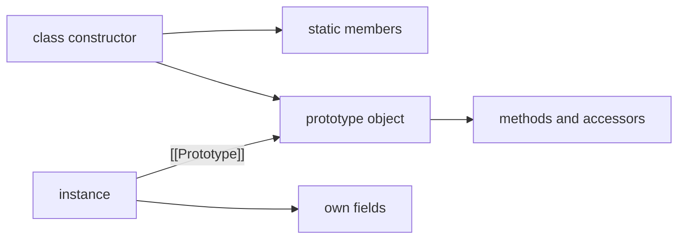

<TLDR>
  <TLDRCell label="what">
    `class` puts instance initialization, shared methods, fields, and inheritance in one definition. Public methods are still found through prototypes.
  </TLDRCell>
  <TLDRCell label="trap">
    Methods aren't bound to instances, and derived fields aren't initialized until `super()` returns. Either rule can break code that looks reasonable.
  </TLDRCell>
  <TLDRCell label="fix">
    Distinguish own fields, prototype methods, static members, and private fields, then test detached methods, inheritance, and initialization order.
  </TLDRCell>
</TLDR>

## What it is and why it exists

A JavaScript class defines a constructor and its related members. `new Report()` creates an instance and runs `constructor`; ordinary methods in the class body live on `Report.prototype` and are shared by instances. Public methods are still inherited through a <Term id="prototype-chain">prototype chain</Term>, so classes don't replace JavaScript's object model.

Class syntax solves an organization problem. Construction, instance behavior, static factories, and inheritance are readable in one place, while `#` names provide language-enforced private state. The syntax also imposes stricter rules than a hand-written constructor function: class bodies always use strict mode, and a class can't be called without `new`.

A class usually fits when a family of objects shares behavior and each object has invariants or a lifecycle to maintain. Plain functions and object literals are often more direct for data transformations or a single operation. A closure can be smaller when there is one behavior carrying a little state. Using a class doesn't require using inheritance; many useful classes only encapsulate one kind of object.

## How it works

### Constructors and prototypes

When `new InventoryItem('Cable', 5)` runs, the runtime creates an object, links its prototype to `InventoryItem.prototype`, and runs the construction logic with that object as `this`. The expression normally evaluates to the new object. An explicit object return from `constructor` changes that rule, so ordinary application classes rarely return a value from `constructor`.

A class declaration creates a lexical binding, but that binding is in the temporal dead zone until execution reaches the declaration. It doesn't behave like a function declaration that can be called early. Once the definition finishes, `typeof InventoryItem` is `'function'`, but calling `InventoryItem()` directly throws `TypeError`.

### Instance, static, and private members

A public instance field is an own property initialized separately for every instance. An ordinary instance method is a non-enumerable property on the prototype, so instances normally refer to one shared function. `get` and `set` accessors also live on the prototype and run code when the property is read or written.

`static` fields and methods belong to the class constructor itself, not its instances. They work well for named constructors, parsers, and state associated with all instances. A static initialization block runs while the class definition is evaluated and suits initialization that needs several statements without leaking temporary variables.

A <Term id="private-field">private field</Term> beginning with `#` isn't an ordinary string-keyed property. Only the class body that declares the name can access it, and `Object.keys()`, object spread, and `Object.assign()` don't copy it. The runtime also checks whether the receiver carries that class's private brand; a public property with the same spelling can't fake the brand.

### `extends`, `super`, and receivers

`class UsagePlan extends Plan` defines a <Term id="derived-class">derived class</Term>. Its instance prototype chain leads from `UsagePlan.prototype` to `Plan.prototype`, and the class constructor itself inherits public static members from the base class. An instance of `UsagePlan` can therefore satisfy `instanceof Plan`.

A derived constructor must call `super()` before it reads `this`. That call lets the base class initialize the same instance. Derived instance fields are initialized when it returns, and the rest of the derived constructor then runs. `super.method()` starts method lookup at the parent prototype, but the call's receiver remains the current `this`.

A method's `this` comes from the call form; its class doesn't bind it permanently. `formatter.format(12)` has `formatter` as its receiver, while `const format = formatter.format; format(12)` doesn't. Strict mode in a class body won't substitute the global object for a missing receiver.

### Four member locations

One class definition puts members in several places. This diagram shows the property relationships for public members; ordinary property edges can't represent private slots.



- The `InventoryItem` constructor owns public static fields and methods.
- `InventoryItem.prototype` owns ordinary methods and accessors.
- Each instance owns public instance fields and runtime-installed private instance slots.
- Static private slots are installed on the declaring class but aren't enumerable properties.

This distinction controls copying, serialization, and inheritance. Object spread reads only enumerable own string and Symbol keys; it doesn't carry prototype methods or private state. A subclass inherits public behavior through two prototype chains, but ordinary reflection can't reach the base class's private slots.

### Keeping the public surface narrow

A constructor should establish the minimum invariants needed for a valid object, while public methods perform legal state changes. Don't generate a getter and setter for every field by habit; an accessor protects no invariant if it accepts and returns every value unchanged. Static factories can name different input forms, but they should converge on the same validation logic.

Inheritance fits only when the public contracts have a real substitution relationship. If two objects merely reuse an algorithm, passing a function or collaborator into the class is usually clearer than adding a base class. It also avoids hidden dependencies on derived fields, initialization order, and overrides.

## Examples

These three examples add instance state, inheritance, and a callback boundary in that order. Their output came from Node 24.14.0 rather than a hand-written prediction.

### Encapsulating inventory state

The first class puts a public field, a private field, prototype methods, an accessor, and a static factory together. `#stock` can change only through operations supplied by the class, which keeps the validation entry points easy to find.

<Depth level="quick">

```javascript run title="inventory_item.js"
class InventoryItem {
  static #nextId = 1;
  category = 'general';
  #stock;
  constructor(name, stock) {
    if (!Number.isInteger(stock) || stock < 0) {
      throw new RangeError('stock must be a non-negative integer');
    }
    this.id = InventoryItem.#nextId++;
    this.name = name;
    this.#stock = stock;
  }

  get stock() {
    return this.#stock;
  }

  sell(quantity) {
    if (!Number.isInteger(quantity) || quantity <= 0 || quantity > this.#stock) {
      throw new RangeError('invalid quantity');
    }
    this.#stock -= quantity;
    return `${quantity} sold`;
  }

  label() {
    return `#${this.id} ${this.name}: ${this.#stock} in stock`;
  }

  static fromRecord(record) {
    return new InventoryItem(record.name, record.stock);
  }
}

const cable = new InventoryItem('USB-C cable', 5);
const adapter = InventoryItem.fromRecord({ name: 'Travel adapter', stock: 2 });

console.log(cable.label());
console.log(cable.sell(2), cable.stock);
console.log(Object.hasOwn(cable, 'sell'), cable.sell === adapter.sell);
```

```text
#1 USB-C cable: 5 in stock
2 sold 3
false true
```

</Depth>

The last line first shows that `sell` isn't an own property of `cable`, then shows that both instances obtain the same prototype method. In contrast, `id`, `name`, `category`, and `#stock` are initialized per instance. The class owns the private static counter, so both construction paths still use one ID sequence.

`fromRecord` is a named constructor: it translates an external record into the parameters expected by the regular constructor. However many entry points are added, stock validation stays in one `constructor`.

### Extending a pricing rule

The derived class reuses the base name and monthly price, then overrides `cost()`. `super.cost()` invokes the base implementation, but its `this` still points to `plan`.

```javascript run title="usage_plan.js"
class Plan {
  constructor(name, monthlyPrice) {
    this.name = name;
    this.monthlyPrice = monthlyPrice;
  }

  cost() {
    return this.monthlyPrice;
  }

  describe() {
    return `${this.name}: ${this.monthlyPrice} credits/month`;
  }
}

class UsagePlan extends Plan {
  #includedUnits;

  constructor(name, monthlyPrice, includedUnits, extraUnitPrice) {
    super(name, monthlyPrice);
    this.#includedUnits = includedUnits;
    this.extraUnitPrice = extraUnitPrice;
  }

  cost(units = 0) {
    const extraUnits = Math.max(0, units - this.#includedUnits);
    return super.cost() + extraUnits * this.extraUnitPrice;
  }

  describe() {
    return `${super.describe()}, ${this.#includedUnits} units included`;
  }
}

const plan = new UsagePlan('Team', 20, 5, 2);

console.log(plan.describe());
console.log(plan.cost(4));
console.log(plan.cost(8));
console.log(plan instanceof Plan, Object.getPrototypeOf(UsagePlan.prototype) === Plan.prototype);
```

```text
Team: 20 credits/month, 5 units included
20
26
true true
```

`cost(4)` stays within the allowance and returns only the base monthly cost; `cost(8)` charges for three extra units. The last line checks both the semantic inheritance test and the actual prototype link. Inheritance has a clear substitution relationship here: code that depends only on `Plan`'s public interface can accept a `UsagePlan`.

### Passing a method to a callback

A prototype method passed as a plain value doesn't carry its instance with it. This example shows the failure, then compares `bind()` with an arrow-function field.

```javascript run title="method_receiver.js"
class CurrencyFormatter {
  constructor(currency) {
    this.currency = currency;
  }

  format(amount) {
    return `${this.currency} ${amount.toFixed(2)}`;
  }
}

const formatter = new CurrencyFormatter('USD');

try {
  const detachedFormat = formatter.format;
  detachedFormat(12);
} catch (error) {
  console.log(error.name);
}

const boundFormat = formatter.format.bind(formatter);
console.log([12, 19.5].map(boundFormat).join(', '));

class ArrowFormatter {
  constructor(currency) {
    this.currency = currency;
  }

  format = (amount) => `${this.currency} ${amount.toFixed(2)}`;
}

const arrowFormatter = new ArrowFormatter('EUR');
console.log([3, 4.5].map(arrowFormatter.format).join(', '));
```

```text
TypeError
USD 12.00, USD 19.50
EUR 3.00, EUR 4.50
```

`bind()` returns a new function with a fixed receiver, which is useful once at callback registration. An arrow-function field captures the construction-time `this`, so it can also be passed directly, but every instance creates its own function. An ordinary prototype method shares one function and is clearer when the caller can preserve the receiver.

## Pitfalls

### Accessing a class before its declaration

> [!PITFALL]
> Using a class declaration early as if it were a function declaration throws `ReferenceError`. The class binding exists, but it isn't initialized until execution reaches the declaration.

**Fix:** Define the class before constructing its first instance. If this still fails across modules, inspect circular imports and top-level initialization order instead of moving declarations around until the symptom disappears.

### Detaching a method from its instance

> [!PITFALL]
> `map(service.transform)`, event handlers, and destructuring can separate a method from its receiver. If the method reads a public or private field, it then fails because `this` is `undefined` or has the wrong private brand.

**Fix:** At the boundary, use `value => service.transform(value)` or a one-time `service.transform.bind(service)`. Make it an arrow-function field only when the method genuinely needs stable callback identity, and accept that each instance will own a separate function.

### Calling overridable methods in a base constructor

> [!PITFALL]
> `this.configure()` in a base constructor can dispatch to an override in the derived class. Derived fields haven't been initialized yet, so the override may read `undefined` or throw.

**Fix:** Let a constructor establish only its own layer's invariants; don't call overridable methods there. If initialization needs several phases, call an explicit method after construction or use a static factory that creates and initializes in a fixed order.

### Inheriting static private state

> [!PITFALL]
> `this.#counter` inside a base static method can throw `TypeError` when the method is called through a subclass. A static private field's brand belongs to its declaring class and isn't installed on subclasses like a public static property.

**Fix:** Write `BaseClass.#counter` when the base class owns one shared counter. If each subclass needs separate state, use explicit storage keyed by the constructor and test calls through both the base class and a subclass.

### Mistaking a shallow copy for encapsulation

> [!PITFALL]
> `get items() { return [...this.#items]; }` copies only the outer array. A caller can still mutate the record objects inside it, and the private field will observe those changes.

**Fix:** Return a read-only projection or copy the necessary fields of each record. Use `structuredClone()` only when the contract truly requires independent structured data; don't blindly clone functions, DOM nodes, or instances with custom prototypes.

## In the AI era

**What generated code gets wrong here**

Models often import rules from Java, C#, or TypeScript that don't exist in plain JavaScript, such as overloaded `constructor` methods or bare `protected` and `abstract` declarations. The quieter failures are detached callbacks, base constructors calling overrides, `this.#field` in inheritable static methods, and one-level spreads presented as isolation for private object graphs. Some versions won't parse; others fail only when a subclass or real nested data reaches them.

**Ask your AI to check**

- List where every member is stored: an instance own property, a prototype, the class constructor, or a private slot, and verify public members with property descriptors.
- Trace construction of a derived instance, marking `super()`, the base constructor, base fields, derived fields, and the first call to any overridden method.
- Invoke each method both as `object.method()` and as a detached callback; also invoke static methods that touch private fields through a subclass.

**Review checklist**

- Confirm every derived constructor calls `super()` before reading `this`, and no base constructor dispatches to a method that depends on derived fields.
- Check whether methods passed to `map`, event systems, timers, or destructuring keep the intended receiver and a stable identity for removal.
- Check returns, object spreads, and serialization boundaries for nested mutable objects or secrets leaked from private state.

**Prompt vocabulary**

Use precise terms: `prototype chain`, `own property`, `instance field`, `private field brand check`, `derived constructor`, `method receiver`, and `static initialization block`. Ask for a member-storage map and a construction timeline. "Make this object-oriented" is too vague to expose these choices.

<Depth level="deep">

## Prototype storage and initialization order

A `class` sets up two related objects: its name refers to the constructor function, and instance methods are written to that function's `prototype` object. Public fields aren't preloaded with instance values on either object; they are defined while each instance is constructed. Private fields use internal slots and brands that property descriptors can't enumerate.

### Inspecting member locations

This check separates a field, a method, and a static field. It uses standard reflection APIs and doesn't read engine internals.

```javascript run title="prototype_inspection.js"
class Ticket {
  status = 'open';

  close() {
    this.status = 'closed';
  }

  static category = 'support';
}

const ticket = new Ticket();
const closeDescriptor = Object.getOwnPropertyDescriptor(Ticket.prototype, 'close');

console.log(typeof Ticket);
console.log(Object.hasOwn(ticket, 'status'), Object.hasOwn(ticket, 'close'));
console.log(Object.getPrototypeOf(ticket) === Ticket.prototype);
console.log(closeDescriptor.enumerable, typeof closeDescriptor.value);
console.log(Object.hasOwn(Ticket, 'category'));
```

```text
function
true false
true
false function
true
```

`status` is an own property of the instance, `close` is a non-enumerable method on the prototype, and `category` is an own property of the constructor. The `'function'` result shows that a class is still a constructable function object, but the initialization and private-field semantics attached to class syntax aren't reducible to a few prototype assignments.

### Consequences of private brands

A private name is fixed when the class is defined; it isn't a property key assembled at runtime. `object['#stock']` reads a public string-keyed property that happens to be named `#stock`, not the `#stock` declared in the class. A subclass can't name a base class's private element directly either; it must use the base class's public or otherwise controlled methods.

Brand checks use the actual receiver, so lending a private-field-reading method to an ordinary object throws `TypeError`. Even a proxy around the original instance normally lacks the target object's private brand. If class instances must be proxied, bind methods deliberately or design a boundary that doesn't assume private access transparently forwards.

### Four stages of derived-instance construction

Construction of a derived instance follows this relevant order:

1. Base instance fields initialize in source order as the base construction logic begins.
2. The base constructor body runs; method lookup can already find overrides on the derived prototype.
3. Derived instance fields initialize in source order as `super()` returns to the derived constructor.
4. The rest of the derived constructor body runs after `super()`.

This order explains why a base constructor shouldn't call overridable methods. Dynamic dispatch is already active, but derived fields don't exist yet. Field initializers also evaluate in source order, so a later field can read an earlier field; the reverse observes state that hasn't been initialized.

### Work done at class definition time

Computed property names are evaluated with the class definition, not every time an instance is made. Static fields and static initialization blocks also run then in source order; instance field initializers wait for construction. Merely importing a module can therefore trigger a static block, so it shouldn't quietly open network connections or start process-wide resources that can't be released.

Class bodies always use strict mode, and methods are non-enumerable by default. Accessors, generator methods, and async methods likewise live on the prototype or constructor according to whether they use `static`. To verify generated code, `Object.hasOwn()`, `Object.getPrototypeOf()`, and property descriptors are usually more reliable than guessing how the syntax "transpiles" into older code.

A class expression follows the same member and initialization rules. A named class expression keeps its inner name scoped to the class body, which can help a method refer to the exact declaring class without adding another outer binding.

When no constructor is written, a base class gets an empty default constructor. A derived class gets the equivalent of `constructor(...args) { super(...args); }`, so it forwards all arguments to its base rather than ignoring them.

</Depth>

<Checkpoint id="javascript/classes" />

## Further reading

- [MDN: Classes](https://developer.mozilla.org/en-US/docs/Web/JavaScript/Reference/Classes)
- [MDN: Public class fields](https://developer.mozilla.org/en-US/docs/Web/JavaScript/Reference/Classes/Public_class_fields)
- [MDN: Private elements](https://developer.mozilla.org/en-US/docs/Web/JavaScript/Reference/Classes/Private_elements)
- [MDN: `super`](https://developer.mozilla.org/en-US/docs/Web/JavaScript/Reference/Operators/super)
- [MDN: `extends`](https://developer.mozilla.org/en-US/docs/Web/JavaScript/Reference/Operators/extends)
