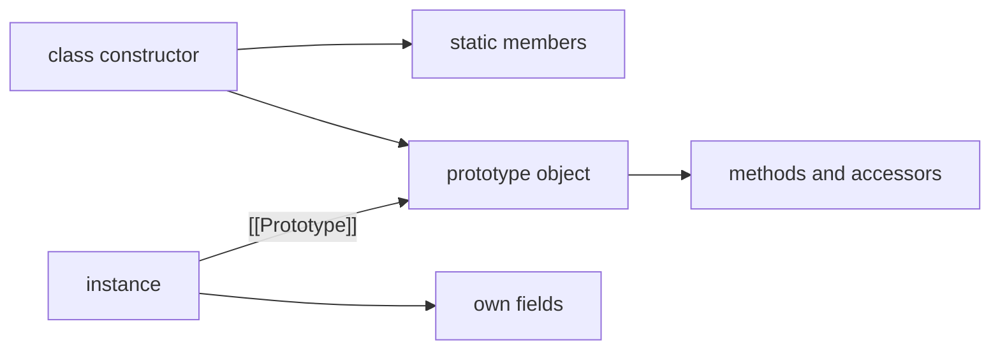

<TLDR>
  <TLDRCell label="what">
    `class` 把实例初始化、共享方法、字段和继承关系写在一个定义中；公开方法仍通过原型查找。
  </TLDRCell>
  <TLDRCell label="trap">
    方法不会自动绑定实例，派生类字段也要等 `super()` 返回后才初始化；这两条规则会让看似合理的代码在运行时失败。
  </TLDRCell>
  <TLDRCell label="fix">
    明确区分实例自有字段、原型方法、静态成员与私有字段，并测试方法脱离接收者、继承和初始化顺序。
  </TLDRCell>
</TLDR>

## 是什么，为什么存在

JavaScript 的类（class）是一种定义构造函数及其相关成员的语法。`new Report()` 创建实例并运行 `constructor`；类体中的普通方法放在 `Report.prototype` 上，由实例共享。公开方法的继承仍沿着<Term id="prototype-chain">原型链（prototype chain）</Term>完成，因此类没有取代 JavaScript 的对象模型。

类语法解决的是组织问题。构造、实例行为、静态工厂和继承关系可以在同一处阅读，`#` 名称还提供语言强制的私有状态。它也建立了比手写构造函数更严格的规则，例如类体始终使用严格模式，类不能省略 `new` 直接调用。

当一批对象共享行为，并且每个对象都有需要维护的不变量或生命周期时，类通常合适。只有数据转换或单个操作时，普通函数和对象字面量往往更直接；只有一种行为但需要携带少量状态时，闭包也可能更小。类并不要求使用继承，许多类只负责封装一种对象。

## 工作原理

### 构造函数与原型

执行 `new InventoryItem('Cable', 5)` 时，运行时创建一个新对象，把它的原型连接到 `InventoryItem.prototype`，再以这个对象作为 `this` 调用构造逻辑。正常返回后，表达式得到该对象。构造函数显式返回另一个对象时规则会变化，因此普通业务类通常不从 `constructor` 返回值。

类声明会建立词法绑定，但在执行到声明之前，该绑定处于暂时性死区。它不是可以提前调用的函数声明。类定义完成后，`typeof InventoryItem` 是 `'function'`，但直接执行 `InventoryItem()` 会抛出 `TypeError`。

### 实例、静态与私有成员

公开实例字段是实例的自有属性，每次构造都会初始化一份。普通实例方法则是原型上的不可枚举属性，所有实例通常引用同一个函数。访问器 `get` 和 `set` 也位于原型上，并在属性读写时运行代码。

`static` 字段和方法属于类构造函数本身，不属于实例。它们适合命名构造器、解析器和与所有实例相关的状态。静态初始化块在类定义求值时执行，适合需要多条语句、同时又不应泄漏临时变量的初始化逻辑。

以 `#` 开头的<Term id="private-field">私有字段（private field）</Term>不是普通字符串属性。只有声明该名称的类体才能访问它，`Object.keys()`、对象展开和 `Object.assign()` 都不会复制它。运行时还会检查接收者是否带有对应类的私有标记；同名的公开属性无法伪造这个标记。

### `extends`、`super` 与接收者

`class UsagePlan extends Plan` 定义了一个<Term id="derived-class">派生类（derived class）</Term>。实例的原型链从 `UsagePlan.prototype` 指向 `Plan.prototype`，而类构造函数本身也继承基类的公开静态成员。`instanceof Plan` 因此可以识别 `UsagePlan` 实例。

派生构造函数必须在读取 `this` 之前调用 `super()`。这个调用让基类初始化同一个实例；返回后，派生类的实例字段才会初始化，然后派生构造函数继续执行。`super.method()` 从父原型开始查找方法，但调用时的接收者仍是当前的 `this`。

方法的 `this` 由调用形式决定，不由定义它的类固定。`formatter.format(12)` 的接收者是 `formatter`，而先取出 `const format = formatter.format` 再调用时没有这个接收者。类体的严格模式不会把缺失的接收者替换成全局对象。

### 四种成员位置

同一段类定义会把成员放到不同位置。下面的图展示公开成员的属性关系；私有槽位无法通过普通属性边画出来。



- `InventoryItem` 构造函数拥有公开静态字段和静态方法。
- `InventoryItem.prototype` 拥有普通方法与访问器。
- 每个实例拥有公开实例字段，以及运行时安装的私有实例槽位。
- 静态私有槽位安装在声明它的类上，但不是可枚举属性。

这个区分直接影响复制、序列化和继承。对象展开只读取可枚举的自有字符串键与 Symbol 键，不会带走原型方法或私有状态。子类通过两条原型链继承公开行为，但不能用普通反射访问基类私有槽位。

### 收紧公开接口

构造函数应建立有效对象所需的最小不变量，公开方法则负责合法的状态变化。不要为每个字段机械地生成 getter 和 setter；如果任何值都能原样写回，访问器没有保护不变量。静态工厂适合为不同输入形式命名，但最终应汇入同一套校验逻辑。

继承只适合公开契约确实可以替换的关系。若两个对象只是复用一段算法，把函数或协作对象传进类通常比新增基类更清楚。这样也能避免基类对派生字段、初始化顺序和覆盖方法形成隐蔽依赖。

## 示例

下面三个示例依次加入实例状态、继承和回调边界。输出来自 Node 24.14.0，而不是根据代码手写的预期值。

### 封装库存状态

第一个类把公开字段、私有字段、原型方法、访问器和静态工厂放在一起。`#stock` 只能通过类提供的操作改变，因此校验入口很容易定位。

<Depth level="quick">

```javascript run title="inventory_item.js"
class InventoryItem {
  static #nextId = 1;
  category = 'general';
  #stock;
  constructor(name, stock) {
    if (!Number.isInteger(stock) || stock < 0) {
      throw new RangeError('stock must be a non-negative integer');
    }
    this.id = InventoryItem.#nextId++;
    this.name = name;
    this.#stock = stock;
  }

  get stock() {
    return this.#stock;
  }

  sell(quantity) {
    if (!Number.isInteger(quantity) || quantity <= 0 || quantity > this.#stock) {
      throw new RangeError('invalid quantity');
    }
    this.#stock -= quantity;
    return `${quantity} sold`;
  }

  label() {
    return `#${this.id} ${this.name}: ${this.#stock} in stock`;
  }

  static fromRecord(record) {
    return new InventoryItem(record.name, record.stock);
  }
}

const cable = new InventoryItem('USB-C cable', 5);
const adapter = InventoryItem.fromRecord({ name: 'Travel adapter', stock: 2 });

console.log(cable.label());
console.log(cable.sell(2), cable.stock);
console.log(Object.hasOwn(cable, 'sell'), cable.sell === adapter.sell);
```

```text
#1 USB-C cable: 5 in stock
2 sold 3
false true
```

</Depth>

最后一行先表明 `sell` 不是 `cable` 的自有属性，再表明两个实例取得的是同一个原型方法。相反，`id`、`name`、`category` 和 `#stock` 都按实例初始化。静态私有计数器由类持有，所以两个构造入口仍使用同一编号序列。

`fromRecord` 是命名构造器：它把外部记录转换成常规构造函数需要的参数。无论入口有多少，库存校验只在 `constructor` 中保留一份。

### 扩展定价规则

派生类复用基类的名称和月费，再覆盖 `cost()`。`super.cost()` 调用基类实现，但其中的 `this` 仍指向 `plan`。

```javascript run title="usage_plan.js"
class Plan {
  constructor(name, monthlyPrice) {
    this.name = name;
    this.monthlyPrice = monthlyPrice;
  }

  cost() {
    return this.monthlyPrice;
  }

  describe() {
    return `${this.name}: ${this.monthlyPrice} credits/month`;
  }
}

class UsagePlan extends Plan {
  #includedUnits;

  constructor(name, monthlyPrice, includedUnits, extraUnitPrice) {
    super(name, monthlyPrice);
    this.#includedUnits = includedUnits;
    this.extraUnitPrice = extraUnitPrice;
  }

  cost(units = 0) {
    const extraUnits = Math.max(0, units - this.#includedUnits);
    return super.cost() + extraUnits * this.extraUnitPrice;
  }

  describe() {
    return `${super.describe()}, ${this.#includedUnits} units included`;
  }
}

const plan = new UsagePlan('Team', 20, 5, 2);

console.log(plan.describe());
console.log(plan.cost(4));
console.log(plan.cost(8));
console.log(plan instanceof Plan, Object.getPrototypeOf(UsagePlan.prototype) === Plan.prototype);
```

```text
Team: 20 credits/month, 5 units included
20
26
true true
```

`cost(4)` 没有超出包含量，只返回基类月费；`cost(8)` 为三个额外单位收费。最后一行分别验证语义上的继承判断和实际原型连接。继承在这里有清楚的替换关系：任何只依赖 `Plan` 公开接口的代码都能接收 `UsagePlan`。

### 把方法交给回调

原型方法作为普通值传递时，不会携带实例。先演示失败，再比较 `bind()` 与箭头函数字段这两种修复方法。

```javascript run title="method_receiver.js"
class CurrencyFormatter {
  constructor(currency) {
    this.currency = currency;
  }

  format(amount) {
    return `${this.currency} ${amount.toFixed(2)}`;
  }
}

const formatter = new CurrencyFormatter('USD');

try {
  const detachedFormat = formatter.format;
  detachedFormat(12);
} catch (error) {
  console.log(error.name);
}

const boundFormat = formatter.format.bind(formatter);
console.log([12, 19.5].map(boundFormat).join(', '));

class ArrowFormatter {
  constructor(currency) {
    this.currency = currency;
  }

  format = (amount) => `${this.currency} ${amount.toFixed(2)}`;
}

const arrowFormatter = new ArrowFormatter('EUR');
console.log([3, 4.5].map(arrowFormatter.format).join(', '));
```

```text
TypeError
USD 12.00, USD 19.50
EUR 3.00, EUR 4.50
```

`bind()` 返回一个固定接收者的新函数，适合在注册回调时做一次。箭头函数字段捕获构造期间的 `this`，所以也能直接传递，但每个实例都会创建自己的函数。普通原型方法共享函数对象，调用者能保留接收者时更省也更清楚。

## 陷阱

### 在声明前访问类

> [!PITFALL]
> 把类声明当成函数声明提前使用，会得到 `ReferenceError`。类绑定已经存在，但在声明执行前尚未初始化。

**修复方法：** 在创建第一个实例之前完成类定义。模块互相导入时若仍然报错，应检查循环依赖和顶层初始化顺序，而不是把声明改成另一个位置后碰运气。

### 方法脱离实例

> [!PITFALL]
> `map(service.transform)`、事件处理器和解构赋值都可能把方法与接收者分开。方法读取公开字段或私有字段时，随后会因 `this` 为 `undefined` 或私有标记不匹配而失败。

**修复方法：** 在边界处使用 `value => service.transform(value)` 或一次性的 `service.transform.bind(service)`。只有方法本来就需要稳定回调身份时，才把它写成箭头函数字段，并接受每个实例各有一个函数的结果。

### 基类构造函数调用可覆盖方法

> [!PITFALL]
> 基类构造函数中的 `this.configure()` 可能分派到派生类覆盖的方法。此时派生类字段还没有初始化，覆盖方法读到的可能是 `undefined`，甚至直接抛错。

**修复方法：** 构造函数只建立本层不变量，不调用可覆盖方法。需要多阶段初始化时，在构造完成后显式调用方法，或用静态工厂按固定顺序创建并初始化对象。

### 继承静态私有状态

> [!PITFALL]
> 基类静态方法中的 `this.#counter` 在通过子类调用时可能抛出 `TypeError`。静态私有字段的标记属于声明它的类，不会像公开静态属性那样安装到子类上。

**修复方法：** 如果计数器由基类统一拥有，就明确写 `BaseClass.#counter`。如果每个子类需要独立状态，使用以构造函数为键的显式存储，并为基类调用和子类调用分别测试。

### 把浅拷贝当成封装

> [!PITFALL]
> `get items() { return [...this.#items]; }` 只复制外层数组。调用者仍能修改其中的记录对象，而私有字段随后会观察到这些变化。

**修复方法：** 根据接口返回只读投影或逐项复制必要字段；确实需要独立的结构化数据时再使用 `structuredClone()`。不要把函数、DOM 节点或带自定义原型的实例交给盲目的深拷贝。

<Depth level="deep">

## 原型存储与初始化顺序

`class` 同时建立两个相关对象：类名指向构造函数对象，实例方法写入它的 `prototype` 对象。公开字段不在这两个对象上预先保存实例值，而是在构造每个实例时定义。私有字段使用内部槽位和标记，不能通过属性描述符枚举。

### 直接检查成员位置

下面的检查把字段、方法和静态字段分开。它依赖标准反射 API，不读取引擎内部结构。

```javascript run title="prototype_inspection.js"
class Ticket {
  status = 'open';

  close() {
    this.status = 'closed';
  }

  static category = 'support';
}

const ticket = new Ticket();
const closeDescriptor = Object.getOwnPropertyDescriptor(Ticket.prototype, 'close');

console.log(typeof Ticket);
console.log(Object.hasOwn(ticket, 'status'), Object.hasOwn(ticket, 'close'));
console.log(Object.getPrototypeOf(ticket) === Ticket.prototype);
console.log(closeDescriptor.enumerable, typeof closeDescriptor.value);
console.log(Object.hasOwn(Ticket, 'category'));
```

```text
function
true false
true
false function
true
```

`status` 是实例的自有属性，`close` 是原型上的不可枚举方法，`category` 是构造函数的自有属性。`typeof Ticket` 为 `'function'` 说明类仍是可构造的函数对象，但类语法附带的初始化和私有字段语义不能简单还原成几行原型赋值。

### 私有标记的后果

私有名称在类定义时确定，不是运行时拼出的属性键。`object['#stock']` 只会读取一个恰好叫作 `#stock` 的公开字符串属性，与类中声明的 `#stock` 无关。子类也不能直接写出基类私有名称；它必须调用基类公开或受控的方法。

标记检查依赖实际接收者，因此把读取私有字段的方法借给普通对象会抛出 `TypeError`。即使代理包装了原实例，代理本身通常也没有目标对象的私有标记。需要代理类实例时，应明确绑定方法或设计不依赖透明转发私有访问的边界。

### 派生实例的四个阶段

创建派生实例时，相关步骤的顺序如下：

1. 进入基类构造逻辑时，按声明顺序初始化基类实例字段。
2. 运行基类构造函数体；此时方法查找已经能找到派生类覆盖的方法。
3. `super()` 返回到派生构造函数前，按声明顺序初始化派生类实例字段。
4. 继续运行 `super()` 之后的派生构造函数体。

这个顺序解释了基类构造函数为何不应调用可覆盖方法。动态分派已经生效，派生字段却尚不存在。字段初始化器也按源码顺序求值，所以后面的字段可以读取前面的字段，反过来则会得到尚未初始化的状态。

### 类定义时发生的工作

计算属性名在类定义求值时计算，而不是每次创建实例时计算。静态字段和静态初始化块也在这时按源码顺序执行；实例字段初始化器则留到构造实例。导入模块本身就可能触发静态初始化块，因此其中不宜偷偷建立网络连接或启动无法回收的进程级资源。

类体始终处于严格模式，方法默认不可枚举。访问器、生成器方法和异步方法同样写在原型或构造函数上，具体位置由是否带 `static` 决定。需要确认生成代码时，先看 `Object.hasOwn()`、`Object.getPrototypeOf()` 和属性描述符，通常比猜测语法如何“降级”为旧代码可靠。

类表达式遵循相同的成员与初始化规则。具名类表达式的内部名称只在类体中可见，方法因而能指向确切的声明类，又不会向外层增加绑定。

没有显式构造函数时，基类会得到空的默认构造函数。派生类得到的默认行为等价于 `constructor(...args) { super(...args); }`，因此所有参数都会转发给基类，而不是被忽略。

</Depth>

<Checkpoint id="javascript/classes" />

## 延伸阅读

- [MDN：类](https://developer.mozilla.org/en-US/docs/Web/JavaScript/Reference/Classes)
- [MDN：公开类字段](https://developer.mozilla.org/en-US/docs/Web/JavaScript/Reference/Classes/Public_class_fields)
- [MDN：私有元素](https://developer.mozilla.org/en-US/docs/Web/JavaScript/Reference/Classes/Private_elements)
- [MDN：`super`](https://developer.mozilla.org/en-US/docs/Web/JavaScript/Reference/Operators/super)
- [MDN：`extends`](https://developer.mozilla.org/en-US/docs/Web/JavaScript/Reference/Operators/extends)
