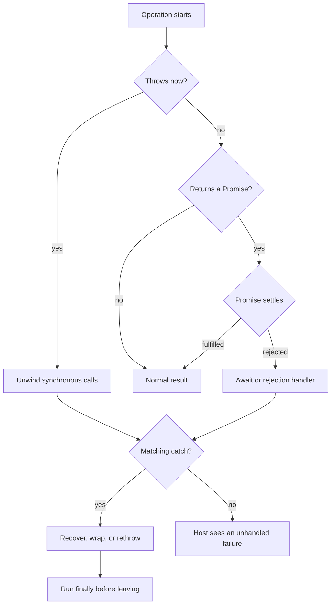

<TLDR>
  <TLDRCell label="what">
    JavaScript error handling separates a failed operation from the code that can recover,
    translate, report, or propagate that failure.
  </TLDRCell>
  <TLDRCell label="trap">
    `try...catch` only observes throws in its current synchronous execution or rejections
    from Promises that are actually awaited inside the `try` block.
  </TLDRCell>
  <TLDRCell label="fix">
    Catch at a boundary with a defined recovery policy, throw `Error` objects, preserve the
    original failure with `cause`, and keep cleanup in `finally`.
  </TLDRCell>
</TLDR>

## What it is and why it exists

Error handling is the control-flow protocol for operations that cannot produce their normal
result. A function throws a value instead of returning, and JavaScript transfers control to
the nearest matching `catch`. If no handler exists in the current call chain, the exception
reaches the host environment.

An `Error` object is the conventional failure value. Its standardized data includes `name`,
`message`, and optional `cause`; runtimes also commonly expose a non-standard `stack` for
diagnostics. Built-in subclasses such as `TypeError`, `RangeError`, `ReferenceError`, and
`SyntaxError` distinguish broad language-level failure categories.

JavaScript technically permits `throw` with any value. That flexibility is why a catch
binding must be treated as unknown until inspected. Throwing an `Error` is still the useful
application contract because it carries type, context, and usually a stack trace in a shape
that tools and humans recognize.

### Failed operations, not ordinary branches

Use an exception when an operation cannot honor its contract and its immediate caller may
not know the recovery policy. Invalid configuration syntax, a broken invariant, or a failed
dependency call fit that model. A normal and expected alternative, such as “no search match,”
is often clearer as `undefined`, `null`, or an explicit result object.

The distinction depends on the API contract, not on how often an event occurs. A missing
record can be an expected query result in one layer and a failed requirement in another.
Translate between those meanings at the boundary that owns the policy instead of making
every low-level function decide how the user should be notified.

### Four decisions at every catch boundary

A useful handler makes an explicit decision: recover with a documented value, retry under a
bounded policy, translate the failure while preserving its cause, or perform local work and
rethrow. Logging alone is not recovery. Catching an error and then continuing with an
invented value silently changes the function's contract.

Keep a `try` region as small as the policy allows. A broad block can accidentally classify a
programming bug from later code as an expected input or dependency failure. Narrow regions
also make it obvious which operation a handler is describing.

## How it works

### Throwing and stack unwinding

Evaluating `throw value` creates an abrupt completion. JavaScript stops the remaining
statements in that block and searches outward through active calls for a `catch`. This
<Term id="error-propagation">error propagation</Term> preserves the thrown value; it does not
automatically convert strings, objects, or other values into `Error` instances.

When a handler is found, its binding receives the exact thrown value. Execution continues
after the entire `try...catch...finally` statement if the handler completes normally. If the
handler rethrows, the search resumes farther out with that new or original value.



The diagram has two entry points into failure handling. A synchronous throw unwinds the
current calls immediately. A rejected Promise reports failure through its settlement state,
so a later `await` or rejection handler creates the point where normal exception-style
control flow resumes.

### The roles of `try`, `catch`, and `finally`

The `try` block contains the operation governed by one handling policy. The `catch` block is
optional when `finally` is present, and its parameter can be omitted when the value is not
needed. Conditional catches do not have special syntax; inspect the value, handle the cases
you own, and rethrow everything else.

The `finally` block runs before control leaves the construct, whether the earlier path
completed normally, returned, broke from a loop, or threw. It is the right place to release
resources or restore local state. It is not a process-shutdown guarantee: forced termination
can prevent JavaScript from executing more code.

A `return` or `throw` inside `finally` replaces the completion already in progress. That
means it can discard both a valid return value and an active exception. Cleanup code should
normally finish without changing control flow, allowing the original outcome to survive.

### Promise rejection is a separate channel

An `async` function always returns a Promise. Throwing anywhere in its body rejects that
Promise, including a throw before its first `await`. A caller handles the failure by awaiting
the Promise inside `try...catch`, returning it to another owner, or attaching a rejection
handler.

Calling an async function inside a `try` block without `await` does not connect its later
rejection to that `catch`. The call itself successfully produces a Promise, then the Promise
settles after synchronous control has left the block. The missing ownership often appears as
an unhandled rejection rather than the intended recovery path.

Promise chains follow the same idea. A throw in a `.then()` callback rejects the Promise
returned by that `.then()`, and `.catch(handler)` is shorthand for a rejection handler. If a
handler returns normally, the next Promise is fulfilled with its return value; to keep the
chain failed, the handler must throw or return a rejected Promise.

### Errors should cross ownership boundaries

Low-level code should normally attach facts it knows and let its caller decide presentation.
A parser can identify an invalid field; an HTTP handler can map that domain error to a status
and public message. Mixing both decisions produces error classes tied to one interface and
makes the same domain operation hard to reuse.

The boundary that starts asynchronous work also owns its rejection. Await it, return it, put
it in an explicitly managed group, or attach a terminal handler that records the deliberate
fire-and-forget policy. Merely creating a Promise is not an ownership strategy.

## Examples

### Validate at the input boundary

This boundary distinguishes malformed JSON from a valid object with an invalid business
field. It handles both known cases and rethrows anything outside its policy. The custom class
gives callers a stable type and field instead of requiring them to parse a message.

<Depth level="quick">

```javascript run title="validate-order.js"
class ValidationError extends Error {
  constructor(field, message) {
    super(message);
    this.name = "ValidationError";
    this.field = field;
  }
}

function readQuantity(source) {
  const order = JSON.parse(source);
  if (!Number.isInteger(order.quantity) || order.quantity < 1) {
    throw new ValidationError(
      "quantity",
      "Quantity must be a positive integer",
    );
  }
  return order.quantity;
}

for (const source of ['{"quantity":3}', '{"quantity":0}', "not json"]) {
  try {
    console.log(`accepted: ${readQuantity(source)}`);
  } catch (error) {
    if (error instanceof ValidationError) {
      console.log(`${error.field}: ${error.message}`);
    } else if (error instanceof SyntaxError) {
      console.log("body: Invalid JSON");
    } else {
      throw error;
    }
  }
}
```

```text
accepted: 3
quantity: Quantity must be a positive integer
body: Invalid JSON
```

</Depth>

`JSON.parse()` throws a runtime `SyntaxError`, so this handler can observe it. A syntax error
that prevents the surrounding script from being parsed is different: none of that script
runs, so a `try` statement inside it cannot handle the parse failure.

### Add operation context without losing the cause

The lower layer knows that a connection closed; the order layer knows which operation failed.
<Term id="error-wrapping">Error wrapping</Term> records both facts. Passing the caught value as
`cause` keeps it available for diagnosis without placing unstable low-level wording in the
public message.

```javascript run title="load-order.js"
class OrderLoadError extends Error {
  constructor(orderId, options) {
    super(`Could not load order ${orderId}`, options);
    this.name = "OrderLoadError";
    this.orderId = orderId;
  }
}

async function requestOrder() {
  throw new TypeError("connection closed");
}

async function loadOrder(orderId) {
  try {
    return await requestOrder(orderId);
  } catch (cause) {
    throw new OrderLoadError(orderId, { cause });
  }
}

async function main() {
  try {
    await loadOrder("A-17");
  } catch (error) {
    console.log(`${error.name}: ${error.message}`);
    console.log(`cause: ${error.cause.name}: ${error.cause.message}`);
  }
}

main().catch(console.error);
```

```text
OrderLoadError: Could not load order A-17
cause: TypeError: connection closed
```

The `await` inside `loadOrder()` matters. Returning `requestOrder(orderId)` directly from the
`try` would let the function leave before the returned Promise rejects, so this local `catch`
would not wrap the failure. `return await` is purposeful at a boundary that must transform a
rejection.

### Release a resource while preserving failure

Acquisition happens before the protected operation, and `finally` releases the lock on every
exit from that operation. The caller still receives the original write error. The output
also proves that cleanup runs before the outer handler resumes.

```javascript run title="release-lock.js"
class Lock {
  constructor(key) {
    this.key = key;
    console.log(`acquired: ${key}`);
  }

  release() {
    console.log(`released: ${this.key}`);
  }
}

async function saveInvoice(invoiceId) {
  const lock = new Lock(`invoice:${invoiceId}`);
  try {
    throw new Error("write failed");
  } finally {
    lock.release();
  }
}

async function main() {
  try {
    await saveInvoice(42);
  } catch (error) {
    console.log(`handled: ${error.message}`);
  }
}

main().catch(console.error);
```

```text
acquired: invoice:42
released: invoice:42
handled: write failed
```

If both the protected operation and cleanup throw, ordinary `finally` semantics expose the
cleanup error and replace the earlier one. When both failures matter, the cleanup layer must
record or aggregate them deliberately; JavaScript does not combine them automatically.

### Report every outcome in a batch

`Promise.allSettled()` waits until each input is fulfilled or rejected and keeps the results
in input order. The code retains successful task names, then turns the collected rejection
reasons into one <Term id="aggregate-error">aggregate error</Term>. This policy fits a batch
where all attempts should finish but the batch as a whole must still report failure.

```javascript run title="settle-batch.js"
const tasks = [
  ["catalog", () => Promise.resolve("updated")],
  ["inventory", () => Promise.reject(new Error("inventory unavailable"))],
  ["receipt", () => Promise.resolve("sent")],
];

async function runBatch(entries) {
  const settled = await Promise.allSettled(
    entries.map(([, run]) => run()),
  );
  const fulfilled = [];
  const failures = [];

  settled.forEach((result, index) => {
    const [name] = entries[index];
    if (result.status === "fulfilled") {
      fulfilled.push(name);
    } else {
      failures.push(result.reason);
    }
  });

  console.log(`fulfilled: ${fulfilled.join(",")}`);
  if (failures.length > 0) {
    throw new AggregateError(failures, `${failures.length} task failed`);
  }
}

runBatch(tasks).catch((error) => {
  console.log(`${error.name}: ${error.message}`);
  console.log(`causes: ${error.errors.map((item) => item.message).join(",")}`);
});
```

```text
fulfilled: catalog,receipt
AggregateError: 1 task failed
causes: inventory unavailable
```

Each rejection reason can still be any JavaScript value. Production aggregation should
normalize or inspect reasons before reading `.message`, especially when tasks call code that
the batch owner does not control.

## Pitfalls

### Swallowing failures

> [!PITFALL]
> A broad `catch` that logs and returns `undefined`, `{}`, or `[]` converts every failure into
> apparent success. Callers can no longer distinguish unavailable data from real empty data.

**Fix:** recover only when the fallback is part of the function's documented contract. For
other cases, add useful context and rethrow, or rethrow the original error after any required
local reporting.

### Assuming every caught value is an `Error`

> [!PITFALL]
> `catch (error)` does not prove that `error.message`, `error.stack`, or `error.cause` exists.
> Dependencies and legacy code can reject or throw strings, numbers, `null`, or plain objects.

**Fix:** narrow the value with `error instanceof Error` before using `Error` properties. At an
external boundary, normalize a non-error value once into a new `Error` whose `cause` retains
the original value.

### Losing a rejection by omitting `await`

> [!PITFALL]
> Starting an async operation inside `try` and leaving it unawaited lets its rejection occur
> outside that `catch`. A detached `.then()` chain without a rejection owner has the same bug.

**Fix:** `await` the operation when this scope owns its handling policy, or return the Promise
so the caller owns it. For deliberate background work, attach a terminal rejection handler
and document shutdown, cancellation, and observability behavior.

### Returning from `finally`

> [!PITFALL]
> A `return`, `throw`, `break`, or `continue` in `finally` can replace the pending completion.
> The original exception may disappear even though cleanup appears to have succeeded.

**Fix:** keep `finally` focused on cleanup and let it complete normally. If cleanup itself can
fail, define which failure wins or create an aggregate that makes both available instead of
relying on accidental precedence.

### Treating `Promise.all()` as cancellation

> [!PITFALL]
> `Promise.all()` rejects when one input rejects, but it does not stop the other operations.
> They may continue writing data, consuming capacity, or producing later rejections.

**Fix:** choose failure topology explicitly. Use `allSettled()` when every result matters, or
give cancellable operations a shared cancellation signal when one failure should stop their
work; still await settlement so cleanup has a clear owner.

## In the AI era

**What generated code gets wrong here**

Generated handlers often catch `Error` broadly and return `null`, turning programmer defects
into plausible data. Other recurring failures are reading `.message` from an arbitrary caught
value, wrapping without `cause`, omitting `await` inside a `try`, returning from `finally`, and
claiming that `Promise.all()` cancels sibling operations.

**Ask your AI to check**

- List every `catch` and state exactly which operations it can observe.
- Trace ownership of every created Promise, including deliberate background work.
- Show whether wrapping preserves `cause` and whether cleanup can replace the primary error.

**Review checklist**

- Force each dependency to throw an `Error` and a non-`Error` value.
- Exercise success, rejection, fallback, and cleanup failure paths separately.
- Verify that batch failure policy matches cancellation and partial-result behavior.

**Prompt vocabulary**

Use the exact terms `synchronous throw`, `Promise rejection`, `error propagation`, `catch
boundary`, `rethrow`, `error cause`, `error wrapping`, `abrupt completion`, `unhandled
rejection`, `AggregateError`, and `cancellation signal`. Ask for a failure-path trace rather
than a generic request to “add error handling.”

<Depth level="deep">

## Error objects as contracts

### Built-in categories and application meaning

The standard constructors describe language-level categories. `TypeError` means an operation
received or encountered an incompatible value; `RangeError` means a value lies outside an
allowed range; `ReferenceError` concerns resolution of a reference. `SyntaxError` can also be
produced at runtime by parsers such as `JSON.parse()`.

Application errors should express decisions callers can make. A `ValidationError` with a
stable `field`, or an `OrderLoadError` with an `orderId`, is more useful than many classes that
only change English prose. Do not force callers to branch on `message`, because wording is for
humans and changes during editing or localization.

Custom subclasses should call `super(message, options)` so standard initialization installs
the message and optional `cause`. Setting `name` makes logs show the domain class name because
the inherited default is `Error`. Modern JavaScript class semantics maintain the subclass
prototype chain without an extra `Object.setPrototypeOf()` repair.

`instanceof` is convenient within one realm and dependency graph, but it can fail across
iframes, worker boundaries, duplicated packages, or reconstructed data. Public boundaries may
need a stable code or validated tagged shape in addition to local classes. Never trust a tag
from unvalidated input merely because it resembles an internal error code.

### Cause chains and diagnostic data

The `cause` option keeps a lower-level failure attached without concatenating all of its text
into a new message. Each layer should add operation context only when that context helps its
caller. Rewrapping at every call produces noisy chains with no new information.

A <Term id="stack-trace">stack trace</Term> is diagnostic runtime data, not a portable API
contract. Its presence and formatting vary by engine, and exposing it to clients can reveal
file paths, code layout, or internal dependencies. Record it in trusted diagnostics while
returning a deliberately designed public error shape.

Most useful `Error` properties are non-enumerable, so `JSON.stringify(error)` commonly omits
`name`, `message`, `stack`, and `cause`. Serialization therefore needs an explicit allowlist.
That is also the right place to redact secrets, cap nested cause depth, and make circular or
non-serializable cause values safe.

### Classification and recovery

Classify by semantics that determine action, not by a catalog of every implementation detail.
A validation failure may be returned to a caller, a transient dependency failure may qualify
for a bounded retry, and a programming invariant failure usually must propagate. The same
message text is not enough to prove two failures have the same policy.

Retries belong above the operation that knows idempotency, deadlines, and cancellation. A
generic catch-and-retry wrapper can duplicate payments, retry permanent validation failures,
or continue after the caller no longer needs the result. Error type is only one input to that
decision.

## Abrupt completion and cleanup

### Completion precedence

At the language level, normal flow, `return`, `throw`, `break`, and `continue` are different
ways a statement can complete. The `finally` block runs while one of those outcomes may
already be pending. If `finally` completes normally, JavaScript resumes the pending outcome;
if it completes abruptly, the newer outcome replaces the earlier one.

This rule explains more than `return` in `finally`. A cleanup throw can hide the primary
operation error, and a loop control statement can suppress it as well. Review `finally` for
all control-flow exits, not just explicit return statements.

When two errors must survive, choose a representation deliberately. An `AggregateError` can
hold both, or the cleanup error can carry the primary error as its cause when that ordering
matches the domain. Logging one and throwing the other is a policy too, but it should not be
an accidental side effect of `finally` precedence.

### Resource ownership

Acquire a resource immediately before the smallest protected region that uses it, then release
it in `finally`. If acquisition itself fails, there may be nothing to release, so placing it
outside the `try` often simplifies the invariant. When partial acquisition is possible, track
which resources actually became owned.

Cleanup must usually be safe to call exactly once. If a release operation is asynchronous,
`await` it inside an async `finally` so the function's returned Promise does not settle before
cleanup finishes. That wait can itself reject, bringing the precedence rule back into play.

Process-level hooks such as Node's `uncaughtException` and unhandled-rejection events are last
resorts for reporting and controlled shutdown. They do not restore application invariants or
make it safe to resume arbitrary work after an unknown failure. Local ownership boundaries
remain the primary design tool.

## Promise failure topology

### Sequential chains

`await` does not make asynchronous work synchronous; it suspends the current async function
until the Promise settles. On rejection, `await` throws the rejection reason at that source
position. The surrounding `try...catch...finally` can then apply the same control-flow rules
as it does for a direct throw.

In a chain, the second argument to `.then(onFulfilled, onRejected)` handles rejection of the
input Promise, not an exception thrown later by `onFulfilled`. A following `.catch()` handles
both the original rejection and throws from earlier fulfillment callbacks, which is usually
the less surprising shape.

A rejection handler that returns a fallback changes the chain back to fulfillment. That may
be correct, but downstream code must know which values are real and which are degraded. A
tagged result often communicates partial service better than an undocumented `undefined`.

### Concurrent groups

`Promise.all()` preserves input order in its fulfillment array and rejects after an input
rejects. That early rejection changes when the caller learns about failure, not whether the
other underlying operations continue. Cancellation requires cooperation from those operations
through an API such as `AbortSignal`.

`Promise.allSettled()` waits for every input and returns status-tagged results in input order.
It is useful for independent tasks, audits, or batches where partial results are meaningful.
Because it never rejects due to an input rejection, the caller must inspect every result and
decide whether the combined operation succeeded.

`Promise.any()` fulfills with the first fulfillment. It rejects with `AggregateError` only
when every input rejects, while `Promise.race()` mirrors the first settlement of either kind.
These combinators encode different success conditions; choosing one is an error-policy decision,
not merely a performance choice.

An <Term id="aggregate-error">`AggregateError`</Term> preserves an iterable of individual
reasons in its `errors` property and can itself have a `cause`. The contained values are not
guaranteed to be `Error` objects. Consumers should retain task identity alongside each reason
when a positional list alone would be ambiguous.

</Depth>

<Checkpoint id="javascript/error-handling" />

## Further reading

- [ECMAScript language specification: the `try` statement](https://tc39.es/ecma262/multipage/ecmascript-language-statements-and-declarations.html#sec-try-statement)
- [MDN: `Error`](https://developer.mozilla.org/en-US/docs/Web/JavaScript/Reference/Global_Objects/Error)
- [MDN: `try...catch`](https://developer.mozilla.org/en-US/docs/Web/JavaScript/Reference/Statements/try...catch)
- [MDN: `Promise.allSettled()`](https://developer.mozilla.org/en-US/docs/Web/JavaScript/Reference/Global_Objects/Promise/allSettled)
- [MDN: `AggregateError`](https://developer.mozilla.org/en-US/docs/Web/JavaScript/Reference/Global_Objects/AggregateError)
- [Node.js 24: Errors](https://nodejs.org/docs/latest-v24.x/api/errors.html)
