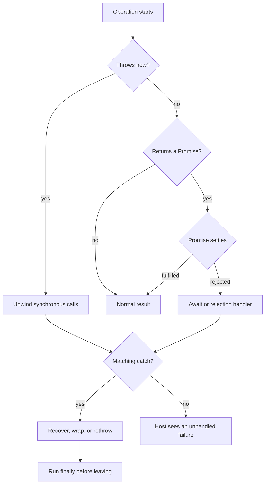

<TLDR>
  <TLDRCell label="what">
    JavaScript 错误处理把失败的操作，与能够恢复、转换、报告或继续传播该失败的
    代码分开。
  </TLDRCell>
  <TLDRCell label="trap">
    `try...catch` 只能观察当前同步执行中的抛出，以及在 `try` 块内确实等待的
    Promise 所产生的拒绝。
  </TLDRCell>
  <TLDRCell label="fix">
    在恢复策略明确的边界捕获错误，抛出 `Error` 对象，用 `cause` 保留原始失败，
    并把清理逻辑放在 `finally` 中。
  </TLDRCell>
</TLDR>

## 是什么，为什么存在

错误处理是一套控制流协议，用于处理无法产生正常结果的操作。函数不再返回，
而是抛出一个值；JavaScript 随即把控制权转移给最近的 `catch`。如果当前调用链中
没有处理器，异常就会到达宿主环境。

`Error` 对象是约定俗成的失败值。它的标准数据包括 `name`、`message` 和可选的
`cause`；运行时通常还会提供非标准的 `stack`，供诊断使用。`TypeError`、
`RangeError`、`ReferenceError` 和 `SyntaxError` 等内置子类区分了宽泛的语言级
失败类别。

JavaScript 在技术上允许用 `throw` 抛出任何值。因此，在检查之前，必须把 `catch`
绑定视为未知值。应用代码仍应约定抛出 `Error`，因为它以工具和人都熟悉的结构
携带类型、上下文以及通常可用的堆栈跟踪（stack trace）。

### 失败操作与普通分支

当操作无法履行契约，而直接调用方又未必知道恢复策略时，应使用异常。配置语法
无效、不变量被破坏或依赖调用失败，都符合这个模型。对于「没有搜索结果」这类正常
且预期内的备选结果，使用 `undefined`、`null` 或显式结果对象通常更清楚。

两者的区别取决于 API 契约，而不是事件发生的频率。同一个记录缺失，在某一层可以是
预期的查询结果，在另一层却可能意味着必要条件失败。应在拥有策略的边界转换这两种
含义，不要让每个底层函数都决定如何通知用户。

### 每个捕获边界的四项决策

有效的处理器会明确作出一项决策：用契约规定的值恢复，按有界策略重试，在保留原因的
同时转换失败，或先完成本地工作再重新抛出。只写日志不等于恢复。捕获错误后继续使用
临时编造的值，会悄悄改变函数契约。

在策略允许的范围内，`try` 区域应尽量小。过宽的代码块可能把后续代码中的编程错误，
误判成预期的输入或依赖失败。范围收窄后，处理器究竟在描述哪个操作也会更清楚。

## 工作原理

### 抛出与栈展开

执行 `throw value` 会产生突然完成（abrupt completion）。JavaScript 停止执行当前
代码块中的剩余语句，并沿活跃调用向外寻找 `catch`。这种<Term id="error-propagation">错误传播（error propagation）</Term>
会保留抛出的原值，不会自动把字符串、对象或其他值转换为 `Error` 实例。

找到处理器后，它的绑定会接收被抛出的原值。处理器正常结束时，执行从整个
`try...catch...finally` 语句之后继续。如果处理器重新抛出，搜索就会带着新值或
原值继续向外进行。



图中有两个入口会进入失败处理。同步抛出会立即展开当前调用。被拒绝的 Promise 则通过
自身的敲定状态报告失败，之后的 `await` 或拒绝处理器才是恢复普通异常式控制流的
位置。

### `try`、`catch` 与 `finally` 的职责

`try` 块包含受同一项处理策略约束的操作。存在 `finally` 时可以省略 `catch`；不需要
错误值时，也可以省略 `catch` 参数。JavaScript 没有条件捕获的专用语法，应先检查值，
处理自己负责的情况，再重新抛出其他情况。

无论前面的路径是正常结束、返回、跳出循环还是抛出，`finally` 都会在控制权离开整个
结构前运行。这里适合释放资源或恢复局部状态。但它不能保证在进程关闭时运行；强制
终止可能让 JavaScript 没有机会继续执行代码。

`finally` 内的 `return` 或 `throw` 会替换已经在进行的完成结果。因此，它既可能丢掉
有效返回值，也可能丢掉正在传播的异常。清理代码通常应正常结束，让原来的结果继续
存在。

### Promise 拒绝是另一条通道

`async` 函数总会返回 Promise。函数体任意位置的抛出都会拒绝该 Promise，包括第一个
`await` 之前的抛出。调用方要么在 `try...catch` 中等待 Promise，要么把它返回给其他
所有者，要么附加拒绝处理器。

在 `try` 块中调用异步函数却不使用 `await`，不会把它稍后的拒绝连接到这个 `catch`。
调用本身成功产生 Promise，随后同步控制流离开代码块，Promise 才完成敲定。缺失的
所有权通常会表现为未处理的拒绝，而不是预期的恢复路径。

Promise 链遵循同一原则。`.then()` 回调中的抛出会拒绝该 `.then()` 返回的 Promise，
而 `.catch(handler)` 是拒绝处理器的简写。如果处理器正常返回，下一个 Promise 会用其
返回值兑现；要让链保持失败，处理器必须抛出或返回被拒绝的 Promise。

### 错误应跨越所有权边界

底层代码通常应附加它知道的事实，再由调用方决定展示方式。解析器可以指出无效字段；
HTTP 处理器则可以把该领域错误映射为状态码和公开消息。混合这两项决策，会让错误类
绑定到某一种界面，也使同一领域操作难以复用。

启动异步工作的边界也拥有它的拒绝。应等待它、返回它、把它放进显式管理的任务组，
或附加终结处理器来记录有意采用的即发即弃策略。只创建一个 Promise 并不构成所有权
策略。

## 示例

### 在输入边界验证

这个边界区分两种情况：JSON 本身损坏，以及对象有效但业务字段无效。它会处理两个已知
情况，并重新抛出策略范围之外的错误。自定义类为调用方提供稳定的类型和字段，无需解析
错误消息。

<Depth level="quick">

```javascript run title="validate-order.js"
class ValidationError extends Error {
  constructor(field, message) {
    super(message);
    this.name = "ValidationError";
    this.field = field;
  }
}

function readQuantity(source) {
  const order = JSON.parse(source);
  if (!Number.isInteger(order.quantity) || order.quantity < 1) {
    throw new ValidationError(
      "quantity",
      "Quantity must be a positive integer",
    );
  }
  return order.quantity;
}

for (const source of ['{"quantity":3}', '{"quantity":0}', "not json"]) {
  try {
    console.log(`accepted: ${readQuantity(source)}`);
  } catch (error) {
    if (error instanceof ValidationError) {
      console.log(`${error.field}: ${error.message}`);
    } else if (error instanceof SyntaxError) {
      console.log("body: Invalid JSON");
    } else {
      throw error;
    }
  }
}
```

```text
accepted: 3
quantity: Quantity must be a positive integer
body: Invalid JSON
```

</Depth>

`JSON.parse()` 抛出的是运行时 `SyntaxError`，所以这个处理器能够观察到它。另一种情况是
语法错误导致外围脚本根本无法解析；此时脚本完全不会运行，其中的 `try` 语句自然也无法
处理解析失败。

### 添加操作上下文，同时保留原因

底层知道连接已关闭，订单层知道失败的是哪个操作。<Term id="error-wrapping">错误包装（error wrapping）</Term>
会同时记录这两项事实。把捕获值作为 `cause` 传入，可以保留诊断信息，又不必把不稳定的
底层措辞塞进公开消息。

```javascript run title="load-order.js"
class OrderLoadError extends Error {
  constructor(orderId, options) {
    super(`Could not load order ${orderId}`, options);
    this.name = "OrderLoadError";
    this.orderId = orderId;
  }
}

async function requestOrder() {
  throw new TypeError("connection closed");
}

async function loadOrder(orderId) {
  try {
    return await requestOrder(orderId);
  } catch (cause) {
    throw new OrderLoadError(orderId, { cause });
  }
}

async function main() {
  try {
    await loadOrder("A-17");
  } catch (error) {
    console.log(`${error.name}: ${error.message}`);
    console.log(`cause: ${error.cause.name}: ${error.cause.message}`);
  }
}

main().catch(console.error);
```

```text
OrderLoadError: Could not load order A-17
cause: TypeError: connection closed
```

`loadOrder()` 内的 `await` 很重要。如果在 `try` 中直接返回 `requestOrder(orderId)`，
函数会在返回的 Promise 拒绝前离开，因此本地 `catch` 无法包装失败。边界必须转换拒绝时，
`return await` 有明确用途。

### 释放资源，同时保留失败

代码在受保护操作之前获取资源，并通过 `finally` 在该操作的所有退出路径上释放锁。
调用方仍会收到原始写入错误。实际输出也证明，清理发生在外层处理器恢复执行之前。

```javascript run title="release-lock.js"
class Lock {
  constructor(key) {
    this.key = key;
    console.log(`acquired: ${key}`);
  }

  release() {
    console.log(`released: ${this.key}`);
  }
}

async function saveInvoice(invoiceId) {
  const lock = new Lock(`invoice:${invoiceId}`);
  try {
    throw new Error("write failed");
  } finally {
    lock.release();
  }
}

async function main() {
  try {
    await saveInvoice(42);
  } catch (error) {
    console.log(`handled: ${error.message}`);
  }
}

main().catch(console.error);
```

```text
acquired: invoice:42
released: invoice:42
handled: write failed
```

如果受保护操作与清理都抛出错误，普通 `finally` 语义会暴露清理错误，并替换先前的错误。
两项失败都很重要时，清理层必须有意记录或聚合它们；JavaScript 不会自动完成组合。

### 报告批处理中的每项结果

`Promise.allSettled()` 会等待每个输入兑现或拒绝，并按输入顺序保留结果。代码先保留成功
任务的名称，再把收集到的拒绝原因转换为一个<Term id="aggregate-error">聚合错误（aggregate error）</Term>。
这种策略适合所有尝试都应结束，但整个批次仍必须报告失败的场景。

```javascript run title="settle-batch.js"
const tasks = [
  ["catalog", () => Promise.resolve("updated")],
  ["inventory", () => Promise.reject(new Error("inventory unavailable"))],
  ["receipt", () => Promise.resolve("sent")],
];

async function runBatch(entries) {
  const settled = await Promise.allSettled(
    entries.map(([, run]) => run()),
  );
  const fulfilled = [];
  const failures = [];

  settled.forEach((result, index) => {
    const [name] = entries[index];
    if (result.status === "fulfilled") {
      fulfilled.push(name);
    } else {
      failures.push(result.reason);
    }
  });

  console.log(`fulfilled: ${fulfilled.join(",")}`);
  if (failures.length > 0) {
    throw new AggregateError(failures, `${failures.length} task failed`);
  }
}

runBatch(tasks).catch((error) => {
  console.log(`${error.name}: ${error.message}`);
  console.log(`causes: ${error.errors.map((item) => item.message).join(",")}`);
});
```

```text
fulfilled: catalog,receipt
AggregateError: 1 task failed
causes: inventory unavailable
```

每个拒绝原因仍然可以是任意 JavaScript 值。生产环境中的聚合逻辑应先规范化或检查原因，
再读取 `.message`，尤其是在任务调用了批处理所有者无法控制的代码时。

## 陷阱

### 吞掉失败

> [!PITFALL]
> 宽泛的 `catch` 如果只写日志，再返回 `undefined`、`{}` 或 `[]`，就会把所有失败转换成
> 表面上的成功。调用方无法再区分数据不可用与真实的空数据。

**修复：** 只有回退值属于函数书面契约时才进行恢复。其他情况下，应添加有用上下文后
重新抛出，或在完成必要的本地报告后重新抛出原始错误。

### 假定每个捕获值都是 `Error`

> [!PITFALL]
> `catch (error)` 不能证明 `error.message`、`error.stack` 或 `error.cause` 存在。
> 依赖和旧代码可能拒绝或抛出字符串、数字、`null` 或普通对象。

**修复：** 使用 `Error` 属性前，先通过 `error instanceof Error` 收窄该值。在外部边界，
可以把非错误值统一规范化为一个新的 `Error`，并让它的 `cause` 保留原值。

### 省略 `await` 而丢失拒绝

> [!PITFALL]
> 在 `try` 中启动异步操作却不等待，会让拒绝发生在该 `catch` 之外。没有拒绝所有者的
> 独立 `.then()` 链也有同样问题。

**修复：** 如果当前作用域拥有处理策略，就使用 `await`；否则返回 Promise，把所有权交给
调用方。对于有意创建的后台工作，应附加终结拒绝处理器，并记录关闭、取消和可观测性行为。

### 从 `finally` 返回

> [!PITFALL]
> `finally` 中的 `return`、`throw`、`break` 或 `continue` 可以替换待处理的完成结果。
> 即使清理看起来成功，原始异常也可能消失。

**修复：** 让 `finally` 专注于清理并正常结束。如果清理本身可能失败，应定义哪项失败优先，
或创建能同时保留两者的聚合错误，不要依赖偶然的优先级。

### 把 `Promise.all()` 当作取消机制

> [!PITFALL]
> 某个输入拒绝时，`Promise.all()` 会拒绝，但不会停止其他操作。它们可能继续写入数据、
> 占用容量，或产生之后才出现的拒绝。

**修复：** 应显式选择失败拓扑。每项结果都重要时使用 `allSettled()`；某项失败后应停止
其他工作时，向可取消操作传入共享取消信号，同时仍应等待敲定，让清理拥有明确的负责人。

## AI 时代

**生成代码在这里容易犯什么错**

生成的处理器经常宽泛地捕获 `Error` 再返回 `null`，把程序缺陷变成看似合理的数据。
其他常见错误包括直接读取任意捕获值的 `.message`，包装时遗漏 `cause`，在 `try` 中省略
`await`，从 `finally` 返回，以及声称 `Promise.all()` 会取消其他操作。

**让 AI 检查什么**

- 列出每个 `catch`，并准确说明它能观察哪些操作。
- 跟踪每个已创建 Promise 的所有权，包括有意创建的后台工作。
- 说明包装是否保留 `cause`，以及清理是否可能替换主要错误。

**审查清单**

- 分别让每个依赖抛出 `Error` 与非 `Error` 值。
- 分别覆盖成功、拒绝、回退和清理失败路径。
- 验证批处理失败策略是否符合取消和部分结果行为。

**提示词**

使用精确术语「同步抛出（synchronous throw）」「Promise 拒绝（Promise rejection）」
「错误传播（error propagation）」「捕获边界（catch boundary）」「重新抛出（rethrow）」
「错误原因（error cause）」「错误包装（error wrapping）」「突然完成（abrupt completion）」
「未处理的拒绝（unhandled rejection）」「`AggregateError`」和「取消信号（cancellation signal）」。
要求给出失败路径跟踪，不要只笼统地说「添加错误处理」。

<Depth level="deep">

## 作为契约的错误对象

### 内置类别与应用含义

标准构造器描述语言级类别。`TypeError` 表示操作接收或遇到了不兼容值；`RangeError`
表示值超出允许范围；`ReferenceError` 与引用解析有关。`JSON.parse()` 等解析器也能在
运行时产生 `SyntaxError`。

应用错误应表达调用方能够据此作出的决定。带稳定 `field` 的 `ValidationError`，或带
`orderId` 的 `OrderLoadError`，比许多只改变英文措辞的类更有用。不要迫使调用方根据
`message` 分支，因为措辞面向人，会随着编辑或本地化而变化。

自定义子类应调用 `super(message, options)`，由标准初始化安装消息与可选的 `cause`。
继承得到的默认名称是 `Error`，所以设置 `name` 能让日志显示领域类名。现代 JavaScript
类语义会维护子类原型链，无需额外使用 `Object.setPrototypeOf()` 修复。

`instanceof` 在同一个 realm 和依赖图中很方便，但跨 iframe、worker 边界、重复安装的包
或重建数据时可能失败。除本地类之外，公开边界可能还需要稳定代码或经过验证的带标签
结构。未经验证的输入即使看起来像内部错误码，也绝不能直接信任。

### 原因链与诊断数据

`cause` 选项会保留下层失败，无需把它的全部文本拼接进新消息。只有上下文确实能帮助
调用方时，各层才应添加操作信息。每经过一次调用都重新包装，只会产生没有新信息的
嘈杂链条。

<Term id="stack-trace">堆栈跟踪（stack trace）</Term>是运行时诊断数据，不是可移植的
API 契约。它是否存在以及采用何种格式，都因引擎而异；向客户端暴露它还可能泄漏文件
路径、代码布局或内部依赖。应把它记录到可信诊断系统，同时返回经过专门设计的公开错误结构。

多数有用的 `Error` 属性不可枚举，因此 `JSON.stringify(error)` 通常会遗漏 `name`、
`message`、`stack` 和 `cause`。所以序列化需要显式允许列表。这也正是执行秘密脱敏、限制
嵌套原因深度，以及安全处理循环或不可序列化原因值的位置。

### 分类与恢复

分类应依据决定后续动作的语义，而不是罗列所有实现细节。验证失败可以返回给调用方，
暂时性依赖失败可能符合有界重试条件，编程不变量失败则通常必须继续传播。相同的消息文本
不足以证明两个失败应采用相同策略。

重试应位于了解幂等性、截止时间与取消的操作之上。通用的捕获后重试包装器可能重复付款、
重试永久性验证失败，或在调用方不再需要结果后继续工作。错误类型只是这项决策的一项输入。

## 突然完成与清理

### 完成结果的优先级

在语言层面，正常流、`return`、`throw`、`break` 和 `continue` 是语句的不同完成方式。
其中一项结果可能已经待处理，此时 `finally` 块开始运行。如果 `finally` 正常结束，
JavaScript 会恢复待处理结果；如果它突然结束，新结果就会替换旧结果。

这条规则不只解释 `finally` 中的 `return`。清理抛出可能隐藏主要操作错误，循环控制语句
也可能将其抑制。审查 `finally` 时应查找所有控制流出口，而不只是显式返回语句。

必须保留两项错误时，应有意选择表示方式。`AggregateError` 可以容纳两者；如果这种顺序
符合领域语义，也可以让清理错误以主要错误为原因。记录一个再抛出另一个同样是一种策略，
但它不应只是 `finally` 优先级的意外副作用。

### 资源所有权

应在使用资源的最小受保护区域之前立即获取资源，再在 `finally` 中释放。如果获取本身
失败，往往没有任何东西需要释放，所以把获取操作放在 `try` 外通常能简化不变量。如果
可能只获取了部分资源，则要记录哪些资源已经归当前代码所有。

清理通常必须能够安全地恰好调用一次。如果释放操作是异步的，应在异步 `finally` 中等待
它，避免函数返回的 Promise 在清理完成前敲定。等待本身也可能拒绝，于是再次触发完成
结果优先级规则。

Node 的 `uncaughtException` 和未处理拒绝事件等进程级钩子，是用于报告和受控关闭的最后
手段。它们不会恢复应用不变量，也无法让程序在未知失败后安全恢复任意工作。局部所有权
边界仍是主要的设计工具。

## Promise 失败拓扑

### 顺序链

`await` 不会把异步工作变成同步工作，而是暂停当前异步函数，直到 Promise 敲定。发生拒绝
时，`await` 会在该源码位置抛出拒绝原因。外围 `try...catch...finally` 随即可以应用与
直接抛出相同的控制流规则。

在链中，`.then(onFulfilled, onRejected)` 的第二个参数处理输入 Promise 的拒绝，不处理
之后由 `onFulfilled` 抛出的异常。放在后面的 `.catch()` 既处理原始拒绝，也处理前面兑现
回调的抛出，通常更不容易让人误解。

拒绝处理器返回回退值，会让链重新变成兑现状态。这可能是正确策略，但下游代码必须知道
哪些值是真实结果，哪些值来自降级。与没有文档的 `undefined` 相比，带标签的结果通常更能
清楚表达部分服务。

### 并发任务组

`Promise.all()` 会在兑现数组中保持输入顺序，并在某个输入拒绝后进入拒绝状态。提前拒绝
只会改变调用方得知失败的时间，不会让其他底层操作停止。取消需要这些操作通过
`AbortSignal` 等 API 主动配合。

`Promise.allSettled()` 等待每个输入，并按输入顺序返回带状态标签的结果。它适合相互独立
的任务、审计流程，或部分结果仍有意义的批处理。输入拒绝不会让它自身拒绝，因此调用方必须
检查每项结果，再判断组合操作是否成功。

`Promise.any()` 会用第一个兑现结果兑现。只有所有输入都拒绝时，它才以 `AggregateError`
拒绝；`Promise.race()` 则跟随最先发生的任一种敲定。这些组合器编码了不同的成功条件，
选择哪一个属于错误策略决策，而不只是性能选择。

<Term id="aggregate-error">`AggregateError`</Term> 会在 `errors` 属性中保留一组单独原因，
自身也可以拥有 `cause`。其中的值不保证是 `Error` 对象。如果只有位置列表会导致歧义，
使用方应为每项原因同时保留任务标识。

</Depth>

<Checkpoint id="javascript/error-handling" />

## 延伸阅读

- [ECMAScript 语言规范：`try` 语句](https://tc39.es/ecma262/multipage/ecmascript-language-statements-and-declarations.html#sec-try-statement)
- [MDN：`Error`](https://developer.mozilla.org/en-US/docs/Web/JavaScript/Reference/Global_Objects/Error)
- [MDN：`try...catch`](https://developer.mozilla.org/en-US/docs/Web/JavaScript/Reference/Statements/try...catch)
- [MDN：`Promise.allSettled()`](https://developer.mozilla.org/en-US/docs/Web/JavaScript/Reference/Global_Objects/Promise/allSettled)
- [MDN：`AggregateError`](https://developer.mozilla.org/en-US/docs/Web/JavaScript/Reference/Global_Objects/AggregateError)
- [Node.js 24：错误](https://nodejs.org/docs/latest-v24.x/api/errors.html)
