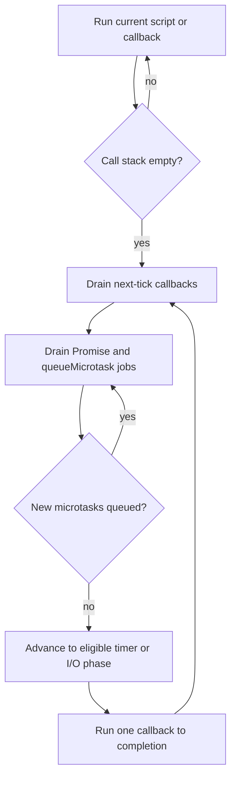

<TLDR>
  <TLDRCell label="what">
    The event loop lets a JavaScript host start queued work when the call stack is empty.
  </TLDRCell>
  <TLDRCell label="trap">
    A zero-delay timer is not immediate, and Promise handlers run as microtasks before the next timer task.
  </TLDRCell>
  <TLDRCell label="fix">
    Reason in boundaries: finish synchronous code, drain microtasks at the checkpoint, then take the next task.
  </TLDRCell>
</TLDR>

## What it is and why it exists

The <Term id="event-loop">event loop</Term> coordinates JavaScript execution with work scheduled by its host, which is Node.js here. JavaScript runs the current job to completion on a call stack; a callback cannot interrupt a stack that is already running.

Node handles timers and I/O outside that stack, then makes their callbacks eligible in the appropriate queue or phase. You meet this model whenever code uses Promises, `async`/`await`, timers, events, streams, or network I/O.

It exists so the host can make progress on other work while JavaScript waits, without making every callback run on a separate JavaScript thread.

The event loop is a host mechanism, not a JavaScript syntax feature. ECMAScript defines jobs such as Promise reactions, while Node and browsers decide how timers, I/O, rendering, and other host work create opportunities to run those jobs.

Concurrency here means that waiting operations can overlap. It does not mean two ordinary JavaScript callbacks execute simultaneously on the same event-loop thread; one callback runs until it returns or reaches an `await` that suspends its async function.

That distinction matters in servers and command-line tools. A process can keep thousands of sockets waiting efficiently, yet one callback that performs a long synchronous calculation can still delay every ready socket, timer, and Promise continuation assigned to that thread.

## How it works

The call stack contains the functions executing now. A task queue—often called the macrotask queue—contains later work such as an eligible timer callback; Node actually organizes tasks into event-loop phases with separate queues.

The microtask queue contains Promise reactions and callbacks queued with `queueMicrotask()`. A <Term id="microtask">microtask</Term> does not run as soon as it is queued.

The runtime first lets the current JavaScript operation empty the call stack. At the microtask checkpoint, it drains queued microtasks, including new microtasks they enqueue, before moving to the next task.

The useful order is therefore:

1. Run the current script or callback until its stack is empty.
2. Drain the microtask queue at the checkpoint.
3. Let Node advance through its event-loop phases and select eligible task work.
4. Repeat the checkpoint after the next callback finishes.



A timer delay is a threshold, not a reservation. Once the threshold has elapsed, the callback becomes eligible for the timers phase; an occupied stack, pending microtasks, operating-system scheduling, and other phase work can all make it run later.

Promise reactions use the microtask queue even when the Promise was already fulfilled before `.then()` was called. The handler is therefore deferred, but it normally runs before task-level work that becomes eligible in the next event-loop turn.

Calling an async function runs its body synchronously until the first `await` that actually suspends it. The continuation after `await` becomes a Promise job, so surrounding synchronous code can finish before the continuation resumes.

Node also has `process.nextTick()`, whose queue is drained before the Promise microtask queue. It is a Node-specific escape hatch rather than a portable Promise primitive, and recursive next-tick scheduling can prevent the loop from reaching its phases.

## Examples

### One script, three scheduling paths

<Depth level="quick">

```js run title="event-loop.js"
console.log("script:start");
console.log(1);
setTimeout(() => console.log(2));
Promise.resolve().then(() => console.log(3));
console.log(4);
queueMicrotask(() => console.log("microtask:queued"));
Promise.resolve().then(() => console.log("microtask:promise"));
setTimeout(() => console.log("timer:second"), 0);
console.log("script:end");
console.log("sync:complete");
```

```text
script:start
1
4
script:end
sync:complete
3
microtask:queued
microtask:promise
2
timer:second
```

</Depth>

The output follows the scheduling boundaries, not source order:

1. `console.log(1)` runs synchronously on the current call stack.
2. `setTimeout()` registers a timer; its callback becomes task work only after the timer threshold is met.
3. `.then()` queues its handler as a microtask because the Promise is already fulfilled, but the current script still finishes first.
4. `console.log(4)` runs synchronously, the stack empties, the microtask logs `3`, and the timer callback later logs `2`.

The other synchronous messages stay ahead of every deferred callback. The three microtasks keep their enqueue order, and both zero-threshold timers keep their registration order in this run.

The timer's omitted delay behaves like a zero-millisecond threshold, not permission to interrupt the current script. This result was verified with Node 24.

<TryToBreak items={['Add a microtask inside the first timer', 'Move the Promise registration after script:end', 'Schedule a timer from a Promise handler']} />

### Microtasks added during a checkpoint

```js run title="nested-microtasks.js"
console.log("task:start");
queueMicrotask(() => {
  console.log("microtask:A");
  queueMicrotask(() => {
    console.log("microtask:C");
  });
});
Promise.resolve().then(() => {
  console.log("microtask:B");
});
setTimeout(() => console.log("timer:next-task"), 0);
console.log("task:end");
```

```text
task:start
task:end
microtask:A
microtask:B
microtask:C
timer:next-task
```

`A` and `B` are queued during the initial task, so they run in first-in, first-out order. When `A` queues `C`, the host appends `C` behind the already queued `B` rather than running it recursively inside `A`.

The checkpoint does not stop after the queue's original contents. It continues until no microtasks remain, which is useful for settling short Promise chains but dangerous when each callback unconditionally schedules another one.

### Ordering from inside an I/O callback

```js run title="io-phase-order.js"
const { readFile } = require("node:fs");

console.log("script:start");
readFile(process.execPath, () => {
  console.log("io:callback");
  setTimeout(() => {
    console.log("timer");
  }, 0);
  setImmediate(() => {
    console.log("immediate");
  });
  Promise.resolve().then(() => {
    console.log("io:microtask");
  });
});
console.log("script:end");
```

```text
script:start
script:end
io:callback
io:microtask
immediate
timer
```

The file read completes outside the JavaScript stack. Once its poll-phase callback runs, the Promise reaction becomes the first deferred work after that callback, `setImmediate()` is eligible in the check phase, and the new timer waits for a later timers phase.

This placement is deliberate: Node documents the immediate-before-timer order when both are scheduled inside an I/O cycle. At top level their relative order can depend on timing, so a reliable teaching example must not claim a universal top-level order.

### Yielding between bounded chunks

```js run title="chunked-work.js"
const records = ["A", "B", "C", "D", "E", "F"];

async function indexRecords(items) {
  for (let start = 0; start < items.length; start += 2) {
    const batch = items.slice(start, start + 2);
    console.log(`indexed:${batch.join(",")}`);
    if (start + 2 < items.length) {
      await new Promise((resolve) => setImmediate(resolve));
    }
  }
  return items.length;
}

console.log("index:start");
const result = indexRecords(records);
console.log("index:yielded");
result.then((count) => console.log(`index:done:${count}`));
```

```text
index:start
indexed:A,B
index:yielded
indexed:C,D
indexed:E,F
index:done:6
```

An async function begins synchronously, which is why the first batch appears before `index:yielded`. Each `await` then suspends the function until an immediate callback resolves the Promise, allowing other event-loop work an opportunity between batches.

This pattern improves responsiveness only when each chunk is genuinely bounded. It does not move CPU work to another core; use a worker thread when the computation itself must run in parallel or a single chunk can still exceed the latency budget.

## Pitfalls

> [!PITFALL]
> Treating `setTimeout(callback, 0)` as “run now” makes code depend on an order the API never promises.

**Fix:** treat the delay as a minimum threshold; express ordering with a Promise chain or `await` when one operation depends on another.

> [!PITFALL]
> A recursive microtask chain can keep adding work while the queue is draining, so timers and I/O callbacks do not get a turn.

**Fix:** bound the chain and yield to a task with an appropriate host API when other event-loop work must proceed.

> [!PITFALL]
> Assuming `setTimeout(..., 0)` always runs before or after `setImmediate()` ignores the Node phase and the context where both were scheduled.

**Fix:** assert only documented boundaries; do not use incidental timer ordering as synchronization.

> [!PITFALL]
> Writing several `await` expressions in sequence can serialize independent operations and turn avoidable latency into user-visible delay.

**Fix:** start independent operations before awaiting them together, then choose `Promise.all`, `allSettled`, `any`, or `race` from the required failure policy. Add an explicit concurrency limit when the input can be large.

> [!PITFALL]
> Moving a CPU-heavy loop into an async function does not stop it from blocking; code before the next suspension point still occupies the event-loop thread.

**Fix:** split work into measured, bounded chunks when cooperative yielding is sufficient, or move sustained computation to worker threads. Track event-loop delay to verify that the chosen boundary meets the service's latency budget.

## In the AI era

**What generated code gets wrong here**

Generated code often labels every deferred callback “async” without distinguishing tasks from microtasks, or assumes a timer delay is an execution deadline.

It also tends to add `await` mechanically, which may serialize independent I/O, and to wrap CPU-heavy work in `async` without adding a real suspension or worker boundary. Node-specific answers may flatten timers, polling, checks, next-tick callbacks, and Promise jobs into one imaginary queue.

**Ask your AI to check**

- Classify each callback as synchronous work, a Promise microtask, a Node-specific next-tick callback, or event-loop task work.
- Mark every point where the stack empties and a microtask checkpoint can occur.
- Find loops that schedule unbounded microtasks or callbacks that block the stack.

Ask it to state which ordering claims are guaranteed by the language, which are documented by Node, and which merely appeared in one run. For performance-sensitive code, request the maximum synchronous work per callback and the intended cancellation or backpressure policy.

**Review checklist**

- Trace observable order from queue rules, not from visual source order.
- Check whether tests rely on timer timing or on undocumented ordering between Node phases.
- Confirm that long CPU work is partitioned or moved off the event-loop thread where the application requires responsiveness.

**Prompt vocabulary**

Use `call stack`, `run to completion`, `macrotask`, `microtask queue`, `microtask checkpoint`, `timer threshold`, and `Node event-loop phase`.

Add `poll phase`, `check phase`, `process.nextTick queue`, `cooperative yielding`, `event-loop delay`, and `backpressure` when a Node design needs phase-level or latency-level precision.

<Depth level="deep">

## Microtask checkpoints in Node 24

Node's event loop has phases for timers, pending callbacks, polling, checks, and close callbacks; “macrotask queue” is a useful simplification, not one literal Node queue. Node also maintains a `process.nextTick()` queue that is outside the libuv phase diagram.

In Node 24, Node drains the Promise microtask queue immediately after the next-tick queue. Next-tick callbacks therefore run first at CommonJS top level; ES module top level already runs as a microtask, so `queueMicrotask()` callbacks run first there.

That context-sensitive priority is why replacing `queueMicrotask()` with `process.nextTick()` can change order even though both defer a callback.

Node runs a microtask checkpoint after each JavaScript callback returns, not merely once at the end of a complete libuv turn. A Promise reaction created in an I/O callback therefore runs before Node invokes another ready callback from a later phase.

Microtasks are appropriate for a small follow-up that must observe completed synchronous state before unrelated task work. They are a poor general yielding primitive because draining the queue takes priority over advancing the event loop.

## Phases, polling, and timers

The libuv loop exposes phases rather than one global callback queue. Timers run eligible timeout and interval callbacks, poll receives many I/O callbacks, and check runs callbacks registered with `setImmediate()`; pending and close phases cover additional lifecycle work.

Since libuv 1.45, used by current Node releases, timers run after the poll phase rather than both before and after it. That implementation change is another reason to base synchronization on API contracts instead of memorized phase folklore from old tutorials.

The poll phase can wait for I/O when no callback is immediately ready, subject to timers and other conditions that require progress. An event-driven server spends much of its healthy life waiting there rather than consuming a CPU core in a literal busy loop.

Intervals inherit the same threshold semantics as timeouts. If a callback or microtask drain takes longer than the interval, Node cannot rewind time or execute the missed callback concurrently on the same thread; applications that care about wall-clock cadence must measure elapsed time explicitly.

## Async functions and Promise jobs

`await value` conceptually adopts `value` through Promise machinery and divides the function into segments. The segment before the first suspension runs in the caller's current stack, while each later segment resumes through a queued Promise job.

Even awaiting an already fulfilled Promise does not resume the rest of the async function inline. That guaranteed asynchronous boundary prevents the continuation from re-entering the current stack, but it also means a needless `await` adds ordering consequences.

Creating a Promise does not by itself make its executor asynchronous. The executor passed to `new Promise(...)` runs immediately; only its reactions are jobs, so expensive synchronous work inside that executor blocks just like expensive work in any other function.

Promise combinators coordinate settlement but do not cancel their inputs. When one `Promise.all` input rejects, the other operations keep running unless the application passes an `AbortSignal` or another cooperative cancellation mechanism to them.

## Fairness, latency, and backpressure

Run-to-completion makes local reasoning possible because another callback cannot mutate ordinary JavaScript state halfway through the current callback. The cost is cooperative fairness: every callback is responsible for returning control within an acceptable time.

Event-loop delay measures how late the loop becomes available to run scheduled work. It captures blocking from synchronous JavaScript, garbage collection, native work on the main thread, and long callback bursts; it is more useful than counting `async` keywords.

Yielding after every tiny operation adds overhead, while yielding only after a huge batch harms tail latency. Choose a chunk boundary from measurements under representative load, and keep a maximum bound on both work per chunk and queued input.

Backpressure completes the design. If producers can enqueue work faster than one event-loop thread or its downstream service can finish it, yielding alone only grows the queue; limit concurrency, pause the producer, reject excess work, or persist it in a system designed for that load.

Worker threads create actual parallel JavaScript execution in separate isolates. Use them for sustained CPU work, transfer or share data deliberately, and keep message size and serialization cost in the performance model.

## Cancellation and resource lifetime

The event loop schedules callbacks; it does not infer whether their result is still wanted. A timeout, rejected outer Promise, or disconnected client can leave underlying I/O and queued continuations alive unless the API accepts a cancellation signal.

`AbortController` provides a common cooperative boundary for many Node and web APIs. Pass its signal when starting the operation, abort it when the owner is done, and still handle the resulting rejection so cancellation does not become an unhandled error.

Clearing a timer only prevents a timer callback that has not started. It cannot roll back side effects from a callback already running, and it does not cancel unrelated Promise work that callback previously started.

Resource cleanup belongs in `finally` when it must run after fulfillment, rejection, or cancellation. Keep cleanup asynchronous when closing the resource returns a Promise, and await it before declaring the owning operation complete.

Ownership makes these rules concrete: the component that starts background work should expose or retain the means to stop it. Detached work needs an explicit process-level owner, error sink, and shutdown policy rather than a discarded Promise.

## Errors across scheduling boundaries

A synchronous `try` block cannot catch an exception thrown later by a timer callback after that block has returned. The callback needs its own error boundary, or the asynchronous API must surface failure through a Promise that the caller awaits.

An async function converts a thrown exception into rejection of its returned Promise. If the caller neither awaits that Promise nor attaches a rejection handler, the failure escapes the intended request or job boundary.

Returning a Promise from a `.then()` handler links its settlement into the chain. Starting a Promise inside the handler without returning or awaiting it detaches that work, allowing the outer chain to report success too early.

Operational code should decide where a failure is logged, retried, translated, or allowed to terminate the process. Adding a catch that only prints and suppresses the error changes semantics and can leave callers believing incomplete work succeeded.

Error handling must preserve causal context. Attach operation identifiers through explicit state or supported async context, and include the original error as a cause when translating it at a boundary.

## Diagnostics without queue folklore

Start with a minimal trace that logs the current callback, the operation that scheduled it, and stable identifiers rather than timestamps alone. Repeated runs can reveal an undocumented order, but they cannot turn that observation into a contract.

Node's timing and performance APIs can measure event-loop delay and callback duration. Collect distributions under representative load; a single quiet-machine measurement says little about tail latency during garbage collection or bursts.

CPU profiles identify synchronous functions occupying the thread, while async stack traces connect many Promise continuations to their origin. Neither replaces domain-level tracing when work crosses processes, queues, or worker threads.

When memory grows, inspect which live handles, listeners, timers, or closures keep work reachable. The loop remaining alive is often an ownership symptom: a referenced handle still says the process has work to do.

Prefer a hypothesis stated in scheduling terms, then design a trace that could falsify it. “The event loop is slow” is too vague; “this callback blocks the main thread for 80 ms” identifies a boundary you can measure and change.

## Testing schedule-sensitive code

Test promised ordering, not incidental elapsed milliseconds. A test should await a completion signal or observe a documented queue boundary instead of sleeping long enough and hoping the machine is quiet.

Fake timers are useful for timer-heavy business rules, but they may model only selected queues. Verify how the test framework treats Promise microtasks, immediates, next-tick callbacks, and I/O before using a fake clock as evidence about their relative order.

Keep at least one integration test on the real Node runtime for behavior that depends on host phases. Pin the verified major version so an intentional runtime change produces a reviewable test failure rather than unexplained production drift.

For cancellation tests, assert both the caller-visible outcome and the cleanup side effect. A promptly rejected Promise is insufficient if a socket, timer, or worker continues consuming resources afterward.

Stress tests should bound input and finish deterministically. An intentionally infinite microtask chain demonstrates starvation but makes a poor automated test; a fixed chain with a sentinel timer proves the same ordering without hanging the suite.

## Browser hosts and portability

Browsers use the same run-to-completion and microtask ideas but integrate task sources with rendering opportunities, user input, and document lifecycle. Node phase names such as poll and check do not describe that browser scheduler.

Rendering normally occurs only after the current task and its microtasks finish. A large microtask chain can therefore delay paint even though each individual callback appears short in a profile.

`setImmediate()` and `process.nextTick()` are Node-specific. Portable libraries should prefer Promises, `queueMicrotask()`, and platform APIs chosen at an explicit adapter boundary, while applications may use host-specific primitives for documented needs.

Workers in browsers and worker threads in Node each have their own event loops and global environments. Messages cross an asynchronous boundary; shared memory requires deliberate synchronization and does not make ordinary objects magically shared.

When code targets more than one host, state the required ordering rather than naming an implementation phase in the public contract. Tests can then verify each adapter against the same observable behavior.

</Depth>

<Checkpoint id="javascript/event-loop" />

## Further reading

- [Node.js: The Node.js event loop](https://nodejs.org/learn/asynchronous-work/event-loop-timers-and-nexttick)
- [Node.js 24: `queueMicrotask()` versus `process.nextTick()`](https://nodejs.org/docs/latest-v24.x/api/process.html#when-to-use-queuemicrotask-vs-processnexttick)
- [Node.js 24: timers](https://nodejs.org/docs/latest-v24.x/api/timers.html)
- [MDN: JavaScript execution model](https://developer.mozilla.org/en-US/docs/Web/JavaScript/Reference/Execution_model)
- [MDN: Using promises](https://developer.mozilla.org/en-US/docs/Web/JavaScript/Guide/Using_promises#timing)
- [MDN: Using microtasks](https://developer.mozilla.org/en-US/docs/Web/API/HTML_DOM_API/Microtask_guide)
