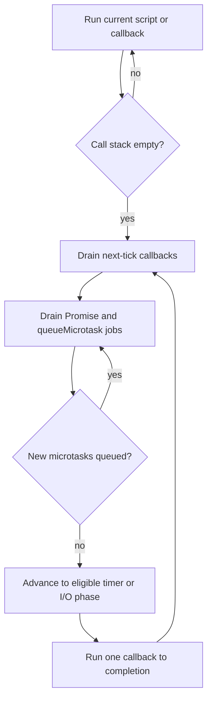

<TLDR>
  <TLDRCell label="what">
    调用栈为空时，事件循环会让 JavaScript 宿主开始执行已排队的工作。
  </TLDRCell>
  <TLDRCell label="trap">
    零延迟定时器并不会立即执行；Promise 处理器属于微任务，会在下一个定时器任务前运行。
  </TLDRCell>
  <TLDRCell label="fix">
    按边界推导顺序：先完成同步代码，再在检查点清空微任务，最后取出下一个任务。
  </TLDRCell>
</TLDR>

## 是什么，为什么存在

<Term id="event-loop">事件循环（event loop）</Term>负责协调 JavaScript 的执行与宿主安排的工作；这里的宿主是 Node.js。JavaScript 会在调用栈上把当前作业完整执行完毕；回调无法打断一个正在运行的调用栈。

Node 在调用栈之外处理定时器与 I/O，然后让相应回调进入适当的队列或阶段。只要代码使用 Promise、`async`/`await`、定时器、事件、流或网络 I/O，就会遇到这套模型。

它让 JavaScript 等待时，宿主仍能推进其他工作，而且不需要让每个回调都在单独的 JavaScript 线程上运行。

事件循环是宿主机制，不是 JavaScript 语法特性。ECMAScript 定义 Promise reaction 等作业，而 Node 和浏览器决定定时器、I/O、渲染及其他宿主工作何时创造执行这些作业的机会。

这里的并发是指等待中的操作可以重叠，并不表示两个普通 JavaScript 回调会在同一个事件循环线程上同时执行。一个回调会一直运行，直到返回，或遇到使异步函数暂停的 `await`。

这一区别会直接影响服务器和命令行工具。进程可以高效地同时等待数千个套接字，但只要一个回调执行长时间的同步计算，仍会推迟分配给该线程的所有就绪套接字、定时器和 Promise continuation。

## 工作原理

调用栈保存正在执行的函数。任务队列通常也叫宏任务队列，其中放着定时器到期后的回调等后续工作；实际上，Node 会把任务组织到事件循环的不同阶段及其队列中。

微任务队列保存 Promise reaction，以及通过 `queueMicrotask()` 排队的回调。<Term id="microtask">微任务（microtask）</Term>不会在进入队列的瞬间运行。

运行时首先让当前 JavaScript 操作执行完，使调用栈清空。进入微任务检查点后，它会先清空所有微任务，包括这些微任务新加入的微任务，然后才进入下一个任务。

因此，可以按下面的顺序理解：

1. 运行当前脚本或回调，直到调用栈为空。
2. 在检查点清空微任务队列。
3. 让 Node 推进事件循环的各个阶段，并选择已满足执行条件的任务工作。
4. 下一个回调结束后，再次执行微任务检查点。



定时器延迟是阈值，不是预约时间。阈值过去后，回调才有资格进入 timers 阶段；正在占用的调用栈、待处理微任务、操作系统调度以及其他阶段的工作，都可能使它更晚运行。

即使 Promise 在调用 `.then()` 之前已经兑现，其 reaction 仍使用微任务队列。因此，处理器会推迟执行，但通常早于下一个事件循环轮次中满足条件的任务级工作。

调用异步函数时，其函数体会同步运行到第一个真正使它暂停的 `await`。`await` 后的 continuation 成为 Promise 作业，所以周围的同步代码可以在它恢复前执行完。

Node 还提供 `process.nextTick()`，其队列会在 Promise 微任务队列之前清空。它是 Node 特有的调度机制，而不是可移植的 Promise 原语；递归安排 next-tick 回调可能让事件循环无法进入各个阶段。

## 示例

### 一个脚本，三条调度路径

<Depth level="quick">

```js run title="event-loop.js"
console.log("script:start");
console.log(1);
setTimeout(() => console.log(2));
Promise.resolve().then(() => console.log(3));
console.log(4);
queueMicrotask(() => console.log("microtask:queued"));
Promise.resolve().then(() => console.log("microtask:promise"));
setTimeout(() => console.log("timer:second"), 0);
console.log("script:end");
console.log("sync:complete");
```

```text
script:start
1
4
script:end
sync:complete
3
microtask:queued
microtask:promise
2
timer:second
```

</Depth>

输出遵循的是调度边界，不是源码顺序：

1. `console.log(1)` 在当前调用栈上同步运行。
2. `setTimeout()` 注册定时器；只有达到定时器阈值后，其回调才会成为可执行的任务工作。
3. Promise 已经兑现，所以 `.then()` 把处理器加入微任务队列，但当前脚本仍会先执行完。
4. `console.log(4)` 同步运行，随后调用栈清空，微任务输出 `3`，定时器回调再输出 `2`。

其他同步消息仍会先于所有延迟回调出现。三个微任务保持入队顺序，两个零阈值定时器在这次运行中也保持注册顺序。

省略延迟参数的定时器采用零毫秒阈值，但这并不允许它打断当前脚本。该结果已使用 Node 24 验证。

<TryToBreak items={['在第一个定时器中添加微任务', '把 Promise 注册移到 script:end 之后', '从 Promise 处理器中安排定时器']} />

### 检查点中新加入的微任务

```js run title="nested-microtasks.js"
console.log("task:start");
queueMicrotask(() => {
  console.log("microtask:A");
  queueMicrotask(() => {
    console.log("microtask:C");
  });
});
Promise.resolve().then(() => {
  console.log("microtask:B");
});
setTimeout(() => console.log("timer:next-task"), 0);
console.log("task:end");
```

```text
task:start
task:end
microtask:A
microtask:B
microtask:C
timer:next-task
```

`A` 与 `B` 在初始任务中进入队列，因此按先进先出的顺序运行。`A` 加入 `C` 时，宿主会把 `C` 追加到已经排队的 `B` 后面，而不是在 `A` 内部递归运行它。

检查点不会在处理完队列的初始内容后停止，而是继续执行到没有剩余微任务。这个规则便于完成短 Promise 链，但如果每个回调都无条件安排下一个回调，就会带来风险。

### I/O 回调内部的顺序

```js run title="io-phase-order.js"
const { readFile } = require("node:fs");

console.log("script:start");
readFile(process.execPath, () => {
  console.log("io:callback");
  setTimeout(() => {
    console.log("timer");
  }, 0);
  setImmediate(() => {
    console.log("immediate");
  });
  Promise.resolve().then(() => {
    console.log("io:microtask");
  });
});
console.log("script:end");
```

```text
script:start
script:end
io:callback
io:microtask
immediate
timer
```

文件读取在 JavaScript 调用栈之外完成。其 poll 阶段回调开始运行后，Promise reaction 会成为该回调之后最先执行的延迟工作；`setImmediate()` 在 check 阶段满足条件，新定时器则等待之后的 timers 阶段。

示例刻意选择了这个位置：Node 明确说明，从一次 I/O 循环内部同时安排二者时，immediate 会先于 timer。在顶层安排时，相对顺序可能取决于时机，因此可靠的教学示例不应声称存在普遍的顶层顺序。

### 在有界工作块之间让出

```js run title="chunked-work.js"
const records = ["A", "B", "C", "D", "E", "F"];

async function indexRecords(items) {
  for (let start = 0; start < items.length; start += 2) {
    const batch = items.slice(start, start + 2);
    console.log(`indexed:${batch.join(",")}`);
    if (start + 2 < items.length) {
      await new Promise((resolve) => setImmediate(resolve));
    }
  }
  return items.length;
}

console.log("index:start");
const result = indexRecords(records);
console.log("index:yielded");
result.then((count) => console.log(`index:done:${count}`));
```

```text
index:start
indexed:A,B
index:yielded
indexed:C,D
indexed:E,F
index:done:6
```

异步函数从同步执行开始，所以第一批记录出现在 `index:yielded` 之前。之后每个 `await` 都会暂停函数，直到 immediate 回调兑现 Promise，从而让其他事件循环工作有机会在各批之间运行。

只有每个工作块确实有界时，这种模式才能改善响应性。它不会把 CPU 工作移到另一个核心；如果计算本身必须并行，或单个工作块仍可能超过延迟预算，就应使用 worker thread。

## 陷阱

> [!PITFALL]
> 把 `setTimeout(callback, 0)` 当作“立即运行”，会让代码依赖 API 从未承诺的顺序。

**修复方法：** 把延迟看作最小阈值；如果一个操作依赖另一个操作，请用 Promise 链或 `await` 明确表达顺序。

> [!PITFALL]
> 递归的微任务链可以在队列清空过程中不断添加工作，让定时器与 I/O 回调一直没有执行机会。

**修复方法：** 限制任务链；其他事件循环工作需要推进时，使用合适的宿主 API 主动让出执行机会，进入下一个任务。

> [!PITFALL]
> 假定 `setTimeout(..., 0)` 一定在 `setImmediate()` 之前或之后运行，忽略了 Node 的阶段，以及二者在什么上下文中被调度。

**修复方法：** 只依赖文档明确保证的边界，不要把偶然的定时器顺序用作同步机制。

> [!PITFALL]
> 连续编写多个 `await` 可能把互不依赖的操作串行化，使原本可以避免的延迟变成用户可感知的等待。

**修复方法：** 先启动互不依赖的操作，再统一等待；根据所需的失败策略选择 `Promise.all`、`allSettled`、`any` 或 `race`。输入规模可能很大时，还要添加明确的并发上限。

> [!PITFALL]
> 把 CPU 密集循环放进异步函数并不会阻止它阻塞；到下一个暂停点之前的代码仍会占用事件循环线程。

**修复方法：** 协作式让出足够时，把工作拆成经过测量的有界块；持续计算则移到 worker thread。监测事件循环延迟，确认所选边界满足服务的延迟预算。

<Depth level="deep">

## Node 24 中的微任务检查点

Node 的事件循环包含定时器、待处理回调、轮询、检查和关闭回调等阶段；“宏任务队列”是便于理解的简化说法，并非 Node 中唯一的真实队列。Node 还维护一个位于 libuv 阶段图之外的 `process.nextTick()` 队列。

在 Node 24 中，Node 清空 next-tick 队列后，会立即清空 Promise 微任务队列。因此，在 CommonJS 顶层，next-tick 回调先运行；ES module 顶层本身已是微任务，所以那里的 `queueMicrotask()` 回调先运行。

这种随上下文变化的优先级意味着：即使 `queueMicrotask()` 与 `process.nextTick()` 都会延迟回调，用后者替换前者仍可能改变顺序。

Node 会在每个 JavaScript 回调返回后执行微任务检查点，而不只是在一次完整 libuv 轮次结束时执行一次。因此，I/O 回调中创建的 Promise reaction 会先于之后阶段的另一个就绪回调运行。

如果一小段后续工作需要在不相关的任务工作之前观察已经完成的同步状态，微任务很合适。但它不适合作为通用让出原语，因为清空微任务队列的优先级高于推进事件循环。

## 阶段、轮询与定时器

libuv 循环暴露的是多个阶段，而不是一个全局回调队列。timers 阶段运行符合条件的 timeout 与 interval 回调，poll 阶段接收许多 I/O 回调，check 阶段运行由 `setImmediate()` 注册的回调；pending 与 close 阶段负责其他生命周期工作。

当前 Node 版本使用的 libuv 从 1.45 起改为只在 poll 阶段之后运行 timers，而不再同时于其前后运行。这个实现变化再次说明，同步设计应依据 API 契约，而不是背诵旧教程中的阶段经验。

没有立即就绪的回调时，poll 阶段可以等待 I/O，但仍受定时器和其他必须推进的条件约束。健康的事件驱动服务器会把大量时间花在这里等待，而不是在字面意义上的忙循环中占用一个 CPU 核心。

interval 与 timeout 遵循相同的阈值语义。如果某个回调或微任务清空过程比间隔更长，Node 既不能倒转时间，也不能在同一线程上并行执行错过的回调；在意真实时间节奏的应用必须显式测量已经过去的时间。

## 异步函数与 Promise 作业

`await value` 在概念上通过 Promise 机制接纳 `value`，并把函数切分成多个片段。第一次暂停之前的片段在调用者的当前栈中运行，后续各片段则通过排队的 Promise 作业恢复。

即使等待一个已经兑现的 Promise，异步函数的剩余部分也不会内联恢复。这个确定的异步边界可以避免 continuation 重入当前调用栈，但也意味着不必要的 `await` 会带来顺序上的影响。

创建 Promise 本身不会使其 executor 异步执行。传给 `new Promise(...)` 的 executor 会立即运行；只有 reaction 属于作业，所以 executor 中昂贵的同步工作与其他函数中的昂贵工作一样会造成阻塞。

Promise 组合器会协调结束状态，但不会取消输入。某个 `Promise.all` 输入拒绝后，其他操作仍会继续，除非应用向它们传递 `AbortSignal` 或其他协作式取消机制。

## 公平性、延迟与背压

完整运行让局部推理成为可能，因为另一个回调无法在当前回调执行到一半时修改普通 JavaScript 状态。代价是协作式公平：每个回调都有责任在可接受的时间内交还控制权。

事件循环延迟衡量事件循环晚了多久才重新获得执行已调度工作的机会。它能反映同步 JavaScript、垃圾回收、主线程上的原生工作以及长回调突发造成的阻塞，比统计 `async` 关键字更有用。

每个极小操作后都让出会增加开销，只在巨大批次后让出则会损害尾延迟。应根据代表性负载下的测量选择工作块边界，并同时限制每块工作量和排队输入量。

背压补全了这套设计。如果生产者加入工作的速度超过一个事件循环线程或下游服务的处理速度，单纯让出只会使队列增长；应限制并发、暂停生产者、拒绝过量工作，或把工作持久化到专门承载该负载的系统中。

Worker thread 会在独立 isolate 中创建真正并行的 JavaScript 执行。它适合持续的 CPU 工作；数据的传输或共享必须明确，并应把消息大小和序列化成本纳入性能模型。

## 取消与资源生命周期

事件循环负责调度回调，并不会判断结果是否仍有人需要。如果 API 不接受取消信号，超时、外层 Promise 拒绝或客户端断开后，底层 I/O 和已排队的 continuation 仍可能存活。

`AbortController` 为许多 Node 与 Web API 提供通用的协作式边界。启动操作时传入其 signal，所有者结束时调用 abort；同时仍要处理随之产生的拒绝，避免取消变成未处理错误。

清除定时器只能阻止尚未开始的定时器回调。它无法回滚已经运行的回调所产生的副作用，也不会取消该回调之前启动的无关 Promise 工作。

如果资源无论兑现、拒绝还是取消后都必须清理，清理逻辑应放在 `finally` 中。关闭资源返回 Promise 时，清理也应保持异步，并在宣布所属操作完成前等待它。

所有权让规则变得具体：启动后台工作的组件应暴露或保留停止工作的手段。分离工作必须有明确的进程级所有者、错误接收点和关闭策略，而不能只丢弃一个 Promise。

## 跨调度边界的错误

同步 `try` 块返回后，无法捕获定时器回调稍后抛出的异常。回调需要自己的错误边界，或者异步 API 必须通过 Promise 暴露失败，并由调用者等待。

异步函数会把抛出的异常转成其返回 Promise 的拒绝。调用者既不等待 Promise，也不附加拒绝处理器时，失败就会逃出预期的请求或作业边界。

从 `.then()` 处理器返回 Promise，会把该 Promise 的结束状态接入调用链。在处理器中启动 Promise 却不返回或等待，会分离这项工作，使外层调用链过早报告成功。

运维代码应确定失败由哪一层记录、重试、转换，或允许其终止进程。添加一个只打印并吞掉错误的 catch 会改变语义，并可能让调用者误以为未完成的工作已经成功。

错误处理必须保留因果上下文。应通过显式状态或受支持的 async context 传递操作标识，并在边界转换错误时把原始错误附为 cause。

## 不依赖队列传说的诊断

先建立最小跟踪，记录当前回调、安排它的操作以及稳定标识，而不应只记录时间戳。重复运行可以暴露未写入文档的顺序，却不能把观察结果变成契约。

Node 的计时与性能 API 可以测量事件循环延迟和回调时长。应在代表性负载下收集分布；安静机器上的一次测量，无法说明垃圾回收或突发期间的尾延迟。

CPU profile 能识别占用线程的同步函数，async stack trace 能把许多 Promise continuation 连回起点。但当工作跨越进程、队列或 worker thread 时，两者都不能代替领域级跟踪。

内存增长时，应检查哪些存活的 handle、listener、timer 或 closure 仍使工作可达。事件循环没有退出往往是所有权问题的症状：仍被引用的 handle 表明进程还有工作。

先用调度术语提出假设，再设计可以证伪该假设的跟踪。“事件循环很慢”过于模糊；“这个回调阻塞主线程 80 ms”才指出了可测量、可修改的边界。

## 调度敏感代码的测试

测试应验证承诺的顺序，而不是偶然的毫秒数。测试应等待完成信号或观察有文档保证的队列边界，不应只睡眠足够长时间并寄希望于机器保持空闲。

Fake timer 适合定时器密集的业务规则，但可能只模拟选定的队列。把 fake clock 当作相对顺序证据前，要确认测试框架如何处理 Promise 微任务、immediate、next-tick 回调和 I/O。

依赖宿主阶段的行为至少应在真实 Node 运行时上保留一项集成测试。固定经过验证的主版本，使有意的运行时变化产生可审查的测试失败，而不是无法解释的生产漂移。

测试取消时，既要断言调用者可见的结果，也要断言清理副作用。如果套接字、定时器或 worker 之后仍在消耗资源，那么 Promise 很快拒绝也不够。

压力测试应限制输入并确定性结束。故意创建无限微任务链虽然能展示饥饿，却不是好的自动测试；固定长度的链加一个哨兵定时器可以证明相同顺序，又不会挂起测试套件。

## 浏览器宿主与可移植性

浏览器采用同样的完整运行与微任务思想，但会把任务来源同渲染机会、用户输入和文档生命周期结合。poll 与 check 等 Node 阶段名称并不描述浏览器调度器。

渲染通常只能在当前任务及其微任务完成后发生。因此，即使各个回调在 profile 中看起来都很短，一条庞大的微任务链仍会推迟绘制。

`setImmediate()` 与 `process.nextTick()` 是 Node 特有的。可移植库应优先使用 Promise、`queueMicrotask()`，并在明确的 adapter 边界选择平台 API；应用则可以为有文档依据的需求使用宿主特有原语。

浏览器中的 Worker 和 Node 中的 worker thread 各有自己的事件循环和全局环境。消息会跨过异步边界；共享内存需要有意同步，并不会使普通对象自动变成共享对象。

代码面向多个宿主时，公开契约应陈述所需顺序，而不是指定某个实现阶段。这样，测试就能依据同一可观察行为验证每个 adapter。

</Depth>

<Checkpoint id="javascript/event-loop" />

## 延伸阅读

- [Node.js：Node.js 事件循环](https://nodejs.org/learn/asynchronous-work/event-loop-timers-and-nexttick)
- [Node.js 24：`queueMicrotask()` 与 `process.nextTick()`](https://nodejs.org/docs/latest-v24.x/api/process.html#when-to-use-queuemicrotask-vs-processnexttick)
- [Node.js 24：定时器](https://nodejs.org/docs/latest-v24.x/api/timers.html)
- [MDN：JavaScript 执行模型](https://developer.mozilla.org/en-US/docs/Web/JavaScript/Reference/Execution_model)
- [MDN：使用 Promise](https://developer.mozilla.org/en-US/docs/Web/JavaScript/Guide/Using_promises#timing)
- [MDN：使用微任务](https://developer.mozilla.org/en-US/docs/Web/API/HTML_DOM_API/Microtask_guide)
