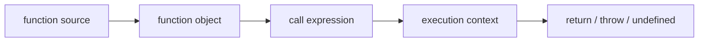

<TLDR>
  <TLDRCell label="what">
    JavaScript函数是可调用的一等值。函数把参数绑定到一次调用，执行函数体，再返回显式结果或`undefined`。
  </TLDRCell>
  <TLDRCell label="trap">
    声明与表达式的初始化时机不同；默认参数只处理`undefined`，普通函数的`this`还取决于调用形式。
  </TLDRCell>
  <TLDRCell label="fix">
    先写清输入、返回值、异常和回调契约，再选择函数形式；测试省略值、`undefined`、`null`与脱离对象的方法。
  </TLDRCell>
</TLDR>

## 是什么，为什么存在

JavaScript函数把一段行为包装成可调用对象。调用方通过实参提供本次运行的数据，函数通过返回值或明确的副作用交付结果。函数不是只能写在某个位置的语法片段，而是可以赋给变量、存入对象、作为实参传递并从其他函数返回的<Term id="first-class-function">一等函数（first-class function）</Term>。

函数解决的是行为复用与边界表达问题。一个命名准确的函数可以把“如何计算”藏在稳定接口后面，让调用方只关心输入、输出和失败方式。它也建立独立的局部作用域，避免临时名称泄漏到外部代码。

函数声明、传统函数表达式和箭头函数都会产生函数值，但它们不是可以随意互换的排版风格。声明的初始化时机不同；箭头函数没有自己的`this`、`arguments`，也不能用于构造调用。选择形式时应看调用契约，而不是只看哪一种最短。

形参（parameter）写在函数定义中，实参（argument）出现在调用表达式里。一次调用会把实参按位置绑定到<Term id="parameter">形参</Term>；实参数量不必与形参数量相等。遗漏的形参得到`undefined`，多余实参只有在函数主动读取时才会影响行为。

函数还让行为本身成为数据。接收函数或返回函数的<Term id="higher-order-function">高阶函数（higher-order function）</Term>可以组合校验、转换和策略，而不用把每种变化写进条件分支。传入的函数通常称为回调，但回调的参数、返回值、调用次数和错误处理都必须由调用方API明确定义。

你会在事件处理、数组转换、路由处理器、定时任务、测试替身和依赖注入中遇到函数。闭包、箭头函数细节以及`call`、`apply`、`bind`的完整规则各有独立主题；这里关注所有这些用法共同依赖的函数基础。

## 工作原理

函数代码求值后会得到函数对象。函数对象保存可执行代码及其创建位置的<Term id="lexical-environment">词法环境（lexical environment）</Term>引用，并具有独立标识；两段源码看起来相同，不代表两个函数对象相等。把函数赋给另一个变量只复制对象引用，不会复制函数体。

调用表达式先求值被调用者与实参。运行时随后创建本次调用的执行上下文，建立形参和局部绑定，并按函数种类与调用形式确定`this`。函数体执行到`return`、抛出异常或走到末尾后，本次调用结束。



图中的每次`call expression`都创建新的形参和局部绑定。函数对象可以被反复调用，但不同调用不会共享普通局部变量。若函数需要跨调用保留状态，状态必须位于外部对象、模块绑定或闭包中。

### 创建函数与绑定名称

函数声明在所在作用域实例化时创建并初始化绑定，所以同一作用域内的代码通常可以在声明文本之前调用它。这个常被简称为“函数提升”，但关键事实是绑定已经持有函数对象，而不只是名称被提前登记。

函数表达式只负责产生函数值，外层绑定何时可用取决于承载它的声明。`const calculate = function () {}`中的`calculate`从作用域开始就存在于暂时性死区，但要执行到初始化语句后才能读取。把这种行为笼统说成“函数表达式不会提升”会掩盖真正的失败原因。

具名函数表达式在自己的函数体内提供内部名称，适合递归，也会改善诊断名称。这个内部名称通常不会泄漏到外层作用域。匿名表达式和箭头函数则常从赋值目标推断`name`。

| 形式 | 外层名称何时可调用 | 自己的`this` | 可用`new`调用 |
| --- | --- | --- | --- |
| `function load() {}` | 作用域实例化后 | 是 | 普通声明通常可以 |
| `const load = function () {}` | 初始化语句之后 | 是 | 普通表达式通常可以 |
| `const load = () => {}` | 初始化语句之后 | 否 | 不可以 |

表格描述的是普通函数，不涵盖生成器、异步函数、类方法和绑定函数的全部组合。不要通过猜测`prototype`属性来判断任意值是否可构造；若API要求构造器，应把这一点写进契约并直接测试。

### 绑定形参与实参

调用时，实参表达式先从左到右求值，然后绑定到形参。默认形参初始化器也按从左到右的顺序处理，因此后面的默认值可以引用前面的形参。初始化器在每次调用时运行，不是在函数定义时运行。

只有实参缺失或值严格为`undefined`时，默认值才会生效。`null`、`false`、`0`与空字符串都是已提供的值，不会触发默认形参。若业务上把`null`也视为缺失，函数必须显式归一化。

剩余形参会把尚未绑定的实参收集到真正的数组中，并且必须位于形参列表末尾。它比旧式`arguments`更明确，因为名称表达用途，也能直接使用数组方法。箭头函数没有自己的`arguments`，而`arguments`的旧式别名行为还会受严格模式和形参形式影响。

解构形参先要求外层值可解构，再处理模式内部的默认值。`function read({ id }) {}`在无实参或传入`undefined`时会抛出`TypeError`；写成`function read({ id } = {}) {}`才覆盖整个对象缺失的情况。模式内部的`id = 'draft'`只处理属性值为`undefined`的情况。

| 调用情况 | 普通形参 | 有默认值的形参 | 剩余形参 |
| --- | --- | --- | --- |
| 实参缺失 | `undefined` | 求值默认表达式 | 不加入数组 |
| 实参是`undefined` | `undefined` | 求值默认表达式 | 收集`undefined` |
| 实参是`null` | `null` | `null` | 收集`null` |
| 多余实参 | 没有对应绑定 | 没有对应绑定 | 收集剩余值 |

### 完成调用

`return expression`先求值表达式，再立即结束当前函数调用。单独的`return`与执行到函数体末尾都会产生`undefined`。调用方应区分“命令型函数刻意不返回结果”与“函数漏写返回值”，因为运行时看到的值相同。

JavaScript会在受限位置插入分号。`return`后紧跟换行时，返回语句已经结束，下一行的对象字面量不会成为返回值。返回多行表达式时，把表达式起始符号放在`return`同一行，或用括号明确包裹。

抛出异常会跳过普通返回路径，沿调用栈寻找匹配的处理器。函数契约应说明哪些失败通过返回值表达，哪些会抛出异常；混用`null`、错误对象和异常会迫使每个调用方猜测。

`async function`每次调用都会返回Promise，即使源码写的是`return 3`。普通回调API不会因为收到异步函数就自动等待它。异步控制流的并发与错误传播规则属于`javascript/async-await`和`javascript/promises`。

### 调用形式决定接收者

普通函数的`this`不是在定义处固定的。`object.method()`把点号左侧对象作为接收者；把同一个函数取出后执行`detached()`，接收者规则已经改变。严格模式下的普通独立调用会得到`undefined`。

`call`、`apply`和`bind`可以显式提供普通函数的接收者。箭头函数改为从外层捕获`this`，所以这些方法不能替换箭头函数的`this`。若函数完全不使用`this`，优先把依赖作为普通形参传入，契约会更容易看懂和测试。

方法取出后仍是同一个函数对象，但它不会记住原对象。事件订阅等API还会按函数标识移除回调，因此临时创建两次包装器或绑定函数也会失败。详细优先级和修复模式见`javascript/this-binding`与`javascript/call-apply-bind`。

## 示例

下面四个示例依次验证名称初始化、参数边界、函数值组合和调用点接收者。所有输出都来自本地`Node 24`执行对应文件。

### 声明与表达式的初始化时机

函数声明`formatOrder`可以在源码声明之前调用。`calculateTotal`的`const`绑定则仍在暂时性死区，第一次读取会抛出`ReferenceError`；初始化之后，同一个绑定正常工作。

<Depth level="quick">

```javascript run title="declaration_vs_expression.js"
console.log(formatOrder('A7'));

function formatOrder(orderId) {
  return `order:${orderId}`;
}

try {
  console.log(calculateTotal([12, 8]));
} catch (error) {
  console.log(error.name);
}

const calculateTotal = function total(lineTotals) {
  return lineTotals.reduce((sum, amount) => sum + amount, 0);
};

console.log(calculateTotal([12, 8]));
console.log(calculateTotal.name);
```

```text
order:A7
ReferenceError
20
total
```

<TryToBreak items={['把const初始化移到第一次调用之前', '删除函数表达式的内部名称total', '向calculateTotal传入空数组']} />

</Depth>

输出中的`total`来自具名函数表达式的内部名称。外部变量仍叫`calculateTotal`，两者服务于不同目的：外部名称用于取得函数值，内部名称用于函数体自引用与诊断。

这里捕获错误只是为了同时展示初始化前后的行为。生产代码不应把暂时性死区当作分支机制；应调整声明位置，或在确实需要提前调用时选择函数声明。

### 默认值、解构与剩余实参

`summarizeOrder`为整个对象形参和对象属性分别提供默认值。剩余形参`amounts`是数组，因此空输入也能用初始值`0`安全归约。

```javascript run title="parameter_contracts.js"
function summarizeOrder({ id, currency = 'EUR' } = {}, ...amounts) {
  const total = amounts.reduce((sum, amount) => sum + amount, 0);
  return `${id ?? 'draft'}: ${currency} ${total.toFixed(2)}`;
}

const regularOrder = summarizeOrder({ id: 'A-42' }, 10, 5.5);
const omittedCurrency = summarizeOrder({ id: 'B-7', currency: undefined }, 4);
const nullCurrency = summarizeOrder({ id: 'C-9', currency: null }, 4);
const draftOrder = summarizeOrder();

console.log(regularOrder);
console.log(omittedCurrency);
console.log(nullCurrency);
console.log(draftOrder);
```

```text
A-42: EUR 15.50
B-7: EUR 4.00
C-9: null 4.00
draft: EUR 0.00
```

第二次调用显式传入`undefined`，所以属性默认值仍会运行。第三次调用保留`null`，证明默认形参不是通用的空值合并机制。若`null`不符合领域契约，应在入口校验并拒绝或归一化它。

整个对象的`= {}`只保护无实参和`undefined`。传入`null`时仍无法解构。调用边界测试应把省略、`undefined`和`null`当作三个独立用例。

### 把函数作为策略传递

`pipe`接收初始值与任意数量的步骤函数。每一步的返回值会成为下一步的实参，因此步骤的输入输出类型必须首尾相接。

```javascript run title="higher_order_pipeline.js"
function pipe(value, ...steps) {
  return steps.reduce((current, step) => step(current), value);
}

const addTax = (amount) => amount * 1.2;
const roundCents = (amount) => Math.round(amount * 100) / 100;
const formatEuros = (amount) => `EUR ${amount.toFixed(2)}`;

const total = pipe(80, addTax, roundCents, formatEuros);

console.log(total);
console.log(typeof addTax);
console.log(addTax === ((amount) => amount * 1.2));
```

```text
EUR 96.00
function
false
```

`pipe`是高阶函数，三个步骤则是普通函数值。最后一行创建了新的箭头函数对象；即使源码行为相同，它与`addTax`也不是同一标识。

这个简化管道只处理同步返回值，并让异常直接向上传播。不要在没有定义Promise、错误与取消语义的情况下，把异步步骤塞进同一个接口。

### 保留调用点接收者

同一个`formatId`函数先作为方法调用，再作为独立函数调用。严格模式下，独立调用的`this`是`undefined`，读取`this.id`因此抛出`TypeError`。

```javascript run title="call_site_receiver.js"
'use strict';

function formatId(prefix) {
  return `${prefix}-${this.id}`;
}

const invoice = { id: 7, formatId };
console.log(invoice.formatId('INV'));

const detached = invoice.formatId;
try {
  console.log(detached('INV'));
} catch (error) {
  console.log(error.name);
}

const fixed = detached.bind({ id: 8 });
console.log(fixed('RET'));
```

```text
INV-7
TypeError
RET-8
```

`bind`返回新的函数对象，并永久保存这里提供的接收者。若后续要注销回调，应保存这个返回值并在注册与注销时使用同一个引用。

若格式化逻辑不需要方法语义，更简单的接口是`formatId(id, prefix)`。显式形参消除了隐藏接收者，也让函数可以安全地直接传给多数回调API。

## 陷阱

> [!PITFALL]
> **把函数声明机械改成`const`箭头函数。** 生成式重构常保留函数体，却改变初始化时机、`this`、`arguments`和可构造性；原本可在声明前调用的启动代码可能立即失败。

**修复方法：** 先列出调用点与函数依赖的能力。只有确认不存在提前调用、动态接收者、`arguments`或构造调用后，才把形式替换成箭头函数，并运行覆盖这些契约的测试。

> [!PITFALL]
> **把默认形参当作所有空值的默认值。** `value = fallback`只在值为`undefined`时运行；API返回`null`时，函数会继续接收`null`，随后可能在字符串或数字操作处失败。

**修复方法：** 明确区分“省略”与“显式无值”。只把`undefined`视为省略时使用默认形参；两者含义相同时，在入口使用经过评审的空值归一化，并保留`0`、`false`与空字符串等合法值。

> [!PITFALL]
> **块体箭头函数漏写`return`。** 从`item => item.id`改成`item => { item.id }`后，花括号表示函数体，不是对象或隐式返回；每次调用都会得到`undefined`。

**修复方法：** 单表达式保留表达式体，复杂逻辑则写出`return`。返回对象字面量时使用`item => ({ id: item.id })`，并测试真实返回值，而不只断言回调被调用。

> [!PITFALL]
> **把`arguments`当作普通数组或箭头函数的局部值。** `arguments.map(...)`不存在；箭头函数读取的`arguments`来自外层，可能悄悄使用完全不同的一次调用。

**修复方法：** 新代码优先声明`...args`。剩余形参给出真正数组和明确名称，也不会触发简单形参在非严格旧代码中的别名规则。

> [!PITFALL]
> **把依赖`this`的方法直接作为回调传递。** `queue.add(service.handle)`只传递函数对象，不携带`service`；稍后普通调用时，接收者已经丢失。

**修复方法：** 使用`event => service.handle(event)`明确转发，或只绑定一次并保存结果。需要移除监听器时，注册与移除必须使用同一个函数标识。

<Depth level="deep">

## 默认形参拥有独立初始化环境

非简单形参列表包含默认值、解构或剩余形参。规范会为形参初始化建立环境，再进入函数体的词法声明环境。这解释了几个只靠“局部作用域”不足以预测的边界行为。

后面的默认初始化器可以读取已经初始化的前置形参，例如`function range(start, end = start) {}`。前面的初始化器不能读取仍在暂时性死区的后置形参。默认初始化器还能调用外部绑定，但不能读取只在函数体内声明的`let`、`const`或函数声明。

每次调用都会重新求值需要的默认表达式。`function collect(items = []) {}`因此为每次省略实参的调用创建新数组，不会像某些语言那样跨调用共享一个定义期容器。若调用方显式传入同一个数组，别名共享仍由调用方负责。

默认初始化器可以执行任意JavaScript，包括调用函数和产生副作用。复杂初始化会让调用顺序与失败点变得隐蔽。需要校验、日志或异步准备时，把它们放进函数体并明确分步通常更容易审查。

解构模式有两层缺失处理。外层默认值决定整个实参为`undefined`时用什么对象，属性默认值决定对应属性为`undefined`时用什么值。两层都不会自动接受`null`，也不会验证属性类型。

## `name`与`length`是描述信息

函数对象的`name`常来自显式名称，也可能由赋值目标、属性定义或默认导出推断。它对堆栈和诊断有帮助，但压缩器、包装器和绑定操作都可能改变它。业务逻辑不应根据`function.name`选择权限、路由或序列化格式。

函数的`length`表示第一个带默认值形参之前的形参数量；剩余形参不计入。它不是必填实参数量，也不会考虑运行时校验、解构属性或TypeScript类型。用它自动判断回调能力通常会误判。

| 定义 | `name`的典型值 | `length` |
| --- | --- | --- |
| `function save(a, b) {}` | `save` | `2` |
| `const save = function (a, b = 0) {}` | `save` | `1` |
| `const save = (...items) => {}` | `save` | `0` |
| `function save({ id }) {}` | `save` | `1` |

函数的自有属性描述符与内建属性还有更多细节，但公开API不应依赖这些启发式信息。若框架需要依赖注入、验证或路由元数据，应使用显式配置、稳定标记或约定良好的包装器。

## 可调用不等于可构造

所有这里讨论的函数值都可以用普通调用语法，但并非所有函数都实现构造行为。普通函数声明和传统函数表达式通常可以与`new`一起使用；箭头函数和方法定义不可以。异步函数与生成器也不是普通构造器。

构造调用会创建新对象，并把它作为普通构造函数体内的`this`。若构造函数显式返回对象，该对象可以替代新建结果；返回原始值则不会替代。这个特殊返回规则是构造器契约的一部分，不应混进普通业务函数。

不要用捕获`TypeError`的方式在生产路径上探测任意函数是否可构造，也不要把是否存在自有`prototype`当作完整答案。绑定函数等情况会让表面属性与目标能力分离。要求构造器的API应接收明确登记的构造器，并在测试中实际执行预期构造路径。

类语法让构造意图更清楚，而且类不能在没有`new`的情况下普通调用。需要实例方法、继承或多个状态操作时，类通常比同时充当普通函数与构造器的旧式写法更明确。

## 选择函数形式

选择函数形式时，先确定名称生命周期、接收者与构造能力。代码风格只能在这些语义约束之后决定。统一把所有函数改成同一种形式，会删除读者原本可以从语法看到的契约信号。

| 需求 | 合适的起点 | 需要确认的边界 |
| --- | --- | --- |
| 同一作用域内允许提前调用 | 函数声明 | 是否真的需要这种初始化时机 |
| 作为值在某处初始化 | 函数表达式或箭头函数 | 读取发生在初始化之后 |
| 递归且不依赖外层变量名 | 具名函数表达式 | 内部名称不泄漏到外层 |
| 捕获外层`this`的短回调 | 箭头函数 | 不需要动态接收者或`new` |
| 对象公开行为 | 方法定义 | 脱离对象传递时如何保留接收者 |

普通函数也可以完全不使用`this`。这种情况下，函数声明与传统函数表达式的主要差异是绑定与初始化方式。阅读代码时应检查函数体和调用点，不要从`function`关键字单独推断它一定是方法或构造器。

箭头函数的表达式体适合短转换，但长度不是选择它的核心理由。词法`this`、没有自己的`arguments`、不能构造才是语义差异。更完整的规则和迁移陷阱见相关的箭头函数主题。

## 测试函数契约

函数测试应从公开契约开始：给定输入，返回什么，改变什么，抛出什么。只验证“函数被调用”无法发现漏写`return`、参数错位或回调返回值被忽略。对纯计算应断言结果，对命令型函数则断言明确的可观察副作用。

为可选输入分别测试省略实参、显式`undefined`、`null`、错误类型与合法假值。解构形参还要测试整个对象缺失、属性缺失和嵌套对象缺失。这样才能验证默认值究竟位于正确层级。

接收者相关测试至少要覆盖预期的方法调用与脱离对象的调用。若API保存回调，还要覆盖注册、触发、移除、再次触发的完整生命周期，并证明移除使用同一函数标识。

高阶函数测试应使用能记录参数和调用次数的简单替身。断言回调收到哪些实参、按什么顺序运行、返回值如何被消费，以及异常是否传播。对于异步回调，再明确API是串行等待、并发等待还是完全不等待。

最后，测试函数值的创建位置是否符合所有权预期。在循环或渲染路径中反复创建新函数可能破坏按标识去重或移除的协议；过度复用同一个闭包又可能共享本应隔离的状态。这里需要验证的是生命周期，不是笼统追求更少分配。

## 函数标识也是契约

变量别名不会创建新函数。执行`const alias = handler`后，`alias === handler`为`true`，两个名称可以互换用于按标识匹配的注册表。只有再次求值函数表达式、箭头函数、`bind`或包装器时，才会产生新的函数对象。

按标识保存回调的API要求调用方管理这个对象的生命周期。注册时内联写`event => handle(event)`很方便，但若移除API也需要函数值，代码必须先把包装器存入稳定绑定。再次写出相同源码不会找回原对象。

缓存函数对象并不意味着应把它提升到全局。函数可能通过闭包拥有请求、组件或租户级状态，过度复用会把所有权边界合并。稳定标识与正确隔离必须一起设计。

| 操作 | 是否保留标识 | 所有权影响 |
| --- | --- | --- |
| `const alias = handler` | 是 | 两个绑定引用同一对象 |
| `handler.bind(receiver)` | 否 | 新对象保存目标与接收者 |
| `(value) => handler(value)` | 否 | 新对象捕获当前词法环境 |
| 工厂再次返回内部函数 | 否 | 新对象通常拥有新的闭包状态 |

</Depth>

<Checkpoint id="javascript/functions" />

## 延伸阅读

- [MDN：函数参考](https://developer.mozilla.org/en-US/docs/Web/JavaScript/Reference/Functions)
- [MDN：默认形参](https://developer.mozilla.org/en-US/docs/Web/JavaScript/Reference/Functions/Default_parameters)
- [MDN：剩余形参](https://developer.mozilla.org/en-US/docs/Web/JavaScript/Reference/Functions/rest_parameters)
- [MDN：箭头函数](https://developer.mozilla.org/en-US/docs/Web/JavaScript/Reference/Functions/Arrow_functions)
- [ECMAScript规范：`OrdinaryCallBindThis`](https://tc39.es/ecma262/multipage/ecmascript-language-functions-and-classes.html#sec-ordinarycallbindthis)
