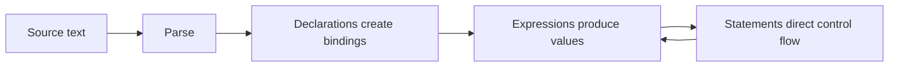

<TLDR>
  <TLDRCell label="what">
    JavaScript programs consist of declarations, expressions, and statements. At runtime, bindings locate values, while operators and control flow determine what happens to them.
  </TLDRCell>
  <TLDRCell label="trap">
    `const` doesn't freeze an object, and `typeof null` isn't a reliable object check. Implicit coercion can also make `+`, `==`, and fallback code behave unexpectedly.
  </TLDRCell>
  <TLDRCell label="fix">
    Prefer `const` and use `let` for reassignment. Convert and validate at input boundaries, then decide whether each comparison concerns a value or object identity.
  </TLDRCell>
</TLDR>

## What it is and why it exists

JavaScript fundamentals aren't a catalog of punctuation. They're the rules that explain how code evaluates: how names connect to values, which types those values have, when expressions convert them, and how statements select the next part of the program to run.

The same language core appears in browser scripts, Node services, tests, and build configuration. The browser DOM and Node file system are host APIs, not JavaScript syntax. Separating the language from its host tells you where a piece of code can actually run.

A declaration creates a binding in a <Term id="lexical-environment">lexical environment</Term>. A binding associates a name such as `cart` with its current value, which can be a primitive or an object. Reassignment changes the value in a binding; property mutation changes the state of the bound object. Those are different operations.

JavaScript is dynamically typed because a declaration doesn't fix the types of values its variable may later hold. Types belong to runtime values, not variable names. That flexibility makes code easy to compose, but it leaves external input, operator coercion, and nullable values for the program to handle explicitly.

This topic keeps the minimum model you need to read ordinary JavaScript. Functions, prototypes, array methods, and error boundaries have their own topics. Here, they appear only where they connect the language's basic rules.

## How it works

A JavaScript engine parses source and then runs statements in execution contexts. Each execution context is associated with a current lexical environment. Name lookup starts there and follows outer environments until it finds a binding or throws `ReferenceError`.



### Declarations and scope

Both `const` and `let` create block-scoped bindings. A `const` declaration must initialize its binding and can't reassign it later; a `let` binding can be reassigned. From the start of the block until its declaration executes, either binding is in the <Term id="temporal-dead-zone">temporal dead zone</Term>, and reading it throws `ReferenceError`.

`var` creates a function-scoped or global binding rather than a block-scoped one. Its declaration is hoisted and initialized to `undefined` before the declaration statement executes. That behavior can hide early reads and loop callback bugs, so new code generally needs only `const` and `let`. You still need to recognize `var` in existing code.

Source structure determines scope; the place that calls a function doesn't. Blocks, functions, and modules can introduce lexical environments. ECMAScript modules and class bodies also run in strict mode automatically. An ordinary script can opt in with a top-level `"use strict"` directive.

### Values and types

JavaScript has seven primitive types and the Object type. Functions and arrays are specialized objects. `null` is a primitive even though `typeof null` returns `"object"` for historical compatibility.

| Category | `typeof` result | Typical values | Boundary to remember |
| --- | --- | --- | --- |
| `undefined` | `"undefined"` | `undefined` | Often represents a missing value or absent result |
| Boolean | `"boolean"` | `true`, `false` | Conditions convert other values to Boolean |
| Number | `"number"` | `42`, `NaN`, `Infinity` | Uses IEEE 754 double-precision semantics |
| BigInt | `"bigint"` | `42n` | Can't mix directly with Number arithmetic |
| String | `"string"` | `"ready"` | Strings are immutable; methods produce new values |
| Symbol | `"symbol"` | `Symbol("id")` | Each ordinary construction produces a unique value |
| `null` | `"object"` | `null` | Test it with `value === null` |
| Object | `"object"` or `"function"` | `{}`, `[]`, functions | Equality compares identity by default |

Primitive values are immutable. Objects are mutable collections of properties. Several bindings can hold the same object value, so a property mutation through one alias is visible through the others. Spread syntax such as `{ ...source }` copies one level of own enumerable properties; it doesn't recursively copy nested objects.

`typeof` distinguishes most primitives and functions, but it isn't a general classifier. Use `Array.isArray(value)` for arrays and strict equality for `null`. When you need to identify an instance of a class, consider `instanceof` together with constraints such as cross-realm objects.

### Expressions, coercion, and control flow

An expression produces a value, as in `price * quantity`, a function call, or an assignment. Statements organize execution, as declarations, `if`, `for...of`, `return`, and `throw` do. A condition converts its value to Boolean, but `&&`, `||`, and `??` return a selected operand rather than necessarily returning a Boolean.

During <Term id="type-coercion">type coercion</Term>, an operator requests a number, string, or primitive according to its own rules. `+` performs either numeric addition or string concatenation. Once a step chooses concatenation, later results can drift from your intent. Boundary code should state its intent with `Number()`, `String()`, or `Boolean()`, then validate the converted result.

`===` doesn't coerce types, but it still compares objects by identity. `Object.is()` is mostly the same, except that it considers `NaN` equal to itself and distinguishes `+0` from `-0`. Loose equality, `==`, has exact rules but many conversion branches. Unless an interface deliberately depends on one of them, strict equality is easier to review.

<Term id="short-circuit-evaluation">Short-circuit evaluation</Term> decides whether the right expression runs. `left && right` stops when the left side is falsy, `left || right` stops when it is truthy, and `left ?? right` evaluates the right side only when the left is `null` or `undefined`. The distinction matters for valid values such as `0`, `false`, and an empty string.

### Property access and function calls

Dot and bracket notation both read object properties. `account.name` uses a property name fixed in source, while `account[field]` evaluates `field` and converts its result to a property key. Apart from Symbols, property keys are strings, so `record[1]` and `record["1"]` address the same property.

Reading a missing property produces `undefined`, but continuing with `undefined.city` throws `TypeError`. Optional chaining in `profile?.address` protects only the step marked with `?.`. It doesn't validate the object shape or make every later read in the chain safe.

A method call such as `receiver.method()` evaluates both a function and its receiver. `this` in an ordinary function depends on the call form, so extracting and then calling a method can lose its receiver. Arrow functions don't have their own `this`, but that doesn't make them mechanical replacements for every object method.

A function call evaluates the callee and arguments before creating a new execution context. Missing arguments have the value `undefined`. Extra arguments still evaluate even if the function doesn't read them. A default parameter also runs only for an `undefined` argument; it doesn't replace an explicit `null`.

These forms cover different boundaries:

| Form | Case it handles | What it doesn't do |
| --- | --- | --- |
| `object?.property` | Stops when `object` is nullish | Validate the type of `property` |
| `value ?? fallback` | Falls back when `value` is nullish | Replace other falsy values |
| `parameter = defaultValue` | Handles an omitted or `undefined` argument | Replace `null` |
| `Array.isArray(value)` | Detects whether a value is an array | Validate element shapes |

### Statements and abrupt completion

Statements usually complete in source order, but `return`, `throw`, `break`, and `continue` change the normal path. The specification describes these results as abrupt completions. They aren't ordinary expression values, and enclosing statements propagate or handle them according to their own rules.

`return` ends the current function call and produces `undefined` when it has no expression. `break` ends the nearest loop or `switch`; `continue` advances the nearest loop to its next iteration. Labels can change the target, but basic code rarely needs multiply nested labels.

`throw` can throw any JavaScript value, though application code generally throws an `Error` or subclass to preserve a message, stack, and error type. `try...catch` handles synchronous throws in its dynamic execution range. Promise rejection belongs to asynchronous control flow and must be observed with `await` or a rejection handler.

`finally` runs when control leaves `try` or `catch`, including `return` and `throw` paths. A `return` or `throw` inside `finally` replaces the previous completion, so returning from it is usually a defect. Keep `finally` for local cleanup that must happen, and the control flow remains easier to trace.

Read a control-flow path in this order:

1. Identify the selected branch and how its condition becomes a Boolean.
2. Find statements that end the current block, loop, or function early.
3. Check whether cleanup code replaces an earlier return value or error.
4. Keep tracing a returned Promise from an asynchronous call instead of looking only at the surrounding `try`.

This order turns syntax reading into an executable trace. For a complicated expression, naming intermediate values is usually clearer than compressing it further.

## Examples

### Bindings and object state

The first example separates reassignment from object mutation. The `status` binding changes. The `cart` binding stays fixed, but a property on its object can change.

<Depth level="quick">

```javascript run title="bindings-and-values.js"
const cart = { owner: "Lin", items: 2 };
const alias = cart;

cart.items += 1;

let status = "draft";
status = "ready";

const unitPrice = 19.5;
const quantity = 2;
const total = unitPrice * quantity;

console.log(status);
console.log(alias === cart, alias.items);
console.log(total);
```

```text
ready
true 3
39
```

</Depth>

`alias === cart` is `true` because both bindings hold the same object identity. `const cart` prevents assigning a different value to `cart`; it doesn't prevent `cart.items += 1`. The price and quantity are Numbers, so multiplication directly produces the numeric value `39`.

### Convert and validate at a boundary

Fields from a form, command-line arguments, or JSON may not have the types your business rules require. Convert and validate them together at the boundary so later code sees only a normalized object.

```javascript run title="normalize-order.js"
function normalizeOrder(input) {
  const quantity = Number(input.quantity);

  if (!Number.isInteger(quantity) || quantity < 1) {
    throw new RangeError("quantity must be a positive integer");
  }

  return {
    id: String(input.id),
    quantity,
    note: input.note ?? "(none)",
    expedited: Boolean(input.expedited),
  };
}

const order = normalizeOrder({
  id: 1042,
  quantity: "2",
  note: "",
  expedited: 0,
});

console.log(JSON.stringify(order));

try {
  normalizeOrder({ id: 1043, quantity: "two" });
} catch (error) {
  console.log(error.name, error.message);
}
```

```text
{"id":"1042","quantity":2,"note":"","expedited":false}
RangeError quantity must be a positive integer
```

`Number("2")` produces `2`, while `Number("two")` produces `NaN`, so the converted result needs a check. `??` preserves the valid empty note and supplies a default only for `null` or `undefined`. `Boolean(0)` explicitly produces `false`, though a real interface must still define which input forms it accepts.

### Process a collection with control flow

Small functions can process normalized data. This example iterates an array with `for...of`, skips inactive entries with `continue`, and returns a new object.

```javascript run title="cart-summary.js"
function summarizeCart(items) {
  let total = 0;
  const labels = [];

  for (const item of items) {
    if (!item.active) continue;

    total += item.price * item.quantity;
    labels.push(`${item.name} x${item.quantity}`);
  }

  return { labels, total };
}

const cart = [
  { name: "Notebook", price: 4.5, quantity: 2, active: true },
  { name: "Pen", price: 1.25, quantity: 3, active: false },
  { name: "Folder", price: 3, quantity: 1, active: true },
];

const { labels, total } = summarizeCart(cart);
console.log(labels.join(", "));
console.log(total.toFixed(2));
```

```text
Notebook x2, Folder x1
12.00
```

`total` uses `let` because it is accumulated. The `labels` binding is never reassigned, so it uses `const`. `toFixed(2)` returns the string `"12.00"`; it is suitable for display, but shouldn't be treated as a Number in later calculations.

### Defaults and equality boundaries

The last example puts three easily confused rules together: falsy defaults, `NaN` comparison, and object identity. Each output line demonstrates a different semantic choice.

```javascript run title="defaults-and-equality.js"
const preferences = {
  pageSize: 0,
  theme: null,
};

const pageSizeWithOr = preferences.pageSize || 20;
const pageSizeWithNullish = preferences.pageSize ?? 20;
const theme = preferences.theme ?? "system";

console.log(pageSizeWithOr, pageSizeWithNullish, theme);
console.log(NaN === NaN, Object.is(NaN, NaN));

const saved = { id: 7 };
const sameShape = { id: 7 };
const sameObject = saved;

console.log(saved === sameShape, saved === sameObject);
```

```text
20 0 system
false true
false true
```

`||` treats `0` as a falsy value to replace, while `??` preserves it. Two objects with matching properties still have different identities. If the business needs content equality, define which fields participate instead of expecting `===` to perform a deep comparison.

## Pitfalls

> [!PITFALL]
> Treating `const` as immutable data lets shared objects change inside code that looks safe. `Object.freeze()` is shallow too; it doesn't recursively freeze nested objects.

**Fix:** Review binding stability separately from data ownership. When an update must be immutable, construct a new object and test whether nested objects still share identity with the input.

> [!PITFALL]
> Using `value || fallback` for defaults replaces valid values such as `0`, `false`, and `""`. Generated pagination, retry, and feature-toggle code is particularly prone to this mistake.

**Fix:** Use `??` only when `null` and `undefined` mean missing. If `null` is invalid input, validate it instead of hiding it with a default.

> [!PITFALL]
> A check of only `typeof value === "object"` accepts `null`, arrays, and ordinary objects. A later property read throws on `null`, while an array may bypass an expected object-shape check.

**Fix:** Exclude `null`, then use `Array.isArray()` or check required properties according to the contract. A type tag narrows possibilities; it doesn't validate input by itself.

> [!PITFALL]
> Treating `Number(input)` as validation accepts an empty or whitespace-only string because either converts to `0`. `parseInt("12px", 10)` also accepts a prefix and ignores trailing characters.

**Fix:** Define the input grammar first, then convert and check the result. If you need a complete decimal string, validate the entire text instead of relying on permissive prefix parsing.

> [!PITFALL]
> Relying on an object's truthiness says nothing about its contents because empty arrays and empty objects are truthy. `if (items)` doesn't prove that an array contains an item.

**Fix:** Check the business condition, such as `Array.isArray(items) && items.length > 0`. State the required constraints separately for strings, numbers, and objects.

## In the AI era

**What generated code gets wrong here**

Models often describe `const` as deep immutability, object spread as a deep copy, or `typeof value === "object"` as complete validation. Generated fallback code also applies `||` mechanically to page sizes, volume levels, and Boolean switches, silently replacing valid falsy values. Another concrete failure is converting user input with `Number()` but forgetting to reject `NaN`, whitespace-only text, or numbers outside the business range.

**Ask your AI to check**

- List every mutable object held by a `const` binding, then trace its aliases and nested object identities.
- For every implicit or explicit conversion, tabulate the results for `null`, `undefined`, `""`, `"  "`, `0`, `false`, and `NaN`.
- Mark every `||`, `??`, `==`, `===`, and `typeof`, and name the exact semantic rule the code relies on.

**Review checklist**

- Run boundary tests with valid falsy values and missing values; confirm that fallbacks don't replace valid input.
- Mutate a nested object in a shallow copy and verify whether the original input stays unchanged as required.
- Test numeric input with valid text, whitespace, non-numeric text, negative values, and range boundaries.

**Prompt vocabulary**

Use the exact terms `lexical binding`, `temporal dead zone`, `primitive value`, `object identity`, `type coercion`, `truthy/falsy`, `short-circuit evaluation`, and `nullish coalescing`. Ask for an expression-by-expression evaluation trace and a boundary-input table. A vague request to "check the JavaScript basics" rarely exposes the semantic mistake.

<Depth level="deep">

## Values, references, and equality

ECMAScript specifies observable behavior for values and objects; it doesn't require an implementation to use a fixed "primitives on the stack, references on the heap" layout. Calling every object a "reference type" can be a convenient shortcut, but it suggests that assignment and parameter passing use another mechanism. A more accurate model is that every expression produces a value, and object values have identity.

After assigning a primitive to another binding, both bindings hold an immutable value. Reassigning one doesn't affect the other. After assigning an object value to another binding, both refer to the same object identity. Property mutation is visible through either, but reassigning one binding to a new object doesn't change the other binding.

Function arguments are passed by value as well. When the argument is an object, the passed value lets the parameter and caller access the same object, so the function can mutate its properties. Reassigning the parameter to another object doesn't reassign the caller's variable. The phrase "an object reference is passed by value" avoids the false expectations created by "pass by reference."

Define the question before choosing an equality operation. Use `===` for most primitive business values, `Number.isNaN()` to detect `NaN`, and `Object.is()` when you need SameValue semantics. Object content equality needs domain rules because dates, array order, missing properties, `undefined`, Symbol keys, and cycles can all affect the answer.

## How expressions choose conversions

Abstract conversion isn't random. Conditions, arithmetic operators, relational comparison, and concatenation each request particular forms. The difficulty comes from operators that can enter different branches and from object-to-primitive conversion, which may call `Symbol.toPrimitive`, `valueOf()`, or `toString()`.

`+` exposes the branching most clearly. Its operands first become primitives. If either result is a string, the operation concatenates strings; otherwise it performs numeric addition. Evaluation proceeds left to right, so `1 + 2 + "3"` is `"33"`, while `"1" + 2 + 3` is `"123"`.

Relational comparison also depends on operand types. `"10" < "9"` compares strings and is `true`; `"10" < 9` enters numeric comparison and is `false`. Instead of memorizing isolated curiosities, normalize types as data enters the system so core logic doesn't keep revisiting conversion branches.

Loose equality contains some useful but narrow rules, such as `null == undefined` being `true`. The cost is that a reviewer must prove the code depends only on the intended branch and excludes outcomes such as `"" == 0`. Both `value === null || value === undefined` and `value == null` can express a nullish test. Pick one team convention and keep the boundary contract explicit.

Strict mode doesn't change those coercion rules. It turns some silent failures into exceptions and forbids older behavior such as accidental globals, but it can't replace validation, an immutability policy, or strict equality. Modules already run in strict mode, so don't attach unrelated safety claims to a redundant directive inside a module.

## Numbers and external text

JavaScript's Number type represents both integers and fractions, along with `NaN` and signed infinities. `typeof NaN` is still `"number"`, so a type check doesn't prove that a calculation produced a usable result. Use `Number.isFinite()` when you require a finite value, then add `Number.isInteger()` and business range checks when you require an integer.

Binary floating point can't exactly represent many decimal fractions. `0.1 + 0.2` isn't strictly equal to `0.3`; this isn't random or peculiar to JavaScript. Money systems commonly store an integer count of the smallest currency unit or adopt an explicit decimal fixed-point design, then format only for display.

`Number(text)` requires the whole text to fit its conversion grammar, but treats whitespace-only text as `0`. `parseInt()` and `parseFloat()` accept a parsable prefix. That makes them suitable when prefix parsing is intentional, not as automatic validators for complete fields. Their names alone don't make the operations interchangeable.

BigInt represents arbitrary-precision integers, but it can't mix directly with Number arithmetic. Converting an unsafe Number to BigInt can't restore precision already lost. An external large integer should enter as text and go directly to `BigInt(text)`, with conversion failure handled.

Choose numeric checks from the requirement:

| Requirement | Check after conversion | Still define |
| --- | --- | --- |
| Finite measurement | `Number.isFinite(value)` | Units and allowed range |
| Integer quantity | `Number.isInteger(value)` | Sign and upper bound |
| Safe integer identifier | `Number.isSafeInteger(value)` | Leading zeros and text grammar |
| Arbitrary-precision integer | `BigInt(text)` with error handling | Sign, digit limit, and storage form |

String length and indexing operate on UTF-16 code units. One user-perceived character can occupy two units, and a composed character may include several Unicode code points. Built-in methods cover basic string work; truncating or counting user-perceived characters needs an explicit Unicode requirement.

## Objects and shallow copying

An object literal creates a new object with properties; an array literal creates an array with indexed properties and `length` behavior. Property lookup can continue along the prototype chain. `Object.hasOwn(object, key)` limits a check to the object's own properties, which matters when a business map must reject inherited entries.

Object spread and `Object.assign()` read enumerable own properties from a source. Reads can invoke getters, and the target receives ordinary data properties. Prototypes, non-enumerable properties, and most property descriptors aren't preserved. These operations project data; they aren't general-purpose object cloners.

A shallow copy preserves nested object identity. `const copy = { ...order }` creates a new outer object, but `copy.customer === order.customer` may still be `true`. Updating `copy.customer.name` is then visible through the original order as well.

`structuredClone()` can copy many built-in structures and handle cycles, but it isn't a universal operation for every value. Functions fail, while class-instance semantics and transfer behavior need separate consideration. Before choosing a copy operation, define which identities must be shared and which must be isolated.

Passing an object as a function argument doesn't copy it automatically. If a function promises not to mutate input, tests should preserve nested identities or freeze test data to catch an accidental write. Checking only whether the outer object remains strictly equal after the call doesn't prove that its contents stayed unchanged.

Across a trust boundary, constructing output from an allowlist is safer than spreading and deleting known secrets. A denylist leaks a newly added `token` or credential field by default. An allowlist also makes the returned shape correspond directly to the interface contract.

</Depth>

<Checkpoint id="javascript/fundamentals" />

## Further reading

- [MDN JavaScript guide: Grammar and types](https://developer.mozilla.org/en-US/docs/Web/JavaScript/Guide/Grammar_and_types)
- [MDN JavaScript guide: Expressions and operators](https://developer.mozilla.org/en-US/docs/Web/JavaScript/Guide/Expressions_and_operators)
- [MDN JavaScript guide: Control flow and error handling](https://developer.mozilla.org/en-US/docs/Web/JavaScript/Guide/Control_flow_and_error_handling)
- [ECMAScript specification: Executable code and execution contexts](https://tc39.es/ecma262/multipage/executable-code-and-execution-contexts.html)
