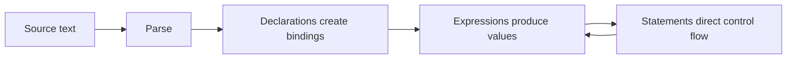

<TLDR>
  <TLDRCell label="what">
    JavaScript 程序由声明、表达式和语句组成；运行时通过绑定找到值，再按运算符和控制流规则处理这些值。
  </TLDRCell>
  <TLDRCell label="trap">
    `const` 不会冻结对象，`typeof null` 也不是可靠的对象判断。隐式类型转换还会让 `+`、`==` 和默认值代码产生意外结果。
  </TLDRCell>
  <TLDRCell label="fix">
    默认用 `const`，需要重新赋值时用 `let`；在输入边界显式转换并验证，比较时先明确要比较的是值还是对象标识。
  </TLDRCell>
</TLDR>

## 是什么，为什么存在

JavaScript 基础不是一份语法符号清单，而是一组解释代码如何求值的规则。名称怎样关联到值、值有什么类型、表达式何时转换类型，以及语句怎样决定下一步执行位置，这些规则共同决定一段程序的行为。

你在浏览器脚本、Node 服务、测试和构建配置中都会遇到同一套语言核心。浏览器的 DOM 和 Node 的文件系统属于宿主 API，不是 JavaScript 语法本身。先分清语言与宿主，才能判断一段代码究竟可以在哪个环境运行。

声明会在一个<Term id="lexical-environment">词法环境（lexical environment）</Term>中创建绑定。绑定把 `cart` 这样的名称关联到当前值；值可以是原始值，也可以是对象。重新赋值改变绑定中的值，修改对象属性则改变绑定所指对象的状态，两者不是一回事。

JavaScript 需要动态类型，因为变量声明不固定以后能保存的值类型。类型属于运行时的值，不属于变量名称。这使代码适合快速组合，但也意味着外部输入、运算符转换和可空值必须由程序明确处理。

本主题覆盖读懂普通 JavaScript 所需的最小模型。函数细节、原型、数组方法和错误边界各有独立主题；这里保留它们在基础程序中的连接点，不重复完整 API 目录。

## 工作原理

JavaScript 引擎先解析源码，再在执行上下文中运行语句。每个执行上下文都关联当前词法环境，名称查找从当前环境开始并向外继续，直到找到绑定或抛出 `ReferenceError`。



### 声明与作用域

`const` 和 `let` 都创建块级绑定。`const` 必须在声明时初始化，此后不能重新赋值；`let` 可以重新赋值。两者从块开始到声明执行前都处于<Term id="temporal-dead-zone">暂时性死区（temporal dead zone）</Term>，提前读取会抛出 `ReferenceError`。

`var` 创建函数作用域或全局作用域绑定，而不是块级绑定。它的声明会被提升，并在执行声明语句前初始化为 `undefined`。这个行为会隐藏提前读取和循环回调中的错误，所以新代码通常只需要 `const` 与 `let`；阅读旧代码时仍必须认识 `var`。

作用域由源码结构决定，不由函数从哪里调用决定。块、函数和模块都可以引入新的词法环境。ECMAScript 模块与类主体还会自动采用严格模式；普通脚本可以用顶部的 `"use strict"` 指令启用严格模式。

### 值与类型

JavaScript 有七种原始类型，以及对象类型。函数和数组都是对象的专门形式；`null` 是原始值，尽管 `typeof null` 因历史兼容原因返回 `"object"`。

| 类别 | `typeof` 结果 | 典型值 | 要记住的边界 |
| --- | --- | --- | --- |
| `undefined` | `"undefined"` | `undefined` | 缺少值或未初始化结果常用它表示 |
| Boolean | `"boolean"` | `true`、`false` | 条件会把其他值转换成布尔值 |
| Number | `"number"` | `42`、`NaN`、`Infinity` | 使用 IEEE 754 双精度浮点语义 |
| BigInt | `"bigint"` | `42n` | 不能直接与 Number 混合算术运算 |
| String | `"string"` | `"ready"` | 字符串不可变，方法会产生新值 |
| Symbol | `"symbol"` | `Symbol("id")` | 每次普通构造都产生唯一值 |
| `null` | `"object"` | `null` | 判断它要用 `value === null` |
| Object | `"object"` 或 `"function"` | `{}`、`[]`、函数 | 相等比较默认比较对象标识 |

原始值本身不可变。对象是可变的属性集合，多个绑定可以保存同一个对象值，因此通过任一别名修改属性都会被其他别名看到。展开语法 `{ ...source }` 只复制一层自有可枚举属性，并不会递归复制嵌套对象。

`typeof` 适合区分大多数原始值和函数，但不是通用分类器。数组用 `Array.isArray(value)`，`null` 用严格相等判断；需要识别某个类的实例时，再根据跨 realm 等约束考虑 `instanceof`。

### 表达式、转换与控制流

表达式产生值，例如 `price * quantity`、函数调用或赋值。语句组织执行，例如声明、`if`、`for...of`、`return` 和 `throw`。条件位置会把值转换成布尔值，但 `&&`、`||` 与 `??` 返回选中的操作数，而不保证返回 Boolean。

发生<Term id="type-coercion">类型强制转换（type coercion）</Term>时，运算符会按自己的规则请求数字、字符串或原始值。`+` 既能数值相加，也能字符串拼接；若其中一步选择字符串拼接，后续结果很容易偏离预期。边界代码应先用 `Number()`、`String()` 或 `Boolean()` 表明意图，再验证转换结果。

`===` 不做类型转换，但对象仍按标识比较。`Object.is()` 与 `===` 大体相同，主要差别是它认为 `NaN` 与自身相同，并区分 `+0` 和 `-0`。宽松相等 `==` 有精确定义，却包含多条转换分支；除非接口明确依赖其中某条规则，否则严格相等更容易审查。

短路求值（<Term id="short-circuit-evaluation">short-circuiting</Term>）决定右侧表达式是否执行。`left && right` 在左侧为假值时停止，`left || right` 在左侧为真值时停止，`left ?? right` 只在左侧为 `null` 或 `undefined` 时执行右侧。这个差别对合法的 `0`、`false` 和空字符串尤其重要。

### 属性访问与函数调用

点号与方括号都读取对象属性。`account.name` 使用源码中固定的属性名，`account[field]` 会先求值 `field`，再把结果转换为属性键。除 Symbol 外的属性键都是字符串，所以 `record[1]` 与 `record["1"]` 指向同一个属性。

读取不存在的属性得到 `undefined`，但继续读取 `undefined.city` 会抛出 `TypeError`。可选链 `profile?.address` 只保护标有 `?.` 的那一步，不会验证对象形状，也不会让链中每个后续读取自动安全。

方法调用 `receiver.method()` 同时求值函数和接收者。普通函数体中的 `this` 取决于调用形式，因此把方法取出再调用可能失去接收者。箭头函数没有自己的 `this`，但这不意味着它能机械替代每个对象方法。

函数调用先求值被调用者与实参，再创建新的执行上下文。缺少的参数值为 `undefined`，多出的实参仍会求值，只是函数可以不读取它们。默认参数也只在对应实参为 `undefined` 时执行，不会替换显式传入的 `null`。

下面几种写法处理的边界不同：

| 写法 | 处理的情况 | 不会做的事 |
| --- | --- | --- |
| `object?.property` | `object` 为 nullish 时停止 | 验证 `property` 的类型 |
| `value ?? fallback` | `value` 为 nullish 时回退 | 替换其他假值 |
| `parameter = defaultValue` | 实参省略或为 `undefined` | 替换 `null` |
| `Array.isArray(value)` | 判断值是否为数组 | 验证元素形状 |

### 语句与突然完成

语句通常按源码顺序完成，但 `return`、`throw`、`break` 和 `continue` 会改变正常流程。规范把这类结果描述为突然完成；它们不是普通表达式值，外层语句必须按各自规则传播或处理它们。

`return` 结束当前函数调用，未提供表达式时返回 `undefined`。`break` 结束最近的循环或 `switch`，`continue` 跳到最近循环的下一轮。标签可以改变目标，但基础代码很少需要多层标签。

`throw` 可以抛出任何 JavaScript 值，不过应用代码通常抛出 `Error` 或其子类，以保留消息、堆栈和错误类型。`try...catch` 只捕获其动态执行范围内的同步抛出；Promise 拒绝属于异步主题，需要由 `await` 或拒绝处理器观察。

`finally` 会在离开 `try` 或 `catch` 时执行，包括 `return` 或 `throw` 路径。`finally` 自己的 `return` 或 `throw` 会覆盖此前的完成结果，因此在其中返回值通常是缺陷。把 `finally` 留给必须发生的局部清理，控制流会更容易追踪。

读控制流时，按以下顺序检查：

1. 确认进入了哪个分支，以及条件怎样转成 Boolean。
2. 找出会提前结束当前块、循环或函数的语句。
3. 检查清理代码会不会覆盖原返回值或错误。
4. 对异步调用继续追踪其返回的 Promise，而不是只看调用所在的 `try`。

这套顺序把语法阅读变成可执行的追踪。遇到复杂表达式时，先把中间值写成具名绑定，通常比继续压缩代码更清楚。

## 示例

### 绑定与对象状态

第一个例子区分重新赋值与对象修改。`status` 的绑定发生变化；`cart` 的绑定保持不变，但对象属性可以修改。

<Depth level="quick">

```javascript run title="bindings-and-values.js"
const cart = { owner: "Lin", items: 2 };
const alias = cart;

cart.items += 1;

let status = "draft";
status = "ready";

const unitPrice = 19.5;
const quantity = 2;
const total = unitPrice * quantity;

console.log(status);
console.log(alias === cart, alias.items);
console.log(total);
```

```text
ready
true 3
39
```

</Depth>

`alias === cart` 为 `true`，因为两个绑定保存同一个对象标识。`const cart` 只禁止把 `cart` 重新赋成另一个值，不禁止 `cart.items += 1`。价格和数量都是 Number，所以乘法直接得到数值 `39`。

### 在边界转换并验证

来自表单、命令行参数或 JSON 的字段可能不符合业务需要的类型。转换和验证应该紧挨在边界处完成，让后续代码只处理已经规范化的对象。

```javascript run title="normalize-order.js"
function normalizeOrder(input) {
  const quantity = Number(input.quantity);

  if (!Number.isInteger(quantity) || quantity < 1) {
    throw new RangeError("quantity must be a positive integer");
  }

  return {
    id: String(input.id),
    quantity,
    note: input.note ?? "(none)",
    expedited: Boolean(input.expedited),
  };
}

const order = normalizeOrder({
  id: 1042,
  quantity: "2",
  note: "",
  expedited: 0,
});

console.log(JSON.stringify(order));

try {
  normalizeOrder({ id: 1043, quantity: "two" });
} catch (error) {
  console.log(error.name, error.message);
}
```

```text
{"id":"1042","quantity":2,"note":"","expedited":false}
RangeError quantity must be a positive integer
```

`Number("2")` 得到 `2`，而 `Number("two")` 得到 `NaN`，所以必须检查转换结果。`??` 保留合法的空字符串，仅在备注为 `null` 或 `undefined` 时提供默认值。这里 `Boolean(0)` 明确得到 `false`，但真实接口仍要先定义允许哪些输入形式。

### 用控制流处理集合

规范化后的数据可以交给小函数处理。这个例子用 `for...of` 迭代数组，用 `continue` 跳过停用条目，并返回一个新对象。

```javascript run title="cart-summary.js"
function summarizeCart(items) {
  let total = 0;
  const labels = [];

  for (const item of items) {
    if (!item.active) continue;

    total += item.price * item.quantity;
    labels.push(`${item.name} x${item.quantity}`);
  }

  return { labels, total };
}

const cart = [
  { name: "Notebook", price: 4.5, quantity: 2, active: true },
  { name: "Pen", price: 1.25, quantity: 3, active: false },
  { name: "Folder", price: 3, quantity: 1, active: true },
];

const { labels, total } = summarizeCart(cart);
console.log(labels.join(", "));
console.log(total.toFixed(2));
```

```text
Notebook x2, Folder x1
12.00
```

`total` 需要累加，所以使用 `let`；`labels` 的绑定从未重新赋值，所以使用 `const`。`toFixed(2)` 返回的是字符串 `"12.00"`，适合展示，不应直接当作仍是 Number 的金额继续计算。

### 默认值与相等性的边界

最后一个例子把三类容易混淆的规则放在一起：假值默认、`NaN` 比较和对象标识。每行输出对应一种不同语义。

```javascript run title="defaults-and-equality.js"
const preferences = {
  pageSize: 0,
  theme: null,
};

const pageSizeWithOr = preferences.pageSize || 20;
const pageSizeWithNullish = preferences.pageSize ?? 20;
const theme = preferences.theme ?? "system";

console.log(pageSizeWithOr, pageSizeWithNullish, theme);
console.log(NaN === NaN, Object.is(NaN, NaN));

const saved = { id: 7 };
const sameShape = { id: 7 };
const sameObject = saved;

console.log(saved === sameShape, saved === sameObject);
```

```text
20 0 system
false true
false true
```

`||` 把 `0` 当作需要替换的假值，`??` 则保留它。两个对象即使属性相同也不是同一个对象；若业务要比较内容，需要定义哪些字段参与比较，而不是期待 `===` 自动执行深比较。

## 陷阱

> [!PITFALL]
> 把 `const` 理解成不可变数据，会让共享对象在看似安全的代码中被修改。`Object.freeze()` 也只冻结对象本身，不会递归冻结嵌套对象。

**修复：**把绑定稳定性与数据所有权分开审查。需要不可变更新时构造新对象，并测试嵌套对象是否仍与输入共享标识。

> [!PITFALL]
> 用 `value || fallback` 设置默认值，会覆盖合法的 `0`、`false` 和 `""`。生成的分页、重试次数和功能开关代码尤其容易出现这个问题。

**修复：**只有 `null` 与 `undefined` 表示缺失时才用 `??`。若 `null` 表示无效输入，就先验证，不要用默认值掩盖它。

> [!PITFALL]
> 只写 `typeof value === "object"` 会同时接受 `null`、数组和普通对象。随后读取属性时，`null` 会抛错，数组也可能绕过对象形状检查。

**修复：**先排除 `null`，再按契约使用 `Array.isArray()` 或检查必需属性。类型标签只能帮助缩小范围，不能代替输入验证。

> [!PITFALL]
> 把 `Number(input)` 当作验证会接受空字符串和纯空白字符串，因为它们转换为 `0`。`parseInt("12px", 10)` 还会接受前缀并忽略后面的字符。

**修复：**先定义输入语法，再转换并检查结果。需要完整十进制字符串时，应验证整段文本，而不是依赖宽松的前缀解析。

> [!PITFALL]
> 在条件中依赖对象内容的真假会出错，因为空数组和空对象都是真值。`if (items)` 只能说明绑定不是假值，不能说明数组含有元素。

**修复：**检查真正的业务条件，例如 `Array.isArray(items) && items.length > 0`。对字符串、数字和对象分别写出所需约束。

## AI 时代

**生成代码在这里常犯的错误**

模型经常把 `const` 描述成深度不可变，把对象展开描述成深拷贝，或用 `typeof value === "object"` 充当完整验证。生成的默认值代码也常把 `||` 机械套在分页大小、音量或布尔开关上，悄悄覆盖合法假值。另一个具体失误是先用 `Number()` 转换用户输入，却忘记拒绝 `NaN`、空白文本或超出业务范围的数字。

**让 AI 检查这些内容**

- 列出每个 `const` 绑定指向的可变对象，并追踪所有别名和嵌套对象标识。
- 对每次隐式或显式转换，分别给出 `null`、`undefined`、`""`、`"  "`、`0`、`false` 和 `NaN` 的结果。
- 标出所有 `||`、`??`、`==`、`===` 与 `typeof`，说明代码依赖的是哪条精确语义。

**审查清单**

- 用合法假值和缺失值运行边界测试，确认默认值不会覆盖有效输入。
- 修改一个浅拷贝的嵌套对象，确认原输入是否按预期保持不变。
- 对数字输入同时测试有效文本、空白、非数字、负数和范围边界。

**提示词术语**

使用精确术语 `lexical binding`（词法绑定）、`temporal dead zone`（暂时性死区）、`primitive value`（原始值）、`object identity`（对象标识）、`type coercion`（类型强制转换）、`truthy/falsy`（真值/假值）、`short-circuit evaluation`（短路求值）和 `nullish coalescing`（空值合并）。要求模型给出逐表达式求值过程和边界输入表，比笼统地要求“检查 JavaScript 基础问题”更容易暴露语义错误。

<Depth level="deep">

## 值、引用与相等性

ECMAScript 从可观察语义描述值和对象，不要求实现采用某种“栈上原始值、堆上引用值”的固定内存布局。把对象笼统叫作“引用类型”有时方便教学，却容易让人误以为赋值或传参有另一套机制。更准确的模型是：表达式总会产生值，其中对象值带有标识。

把原始值赋给另一个绑定后，两边得到不可变值；之后重新赋值一边不会影响另一边。把对象值赋给另一个绑定后，两边指向同一对象标识；修改属性可以从两边观察到，但把其中一个绑定重新赋成新对象不会改变另一个绑定。

函数参数也遵循按值传递。传入对象时，传递的值让形参与实参访问同一对象，所以函数能修改其属性；函数内部把形参重新赋成别的对象，不会重新赋值调用方的变量。称它为“对象引用按值传递”可以避免“按引用传递”造成的错误预期。

选择相等操作前要先定义问题。原始业务值通常用 `===`；检测 `NaN` 可以用 `Number.isNaN()`，需要 SameValue 语义时用 `Object.is()`；对象内容相等则需要领域规则，因为日期、数组顺序、缺失属性、`undefined`、Symbol 键和循环结构都可能改变答案。

## 表达式如何选择转换

抽象转换不是随机行为。条件、算术运算符、关系比较和字符串拼接各自请求不同形式。困难来自同一个操作符可能进入不同分支，以及对象转原始值时可能调用 `Symbol.toPrimitive`、`valueOf()` 或 `toString()`。

`+` 最容易暴露分支差异。两个操作数先转成原始值；只要其中一个结果是字符串，就进行字符串拼接，否则进入数值加法。求值从左到右，因此 `1 + 2 + "3"` 是 `"33"`，而 `"1" + 2 + 3` 是 `"123"`。

关系比较也依赖操作数类型。`"10" < "9"` 比较字符串序列，结果为 `true`；`"10" < 9` 会进入数值比较，结果为 `false`。与其记忆孤立的怪例子，不如在数据进入系统时统一类型，使核心逻辑不再反复触发转换分支。

宽松相等包含一些有用但狭窄的规则，例如 `null == undefined` 为 `true`。问题在于审查者必须证明代码只依赖预期分支，并排除 `"" == 0` 等其他结果。明确的可空判断 `value === null || value === undefined` 或 `value == null` 都能表达意图；团队应选定一种并保持边界契约清楚。

严格模式不会改变上述类型转换，却会把部分静默失败变成异常，并禁止意外创建全局变量等旧式行为。它不能替代验证、不可变数据策略或严格相等。模块已经自动处于严格模式，因此不要为了“更严格”而在同一模块中堆叠无关防护说法。

## 数字与外部文本

JavaScript 的 Number 同时表示整数和小数，并包含 `NaN` 与正负无穷。`typeof NaN` 仍是 `"number"`，所以类型检查无法证明计算结果有效。需要有限数时使用 `Number.isFinite()`，需要整数时再加 `Number.isInteger()` 和业务范围判断。

二进制浮点无法精确表示许多十进制小数。`0.1 + 0.2` 不严格等于 `0.3`，这不是 JavaScript 独有的随机误差。金额系统通常保存最小货币单位的整数，或采用明确的十进制定点方案；展示阶段再格式化。

`Number(text)` 要求整段文本能按其语法转换，却把空白文本当成 `0`。`parseInt()` 和 `parseFloat()` 接受可解析前缀，因此适合有意读取前缀的场景，不适合自动验证完整字段。两者不能仅凭函数名互换。

BigInt 表示任意精度整数，但不能与 Number 直接混合算术。把超出安全整数范围的 Number 转成 BigInt，无法恢复此前已经丢失的精度。外部大整数应以文本进入系统，再直接交给 `BigInt(text)` 并处理转换失败。

常见数字边界可以这样选择检查：

| 需求 | 转换后检查 | 仍需定义 |
| --- | --- | --- |
| 有限测量值 | `Number.isFinite(value)` | 单位和允许范围 |
| 整数数量 | `Number.isInteger(value)` | 正负与上限 |
| 安全整数标识 | `Number.isSafeInteger(value)` | 前导零与文本规范 |
| 任意精度整数 | `BigInt(text)` 加异常处理 | 符号、位数和存储格式 |

字符串按 UTF-16 码元提供 `length` 和索引。一个用户感知字符可能占两个码元，组合字符还可能由多个 Unicode 码点构成。基础字符串处理可以用内置方法，按用户感知字符截断或计数则需要明确 Unicode 需求。

## 对象与浅层复制

对象字面量创建带属性的新对象，数组字面量创建带索引属性和 `length` 行为的数组。属性读取可以沿原型链继续查找；`Object.hasOwn(object, key)` 只判断对象自己的属性。业务映射若不能接受继承属性，就应明确使用自有属性检查。

对象展开和 `Object.assign()` 都会读取源对象的可枚举自有属性。读取可能触发 getter，目标上得到的是普通数据属性；原型、不可枚举属性和大多数属性描述符不会按原样保留。因此它们是数据投影工具，不是任意对象克隆器。

浅复制保留嵌套对象标识。`const copy = { ...order }` 创建新的外层对象，但 `copy.customer === order.customer` 仍可能为 `true`。更新 `copy.customer.name` 时，原订单也会观察到变化。

`structuredClone()` 能复制许多内置结构并处理循环，但它也不是任何值都能复制的通用方案。函数等值会失败，类实例语义和传输行为也需要单独确认。选择复制策略前，应先定义哪些标识必须共享、哪些必须隔离。

作为函数参数传递对象不会自动复制它。若函数承诺不修改输入，测试应保存嵌套标识或冻结测试数据，以捕获意外写入。单看外层对象在调用后是否严格相等，无法证明内部没有改变。

跨越信任边界时，按允许列表构造输出比展开后删除秘密字段可靠。删除列表会在以后新增 `token` 或其他凭据字段时默认泄露它们。允许列表还能让返回对象的形状直接对应接口契约。

</Depth>

<Checkpoint id="javascript/fundamentals" />

## 延伸阅读

- [MDN JavaScript 指南：语法与类型](https://developer.mozilla.org/en-US/docs/Web/JavaScript/Guide/Grammar_and_types)
- [MDN JavaScript 指南：表达式与运算符](https://developer.mozilla.org/en-US/docs/Web/JavaScript/Guide/Expressions_and_operators)
- [MDN JavaScript 指南：控制流与错误处理](https://developer.mozilla.org/en-US/docs/Web/JavaScript/Guide/Control_flow_and_error_handling)
- [ECMAScript 规范：可执行代码与执行上下文](https://tc39.es/ecma262/multipage/executable-code-and-execution-contexts.html)
