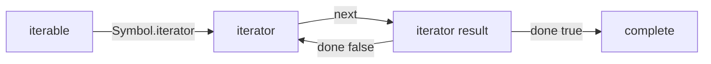

<TLDR>
  <TLDRCell label="what">
    An <Term id="iterable">iterable</Term> supplies an iterator, whose `next()` method returns one `{ value, done }` result at a time. A <Term id="generator">generator</Term> implements both protocols for you with `function*` and `yield`.
  </TLDRCell>
  <TLDRCell label="trap">
    A generator object is normally single-use, and spread syntax immediately consumes the entire sequence. Reusing a one-shot iterator produces partial or empty results, while materializing an infinite sequence never finishes.
  </TLDRCell>
  <TLDRCell label="fix">
    Return fresh iterators for repeatable traversal, bound a sequence before materializing it, and let early exits trigger cleanup through `return()`.
  </TLDRCell>
</TLDR>

## What it is and why it exists

An iterator is a stateful object whose `next()` method describes the next step in a sequence.
An iterable implements `[Symbol.iterator]()` and uses that method to supply an iterator.
The roles are separate: one stores a traversal's current position, while the other defines how a traversal starts.

JavaScript arrays, strings, `Map` objects, and `Set` objects have different structures, yet `for...of`, array destructuring, and spread syntax can consume all of them.
Those constructs don't each know every container type; producers and consumers instead agree on the iteration protocols.
A custom collection joins the same language constructs by providing the same entry point.

A generator function is a language feature for writing iterators.
Calling a `function*` does not immediately run its body; it returns a generator object, and later `next()` calls run the function until the next `yield` and suspend it there.
Local variables and the execution position survive suspension, so the code can produce a sequence on demand instead of building a complete array first.

Synchronous iteration fits values that are available to compute immediately.
If every step must wait for a network operation or timer, use an async iterator instead of making a synchronous iterator yield unhandled `Promise` objects.
The related `javascript/async-iterators` topic owns those semantics.

### Two protocols and three roles

An iterator result is an ordinary object.
When `done` is false, `value` is the item for this step; when `done` is true, the sequence has ended and `value` may hold a final return value or be absent.
A consumer must read `done` rather than treating `undefined` as an end marker, because `undefined` can itself be a valid yielded value.

An iterable's `[Symbol.iterator]()` must return an object.
That object's `next()` method must also return an object, or a protocol consumer throws a `TypeError`.
An ordinary object with only `next()` is an iterator, but it is not necessarily acceptable to `for...of`.

The same protocols serve several consumers, but they consume differently:

- `for...of` requests one value per iteration and can stop early with `break`.
- Array destructuring requests values for pattern positions, and a rest element gathers the entire remainder into an array.
- `[...iterable]` and `Array.from(iterable)` keep requesting until `done` is true and materialize the results.
- `yield* iterable` delegates requests to another iterable from inside a generator.

## How it works

### The steps of one traversal

A consumer first gets the iterable's `[Symbol.iterator]` method, calls it, and saves the returned iterator.
The consumer then calls `next()` repeatedly.
Each result object gives it a value or confirms that iteration is complete.



An omitted `done` is treated as false, so a producing step can return only `{ value }`.
Writing `{ value, done: false }` explicitly is easier to review, while a completion step commonly returns `{ done: true }`.
The protocol neither restricts the value's type nor requires a known sequence length.

An iterator stores a cursor, queue, or other progress state.
If a collection promises two independent traversals, each `[Symbol.iterator]()` call should create independent state.
A generator method is a natural implementation because every call creates a fresh generator object.

### Suspended generator state

A generator object is both an iterator and an iterable.
Its `[Symbol.iterator]()` method returns itself, so you can call `next()` manually and then let `for...of` continue consuming that same state.
What you pass around is therefore the current cursor, not a repeatable description of the sequence.

The argument to the first `next(argument)` call is ignored because the function is not yet suspended at a `yield` expression that could receive it.
The generator runs to `yield expression`, sends the expression's right-hand value to the caller, and suspends.
The next `next(value)` call makes the previous `yield` expression evaluate to that `value`.

A `return value` ends the generator and produces `{ value, done: true }`.
`for...of`, spread syntax, and `Array.from()` collect only results whose `done` is false, so they do not collect that final return value.
Only a caller that manually reads the last `next()` result, or an outer generator using `yield*`, can directly obtain it.

A generator usually moves through these states:

1. Call the generator function and create a generator object that has not started.
2. Call `next()`, run its body, and suspend at a `yield`.
3. Call `next(value)` again, send a value into that suspension point, and continue.
4. Execute `return`, reach the end, or propagate an uncaught exception, completing the generator.

### Consumers control advancement and closing

Laziness only means the producer works on request; it does not guarantee that a caller requests few values.
`for...of` can process incrementally and stop early, while spread or rest destructuring eagerly puts all remaining values in memory.
When selecting a consumer, consider both whether the sequence is finite and whether the result must be materialized.

When `for...of` exits early because of `break`, `return`, or an exception, it performs a closing procedure on an unfinished iterator.
If the iterator has a `return()` method, the consumer calls it.
A generator's `return()` resumes cleanup paths, so a `finally` surrounding `yield` can run on early exit.

The protocol only provides a cleanup opportunity; it does not infer resource ownership.
A hand-written iterator that owns a file handle, lock, or subscription needs a suitable `return()` method, or leaving the loop cannot tell it to release the resource.
Test early exit at resource boundaries, not only complete consumption.

## Examples

### A repeatable range

`StepRange` is an iterable, not a shared cursor.
Its generator method `*[Symbol.iterator]()` creates new state on every call, so the same range can be fully spread twice.

<Depth level="quick">

```javascript run title="release_range.js"
class StepRange {
  #start;
  #end;
  #step;

  constructor(start, end, step = 1) {
    if (step <= 0) throw new RangeError("step must be positive");
    this.#start = start;
    this.#end = end;
    this.#step = step;
  }

  *[Symbol.iterator]() {
    for (let value = this.#start; value <= this.#end; value += this.#step) {
      yield value;
    }
  }
}

const releaseIds = new StepRange(101, 105, 2);
console.log(JSON.stringify([...releaseIds]));
console.log(JSON.stringify([...releaseIds]));
```

```text
[101,103,105]
[101,103,105]
```

</Depth>

`for...of` calls this method implicitly, and spread syntax does the same.
The private fields belong to the range description; the loop variable belongs to the generator produced by one call.
Separating those states prevents concurrent consumers from competing for one position.

The constructor rejects a non-positive step because the current loop condition describes only an ascending range.
If the interface must also support descending ranges, validate the direction explicitly and select the corresponding stop condition instead of simply removing the check.

### Lazy filtering and early cleanup

The next example wraps an array in a source generator that logs reads, then uses another generator to select the first two approved orders.
The fourth order is never read, showing that downstream requests really do advance production.

```javascript run title="lazy_orders.js"
const orders = [
  { id: "A-17", status: "pending" },
  { id: "B-04", status: "approved" },
  { id: "C-22", status: "approved" },
  { id: "D-09", status: "approved" },
];

function* orderStream(rows) {
  try {
    for (const row of rows) {
      console.log(`read ${row.id}`);
      yield row;
    }
  } finally {
    console.log("source closed");
  }
}

function* firstApproved(rows, limit) {
  let found = 0;
  for (const row of rows) {
    if (row.status !== "approved") continue;
    yield row.id;
    found += 1;
    if (found === limit) return;
  }
}

const selected = firstApproved(orderStream(orders), 2);
console.log(JSON.stringify([...selected]));
```

```text
read A-17
read B-04
read C-22
source closed
["B-04","C-22"]
```

`firstApproved` returns from its inner `for...of` after reaching the limit.
That loop closes the still-suspended `orderStream`, so the source generator enters `finally` and prints `source closed`.
This is synchronous control flow, not a garbage-collection effect.

The outermost operation still uses spread, but it spreads the explicitly bounded `selected` iterator.
Spreading the unbounded source directly would discard the early-stop advantage.

### Two-way messaging with `next(value)`

A generator can receive values at suspension points as well as yield them.
This interface requires the caller and generator to share one message order, so it suits a controlled state machine better than hidden collection traversal.

```javascript run title="generator_messages.js"
function* reviewConversation() {
  const reviewer = yield { type: "request", order: "A-17" };

  try {
    const decision = yield { type: "review", reviewer };
    return { type: "result", decision };
  } finally {
    console.log("conversation closed");
  }
}

const flow = reviewConversation();
console.log(JSON.stringify(flow.next("ignored")));
console.log(JSON.stringify(flow.next("Mina")));
console.log(JSON.stringify(flow.next("approve")));
```

```text
{"value":{"type":"request","order":"A-17"},"done":false}
{"value":{"type":"review","reviewer":"Mina"},"done":false}
conversation closed
{"value":{"type":"result","decision":"approve"},"done":true}
```

The first call has nowhere to deliver `ignored`, so it does not assign that value to `reviewer`.
The second call sends `Mina` into the first `yield`, and the third sends `approve` into the second `yield`.
Each result's `done` field distinguishes an intermediate message from the final result.

If the caller switches to `for...of`, it receives the two objects produced by `yield` but not the object returned by `return`.
Keep and explicitly drive the generator object when the protocol needs a final result and two-way input.

### Composing traversal with `yield*`

`yield*` accepts any iterable, not only a generator.
A recursive directory walk can delegate every subtree's values to a recursive call while presenting one flat outer sequence.

```javascript run title="walk_files.js"
function* walkFiles(entry, parent = "") {
  const path = parent ? `${parent}/${entry.name}` : entry.name;

  if (entry.type === "file") {
    yield path;
    return;
  }

  for (const child of entry.children) {
    yield* walkFiles(child, path);
  }
}

const project = {
  name: "app",
  type: "directory",
  children: [
    { name: "index.js", type: "file" },
    {
      name: "lib",
      type: "directory",
      children: [{ name: "parse.js", type: "file" }],
    },
  ],
};

console.log(JSON.stringify([...walkFiles(project)]));
```

```text
["app/index.js","app/lib/parse.js"]
```

The caller sees only a path sequence and need not know which generator level produced a value.
If the outer consumer closes early, the closing request also propagates along the active delegation chain.

This data tree is finite, so spreading the result is safe.
For a file system or user-supplied tree, also decide how to handle cycles, extreme depth, and read failures; the iteration protocol does not solve those input problems.

## Pitfalls

Protocol bugs usually sit in state ownership, consumption bounds, and cleanup contracts rather than in the loop syntax.
The following failures are especially easy to hide in concise generated code.

> [!PITFALL]
> Treating an iterator as a repeatable iterable. A generator object's `[Symbol.iterator]()` returns itself, so spreading it again after one consumption produces only remaining values or an empty array.

**Fix:** Store the generator function or iterable when traversal must repeat, and call it to create a new iterator for every consumption.
If an API intentionally accepts a one-shot source, make that ownership constraint explicit in its type, parameter name, and tests.

> [!PITFALL]
> Using `undefined` to detect the end of iteration. An iterator may legally yield `undefined`, and its completion result may carry a non-`undefined` final value.

**Fix:** Always inspect the iterator result's `done` field.
A hand-written consumer should also validate that `next()` returned an object and decide at which boundary exceptions propagate or are translated.

> [!PITFALL]
> Applying spread, `Array.from()`, or rest destructuring to an unknown-length or infinite iterable. These operations keep requesting values, growing memory use or never returning.

**Fix:** Bound the sequence with a business limit before materializing it, or process it incrementally with `for...of` and exit early.
The bound must come from an input contract, not an assumption that the data is usually small.

> [!PITFALL]
> Expecting the first `next(value)` call to send `value` into the generator. The generator has not reached a `yield`, so no expression can receive that argument.

**Fix:** Start the generator with an argument-free `next()`, then send later values according to the protocol.
If that message order is not obvious to callers, prefer named methods or an explicit state object over exposing a two-way generator.

> [!PITFALL]
> Omitting `return()` from a hand-written iterator that owns a resource. Complete traversal may look correct, but `break` or an exception skips release work that only the producer knows about.

**Fix:** Give an early-terminable resource iterator an idempotent `return()`, and test complete consumption, `break`, and a consumer exception.
A generator should put release work in a `finally` around its `yield`, but a generator that never starts does not execute its body or cleanup block.

## In the AI era

**What generated code gets wrong here**

Models often make `[Symbol.iterator]()` return one generator stored on the instance, causing two consumers to fight over one cursor; they also cache an already-created generator object as “reusable data.”
Other generated implementations spread input without a trusted bound, call `next()` manually while ignoring `done`, or omit `finally` and `return()` cleanup paths from resource-owning generators.

**Ask your AI to check**

- Label every value as an iterable, iterator, or iterator result, and identify who owns its advancement state.
- Trace whether normal completion, `break`, a consumer exception, and explicit `return()` perform the same resource cleanup.
- Prove that every spread, `Array.from()`, and rest-destructuring input has a finite bound.

**Review checklist**

- Start two interleaved loops over the same collection and confirm that their cursors are independent; for a one-shot source, confirm that the API explicitly forbids reuse.
- Make the sequence legally yield `undefined` and verify that the consumer uses only `done` to detect completion.
- Exit or throw after the first yield, then assert that a subscription, handle, or lock was released exactly once.

**Prompt vocabulary**

Use the exact terms `iterable protocol`, `iterator protocol`, `iterator result`, `single-pass iterator`, `generator state`, `IteratorClose`, `yield delegation`, and `eager materialization`.
Ask the model for a `next(value)` timeline between the caller and every suspension point; that exposes state errors better than a vague request to “check the generator.”

<Depth level="deep">

## Iterator closing

<Term id="iterator-closing">Iterator closing</Term> is a structured notification from a consumer that stops early to its producer.
While a `for...of` iterator is unfinished, a `break`, a `return` from the surrounding function, or an exception thrown by the loop body triggers closing.
The consumer gets the iterator's `return` method, calls it if present, and requires it to return an object.

Generator objects already provide `return(value)`.
Calling it on a suspended generator resumes control as though `return value` occurred at the current suspension point, so intervening `finally` blocks run.
If a `finally` block itself executes `yield`, even that first `return()` can produce `done: false`; the caller must continue advancing to finish the close.

Closing can also affect which error eventually propagates.
If getting or calling the iterator's `return` method fails, the exact outcome depends on the original completion type and the specification algorithm.
Application code should not rely on cleanup failures being silently ignored; keep `return()` simple and idempotent, and test the failure policy against observable resources.

These common consumption paths are not identical:

1. When `for...of` normally reads `done: true`, the iterator has completed itself and receives no extra `return()` call.
2. When `for...of` exits early, it closes the unfinished iterator.
3. When array destructuring needs only a few values, it closes an iterator that is still unfinished.
4. Spread syntax normally consumes to completion, so an infinite source never creates an early-closing opportunity for itself.

### Cleanup boundaries are not garbage collection

Control flow triggers `finally`; its execution does not mean an object is now unreachable or guarantee immediate garbage collection.
Files, locks, and subscriptions need deterministic release, so correctness cannot depend on a collector or finalizer.
Generator cleanup should invoke the resource's own explicit release operation.

Calling `generator.return()` closes that one generator state.
It does not close generators created independently elsewhere or undo external effects that have already happened.
A composed pipeline must therefore state which upstream each layer owns and how a closing request travels through delegation or loops.

## Generator control channels and delegation

A generator has three main control entries: `next(value)`, `return(value)`, and `throw(error)`.
`next` resumes ordinary execution, `return` requests completion, and `throw` makes an exception appear at the currently suspended `yield` expression.
The body can handle those entries with `try...catch...finally`, but the caller still has to inspect the returned iterator result.

`yield* source` does more than repeatedly call `source.next()`.
During delegation it forwards ordinary advancement, throws, and closing requests; after the delegated iterator completes, its final `value` becomes the value of the whole `yield*` expression.
That is why `yield*` can receive an inner generator's `return` value while an ordinary `for...of` never yields that value.

If a delegate lacks `throw()`, an outer generator receiving `throw()` cannot invent a way to inject the exception into it.
The specification attempts to close the delegate and produces the corresponding error.
This boundary rarely makes a good business protocol; if callers need a reliable bidirectional error channel, define an explicit interface and integration-test every entry.

### Generator states and non-reentrancy

A generator can be not started, suspended, executing, or completed.
`next()` can advance it only while it has not started or is suspended.
Calling `next()` after completion keeps returning a completed result and does not run the body again.

An executing generator cannot advance itself again.
If it synchronously calls its own `next()`, `return()`, or `throw()` while resuming, the runtime throws a `TypeError`.
Check this reentrant path before passing a generator to a framework that might synchronously call back into it.

An exception not caught inside the generator completes the generator and propagates to the current caller.
A later `next()` does not retry from the exception point.
For retries, build an explicit loop inside the generator or create a fresh generator from a factory and reestablish the external state.

## Repeatable sequences and one-shot cursors

When designing a custom iteration API, first decide whether it exposes a repeatable sequence or a one-shot cursor.
Both may implement `[Symbol.iterator]()`, so the fact that `for...of` works does not fully describe ownership.
Names, documentation, and tests must supply that contract.

| Contract | `[Symbol.iterator]()` | Reuse | Typical owner |
| --- | --- | --- | --- |
| Reusable iterable | Returns a fresh iterator | Each traversal starts over | Collection |
| Single-pass iterator | Usually returns itself | Traversal shares remaining state | Stream or generator object |

A collection should normally return fresh iterators so nested or interleaved loops stay independent.
A streaming adapter may intentionally accept and return a one-shot iterator to avoid caching all its input.
This lazy composition saves unnecessary materialization; it does not make computation free or automatically limit input size.

Wrapping an iterator as an iterable does not make it repeatable.
Returning itself adds a protocol entry point without copying internal state.
If callers really need replay, retain the source data, provide a refetch mechanism, or explicitly cache consumed values and accept the memory cost.

</Depth>

<Checkpoint id="javascript/iterators-generators" />

## Further reading

- [ECMAScript language specification: Iterator Objects](https://tc39.es/ecma262/multipage/control-abstraction-objects.html#sec-iterator-objects)
- [ECMAScript language specification: Generator Objects](https://tc39.es/ecma262/multipage/control-abstraction-objects.html#sec-generator-objects)
- [MDN: Iteration protocols](https://developer.mozilla.org/en-US/docs/Web/JavaScript/Reference/Iteration_protocols)
- [MDN: `function*` declaration](https://developer.mozilla.org/en-US/docs/Web/JavaScript/Reference/Statements/function*)
