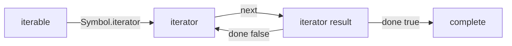

<TLDR>
  <TLDRCell label="what">
    <Term id="iterable">可迭代对象</Term>提供迭代器，迭代器通过 `next()` 逐项返回 `{ value, done }`；<Term id="generator">生成器</Term>用 `function*` 和 `yield` 自动实现这套协议。
  </TLDRCell>
  <TLDRCell label="trap">
    生成器对象通常只能消费一次，而且展开语法会立即消费整个序列；无限序列或被重复使用的单次迭代器会让代码卡住或得到空结果。
  </TLDRCell>
  <TLDRCell label="fix">
    需要重复遍历时返回新的迭代器，需要有限结果时在物化前设置边界，并让提前退出通过 `return()` 触发清理。
  </TLDRCell>
</TLDR>

## 是什么，为什么存在

迭代器（iterator）是一个有状态对象，它的 `next()` 方法每次描述序列中的下一步。
可迭代对象（iterable）则实现 `[Symbol.iterator]()`，并用该方法提供迭代器。
两者分工明确：前者保存一次遍历的位置，后者定义怎样开始一次遍历。

JavaScript 的数组、字符串、`Map` 和 `Set` 结构不同，却都能被 `for...of`、数组解构和展开语法消费。
原因不是这些语法分别了解每种容器，而是生产者和消费者共同遵守迭代协议（iteration protocol）。
自定义集合只要提供同样的入口，也能接入这些语言结构。

生成器函数（generator function）是编写迭代器的语言级工具。
调用 `function*` 不会立即运行函数体，而是返回生成器对象；后续 `next()` 调用让函数运行到下一个 `yield` 并暂停。
局部变量和执行位置在暂停期间保留，因此代码可以按需生产序列，而不必先构造完整数组。

同步迭代适合已经可以立即计算的值。
如果每一步都要等待网络或定时器，应使用异步迭代器，而不是让同步迭代器产出一串未处理的 `Promise`。
这部分语义由相关主题 `javascript/async-iterators` 单独说明。

### 两份协议，三个角色

一个 iterator result 是普通对象。
当 `done` 为假时，`value` 是本步产出的值；当 `done` 为真时，序列已结束，`value` 可以保存最终返回值，也可以省略。
消费者必须读取 `done`，不能把值为 `undefined` 当作结束信号，因为 `undefined` 本身可以是合法产出。

可迭代对象的 `[Symbol.iterator]()` 必须返回对象。
该对象的 `next()` 也必须返回对象，否则协议消费者会抛出 `TypeError`。
一个普通对象仅仅拥有 `next()` 还只是迭代器，不一定能直接交给 `for...of`。

同一协议服务于多种消费者，但消费方式不同：

- `for...of` 每轮请求一个值，并允许用 `break` 提前结束。
- 数组解构按模式位置请求值，剩余元素会把余下序列全部收集成数组。
- `[...iterable]` 和 `Array.from(iterable)` 会一直请求到 `done` 为真，并把结果物化。
- `yield* iterable` 在一个生成器内部把请求转交给另一个可迭代对象。

## 工作原理

### 一次迭代的步骤

消费者先读取可迭代对象的 `[Symbol.iterator]` 方法，调用它并保存返回的迭代器。
随后，消费者重复调用 `next()`。
每个结果对象让消费者获得一个值或确认迭代完成。



`done` 被省略时会按假值处理，因此产出步骤通常可以只返回 `{ value }`。
明确写出 `{ value, done: false }` 更容易审查，完成步骤则通常返回 `{ done: true }`。
协议不要求 `value` 具有特定类型，也不要求序列长度已知。

迭代器保存游标、队列或其他进度状态。
如果一个集合打算支持相互独立的两次遍历，每次调用 `[Symbol.iterator]()` 就应创建独立状态。
生成器方法天然适合这种实现，因为每次调用都会得到新的生成器对象。

### 生成器的暂停状态

生成器对象同时是迭代器和可迭代对象。
它的 `[Symbol.iterator]()` 返回自身，所以可以先手动调用 `next()`，再用 `for...of` 继续消费同一份状态。
这也意味着传播的是当前游标，而不是可重复执行的序列描述。

第一次调用 `next(argument)` 时，实参会被忽略，因为函数还没有暂停在可接收值的 `yield` 表达式上。
生成器运行到 `yield expression` 后，把表达式右侧的值交给调用方并暂停。
下一次 `next(value)` 会让上一个 `yield` 表达式求值为传入的 `value`。

`return value` 会结束生成器，并产生 `{ value, done: true }`。
`for...of`、展开语法和 `Array.from()` 只收集 `done` 为假时的值，因此不会收集这个最终返回值。
只有手动读取最后一次 `next()` 的调用方，或者使用 `yield*` 的外层生成器，才能直接取得它。

生成器的典型状态变化如下：

1. 调用生成器函数，创建尚未开始的生成器对象。
2. 调用 `next()`，执行函数体并在 `yield` 处暂停。
3. 再次调用 `next(value)`，把值送回暂停点并继续运行。
4. 执行 `return`、抵达函数末尾或传播未捕获异常，生成器结束。

### 消费者负责推进与关闭

惰性只表示生产者按请求工作，并不保证调用方只请求少量值。
`for...of` 可以逐步处理并提前退出，而展开或剩余解构会急切地把余下内容全部放进内存。
选择消费者时，需要同时考虑序列是否有限以及结果是否必须物化。

当 `for...of` 因 `break`、`return` 或异常提前离开时，会对仍未完成的迭代器执行关闭流程。
如果迭代器提供 `return()`，消费者会调用它。
生成器的 `return()` 会恢复执行清理路径，因此包围 `yield` 的 `finally` 可以在提前退出时运行。

协议只提供清理机会，不会猜测资源所有权。
自定义手写迭代器若持有文件句柄、锁或订阅，就要实现合适的 `return()`；若没有该方法，退出循环无法通知它释放资源。
对资源边界应编写提前退出测试，而不只是测试完整消费。

## 示例

### 可重复遍历的范围

`StepRange` 是可迭代对象，而不是共享游标。
生成器方法 `*[Symbol.iterator]()` 每次创建新状态，所以同一个范围可以完整展开两次。

<Depth level="quick">

```javascript run title="release_range.js"
class StepRange {
  #start;
  #end;
  #step;

  constructor(start, end, step = 1) {
    if (step <= 0) throw new RangeError("step must be positive");
    this.#start = start;
    this.#end = end;
    this.#step = step;
  }

  *[Symbol.iterator]() {
    for (let value = this.#start; value <= this.#end; value += this.#step) {
      yield value;
    }
  }
}

const releaseIds = new StepRange(101, 105, 2);
console.log(JSON.stringify([...releaseIds]));
console.log(JSON.stringify([...releaseIds]));
```

```text
[101,103,105]
[101,103,105]
```

</Depth>

`for...of` 隐式调用这个方法，展开语法也一样。
私有字段属于范围描述；循环变量属于本次调用产生的生成器。
两种状态分开后，并行消费者不会争用同一个位置。

构造函数拒绝非正步长，因为当前循环条件只描述递增范围。
如果接口还要支持递减范围，应明确验证方向并选择对应的终止条件，不能只删除这项检查。

### 惰性筛选与提前清理

下一个例子把数组包装成会记录读取动作的源生成器，再由另一个生成器选取前两个已批准订单。
第四条订单没有被读取，说明生产过程确实由下游请求推进。

```javascript run title="lazy_orders.js"
const orders = [
  { id: "A-17", status: "pending" },
  { id: "B-04", status: "approved" },
  { id: "C-22", status: "approved" },
  { id: "D-09", status: "approved" },
];

function* orderStream(rows) {
  try {
    for (const row of rows) {
      console.log(`read ${row.id}`);
      yield row;
    }
  } finally {
    console.log("source closed");
  }
}

function* firstApproved(rows, limit) {
  let found = 0;
  for (const row of rows) {
    if (row.status !== "approved") continue;
    yield row.id;
    found += 1;
    if (found === limit) return;
  }
}

const selected = firstApproved(orderStream(orders), 2);
console.log(JSON.stringify([...selected]));
```

```text
read A-17
read B-04
read C-22
source closed
["B-04","C-22"]
```

`firstApproved` 在达到上限后从内部 `for...of` 返回。
该循环关闭仍处于暂停状态的 `orderStream`，于是源生成器进入 `finally` 并输出 `source closed`。
这不是垃圾回收效果，而是同步控制流的一部分。

最外层仍然使用展开语法，但它展开的是明确受限的 `selected`。
直接展开没有上限的源会失去提前停止带来的优势。

### 用 `next(value)` 双向通信

生成器不仅能产出值，还能在暂停点接收值。
这种接口要求调用方和生成器共享一套消息顺序，因此适合受控的状态机，不适合隐藏在普通集合遍历里。

```javascript run title="generator_messages.js"
function* reviewConversation() {
  const reviewer = yield { type: "request", order: "A-17" };

  try {
    const decision = yield { type: "review", reviewer };
    return { type: "result", decision };
  } finally {
    console.log("conversation closed");
  }
}

const flow = reviewConversation();
console.log(JSON.stringify(flow.next("ignored")));
console.log(JSON.stringify(flow.next("Mina")));
console.log(JSON.stringify(flow.next("approve")));
```

```text
{"value":{"type":"request","order":"A-17"},"done":false}
{"value":{"type":"review","reviewer":"Mina"},"done":false}
conversation closed
{"value":{"type":"result","decision":"approve"},"done":true}
```

第一步中的 `ignored` 没有接收点，所以不会赋给 `reviewer`。
第二次调用把 `Mina` 送入第一个 `yield`，第三次调用再把 `approve` 送入第二个 `yield`。
每次返回的 `done` 明确表示消息是中间产出还是最终结果。

若调用方改用 `for...of`，只能拿到两个 `yield` 产生的对象，拿不到 `return` 的结果。
需要最终结果和双向输入时，应保留生成器对象并显式驱动协议。

### 用 `yield*` 组合遍历

`yield*` 接受任何可迭代对象，不只接受生成器。
递归目录遍历可以把子树的所有产出委托给递归调用，同时保持一个平坦的外部序列。

```javascript run title="walk_files.js"
function* walkFiles(entry, parent = "") {
  const path = parent ? `${parent}/${entry.name}` : entry.name;

  if (entry.type === "file") {
    yield path;
    return;
  }

  for (const child of entry.children) {
    yield* walkFiles(child, path);
  }
}

const project = {
  name: "app",
  type: "directory",
  children: [
    { name: "index.js", type: "file" },
    {
      name: "lib",
      type: "directory",
      children: [{ name: "parse.js", type: "file" }],
    },
  ],
};

console.log(JSON.stringify([...walkFiles(project)]));
```

```text
["app/index.js","app/lib/parse.js"]
```

调用方只看到路径序列，不需要知道某个值来自哪一层生成器。
外层消费者若提前关闭遍历，关闭请求也会沿当前的委托链传播。

这里的数据树有限，所以展开结果是安全的。
面对文件系统或用户提供的树，还应决定怎样处理环、极深递归和读取错误；迭代协议本身不会解决这些输入问题。

## 陷阱

协议代码的错误通常不在循环语法，而在状态所有权、消费边界和清理契约。
以下问题尤其容易藏在看似简洁的生成代码中。

> [!PITFALL]
> 把 iterator 当成可重复遍历的 iterable。生成器对象的 `[Symbol.iterator]()` 返回自身，第一次消费后再次展开只会得到剩余值或空数组。

**修复：** 需要重复遍历时保存生成器函数或 iterable，并在每次消费时调用它来创建新 iterator。
如果 API 有意接受单次数据源，应在类型、参数名和测试中明确这一所有权约束。

> [!PITFALL]
> 用 `undefined` 判断迭代结束。迭代器完全可以合法地产出 `undefined`，而且完成结果也可以携带非 `undefined` 的最终值。

**修复：** 始终检查 iterator result 的 `done`。
手写消费者还要验证 `next()` 的返回值是对象，并决定异常应在哪个边界传播或转换。

> [!PITFALL]
> 对未知长度或无限 iterable 使用展开、`Array.from()` 或剩余解构。这些操作会持续请求值，导致内存不断增长，甚至永远无法返回。

**修复：** 在物化前用业务上限截断序列，或用 `for...of` 边处理边退出。
上限应来自输入契约，不能靠“数据通常很小”这一假设。

> [!PITFALL]
> 以为第一次 `next(value)` 会把 `value` 送进生成器。生成器尚未执行到 `yield`，所以没有表达式可以接收这个实参。

**修复：** 用无实参的 `next()` 启动生成器，再按协议发送后续值。
若消息顺序对调用方不直观，应改用具名方法或显式状态对象，而不是暴露双向生成器。

> [!PITFALL]
> 手写持有资源的 iterator 却没有实现 `return()`。循环完整结束时可能看不出问题，但 `break` 或异常会跳过只有生产者自己知道的释放动作。

**修复：** 为可提前结束的资源迭代器实现幂等 `return()`，并测试完整消费、`break` 和消费方抛错三条路径。
生成器应把释放动作放进包围 `yield` 的 `finally`，但从未启动的生成器不会执行其函数体或清理块。

<Depth level="deep">

## 迭代器关闭

<Term id="iterator-closing">迭代器关闭</Term>是消费者提前停止时给生产者的结构化通知。
在 `for...of` 的迭代器尚未完成时，`break`、外围函数的 `return` 或循环体抛出的异常都会触发关闭。
消费者查找迭代器的 `return` 方法；存在时就调用它，并要求它返回对象。

生成器对象已经提供 `return(value)`。
对暂停中的生成器调用它，会像在当前暂停点执行 `return value` 一样继续控制流，所以途中经过的 `finally` 会运行。
若 `finally` 自己执行 `yield`，首次 `return()` 甚至可能得到 `done: false`；调用方需要继续推进才能真正完成关闭。

关闭也可能改变最终抛出的错误。
如果取得或调用迭代器的 `return` 时失败，具体传播结果取决于原先的完成类型和规范算法。
应用代码不应依赖清理失败被静默忽略，应让 `return()` 简单、幂等，并在可观察资源上单独测试失败策略。

这些常见消费路径并不完全相同：

1. `for...of` 正常读到 `done: true` 时，迭代器已经自行完成，不再额外调用 `return()`。
2. `for...of` 提前离开时，对未完成迭代器执行关闭。
3. 数组解构只需要前几个值时，会关闭仍未完成的迭代器。
4. 展开语法通常消费到完成；无限源因此不会给自己创造提前关闭机会。

### 清理边界不是垃圾回收

`finally` 的运行由控制流触发，不等于对象已经不可达，也不保证垃圾回收立即发生。
释放文件、锁和订阅需要确定时机，因此不能把正确性寄托在回收器或终结器上。
生成器清理应调用资源本身的显式释放操作。

调用 `generator.return()` 关闭的是这一份生成器状态。
它不会关闭由别处独立创建的生成器，也不会撤销已经产生的外部副作用。
因此，组合管道必须说明每一层拥有哪个上游，以及关闭请求怎样沿委托或循环传播。

## 生成器控制通道与委托

生成器有三个主要控制入口：`next(value)`、`return(value)` 和 `throw(error)`。
`next` 恢复普通执行，`return` 请求完成，`throw` 则让异常出现在当前暂停的 `yield` 表达式处。
函数体可以用 `try...catch...finally` 处理这些入口，但处理后返回的 iterator result 仍必须由调用方检查。

`yield* source` 不只是循环调用 `source.next()`。
它会在委托期间转发普通推进、抛错和关闭请求，并在被委托迭代器完成后，把其最终 `value` 作为整个 `yield*` 表达式的结果。
这就是为什么 `yield*` 可以获得内层生成器的 `return` 值，而普通 `for...of` 不会产出该值。

委托对象缺少 `throw()` 时，外层生成器接到 `throw()` 不能凭空把异常注入内层。
规范会尝试关闭委托迭代器，并产生相应错误。
这类边界很少适合业务协议；如果调用方需要可靠的双向错误通道，应定义明确接口并对所有入口做集成测试。

### 生成器状态与不可重入

生成器可以处于尚未开始、暂停、正在执行或已完成状态。
`next()` 只有在尚未开始或暂停时才能推进它。
完成后继续调用 `next()` 会稳定返回完成结果，不会重新运行函数体。

正在执行的生成器不能再次推进自身。
如果生成器在恢复期间同步调用自己的 `next()`、`return()` 或 `throw()`，运行时会抛出 `TypeError`。
把生成器交给可能同步回调自身的框架前，要检查这种重入路径。

异常若没有在生成器内部捕获，会让生成器进入完成状态并传播给当前调用方。
之后再次调用 `next()` 不会从异常点重试。
需要重试时应在生成器内部明确建立循环，或由工厂创建新的生成器并重新建立外部状态。

## 可重用序列与单次游标

设计自定义迭代 API 时，先决定公开的是可重用序列还是单次游标。
两者都可能实现 `[Symbol.iterator]()`，所以仅凭 `for...of` 能否运行无法区分所有权。
命名、文档和测试必须补充这项契约。

| Contract | `[Symbol.iterator]()` | Reuse | Typical owner |
| --- | --- | --- | --- |
| Reusable iterable | Returns a fresh iterator | Each traversal starts over | Collection |
| Single-pass iterator | Usually returns itself | Traversal shares remaining state | Stream or generator object |

集合通常应返回新迭代器，让嵌套或交错循环保持独立。
流式适配器则可能有意接受和返回单次 iterator，以避免缓存全部输入。
这种惰性组合节省的是不必要的物化，不代表计算免费，也不自动限制输入规模。

把 iterator 包装成 iterable 时，不能假装它突然可重用。
返回自身只增加了协议入口，没有复制内部状态。
若调用方确实需要重放，就必须保留原始数据、建立重新获取机制，或显式缓存已经读取的值并承担其内存成本。

</Depth>

<Checkpoint id="javascript/iterators-generators" />

## 延伸阅读

- [ECMAScript 语言规范：Iterator Objects](https://tc39.es/ecma262/multipage/control-abstraction-objects.html#sec-iterator-objects)
- [ECMAScript 语言规范：Generator Objects](https://tc39.es/ecma262/multipage/control-abstraction-objects.html#sec-generator-objects)
- [MDN：迭代协议](https://developer.mozilla.org/en-US/docs/Web/JavaScript/Reference/Iteration_protocols)
- [MDN：`function*` 声明](https://developer.mozilla.org/en-US/docs/Web/JavaScript/Reference/Statements/function*)
