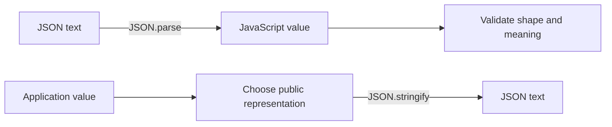

<TLDR>
  <TLDRCell label="what">
    JSON is a language-independent textual data format. `JSON.parse()` converts JSON text to a JavaScript value, and `JSON.stringify()` converts in the other direction.
  </TLDRCell>
  <TLDRCell label="trap">
    Successful parsing proves only that the syntax is valid, not that the data satisfies your contract. Serialization also drops or changes some JavaScript values and cannot preserve object identity or prototypes.
  </TLDRCell>
  <TLDRCell label="fix">
    Validate the data shape after parsing and construct an explicit public representation before serialization. Define a reversible wire format for large integers, dates, and other non-JSON types instead of relying on implicit conversion.
  </TLDRCell>
</TLDR>

## What it is and why it exists

JSON stands for JavaScript Object Notation. It is a data interchange syntax, not a JavaScript object or a runtime value with methods. A Unicode text that conforms to the grammar is a <Term id="json-text">JSON text</Term>, and it can represent an object, array, string, number, Boolean, or `null`.

JSON solves a representation problem at system boundaries. An in-memory object cannot directly cross HTTP, a message queue, a file, or Web Storage; text gives different languages and processes a shared exchange syntax. Converting a runtime value to that representation is <Term id="serialization">serialization</Term>; the other direction is usually called parsing or deserialization.

You meet JSON in API responses, request bodies, configuration files, cache entries, and logs. JavaScript provides the global `JSON` object, whose two most-used static methods are `JSON.parse()` and `JSON.stringify()`. They convert between syntax and values; they do not check whether a field exists, whether a string really is a date, or whether the current user may act on a field.

JSON deliberately has a small data model. It has no `undefined`, `BigInt`, `Date`, `Map`, `Set`, function, Symbol, class instance, shared reference, or cycle. When a boundary needs one of those concepts, sender and receiver must first agree on a representation made from JSON-supported values.

## How it works

The two JSON directions form a boundary pipeline. Incoming data goes through syntax parsing and then shape and business validation; outgoing data is projected into a public representation before serialization.



### JSON grammar and value model

A JSON object is enclosed in braces, and every member name must be a double-quoted string. An array is enclosed in brackets and preserves element order. Objects and arrays can recursively contain any JSON-supported value, so JSON represents a tree.

Strings use double quotes and backslash escapes for quotation marks, backslashes, and control characters. JSON has no single-quoted strings, comments, or trailing commas. Member names cannot omit quotation marks as they can in a JavaScript object literal.

JSON numbers support decimal integers, fractions, and exponent notation, but not `NaN`, `Infinity`, `-Infinity`, a BigInt `n` suffix, a leading plus sign, or hexadecimal notation. The range accepted by the grammar is not the range that JavaScript `Number` can represent exactly; the parser still produces a `Number`.

The top-level value need not be an object or array. `"ready"`, `42`, `false`, and `null` are all complete JSON texts. If an interface accepts only an object, check that separately after parsing; “valid JSON” does not mean “valid request.”

Object member names should be unique. `JSON.parse()` keeps the later value when names repeat, but observable behavior across implementations is not a sound interoperability contract. Producers should not use duplicate-member replacement to communicate meaning.

### How `JSON.parse()` processes input

`JSON.parse(text)` must consume the complete input. It throws `SyntaxError` for invalid syntax and does not return a successfully parsed prefix. For valid syntax, it can return the JavaScript counterpart of any JSON value, including `null` and other primitives.

Its optional second argument is a <Term id="reviver">reviver</Term>. The parser first constructs ordinary JavaScript values, then calls the reviver from the deepest child properties back toward the root. The callback receives the string `key` and current `value`; the root call uses the empty string `""` as its key.

In Node 24, calls for primitive values also receive a third `context` argument whose `source` property contains the original JSON fragment for that value. Calls for objects and arrays have no such context. This information can reconstruct an exact integer from the original digits after parsing has already produced an imprecise `Number`.

The reviver's return value replaces the current property. Returning `undefined` deletes an object property; for an array element, it creates an empty slot instead of shifting later elements. If the root call returns `undefined`, the result of the entire `JSON.parse()` call is also `undefined`.

### How `JSON.stringify()` processes values

`JSON.stringify(value)` visits a JavaScript value and produces compact JSON text. Its second argument can be a <Term id="replacer">replacer</Term> function or an array of property names; the third `space` argument controls indentation, with numbers capped at 10 spaces and strings capped at their first 10 characters.

If an object has a `toJSON()` method, the serializer calls it before passing the result to the replacer. That is how `Date` becomes an ISO string, so an ordinary replacer usually no longer sees a `Date` instance. A custom class's `toJSON()` also changes its external representation and should be reviewed as part of the API contract.

The replacer starts with a wrapper root whose key is `""`, then visits descendants in order. Returning `undefined` omits an object property but writes `null` for an array position. A property-name array filters members at every object level, not just at the top.

Default serialization is not a one-to-one mapping for every JavaScript value:

| Input position or type | `JSON.stringify()` result |
| --- | --- |
| `undefined`, function, or Symbol in an object property | Property omitted |
| `undefined`, function, or Symbol in an array | `null` |
| `NaN`, `Infinity`, or `-Infinity` | `null` |
| `BigInt` | Throws `TypeError` unless a representation rule runs first |
| `Date` | ISO string through `toJSON()` |
| Circular reference | Throws `TypeError` |

For ordinary objects, only own, enumerable, string-keyed properties are serialized. Symbol keys and inherited properties do not appear. Arrays serialize positions from `0` through `length - 1`; other own properties do not become members of the JSON array.

### Responsibilities at the boundary

Parsing, validation, and authorization are three distinct steps. The parser answers “does this text follow JSON grammar,” shape validation answers “does the value have the expected fields and types,” and business validation answers “do those values meet the rules of this operation.” Authorization still decides whether an identity may perform the operation on the resource.

Define the wire format before sending data as well. Constructing a new object containing only public fields is more reliable than passing a domain object directly to `JSON.stringify()` and blacklisting secrets. When a new internal field is added, an allowlist does not silently leak it into the response.

`JSON.parse(JSON.stringify(value))` only approximates a round trip for tree-shaped values inside the JSON data model. It is not a general deep copy and does not restore class instances, prototypes, property descriptors, or shared references. In-memory copying and cross-system serialization are different problems.

## Examples

The next four examples build from syntax parsing to shape validation, explicit serialization, and source-aware revival. Every output shown here was produced by Node 24.14.0.

### 1. Parse a complete JSON text

<Depth level="quick">

```javascript run title="parse-order.js"
const source = `{
  "orderId": "A-17",
  "items": [{ "sku": "PEN", "quantity": 2 }],
  "paid": false
}`;

const order = JSON.parse(source);
console.log(order.orderId);
console.log(order.items[0].quantity);
console.log(typeof order.paid);

try {
  JSON.parse("{'orderId': 'A-17'}");
} catch (error) {
  console.log(error.name);
}
```

```text
A-17
2
boolean
SyntaxError
```

</Depth>

The first parse produces ordinary objects, arrays, strings, numbers, and a Boolean. The second input uses single quotes and is therefore not JSON; looking like an object literal in another language does not make the JSON parser relax its grammar.

Catch `SyntaxError` only at a boundary that can handle failure. If the caller must distinguish an absent body, an error page, and malformed JSON, preserve those states instead of turning all of them into an empty object.

### 2. Validate shape after parsing

```javascript run title="validate-order.js"
function parseOrder(source) {
  const value = JSON.parse(source);

  if (value === null || typeof value !== "object" || Array.isArray(value)) {
    throw new TypeError("order must be an object");
  }
  if (typeof value.orderId !== "string" || !Array.isArray(value.items)) {
    throw new TypeError("orderId and items are required");
  }
  if (!value.items.every((item) =>
    item !== null &&
    typeof item === "object" &&
    typeof item.sku === "string" &&
    Number.isInteger(item.quantity) &&
    item.quantity > 0
  )) {
    throw new TypeError("each item needs a SKU and positive quantity");
  }
  return value;
}

for (const source of [
  '{"orderId":"A-17","items":[{"sku":"PEN","quantity":2}]}',
  '{"orderId":"A-18","items":[{"sku":"PEN","quantity":0}]}',
  'null'
]) {
  try {
    console.log("accepted", parseOrder(source).orderId);
  } catch (error) {
    console.log("rejected", error.message);
  }
}
```

```text
accepted A-17
rejected each item needs a SKU and positive quantity
rejected order must be an object
```

All three inputs are syntactically valid, but only the first satisfies the order contract. The validator rules out `null` and arrays before reading object properties, avoiding the mistake of treating `typeof null === "object"` as a sufficient object check.

A production boundary will often use a reviewed schema validator, but the order stays the same: parse untrusted text, then check the top-level category, required fields, nested structure, and business constraints. A TypeScript assertion cannot replace runtime validation because its type does not exist at runtime.

### 3. Construct a public representation before serializing

```javascript run title="stringify-invoice.js"
const invoice = {
  id: "INV-9",
  totalCents: 1250n,
  customer: { name: "Mira", passwordHash: "not-for-output" },
  exportedAt: new Date("2026-09-04T10:30:00.000Z")
};

// Constructing a public shape is safer than trying to blacklist secrets.
const publicInvoice = {
  id: invoice.id,
  totalCents: invoice.totalCents,
  customerName: invoice.customer.name,
  exportedAt: invoice.exportedAt
};

const json = JSON.stringify(
  publicInvoice,
  (key, value) => typeof value === "bigint" ? value.toString() : value,
  2
);

console.log(json);
```

```text
{
  "id": "INV-9",
  "totalCents": "1250",
  "customerName": "Mira",
  "exportedAt": "2026-09-04T10:30:00.000Z"
}
```

The public object selects fields with an allowlist, so `passwordHash` never reaches the serializer. The replacer converts `BigInt` to a decimal string; the receiver must know that the `totalCents` string denotes an integer rather than arbitrary text.

The date becomes an ISO string through its own `toJSON()` before the replacer runs. If the protocol needs a time-zone name, calendar date, or other date semantics, add those fields explicitly to the public representation; a `Date` alone supplies only an instant.

### 4. Preserve integer precision with a reviver

```javascript run title="revive-order.js"
const source = `{
  "orderId": "A-17",
  "placedAt": "2026-09-04T10:30:00.000Z",
  "transactionId": 9007199254740993
}`;

const order = JSON.parse(source, (key, value, context) => {
  if (key === "placedAt" && typeof value === "string") {
    return new Date(value);
  }
  if (key === "transactionId" && typeof value === "number") {
    return BigInt(context.source);
  }
  return value;
});

console.log(order.placedAt instanceof Date);
console.log(order.placedAt.toISOString());
console.log(typeof order.transactionId);
console.log(order.transactionId.toString());
```

```text
true
2026-09-04T10:30:00.000Z
bigint
9007199254740993
```

`transactionId` lies outside the <Term id="safe-integer">safe integer</Term> range. The callback's `value` is already an imprecise `Number`, but Node 24's `context.source` retains the original digits and can be passed directly to `BigInt()`.

Apply this conversion only to fields named by the protocol. Heuristically converting every string that “looks like a date” or “looks large” silently changes valid business text; a more general protocol needs validated type tags and a policy for collisions with user fields.

## Pitfalls

> [!PITFALL]
> **Treating successful parsing as valid input.** `JSON.parse()` accepts `null`, arrays, and objects missing required fields; generated code often destructures or calls a property immediately after parsing.
>
> **Fix:** Validate the top-level category, every required field, nested values, and ranges before use. Keep syntax errors, absent bodies, HTTP failures, and business-validation failures distinct instead of catching everything and returning `{}`.

> [!PITFALL]
> **Assuming serialization preserves every value.** Object properties containing `undefined`, functions, and Symbols disappear; corresponding array positions become `null`; non-finite numbers become `null`; `BigInt` and cycles throw.
>
> **Fix:** List the types supported by the wire format and test every boundary value. Consider `structuredClone()` for supported in-memory object graphs; use explicit fields or a versioned codec contract when special types must cross a boundary.

> [!PITFALL]
> **Trying to recover a large integer after parsing.** `BigInt(value)` merely converts an already-rounded `Number`; it cannot restore lost bits. Comparing an unsafe parsed number with the same source-code numeric literal can also mislead because that literal is rounded too.
>
> **Fix:** The most portable cross-system contract sends large integers as validated decimal strings. In runtimes with reviver source context, a known field can instead construct `BigInt` from `context.source`.

> [!PITFALL]
> **Guessing types with broad revival rules.** Turning every date-shaped string into a `Date` can change product identifiers, calendar-only dates, or user text; an unvalidated `__type` field can collide with real data.
>
> **Fix:** Revive values at paths named by the schema, or define a namespaced and versioned tag format. Validate the resulting time value and the canonical form required by the protocol, and allowlist tag values.

> [!PITFALL]
> **Claiming that `JSON.parse()` itself pollutes prototypes.** Parsing `"__proto__"` creates an own data property of that name and does not directly modify `Object.prototype`; danger usually appears when later code sends untrusted keys through legacy setters, recursive mergers, or dynamic property writes.
>
> **Fix:** Map parsed input to a validated domain object instead of merging arbitrary keys into a configuration object with a prototype. If you genuinely need an untrusted dictionary, consider a `Map` or null-prototype object and define a clear allowed-key contract.

> [!PITFALL]
> **Using `JSON.stringify()` as content equality or signature canonicalization.** Different property insertion orders can produce different texts, while dropped values can make different inputs produce the same text. Getters, `toJSON()`, and replacers can also affect the result during traversal.
>
> **Fix:** Compare explicit fields for business equality. Cache keys, hashes, and signatures need one shared canonicalization rule on both sides, with tests for key order, numbers, Unicode, and absent fields; default serialization is not that cross-system standard.

## In the AI era

**What generated code gets wrong here**

Models often generate a function named `safeJsonParse` that catches everything and returns an empty object, disguising a corrupt response as valid empty data. They also use TypeScript assertions as if they performed runtime validation, assume JSON supports comments or trailing commas, or implement “deep clone” as `JSON.parse(JSON.stringify(value))`, losing dates, `undefined`, shared references, and class instances.

Revival logic is another weak spot. Common generated code calls `BigInt(value)` after precision is already lost, converts every date-shaped string into a `Date`, or deletes secrets through a replacer that blacklists only a key named `password` while missing tokens, nested credentials, and future fields.

**Ask your AI to check**

- List the allowed top-level categories, required fields, nullable fields, and numeric ranges, then generate tests for failure paths.
- Trace the actual result for every field passed through `JSON.stringify()`, especially `BigInt`, non-finite numbers, `undefined`, dates, class instances, and cycles.
- Explain reviver and replacer traversal order, and flag heuristic type guessing, blacklist filtering, or writes through untrusted dynamic keys.

**Review checklist**

- Test an absent body, invalid JSON, syntactically valid JSON with the wrong shape, and values that violate business rules separately.
- Run boundary tests with an identifier above `Number.MAX_SAFE_INTEGER`, valid falsy values, repeated references, and malicious property names.
- Compare the public field allowlist before and after serialization, ensuring new domain properties cannot enter the output automatically.

**Prompt vocabulary**

Use the exact terms `JSON text`, `serialization`, `reviver`, `replacer`, `post-order traversal`, `safe integer`, `wire format`, `schema validation`, and `prototype pollution`. Ask the AI for a field-level input contract and a round-trip test matrix; “handle JSON safely” leaves precision, type, and trust boundaries unspecified.

<Depth level="deep">

## Parsing and serialization boundaries

### Characters, numbers, and duplicate members

JSON text is defined over Unicode, while JavaScript strings are sequences of UTF-16 code units. JSON escape grammar can also spell a lone surrogate code unit; current `JSON.stringify()` writes that code unit as an escape so its output remains encodable JSON text. How the receiver handles those code units depends on its string model; if a protocol requires Unicode normalization, specify and apply it separately on both sides.

JSON number grammar permits decimal digit sequences of arbitrary length, but ECMAScript parsing still produces `Number`. Syntactic validity therefore proves neither integer precision nor that another language can receive the value in the same numeric type. Money often uses an integer with an explicit unit, but the schema must still specify that unit and its accepted range.

Duplicate object members do not form a history. In Node 24, `JSON.parse('{"role":"user","role":"admin"}')` yields the later value, `"admin"`. If a receiving boundary must reject duplicates, an ordinary `JSON.parse()` reviver is already too late to see earlier members; use a dedicated mechanism that reports duplicates before they are discarded.

### Reviver post-order traversal

The reviver visits leaves first, then containers, and finally the root under an empty key. For `{"a":[1]}`, the order is array index `"0"`, property `"a"`, then root key `""`. A parent callback therefore sees child values after any replacement or deletion.

The third `context` argument accompanies only primitive-value calls. Its `source` is the exact JSON source fragment for the current primitive, not the whole document or an object-property path. When using it to revive large integers, still validate both the field identity and numeric grammar so arbitrary fields meant to stay `Number` do not become `BigInt`.

A normal-function reviver receives the object that holds the current property as `this`. An arrow function has no `this` of its own, so it is not a mechanical replacement when the logic must inspect sibling fields or property descriptors. Most pure value conversions need no holder, and an arrow function is clearer for those.

Returning `undefined` means deletion, not “leave this value unchanged.” Deleting an array element leaves a hole and preserves `length`; deleting the root gives the caller `undefined`. If `undefined` is itself part of a desired conversion result, the return value cannot distinguish “revive to undefined” from “delete.”

### `toJSON()` before the replacer

Serialization begins with an empty key on a wrapper object. If each value provides `toJSON()`, that method selects an intermediate representation before the replacer sees it. A normal replacer condition such as `value instanceof Date` therefore usually misses dates because the callback gets a string; a normal function can cautiously inspect `this[key]`, but explicitly constructing the wire representation is easier to review.

A replacer can rewrite scalars, return new objects, or omit properties. It may also trigger getters, and any object it returns is traversed in turn. Side effects in getters, `toJSON()`, or a replacer make output depend on the visitation process, so transport objects should preferably be behavior-free data.

The empty string is both the root call's key and a possible real object member name. Using only `key === ""` to detect “the root” conflates those cases. If the distinction matters, record the first call in closure state instead of assuming business data never contains an empty key.

Top-level `undefined`, a function, or a Symbol makes `JSON.stringify()` return the JavaScript value `undefined`, not the string `"undefined"`. That can fail later in storage or transport APIs that require a string. Assert the result type at the boundary, or restrict the allowed top-level values first.

### A tree does not preserve an object graph

JavaScript values can form an <Term id="object-graph">object graph</Term>: two properties may point to the same object, and a node may point back to an ancestor. JSON has only a nested tree, with no object identity or reference edges. Repeated references become separate objects after a round trip, while a cycle makes default serialization throw `TypeError`.

Prototypes, class names, private fields, getters, setters, non-enumerable properties, Symbol keys, and property descriptors are outside the JSON data model. Parsing creates ordinary objects and arrays rather than instances of the original class. Reconstruct domain types explicitly from validated fields; never use a class name from the input for dynamic construction.

`JSON.stringify()` uses a stable, specified property visitation order, but stability is not canonicalization. Two objects with the same key-value pairs but different construction orders can produce different text. Cross-language signatures also meet differences in numeric formatting, Unicode, and duplicate-key policy, so all parties must first choose and implement one common specification.

Parsing and serialization are synchronous and operate on a complete text by default. Splitting a huge input into string fragments and calling `JSON.parse()` on each cannot preserve arbitrary JSON structure, and extracting fields with regular expressions does not implement JSON grammar. For streaming workloads, choose explicit record framing or a verified streaming parser and specify resource limits separately.

### Embedding and transport contexts

Valid JSON is safe only for a JSON parser; it is not automatically suitable for HTML, JavaScript source, SQL, or logs. When placing the same text inside another syntax, encode it for the outer grammar instead of treating `JSON.stringify()` as a universal escaping function.

For example, the HTML parser treats `<script type="application/json">` as a raw-text element in which `</script>` can still end the element early. Server-rendered data should use framework serialization designed for that context, or at least follow a defined policy that writes `<` as a Unicode escape before parsing the element's `textContent`.

- At an HTTP boundary, check status, media type, and compressed and decompressed size limits before buffering and parsing the body.
- For HTML embedding, encode for the surrounding markup context; never concatenate untrusted JSON into a tag or script.
- Give long-lived Web Storage and file records a format version, with a migration or explicit rejection path for old versions.
- For logs, select fields with an allowlist before serialization; well-formed JSON can still contain tokens or personal data.

`Content-Type: application/json` describes the body's media type but proves neither its syntax, schema, nor authorization. A client must still handle error statuses, empty bodies, and an HTML error page returned by a server.

Stored JSON can outlive the code that wrote it. When fields are renamed, units change, or a tag format evolves, a version field lets the reader select a migration instead of interpreting old data with guesses.

JSON logs are not inherently anonymous either. A replacer that blacklists key names can miss aliases and nested credentials, so construct a dedicated log event before giving it to the logger for serialization.

Review these outer boundaries separately from JSON grammar. First identify which parser will receive the text, then choose encoding, size limits, versioning, and failure policy for that context.

</Depth>

<Checkpoint id="javascript/json" />

## Further reading

- [MDN: `JSON`](https://developer.mozilla.org/en-US/docs/Web/JavaScript/Reference/Global_Objects/JSON)
- [MDN: `JSON.parse()`](https://developer.mozilla.org/en-US/docs/Web/JavaScript/Reference/Global_Objects/JSON/parse)
- [MDN: `JSON.stringify()`](https://developer.mozilla.org/en-US/docs/Web/JavaScript/Reference/Global_Objects/JSON/stringify)
- [ECMAScript specification: the JSON object](https://tc39.es/ecma262/multipage/structured-data.html#sec-json-object)
- [RFC 8259: The JavaScript Object Notation Data Interchange Format](https://www.rfc-editor.org/rfc/rfc8259)
