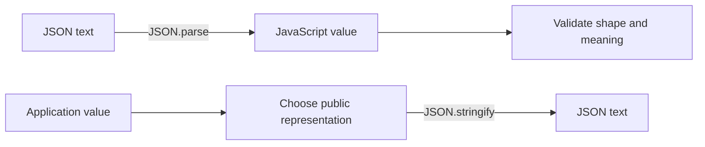

<TLDR>
  <TLDRCell label="what">
    JSON 是一种与语言无关的文本数据格式。`JSON.parse()` 把 JSON 文本转换为 JavaScript 值，`JSON.stringify()` 执行相反方向的转换。
  </TLDRCell>
  <TLDRCell label="trap">
    解析成功只证明语法有效，不证明数据符合业务契约。序列化还会丢弃或改写一部分 JavaScript 值，并且不能保留对象标识或原型。
  </TLDRCell>
  <TLDRCell label="fix">
    解析后验证数据形状，序列化前构造明确的公开表示。对大整数、日期和其他非 JSON 类型制定可逆的线格式，而不是依赖隐式转换。
  </TLDRCell>
</TLDR>

## 是什么，为什么存在

JSON 是 JavaScript Object Notation 的缩写。它是一种数据交换语法，不是 JavaScript 对象，也不是带方法的运行时值。符合 JSON 语法的一段 Unicode 文本称为<Term id="json-text">JSON 文本（JSON text）</Term>，它可以表示对象、数组、字符串、数字、布尔值或 `null`。

JSON 解决的是系统边界上的表示问题。内存中的对象不能直接穿过 HTTP、消息队列、文件或 Web Storage；把数据变成文本后，不同语言和进程就能按同一套语法交换它。把运行时值转换为这种表示的过程称为<Term id="serialization">序列化（serialization）</Term>，反方向通常称为解析或反序列化。

你会在 API 响应、请求正文、配置文件、缓存项和日志中遇到 JSON。JavaScript 提供全局 `JSON` 对象，其中最常用的两个静态方法是 `JSON.parse()` 与 `JSON.stringify()`。它们只负责语法与值之间的转换，不会替你检查字段是否存在、字符串是否真是日期，或当前用户是否有权使用某个字段。

JSON 的数据模型有意保持很小。它没有 `undefined`、`BigInt`、`Date`、`Map`、`Set`、函数、Symbol、类实例、共享引用或循环引用。跨边界需要这些概念时，发送方与接收方必须先约定如何把它们表示成 JSON 支持的值。

## 工作原理

JSON 的两个方向可以看作一条边界管道。进入应用的数据先经过语法解析，再经过形状与业务验证；离开应用的数据先被投影成公开表示，再被序列化。



### JSON 的语法与值模型

JSON 对象用花括号包围，成员名必须是双引号字符串。数组用方括号包围并保持元素顺序。对象与数组可以递归包含 JSON 支持的任意值，因此 JSON 表示的是一棵树。

字符串必须使用双引号，并用反斜杠转义双引号、反斜杠和控制字符。JSON 没有单引号字符串、注释或尾随逗号。成员名不能像 JavaScript 对象字面量那样省略引号。

JSON 数字支持十进制整数、小数和指数形式，但不支持 `NaN`、`Infinity`、`-Infinity`、BigInt 后缀 `n`、前导加号或十六进制写法。语法中的数字范围并不等于 JavaScript `Number` 能精确表示的范围；解析器最终仍会生成 `Number`。

顶层值不必是对象或数组。`"ready"`、`42`、`false` 与 `null` 都是完整的 JSON 文本。若接口只接受对象，必须在解析后单独检查，不能把“是有效 JSON”当作“是有效请求”。

对象成员名应当唯一。`JSON.parse()` 遇到重复成员名时保留后一个值，但其他实现的可观察行为未必适合互操作。生产者不应依赖重复成员覆盖来传达含义。

### `JSON.parse()` 的处理过程

`JSON.parse(text)` 必须消费完整输入。语法无效时，它会抛出 `SyntaxError`，不会返回已经解析的前半段。语法有效时，它可以返回任意 JSON 值对应的 JavaScript 值，包括 `null` 与原始值。

可选的第二个参数是<Term id="reviver">恢复函数（reviver）</Term>。解析器先构造普通 JavaScript 值，再从最深的子属性向根部调用恢复函数。回调接收字符串形式的 `key` 和当前 `value`；根调用的键是空字符串 `""`。

在 Node 24 中，恢复函数处理原始值时还会收到第三个 `context` 参数，其 `source` 属性保存该值对应的原始 JSON 片段。处理对象或数组时没有这个上下文。这个信息可以在已经生成不精确 `Number` 后，从原始数字文本重建精确整数。

恢复函数的返回值会替换当前属性。返回 `undefined` 会删除对象属性；数组元素则变成空槽，而不是让后续元素前移。根调用返回 `undefined` 时，整个 `JSON.parse()` 的结果也是 `undefined`。

### `JSON.stringify()` 的处理过程

`JSON.stringify(value)` 访问一个 JavaScript 值，并生成紧凑的 JSON 文本。第二个参数可以是<Term id="replacer">替换函数（replacer）</Term>或属性名数组；第三个 `space` 参数控制缩进，数值最多按 10 个空格处理，字符串最多使用前 10 个字符。

对象若有 `toJSON()` 方法，序列化器会先调用它，再把结果交给替换函数。`Date` 正是通过 `toJSON()` 变成 ISO 字符串，所以普通替换函数看到的通常已经不是 `Date` 实例。自定义类中的 `toJSON()` 也会改变对外表示，应当把它当作 API 契约审查。

替换函数从一个键为 `""` 的包装根开始，然后按序访问后代。它返回 `undefined` 时，对象属性会被省略；数组位置会写成 `null`。属性名数组则会在对象的每一层筛选成员，并不会只筛选顶层。

默认序列化行为不是对所有 JavaScript 值的一一映射：

| 输入位置或类型 | `JSON.stringify()` 的结果 |
| --- | --- |
| 对象属性中的 `undefined`、函数或 Symbol | 省略该属性 |
| 数组中的 `undefined`、函数或 Symbol | 写成 `null` |
| `NaN`、`Infinity` 或 `-Infinity` | 写成 `null` |
| `BigInt` | 抛出 `TypeError`，除非先提供表示规则 |
| `Date` | 通过 `toJSON()` 写成 ISO 字符串 |
| 循环引用 | 抛出 `TypeError` |

普通对象只序列化自有、可枚举、字符串键属性。Symbol 键不会出现，继承属性也不会出现。数组按从 `0` 到 `length - 1` 的位置序列化；其他自有属性不会成为数组 JSON 的成员。

### 边界上的职责

解析、验证和授权是三个不同步骤。解析器回答“文本是否符合 JSON 语法”，形状验证回答“值是否具有预期字段与类型”，业务验证回答“这些值是否满足当前操作的规则”。授权还要根据身份与资源判断操作是否允许。

发送数据时也应先定义线格式。构造只包含公开字段的新对象，比把领域对象直接传给 `JSON.stringify()` 再按黑名单删除秘密更可靠。新增内部字段时，允许列表不会自动把它泄露到响应中。

`JSON.parse(JSON.stringify(value))` 只对 JSON 数据模型内的树状值近似往返。它不是通用深拷贝，也不会恢复类实例、原型、属性描述符或共享引用。内存复制与跨系统序列化是两个不同问题。

## 示例

下面四个示例依次展示语法解析、形状验证、显式序列化和带来源文本的恢复。所有输出都来自 Node 24.14.0。

### 1. 解析完整 JSON 文本

<Depth level="quick">

```javascript run title="parse-order.js"
const source = `{
  "orderId": "A-17",
  "items": [{ "sku": "PEN", "quantity": 2 }],
  "paid": false
}`;

const order = JSON.parse(source);
console.log(order.orderId);
console.log(order.items[0].quantity);
console.log(typeof order.paid);

try {
  JSON.parse("{'orderId': 'A-17'}");
} catch (error) {
  console.log(error.name);
}
```

```text
A-17
2
boolean
SyntaxError
```

</Depth>

第一次解析得到普通对象、数组、字符串、数字和布尔值。第二次输入使用单引号，因此不是 JSON；它看起来像某些语言的对象字面量，并不会让 JSON 解析器放宽语法。

只在能处理失败的边界捕获 `SyntaxError`。若调用方需要区分无正文、错误页和格式错误的 JSON，就应保留这些不同状态，而不是统一返回空对象。

### 2. 解析后验证形状

```javascript run title="validate-order.js"
function parseOrder(source) {
  const value = JSON.parse(source);

  if (value === null || typeof value !== "object" || Array.isArray(value)) {
    throw new TypeError("order must be an object");
  }
  if (typeof value.orderId !== "string" || !Array.isArray(value.items)) {
    throw new TypeError("orderId and items are required");
  }
  if (!value.items.every((item) =>
    item !== null &&
    typeof item === "object" &&
    typeof item.sku === "string" &&
    Number.isInteger(item.quantity) &&
    item.quantity > 0
  )) {
    throw new TypeError("each item needs a SKU and positive quantity");
  }
  return value;
}

for (const source of [
  '{"orderId":"A-17","items":[{"sku":"PEN","quantity":2}]}',
  '{"orderId":"A-18","items":[{"sku":"PEN","quantity":0}]}',
  'null'
]) {
  try {
    console.log("accepted", parseOrder(source).orderId);
  } catch (error) {
    console.log("rejected", error.message);
  }
}
```

```text
accepted A-17
rejected each item needs a SKU and positive quantity
rejected order must be an object
```

三个输入在语法上都有效，只有第一个满足订单契约。验证先排除 `null` 和数组，再读取对象属性，从而避免把 `typeof null === "object"` 误当作足够的对象检查。

真实边界通常使用经过审查的 schema 验证器，但验证顺序仍然相同：先解析不可信文本，再检查顶层类别、必需字段、嵌套结构与业务约束。不要通过 TypeScript 类型断言跳过运行时验证，因为类型在运行时不存在。

### 3. 构造公开表示后序列化

```javascript run title="stringify-invoice.js"
const invoice = {
  id: "INV-9",
  totalCents: 1250n,
  customer: { name: "Mira", passwordHash: "not-for-output" },
  exportedAt: new Date("2026-09-04T10:30:00.000Z")
};

// 先构造公开数据形状，比尝试用黑名单删除秘密更安全。
const publicInvoice = {
  id: invoice.id,
  totalCents: invoice.totalCents,
  customerName: invoice.customer.name,
  exportedAt: invoice.exportedAt
};

const json = JSON.stringify(
  publicInvoice,
  (key, value) => typeof value === "bigint" ? value.toString() : value,
  2
);

console.log(json);
```

```text
{
  "id": "INV-9",
  "totalCents": "1250",
  "customerName": "Mira",
  "exportedAt": "2026-09-04T10:30:00.000Z"
}
```

公开对象按允许列表选择字段，所以 `passwordHash` 根本不会进入序列化器。替换函数把 `BigInt` 转成十进制字符串；接收方必须知道 `totalCents` 的字符串代表整数，而不是任意文本。

日期在替换函数运行前通过自己的 `toJSON()` 变成 ISO 字符串。若协议需要时区名称、日历日期或其他日期语义，就要把这些字段显式加入公开表示；一个 `Date` 本身只提供时间点。

### 4. 用恢复函数保留整数精度

```javascript run title="revive-order.js"
const source = `{
  "orderId": "A-17",
  "placedAt": "2026-09-04T10:30:00.000Z",
  "transactionId": 9007199254740993
}`;

const order = JSON.parse(source, (key, value, context) => {
  if (key === "placedAt" && typeof value === "string") {
    return new Date(value);
  }
  if (key === "transactionId" && typeof value === "number") {
    return BigInt(context.source);
  }
  return value;
});

console.log(order.placedAt instanceof Date);
console.log(order.placedAt.toISOString());
console.log(typeof order.transactionId);
console.log(order.transactionId.toString());
```

```text
true
2026-09-04T10:30:00.000Z
bigint
9007199254740993
```

`transactionId` 超出<Term id="safe-integer">安全整数（safe integer）</Term>范围。回调中的 `value` 已经是不精确的 `Number`，但 Node 24 提供的 `context.source` 仍保存原始数字字符，因此可以直接交给 `BigInt()`。

这个转换只应用于协议明确指定的字段。按“像日期”或“数字很大”等启发式条件转换所有字符串，会悄悄改变合法业务文本；更通用的协议应使用经过验证的类型标签，并处理标签与用户字段冲突。

## 陷阱

> [!PITFALL]
> **把解析成功当成输入有效。** `JSON.parse()` 会接受 `null`、数组和缺少必需字段的对象；生成代码常在解析后立即解构或调用属性。
>
> **修复方法：** 在使用前验证顶层类别、每个必需字段、嵌套值与范围。把语法错误、无正文、HTTP 错误和业务验证失败作为不同结果处理，不要捕获后一律返回 `{}`。

> [!PITFALL]
> **假定序列化完整保留值。** 对象中的 `undefined`、函数和 Symbol 会消失，数组中的对应位置变成 `null`，非有限数字变成 `null`，`BigInt` 与循环引用会抛出异常。
>
> **修复方法：** 为线格式列出支持的类型并测试每个边界值。需要在内存中复制受支持的对象图时考虑 `structuredClone()`；需要传输特殊类型时使用显式字段或带版本的编解码约定。

> [!PITFALL]
> **解析后才尝试恢复大整数。** `BigInt(value)` 只是把已经舍入的 `Number` 转成大整数，丢失的位不会回来。旧草稿中把不安全数字与同一个数字字面量比较，也可能得到误导结果，因为源码字面量本身同样会舍入。
>
> **修复方法：** 最稳妥的跨系统契约是把大整数作为十进制字符串发送并验证其语法。在支持恢复函数来源上下文的运行时，也可以按已知字段从 `context.source` 构造 `BigInt`。

> [!PITFALL]
> **用宽泛的恢复规则猜类型。** 把每个符合日期正则的字符串变成 `Date`，可能改变产品编号、纯日历日期或用户文本；未经验证的 `__type` 字段也可能与真实数据冲突。
>
> **修复方法：** 按 schema 中的具体路径恢复值，或定义带命名空间与版本的标签格式。创建 `Date` 后检查时间值与协议要求的规范形式，标签值也必须经过允许列表验证。

> [!PITFALL]
> **声称 `JSON.parse()` 本身会污染原型。** 解析 `"__proto__"` 会得到一个同名自有数据属性，不会直接修改 `Object.prototype`；危险通常出现在后续把不可信键交给旧式 setter、递归合并器或动态属性写入时。
>
> **修复方法：** 把解析结果映射成经过验证的领域对象，不要把任意键合并进有原型的配置对象。确实需要不可信字典时，考虑 `Map` 或原型为 `null` 的对象，并对允许的键建立清晰契约。

> [!PITFALL]
> **把 `JSON.stringify()` 当作内容相等或签名规范化。** 属性插入顺序不同会产生不同文本，丢弃的值又可能让不同输入产生相同文本。getter、`toJSON()` 与替换函数还可能在访问期间改变结果。
>
> **修复方法：** 业务相等应比较明确字段。缓存键、哈希或签名需要双方共同实现同一套规范化规则，并测试键顺序、数字、Unicode 与缺失字段；默认序列化输出不是这样的跨系统规范。

## AI 时代

**生成代码在这里常犯的错**

模型经常生成一个名为 `safeJsonParse` 的函数，捕获所有异常并返回空对象，结果把损坏响应伪装成合法空数据。它们还会把 TypeScript 断言当成运行时验证，假定 JSON 支持注释或尾随逗号，或用 `JSON.parse(JSON.stringify(value))` 实现会丢失日期、`undefined`、共享引用和类实例的“深拷贝”。

恢复逻辑也容易出错。常见生成结果是在精度已经丢失后调用 `BigInt(value)`，把所有日期形字符串转换为 `Date`，或用替换函数按 `password` 一个键名删除秘密，却遗漏 `token`、嵌套凭据与以后新增的字段。

**让 AI 检查**

- 列出输入允许的顶层类别、必需字段、可空字段和数值范围，并生成失败路径测试。
- 对每个经过 `JSON.stringify()` 的字段跟踪实际结果，特别检查 `BigInt`、非有限数字、`undefined`、日期、类实例与循环引用。
- 说明恢复函数与替换函数的访问顺序，并标出任何启发式类型猜测、黑名单过滤或不可信动态键写入。

**审查清单**

- 分别测试无正文、无效 JSON、有效但形状错误的 JSON，以及业务规则不成立的值。
- 用大于 `Number.MAX_SAFE_INTEGER` 的标识、合法假值、重复引用和恶意属性名运行边界测试。
- 比较序列化前后的公开字段清单，确认秘密不会因新增领域属性而自动进入输出。

**提示词词汇**

使用准确术语：`JSON text`（JSON 文本）、`serialization`（序列化）、`reviver`（恢复函数）、`replacer`（替换函数）、`post-order traversal`（后序遍历）、`safe integer`（安全整数）、`wire format`（线格式）、`schema validation`（schema 验证）和 `prototype pollution`（原型污染）。要求 AI 给出字段级输入契约和往返测试矩阵；只说“安全处理 JSON”无法明确精度、类型与信任边界。

<Depth level="deep">

## 解析与序列化的深层边界

### 字符、数字与重复成员

JSON 文本以 Unicode 定义，而 JavaScript 字符串是 UTF-16 码元序列。JSON 转义语法也能写出孤立代理码元；当前 `JSON.stringify()` 会把这种码元写成转义序列，使输出仍是可编码的 JSON 文本。接收方如何处理这些码元取决于它的字符串模型；协议若要求 Unicode 规范化，必须另外规定并在两端执行。

JSON 数字语法允许任意长度的十进制数字序列，ECMAScript 解析结果却是 `Number`。因此，语法有效不代表整数精确，也不代表其他语言能用相同数值类型接收。金额常用有单位的整数，但单位和可接受范围仍应写进 schema。

重复对象成员没有形成历史记录。Node 24 的 `JSON.parse('{"role":"user","role":"admin"}')` 得到最后一个值 `"admin"`。接收边界若需要拒绝重复键，普通 `JSON.parse()` 的恢复函数已经看不到先前成员，需要在解析前使用能报告重复成员的专用机制。

### 恢复函数的后序遍历

恢复函数先访问叶子，再访问容器，最后以空键访问根值。对于 `{"a":[1]}`，调用顺序是数组索引 `"0"`、属性 `"a"`、根键 `""`。因此，父级回调看到的是子级已经替换或删除后的值。

第三个 `context` 参数只随原始值调用。其 `source` 是当前原始值对应的精确 JSON 源片段，不是整个文档，也不是对象属性路径。使用它恢复大整数时，仍要同时验证字段身份与数字语法，避免把本应是 `Number` 的任意字段改成 `BigInt`。

普通函数形式的恢复函数会把持有当前属性的对象作为 `this`。箭头函数没有自己的 `this`，所以需要检查兄弟字段或属性描述时不能机械替换成箭头函数。大多数纯值转换不需要依赖持有者，使用箭头函数反而更清楚。

返回 `undefined` 表示删除，而不是保留原值。数组删除后会留下空槽，`length` 不变；根值被删除时，调用方拿到 `undefined`。若 `undefined` 本身是转换结果的一部分，就不能用返回值区分“恢复成 undefined”与“删除”。

### `toJSON()` 与替换函数的顺序

序列化从一个包装对象上的空键开始。每个值若提供 `toJSON()`，该方法先决定中间表示，替换函数随后才看到它。对 `Date` 做 `value instanceof Date` 的普通替换条件通常不会命中，因为回调收到的是字符串；若必须访问原始属性，可以在普通函数中谨慎查看 `this[key]`，但显式构造线格式更容易审查。

替换函数可以改写标量、返回新对象或省略属性。它也可能触发 getter，返回的对象还会继续被遍历。带副作用的 getter、`toJSON()` 或替换函数会让输出依赖访问过程，因此传输对象最好是无行为的普通数据。

空字符串既是根调用使用的键，也可能是真实对象的属性名。只用 `key === ""` 判断“这是根”会把这两种情况混在一起。确实需要区别时，应在闭包中记录第一次调用，而不是假定业务数据不会出现空键。

顶层的 `undefined`、函数或 Symbol 会让 `JSON.stringify()` 返回 JavaScript 值 `undefined`，而不是字符串 `"undefined"`。这会让要求字符串的存储或传输 API 在更远处失败。调用边界应断言结果类型，或者先限制允许序列化的顶层值。

### 树不保留对象图

JavaScript 值可以形成<Term id="object-graph">对象图（object graph）</Term>：两个属性可以指向同一对象，节点也可以回指祖先。JSON 只有嵌套树结构，没有对象标识或引用边。重复引用在往返后变成两个独立对象，循环则在默认序列化时抛出 `TypeError`。

原型、类名、私有字段、getter、setter、不可枚举属性、Symbol 键与属性描述符都不在 JSON 数据模型中。解析产生普通对象和数组，而不是原来的类实例。需要恢复领域类型时，应由验证后的字段显式构造实例，不能把输入中的类名直接用于动态构造。

`JSON.stringify()` 使用稳定且定义好的属性访问顺序，但稳定不等于规范化。两个具有相同键值、却以不同顺序构造的对象可能输出不同文本。跨语言签名还会遇到数字格式、Unicode 和重复键策略差异，所以必须先选择并实现一份共同的规范。

解析与序列化都是同步操作，并且默认处理完整文本。把巨大的输入切成字符串片段后分别调用 `JSON.parse()` 不能保持任意 JSON 结构，使用正则提取字段也不能实现 JSON 语法。需要流式处理时，应选择明确的记录分帧或经过验证的流式解析器，并另行规定资源上限。

### 嵌入与传输上下文

有效 JSON 只对 JSON 解析器安全，并不会自动适合 HTML、JavaScript 源码、SQL 或日志。把同一段文本放进另一个语法时，必须按外层语法的规则编码，不能把 `JSON.stringify()` 当作通用转义函数。

例如，HTML 解析器会把 `<script type="application/json">` 当作原始文本元素处理，其中的 `</script>` 仍可提前结束元素。服务端嵌入数据时应使用为该上下文设计的框架序列化功能，或至少按既定策略把 `<` 写成 Unicode 转义，再从元素的 `textContent` 解析。

- HTTP 入口先检查状态、媒体类型和已压缩与解压后的大小上限，再缓冲和解析正文。
- HTML 嵌入对外层标记上下文编码；不要把不可信 JSON 直接拼进标签或脚本。
- Web Storage 与文件中的长期数据带上格式版本，并为旧版本提供迁移或明确拒绝路径。
- 日志输出在序列化前按允许列表选择字段；格式正确的 JSON 仍然可能包含令牌或个人数据。

`Content-Type: application/json` 描述正文的媒体类型，却不会证明正文语法、schema 或授权正确。客户端仍要处理错误状态、空正文和服务端返回 HTML 错误页的情况。

存储中的 JSON 还会比当前代码活得更久。字段改名、单位改变或标签格式升级时，版本字段能让读取方选择迁移器，而不是用一组猜测规则解释旧数据。

日志中的 JSON 也不是天然匿名。替换函数按键名做黑名单过滤容易漏掉别名和嵌套凭据，应先构造专用日志事件，再由记录器序列化。

这些外层边界与 JSON 语法本身分开审查。先问文本将进入哪一种解析器，再为那个上下文选择编码、大小限制、版本和失败策略。

</Depth>

<Checkpoint id="javascript/json" />

## 延伸阅读

- [MDN：`JSON` 对象](https://developer.mozilla.org/en-US/docs/Web/JavaScript/Reference/Global_Objects/JSON)
- [MDN：`JSON.parse()`](https://developer.mozilla.org/en-US/docs/Web/JavaScript/Reference/Global_Objects/JSON/parse)
- [MDN：`JSON.stringify()`](https://developer.mozilla.org/en-US/docs/Web/JavaScript/Reference/Global_Objects/JSON/stringify)
- [ECMAScript 规范：JSON 对象](https://tc39.es/ecma262/multipage/structured-data.html#sec-json-object)
- [RFC 8259：JSON 数据交换格式](https://www.rfc-editor.org/rfc/rfc8259)
