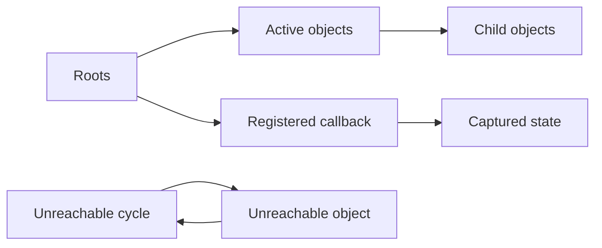

<TLDR>
  <TLDRCell label="what">
    JavaScript engines automatically reclaim objects that cannot be reached from roots. Your job isn't to free memory manually, but to control which strong references remain.
  </TLDRCell>
  <TLDRCell label="trap">
    Assigning `null`, forming a reference cycle, or seeing temporary heap growth doesn't prove a memory leak. The real problem is usually an unintended path that keeps data reachable.
  </TLDRCell>
  <TLDRCell label="fix">
    Give owners an explicit cleanup path, bound or expire collections, and use repeated lifecycle tests plus heap retaining paths to verify why objects remain reachable.
  </TLDRCell>
</TLDR>

## What it is and why it exists

JavaScript memory management covers allocating storage for values, accessing those values during execution, and reclaiming storage that is no longer needed. The runtime handles the last step through <Term id="garbage-collection">garbage collection</Term>, so application code has no general-purpose `free()` operation. Automatic reclamation prevents many dangling-pointer failures, but it doesn't understand your business lifecycle.

A collector cares about <Term id="reachability">reachability</Term>, not whether an object “looks unused.” As long as the runtime can follow strong references from a root to an object, it must retain that object and the reachable part of its <Term id="object-graph">object graph</Term>. Globals, bindings in active execution, and callbacks held by a host can all participate in such paths.

In a garbage-collected language, a <Term id="memory-leak">memory leak</Term> usually doesn't mean unreachable objects failed to be freed. It means objects the application no longer needs remain reachable. An ever-growing `Map`, an event listener that was never removed, or a long-lived closure capturing a large object are common sources; the collector cannot infer that those references violate product intent.

You meet memory problems in long-lived pages, Node.js services, caches, subscription systems, and allocation-heavy workloads. The right goal isn't to assign `null` to every local as soon as possible; it is to make data ownership, capacity limits, and cleanup timing visible. Optimize for garbage collection only after measurement shows that allocation rate or pauses are a real problem.

## How it works

Think of runtime memory as a directed graph: objects are nodes, while properties, collection entries, and closure captures are edges. A collector begins from a set of roots and marks the nodes it can reach; only the unmarked part is eligible for reclamation. ECMAScript doesn't require every engine to use one specific algorithm, so mark-and-sweep is a useful mental model rather than a guarantee of every implementation detail.



The `X → Y → X` cycle has no path from a root, so the cycle alone doesn't stop a modern tracing collector from reclaiming it. By contrast, the host still stores `Registered callback`, so its `Captured state` remains reachable. When investigating a problem, find the retaining path from a root to the target instead of merely counting references between objects.

### Strong references and lifetimes

Ordinary variables, object properties, array elements, and `Map` keys and values normally form strong references. Removing one edge makes a target unreachable only if it was the last path from any root; assigning `null` to one local does not remove aliases. Collection timing is also outside application control, so becoming unreachable and actually being reclaimed are separate events.

Leaving a scope often removes a path, but “the stack is cleared and the object is collected when scope exits” is too implementation-specific. An engine can represent values in registers, stacks, or heaps as long as observable behavior is correct. For leak analysis, reasoning about bindings and object graphs is more reliable than guessing whether a value lives on “the stack or heap.”

### Weak collections and weak references

Keys in `WeakMap` and members of `WeakSet` do not remain alive solely because they are in that collection, provided they are garbage-collectable objects or non-registered symbols. They fit metadata whose keys have owners elsewhere. A <Term id="weak-collection">weak collection</Term> is not enumerable and has no `size`, because exposing a current entry list would make unpredictable garbage-collection timing observable to the program.

`WeakRef` provides weak access to a target, and `deref()` may return the object or `undefined`. Code must not treat the target's continued existence as a business guarantee, even when calls are close together. Prefer an ordinary reference whenever it expresses ownership; weak references primarily serve measured, specialized caches or bridge structures where entries may disappear at any time.

`FinalizationRegistry` can arrange a callback after a target is collected, but that callback may run much later or never run. It cannot own correctness duties such as closing a file, committing a transaction, or releasing a lock. External resources need an explicit `close()`, `dispose()`, or structured lifetime; a finalizer is at most a fallback or diagnostic signal.

### Collection versus resource cleanup

Memory reclamation answers when storage can be reused. Resource cleanup answers when a listener, timer, socket, or file handle should stop operating. They are related, but they do not share a clock: a reachable component can close a socket correctly, while an unreachable wrapper might never get a finalizer callback.

Owners should therefore detach external registrations and delete unneeded collection entries when their lifecycle ends. Cleanup methods should ideally be safe to call more than once and safe after partial initialization. This shortens retaining paths and makes behavior independent of garbage-collector scheduling.

## Examples

The four examples progress through strong collection retention, listener cleanup, a bounded cache, and a weak association. Every output shown was produced with local Node 24. None forces garbage collection because collection timing is not a portable program contract.

### Finding the real strong reference

After the local `job` is assigned `null`, the `Map` still stores the job object as a value. Deleting the mapping removes the long-lived strong-reference path shown here.

<Depth level="quick">

```javascript run title="map-retention.js"
const activeJobs = new Map();

function rememberJob(id) {
  let job = { id, chunks: ["header", "body"] };
  activeJobs.set(id, job);
  job = null;
  return id;
}

const jobId = rememberJob("job-17");

console.log(activeJobs.has(jobId));
console.log(activeJobs.get(jobId).chunks.length);

activeJobs.delete(jobId);
console.log(activeJobs.has(jobId));
```

```text
true
2
false
```

<TryToBreak items={['save two jobs under the same id', 'delete an id that does not exist', 'keep another variable pointing to the job object']} />

</Depth>

`job = null` changes only the local binding; it does not walk the program and clear every alias. `activeJobs.delete(jobId)` removes the `Map` edge, but the example cannot prove immediate collection because the engine may run GC later. The object remains alive if another strong reference exists.

This is also the basic method for diagnosing retention: identify the target object, then follow its retaining paths back to roots. Seeing one `null` assignment doesn't end the investigation. You must also inspect collections, closures, DOM properties, and host registrations for remaining paths.

### Ending a listener lifetime with one signal

`AbortController` lets several listeners in one lifecycle share an explicit stop signal. After `abort()`, the second dispatch no longer invokes the handler, so this registration path no longer retains the handler's captured `prices` array.

```javascript run title="subscription-lifecycle.js"
const feed = new EventTarget();
const controller = new AbortController();
const prices = [];

feed.addEventListener(
  "price",
  (event) => prices.push(event.value),
  { signal: controller.signal },
);

const firstUpdate = new Event("price");
firstUpdate.value = 101;
feed.dispatchEvent(firstUpdate);
console.log(prices);

controller.abort();

const lateUpdate = new Event("price");
lateUpdate.value = 102;
feed.dispatchEvent(lateUpdate);
console.log(prices);
```

```text
[ 101 ]
[ 101 ]
```

This pattern gives the lifecycle owner a cleanup handle instead of requiring a caller to reconstruct the same anonymous function for `removeEventListener()`. In a UI component, the controller usually belongs to the component instance and aborts during unmount. If one controller manages several registrations, verify that they really share a lifetime.

Aborting the listener does not empty `prices`; that isn't the listener API's responsibility. Whether the array can be collected depends on its remaining references, and it should remain if the component still displays history. Memory management is about expressing ownership, not mechanically assigning `null` to every field.

### Putting a hard bound on a strong cache

A strong-reference cache needs a capacity, expiration, or explicit invalidation policy. This small cache deletes the earliest key by insertion order, so no more than two values remain after the third insertion.

```javascript run title="bounded-cache.js"
class RecentCache {
  #entries = new Map();

  constructor(limit) {
    if (!Number.isInteger(limit) || limit < 1) {
      throw new RangeError("limit must be a positive integer");
    }
    this.limit = limit;
  }

  set(key, value) {
    this.#entries.delete(key);
    this.#entries.set(key, value);

    if (this.#entries.size > this.limit) {
      const oldestKey = this.#entries.keys().next().value;
      this.#entries.delete(oldestKey);
    }
  }

  keys() {
    return [...this.#entries.keys()];
  }
}

const cache = new RecentCache(2);
cache.set("profile:1", { name: "Ada" });
cache.set("profile:2", { name: "Lin" });
cache.set("profile:3", { name: "Sam" });

console.log(cache.keys());
console.log(cache.limit);
```

```text
[ 'profile:2', 'profile:3' ]
2
```

This is an insertion-order cache, not a complete LRU: reading an entry does not refresh its position. The name should state that contract so callers don't assume hot entries remain. A production implementation must also define overwrite, concurrent load, failure-result, and time-expiration semantics.

The bound separates worst-case entry count from input size, but an entry count is not a byte count. If values differ greatly in size, use a weight limit or measure actual retained size under load. Without a measurement, don't claim that an object pool or handwritten loop necessarily uses less memory.

### Associating non-owning metadata with WeakMap

`WeakMap` lets the session object determine the metadata entry's lifetime. A structurally identical new object is not the original key, while an alias remains a strong reference, so metadata stays readable through `alias` after assigning `null` to `session`.

```javascript run title="weak-metadata.js"
const access = new WeakMap();

let session = { id: "s-1" };
const alias = session;
access.set(session, { role: "admin" });

console.log(access.get(session).role);
console.log(access.has({ id: "s-1" }));

session = null;
console.log(access.get(alias).role);
console.log(typeof access.keys);
```

```text
admin
false
admin
undefined
```

The last line shows that `WeakMap` has no `keys()` method. Code cannot enumerate current entries or use an example to observe exactly when a target is collected. If a cache must be enumerable, measurable, or queried by string keys, use a bounded `Map` rather than switching to a weak collection for “automatic cleanup.”

A weak collection does not weaken references elsewhere in the program. `alias` still retains the session, so its metadata remains available. When reviewing a weak cache, inspect who strongly owns each key and whether a value unnecessarily retains a larger object graph.

## Pitfalls

### Treating a cycle as a leak

> [!PITFALL]
> Two objects that reference each other don't automatically leak. If a root cannot reach the cycle, a tracing garbage collector can treat the entire unreachable subgraph as garbage.

**Fix:** inspect the retaining path from a root to the object in a heap snapshot. If it goes through a global collection, active listener, or unfinished task, fix that long-lived edge. Don't scatter `null` assignments merely to break an already unreachable internal cycle.

### Letting a cache grow without a bound

> [!PITFALL]
> A `Map` or ordinary object strongly retains its entries. Adding user-derived keys forever without a capacity, TTL, or invalidation mechanism lets reachable data accumulate with traffic.

**Fix:** specify the cache owner, maximum entry count or weight, eviction rule, and invalidation trigger. Test overflow, overwrites, and failed loads, then observe whether retained size reaches a plateau under steady load.

### Registering without symmetric cleanup

> [!PITFALL]
> A long-lived event source, observer, or timer can retain a callback, and that callback may capture an entire component state. Removing the component's DOM node does not necessarily cancel those external registrations.

**Fix:** make registration return a cleanup function, or use an owner-held `AbortSignal`. Run cleanup on unmount, cancellation, and partial-initialization failure; test repeated mount/unmount cycles using listener counts or heap snapshots.

### Treating WeakRef as a reliable cache

> [!PITFALL]
> Whether `WeakRef.deref()` succeeds depends on the implementation and GC scheduling. A target may remain for a long time when memory is plentiful or disappear quickly under pressure, so correctness based on “it is usually still there” becomes irreproducible.

**Fix:** treat a weak-cache hit as an optional optimization and make every miss recoverable from computation or authoritative storage. Use a strong cache with an explicit eviction policy when you need stable capacity, hit-rate metrics, or iteration.

### Depending on FinalizationRegistry for resources

> [!PITFALL]
> A finalizer has no guarantee of prompt or eventual execution, and it may not run at all when the process exits. Making it the sole cleanup path for locks, transactions, files, or connections puts correctness behind uncontrollable scheduling.

**Fix:** expose an explicit, idempotent close operation and ensure it runs with `try`/`finally` or a structured API. A finalizer may report omissions or provide non-critical fallback work, but it isn't the primary lifecycle protocol.

### Declaring a leak after one heap increase

> [!PITFALL]
> A heap can grow because of warm-up, delayed collection, compiler data, or an intentional cache, and it need not immediately return pages to the operating system. One memory reading cannot distinguish live objects, committed space, and memory outside the managed heap.

**Fix:** hold input and idle state constant, repeat one operation for several rounds, take snapshots at comparable collection points, and compare object counts and retaining paths. Treat growth as leak evidence only when it fails to plateau and the growing objects match a lifecycle suspicion.

<Depth level="deep">

## Language guarantees and engine policy

ECMAScript defines observable object and weak-reference API semantics, but it doesn't prescribe a general heap layout, fixed heap limit, or one garbage collector. Browsers and Node.js versions can change generational, concurrent, incremental, and compaction strategies. An application must not rely on immediate collection after an assignment or on a historical default heap size.

V8's Orinoco collector uses a generational design because many objects become unreachable quickly. Young-object regions can be processed more frequently, while longer-lived objects move to regions designed for them; parts of marking, sweeping, and compaction can also run in parallel or concurrently. These policies explain why allocation rate can affect pauses, but they do not expose a stable address or collection time for an ordinary JavaScript value.

“Stop the world” is also not a complete description of all collector work. Some phases pause JavaScript to establish consistent state, while other work overlaps application execution or uses several threads. Measure latency with the target runtime's tracing tools instead of deriving a pause duration from an algorithm name.

### Ephemeron semantics for weak keys

Describing `WeakMap` as “weak keys and strong values” misses an important boundary. If an entry's value points back to its key and no outside path reaches that key, marking every value first would incorrectly keep the key alive forever. A collector treats the entry as an ephemeron: its value participates in further marking only after the key is reachable through another path.

That behavior makes `WeakMap` useful for attaching metadata by object identity, even when the metadata happens to point back to the object. If another long-lived structure also references the value, however, the value may still retain its own object graph. A weak key solves key ownership; it is not a general exemption from bounding every cache.

`WeakRef` also has a keep-during-job rule: after code obtains a target in one JavaScript job, the runtime will not make that target disappear before that job ends. This makes one `deref()` result safe to use for the operation, but it gives no guarantee about the next task, timer, or Promise callback. Store and test one `deref()` result instead of calling repeatedly and assuming the answers agree.

## Diagnosing growth with retaining paths

A reproducible investigation begins with one complete lifecycle rather than a random RSS number. Choose an operation such as “open and close the editor” or “process one request batch,” let the application reach a stable idle state, record a baseline, and repeat the same operation. Keep each round's input size constant, or growth may simply represent more legitimate data.

In a heap snapshot, shallow size describes the object itself, while retained size estimates the reachable subgraph that could be released with it. An object with high retained size isn't automatically the root cause; the key question is why a root can still reach it. Its retaining path often reveals a module cache, event target, closure environment, or unfinished Promise chain.

When comparing snapshots, first group surviving objects by constructor and allocation stack, then sample their business identities. Large volumes of temporary objects that later disappear are churn, which may affect CPU and pauses but isn't a leak. Objects that accumulate across repeated lifecycles and have retaining paths that violate ownership are stronger evidence.

### Browser and Node.js metric boundaries

Browser developer tools can capture heap snapshots, allocation timelines, and detached DOM nodes, while page memory may also include rendering resources, images, and other non-JavaScript regions. Node.js `process.memoryUsage()` reports `heapUsed`, `heapTotal`, `external`, `arrayBuffers`, and `rss` with different boundaries; these values are not interchangeable. When a native add-on or `Buffer` grows, `heapUsed` may not be the main signal.

Forced garbage collection belongs only in a controlled investigation, where it can reduce scheduling noise between comparable snapshots. Calling explicit GC in production often hides ownership problems and can add pauses. Even if the heap falls after controlled collection, the runtime may keep committed pages for later allocations, so RSS need not fall with it.

A credible conclusion records the runtime version, sampling tool, input load, operation count, and measured boundary. Do not turn byte counts from one machine into cross-platform constants. If evidence shows only “suspected growth,” preserve that qualification and continue tracing object identity and root paths.

## Boundaries of reducing allocation pressure

Reducing temporary allocations can lower collection work, but manual reuse also creates reset-state and aliasing bugs. An object pool is justified only when profiling identifies a specific hotspot, object initialization cost matters, and complete reset can be proven. Prefer a clear lifecycle and simple code for ordinary business objects.

Batching and streaming can bound the working set only when downstream consumers also operate incrementally. Appending every chunk's result to an unlimited output array merely moves the peak to the output side. Give input queues, concurrent tasks, caches, and result collections separate bounds or backpressure policies.

Stable object shapes, typed arrays, or fewer intermediate arrays can change a particular workload, but none supports a universal performance claim without a benchmark. Measure throughput, latency percentiles, peak live memory, and collection time with production-like data, including the code complexity in the decision. If the difference is immaterial, keep the implementation that is easier to verify.

## Auditing lifetimes with an ownership table

An ownership table turns “who removes the reference” from an implicit convention into a testable contract. For every long-lived structure, record its creator, strong owner, end signal, and cleanup action. If the end signal is “process exit,” the data is effectively process-wide state.

| Structure | Typical owner | End signal | Required action |
| --- | --- | --- | --- |
| Request cache entry | Cache instance | TTL, capacity, or invalidation event | `delete()` or eviction |
| DOM listener | UI component | Unmount or cancellation | Remove listener or `abort()` |
| Repeating timer | Background task | Stop, failure, or shutdown | `clearInterval()` |
| Pending Promise | Initiating operation | Completion or cancellation | Release queued callback and input |
| Weak metadata | Key object's owner | Key becomes unreachable | Usually no explicit deletion |

The action in the table must match the real API. Emptying an array does not unregister listeners owned by objects that were in it, and canceling a network request does not necessarily remove an application cache entry. Review each resource contract instead of trusting a broadly named `cleanup()` function.

Owners also need a clear hierarchy. Request-scoped objects should not enter a process singleton, and a component controller should not accidentally abort listeners for an entire page. If several owners can delete one resource, make cleanup idempotent and test different ending orders.

### Idempotent cleanup

Cleanup may be reached through normal completion, user cancellation, and error recovery. A second call should not close an already transferred handle again or throw a new error because a field was cleared. Use explicit state or safely repeatable lower-level APIs to establish that contract.

Partially completed initialization needs cleanup too. Code that registers a listener before a later step fails should undo every step that already succeeded on the exceptional path. Testing each failure boundary finds retention bugs that a single `dispose()` test after complete construction will miss.

Define how public methods behave after cleanup as well: they can consistently throw a “closed” error, or repeated reads can return an empty result. Do not let them accidentally inspect half-cleared state, which disguises a lifecycle mistake as a random `TypeError`.

### Retention windows in asynchronous queues

Queued Promise callbacks, task records, and retry entries retain their inputs until they execute, settle, or leave the queue. Even if every item eventually completes, an unbounded arrival rate can keep growing the simultaneously live working set. That is missing backpressure or a concurrency bound, not necessarily a garbage-collector defect.

Bound waiting items separately from in-flight items, and define how cancellation removes callbacks and large inputs. Limiting only the worker count while retaining an unlimited waiting queue still leaves memory unbounded. Failed results and retry histories need their own retention policies.

During diagnosis, record queue length alongside the corresponding heap object count. If both grow together, address flow control first. If the queue falls while objects remain alive, inspect retaining paths through closures, log buffers, or monitoring labels.

### Closure capture boundaries

As long as a closure remains registered, it can keep the outer bindings it uses reachable. When code needs one field, extracting a small immutable value before creating a long-lived callback is often easier to audit than capturing an entire request or component. This is not a rule to copy all data; it narrows the ownership boundary.

How a compiler and engine represent closure environments is an implementation detail. Do not infer that an entire scope must remain merely because a variable appears in source, and do not assume an optimizer will always eliminate unused state. The retaining path in a heap snapshot is the evidence for a particular runtime.

Unregistering is usually more direct than assigning `null` to a captured variable because it removes the host-to-callback root path. If another subsystem also registers the callback, cleaning up one registration will not make it unreachable. The ownership table should expose these shared registrations.

</Depth>

<Checkpoint id="javascript/memory-management" />

## Further reading

- [MDN: Memory management](https://developer.mozilla.org/en-US/docs/Web/JavaScript/Guide/Memory_management) covers reachability, garbage collection, and the basic model of leaks.
- [MDN: WeakMap](https://developer.mozilla.org/en-US/docs/Web/JavaScript/Reference/Global_Objects/WeakMap) documents weak keys, non-enumerability, and intended uses.
- [MDN: WeakRef](https://developer.mozilla.org/en-US/docs/Web/JavaScript/Reference/Global_Objects/WeakRef) explains `deref()` and why weak references should usually be avoided.
- [MDN: FinalizationRegistry](https://developer.mozilla.org/en-US/docs/Web/JavaScript/Reference/Global_Objects/FinalizationRegistry) defines the nondeterministic finalization guarantees.
- [V8: Trash talk](https://v8.dev/blog/trash-talk) describes Orinoco's generational, parallel, and concurrent collection design.
- [Chrome DevTools: Fix memory problems](https://developer.chrome.com/docs/devtools/memory-problems/) presents a browser workflow for heap snapshots and retaining trees.
