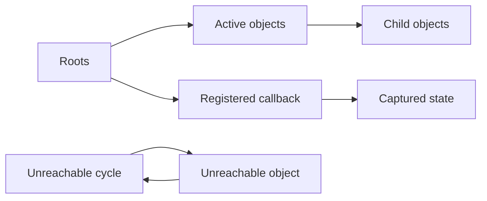

<TLDR>
  <TLDRCell label="what">
    JavaScript 引擎会自动回收从根无法到达的对象；开发者管理的重点不是手动释放内存，而是控制哪些强引用仍然存在。
  </TLDRCell>
  <TLDRCell label="trap">
    把变量设为 `null`、形成循环引用或看到堆暂时增长，都不能单独证明发生了内存泄漏；真正的问题通常是某条非预期的长期可达路径。
  </TLDRCell>
  <TLDRCell label="fix">
    让所有者提供明确的清理路径，为集合设置容量或过期策略，并用重复操作后的堆快照和保留路径验证对象为何仍然可达。
  </TLDRCell>
</TLDR>

## 是什么，为什么存在

JavaScript 的内存管理包括为值分配存储空间、在执行期间访问这些值，以及回收不再需要的空间。语言运行时通过 <Term id="garbage-collection">垃圾回收（garbage collection）</Term> 处理最后一步，因此应用代码没有通用的 `free()` 操作。自动回收避免了许多悬空指针问题，但不会理解你的业务生命周期。

垃圾回收器关注 <Term id="reachability">可达性（reachability）</Term>，而不是对象是否“看起来没用了”。只要运行时能从根沿强引用找到一个对象，该对象及其可达的 <Term id="object-graph">对象图（object graph）</Term> 就必须保留。全局变量、当前执行中的局部绑定，以及宿主持有的回调通常都能成为这类路径的一部分。

<Term id="memory-leak">内存泄漏（memory leak）</Term>在垃圾回收语言中通常不是“不可达对象没有被释放”，而是应用已经不需要的对象仍然可达。无限增长的 `Map`、未注销的事件监听器和捕获大对象的长期闭包都是常见来源。回收器不能猜出这些引用已经违背产品意图。

你会在长时间运行的页面、Node.js 服务、缓存、订阅系统和大量临时分配中遇到内存问题。正确目标不是尽快把每个局部变量设为 `null`，而是让数据所有权、容量上限和清理时机可见。只有测量显示分配速率或停顿确实有问题时，才需要针对垃圾回收优化。

## 工作原理

可以把运行时内存看成一张有向图：对象是节点，属性、集合项和闭包捕获是边。垃圾回收器从一组根开始标记能到达的节点；没有被标记的部分才有资格回收。ECMAScript 不要求所有引擎使用同一种具体算法，因此“标记—清除”适合作为心智模型，却不是每个实现细节的语言保证。



图中的循环 `X → Y → X` 没有来自根的路径，因此循环本身不会阻止现代追踪式垃圾回收器回收它们。相反，`Registered callback` 仍由宿主保存，它捕获的 `Captured state` 就保持可达。分析问题时，应寻找从根到目标的保留路径，而不是只数对象之间有多少条引用。

### 强引用与生命周期

普通变量、对象属性、数组元素以及 `Map` 的键和值通常形成强引用。删除一条边只在它是最后一条根路径时才会让目标不可达；给一个局部变量赋 `null` 并不会删除其他别名。垃圾回收的时间也不由程序决定，对象变得不可达与内存实际被回收是两件事。

作用域结束经常会移除一条路径，但“离开作用域就清栈、对象必然回收”过于具体。引擎可以用寄存器、栈或堆实现值，只要可观察行为正确。讨论泄漏时，按绑定和对象图推理比猜测某个值位于“栈还是堆”更可靠。

### 弱集合与弱引用

`WeakMap` 的键和 `WeakSet` 的成员不会仅因为位于该集合中就保持可垃圾回收的对象或非注册符号存活。它们适合把元数据关联到生命周期由别处拥有的对象。<Term id="weak-collection">弱集合（weak collection）</Term>不可枚举，也没有 `size`，因为暴露条目清单会让不可预测的垃圾回收时机变成程序可观察行为。

`WeakRef` 提供对目标的弱访问，`deref()` 可能返回对象，也可能返回 `undefined`。即使两次调用相隔很短，代码也不应把目标仍然存在当成业务保证。只要普通强引用能表达所有权，就优先使用普通引用；弱引用主要服务于经过测量、允许条目随时消失的特殊缓存或桥接结构。

`FinalizationRegistry` 可以在目标被回收后安排回调，但回调可能很晚执行，也可能永远不执行。它不能承担关闭文件、提交事务或释放锁等正确性职责。外部资源需要显式的 `close()`、`dispose()` 或结构化生命周期，终结回调最多作为补充防线或诊断信号。

### 回收与资源清理

内存回收解决的是存储空间可重新使用的问题，资源清理解决的是监听器、计时器、套接字或文件句柄何时停止工作。二者相关，却没有相同的时钟。一个仍然可达的组件可以正确关闭套接字，一个已经不可达的包装对象也可能没来得及运行任何终结回调。

因此，拥有者应在生命周期结束时主动断开外部注册，并删除不再需要的集合项。清理方法最好可重复调用，部分初始化失败时也能安全执行。这样既缩短保留路径，也让行为不依赖垃圾回收调度。

## 示例

下面四个示例依次展示强集合保留、监听器清理、有界缓存和弱关联。所有输出均使用本地 Node 24 实际运行得到；示例不强制触发垃圾回收，因为回收时机不是可移植的程序契约。

### 找到真正的强引用

局部变量 `job` 被设为 `null` 后，`Map` 仍通过值保存任务对象。只有删除映射，代码才移除这里展示的那条长期强引用路径。

<Depth level="quick">

```javascript run title="map-retention.js"
const activeJobs = new Map();

function rememberJob(id) {
  let job = { id, chunks: ["header", "body"] };
  activeJobs.set(id, job);
  job = null;
  return id;
}

const jobId = rememberJob("job-17");

console.log(activeJobs.has(jobId));
console.log(activeJobs.get(jobId).chunks.length);

activeJobs.delete(jobId);
console.log(activeJobs.has(jobId));
```

```text
true
2
false
```

<TryToBreak items={['为同一个 id 连续保存两个任务', '删除不存在的 id', '让另一个变量继续引用任务对象']} />

</Depth>

`job = null` 只改变局部绑定，不会遍历程序并清除所有别名。`activeJobs.delete(jobId)` 删除了 `Map` 的边，但示例无法证明对象立刻被回收，因为引擎可以稍后才运行垃圾回收。如果还有其他强引用，对象仍然存活。

这也是诊断保留问题的基本方法：先确定目标对象，再沿保留路径向根回溯。看到一处 `null` 赋值不能结束调查；你必须检查集合、闭包、DOM 属性和宿主注册中是否仍有路径。

### 用一个信号结束监听器生命周期

`AbortController` 可以让同一生命周期中的多个监听器共享一个明确的停止信号。`abort()` 后，第二次派发不会再调用处理器，因此处理器捕获的 `prices` 不再由该注册路径保留。

```javascript run title="subscription-lifecycle.js"
const feed = new EventTarget();
const controller = new AbortController();
const prices = [];

feed.addEventListener(
  "price",
  (event) => prices.push(event.value),
  { signal: controller.signal },
);

const firstUpdate = new Event("price");
firstUpdate.value = 101;
feed.dispatchEvent(firstUpdate);
console.log(prices);

controller.abort();

const lateUpdate = new Event("price");
lateUpdate.value = 102;
feed.dispatchEvent(lateUpdate);
console.log(prices);
```

```text
[ 101 ]
[ 101 ]
```

这个模式把清理句柄交给生命周期所有者，而不是要求调用方重新构造同一个匿名函数来执行 `removeEventListener()`。在 UI 组件中，控制器通常属于组件实例，并在卸载时中止。若一个控制器管理多项注册，要确认它们确实共享相同生命周期。

中止监听器并不会清空 `prices`，因为这不是监听器 API 的职责。数组能否回收取决于剩余引用；如果组件仍要展示历史数据，它就应该保留。内存管理的核心是表达所有权，而不是机械地把每个字段都设成 `null`。

### 给强缓存设置硬边界

强引用缓存必须有容量、过期或显式失效策略。这个最小缓存按插入顺序删除最早的键，所以第三次插入后最多保留两个值。

```javascript run title="bounded-cache.js"
class RecentCache {
  #entries = new Map();

  constructor(limit) {
    if (!Number.isInteger(limit) || limit < 1) {
      throw new RangeError("limit must be a positive integer");
    }
    this.limit = limit;
  }

  set(key, value) {
    this.#entries.delete(key);
    this.#entries.set(key, value);

    if (this.#entries.size > this.limit) {
      const oldestKey = this.#entries.keys().next().value;
      this.#entries.delete(oldestKey);
    }
  }

  keys() {
    return [...this.#entries.keys()];
  }
}

const cache = new RecentCache(2);
cache.set("profile:1", { name: "Ada" });
cache.set("profile:2", { name: "Lin" });
cache.set("profile:3", { name: "Sam" });

console.log(cache.keys());
console.log(cache.limit);
```

```text
[ 'profile:2', 'profile:3' ]
2
```

这是插入顺序缓存，不是完整的 LRU：读取条目不会刷新顺序。名称应准确反映这个契约，以免调用方误以为热点条目会保留。生产实现还要决定覆盖、并发加载、失败结果和时间过期的语义。

边界把最坏条目数从输入规模中分离出来，但条目数不等于字节数。若单个值大小差异很大，需要按权重限制或在压力测试中测量实际保留大小。没有测量前，不要声称对象池或手写循环一定更省内存。

### 用 WeakMap 关联非拥有型元数据

`WeakMap` 让会话对象决定元数据条目的生命周期。结构相同的新对象不是原键，而别名仍然是强引用，因此把 `session` 设为 `null` 后仍可通过 `alias` 查询。

```javascript run title="weak-metadata.js"
const access = new WeakMap();

let session = { id: "s-1" };
const alias = session;
access.set(session, { role: "admin" });

console.log(access.get(session).role);
console.log(access.has({ id: "s-1" }));

session = null;
console.log(access.get(alias).role);
console.log(typeof access.keys);
```

```text
admin
false
admin
undefined
```

最后一行说明 `WeakMap` 没有 `keys()` 方法。代码不能列出当前条目，也不能通过示例观察目标何时回收。需要可枚举、可统计或按字符串键查询的缓存时，应使用带边界的 `Map`，而不是为了“自动清理”改用弱集合。

弱集合不会削弱程序中其他引用。`alias` 仍然保留会话对象，所以对应元数据仍可读取。审查弱缓存时，要同时检查键由谁强持有，以及值是否不必要地保存了更大的对象图。

## 陷阱

### 把循环引用当成泄漏

> [!PITFALL]
> 两个对象互相引用并不等于泄漏。只要从根无法到达这个循环，追踪式垃圾回收器就能把整个不可达子图作为垃圾处理。

**修复：** 在堆快照中检查从根到对象的保留路径。若路径经过全局集合、活动监听器或未结束的任务，就修复那条长期边；不要为了打断一个已经不可达的内部循环而到处写 `null`。

### 让缓存无限增长

> [!PITFALL]
> `Map` 和普通对象会强持有条目。按用户输入不断加入键、却没有容量、TTL 或失效机制，会让仍然可达的数据随着流量累积。

**修复：** 先写出缓存所有者、最大条目或权重、淘汰规则以及失效触发点。测试超过边界、覆盖现有键和加载失败的情况，并观察稳定负载下的保留大小是否趋于平台期。

### 注册后没有对称清理

> [!PITFALL]
> 长期存在的事件源、观察器或计时器可以保留回调，而回调又可能捕获整个组件状态。只从 DOM 删除组件节点不一定会撤销这些外部注册。

**修复：** 让注册操作返回清理函数，或使用由所有者持有的 `AbortSignal`。在卸载、取消和部分初始化失败路径中调用清理，并用重复挂载与卸载测试监听器数量或堆快照。

### 把 WeakRef 当成可靠缓存

> [!PITFALL]
> `WeakRef.deref()` 的成功取决于实现和垃圾回收调度；内存充足时目标可能保留很久，压力下也可能很快消失。基于“通常还能取到”编写正确性逻辑会产生不可复现的缺失。

**修复：** 把弱缓存命中视为可选优化，未命中时必须能重新计算或读取权威数据。需要稳定容量、命中率统计或遍历时，使用具有明确淘汰规则的强缓存。

### 依赖 FinalizationRegistry 释放资源

> [!PITFALL]
> 终结回调没有及时执行或必然执行的保证，进程退出时可能完全不运行。把锁、事务、文件或网络连接的唯一清理放进回调，会让正确性依赖不可控调度。

**修复：** 提供显式且幂等的关闭方法，并用 `try`/`finally` 或结构化 API 确保调用。终结器只能记录遗漏或提供非关键补偿，不能成为主要生命周期协议。

### 看到堆增长就宣布泄漏

> [!PITFALL]
> 堆可以因预热、延迟回收、编译器数据或正常缓存而增长，任务结束后也不必立即归还给操作系统。单个内存读数无法区分活对象、已提交空间和进程外内存。

**修复：** 固定输入和空闲状态，重复同一操作多轮，在可比较的回收点获取快照，然后比较对象数量与保留路径。只有无法回到稳定平台且增长对象符合业务嫌疑时，才把它当作泄漏证据。

## AI 时代

**生成代码在这里常犯的错误**

模型常生成没有上限的模块级 `Map`，把请求 ID、Promise 或完整响应永久保留；也常在组件中注册匿名监听器或 `setInterval()`，却没有返回清理句柄。另一类错误是为“修复泄漏”机械地把局部变量设为 `null`，忽略真正的保留路径，或把 `WeakRef` 与 `FinalizationRegistry` 写成确定性资源管理。生成的缓存还可能声称是 LRU，却只按插入顺序淘汰，导致热点条目和预期不符。

**让 AI 检查**

- 列出每个长期集合的所有者、键空间、容量或 TTL，并说明删除发生在哪条路径。
- 为每个监听器、计时器、观察器和订阅找到对称清理操作，覆盖正常结束、取消与初始化失败。
- 从可疑对象向 GC 根写出保留路径，并区分 JavaScript 堆、`ArrayBuffer` 外部内存与进程 RSS。

**审查清单**

- 用不同输入重复执行创建与销毁流程，确认活对象数量最终进入稳定平台。
- 检查闭包是否捕获整个请求、组件或服务容器，而实际只需要一个小值。
- 确认弱引用未参与正确性决策，外部资源也不依赖终结回调释放。

**提示词词汇**

使用准确术语 `reachability`（可达性）、`GC root`（GC 根）、`retaining path`（保留路径）、`strong reference`（强引用）、`weak collection`（弱集合）、`ephemeron`（蜉蝣映射语义）、`heap snapshot`（堆快照）和 `explicit disposal`（显式释放）。要求模型输出所有权表、生命周期时间线和有界性证明；只说“优化内存”无法约束它检查真正的长期引用。

<Depth level="deep">

## 语言保证与引擎策略

ECMAScript 规定了对象和弱引用 API 的可观察语义，但不规定通用堆布局、固定堆上限或某一套垃圾回收器。不同浏览器和 Node.js 版本可以改变分代、并发、增量与压缩策略。应用不应依赖对象在某次赋值后立即回收，也不应依赖某个历史默认堆大小。

V8 的 Orinoco 回收器采用分代思想，因为许多对象很快变得不可达。年轻对象区域可以更频繁处理，存活较久的对象会进入适合长期对象的区域；标记、清扫和压缩的部分工作还可以并行或并发执行。这些策略解释了为何分配速率与停顿会相关，但不会把某个普通 JavaScript 值的实际地址或回收时刻变成稳定 API。

“停止世界”也不是所有回收工作的完整描述。某些阶段必须暂停 JavaScript 以获得一致状态，其他工作可以与应用执行重叠或由多个线程协作。做延迟分析时，应使用目标运行时的跟踪工具，而不是从算法名称推导具体停顿时间。

### 弱键的 ephemeron 语义

把 `WeakMap` 简化成“键是弱引用，值是强引用”会遗漏关键边界。如果一个条目的值反向引用其键，而程序外部不再能到达该键，单纯先标记所有值会错误地让键永久存活。垃圾回收器需要把条目按 ephemeron 处理：只有键从其他路径可达时，该条目的值才参与继续标记。

这使 `WeakMap` 适合按对象身份附加元数据，即使元数据内部偶然指回对象也不会仅凭该条目形成保留根。不过，若值还被其他长期结构引用，它仍可能保留自己的对象图。弱键只解决键所有权，不是整个缓存无界增长的通用豁免。

`WeakRef` 还有作业内保持规则：在同一个 JavaScript job 中，一旦取得目标，运行时不会在该 job 结束前让该目标消失。这让单次操作能安全使用 `deref()` 的结果，却不保证下一次任务、计时器或 Promise 回调还能取得它。代码应立即保存一次 `deref()` 的结果并判断，而不是重复调用后假设结果相同。

## 用保留路径诊断增长

可复现的诊断从一个完整生命周期开始，而不是从随机时间点的 RSS 数字开始。选择例如“打开再关闭编辑器”或“处理一批请求”的操作，先让应用进入稳定空闲态，记录基线，再重复相同操作。每轮输入规模应一致，否则增长可能只是更多合法数据。

堆快照中的 shallow size 表示对象自身占用，retained size 估计移除该对象后可能释放的整个可达子图。高 retained size 的对象不一定是根因；关键是它为何仍从根可达。查看 retaining path 通常能暴露模块级缓存、事件目标、闭包环境或未完成 Promise 链。

比较快照时，优先按构造器和分配栈查看持续增加的存活对象，再抽查其业务身份。临时对象大量分配后消失属于 churn，可能影响 CPU 和停顿，却不是泄漏。对象跨多轮生命周期持续累积且保留路径违反所有权，才是更强证据。

### 浏览器与 Node.js 指标边界

浏览器开发工具能记录堆快照、分配时间线和脱离的 DOM 节点，但页面内存还可能包含渲染资源、图片和其他非 JavaScript 区域。Node.js 的 `process.memoryUsage()` 会分别报告 `heapUsed`、`heapTotal`、`external`、`arrayBuffers` 和 `rss`；这些值描述不同边界，不能互换。原生扩展或 `Buffer` 增长时，`heapUsed` 可能不是主信号。

强制垃圾回收只适合受控诊断，用来减少不同快照之间的调度噪声。生产代码调用显式 GC 往往掩盖所有权问题，还可能增加停顿。即使受控回收后堆回落，运行时也可能保留已提交页供后续分配，所以 RSS 不一定同步下降。

一个可信结论应记录运行时版本、采样工具、输入负载、操作轮数和观察边界。不要把某台机器的一组字节数写成跨平台常量。若证据只说明“疑似增长”，保留这个限定，并继续追踪对象身份和根路径。

## 降低分配压力的边界

减少临时分配可能降低回收工作量，但手写复用也会增加状态重置和别名错误。对象池只有在性能剖析显示特定热点、对象初始化成本可控且完全重置能够证明时才值得采用。普通业务对象优先选择清楚的生命周期与简单代码。

批处理和流式处理可以限制同时在内存中的工作集，但前提是下游也按块消费。把每块结果继续推入一个无限数组，只是把峰值问题移到输出端。设计时要为输入队列、并发任务、缓存和结果集合分别写出上界或背压策略。

稳定对象形状、类型化数组或减少中间数组都可能改变特定工作负载的表现，但不能脱离基准给出普遍结论。用接近生产的数据测量吞吐、延迟分位数、峰值活内存和回收时间，并把代码复杂度计入决策。若差异不显著，保留更易验证的实现。

## 用所有权表审查生命周期

所有权表把“谁负责删除引用”从隐含约定变成可检查的契约。每个长期结构都应写出创建者、强持有者、结束信号和清理动作。若结束信号是“进程退出”，该数据事实上就是进程级状态。

| 结构 | 常见所有者 | 结束信号 | 必需动作 |
| --- | --- | --- | --- |
| 请求缓存项 | 缓存实例 | TTL、容量或失效事件 | `delete()` 或淘汰 |
| DOM 监听器 | UI 组件 | 卸载或取消 | 移除监听器或 `abort()` |
| 周期计时器 | 后台任务 | 停止、失败或关闭 | `clearInterval()` |
| 未完成 Promise | 发起的操作 | 完成或取消 | 释放排队回调与输入 |
| 弱元数据 | 键对象的所有者 | 键不再可达 | 通常无需显式删除 |

表格中的动作必须对应实际 API。把数组设为空不会注销其中对象另外注册的监听器，取消网络请求也不一定自动删除应用缓存。审查时沿每一种资源的契约逐项确认，而不是依赖一个名为 `cleanup()` 的宽泛函数名。

所有者也需要清楚的层级。请求级对象不应进入进程级单例，组件级控制器不应意外中止整个页面的监听器。若多个所有者都能删除同一资源，就让清理幂等，并测试不同结束顺序。

### 幂等清理

清理操作可能从正常完成、用户取消和错误恢复等多条路径到达。第二次调用不应重复关闭已经转移的句柄，也不应因字段已清空而抛出新异常。用明确状态或可安全重复的底层 API 实现这一契约。

初始化只完成一部分时同样需要清理。先注册监听器、后续步骤再失败的代码，应在异常路径撤销已经成功的步骤。测试每个可能失败的边界，比只测试完整构造后调用 `dispose()` 更能发现保留问题。

清理结束后，公开方法如何响应也要定义清楚：可以稳定抛出“已关闭”错误，也可以让重复读取返回空结果。不要让它偶然访问半清空状态，因为这会把生命周期错误伪装成随机的 `TypeError`。

### 异步队列的保留窗口

排队的 Promise 回调、任务队列项和重试记录会保留其输入，直到执行、拒绝处理或从队列移除。即使每项最终都会完成，无界到达速率仍可能让同时存活的工作集持续增长。这属于缺少背压或并发上限，不一定是垃圾回收器故障。

为异步管线分别限制等待项与执行中项，并定义取消后怎样移除回调和大输入。只限制 worker 数量却保留无限等待队列，仍然没有内存上界。失败结果和重试历史也需要独立的保留策略。

诊断时同时记录队列长度与堆中对应对象数量。如果二者一起增长，先解决流量控制；如果队列已经回落而对象仍存活，再查看闭包、日志缓冲或监控标签形成的保留路径。

### 闭包捕获的边界

闭包只要仍被注册，就能让它使用的外部绑定保持可达。代码需要一个字段时，先提取不可变的小值，再创建长期回调，通常比捕获整个请求或组件对象更容易审查。这不是要求复制所有数据，而是缩小所有权边界。

编译器和引擎如何表示闭包环境属于实现细节。不要仅凭源码中出现某个变量就断言整个作用域一定被保留，也不要假设优化器必然消除未使用状态。堆快照中的实际保留路径才是特定运行时上的证据。

解除注册通常比给捕获变量赋 `null` 更直接，因为它移除了宿主到回调的根路径。若回调还被其他地方复用，清理其中一个注册不会使它不可达；所有权表应列出这些共享注册。

</Depth>

<Checkpoint id="javascript/memory-management" />

## 延伸阅读

- [MDN：Memory management](https://developer.mozilla.org/en-US/docs/Web/JavaScript/Guide/Memory_management)说明可达性、垃圾回收与内存泄漏的基础模型。
- [MDN：WeakMap](https://developer.mozilla.org/en-US/docs/Web/JavaScript/Reference/Global_Objects/WeakMap)记录弱键、不可枚举性和适用场景。
- [MDN：WeakRef](https://developer.mozilla.org/en-US/docs/Web/JavaScript/Reference/Global_Objects/WeakRef)解释 `deref()` 与避免使用弱引用的建议。
- [MDN：FinalizationRegistry](https://developer.mozilla.org/en-US/docs/Web/JavaScript/Reference/Global_Objects/FinalizationRegistry)说明终结回调的非确定性保证。
- [V8：Trash talk](https://v8.dev/blog/trash-talk)介绍 Orinoco 的分代、并行和并发回收设计。
- [Chrome DevTools：Fix memory problems](https://developer.chrome.com/docs/devtools/memory-problems/)给出浏览器堆快照和保留树的诊断流程。
