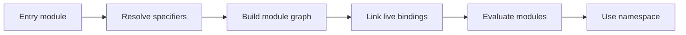

<TLDR>
  <TLDRCell label="what">
    A JavaScript module is a source unit that is resolved and evaluated independently. It exposes bindings with `export`, declares dependencies with `import`, and has its own top-level scope.
  </TLDRCell>
  <TLDRCell label="trap">
    The host resolves module specifiers, and browsers, Node, and bundlers don't share every rule. Imports are also read-only live bindings, so an early read in a cycle can hit the temporal dead zone.
  </TLDRCell>
  <TLDRCell label="fix">
    Establish every file's module format and target host before checking specifiers, export shapes, evaluation order, and dynamic-import allowlists. Don't guess by changing extensions or adding a default export.
  </TLDRCell>
</TLDR>

## What it is and why it exists

A JavaScript module puts implementation in an independent top-level scope and forms a dependency boundary with explicit imports and exports. An ECMAScript module (ESM) is the format defined by the language standard; CommonJS (CJS) is another format you still maintain in the Node ecosystem. New code generally starts with ESM, but dependencies, build configurations, and older services can still place you at the boundary between both formats.

Modules solve the implicit dependency ordering and shared global namespace of ordinary scripts. Static `import` statements show what a file needs, while `export` declarations show which bindings it provides. The runtime can also maintain one instance for each resolved module instead of executing a file for every reference.

A module isn't just another name for an arbitrary object. `export` exposes named bindings, while `export default` exposes a special export named `default`; importing the whole module produces a <Term id="module-namespace-object">module namespace object</Term>. It reflects the module's export set but isn't a regular configuration object whose properties you can freely add or delete.

You encounter modules in browser `<script type="module">` elements, Node applications, npm packages, and bundler entry points. Browsers resolve dependencies from URLs; Node also uses extensions, the nearest `package.json`, and its `type`, `exports`, and `imports` fields. A bundler may add conveniences such as aliases or extension omission, but those don't automatically become native browser or Node rules.

Static imports suit dependencies known before startup and let tools build the dependency graph in advance. `import()` suits loading that genuinely depends on a feature, locale, or route, and it returns a Promise. Both eventually expose the same module namespace semantics; dynamic import isn't an asynchronous spelling of CommonJS `require()`.

## How it works

ESM processing can be understood as resolution, instantiation, and evaluation. The host resolves each <Term id="module-specifier">module specifier</Term> to a module identity, obtains source, and builds a dependency graph; it then connects imports to exports before executing top-level code in dependency order. Implementations can overlap fetch work without changing these observable semantics.



Static `import` and `export` declarations can appear only at module top level, so a parser can discover them without running a branch. That static structure supports syntax checks, dependency analysis, and build optimizations, but “statically analyzable” doesn't mean an export is guaranteed to be tree-shaken. Side effects, re-export style, and the specific builder configuration still affect the artifact.

`import()` is an expression, so it can appear in a condition, function, or event handler. It resolves the specifier, asynchronously obtains and evaluates the target, then fulfills its Promise with a module namespace object. Resolution and evaluation failures both reject that Promise, so the error boundary must cover `await import(...)` itself, not only calls made afterward.

### Export and import shapes

A named export keeps its exported name, which the importer must match unless it uses `as` for a local rename. A module has at most one default export, and its importer chooses any local name. `import * as catalog` gathers every export into a namespace, with the default export at `catalog.default`.

`export { name } from "./source.js"` <Term id="re-export">re-exports</Term> another module's binding but doesn't create a local variable you can use in the current module. `export *` doesn't forward the target's `default`, and the same name supplied by multiple star exports becomes ambiguous. A public entry point should explicitly list names that can collide or belong to its stable API.

An ESM import is a read-only <Term id="live-binding">live binding</Term>. If the exporting module rebinds its variable, a static importer reads the new value; the importer can't assign to that binding itself. By contrast, ordinary object destructuring from a dynamic-import result assigns the property value at that moment to a new local variable, and that local doesn't keep updating.

| Syntax | Result | Local behavior |
| --- | --- | --- |
| `import { total } from "./cart.js"` | Named live binding | Readable, not assignable |
| `import checkout from "./cart.js"` | Export named `default` | Local name is chosen freely |
| `import * as cart from "./cart.js"` | Module namespace object | Properties reflect live exports |
| `const { total } = await import(url)` | Ordinary destructuring result | Local value doesn't track the export |
| `import "./metrics.js"` | No local binding | Only ensures loading and evaluation |

### Identity, caching, and side effects

The host maintains module instances by resolved module identity. Repeated imports of the same identity generally return the same namespace and share module state; top-level code doesn't rerun for every importer. Browsers normally identify modules by normalized URL, and Node ESM also caches by URL, where a different query or fragment can create another instance.

That rule enables module-level caches and singleton state, but it also lets top-level side effects affect every importer. It isn't a business lifecycle manager: tests, requests, or tenants that need isolated state should construct explicit instances. Continuously adding timestamps to specifiers creates new module identities, reruns side effects, and grows the cache.

Module specifiers include relative specifiers, absolute URLs, and bare specifiers. Native browser relative imports normally require complete file extensions, while bare specifiers require an import map or other host configuration. Node resolves packages for bare specifiers and recommends the `node:` prefix to make built-in modules explicit.

### Node 24 format boundaries

In Node 24, `.mjs` is always ESM and `.cjs` is always CommonJS. The nearest parent `package.json` mainly decides how `.js` is interpreted: `"module"` means ESM, while `"commonjs"` or an omitted field normally means CommonJS. Declare `type` explicitly in each package so tool upgrades or nested package boundaries don't silently change the interpretation.

CommonJS uses `require()` and `module.exports`. `exports` initially aliases `module.exports`, so `exports.format = format` works, whereas `exports = { format }` only reassigns the local variable and doesn't replace the real export. Across ESM and CommonJS interop, named-export detection and default-export wrapping depend on the direction and actual module shape; don't infer them from similar-looking syntax.

Node 24 can use `require()` to load ESM synchronously when the graph meets its requirements, but a target graph containing top-level `await` can't complete synchronously. Dynamic `import()` from CommonJS provides a more consistent asynchronous boundary. During a migration, verify the real entry point, Node version, and returned shape instead of relying on old slogans that all ESM is impossible to require or that both formats are interchangeable.

The `exports` field in `package.json` defines package entry points available to consumers and takes precedence over `main` when present. A conditional object can choose different targets for `import`, `require`, `node`, or `default`, with conditions ordered from specific to general. If two paths load independent implementations, the same package can acquire two copies of its state—the dual-package risk that calls for identity and side-effect-count tests.

## Examples

All four examples use `data:` modules so one file runs independently in Node 24 and ESM-capable browsers. Production code normally imports real URLs or package names; source is inline here only to keep every example copyable and executable while demonstrating exact module semantics.

### Read named and default exports

The module namespace contains `default`, `total`, and `vatRate`. Namespace keys are sorted as strings, so the output can show the complete export shape deterministically.

<Depth level="quick">

```javascript run title="named-exports.mjs"
const catalogSource = `
export const vatRate = 0.2;
export function total(net) {
  return net * (1 + vatRate);
}
export default "EU catalog";
`;

const catalogUrl = `data:text/javascript,${encodeURIComponent(catalogSource)}`;
const catalog = await import(catalogUrl);

console.log(Object.keys(catalog).join(", "));
console.log(catalog.default);
console.log(catalog.total(50).toFixed(2));
```

```text
default, total, vatRate
EU catalog
60.00
```

<TryToBreak items={['Remove the default export and inspect the keys again', 'Rename total but keep reading its old name', 'Try assigning to catalog.vatRate']} />

</Depth>

`Object.keys()` includes `default` because a default export isn't a second channel outside the namespace object. With real files, the static form could be `import catalogName, { total } from "./catalog.js"`; `catalogName` is locally chosen, while `total` must match the exported name.

An exported object can still have its internal properties changed by a caller. “The import binding is read-only” only prevents redirecting the imported name to another value; it doesn't freeze an array or object referenced by that name. A module API that promises immutability must separately control exposed references and update operations.

### Distinguish a live property from a destructured snapshot

`stock.available` reads a live export through the namespace. The destructured local `available` is just the number `2`, so it stays unchanged after `reserve()` runs.

```javascript run title="live-bindings.mjs"
const stockSource = `
export let available = 2;
export function reserve() {
  available -= 1;
}
`;

const stockUrl = `data:text/javascript,${encodeURIComponent(stockSource)}`;
const stock = await import(stockUrl);
const { available } = stock;

console.log(stock.available, available);
stock.reserve();
console.log(stock.available, available);
```

```text
2 2
1 2
```

If this used static `import { available } from "./stock.js"`, `available` itself would be a live binding and its second read would produce `1`. This difference often appears when static code is refactored to `await import()`: immediate destructuring looks similar but can freeze the reference that was meant to stay live.

Live bindings propagate rebinding; they aren't deep change notifications. If a module exports an object and the importer still holds that object, property mutations are naturally visible because the object identity is shared, not because the module system watches every property.

### Constrain dynamic import with an allowlist

A fixed table resolves public locale keys to trusted URLs. An unknown key is rejected before module resolution begins, so the caller can distinguish an unsupported locale from a failure while evaluating the module itself.

```javascript run title="dynamic-import.mjs"
const localeSources = {
  en: `export default { checkout: "Checkout" };`,
  zh: `export default { checkout: "结算" };`,
};

const localeUrls = Object.fromEntries(
  Object.entries(localeSources).map(([key, source]) => [
    key,
    `data:text/javascript,${encodeURIComponent(source)}`,
  ]),
);

async function loadLocale(language) {
  const url = localeUrls[language];
  if (!url) throw new RangeError(`Unsupported locale: ${language}`);
  return (await import(url)).default;
}

console.log((await loadLocale("en")).checkout);
console.log((await loadLocale("zh")).checkout);

try {
  await loadLocale("ja");
} catch (error) {
  console.log(`${error.name}: ${error.message}`);
}
```

```text
Checkout
结算
RangeError: Unsupported locale: ja
```

Putting a request parameter directly into `import()` gives outside input control over module selection and makes it hard for a bundler to determine which files belong in the artifact. The allowlist puts public keys, actual specifiers, and authorization policy in one place. A build step can generate a large table, but runtime selection should still be a lookup rather than an arbitrary path fragment.

This `catch` surrounds only the call that is expected to fail. Application code must also decide whether module download failure, syntax failure, and initialization failure allow fallback; returning an empty object for every case disguises deployment faults as “locale missing.”

### Observe module identity and caching

Two imports of the same `data:` URL share one module instance, so its top-level log appears once. Adding a fragment creates a distinct identity, evaluates the module again, and produces another `marker` object.

```javascript run title="module-cache.mjs"
const moduleSource = `
console.log("module evaluated");
export const marker = {};
`;

const moduleUrl = `data:text/javascript,${encodeURIComponent(moduleSource)}`;
const first = await import(moduleUrl);
const second = await import(moduleUrl);
const distinct = await import(`${moduleUrl}#copy`);

console.log(`same URL: ${first.marker === second.marker}`);
console.log(`different URL: ${first.marker === distinct.marker}`);
```

```text
module evaluated
module evaluated
same URL: true
different URL: false
```

Don't treat a query or fragment as a general-purpose “reload module” API. Different hosts and tools can further transform specifiers, and every new identity may retain another copy of state. Development servers have their own hot-update lifecycle protocols; application code shouldn't imitate them with random cache busters.

To test a shared instance, prefer public behavior such as initialization counts or returned object identity. If the requirement is isolated state, put it behind a factory and let each test create an instance explicitly instead of trying to clear an internal ESM cache.

## Pitfalls

### Treating bundler rules as host rules

> [!PITFALL]
> Generated code often copies `import "./config"`, `@/services`, or arbitrary bare specifiers from TypeScript or bundled projects. The build may succeed while the same source fails when run directly by a browser or Node 24.
>
> **Fix:** Name whether the code runs in a browser, Node, or a builder, then execute the deployed artifact. Use full URL paths for browser-relative imports; define supported Node package aliases through an `imports` map whose keys begin with `#`.

### Guessing default and named exports

> [!PITFALL]
> `import client from "pkg"`, `import { client } from "pkg"`, and `const client = require("pkg")` don't promise the same shape. Models often invent a named export from the variable name or add one `.default` too many at an interop boundary.
>
> **Fix:** Inspect the current package version's `exports` and type declarations, then record `Object.keys(namespace)` once in the target runtime. Use the documented entry; don't add both a default export and a same-named export merely to silence the error.

### Giving outside input a dynamic specifier

> [!PITFALL]
> `` import(`./plugins/${name}.js`) `` lets input control the resolution range and can leave runtime-only paths out of a built artifact. Appending a timestamp also creates a new identity on every call, repeating side effects and expanding the cache.
>
> **Fix:** Map public names to fixed specifiers or loader functions, reject unknown keys, and give every target the same export contract. Test loading, evaluation, and business-call failures separately instead of swallowing all three in one `catch`.

### Reading uninitialized bindings in a cycle

> [!PITFALL]
> ESM can link a cyclic graph, but that doesn't make every top-level read in the cycle safe. If module A reads one of its own `let`, `const`, or `class` exports back through module B before initialization, the read hits the <Term id="temporal-dead-zone">temporal dead zone</Term> and throws `ReferenceError`.
>
> **Fix:** Move shared constants or types to a leaf module with no back edge, defer cross-module reads until a function call, and test cold startup through the real entry. Dynamic import changes the API's asynchrony and isn't a mechanical fix for a cycle you haven't explained.

### Ignoring the owner of module state

> [!PITFALL]
> A top-level `const cache = new Map()` is shared by every importer of the same module instance. Tests, requests, or tenants that assume each import creates a cache contaminate each other; query-string cache busting turns that into duplicate instances and retention.
>
> **Fix:** Keep genuine process singletons at module top level and put state requiring isolation in an explicit factory. Interleave two factory instances in tests, and separately verify that module initialization happens only once.

### Mismatching Node file formats

> [!PITFALL]
> The same `.js` file can be interpreted as ESM or CommonJS because of its nearest `package.json` boundary. Moving a directory, publishing without that file, or retaining `__dirname` and `module.exports` in ESM can make code fail only after publication.
>
> **Fix:** Declare `type` in every package and use `.mjs` or `.cjs` when a boundary file needs an unambiguous format. Execute the Node 24 entry from the built directory and verify every subpath exposed by `exports`, not only source tests.

## In the AI era

**What generated code gets wrong here**

Models carry one toolchain's resolution habits into another host, such as emitting an extensionless browser import or treating a TypeScript path alias as a Node package entry. They also guess default exports from old package examples, destructure live values immediately after changing static imports to `await import()`, or splice request parameters into plugin paths. Faced with a cycle, a model may make one side dynamic but forget the new Promise boundary; faced with test contamination, it may force reloads through random query strings and accumulate module state and side-effect instances.

**Ask your AI to check**

- List every file's deployed module format, the rule that determines it, and its complete resolved identity; label which rules belong to the browser, Node 24, or the builder.
- For every import, list the actual export shape, default and named entries, and live-binding requirement; draw the top-level read order inside each strongly connected cycle.
- Enumerate every possible dynamic specifier, its input trust boundary, failure modes, and cache identity, and prove that it comes from a fixed allowlist.

**Review checklist**

- Cold-start the deployed entry in its real runtime and exercise every public `package.json` condition and subpath.
- Inspect top-level reads in cycles, ownership of mutable module state, and whether one specifier evaluates only once.
- Reject specifiers assembled from outside input and test loading, evaluation, and call failures separately.

**Prompt vocabulary**

Use exact terms: `module specifier`, `module graph`, `module namespace object`, `named export`, `default export`, `live binding`, `re-export`, `dynamic import`, `top-level await`, `conditional exports`, and `temporal dead zone`. Ask for a file-format matrix, specifier-resolution table, and cyclic-evaluation timeline; “is this import right?” is too vague to reveal host differences.

<Depth level="deep">

## Cycles and evaluation order

A module graph can contain cycles. Linking establishes bindings for the exports in the graph first, so cross-cycle references may work when a function is called later by an event or explicit entry. The danger is top-level code reading a lexical binding before the other side has initialized it, not the mere presence of a cycle.

Function declarations initialize differently from `let`, `const`, and `class`, so a small edit can turn a working cycle into one that throws. Don't make that accidental ordering part of an interface. Extracting shared definitions into a third acyclic module, or limiting top level to function definitions and deferring reads to an explicit startup step, usually makes ownership clearer.

Top-level `await` makes module evaluation asynchronous and causes dependent modules to wait. Adding it inside a cycle makes timing harder to review and prevents Node's synchronous `require(esm)` path. Network access and fallible initialization generally fit an explicit `start()` better, where the caller can own retry, timeout, and shutdown policy.

Diagnose cycles by running the real entry in a cold process. Hot updates or earlier tests can populate the module cache and hide first-evaluation faults. A graph tool can find strongly connected components, but you must still inspect which imports each module actually reads at top level.

### Initialization state of live bindings

Successful linking says that a name maps to an export, not that its binding has a readable value. A `var` export can first appear as `undefined`, while uninitialized `let`, `const`, and `class` bindings throw `ReferenceError` on access. Continuing with `undefined` is often harder to diagnose than failing immediately, so changing a declaration to `var` isn't a cycle fix either.

Module namespace properties look like object properties, but their values come from export bindings. Enumerating a namespace can inspect an entry's shape; deleting or redefining its properties can't replace the module API. Inject parameters or provide a dedicated test entry instead of trying to mutate imports into test doubles.

Re-exporting exposes a remote binding and brings the entry module into the corresponding dependency graph. Multiple barrel layers can hide where a cycle begins and make a seemingly empty entry trigger many side effects during evaluation. Keep public entries thin and explicit, and let internal modules depend directly on their real leaf dependencies.

## Browser resolution and loading

Browsers resolve module specifiers as URLs. A relative specifier is relative to the importing module's own URL, not the current document URL, so the same module can locate adjacent files when several pages reference it. An absolute URL follows URL rules, and a cross-origin fetch must also satisfy CORS.

Module scripts use strict mode automatically and have `undefined` as top-level `this`. An external `<script type="module">` defers execution until document parsing completes by default, while inline modules also participate in module-loading scheduling. `async` can alter module-script timing, so code depending on the DOM or entry ordering needs an explicit design.

An import map must take effect before modules that depend on it are resolved. It can map bare specifiers or prefixes to URLs and provide scoped mappings, but it doesn't automatically download npm packages into a browser. The application still supplies valid targets, CORS policy, content types, and deployment paths.

Dynamic imports remain subject to content security policy and cross-origin rules. Returning a Promise doesn't let `import()` bypass platform security boundaries. Failure handling should retain the original exception for diagnosis while translating user-visible errors into a stable application contract.

## Node package resolution and public entries

Relative ESM imports in Node use URL semantics and require file extensions. Directory indexes and extension searching are traditional CommonJS `require()` behavior and shouldn't be assumed for static `import`. Special characters in file URLs need correct encoding, so prefer `URL` and `import.meta.url` when working with paths.

`import.meta.url` exposes the current module URL. Node 24 also provides stable `import.meta.dirname` and `import.meta.filename`, but they apply only to `file:` modules; URL operations state the boundary more directly when supporting older versions or non-file URLs. Don't generate a CommonJS `__dirname` compatibility template without checking the target version.

Once present, `exports` encapsulates package subpaths that it doesn't list. Adding it can turn a previously working deep import into `ERR_PACKAGE_PATH_NOT_EXPORTED`, so it is a compatibility change that needs migration notes. Package authors should export a stable public surface, and consumers shouldn't bypass it by reading internal `dist` files.

The key order in conditional exports matters. More specific conditions should precede the general `default`, and every target should provide an equivalent public contract. Import the package from ESM and CommonJS separately, then compare constructor identity, registries, and side-effect counts to detect double instances.

Package `imports` mappings apply only inside the current package, and each key must begin with `#`. They work for choosing platform implementations or establishing stable internal aliases and may target external packages; they aren't consumer-facing subpath APIs. Public entries belong in `exports`, while internal aliases belong in `imports`.

## CommonJS interoperability boundaries

When importing CommonJS, ESM can always obtain the `module.exports` value through a default import. Node also tries to provide some named exports using static analysis before evaluation, but that detection doesn't cover every dynamic assignment and later additions don't provide dependable live updates. Default-import the value and access its verified object shape when you need a robust boundary.

The CommonJS wrapper supplies `exports`, `require`, `module`, `__filename`, and `__dirname`. They aren't ECMAScript globals and can't be assumed in ESM. A migration in either direction must also inspect top-level `this`, strict mode, and synchronous-loading assumptions rather than replacing keywords alone.

Node 24 returns a module namespace object from `require(esm)` and requires the complete target graph to be synchronously evaluable. A graph with top-level `await` throws a synchronous-loading error; callers that permit asynchrony should use `await import()`. A library shipping both formats should derive its entries from shared implementation and test that state doesn't split accidentally.

`module.createRequire(import.meta.url)` creates a `require` function inside ESM with resolution based on the current URL. It suits a boundary that genuinely can only load through CommonJS; it shouldn't turn the rest of an ESM file back into CommonJS style. Fewer boundaries mean fewer export-shape and error-semantic assumptions to verify.

## Module design and testing

Module top level suits constants, pure functions, and deliberately process-wide resources, but not silent network requests that can't be canceled. Import-time side effects make test order, error recovery, and shutdown implicit. Put fallible work behind an explicit function and let the entry point call it and clean it up.

Tree shaking is an artifact transformation a builder performs from static structure, not an ESM runtime guarantee. Top-level package side effects, conservative analysis, or incorrect `sideEffects` metadata can retain or wrongly remove code. Don't claim an export style reduces a package by a particular amount without measuring the real artifact.

Tests should cover resolution, export contract, and lifecycle. Running an entry from the published directory catches extension and `package.json` boundary mistakes; importing every public subpath and checking behavior catches conditional-export drift; recording initialization in a cold process catches duplicate instances and repeated side effects.

Dynamic-import tests should also cover an unknown key, loading failure, and evaluation failure. If a loader caches Promises, concurrent requests for one key can share in-flight work, but the business contract must decide whether a rejected Promise remains cached. Unbounded user values as keys turn an allowlist problem into resource growth.

A module boundary is also an architecture boundary. An entry exporting too much expands the compatibility surface, deep barrel files hide dependency direction, and deep imports across layers bypass package encapsulation. Start a review from the smallest public API deployment needs, then check that every dependency targets a stable entry.

### Diagnose the publication boundary

After source tests pass, execute the entry from the final publication directory. A build can rewrite extensions, omit `package.json`, change directory depth, or emit conditional entries that differ from source; only the artifact exposes those faults.

A library contract covers not only function signatures but also the specifiers consumers write and the module shapes they receive. Test every public entry as a separate API so a working main entry doesn't conceal drift in a subpath, CommonJS condition, or type declaration.

A minimal publication check covers these four points:

1. Install the packed artifact in an empty temporary directory instead of reading source through a workspace link.
2. Load the package through ESM and CommonJS entries, then inspect public keys and important object identities.
3. Import every documented subpath and confirm that unexported deep paths are rejected.
4. Repeat in a cold process while recording top-level side-effect counts and top-level `await` behavior.

Application deployments need the same boundary thinking. A browser should load the production manifest from its real base path, and a Node service should start in the final working directory and environment conditions; executing a source file beside the editor doesn't verify the resolution contract.

| Failure phase | Typical signal | Check first |
| --- | --- | --- |
| Resolution | `ERR_MODULE_NOT_FOUND` or a failed browser fetch | Full specifier, extension, mapping, and base URL |
| Linking | A requested export is missing | Actual entry and default/named shape |
| Evaluation | Initialization throws or a Promise rejects | Top-level side effects, cyclic reads, and top-level `await` |
| Call | The export exists but business behavior is wrong | Argument contract, state owner, and failure policy |

</Depth>

<Checkpoint id="javascript/modules" />

## Further reading

- [MDN: JavaScript modules guide](https://developer.mozilla.org/en-US/docs/Web/JavaScript/Guide/Modules)
- [MDN: static `import` declaration](https://developer.mozilla.org/en-US/docs/Web/JavaScript/Reference/Statements/import)
- [MDN: dynamic `import()` operator](https://developer.mozilla.org/en-US/docs/Web/JavaScript/Reference/Operators/import)
- [Node.js 24: ECMAScript modules](https://nodejs.org/docs/latest-v24.x/api/esm.html)
- [Node.js 24: packages and module types](https://nodejs.org/docs/latest-v24.x/api/packages.html#type)
