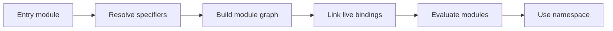

<TLDR>
  <TLDRCell label="what">
    JavaScript 模块是独立解析和求值的源码单元。它通过 `export` 公开绑定，通过 `import` 声明依赖，并拥有自己的顶层作用域。
  </TLDRCell>
  <TLDRCell label="trap">
    模块说明符的解析由宿主决定；浏览器、Node 与打包工具并不共享所有规则。导入值还是只读实时绑定，循环依赖中的过早读取会触发暂时性死区。
  </TLDRCell>
  <TLDRCell label="fix">
    先确定每个文件的模块格式和目标宿主，再检查说明符、导出形状、求值顺序与动态导入允许列表。不要用改扩展名或添加默认导出来猜测修复。
  </TLDRCell>
</TLDR>

## 是什么，为什么存在

JavaScript 模块把实现放进独立的顶层作用域，并以明确的导入、导出形成依赖边界。ES 模块（ECMAScript module，ESM）是语言标准定义的模块格式；CommonJS（CJS）则是 Node 生态中仍需维护的另一种格式。新代码通常以 ESM 为主，但依赖包、构建配置或旧服务仍可能位于两种格式的边界上。

模块解决了普通脚本共享全局命名空间和依赖顺序隐含的问题。读取一个文件时，你能从静态 `import` 看出它依赖哪些模块，并从 `export` 看出它提供哪些绑定。运行时也能为每个解析后的模块维护独立实例，而不是每次引用都重新执行文件。

一个模块不是任意对象的同义词。`export` 暴露的是具名绑定，`export default` 暴露名为 `default` 的特殊导出；导入整个模块得到的则是<Term id="module-namespace-object">模块命名空间对象（module namespace object）</Term>。它反映模块的导出集合，但不是可随意增删属性的普通配置对象。

你会在浏览器的 `<script type="module">`、Node 应用、npm 包和打包工具入口中遇到模块。浏览器从 URL 解析依赖，Node 还结合文件扩展名、最近的 `package.json` 及其 `type`、`exports` 和 `imports` 字段。打包工具可以额外提供别名或省略扩展名等便利，但这些并不会自动成为浏览器或 Node 的原生规则。

静态导入适合启动前已知的依赖，它让工具可以提前建立依赖图。`import()` 适合确实由功能、语言或路由决定的按需加载，并返回一个 Promise。两者最终都得到同一类模块命名空间语义；动态导入不是 CommonJS `require()` 的异步拼写。

## 工作原理

ESM 的处理可以分成解析、实例化和求值。宿主先把每个<Term id="module-specifier">模块说明符（module specifier）</Term>解析成模块标识，取得源码并建立依赖图；然后为导出和导入连接绑定；最后按依赖关系执行模块顶层代码。实现可以交错获取工作，但不能破坏这些可观察语义。



静态 `import` 与 `export` 只能出现在模块顶层，因此解析器无需运行分支就能发现它们。这个静态结构有利于语法检查、依赖分析和构建优化，但「可静态分析」不等于「一定会被树摇删除」。副作用、再导出方式和具体构建器配置仍会影响产物。

`import()` 是表达式，可以位于条件、函数或事件处理器中。它先解析说明符，再异步取得并求值目标，最终以模块命名空间对象兑现 Promise。说明符解析或求值失败都会拒绝 Promise，所以错误边界必须覆盖 `await import(...)` 本身，而不只是导入后的函数调用。

### 导出与导入形状

命名导出保持原名称，导入方必须使用匹配的名称，也可以用 `as` 在本地改名。默认导出在每个模块中最多一个，导入方可为它选择任意本地名称。`import * as catalog` 收集所有导出为命名空间，其中默认导出位于 `catalog.default`。

`export { name } from "./source.js"` 会<Term id="re-export">再导出（re-export）</Term>另一个模块的绑定，但不会在当前模块创建可直接使用的局部变量。`export *` 不会转发目标模块的 `default`，而且多个星号来源提供同名导出时会产生歧义。公共入口应明确列出容易冲突或属于稳定 API 的名称。

ESM 导入是只读的<Term id="live-binding">实时绑定（live binding）</Term>。导出模块重新绑定变量后，静态导入方会读到新值；导入方自己不能给该绑定赋值。相比之下，从动态导入结果执行普通对象解构会把当时的属性值赋给新的局部变量，这个局部变量不会继续更新。

| 语法 | 得到的内容 | 本地行为 |
| --- | --- | --- |
| `import { total } from "./cart.js"` | 具名实时绑定 | 可读取，不可重新赋值 |
| `import checkout from "./cart.js"` | 名为 `default` 的导出 | 本地名称可自选 |
| `import * as cart from "./cart.js"` | 模块命名空间对象 | 属性反映实时导出 |
| `const { total } = await import(url)` | 普通解构结果 | 局部值不会随导出更新 |
| `import "./metrics.js"` | 不创建本地绑定 | 只保证模块被加载和求值 |

### 标识、缓存与副作用

宿主以解析后的模块标识维护模块实例。对同一标识重复导入通常返回同一个命名空间并共享模块状态，顶层代码不会因每个导入方而重跑。浏览器通常以规范化 URL 标识模块；Node 的 ESM 也按 URL 缓存，查询参数或片段不同可以形成不同实例。

这项规则使模块级缓存和单例状态成为可能，也让顶层副作用影响所有导入方。它不是业务生命周期管理器：测试、请求或租户若需要隔离状态，应显式创建实例。给说明符不断添加时间戳会制造新模块标识，既重复执行副作用，也会让缓存持续增长。

模块说明符分为相对说明符、绝对 URL 和裸说明符等类别。浏览器原生相对导入通常需要完整文件扩展名；裸说明符需要导入映射或其他宿主配置。Node 用包解析处理裸说明符，并推荐用 `node:` 前缀明确表示内置模块。

### Node 24 的格式边界

在 Node 24 中，`.mjs` 始终是 ESM，`.cjs` 始终是 CommonJS。`.js` 的格式主要由最近父级 `package.json` 的 `type` 决定：`"module"` 表示 ESM，`"commonjs"` 或缺省通常表示 CommonJS。应在每个包中显式写出 `type`，避免工具升级或嵌套包边界改变解释方式。

CommonJS 使用 `require()` 和 `module.exports`。`exports` 初始只是 `module.exports` 的别名，因此 `exports.format = format` 有效，而 `exports = { format }` 只改了局部变量，不会替换实际导出。ESM 与 CommonJS 互操作时，命名导出的推断和默认导出包装取决于方向与具体模块形状，不应只凭语法外观猜测。

Node 24 的 `require()` 可以同步加载满足条件的 ESM，但目标图不能包含顶层 `await`；否则同步调用无法完成。CommonJS 使用动态 `import()` 是更一致的异步边界。迁移代码时应验证真实入口、Node 版本和返回形状，而不是沿用「所有 ESM 都不能 require」或「两者完全互换」这样的旧口诀。

`package.json` 的 `exports` 定义包使用者可访问的入口，并在存在时优先于 `main`。条件对象可以为 `import`、`require`、`node` 或 `default` 选择不同目标，条件顺序从具体到通用更安全。同一包若让两条路径加载彼此独立的实现，可能产生两份状态，这就是需要测试对象标识和副作用次数的双包风险。

## 示例

四个示例都使用 `data:` 模块，让单个文件能在 Node 24 和支持 ESM 的浏览器中独立运行。生产代码通常导入实际 URL 或包名；这里内联源码只为让每个示例可复制、可执行，并准确展示模块语义。

### 读取命名导出与默认导出

模块命名空间同时包含 `default`、`total` 和 `vatRate`。命名空间键按字符串顺序排列，因此输出可以稳定展示完整导出形状。

<Depth level="quick">

```javascript run title="named-exports.mjs"
const catalogSource = `
export const vatRate = 0.2;
export function total(net) {
  return net * (1 + vatRate);
}
export default "EU catalog";
`;

const catalogUrl = `data:text/javascript,${encodeURIComponent(catalogSource)}`;
const catalog = await import(catalogUrl);

console.log(Object.keys(catalog).join(", "));
console.log(catalog.default);
console.log(catalog.total(50).toFixed(2));
```

```text
default, total, vatRate
EU catalog
60.00
```

<TryToBreak items={['删除 default 导出后再次检查键', '把 total 改名后仍用旧名称读取', '尝试给 catalog.vatRate 赋值']} />

</Depth>

`Object.keys()` 看到 `default`，因为默认导出并不是命名空间对象以外的第二条通道。真实文件中的静态写法可以是 `import catalogName, { total } from "./catalog.js"`；`catalogName` 是本地选择的名称，`total` 则必须匹配导出名称。

导出对象仍可能被调用方修改内部属性。「导入绑定只读」只禁止把导入名称重新指向另一个值，不会冻结该名称指向的数组或对象。需要不可变契约时，模块 API 必须另行控制暴露的引用和更新操作。

### 区分实时属性与解构快照

`stock.available` 通过命名空间读取实时导出。解构创建的局部 `available` 只是数字 `2`，因此调用 `reserve()` 后保持不变。

```javascript run title="live-bindings.mjs"
const stockSource = `
export let available = 2;
export function reserve() {
  available -= 1;
}
`;

const stockUrl = `data:text/javascript,${encodeURIComponent(stockSource)}`;
const stock = await import(stockUrl);
const { available } = stock;

console.log(stock.available, available);
stock.reserve();
console.log(stock.available, available);
```

```text
2 2
1 2
```

若改用静态 `import { available } from "./stock.js"`，`available` 本身就是实时绑定，会在第二次读取时得到 `1`。这一区别经常出现在把静态导入重构为 `await import()` 的代码中：直接解构看起来相似，却可能把本应实时的值冻结为当时的引用。

实时绑定传播的是重新绑定结果，不是深层变更通知。若导出的是一个对象，导入方一直持有同一对象时自然能看到属性修改；这来自共享对象标识，而不是模块系统观察了每个属性。

### 用允许列表约束动态导入

语言键先在固定表中解析成受信任 URL。未知键在触发模块解析前就被拒绝，调用方因此能区分不支持的语言与模块本身求值失败。

```javascript run title="dynamic-import.mjs"
const localeSources = {
  en: `export default { checkout: "Checkout" };`,
  zh: `export default { checkout: "结算" };`,
};

const localeUrls = Object.fromEntries(
  Object.entries(localeSources).map(([key, source]) => [
    key,
    `data:text/javascript,${encodeURIComponent(source)}`,
  ]),
);

async function loadLocale(language) {
  const url = localeUrls[language];
  if (!url) throw new RangeError(`Unsupported locale: ${language}`);
  return (await import(url)).default;
}

console.log((await loadLocale("en")).checkout);
console.log((await loadLocale("zh")).checkout);

try {
  await loadLocale("ja");
} catch (error) {
  console.log(`${error.name}: ${error.message}`);
}
```

```text
Checkout
结算
RangeError: Unsupported locale: ja
```

把请求参数直接拼入 `import()` 会把模块选择权交给外部输入，也让打包工具难以确定要包含哪些文件。允许列表把公开键、实际说明符和授权策略放在同一处。若列表很大，可由构建步骤生成，但运行时仍应只查表，不应接受任意路径片段。

这里的 `catch` 只包围预期失败的调用。业务代码还应决定模块下载失败、语法错误和初始化异常是否可以回退；不加区分地返回空对象会把部署错误伪装成「语言不存在」。

### 观察模块标识与缓存

同一 `data:` URL 的两次导入共享一个模块实例，顶层日志只出现一次。添加片段后形成不同标识，模块再次求值，并产生不同的 `marker` 对象。

```javascript run title="module-cache.mjs"
const moduleSource = `
console.log("module evaluated");
export const marker = {};
`;

const moduleUrl = `data:text/javascript,${encodeURIComponent(moduleSource)}`;
const first = await import(moduleUrl);
const second = await import(moduleUrl);
const distinct = await import(`${moduleUrl}#copy`);

console.log(`same URL: ${first.marker === second.marker}`);
console.log(`different URL: ${first.marker === distinct.marker}`);
```

```text
module evaluated
module evaluated
same URL: true
different URL: false
```

不要把查询参数或片段当成通用的「重载模块」API。不同宿主和工具可能对说明符做额外转换，而且每个新标识都可能保留一份状态。开发服务器的热更新有自己的生命周期协议，应用代码不应通过随机缓存破坏符来模拟它。

测试共享实例时，优先观察公开行为，例如初始化调用次数或返回对象标识。测试隔离需求则应把状态放进工厂函数，每次测试显式创建实例，而不是尝试清除 ESM 的内部缓存。

## 陷阱

### 把打包工具规则当成宿主规则

> [!PITFALL]
> 从 TypeScript 或打包项目复制的 `import "./config"`、`@/services` 或任意裸说明符，可能在构建时成功，直接交给浏览器或 Node 24 却解析失败。
>
> **修复方法：** 写明代码运行在浏览器、Node 还是构建器中，并针对部署产物运行入口。浏览器相对导入使用完整 URL 路径；Node 包别名应通过受支持的 `imports` 映射配置，并以 `#` 开头。

### 猜错默认导出和命名导出

> [!PITFALL]
> `import client from "pkg"`、`import { client } from "pkg"` 和 `const client = require("pkg")` 并不保证得到同一形状。根据变量名补出具名导出，或在互操作边界多取一次 `.default`，都会破坏运行时导出契约。
>
> **修复方法：** 查看目标包当前版本的 `exports` 与类型声明，并在目标运行时记录一次 `Object.keys(namespace)`。使用文档给出的入口；不要为了消除错误而同时添加默认导出和同名具名导出。

### 把动态说明符交给外部输入

> [!PITFALL]
> `` import(`./plugins/${name}.js`) `` 允许输入控制解析范围，还可能让构建结果遗漏运行时才出现的路径。再附加时间戳会为每次调用制造不同标识，重复执行副作用并扩大缓存。
>
> **修复方法：** 把公开名称映射到固定说明符或固定加载函数，拒绝未知键，并为每个目标声明相同的导出契约。对加载失败、求值失败和业务调用失败分别测试，不要用一个 `catch` 全部吞掉。

### 在循环依赖中读取未初始化绑定

> [!PITFALL]
> ESM 能建立循环图，不表示循环中的任意顶层读取都安全。若模块 A 在初始化前通过模块 B 读回 A 的 `let`、`const` 或 `class` 导出，读取会落入<Term id="temporal-dead-zone">暂时性死区（temporal dead zone）</Term>并抛出 `ReferenceError`。
>
> **修复方法：** 把共享常量或类型移动到无反向依赖的叶子模块，把跨模块读取推迟到函数调用，并用真实入口测试冷启动。动态导入会改变 API 的异步性，不应作为不理解循环原因时的机械修补。

### 忽略模块级状态的所有者

> [!PITFALL]
> 顶层 `const cache = new Map()` 对同一模块实例的所有导入方共享。测试、请求或租户若误以为每次导入都会创建新缓存，就会相互污染；查询参数缓存破坏符又会把问题变成重复实例与泄漏。
>
> **修复方法：** 把进程级单例保留在模块顶层，把需要隔离的状态放入显式工厂。测试至少交错使用两个工厂实例，并单独验证模块初始化只发生一次。

### 错配 Node 文件格式

> [!PITFALL]
> 同一个 `.js` 文件会因最近的 `package.json` 边界而被解释为 ESM 或 CommonJS。移动目录、发布缺失的 `package.json`，或在 ESM 中继续依赖 `__dirname` 和 `module.exports`，都会让本地可用代码在发布后失败。
>
> **修复方法：** 每个包显式声明 `type`，边界文件需要固定格式时使用 `.mjs` 或 `.cjs`。在打包后的目录执行一次 Node 24 入口，并验证 `exports` 公开的每个子路径，而不只运行源码测试。

<Depth level="deep">

## 循环依赖与求值顺序

模块图可以包含环。链接阶段会先为图中的导出建立绑定，所以函数若只在之后的事件或入口函数中被调用，跨环引用可能正常工作。危险来自模块顶层在另一侧初始化完成前就读取词法绑定，而不是「出现循环」这一事实本身。

`function` 声明的初始化时机与 `let`、`const`、`class` 不同，因此小改动可能让一个环从可运行变为抛错。不要把这种偶然顺序当成稳定接口。把共享定义提取到第三个无环模块，或让顶层只定义函数、把实际读取推迟到显式启动步骤，通常更清楚。

顶层 `await` 会把包含它的模块求值变成异步过程，并让依赖它的模块等待。环中加入顶层 `await` 会让时间关系更难审查，也会阻止 Node 的同步 `require(esm)` 路径。网络请求和可失败初始化通常更适合放进显式 `start()`，让调用方决定重试、超时和关闭策略。

排查循环时应从冷进程运行真实入口。热更新或先前测试可能已经填充模块缓存，从而隐藏第一次求值的错误。依赖图工具可以发现强连通分量，但仍需检查每个模块顶层究竟读取了哪些导入。

### 实时绑定的初始化状态

链接成功只说明名称能对应到一个导出，不说明该绑定已有可读值。`var` 导出可能先表现为 `undefined`，而未初始化的 `let`、`const` 与 `class` 会在读取时抛出 `ReferenceError`。依赖 `undefined` 继续运行往往比立即失败更难诊断，所以也不应把 `var` 当成循环修复。

模块命名空间属性看起来像对象属性，但其值来自导出绑定。枚举命名空间可以检查入口形状，不能用删除或重定义属性来替换模块 API。测试替身最好通过参数注入或专用入口提供，而不是尝试修改导入对象。

再导出会把远端绑定继续暴露出去，也会把入口模块纳入相应依赖图。多层桶文件可能隐藏环的来源，使一个看似无逻辑的入口在求值时触发大量副作用。公共入口应薄而明确，内部模块可直接引用真正的叶子依赖。

## 浏览器解析与加载

浏览器把模块说明符解析为 URL。相对说明符相对于导入模块自身的 URL，而不是当前文档 URL；这使同一模块被不同页面引用时仍能稳定找到邻近文件。绝对 URL 受 URL 规则约束，跨源获取还必须通过 CORS。

模块脚本自动使用严格模式，顶层 `this` 是 `undefined`。外部 `<script type="module">` 默认延迟到文档解析完成后执行，而内联模块也参与模块加载调度。`async` 可以改变模块脚本的执行时机，因此依赖 DOM 或其他入口顺序时需要明确设计。

导入映射必须在依赖它的模块解析前生效。它能把裸说明符或前缀映射到 URL，也能按作用域提供不同映射，但不会把 npm 包自动下载到浏览器。映射目标、CORS、内容类型和部署路径仍需由应用提供。

动态导入可能受内容安全策略和跨源规则限制。`import()` 返回 Promise 并不意味着它绕过平台安全边界。失败处理应保留原始异常作为诊断信息，同时把用户可见错误限制在稳定的应用契约内。

## Node 包解析与公开入口

Node 的相对 ESM 导入使用 URL 语义，并要求文件扩展名。目录索引和扩展名搜索属于 CommonJS `require()` 的传统行为，不应假定静态 `import` 会照搬。文件 URL 中的特殊字符需要正确编码，处理路径时优先使用 `URL` 与 `import.meta.url`。

`import.meta.url` 给出当前模块 URL。Node 24 还提供稳定的 `import.meta.dirname` 与 `import.meta.filename`，但它们只适用于 `file:` 模块；需要兼容旧版本或非文件 URL 时，使用 URL 操作能更直接表达边界。不要机械生成 CommonJS 的 `__dirname` 兼容样板而忽略目标版本。

`exports` 一旦存在，就封装未列出的包子路径。新增它可能让过去可用的深层导入变成 `ERR_PACKAGE_PATH_NOT_EXPORTED`，因此属于需要迁移说明的兼容性变化。包作者应导出稳定公共面，使用者则不应绕过入口读取内部 `dist` 文件。

条件导出的键顺序有意义。更具体的条件应出现在更通用的 `default` 之前，并确保每个目标提供等价公共契约。分别从 ESM 与 CommonJS 消费测试包，比较构造器标识、注册表和副作用次数，可以发现双重实例。

包内 `imports` 映射只对当前包生效，键必须以 `#` 开头。它适合在包内部选择平台实现或建立稳定别名，并能映射到外部包；它不是对使用者公开的子路径接口。公开入口属于 `exports`，内部别名属于 `imports`，两者不要混用。

## CommonJS 互操作边界

导入 CommonJS 时，ESM 总能通过默认导入取得 `module.exports` 值。Node 还会在求值前通过静态分析尝试提供某些具名导出，但这种检测不覆盖所有动态赋值方式，而且后续新增属性不会形成可靠的实时更新。稳妥做法是默认导入后按已验证的对象形状访问。

CommonJS 模块包装器提供 `exports`、`require`、`module`、`__filename` 和 `__dirname`。这些不是 ECMAScript 全局变量，在 ESM 中不能直接依赖。反方向迁移也要检查顶层 `this`、严格模式和同步加载假设，而不只是替换关键字。

Node 24 的 `require(esm)` 返回模块命名空间对象，并要求整个目标图可同步求值。含顶层 `await` 的图会抛出同步加载错误；调用方若本来允许异步，应使用 `await import()`。库若同时发布两种格式，最好从共享实现生成入口并测试状态是否意外分裂。

`module.createRequire(import.meta.url)` 可以在 ESM 中创建以当前 URL 为解析基准的 `require`。它适合确实只能通过 CommonJS 加载的边界，不应成为把整个 ESM 文件写回 CommonJS 风格的借口。边界越少，导出形状与错误语义越容易验证。

## 模块设计与测试

模块顶层适合声明常量、纯函数和明确的进程级资源，不适合悄悄发起无法取消的网络请求。导入即副作用的模块让测试顺序、错误恢复和关闭过程都变得隐含。把可失败工作放进显式函数，并让入口负责调用和清理。

树摇是构建器基于静态结构做出的产物变换，不是 ESM 运行时保证。包中的顶层副作用、保守分析或错误的 `sideEffects` 元数据都可能保留或错误删除代码。没有真实产物测量时，不要声称某种导出风格会让包缩小多少。

测试应覆盖解析、导出契约和生命周期三个层面。直接运行发布目录中的入口能发现扩展名与 `package.json` 边界错误；从每个公开子路径导入并检查行为能发现条件导出漂移；在冷进程中记录初始化次数能发现双实例和重复副作用。

动态导入测试还要覆盖未知键、加载失败和模块求值失败。若加载器缓存 Promise，同一键的并发请求可以共享正在进行的工作，但失败 Promise 是否保留必须由业务契约决定。无界使用用户值作为缓存键会把允许列表问题变成资源增长问题。

模块边界也是架构边界。入口导出过多会扩大兼容面，桶文件过深会隐藏依赖方向，而跨层深层导入会绕过包作者的封装。审查时从部署所需的最小公开 API 出发，再检查每条依赖是否指向稳定入口。

### 发布边界诊断

源码测试通过后，还要从最终发布目录执行入口。构建步骤可能重写扩展名、遗漏 `package.json`、改变目录层级或生成与源码不同的条件入口，这些问题只有产物能暴露。

库的契约不只包括函数签名，也包括消费者写下的说明符和取得的模块形状。把每个公开入口当作单独 API 测试，能避免主入口可用而子路径、CommonJS 条件或类型声明已经漂移。

一次最小发布验证应覆盖以下四项：

1. 在空临时目录安装打包产物，而不是通过工作区链接读取源码。
2. 分别从 ESM 与 CommonJS 入口加载包，并检查公开键与关键对象标识。
3. 导入每个记录在文档中的子路径，同时确认未公开的深层路径被拒绝。
4. 在冷进程中重复运行，记录顶层副作用次数和顶层 `await` 的行为。

应用部署也需要同样的边界思维。浏览器应从真实基础路径加载生产清单，Node 服务则应在最终工作目录和环境条件下启动；只运行编辑器附近的源文件不能验证解析契约。

| 失败阶段 | 典型信号 | 首先检查 |
| --- | --- | --- |
| 解析 | `ERR_MODULE_NOT_FOUND` 或浏览器获取失败 | 完整说明符、扩展名、映射与基础 URL |
| 链接 | 缺少所请求的导出 | 实际入口与默认／具名形状 |
| 求值 | 初始化期间抛错或 Promise 拒绝 | 顶层副作用、循环读取与顶层 `await` |
| 调用 | 导出存在但业务行为错误 | 参数契约、状态所有者与失败策略 |

</Depth>

<Checkpoint id="javascript/modules" />

## 延伸阅读

- [MDN：JavaScript 模块指南](https://developer.mozilla.org/en-US/docs/Web/JavaScript/Guide/Modules)
- [MDN：静态 `import` 声明](https://developer.mozilla.org/en-US/docs/Web/JavaScript/Reference/Statements/import)
- [MDN：动态 `import()` 运算符](https://developer.mozilla.org/en-US/docs/Web/JavaScript/Reference/Operators/import)
- [Node.js 24：ECMAScript 模块](https://nodejs.org/docs/latest-v24.x/api/esm.html)
- [Node.js 24：包与模块类型](https://nodejs.org/docs/latest-v24.x/api/packages.html#type)
