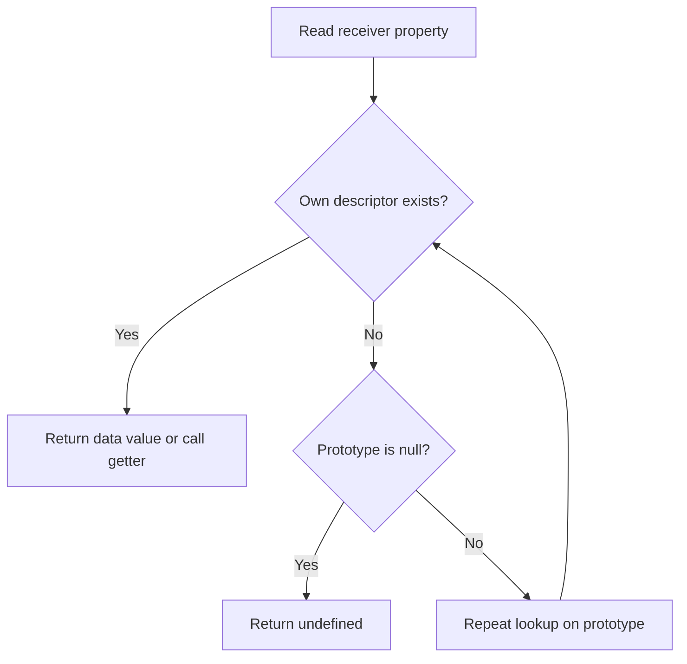

<TLDR>
  <TLDRCell label="what">
    A JavaScript object has its own properties and one internal `[[Prototype]]` link. Missing properties are looked up through that link until a match is found or the chain ends at `null`.
  </TLDRCell>
  <TLDRCell label="trap">
    Inherited properties can look like own data, shared mutable values on a prototype affect every descendant, and `obj.constructor` does not reliably identify how an object was created.
  </TLDRCell>
  <TLDRCell label="fix">
    Use `Object.hasOwn()` for ownership checks, inspect prototypes with `Object.getPrototypeOf()`, put shared behavior rather than mutable instance state on prototypes, and create prototypes deliberately.
  </TLDRCell>
</TLDR>

## What it is and why it exists

A JavaScript object is a distinct runtime value that holds keyed properties. Two objects with identical properties still have different <Term id="object-identity">object identities</Term>, so `===` compares them as different values. An object variable holds a reference to that identity; assigning the variable to another name does not copy the object.

Every ordinary object also has an internal `[[Prototype]]` slot. Its value is another object or `null`, and repeated links form the <Term id="prototype-chain">prototype chain</Term>. The chain lets several objects share behavior without copying a method onto every object.

When you evaluate `order.total`, the engine first looks for an own property named `total` on `order`. If none exists, it follows `order`'s prototype and repeats the lookup. An own property with the same key shadows an inherited property; deleting the own property can reveal the inherited value again.

Prototypes are not limited to constructor functions. Object literals normally inherit from `Object.prototype`, arrays inherit from `Array.prototype`, `Object.create(proto)` uses the supplied object directly, and class instances inherit methods from the class's `prototype` object. These forms meet at the same lookup mechanism.

You encounter this model whenever a method appears to exist without being an own property, when `in` and `Object.hasOwn()` disagree, when `this` inside an inherited method refers to a descendant, or when code handles untrusted key-value input. It also explains what JavaScript's `class` syntax builds underneath its higher-level rules.

## How it works

An object's own properties are not just key-value pairs. Each own key maps to a <Term id="property-descriptor">property descriptor</Term>, which is either a data descriptor with `value` and `writable`, or an accessor descriptor with `get` and `set`. Both kinds also carry `enumerable` and `configurable` flags.

Property keys are strings or Symbols. Dot syntax writes a fixed identifier, while bracket syntax evaluates an expression and converts it to a property key. Numeric keys such as `record[7]` become the string key `"7"`; object identity is not used as an ordinary object key, so use `Map` when object keys must stay distinct.

For a normal read, the engine applies this simplified lookup:



The original object remains the <Term id="receiver">receiver</Term> throughout a successful inherited access. If a getter or method is found on a prototype, `this` is determined by the call or access operation, not by the object that owns the descriptor. Thus `child.label` can invoke a prototype getter with `this === child`.

### Own, inherited, and shadowing

`Object.hasOwn(object, key)` reports whether the object itself has the key. The `in` operator reports whether a key exists anywhere along the object's prototype chain. A direct value test such as `if (object[key])` answers neither question because an existing property may contain `0`, `false`, `""`, `null`, or `undefined`.

Assignment usually creates or updates an own property on the receiver, but an inherited descriptor can affect the result. An inherited setter handles the assignment, while an inherited non-writable data property can reject it. `Reflect.set()` exposes success as a Boolean; ordinary assignment throws on failure in strict mode and may fail silently in sloppy mode.

Shadowing is often useful for per-object state. A prototype can provide a default `status`, and one descendant can assign an own `status` without changing its siblings. Shared mutable objects are different: mutating an inherited array changes that one array for every descendant that reaches it.

### Descriptor defaults and effects

Properties created by an object literal or simple assignment are writable, enumerable, and configurable by default. `Object.defineProperty()` uses `false` for any omitted Boolean flag. A declaration that supplies only `value` therefore creates a non-writable, non-enumerable, non-configurable property.

`enumerable` controls whether common enumeration and copying operations select the property; it does not make the property private. `configurable: false` prevents deletion and most descriptor changes. A non-configurable writable data property may still change its value and may be made non-writable, but that one-way restriction cannot later be reversed.

Accessors execute code during apparently ordinary property access. Reading can call a getter, and writing can call a setter found on the object or its chain. Treat access to an untrusted object as behavior, especially when getters or `Proxy` traps may be involved.

### Construction and shared methods

Every constructable function has a `prototype` property used by `new`; that property is not the function's own `[[Prototype]]`. For `new Subscription()`, the new object's `[[Prototype]]` normally becomes `Subscription.prototype`. Methods stored there are shared by all instances that inherit from it.

The `new` operation creates the receiver, calls the constructor with that receiver as `this`, and normally returns it. If the constructor explicitly returns another non-primitive object, that object becomes the result instead. If the function's `prototype` value is not an object, construction falls back to `Object.prototype` for the new receiver's prototype.

Class syntax still uses prototype lookup for ordinary instance methods. Public instance fields, however, become own properties during construction, static members belong to the constructor, and private fields are not properties on a prototype chain. The `javascript/classes` topic covers those additional class rules.

## Examples

The examples move from direct prototype delegation to descriptors, constructor-created instances, and safe handling of record-like input. Every output shown below comes from Node 24 running the displayed file.

### Sharing catalog behavior

Two catalogs own different item arrays but delegate operations to the same methods object. `Object.create()` fixes that relationship when each catalog is created.

<Depth level="quick">

```javascript run title="catalog.js"
const catalogMethods = {
  findBySku(sku) {
    return this.items.find((item) => item.sku === sku);
  },
  totalCents() {
    return this.items.reduce((sum, item) => sum + item.priceCents, 0);
  },
};

function makeCatalog(items) {
  const catalog = Object.create(catalogMethods);
  catalog.items = items.map((item) => ({ ...item }));
  return catalog;
}

const eu = makeCatalog([
  { sku: 'A-1', priceCents: 2199 },
  { sku: 'A-2', priceCents: 1299 },
]);
const us = makeCatalog([{ sku: 'A-1', priceCents: 2500 }]);

console.log(Object.hasOwn(eu, 'items'));
console.log(Object.hasOwn(eu, 'findBySku'));
console.log(Object.getPrototypeOf(eu) === catalogMethods);
console.log(eu.findBySku('A-2').priceCents);
console.log(eu.totalCents(), us.totalCents());
console.log(eu.findBySku === us.findBySku);
```

```text
true
false
true
1299
3498 2500
true
```

<TryToBreak items={['an unknown SKU', 'an empty catalog', 'an item whose price is zero']} />

</Depth>

`findBySku` is inherited, but the method call supplies `eu` as its receiver, so `this.items` reads `eu`'s own array. Both catalogs find the same function object through `catalogMethods`. The factory copies each input record one level so later replacement of an item's top-level fields in one catalog does not change the caller's record.

The factory does not validate item shape, deep-copy nested values, or define the result for an unknown SKU. Those are API-contract decisions rather than prototype behavior. A production version should define them before callers dereference the result.

### Controlling a property with descriptors

The account ID is visible during enumeration but cannot be replaced. The `balance` accessor validates writes while storing integer cents in an ordinary own property.

```javascript run title="account-descriptors.js"
const account = { balanceCents: 5000 };

Object.defineProperty(account, 'id', {
  value: 'acct-7',
  enumerable: true,
});

Object.defineProperty(account, 'balance', {
  get() {
    return this.balanceCents / 100;
  },
  set(amount) {
    const cents = amount * 100;
    if (!Number.isInteger(cents) || cents < 0) {
      throw new RangeError('balance must be non-negative cents');
    }
    this.balanceCents = cents;
  },
  enumerable: true,
  configurable: true,
});

account.balance = 72.5;
console.log(account.balance);
console.log(Object.keys(account).join(','));
console.log(Reflect.set(account, 'id', 'acct-8'));
console.log(account.id);
console.log(Object.getOwnPropertyDescriptor(account, 'id').writable);
```

```text
72.5
balanceCents,id,balance
false
acct-7
false
```

The omitted `writable` and `configurable` flags on `id` default to `false`. `Reflect.set()` reports the rejected write without relying on the caller's strict-mode setting. The accessor is configurable because the example deliberately opts in.

The getter reads from its receiver, which matters if another object later inherits this accessor. It also means a read may execute arbitrary code; enumeration APIs that read values can trigger the getter even though `Object.keys()` itself only collects keys.

### Following what `new` creates

The constructor initializes own data, while its prototype supplies a shared method and a default status. Assigning `status` on one instance shadows the default without changing the other instance.

```javascript run title="subscription.js"
function Subscription(plan) {
  this.plan = plan;
}

Subscription.prototype.status = 'active';
Subscription.prototype.summary = function summary() {
  return `${this.plan}:${this.status}`;
};

const first = new Subscription('pro');
const second = new Subscription('team');
first.status = 'paused';

console.log(first.summary());
console.log(second.summary());
console.log(Object.hasOwn(first, 'status'));
console.log(Object.hasOwn(second, 'status'));
console.log(first.summary === second.summary);
console.log(Object.getPrototypeOf(first) === Subscription.prototype);
console.log(first instanceof Subscription);
```

```text
pro:paused
team:active
true
false
true
true
true
```

`instanceof` succeeds because `Subscription.prototype` appears in `first`'s chain. It does not inspect the constructor body, the object's properties, or the inherited `constructor` value. Replacing `Subscription.prototype` later would affect instances created afterward but would not reconnect existing instances.

This pattern explains the prototype layer used by classes, but classes are preferable when you want class fields, private names, `extends`, or the syntax's construction safeguards. Avoid mechanically converting a class to a constructor function and assuming every class rule survives.

### Selecting own input fields

Input objects can inherit misleading fields or replace `hasOwnProperty`. This projection accepts two named own string fields and stores them in a null-prototype record.

```javascript run title="profile-record.js"
const inherited = { role: 'admin' };
const payload = Object.create(inherited);
payload.userId = 'u-17';
payload.displayName = 'Mina';
payload.hasOwnProperty = () => true;

function selectProfile(input) {
  const profile = Object.create(null);
  for (const key of ['userId', 'displayName']) {
    if (Object.hasOwn(input, key) && typeof input[key] === 'string') {
      profile[key] = input[key];
    }
  }
  return profile;
}

const profile = selectProfile(payload);
console.log(Object.keys(profile).join(','));
console.log(profile.role);
console.log('toString' in profile);
console.log(Object.hasOwn(payload, 'role'));
console.log(Object.getPrototypeOf(profile));
```

```text
userId,displayName
undefined
false
false
null
```

The allowlist prevents the inherited `role` and the hostile method from entering the result. `Object.hasOwn()` works even when the input has no prototype or shadows `hasOwnProperty`. The null-prototype result has no inherited `toString`, `constructor`, or legacy `__proto__` accessor.

This is a narrow projection, not complete untrusted-input validation. Reading an allowed field can still invoke an input getter or `Proxy` trap, and nested values would need their own validation and copy policy. JSON serialization works for ordinary string-keyed data, but code that expects methods from `Object.prototype` must handle a null-prototype record deliberately.

## Pitfalls

### Confusing `prototype` with `[[Prototype]]`

> [!PITFALL]
> A constructor's `.prototype` is an ordinary property that `new` consults. An instance's `[[Prototype]]` is an internal link; `instance.prototype` is usually `undefined`, and a function itself has a separate `[[Prototype]]` normally reached through `Function.prototype`.

**Fix:** Draw two edges: `instance --[[Prototype]]--> Constructor.prototype` and `Constructor --[[Prototype]]--> Function.prototype`. Inspect the first with `Object.getPrototypeOf(instance)`, not with the legacy `__proto__` accessor.

### Treating inherited data as owned input

> [!PITFALL]
> `key in object` and `for...in` include the prototype chain. Generated merge or validation code can therefore accept inherited values that were never present in the submitted record.

**Fix:** Define whether the contract accepts own properties, inherited properties, or both. For data records, use an explicit field allowlist and `Object.hasOwn()`; use `for...in` only when inherited enumerable keys are intentionally part of the operation.

### Putting mutable instance state on a prototype

> [!PITFALL]
> A prototype property such as `Cart.prototype.items = []` stores one array. Calling `first.items.push(...)` mutates the shared array, so every instance that has not shadowed `items` observes the change.

**Fix:** Initialize arrays, maps, dates, and other per-instance mutable values as own properties during construction. Put stateless methods and intentional immutable defaults on the prototype, and test two instances with interleaved mutations.

### Changing the chain after objects are in use

> [!PITFALL]
> Writing `__proto__` depends on a legacy accessor and is especially dangerous with untrusted keys. `Object.setPrototypeOf()` makes the operation explicit but can fail for non-extensible objects or cycles, and changing a live hierarchy can invalidate assumptions held elsewhere.

**Fix:** Choose the prototype at creation with an object literal, `Object.create()`, a constructor, or a class. Reserve `Object.setPrototypeOf()` for code whose contract explicitly requires live prototype replacement, and reject prototype-related keys at input boundaries.

### Assuming descriptor flags default to permissive values

> [!PITFALL]
> `Object.defineProperty(target, 'mode', { value: 'safe' })` does not behave like `target.mode = 'safe'`. Its omitted flags are `false`, so later assignment, enumeration, deletion, or redefinition may fail unexpectedly.

**Fix:** State every descriptor flag that matters and verify the result with `Object.getOwnPropertyDescriptor()`. Prefer ordinary assignment when the default writable, enumerable, configurable data property is exactly the contract.

### Trusting `constructor` or `instanceof` as universal type proof

> [!PITFALL]
> `constructor` is normally inherited and can be shadowed, deleted, or changed. `instanceof` follows one constructor's current `prototype` through one realm's chain, so it can reject compatible objects from another realm and can be customized with `Symbol.hasInstance`.

**Fix:** Use brand-specific checks such as `Array.isArray()` when available, or validate the behavior and data shape the boundary actually requires. Use `instanceof` when membership in that exact prototype family is the intended local contract.

## In the AI era

**What generated code gets wrong here**

Models often produce `for...in` mergers that write attacker-controlled `__proto__` keys into ordinary targets, or call `input.hasOwnProperty()` even though input may shadow the method or have a null prototype. They also put arrays on `Constructor.prototype`, confuse `Widget.prototype` with `Object.getPrototypeOf(Widget)`, and use `obj.constructor.name` as an authorization or serialization discriminator. Another common patch adds `Object.setPrototypeOf()` after construction to make a missing method appear, without checking object ownership or why lookup failed.

**Ask your AI to check**

- List every property read and write, and classify the key as allowlisted or attacker-controlled and the resolved descriptor as own or inherited.
- Draw the `[[Prototype]]` chain for each constructed object, separately from each function's `.prototype` property.
- Identify accessors, `Proxy` traps, shared mutable prototype values, and assignments that can invoke an inherited setter.

**Review checklist**

- Test with an inherited field, a shadowed `hasOwnProperty`, a `__proto__` key, and a null-prototype record.
- Create two instances and mutate every collection or object-valued field to expose accidental shared state.
- Inspect descriptors and prototypes directly; do not accept `constructor.name`, truthiness, or one `instanceof` result as a substitute.

**Prompt vocabulary**

Use the exact terms `own property`, `inherited property`, `[[Prototype]]`, `prototype chain`, `property descriptor`, `data descriptor`, `accessor descriptor`, `receiver`, `shadowing`, `null-prototype object`, and `prototype pollution`. Ask for an ownership table and a chain diagram; “check this object code” is too vague to expose lookup and input-boundary mistakes.

<Depth level="deep">

## Lookup and descriptor semantics

The specification models ordinary object behavior with internal methods such as `[[GetOwnProperty]]`, `[[Get]]`, `[[Set]]`, and `[[GetPrototypeOf]]`. Application code cannot call the double-bracket methods directly. APIs including `Object.getOwnPropertyDescriptor()`, `Reflect.get()`, `Reflect.set()`, and `Object.getPrototypeOf()` expose controlled parts of their behavior.

### A read keeps its receiver

Ordinary `[[Get]]` first asks the current object for an own descriptor. A data descriptor returns its value. An accessor descriptor calls its getter with the original receiver; if neither exists, lookup delegates to the prototype while preserving that receiver.

This distinction lets a prototype accessor operate on descendant state. If `priceView` owns a `formatted` getter and `product` inherits from `priceView`, reading `product.formatted` can read `product.priceCents`. Calling `Reflect.get(priceView, 'formatted', anotherProduct)` makes the receiver choice explicit.

A missing property is not the same as an own property whose value is `undefined`. Both reads produce `undefined`, but `Object.hasOwn()` distinguishes them and deletion affects them differently. API contracts that care about omission must test ownership rather than the value alone.

### Writes can involve the chain

Ordinary assignment is not simply “put this key on the left object.” The engine first considers the descriptor found through the receiver and its prototypes. A writable data path can lead to creating or updating an own property on the receiver, while a setter is called with the receiver and a non-writable data descriptor rejects the write.

`Reflect.set(target, key, value, receiver)` exposes all four inputs and returns whether the internal set succeeded. This is useful in metaprogramming and tests because it avoids strict-versus-sloppy ambiguity. A `true` result says the operation completed according to the object's semantics; it does not promise that `receiver` now has an own data property, because a setter may have stored data elsewhere.

Getters and setters are inherited independently as one accessor descriptor. Defining an own data property with the same key shadows the whole inherited accessor for later ordinary reads. To reuse an inherited setter, invoke the intended interface instead of copying one function out of its descriptor casually.

### Descriptor transitions

A property cannot be both a data descriptor and an accessor descriptor. Supplying `value` or `writable` together with `get` or `set` makes `Object.defineProperty()` throw a `TypeError`. Descriptor inspection is the reliable way to tell which kind an existing own property uses.

Non-configurable properties enforce one-way invariants. They cannot be deleted, switched between data and accessor kinds, or made configurable. A non-configurable, non-writable data property can only be redefined with the same value under `Object.is()` semantics; these rules let engines and proxies rely on stable object facts.

A descriptor-preserving shallow copy can combine `Object.getOwnPropertyDescriptors(source)` with `Object.create(Object.getPrototypeOf(source), descriptors)`. It preserves the outer prototype and accessor functions without running getters during copying, but nested object references remain shared. Name such a helper for that exact shallow contract, not `deepClone`.

## Construction and identity

### The steps behind `new`

For an ordinary base constructor, `new C(...args)` finds `C.prototype`, creates a fresh ordinary object linked to that value when it is an object, and calls `C` with the fresh object as `this`. The fresh object is returned unless the constructor explicitly returns another object. Returning a primitive does not replace it.

That return override is why `new C()` does not prove the result inherits from `C.prototype`. A constructor can deliberately return a proxy, cached object, or other record, although surprising overrides make identity and `instanceof` reasoning harder. Factory functions communicate arbitrary return behavior more directly.

Arrow functions and concise methods are not constructable and therefore cannot be used with `new`. Ordinary functions may be callable, constructable, or both depending on how they were defined. Class constructors are constructable but throw when called without `new`.

### The two prototype relationships of a function

A normal function object usually inherits function behavior from `Function.prototype`; this is its own `[[Prototype]]` relationship. Separately, its `.prototype` property usually points to an object intended for instances created by `new`. These are different objects serving different lookup chains.

The object initially stored in `C.prototype` normally has a non-enumerable `constructor` data property pointing back to `C`. That reverse link is conventional, not a secure record of origin. Replacing `C.prototype` with another object loses the default link unless code defines one, and any descendant can shadow it.

Existing instances keep the prototype object captured when they were created. Adding a method to that same object becomes visible to them through normal lookup, but assigning an entirely new object to `C.prototype` only changes later construction. This difference follows object identity: mutation keeps the prototype object's identity, while replacement changes which identity the constructor property references.

### `instanceof` and realms

The ordinary `value instanceof C` algorithm asks whether `C.prototype` appears in `value`'s chain. It does not compare property shapes. A class can customize the operation through `Symbol.hasInstance`, so even that chain description is not universal for every right-hand value.

Each browser realm has its own intrinsic constructors and prototype objects. An array created in another iframe can fail `value instanceof Array` in the current realm because the current `Array.prototype` is absent from its chain. `Array.isArray(value)` performs the appropriate array brand check across realms.

Prototype identity is still valuable inside an intentional local hierarchy. Use `Object.getPrototypeOf()` for exact links and `prototype.isPrototypeOf(value)` for chain membership when the prototype object itself is the subject. Do not call an overridable instance method supplied by untrusted input to answer either question.

## Prototype-safe data boundaries

### Null-prototype records

`Object.create(null)` produces an object whose chain ends immediately. It does not inherit `toString`, `hasOwnProperty`, `constructor`, or the legacy `__proto__` accessor. This makes it useful for a string-keyed dictionary whose consumers are prepared for that narrower interface.

The object is still mutable unless its descriptors or integrity level say otherwise. It can own a data property literally named `"__proto__"`, and that key still needs policy at a boundary. A null prototype reduces collisions with inherited names; it does not validate values, impose an allowlist, or prevent resource exhaustion from too many keys.

Many APIs work with null-prototype records, including `Object.keys()`, `Object.hasOwn()`, and `JSON.stringify()` for supported values. Code that calls `record.toString()` or expects `record instanceof Object` does not. Decide whether the value is a dictionary or a behavior-bearing object, then document that representation.

### Prototype pollution paths

Prototype pollution occurs when data-controlled keys alter a prototype object or an object's prototype relationship, causing properties to appear on unrelated lookups. The exact path depends on the merge code and input format. A classic risk is generic recursive assignment that treats keys such as `__proto__`, `prototype`, and `constructor` as ordinary navigation without an allowlist.

Object spread into a new literal defines own data properties and does not use the inherited `__proto__` setter in the same way as ordinary assignment. That difference does not make spreading arbitrary input a complete defense: it can still copy unwanted fields, invoke source getters, expose secrets, or feed dangerous keys to later code. Security comes from a narrow output schema and validated values.

At a trust boundary, construct the result from named fields, use `Object.hasOwn()` when omission matters, and choose a safe container. Test the whole downstream path because a harmless own string key can become dangerous when another layer later assigns it into a different target.

### Inspecting without guessing

For one object, start with `Object.getPrototypeOf()`, `Reflect.ownKeys()`, and `Object.getOwnPropertyDescriptors()`. Together they show the direct chain edge and every own string or Symbol descriptor without reading accessor values. Repeat on the prototype only when the property of interest is not own.

Developer consoles often render inherited fields and accessors helpfully, but the display is not the language operation your code performs. Expand the actual descriptor and compare object identities explicitly. Logging an object for later inspection can also show its later mutated state in some developer tools, so capture the specific facts a test needs.

For generated code, turn assumptions into adversarial fixtures: an object with a null prototype, an inherited enumerable property, a non-enumerable own property, a Symbol key, a throwing getter, and a shadowed method. Use only the fixtures relevant to the contract; the goal is to prove ownership and behavior, not to accept every exotic object.

</Depth>

<Checkpoint id="javascript/objects-prototypes" />

## Further reading

- [MDN: Inheritance and the prototype chain](https://developer.mozilla.org/en-US/docs/Web/JavaScript/Guide/Inheritance_and_the_prototype_chain)
- [MDN: `Object.defineProperty()`](https://developer.mozilla.org/en-US/docs/Web/JavaScript/Reference/Global_Objects/Object/defineProperty)
- [MDN: `Object.hasOwn()`](https://developer.mozilla.org/en-US/docs/Web/JavaScript/Reference/Global_Objects/Object/hasOwn)
- [MDN: `new` operator](https://developer.mozilla.org/en-US/docs/Web/JavaScript/Reference/Operators/new)
- [ECMAScript specification: ordinary object internal methods and slots](https://tc39.es/ecma262/multipage/ordinary-and-exotic-objects-behaviours.html#sec-ordinary-object-internal-methods-and-internal-slots)
