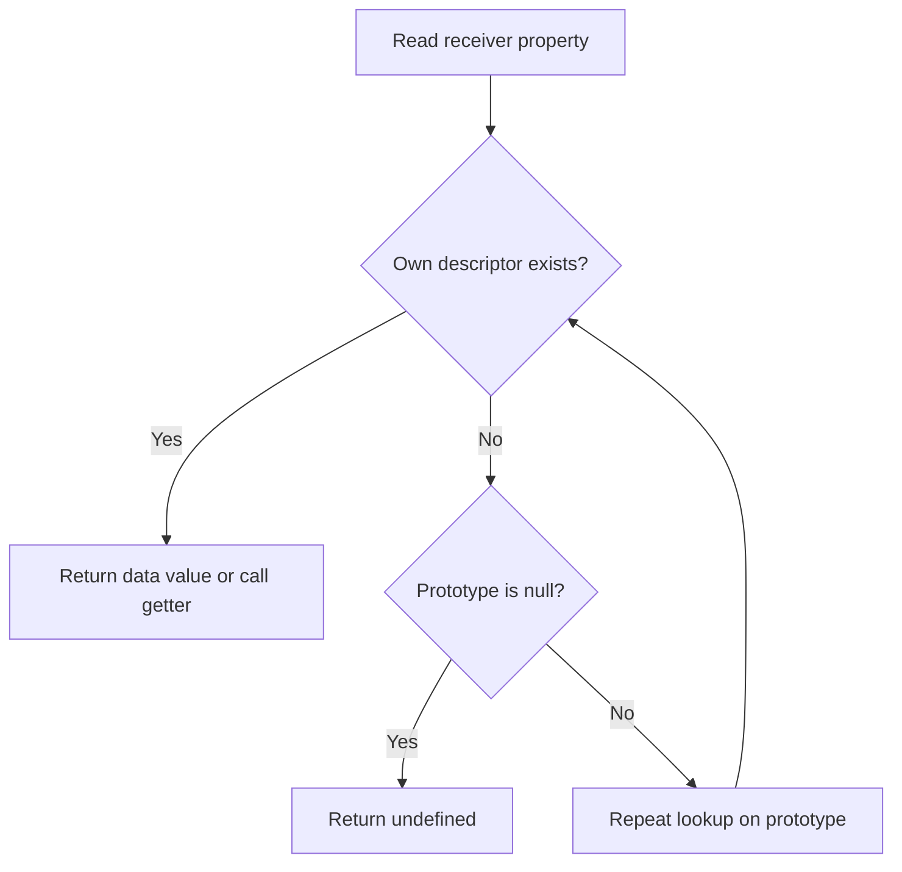

<TLDR>
  <TLDRCell label="what">
    JavaScript 对象拥有自有属性和一条内部 `[[Prototype]]` 链接。找不到属性时，查找会沿这条链接继续，直到命中属性或在 `null` 处结束。
  </TLDRCell>
  <TLDRCell label="trap">
    继承属性看起来可能像自有数据，原型上的共享可变值会影响所有后代，而且 `obj.constructor` 不能可靠说明对象的创建方式。
  </TLDRCell>
  <TLDRCell label="fix">
    用 `Object.hasOwn()` 检查所有权，用 `Object.getPrototypeOf()` 检查原型。原型应保存共享行为而不是可变实例状态，并且应在创建对象时明确选择原型。
  </TLDRCell>
</TLDR>

## 是什么，为什么存在

JavaScript 对象是拥有键控属性的独立运行时值。即使两个对象的属性完全相同，它们仍有不同的<Term id="object-identity">对象标识（object identity）</Term>，所以 `===` 会把它们视为不同的值。对象变量保存的是对该标识的引用；把变量赋给另一个名称不会复制对象。

每个普通对象还有一个内部 `[[Prototype]]` 槽位。它的值是另一个对象或 `null`，连续的链接构成<Term id="prototype-chain">原型链（prototype chain）</Term>。多个对象可以通过原型链共享行为，不必把方法复制到每个对象上。

求值 `order.total` 时，引擎先在 `order` 上查找名为 `total` 的自有属性。如果不存在，就沿 `order` 的原型继续查找。相同键的自有属性会遮蔽继承属性；删除自有属性后，继承值可能再次显现。

原型并不只属于构造函数。对象字面量通常继承 `Object.prototype`，数组继承 `Array.prototype`，`Object.create(proto)` 直接使用给定对象，类实例则从类的 `prototype` 对象继承方法。这些形式最终都使用同一种查找机制。

方法并非自有属性却可以调用、`in` 与 `Object.hasOwn()` 结果不同、继承方法里的 `this` 指向后代对象，或代码处理不可信键值输入时，都会遇到这套模型。它也解释了 JavaScript 的 `class` 语法在更高层规则之下构造了什么。

## 工作原理

对象的自有属性不只是键值对。每个自有键都对应一个<Term id="property-descriptor">属性描述符（property descriptor）</Term>。描述符要么是包含 `value` 与 `writable` 的数据描述符，要么是包含 `get` 与 `set` 的访问器描述符；两者还都有 `enumerable` 与 `configurable` 标志。

属性键只能是字符串或 Symbol。点语法写入固定标识符，方括号语法会求值表达式并把结果转换为属性键。`record[7]` 这样的数字键会变成字符串键 `"7"`；普通对象键不会保留对象标识，因此需要区分对象键时应使用 `Map`。

对于普通读取，引擎执行下面这套简化查找流程：



继承访问成功时，原始对象始终是<Term id="receiver">接收者（receiver）</Term>。如果在原型上找到 getter 或方法，`this` 由调用或访问操作决定，而不是由拥有描述符的对象决定。因此，`child.label` 可以调用原型 getter，同时让 `this === child`。

### 自有、继承与遮蔽

`Object.hasOwn(object, key)` 判断对象自身是否拥有该键。`in` 运算符判断对象原型链上的任何位置是否存在该键。`if (object[key])` 这样的直接值检查不能回答这两个问题，因为已有属性的值可能是 `0`、`false`、`""`、`null` 或 `undefined`。

赋值通常会在接收者上创建或更新自有属性，但继承描述符可能改变结果。继承 setter 会处理赋值，继承的不可写数据属性则可以拒绝赋值。`Reflect.set()` 以布尔值暴露成功状态；普通赋值失败时，在严格模式下会抛错，在非严格模式下可能静默失败。

遮蔽常用于保存每个对象独有的状态。原型可以提供默认 `status`，某个后代可以写入自有 `status`，而不影响同级对象。共享可变对象则不同：修改继承数组会改变唯一的那个数组，所有能访问它的后代都会看到变化。

### 描述符的默认值与效果

对象字面量或简单赋值创建的属性默认可写、可枚举、可配置。`Object.defineProperty()` 会把省略的布尔标志设为 `false`。因此，只提供 `value` 会创建不可写、不可枚举、不可配置的属性。

`enumerable` 控制常见枚举与复制操作是否选择该属性，并不会使属性私有。`configurable: false` 会阻止删除和大多数描述符变更。不可配置但可写的数据属性仍可改变值，也可改成不可写；但这种单向限制以后不能撤销。

访问器会让看似普通的属性访问执行代码。读取可能调用 getter，写入可能调用对象自身或原型链上的 setter。处理不可信对象时，应把属性访问视为行为，因为 getter 或 `Proxy` trap 都可能参与其中。

### 构造过程与共享方法

每个可构造函数都有供 `new` 使用的 `prototype` 属性；它不是函数自身的 `[[Prototype]]`。执行 `new Subscription()` 时，新对象的 `[[Prototype]]` 通常会成为 `Subscription.prototype`。保存在那里的方法由继承它的所有实例共享。

`new` 操作会创建接收者，以该接收者作为 `this` 调用构造函数，并且通常返回它。如果构造函数显式返回另一个非原始对象，该对象会成为结果。如果函数的 `prototype` 值不是对象，新接收者的原型会回退到 `Object.prototype`。

类语法中的普通实例方法仍然依靠原型查找。公开实例字段则在构造期间成为自有属性，静态成员属于构造函数，私有字段不属于任何原型链。其他类规则由 `javascript/classes` 主题详细说明。

## 示例

下面的示例依次展示直接原型委托、描述符、构造函数创建的实例，以及安全处理记录型输入。所有输出均来自 Node 24 对所示文件的实际运行结果。

### 共享商品目录行为

两个商品目录各自拥有不同的商品数组，但把操作委托给同一个方法对象。`Object.create()` 在创建每个目录时固定这种关系。

<Depth level="quick">

```javascript run title="catalog.js"
const catalogMethods = {
  findBySku(sku) {
    return this.items.find((item) => item.sku === sku);
  },
  totalCents() {
    return this.items.reduce((sum, item) => sum + item.priceCents, 0);
  },
};

function makeCatalog(items) {
  const catalog = Object.create(catalogMethods);
  catalog.items = items.map((item) => ({ ...item }));
  return catalog;
}

const eu = makeCatalog([
  { sku: 'A-1', priceCents: 2199 },
  { sku: 'A-2', priceCents: 1299 },
]);
const us = makeCatalog([{ sku: 'A-1', priceCents: 2500 }]);

console.log(Object.hasOwn(eu, 'items'));
console.log(Object.hasOwn(eu, 'findBySku'));
console.log(Object.getPrototypeOf(eu) === catalogMethods);
console.log(eu.findBySku('A-2').priceCents);
console.log(eu.totalCents(), us.totalCents());
console.log(eu.findBySku === us.findBySku);
```

```text
true
false
true
1299
3498 2500
true
```

<TryToBreak items={['不存在的 SKU', '空商品目录', '价格为零的商品']} />

</Depth>

`findBySku` 是继承方法，但方法调用把 `eu` 作为接收者，所以 `this.items` 读取 `eu` 的自有数组。两个目录都通过 `catalogMethods` 找到同一个函数对象。工厂对输入记录逐个进行一层复制，所以后来替换某个目录中商品的顶层字段，不会改变调用方的记录。

工厂没有校验商品形状，没有深拷贝嵌套值，也没有定义 SKU 不存在时的结果。这些属于 API 契约，而不是原型行为。生产版本应先明确这些规则，再让调用方解引用结果。

### 用描述符控制属性

账户 ID 会参与枚举，但不能被替换。`balance` 访问器校验写入，同时把整数分值保存在普通自有属性中。

```javascript run title="account-descriptors.js"
const account = { balanceCents: 5000 };

Object.defineProperty(account, 'id', {
  value: 'acct-7',
  enumerable: true,
});

Object.defineProperty(account, 'balance', {
  get() {
    return this.balanceCents / 100;
  },
  set(amount) {
    const cents = amount * 100;
    if (!Number.isInteger(cents) || cents < 0) {
      throw new RangeError('balance must be non-negative cents');
    }
    this.balanceCents = cents;
  },
  enumerable: true,
  configurable: true,
});

account.balance = 72.5;
console.log(account.balance);
console.log(Object.keys(account).join(','));
console.log(Reflect.set(account, 'id', 'acct-8'));
console.log(account.id);
console.log(Object.getOwnPropertyDescriptor(account, 'id').writable);
```

```text
72.5
balanceCents,id,balance
false
acct-7
false
```

`id` 上省略的 `writable` 与 `configurable` 标志默认为 `false`。`Reflect.set()` 会报告写入遭拒，不依赖调用方是否启用严格模式。示例有意把访问器设为可配置。

getter 从接收者读取数据，这一点在其他对象继承该访问器时很重要。这也表示读取可能执行任意代码；会读取值的枚举 API 可能触发 getter，而 `Object.keys()` 自身只收集键。

### 跟踪 `new` 创建的对象

构造函数初始化自有数据，原型则提供共享方法与默认状态。在一个实例上写入 `status` 会遮蔽默认值，但不会改变另一个实例。

```javascript run title="subscription.js"
function Subscription(plan) {
  this.plan = plan;
}

Subscription.prototype.status = 'active';
Subscription.prototype.summary = function summary() {
  return `${this.plan}:${this.status}`;
};

const first = new Subscription('pro');
const second = new Subscription('team');
first.status = 'paused';

console.log(first.summary());
console.log(second.summary());
console.log(Object.hasOwn(first, 'status'));
console.log(Object.hasOwn(second, 'status'));
console.log(first.summary === second.summary);
console.log(Object.getPrototypeOf(first) === Subscription.prototype);
console.log(first instanceof Subscription);
```

```text
pro:paused
team:active
true
false
true
true
true
```

`instanceof` 成功是因为 `Subscription.prototype` 出现在 `first` 的原型链上。它不会检查构造函数体、对象属性或继承的 `constructor` 值。以后替换 `Subscription.prototype` 会影响后续创建的实例，但不会重新连接已有实例。

这个模式解释了类使用的原型层；需要类字段、私有名称、`extends` 或类语法的构造保护时，类更合适。不要机械地把类转换成构造函数，并假定所有类规则都能保留。

### 选择输入的自有字段

输入对象可能继承误导性字段，也可能替换 `hasOwnProperty`。这个投影只接受两个具名的自有字符串字段，并把它们保存到无原型记录中。

```javascript run title="profile-record.js"
const inherited = { role: 'admin' };
const payload = Object.create(inherited);
payload.userId = 'u-17';
payload.displayName = 'Mina';
payload.hasOwnProperty = () => true;

function selectProfile(input) {
  const profile = Object.create(null);
  for (const key of ['userId', 'displayName']) {
    if (Object.hasOwn(input, key) && typeof input[key] === 'string') {
      profile[key] = input[key];
    }
  }
  return profile;
}

const profile = selectProfile(payload);
console.log(Object.keys(profile).join(','));
console.log(profile.role);
console.log('toString' in profile);
console.log(Object.hasOwn(payload, 'role'));
console.log(Object.getPrototypeOf(profile));
```

```text
userId,displayName
undefined
false
false
null
```

允许列表阻止继承的 `role` 和恶意方法进入结果。即使输入没有原型或遮蔽了 `hasOwnProperty`，`Object.hasOwn()` 仍可正常工作。无原型结果不会继承 `toString`、`constructor` 或旧式 `__proto__` 访问器。

这只是有限投影，并非完整的不可信输入校验。读取允许字段仍可能调用输入 getter 或 `Proxy` trap；嵌套值也需要自己的校验与复制策略。普通字符串键数据可以进行 JSON 序列化，但依赖 `Object.prototype` 方法的代码必须明确处理无原型记录。

## 陷阱

### 混淆 `prototype` 与 `[[Prototype]]`

> [!PITFALL]
> 构造函数的 `.prototype` 是供 `new` 查询的普通属性。实例的 `[[Prototype]]` 是内部链接；`instance.prototype` 通常为 `undefined`，函数自身还有一条通常通向 `Function.prototype` 的独立 `[[Prototype]]` 链接。

**修复方法：** 画出两条边：`instance --[[Prototype]]--> Constructor.prototype` 与 `Constructor --[[Prototype]]--> Function.prototype`。用 `Object.getPrototypeOf(instance)` 检查第一条边，不要使用旧式 `__proto__` 访问器。

### 把继承数据当成自有输入

> [!PITFALL]
> `key in object` 与 `for...in` 都包含原型链。生成的合并或校验代码因此可能接受提交记录中从未出现过的继承值。

**修复方法：** 明确契约接受自有属性、继承属性还是两者都接受。对于数据记录，使用显式字段允许列表与 `Object.hasOwn()`；只有操作确实需要继承的可枚举键时才使用 `for...in`。

### 把可变实例状态放在原型上

> [!PITFALL]
> `Cart.prototype.items = []` 这样的原型属性只保存一个数组。调用 `first.items.push(...)` 会修改共享数组，因此所有尚未遮蔽 `items` 的实例都会看到变化。

**修复方法：** 在构造期间把数组、Map、日期和其他每实例可变值初始化为自有属性。原型只保存无状态方法和有意共享的不可变默认值，并用两个实例交错修改来测试。

### 对使用中的对象改变原型链

> [!PITFALL]
> 写入 `__proto__` 依赖旧式访问器，配合不可信键时尤其危险。`Object.setPrototypeOf()` 让操作更明确，但对不可扩展对象或循环关系可能失败，而且改变现有层级会破坏其他代码持有的假设。

**修复方法：** 使用对象字面量、`Object.create()`、构造函数或类，在创建时选择原型。只在契约明确要求动态替换原型时使用 `Object.setPrototypeOf()`，并在输入边界拒绝与原型有关的键。

### 假定描述符标志默认为宽松值

> [!PITFALL]
> `Object.defineProperty(target, 'mode', { value: 'safe' })` 与 `target.mode = 'safe'` 行为不同。它省略的标志都是 `false`，所以后续赋值、枚举、删除或重新定义可能意外失败。

**修复方法：** 明确写出契约关心的每个描述符标志，并用 `Object.getOwnPropertyDescriptor()` 验证结果。如果契约恰好需要默认的可写、可枚举、可配置数据属性，就优先使用普通赋值。

### 把 `constructor` 或 `instanceof` 当成通用类型证明

> [!PITFALL]
> `constructor` 通常是继承属性，可以被遮蔽、删除或修改。`instanceof` 会沿一个 realm 中某个构造函数当前的 `prototype` 查找，所以可能拒绝来自另一个 realm 的兼容对象，也可以由 `Symbol.hasInstance` 自定义。

**修复方法：** 有专用品牌检查时使用 `Array.isArray()` 等 API，否则校验边界实际需要的行为与数据形状。只有契约确实要求属于当前这套原型家族时，才使用 `instanceof`。

## AI 时代

**生成代码在这里常犯的错**

模型常生成 `for...in` 合并器，把攻击者控制的 `__proto__` 键写入普通目标；也常调用 `input.hasOwnProperty()`，忽略输入可能遮蔽该方法或没有原型。它还会把数组放在 `Constructor.prototype` 上，混淆 `Widget.prototype` 与 `Object.getPrototypeOf(Widget)`，或把 `obj.constructor.name` 当成授权和序列化判别值。另一种常见补丁是在构造后调用 `Object.setPrototypeOf()` 让缺失方法出现，却不检查对象所有权，也不追查查找失败的原因。

**让 AI 检查**

- 列出每次属性读写，把键标为允许字段或攻击者可控字段，并把解析出的描述符标为自有或继承。
- 分别画出每个构造对象的 `[[Prototype]]` 链，以及每个函数的 `.prototype` 属性。
- 找出访问器、`Proxy` trap、原型上的共享可变值，以及可能调用继承 setter 的赋值。

**审查清单**

- 使用继承字段、被遮蔽的 `hasOwnProperty`、`__proto__` 键和无原型记录进行测试。
- 创建两个实例，修改每个集合或对象字段，暴露意外的共享状态。
- 直接检查描述符与原型，不要用 `constructor.name`、真值检查或一次 `instanceof` 结果代替。

**提示词词汇**

使用准确术语：`own property`（自有属性）、`inherited property`（继承属性）、`[[Prototype]]`、`prototype chain`（原型链）、`property descriptor`（属性描述符）、`data descriptor`（数据描述符）、`accessor descriptor`（访问器描述符）、`receiver`（接收者）、`shadowing`（遮蔽）、`null-prototype object`（无原型对象）和 `prototype pollution`（原型污染）。要求模型输出所有权表和原型链图；「检查这段对象代码」不足以暴露查找与输入边界错误。

<Depth level="deep">

## 查找与描述符语义

规范使用 `[[GetOwnProperty]]`、`[[Get]]`、`[[Set]]` 与 `[[GetPrototypeOf]]` 等内部方法描述普通对象行为。应用代码不能直接调用双中括号方法。`Object.getOwnPropertyDescriptor()`、`Reflect.get()`、`Reflect.set()` 与 `Object.getPrototypeOf()` 等 API 会以受控方式暴露部分行为。

### 读取操作保留接收者

普通 `[[Get]]` 先向当前对象查询自有描述符。数据描述符返回值，访问器描述符用原始接收者调用 getter；两者都不存在时，查找会委托给原型，同时保留该接收者。

这个区别使原型访问器能操作后代状态。如果 `priceView` 拥有 `formatted` getter，`product` 继承 `priceView`，那么读取 `product.formatted` 时就能读取 `product.priceCents`。调用 `Reflect.get(priceView, 'formatted', anotherProduct)` 可以明确选择接收者。

缺失属性与值为 `undefined` 的自有属性并不相同。两次读取都会得到 `undefined`，但 `Object.hasOwn()` 可以区分它们，删除操作对它们的影响也不同。API 契约若关心字段是否省略，就必须检查所有权，而不能只看值。

### 写入可能涉及原型链

普通赋值并不只是「把这个键放在左侧对象上」。引擎先考虑从接收者及其原型中找到的描述符。可写数据路径可以在接收者上创建或更新自有属性，setter 则以接收者调用，不可写数据描述符会拒绝写入。

`Reflect.set(target, key, value, receiver)` 显式暴露四个输入，并返回内部写入是否成功。这对元编程和测试很有帮助，因为它避开了严格与非严格模式的差异。返回 `true` 只表示操作依据对象语义完成，并不保证 `receiver` 现在拥有自有数据属性，因为 setter 可能把数据保存在其他位置。

getter 与 setter 作为同一个访问器描述符被整体继承。使用相同键定义自有数据属性后，普通读取会遮蔽整个继承访问器。需要复用继承 setter 时，应调用预期接口，不要随意从描述符中复制一个函数。

### 描述符转换

属性不能同时是数据描述符与访问器描述符。同时提供 `value` 或 `writable` 和 `get` 或 `set`，会让 `Object.defineProperty()` 抛出 `TypeError`。要判断已有自有属性属于哪一类，检查描述符才可靠。

不可配置属性会执行单向约束。它们不能删除，不能在数据与访问器类型间转换，也不能改成可配置。不可配置且不可写的数据属性只能在 `Object.is()` 语义下用相同值重新定义；这些规则让引擎与代理可以依赖稳定的对象事实。

保留描述符的浅拷贝可以组合 `Object.getOwnPropertyDescriptors(source)` 与 `Object.create(Object.getPrototypeOf(source), descriptors)`。它保留外层原型与访问器函数，复制期间不会运行 getter，但嵌套对象引用仍然共享。这样的辅助函数应按精确的浅层契约命名，不能叫 `deepClone`。

## 构造与标识

### `new` 背后的步骤

对于普通基类构造函数，`new C(...args)` 会查找 `C.prototype`。如果该值是对象，就创建链接到它的新普通对象，再以新对象作为 `this` 调用 `C`。除非构造函数显式返回另一个对象，否则最终返回该新对象；返回原始值不会替换它。

因为存在返回值覆盖，`new C()` 不能证明结果一定继承 `C.prototype`。构造函数可以有意返回代理、缓存对象或其他记录，尽管这种意外覆盖会让标识与 `instanceof` 更难推断。需要任意返回行为时，工厂函数表达得更直接。

箭头函数与简洁方法不可构造，因此不能配合 `new` 使用。普通函数是否可调用、可构造或两者皆可，取决于定义方式。类构造函数可以构造，但不使用 `new` 直接调用会抛错。

### 函数的两种原型关系

普通函数对象通常从 `Function.prototype` 继承函数行为，这是它自身的 `[[Prototype]]` 关系。它的 `.prototype` 属性通常另外指向一个对象，供 `new` 创建的实例使用。两者是不同对象，服务于不同的查找链。

最初保存在 `C.prototype` 中的对象通常有一个不可枚举的 `constructor` 数据属性，反向指向 `C`。这种反向链接只是惯例，不是安全的来源记录。用另一个对象替换 `C.prototype` 后，除非代码重新定义链接，否则默认链接会丢失；任何后代也都能遮蔽它。

已有实例保留创建时连接的原型对象。在同一个原型对象上添加方法后，已有实例能通过普通查找看到它；把全新对象赋给 `C.prototype` 则只会改变后续构造。这种差异来自对象标识：修改会保留原型对象标识，替换则改变构造函数属性引用的标识。

### `instanceof` 与 realm

普通 `value instanceof C` 算法检查 `C.prototype` 是否出现在 `value` 的原型链上，不会比较属性形状。类可以通过 `Symbol.hasInstance` 自定义该操作，所以对于任意右侧值，这种原型链描述也并非绝对成立。

每个浏览器 realm 都有自己的内建构造函数与原型对象。另一个 iframe 创建的数组可能无法通过当前 realm 的 `value instanceof Array`，因为当前的 `Array.prototype` 不在它的链上。`Array.isArray(value)` 会跨 realm 执行合适的数组品牌检查。

在有意设计的本地层级中，原型标识仍然有价值。需要检查精确链接时使用 `Object.getPrototypeOf()`；当原型对象自身是判断主体时，使用 `prototype.isPrototypeOf(value)` 检查链成员关系。这两种情况都不要调用不可信输入提供的可覆盖实例方法。

## 原型安全的数据边界

### 无原型记录

`Object.create(null)` 产生的对象会让原型链立即结束。它不继承 `toString`、`hasOwnProperty`、`constructor` 或旧式 `__proto__` 访问器。这适合作为字符串键字典，前提是使用方理解这种较窄的接口。

除非描述符或完整性级别另有规定，该对象仍然可变。它可以拥有名为 `"__proto__"` 的数据属性，而该键在边界上仍然需要策略。无原型只能减少与继承名称的冲突；它不会校验值，不会施加允许列表，也不能阻止键数量过多造成的资源耗尽。

许多 API 都能处理无原型记录，包括 `Object.keys()`、`Object.hasOwn()`，以及针对受支持值的 `JSON.stringify()`。调用 `record.toString()` 或要求 `record instanceof Object` 的代码则不能。应先决定值是字典还是带行为对象，再记录这种表示形式。

### 原型污染路径

数据控制的键改变原型对象或某个对象的原型关系，从而让属性出现在不相关的查找中，这就是原型污染。具体路径取决于合并代码与输入格式。典型风险是通用递归赋值把 `__proto__`、`prototype` 与 `constructor` 等键当成普通导航路径，而没有使用允许列表。

把对象展开到新字面量中会定义自有数据属性，不会像普通赋值那样使用继承的 `__proto__` setter。但这种差异并不表示展开任意输入就能完整防御：它仍可能复制不需要的字段、调用来源 getter、暴露秘密，或把危险键传给后续代码。安全性来自有限输出模式与经过校验的值。

在信任边界，应从具名字段构造结果，在省略与继承含义不同时使用 `Object.hasOwn()`，并选择安全容器。还要测试完整下游路径，因为一个无害的自有字符串键，可能在另一层被赋给其他目标时变得危险。

### 检查事实而不是猜测

检查一个对象时，先使用 `Object.getPrototypeOf()`、`Reflect.ownKeys()` 与 `Object.getOwnPropertyDescriptors()`。它们共同显示直接原型边，以及所有自有字符串或 Symbol 描述符，而且不会读取访问器的值。只有关注的属性不是自有属性时，才继续检查原型。

开发者控制台常以方便的方式展示继承字段与访问器，但这种显示不是代码执行的语言操作。应展开实际描述符，并明确比较对象标识。有些开发工具还会在稍后检查日志时显示对象修改后的状态，因此测试应捕获真正需要的具体事实。

对于生成代码，应把假设变成对抗性夹具：无原型对象、继承的可枚举属性、不可枚举自有属性、Symbol 键、抛错 getter 和被遮蔽的方法。只使用与契约有关的夹具；目标是证明所有权与行为，而不是接受每种特殊对象。

</Depth>

<Checkpoint id="javascript/objects-prototypes" />

## 延伸阅读

- [MDN：继承与原型链](https://developer.mozilla.org/en-US/docs/Web/JavaScript/Guide/Inheritance_and_the_prototype_chain)
- [MDN：`Object.defineProperty()`](https://developer.mozilla.org/en-US/docs/Web/JavaScript/Reference/Global_Objects/Object/defineProperty)
- [MDN：`Object.hasOwn()`](https://developer.mozilla.org/en-US/docs/Web/JavaScript/Reference/Global_Objects/Object/hasOwn)
- [MDN：`new` 运算符](https://developer.mozilla.org/en-US/docs/Web/JavaScript/Reference/Operators/new)
- [ECMAScript 规范：普通对象内部方法与槽位](https://tc39.es/ecma262/multipage/ordinary-and-exotic-objects-behaviours.html#sec-ordinary-object-internal-methods-and-internal-slots)
