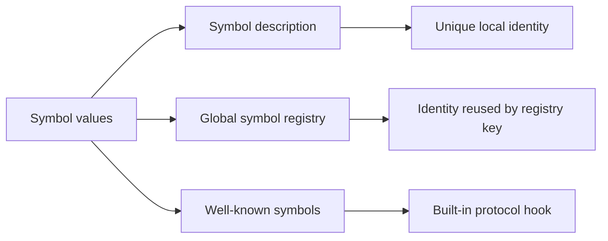

<TLDR>
  <TLDRCell label="what">
    A <Term id="javascript-symbol">Symbol</Term> is a JavaScript primitive with unique identity and one of the two valid kinds of object property key.
  </TLDRCell>
  <TLDRCell label="trap">
    Symbol keys don't appear in `Object.keys()`, `for...in`, or default JSON output, but that doesn't make the property non-enumerable, private, or invisible to reflection.
  </TLDRCell>
  <TLDRCell label="fix">
    Decide whether you need a locally unique key, a registry-shared key, or a built-in protocol key, then handle that key set explicitly in enumeration, copying, and serialization code.
  </TLDRCell>
</TLDR>

## What it is and why it exists

A Symbol is a primitive value with its own identity. Calling `Symbol('order.id')` twice returns two unequal values; the string is only a debugging description and doesn't participate in equality. `typeof` returns `'symbol'` for these values.

An object's <Term id="property-key">property key</Term> can only be a string or a Symbol. String keys suit public, readable, serializable fields; Symbol keys suit extension slots whose value is held and shared by specific code but shouldn't collide with ordinary names. Separate libraries can attach their own Symbol properties to one object without competing for a string such as `_metadata`.

Symbols have a second job: JavaScript uses a set of <Term id="well-known-symbol">well-known symbols</Term> as language protocol entry points. Once an object implements `[Symbol.iterator]()`, `for...of` and spread know how to consume it; once it implements `[Symbol.toPrimitive]()`, conversion algorithms call that hook. The Symbol doesn't hide data here; it gives the protocol a standard key that won't collide with business fields.

When data must enter JSON, a database field, a URL, or an inter-process message, use a stable string instead of a Symbol in most cases. Use `#privateField` for actual class-state encapsulation; code holding a Symbol can still read or write its property, and `Reflect.ownKeys()` can discover it.

You'll encounter Symbols in library extension points, object metadata, iteration protocols, coercion, and reflection code. For an ordinary business record with no collision or protocol need, string keys are usually more direct.

## How it works

### Identity and description

`Symbol(description)` creates a new non-registered Symbol on every call. The description is converted to a string and retained as debugging information; omitting it gives `undefined`, while passing an empty string gives `''`. Matching descriptions create no sharing relationship.

`Symbol` is a function, but you can't call it with `new`. The Symbol primitive itself is immutable; a property keyed by it can still be reassigned, deleted, or configured according to its property descriptor.

Symbol values come from three distinct entry points, and display text alone can't identify the source:



| Entry point | Identity rule | Typical use |
| --- | --- | --- |
| `Symbol(description)` | Different on every call | Module-owned extension key or unique sentinel |
| `Symbol.for(key)` | Same registry key returns the same value | Agreed runtime-wide extension key |
| `Symbol.iterator` and peers | Fixed value predefined by the specification | Language or standard-library protocol customization |
| A saved or imported variable | Reuses the original value referenced by the variable | Sharing a local Symbol between producer and consumer |

Equality compares identity. Ordinary Symbols remain unequal even with matching descriptions; values retrieved with the same global registry key are equal; repeatedly reading the same well-known Symbol property also returns one value. Symbols have no string-like branch that compares description content.

### As a property key

Computed property syntax `{ [key]: value }` and bracket access `object[key]` preserve a Symbol key. Dot syntax requires a fixed identifier written in source and can't represent a Symbol. A producer and consumer reach the same property as long as they hold the same Symbol value.

Ownness, enumerability, and whether a key is a string or Symbol are independent dimensions. A Symbol property created by an object literal or ordinary assignment is enumerable by default; `Object.keys()` still ignores it because that method selects only enumerable own string keys.

| Operation | Own string keys | Own Symbol keys | Non-enumerable keys |
| --- | --- | --- | --- |
| `Object.keys()` | Enumerable | Excluded | Excluded |
| `Object.getOwnPropertySymbols()` | Excluded | All | Included |
| `Reflect.ownKeys()` | All | All | Included |
| Object spread and `Object.assign()` | Enumerable | Enumerable | Excluded |
| Default object members in `JSON.stringify()` | Enumerable | Excluded | Excluded |

This table separates the different meanings of “hidden.” A Symbol property can disappear from `Object.keys()` and JSON yet still be copied by object spread. To preserve every own key and descriptor, start with `Reflect.ownKeys()` and `Object.getOwnPropertyDescriptors()` instead of combining methods that only handle strings.

### The global registry

`Symbol.for(key)` first converts `key` to a string, then consults the <Term id="global-symbol-registry">global symbol registry</Term>. It returns an existing entry or creates and registers a new value. `Symbol.keyFor(symbol)` returns the string only for a registered Symbol; it returns `undefined` for a non-registered Symbol and throws `TypeError` for a non-Symbol argument.

“Global” here doesn't mean network-, database-, or persistence-global. The registry only provides identity reuse for a runtime convention, and any code that knows the key string can retrieve the same Symbol. It isn't secret storage or a substitute for cross-boundary encoding.

Registry keys can themselves collide. When a library truly needs a registered key, make the namespace part of the public contract and define it in one authoritative module. If the key only needs package-local sharing, exporting `const key = Symbol(...)` gives ownership a clearer boundary.

### Well-known protocol keys

Well-known Symbols are fixed keys recognized by specification algorithms. Consumers don't usually call every hook directly; they use ordinary syntax or methods, such as spreading an object, coercing a value, or applying `instanceof`, and the algorithm then reads the corresponding Symbol property.

| Symbol | Common trigger | Hook's core responsibility |
| --- | --- | --- |
| `Symbol.iterator` | `for...of`, spread, `Array.from()` | Return a synchronous iterator |
| `Symbol.asyncIterator` | `for await...of` | Return an asynchronous iterator |
| `Symbol.toPrimitive` | Number, string, or default primitive coercion | Return a primitive value |
| `Symbol.toStringTag` | `Object.prototype.toString.call()` | Supply a display tag string |
| `Symbol.hasInstance` | `value instanceof Constructor` | Return the instance-test result |
| `Symbol.match` and peers | `match()`, `replace()`, `search()`, `split()` | Customize a string-matching protocol |

Implementing a hook means accepting that protocol's return-value and state contract. If a `Symbol.iterator` method returns an ordinary array instead of an iterator, consumption fails; if `Symbol.toPrimitive` returns an object, it throws `TypeError`. A Symbol only solves hook naming—it can't make an implementation correct.

## Examples

These four examples verify identity, property visibility, the iteration protocol, and the coercion protocol in that order. Every output shown came from running the corresponding file with local Node 24.14.0.

### Distinguishing local and registered identity

The first program compares ordinary Symbols with matching descriptions and registered Symbols with matching keys. Its final section also shows safe explicit string conversion and failing implicit conversion.

<Depth level="quick">

```javascript run title="identity_registry.js"
const localOne = Symbol('order.state');
const localTwo = Symbol('order.state');
const sharedOne = Symbol.for('app.order.state');
const sharedTwo = Symbol.for('app.order.state');

console.log(typeof localOne);
console.log(localOne === localTwo);
console.log(sharedOne === sharedTwo);
console.log(Symbol.keyFor(sharedOne));
console.log(Symbol.keyFor(localOne));
console.log(localOne.description);
console.log(String(localOne));

try {
  console.log(`${localOne}`);
} catch (error) {
  console.log(error.name);
}
```

```text
symbol
false
true
app.order.state
undefined
order.state
Symbol(order.state)
TypeError
```

</Depth>

The descriptions of `localOne` and `localTwo` aid debugging but don't let a consumer recreate the key. `sharedOne` and `sharedTwo` come from one registry entry, so their identities match. `String(localOne)` has special explicit-conversion behavior, while implicit conversion inside the template literal throws `TypeError`.

### Seeing the selection rules for Symbol properties

The order has an ordinary string key, an enumerable Symbol key, and a non-enumerable Symbol key. The program checks key sets, descriptors, object spread, and JSON output separately.

```javascript run title="property_keys.js"
const internalId = Symbol('internalId');
const auditNote = Symbol('auditNote');
const order = {
  number: 'A-17',
  [internalId]: 42,
};

Object.defineProperty(order, auditNote, {
  value: 'checked',
  enumerable: false,
});

console.log(JSON.stringify(Object.keys(order)));
console.log(Object.getOwnPropertySymbols(order).map(String).join(','));
console.log(Reflect.ownKeys(order).map(String).join(','));
console.log(Object.getOwnPropertyDescriptor(order, internalId).enumerable);
console.log(Object.getOwnPropertyDescriptor(order, auditNote).enumerable);

const copy = { ...order };
console.log(Reflect.ownKeys(copy).map(String).join(','));
console.log(copy[internalId]);
console.log(JSON.stringify(order));
```

```text
["number"]
Symbol(internalId),Symbol(auditNote)
number,Symbol(internalId),Symbol(auditNote)
true
false
number,Symbol(internalId)
42
{"number":"A-17"}
```

<TryToBreak items={['make number non-enumerable', 'add another enumerable Symbol key', 'put a Symbol value in the array under a string key']} />

Object spread copies the enumerable `internalId` but not the non-enumerable `auditNote`. JSON output ignores both Symbol keys regardless of their `enumerable` value. Code that assumes either “spread drops Symbols” or “enumerable Symbols enter JSON” fails this example.

### Implementing repeatable iteration with a well-known Symbol

`Batch` defines `[Symbol.iterator]()` as a generator method, so each call creates fresh iterator state. It also provides `Symbol.toStringTag`, changing the standard object tag's display.

```javascript run title="protocol_iterator.js"
class Batch {
  constructor(orderIds) {
    this.orderIds = [...orderIds];
  }

  *[Symbol.iterator]() {
    yield* this.orderIds;
  }

  get [Symbol.toStringTag]() {
    return 'Batch';
  }
}

const batch = new Batch(['A-17', 'B-04']);

console.log([...batch].join(','));
console.log([...batch].join(','));
console.log(Object.prototype.toString.call(batch));
console.log(Reflect.ownKeys(Batch.prototype).map(String).join(','));
```

```text
A-17,B-04
A-17,B-04
[object Batch]
constructor,Symbol(Symbol.iterator),Symbol(Symbol.toStringTag)
```

Both spreads produce the complete output, proving that traversal doesn't share one exhausted cursor. The two protocol members live on the prototype with Symbol keys; `Reflect.ownKeys()` can see them, while `Object.keys()` doesn't list these non-enumerable class members.

### Defining explicit primitive coercion

The invoice returns display text or a cent value according to the coercion hint. The second object deliberately violates the protocol to confirm that the hook must return a primitive.

```javascript run title="coercion_hook.js"
const invoice = {
  cents: 1250,
  [Symbol.toPrimitive](hint) {
    if (hint === 'string') return 'EUR 12.50';
    return this.cents;
  },
};

console.log(String(invoice));
console.log(+invoice);
console.log(invoice + 250);
console.log(`${invoice}`);

const broken = {
  [Symbol.toPrimitive]() {
    return {};
  },
};

try {
  Number(broken);
} catch (error) {
  console.log(error.name);
}
```

```text
EUR 12.50
1250
1500
EUR 12.50
TypeError
```

`String()` and the template literal request a string hint, unary plus requests a number hint, and addition uses the default hint here. This design only fits a value object with unambiguous semantics; if callers could disagree about what “invoice plus 250” means, named `format()` and `totalCents()` methods are easier to review.

## Pitfalls

### Recreating a key from its description

> [!PITFALL]
> The descriptions in `Symbol('cache')` look alike, but every call creates a new identity. A reader that calls `Symbol('cache')` again accesses a different property and gets `undefined`.

**Fix:** export and reuse one Symbol constant from a module. Use `Symbol.for()` only when a string-based sharing convention is intentional, and manage its registry key as a public namespace.

### Treating a Symbol as a private field

> [!PITFALL]
> A Symbol key avoids ordinary string enumeration but enforces no access control. A caller with the Symbol can access the property directly, and reflection through `Reflect.ownKeys()` or `Object.getOwnPropertySymbols()` discovers unknown Symbols.

**Fix:** use `#privateField` or closure state when code outside a class must not access state directly. Symbols prevent extension-key collisions; don't turn low visibility in a debugger into a security-boundary claim.

### Confusing enumeration, copying, and serialization

> [!PITFALL]
> Generated code often validates an object with `Object.keys()`, then copies it with object spread and assumes both steps cover the same keys. Spread copies enumerable Symbol keys, while default JSON serialization writes no Symbol keys.

**Fix:** write a key-selection matrix for every boundary and test string, Symbol, non-enumerable, and inherited keys. Project protocol data into named string fields explicitly when it must cross a boundary.

### Giving the registry too many responsibilities

> [!PITFALL]
> `Symbol.for(userInput)` permanently expands the set of names retrievable from the current registry and may collide with another component's convention. It doesn't make identity survive JSON, processes, workers, or persistence automatically.

**Fix:** derive registry keys from controlled constants with a stable namespace. Prefer an exported ordinary Symbol for package-local sharing; use validated string tags and explicit codecs for actual data interchange.

### Implicitly converting a Symbol to text

> [!PITFALL]
> `` `${key}` ``, `'' + key`, and paths that request ordinary string coercion can throw `TypeError` for a Symbol. Diagnostic logging can then break a proxy trap, key traversal, or error handler that was otherwise valid.

**Fix:** use `String(key)` in diagnostics that accept Symbol keys, and branch on strings and Symbols in business protocols. Don't rely on `description` as a unique name because it may be absent or duplicated.

<Depth level="deep">

## Identity, registry, and boundaries

An ordinary Symbol's identity can only be shared by passing the original value. Exporting a constant from an authoritative module, retaining it in a closure, or passing it as an argument preserves that value; copying its description and calling `Symbol()` does not. This rule lets two uncoordinated libraries choose the same description without overwriting each other's properties.

A registered Symbol changes how identity is obtained. Any consumer that knows the registry key can call `Symbol.for()` to retrieve the same value, so it fits a deliberately public runtime convention rather than a secret or single-module ownership model. `Symbol.keyFor()` can reveal the registry key in reverse, another reason the registry isn't encapsulation.

A well-known Symbol is a third source of identity. The specification defines values such as `Symbol.iterator`, and language algorithms and user code retrieve them through the same static property. Don't imitate a built-in key with `Symbol('Symbol.iterator')` or `Symbol.for('Symbol.iterator')`; similar display text doesn't make the identities equal.

Any cross-boundary design needs an encodable representation. JSON has neither Symbol values nor Symbol keys, and a persistence system can't recover identity from a description; send a controlled tag such as `'approved'`, then map it into the receiving side's protocol. Rejecting an unknown tag explicitly is safer than inventing a new Symbol.

A Symbol used as an ordinary value can also serve as a process-local sentinel. A parser might use one module-local Symbol to distinguish “no result” from a valid `undefined`, but its return protocol must share the constant itself. Named unions or records are usually easier to interoperate with when a public API crosses a package, language, or storage layer.

## Enumeration, copying, and descriptors

Property descriptors control `writable`, `enumerable`, and `configurable` independently of the key type. Symbol properties created in object literals or by ordinary assignment are normally writable, enumerable, and configurable. Boolean descriptor fields omitted from `Object.defineProperty()` default to `false`, so different creation paths produce different visibility.

A complete own-key inspection starts with `Reflect.ownKeys(object)`. It returns every own string and Symbol key, including non-enumerable ones; `Object.getOwnPropertyDescriptor()` can then read each property's configuration without confusing key categories. Reading the value may still execute a getter or proxy trap, so security review can't treat reflection as side-effect-free.

A copy operation must also decide whether to preserve descriptors. Object spread and `Object.assign()` read enumerable own string and Symbol keys, then create or set ordinary values on the target; accessors may execute, and their original descriptors aren't preserved wholesale. A one-level descriptor copy can combine `Object.create(Object.getPrototypeOf(source), Object.getOwnPropertyDescriptors(source))`, but that is still shallow and preserves prototype and accessor behavior.

These questions define behavior better than “is this property hidden?”:

1. Is the property own or inherited?
2. What is its descriptor's `enumerable` value?
3. Is the key a string or a Symbol?
4. Does the operation read values or only keys and descriptors?
5. Which categories must the boundary copy, validate, display, or serialize?

Test fixtures should vary each dimension independently. One enumerable Symbol can't prove that code handles non-enumerable entries correctly, and matching values under a string and a Symbol key can't prove that descriptors survive.

## Protocol-hook contracts

Well-known Symbols put protocol entry points into the ordinary property model, so inheritance, getters, and proxies can affect lookup. An object may inherit `[Symbol.iterator]()` from its prototype or override it on the instance; the consuming algorithm gets the method through ordinary property access. Review both the method implementation and its receiver.

The iterator returned by `Symbol.iterator` owns traversal state. A repeatable collection normally returns a fresh iterator on every call, while a generator object is itself a single-pass iterator; repeatedly returning one cached iterator makes a second traversal resume from the old cursor. See `javascript/iterators-generators` for the full state and closing contract.

`Symbol.toPrimitive` receives a `'number'`, `'string'`, or `'default'` hint and must return a primitive. The hint expresses the caller's preferred representation rather than forcing a return type, but an implementation still needs consistent business meaning. Returning an object fails immediately, while returning a surprising string can turn `+` from addition into concatenation.

`Symbol.toStringTag` only changes standard tag text; it doesn't prove that an object holds the internal slots of a built-in type. Any object can claim the tag `'Map'`, so authorization, data validation, and brand checks can't trust that display. It is useful for diagnostics and presentation, not as type evidence.

`Symbol.hasInstance` can replace the normal `instanceof` decision. That makes “`instanceof` always checks the prototype chain” incomplete: when the right-hand value supplies the custom hook, its protocol determines the result. A public library that customizes it should also expose a directly named predicate to reduce confusion about implicit semantics.

## Choosing by ownership

Choose a key type only after defining who creates the identity, who needs access, and whether the value crosses a boundary. A Symbol isn't an upgraded string key; it has a different identity and discovery model.

| Requirement | Better mechanism | Reason |
| --- | --- | --- |
| Public field in JSON or storage | String key | Stable name with explicit validation and encoding |
| Collision-free extension within one package | Exported ordinary Symbol | Only code receiving the original value shares identity |
| Deliberate runtime convention across packages | Controlled `Symbol.for()` key | Agreed string retrieves the identity |
| Language protocol customization | Matching well-known Symbol | Specification algorithms read the fixed key |
| State inaccessible directly outside a class | Private field or closure | Provides an actual access boundary |
| Dynamic mapping with arbitrary object keys | `Map` | Preserves object and primitive key identity directly |

When a library exposes an ordinary Symbol, the export name is the API's discovery point. Renaming its description doesn't break consumers holding the constant, but removing or recreating the exported value changes identity and is a breaking change. Consumer tests should import the constant instead of copying its implementation.

When a registry is involved, documentation should state the exact key string, owner, and compatibility policy. Whether a version belongs in the key depends on whether old and new implementations may share one slot; adding versions blindly fragments interoperability, while omitting them may place incompatible values in one property. Define the payload contract before choosing the identity's compatibility range.

Validating string fields on an inbound object doesn't automatically validate Symbol properties. If later code spreads, merges, or proxies that input, explicitly reject extra own keys or handle the allowed Symbols by category. Checking only `Object.keys()` and then spreading input is an especially common generated-code boundary flaw.

Unit tests should at least cover same-description/different-identity Symbols, same-registry-key/same-identity Symbols, enumerable and non-enumerable Symbol keys, and protocol hooks returning a wrong type. Integration tests should then cover the real copy, logging, and serialization paths; a successful isolated `object[key]` read proves only the narrowest step.

</Depth>

<Checkpoint id="javascript/symbol" />

## Further reading

- [ECMAScript language specification: the Symbol type](https://tc39.es/ecma262/multipage/ecmascript-data-types-and-values.html#sec-ecmascript-language-types-symbol-type)
- [ECMAScript language specification: well-known Symbols](https://tc39.es/ecma262/multipage/ecmascript-data-types-and-values.html#sec-well-known-symbols)
- [ECMAScript language specification: Symbol objects](https://tc39.es/ecma262/multipage/fundamental-objects.html#sec-symbol-objects)
- [ECMAScript language specification: `Symbol.for()`](https://tc39.es/ecma262/multipage/fundamental-objects.html#sec-symbol.for)
- [ECMAScript language specification: `JSON.stringify()`](https://tc39.es/ecma262/multipage/structured-data.html#sec-json.stringify)
