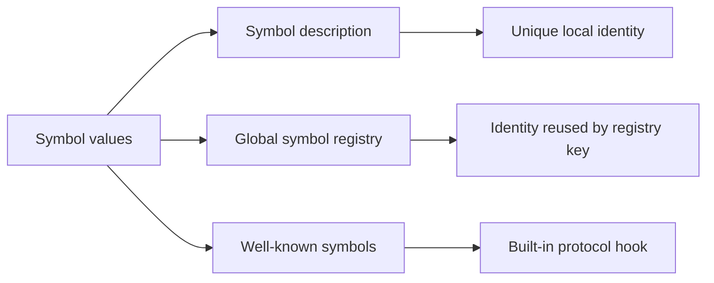

<TLDR>
  <TLDRCell label="what">
    <Term id="javascript-symbol">Symbol</Term> 是具有唯一标识的 JavaScript 基本值，也是对象属性键的两种合法类型之一。
  </TLDRCell>
  <TLDRCell label="trap">
    Symbol 键不会出现在 `Object.keys()`、`for...in` 或默认 JSON 输出中，但这不表示属性不可枚举、私有或无法反射。
  </TLDRCell>
  <TLDRCell label="fix">
    先明确需要局部唯一键、注册表共享键还是内置协议键，再让枚举、复制和序列化代码显式处理对应键集合。
  </TLDRCell>
</TLDR>

## 是什么，为什么存在

Symbol 是一种基本值，每个值都有自己的标识。调用 `Symbol('order.id')` 两次会得到两个不相等的值；其中的字符串只是调试描述，不参与相等比较。`typeof` 对这类值返回 `'symbol'`。

对象的<Term id="property-key">属性键（property key）</Term>只能是字符串或 Symbol。字符串键适合公开、可读和可序列化的字段；Symbol 键适合由某段代码持有并共享其值、但不应与普通名称冲突的扩展槽位。第三方库可以为同一个对象添加各自的 Symbol 属性，而不必争抢 `_metadata` 一类字符串名称。

Symbol 还有第二项职责：JavaScript 用一组<Term id="well-known-symbol">内置 Symbol（well-known symbol）</Term>表示语言协议的入口。对象实现 `[Symbol.iterator]()` 后，`for...of` 与展开语法就知道怎样读取它；实现 `[Symbol.toPrimitive]()` 后，转换算法会调用这个钩子。这里的 Symbol 不负责隐藏数据，而是给协议提供不会与业务字段碰撞的标准键。

当数据需要写入 JSON、数据库字段、URL 或跨进程消息时，通常应使用稳定字符串，而不是 Symbol。需要真正封装类状态时，应使用 `#privateField`；拥有 Symbol 引用的代码仍可读写对应属性，`Reflect.ownKeys()` 也能发现它。

你会在库扩展点、对象元数据、迭代协议、类型转换和反射代码中遇到 Symbol。普通业务记录若没有名称冲突或协议定制需求，字符串键通常更直接。

## 工作原理

### 标识与描述

`Symbol(description)` 每次都创建新的未注册 Symbol。`description` 会先转换成字符串并保存为调试信息；省略参数时描述为 `undefined`，显式传入空字符串时描述是 `''`。描述相同不建立任何共享关系。

`Symbol` 是函数，却不能与 `new` 一起使用。Symbol 基本值本身不可修改；对象上以它为键的属性仍可重新赋值、删除或配置，这些行为由属性描述符决定。

Symbol 值来自三个不同入口，不能只凭显示文本判断来源：



| 入口 | 标识规则 | 典型用途 |
| --- | --- | --- |
| `Symbol(description)` | 每次调用都不同 | 模块私有的扩展键、唯一哨兵值 |
| `Symbol.for(key)` | 同一个注册表键返回同一值 | 运行时中约定好的共享扩展键 |
| `Symbol.iterator` 等 | 规范预先定义的固定值 | 定制语言或标准库协议 |
| 已保存或导入的变量 | 复用变量指向的原值 | 在生产者与消费者之间共享局部 Symbol |

相等比较按标识判断。普通 Symbol 即使描述相同也不相等；从同一个全局注册表键取得的值相等；同一个内置 Symbol 属性每次读取也得到同一值。Symbol 没有像字符串那样按内容比较的分支。

### 作为属性键

计算属性语法 `{ [key]: value }` 与方括号访问 `object[key]` 会保留 Symbol 键。点号语法要求源码中的固定标识符，不能表示 Symbol。只要生产者与消费者持有同一个 Symbol 值，它们就能访问同一个属性。

“是否为自有属性”“是否可枚举”和“键是字符串还是 Symbol”是三个独立维度。对象字面量和普通赋值创建的 Symbol 属性默认可枚举；`Object.keys()` 仍忽略它，因为该方法只选择可枚举的自有字符串键。

| 操作 | 自有字符串键 | 自有 Symbol 键 | 不可枚举键 |
| --- | --- | --- | --- |
| `Object.keys()` | 可枚举项 | 不包含 | 不包含 |
| `Object.getOwnPropertySymbols()` | 不包含 | 全部 | 包含 |
| `Reflect.ownKeys()` | 全部 | 全部 | 包含 |
| 对象展开与 `Object.assign()` | 可枚举项 | 可枚举项 | 不包含 |
| `JSON.stringify()` 默认对象成员 | 可枚举项 | 不包含 | 不包含 |

这张表解释了“看不见”的不同含义。Symbol 属性可能从 `Object.keys()` 和 JSON 中消失，却仍被对象展开复制；如果要保留所有自有键和描述符，应从 `Reflect.ownKeys()` 与 `Object.getOwnPropertyDescriptors()` 开始设计，而不是组合几个只处理字符串的方法。

### 全局注册表

`Symbol.for(key)` 先把 `key` 转成字符串，再查询<Term id="global-symbol-registry">全局 Symbol 注册表（global symbol registry）</Term>。已有条目就返回原 Symbol，否则创建并登记一个新值。`Symbol.keyFor(symbol)` 只对已注册 Symbol 返回对应字符串；未注册 Symbol 返回 `undefined`，非 Symbol 参数会抛出 `TypeError`。

这里的“全局”不是网络、数据库或持久化全局。注册表只提供运行时约定的标识复用，而且任何知道键字符串的代码都能取得同一个 Symbol。它既不是秘密存储，也不能替代跨边界的数据编码。

注册表键本身可能碰撞。库若确实需要注册键，应把命名空间作为公开契约，并由一个权威模块定义；只需要包内共享时，导出 `const key = Symbol(...)` 更容易控制所有权。

### 内置协议键

内置 Symbol 是规范算法识别的固定键。消费者通常不会直接调用所有钩子，而是执行普通语法或方法，例如展开对象、转换值或使用 `instanceof`；算法随后读取对应的 Symbol 属性。

| Symbol | 触发它的常见操作 | 钩子的核心责任 |
| --- | --- | --- |
| `Symbol.iterator` | `for...of`、展开、`Array.from()` | 返回同步迭代器 |
| `Symbol.asyncIterator` | `for await...of` | 返回异步迭代器 |
| `Symbol.toPrimitive` | 数值、字符串或默认基本值转换 | 返回基本值 |
| `Symbol.toStringTag` | `Object.prototype.toString.call()` | 提供显示标签字符串 |
| `Symbol.hasInstance` | `value instanceof Constructor` | 返回实例判断结果 |
| `Symbol.match` 等 | `match()`、`replace()`、`search()`、`split()` | 定制字符串匹配协议 |

实现一个钩子就承担该协议的返回值与状态契约。`Symbol.iterator` 方法返回普通数组而不是迭代器时，消费阶段会失败；`Symbol.toPrimitive` 返回对象时也会抛出 `TypeError`。Symbol 只解决钩子命名，不能让实现自动正确。

## 示例

下面四个示例依次验证标识、属性可见性、迭代协议和转换协议。所有输出都由本地 Node 24.14.0 执行对应文件得到。

### 区分局部标识与注册标识

第一个程序对比相同描述的普通 Symbol 与相同键的注册 Symbol。最后一段还展示安全的显式字符串转换与失败的隐式转换。

<Depth level="quick">

```javascript run title="identity_registry.js"
const localOne = Symbol('order.state');
const localTwo = Symbol('order.state');
const sharedOne = Symbol.for('app.order.state');
const sharedTwo = Symbol.for('app.order.state');

console.log(typeof localOne);
console.log(localOne === localTwo);
console.log(sharedOne === sharedTwo);
console.log(Symbol.keyFor(sharedOne));
console.log(Symbol.keyFor(localOne));
console.log(localOne.description);
console.log(String(localOne));

try {
  console.log(`${localOne}`);
} catch (error) {
  console.log(error.name);
}
```

```text
symbol
false
true
app.order.state
undefined
order.state
Symbol(order.state)
TypeError
```

</Depth>

`localOne` 与 `localTwo` 的描述只帮助调试，不能让消费者重建键。`sharedOne` 与 `sharedTwo` 则由同一个注册表条目提供，所以标识相同。`String(localOne)` 有显式转换的特殊行为，模板字面量中的隐式转换会抛出 `TypeError`。

### 看清 Symbol 属性的选择规则

订单对象包含一个普通字符串键、一个可枚举 Symbol 键和一个不可枚举 Symbol 键。程序分别检查键集合、描述符、对象展开与 JSON 输出。

```javascript run title="property_keys.js"
const internalId = Symbol('internalId');
const auditNote = Symbol('auditNote');
const order = {
  number: 'A-17',
  [internalId]: 42,
};

Object.defineProperty(order, auditNote, {
  value: 'checked',
  enumerable: false,
});

console.log(JSON.stringify(Object.keys(order)));
console.log(Object.getOwnPropertySymbols(order).map(String).join(','));
console.log(Reflect.ownKeys(order).map(String).join(','));
console.log(Object.getOwnPropertyDescriptor(order, internalId).enumerable);
console.log(Object.getOwnPropertyDescriptor(order, auditNote).enumerable);

const copy = { ...order };
console.log(Reflect.ownKeys(copy).map(String).join(','));
console.log(copy[internalId]);
console.log(JSON.stringify(order));
```

```text
["number"]
Symbol(internalId),Symbol(auditNote)
number,Symbol(internalId),Symbol(auditNote)
true
false
number,Symbol(internalId)
42
{"number":"A-17"}
```

<TryToBreak items={['把 number 改为不可枚举属性', '再添加一个可枚举 Symbol 键', '把 Symbol 值放进字符串键对应的数组']} />

对象展开复制了可枚举的 `internalId`，但没有复制不可枚举的 `auditNote`。JSON 输出忽略两个 Symbol 键，与它们的 `enumerable` 值无关。任何依赖“展开会丢失 Symbol”或“可枚举 Symbol 会进入 JSON”的代码都会在这里暴露错误。

### 用内置 Symbol 实现可重复迭代

`Batch` 把 `[Symbol.iterator]()` 写成生成器方法，因此每次调用都创建新的迭代器状态。它还提供 `Symbol.toStringTag`，改变标准对象标签的显示结果。

```javascript run title="protocol_iterator.js"
class Batch {
  constructor(orderIds) {
    this.orderIds = [...orderIds];
  }

  *[Symbol.iterator]() {
    yield* this.orderIds;
  }

  get [Symbol.toStringTag]() {
    return 'Batch';
  }
}

const batch = new Batch(['A-17', 'B-04']);

console.log([...batch].join(','));
console.log([...batch].join(','));
console.log(Object.prototype.toString.call(batch));
console.log(Reflect.ownKeys(Batch.prototype).map(String).join(','));
```

```text
A-17,B-04
A-17,B-04
[object Batch]
constructor,Symbol(Symbol.iterator),Symbol(Symbol.toStringTag)
```

两次展开都完整输出，证明遍历没有共享一个已耗尽的游标。两个协议方法位于原型上，并且以 Symbol 为键；`Reflect.ownKeys()` 能看到它们，`Object.keys()` 则不会列出这些不可枚举的类成员。

### 定义明确的基本值转换

发票对象根据转换提示返回文本或分值。第二个对象故意违反协议，用于确认钩子必须返回基本值。

```javascript run title="coercion_hook.js"
const invoice = {
  cents: 1250,
  [Symbol.toPrimitive](hint) {
    if (hint === 'string') return 'EUR 12.50';
    return this.cents;
  },
};

console.log(String(invoice));
console.log(+invoice);
console.log(invoice + 250);
console.log(`${invoice}`);

const broken = {
  [Symbol.toPrimitive]() {
    return {};
  },
};

try {
  Number(broken);
} catch (error) {
  console.log(error.name);
}
```

```text
EUR 12.50
1250
1500
EUR 12.50
TypeError
```

`String()` 与模板字面量请求字符串提示，一元加号请求数字提示，加法在这里使用默认提示。这个设计只适合语义明确的值对象；若不同调用方可能误解“发票加 250”的含义，命名方法 `format()` 与 `totalCents()` 更容易审查。

## 陷阱

### 用描述重新创建键

> [!PITFALL]
> `Symbol('cache')` 的描述看起来相同，但每次调用都创建新标识。读取方重新调用 `Symbol('cache')` 会访问另一个属性并得到 `undefined`。

**修复方法：** 从一个模块导出并复用同一个 Symbol 常量。确实需要按字符串约定共享时才使用 `Symbol.for()`，并把注册表键当作公开命名空间管理。

### 把 Symbol 当作私有字段

> [!PITFALL]
> Symbol 键会避开普通字符串枚举，却没有访问控制。拿到 Symbol 的调用方可以直接访问属性，未知 Symbol 也能由 `Reflect.ownKeys()` 或 `Object.getOwnPropertySymbols()` 发现。

**修复方法：** 需要防止类外直接访问时使用 `#privateField` 或闭包状态。Symbol 适合防碰撞扩展键；不要把调试界面里不显眼误写成安全边界。

### 混淆枚举、复制与序列化

> [!PITFALL]
> 生成代码常用 `Object.keys()` 检查完对象，再用对象展开复制它，误以为两步处理的是同一组键。展开会复制可枚举 Symbol 键，而默认 JSON 序列化不会输出任何 Symbol 键。

**修复方法：** 为每个边界写出键选择矩阵，并用字符串键、Symbol 键、不可枚举键和继承键测试。需要协议数据跨边界时，把它显式投影为有名称的字符串字段。

### 让注册表承担过多职责

> [!PITFALL]
> `Symbol.for(userInput)` 会永久扩大当前注册表可取得的名称集合，并可能与另一个组件的约定键相撞。它不会让值自动跨 JSON、进程、worker 或持久化边界保持标识。

**修复方法：** 注册表键应来自受控常量，并带有稳定命名空间。包内共享优先导出普通 Symbol；真正的数据交换使用经过验证的字符串标签和显式编解码。

### 对 Symbol 做隐式字符串转换

> [!PITFALL]
> `` `${key}` ``、`'' + key` 和需要普通字符串转换的路径可能对 Symbol 抛出 `TypeError`。这会让原本只是诊断用途的日志破坏代理 trap、键遍历或错误处理。

**修复方法：** 允许 Symbol 键的诊断代码使用 `String(key)`，业务协议则分别处理字符串与 Symbol。不要依赖 `description` 作为唯一名称，因为它可以缺失或重复。

<Depth level="deep">

## 标识、注册表与边界

普通 Symbol 的标识只能通过传递原值来共享。把常量从权威模块导出、把它保存在闭包中或作为参数传递，都保留同一值；复制描述文本再调用 `Symbol()` 不会保留标识。这个规则让两个互不协调的库即使选择相同描述，也不会覆盖对方的属性。

注册 Symbol 改变的是取得标识的方式。消费者只要知道注册表键，就能调用 `Symbol.for()` 取得相同值；因此它适合刻意公开的运行时约定，不适合秘密或单一模块所有权。`Symbol.keyFor()` 能反向暴露注册键，也说明注册表不是封装机制。

内置 Symbol 又是另一种身份来源。规范定义 `Symbol.iterator` 等值，语言算法与用户代码通过同一静态属性取得它们。不要调用 `Symbol('Symbol.iterator')` 或 `Symbol.for('Symbol.iterator')` 模拟内置键；显示文本相似，标识仍完全不同。

任何跨边界设计都需要一个可编码表示。JSON 没有 Symbol 值或 Symbol 键，持久化系统也无法凭描述恢复原标识；应传递类似 `'approved'` 的受控标签，再由接收方按自己的协议映射。若映射失败，显式拒绝未知标签比创建新 Symbol 更安全。

Symbol 作为普通值也可以充当进程内哨兵。例如解析函数可用一个模块局部 Symbol 区分“没有结果”与合法的 `undefined`，但该返回协议必须共享常量本身。公开 API 若跨包、语言或存储层，具名联合类型或记录通常更容易互操作。

## 枚举、复制与描述符

属性描述符控制 `writable`、`enumerable` 和 `configurable`，不关心键的类型。对象字面量里的 Symbol 属性与普通赋值创建的 Symbol 属性通常都是可写、可枚举、可配置的。`Object.defineProperty()` 的缺省布尔属性则为 `false`，所以来源不同会产生不同可见性。

自有键的完整检查应从 `Reflect.ownKeys(object)` 开始。它返回所有自有字符串和 Symbol 键，包括不可枚举项；接着可用 `Object.getOwnPropertyDescriptor()` 在不混淆键类型的情况下读取属性配置。读取值仍可能触发 getter 或代理 trap，安全审查不能把反射误当作无副作用操作。

复制操作还要决定是否保留描述符。对象展开与 `Object.assign()` 读取可枚举自有字符串和 Symbol 键，然后在目标上创建或设置普通值；访问器可能执行，原描述符不会完整保留。需要按描述符克隆一层时，可以组合 `Object.create(Object.getPrototypeOf(source), Object.getOwnPropertyDescriptors(source))`，但这仍是浅层复制，并会保留原型与访问器行为。

以下问题比“这个属性隐藏吗”更能界定行为：

1. 属性是自有还是继承而来？
2. 描述符中的 `enumerable` 是什么？
3. 键是字符串还是 Symbol？
4. 操作读取值还是只读取键与描述符？
5. 边界要求复制、验证、显示还是序列化哪些类别？

测试夹具应让各维度彼此独立。只用一个可枚举 Symbol 无法证明代码正确处理不可枚举项，字符串键与 Symbol 键使用相同值也不能证明描述符得到保留。

## 协议钩子的调用契约

内置 Symbol 把协议入口放进普通属性模型，因此继承、getter 和代理都可能影响查找结果。一个对象可以从原型继承 `[Symbol.iterator]()`，也可以在实例上覆盖它；消费算法会按正常属性访问取得方法。审查时要同时检查方法实现与接收者。

`Symbol.iterator` 返回的迭代器拥有遍历状态。可重复集合通常每次调用都返回新迭代器，而生成器对象本身是一次性迭代器；把一个已创建迭代器缓存后反复返回，会让第二次遍历从旧游标继续。更完整的状态与关闭规则属于 `javascript/iterators-generators`。

`Symbol.toPrimitive` 接收 `'number'`、`'string'` 或 `'default'` 提示，并且必须返回基本值。提示表达调用方偏好的表示，不是强制返回类型；实现仍应建立一致、可预测的业务含义。返回对象会立即失败，而返回意外字符串可能让 `+` 从加法转成拼接。

`Symbol.toStringTag` 只改变标准标签文本，不能证明对象拥有某个内置类型的内部槽。任意对象都可以声称标签是 `'Map'`，所以鉴权、数据校验和品牌检查不能依赖这段显示文本。它适合诊断与展示，不是可信类型证据。

`Symbol.hasInstance` 可以改写 `instanceof` 的判断。这使“`instanceof` 总是检查原型链”成为不完整说法；右侧值提供自定义钩子时，结果由该协议决定。公开库若定制它，应同时提供直接命名的判断函数，减少读者对隐式语义的误解。

## 所有权驱动的选择

选择键类型时先确定谁创建标识、谁需要访问，以及值是否跨边界。Symbol 不是字符串键的升级版，而是不同的身份与发现模型。

| 需求 | 更合适的机制 | 原因 |
| --- | --- | --- |
| JSON 或存储中的公开字段 | 字符串键 | 有稳定名称，可显式验证与编码 |
| 一个包内避免扩展属性碰撞 | 导出的普通 Symbol | 只有拿到原值的代码共享标识 |
| 多个包刻意共享运行时约定 | 受控的 `Symbol.for()` 键 | 可按约定字符串重新取得标识 |
| 定制语言协议 | 对应的内置 Symbol | 规范算法会读取固定键 |
| 类外不可直接访问的状态 | 私有字段或闭包 | 提供真正的访问边界 |
| 任意对象键的动态映射 | `Map` | 直接保留对象与基本值键标识 |

库公开普通 Symbol 时，导出名称就是 API 的可发现入口。重命名描述不会破坏持有常量的消费者，但删除或重新创建导出值会改变标识，属于破坏性变化。测试应从消费者模块导入常量，而不是复制它的实现。

使用注册表时，文档应写明准确键字符串、所有者和兼容策略。版本号是否进入键名取决于协议是否允许新旧实现共享同一槽位；盲目加版本会分裂互操作，完全不分版本又可能把不兼容值放进同一属性。先定义载荷契约，再决定身份兼容范围。

对于入站对象，验证字符串字段并不自动验证 Symbol 属性。若后续会展开、合并或传给代理，应明确拒绝额外自有键，或者逐类处理允许的 Symbol。只检查 `Object.keys()` 后再展开输入，是生成代码中尤其常见的边界漏洞。

单元测试至少应覆盖同描述不同标识、同注册键相同标识、可枚举与不可枚举 Symbol 键，以及协议钩子返回错误类型。集成测试再覆盖真实的复制、日志和序列化路径；孤立读取 `object[key]` 成功，只证明最窄的一步。

</Depth>

<Checkpoint id="javascript/symbol" />

## 延伸阅读

- [ECMAScript 语言规范：Symbol 类型](https://tc39.es/ecma262/multipage/ecmascript-data-types-and-values.html#sec-ecmascript-language-types-symbol-type)
- [ECMAScript 语言规范：内置 Symbol](https://tc39.es/ecma262/multipage/ecmascript-data-types-and-values.html#sec-well-known-symbols)
- [ECMAScript 语言规范：Symbol 对象](https://tc39.es/ecma262/multipage/fundamental-objects.html#sec-symbol-objects)
- [ECMAScript 语言规范：`Symbol.for()`](https://tc39.es/ecma262/multipage/fundamental-objects.html#sec-symbol.for)
- [ECMAScript 语言规范：`JSON.stringify()`](https://tc39.es/ecma262/multipage/structured-data.html#sec-json.stringify)
