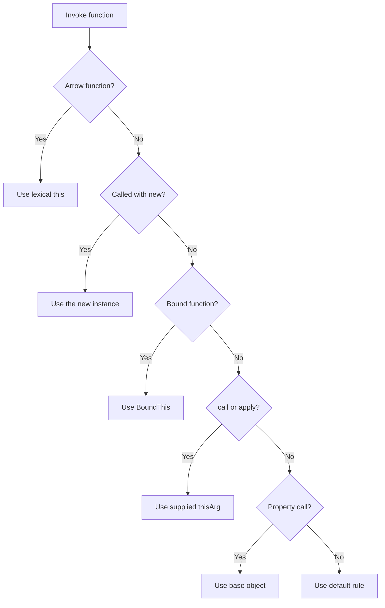

<TLDR>
  <TLDRCell label="what">
    <Term id="this-binding">`this` binding</Term> determines the `this` value for one call of an ordinary function. You usually inspect the call expression, not where the function was written.
  </TLDRCell>
  <TLDRCell label="trap">
    `const fn = object.method` copies only the function value; it doesn't carry `object` with it. Arrow functions follow another rule: they have no `this` of their own and can't be rebound.
  </TLDRCell>
  <TLDRCell label="fix">
    Preserve a call such as `object.method()`, or create and retain `object.method.bind(object)` once. Use an arrow for a short callback only when it should inherit the outer `this`.
  </TLDRCell>
</TLDR>

## What it is and why it exists

`this` is an implicit value supplied to a function call, and an ordinary function can use it to access that call's receiver. It isn't an ordinary variable resolved by name in the function's scope. Calling the same function value in different ways can produce different `this` values.

This mechanism lets one function serve as a method on several objects and lets constructors initialize new objects. `call()`, `apply()`, and `bind()` also let adapters, callback registration code, and frameworks provide a receiver explicitly. Dynamic receivers enable reuse, but they also explain why a method can fail after being detached from its object.

You encounter `this` in object methods, class methods, accessors, event handlers, timers, and array callbacks. When reading code, first find the actual call expression, such as `account.close()`, `close.call(account)`, or `new Account()`. Looking only at the definition `function close() { ... }` usually can't answer the question.

Arrow functions are the important exception. An arrow gets `this` from the <Term id="lexical-environment">lexical environment</Term> at its definition site and doesn't create a binding when called. An arrow therefore suits a callback that must reuse an outer method's receiver, but it usually doesn't suit an object method that needs a dynamic receiver.

Modern JavaScript often uses closures and explicit parameters instead of `this`, but that doesn't make `this` obsolete. Class methods, platform callbacks, and existing libraries still rely on its calling conventions. The right choice depends on whether the API needs one operation to act on different receivers.

## How it works

Before an ordinary function runs, the call operation determines `this`. A property call such as `object.method()` retains the base object from the property reference, so `this` inside `method` is `object`. If you first evaluate and store the function and later execute `fn()`, that base object is gone.

`call(thisArg, ...args)` and `apply(thisArg, args)` invoke the target immediately. `bind(thisArg, ...args)` instead creates a <Term id="bound-function">bound function</Term> that stores a receiver and optional leading arguments. Calling that bound function through `call()` later can't replace its stored receiver.

A constructor call creates an object and then calls the target constructor with that object as `this`. The new object's prototype comes from the target constructor's `prototype`; if the constructor explicitly returns another object, that object becomes the result. When you construct through a bound function, its bound arguments still apply, but the new object replaces the bound `this`.

An arrow function doesn't perform this dynamic binding process. It reads `this` from its outer environment, and `call()`, `apply()`, and `bind()` can't change that value. An arrow also has no construction capability, so `new arrow()` throws `TypeError`.

The following flow first distinguishes the function kind, then the call form. The order of bound functions and construction matters; arrows leave the decision path at the entrance.



Review an ordinary function in this order:

1. If it is constructed with `new`, use the new object; a bound function retains only its leading arguments.
2. Otherwise, if the target is a bound function, use its saved `this`.
3. Otherwise, if `call()` or `apply()` invokes it, use the supplied `thisArg`.
4. Otherwise, if it is a property call, use the base object to the left of the dot or brackets.
5. Otherwise, apply the default rule for a strict or non-strict function.

This order isn't merely a table of syntax precedence. In `service.method.call(other)`, `call()` ultimately passes `other` to `method`; `service.boundMethod()` still uses the receiver stored inside the bound function. Track which function is actually invoked and how it is invoked.

### Call-form reference

The table assumes `method` is an ordinary strict function that reads `this`, while `arrow` was created in an outer environment. The result column describes the receiver observed by the function body.

| Call form | `this` in the function body | Deciding fact |
| --- | --- | --- |
| `object.method()` | `object` | The property reference retains its base |
| `const fn = object.method; fn()` | `undefined` | Extraction leaves only a function value |
| `method.call(object, value)` | `object` | `call()` supplies the receiver |
| `method.apply(object, [value])` | `object` | `apply()` supplies the receiver |
| `method.bind(object)(value)` | `object` | The bound function stores the receiver |
| `new Constructor()` | The new instance | Construction creates the receiver |
| `arrow.call(object)` | The outer `this` | An arrow ignores a dynamic receiver |

Arguments and receivers are separate dimensions. `apply()` changes how arguments are supplied, while `bind()` can fix both a receiver and some leading arguments; that doesn't make an ordinary argument become `this`. Conversely, the object left of a method's dot isn't automatically passed as the first ordinary argument.

A method also isn't owned by one object so exclusively that it can't be reused. A property may be found directly on the object or along its prototype chain; whenever the call expression is `receiver.method()`, an ordinary method receives `receiver`. Neither the definition site nor the property lookup location is necessarily the final receiver.

## Examples

The four examples progress through property calls and explicit binding, a detached callback, lexical `this` in arrows, and construction through a bound function. Every output shown was produced by running the corresponding file locally with Node 24.

### Determine the receiver at the call site

The same `formatJob` is first called as a method and then used through `call()`, `apply()`, and `bind()`. Its body stays unchanged; the receiver supplied by the call changes.

<Depth level="quick">

```javascript run title="call_sites.js"
'use strict';

function formatJob(prefix) {
  return `${prefix}:${this.queue}`;
}

const worker = { queue: 'critical', formatJob };

console.log(worker.formatJob('method'));
console.log(formatJob.call({ queue: 'batch' }, 'call'));
console.log(formatJob.apply({ queue: 'audit' }, ['apply']));

const bound = formatJob.bind({ queue: 'mail' }, 'bound');
console.log(bound());
```

```text
method:critical
call:batch
apply:audit
bound:mail
```

<TryToBreak items={['store formatJob in a variable and call it directly in strict mode', 'pass a primitive as the thisArg to call', 'try to replace the receiver saved by bound using call']} />

</Depth>

The object to the left of the dot in `worker.formatJob('method')` is `worker`, so the method reads `critical`. `call()` and `apply()` differ only in their argument form: the former accepts arguments individually, while the latter accepts an array-like object. Both execute the function immediately.

`bind()` returns a new function and saves `'bound'` as the first argument. Calling `bound()` neither selects another receiver nor requires the prefix again. The bound function and original function are different function objects.

### Repair a detached callback

`Array.prototype.map()` invokes its callback as an ordinary function, so passing `meter.format` doesn't retain `meter`. Code inside a class method has strict semantics, and the first read of `this.unit` throws `TypeError`.

```javascript run title="callback_receivers.js"
'use strict';

class Meter {
  constructor(unit) {
    this.unit = unit;
  }

  format(value) {
    return `${value}${this.unit}`;
  }
}

function render(formatter) {
  return [2, 5].map(formatter).join(', ');
}

const meter = new Meter('ms');

try {
  console.log(render(meter.format));
} catch (error) {
  console.log(error.name);
}

console.log(render(meter.format.bind(meter)));
console.log(render((value) => meter.format(value)));
```

```text
TypeError
2ms, 5ms
2ms, 5ms
```

One-time binding and an arrow wrapper can both express ownership. If you later need to remove a listener or compare callback identity, retain the bound result in a variable or instance field. Every evaluation of `meter.format.bind(meter)` creates a different function object.

The arrow wrapper doesn't rely on its own `this`; it uses the lexical variable `meter` to make a complete method call. It also controls the interface by forwarding only `value`, rather than accidentally passing the index and array that `map()` also supplies to a downstream API.

### Observe lexical this in an arrow

`makeReader()` is an ordinary method, so it gets a receiver on each call. The arrow it creates then retains `this` from that call; using `call()` on the returned function doesn't override it.

```javascript run title="lexical_this.js"
'use strict';

const dashboard = {
  label: 'primary',
  makeReader() {
    return () => this.label;
  },
};

const reader = dashboard.makeReader();
console.log(reader());
console.log(reader.call({ label: 'ignored' }));

const mirror = { label: 'mirror', makeReader: dashboard.makeReader };
console.log(mirror.makeReader()());
```

```text
primary
primary
mirror
```

The first two results match because `reader` captured `this` from the execution of `dashboard.makeReader()`. The last call invokes the ordinary method as a property of `mirror`, so its new arrow captures `mirror`. Lexical binding uses the execution environment in which the arrow is created; it doesn't permanently capture the object literal beside its source code.

This distinction also explains a common pattern: an ordinary method receives the instance, while an arrow callback inside it reuses that instance. Changing the outer method itself into an arrow property changes the contract rather than merely shortening the syntax.

### Let construction override a bound receiver

The ordinary call `BoundSession('ops')` uses `fallback`. When the same bound function appears after `new`, a new instance becomes `this`, while the bound `'eu'` still precedes the call arguments.

```javascript run title="bound_constructor.js"
'use strict';

function Session(region, id) {
  this.key = `${region}-${id}`;
}

const fallback = { key: 'unset' };
const BoundSession = Session.bind(fallback, 'eu');

BoundSession('ops');
const session = new BoundSession('42');

console.log(fallback.key);
console.log(session.key);
console.log(session instanceof Session);
console.log(session instanceof BoundSession);
```

```text
eu-ops
eu-42
true
true
```

The constructed `session` still participates in `instanceof` through the target function `Session` and its `prototype`. You can use a bound function to prefill constructor arguments, but this technique hides the actual constructor; a named factory or class static method is usually clearer in a public API.

If `Session` explicitly returns a non-primitive object, the `new` expression returns that object instead of the automatically created instance. Returning a string, number, Boolean, `null`, or `undefined` doesn't replace the instance.

## Pitfalls

### Guessing an ordinary function's this from its definition

> [!PITFALL]
> Writing an ordinary function beside an object literal or class doesn't permanently bind it to that object. Assignment, destructuring, argument passing, and callback registration can all leave a function value without its original receiver.

**Fix:** inspect the actual call for a dot, brackets, `call()`, `apply()`, `bind()`, or `new`. If an API must pass a method independently, bind it once and retain the result, or provide a wrapper that names the receiver explicitly.

### Using an arrow as an object method

> [!PITFALL]
> `run: () => this.task` in an object literal doesn't make `this` point to that object. The arrow gets `this` from outside, and an object literal creates no `this` binding of its own.

**Fix:** use `run() { ... }` or an ordinary function when you need a dynamic receiver. Use an arrow callback only when it should inherit an outer method's receiver, and test what happens if the method is borrowed by another object.

### Depending on sloppy-mode global fallback

> [!PITFALL]
> A detached ordinary function in an old-style non-strict script may replace `this` with `globalThis`, silently reading or writing a global property. Modules and class methods are strict, so the same defect becomes an `undefined` receiver and an earlier `TypeError`.

**Fix:** write and test with strict semantics, and don't use the global object as a default receiver. Use `globalThis` explicitly for genuine cross-environment global access; pass or bind a business object explicitly when that is what the function needs.

### Binding again during registration and removal

> [!PITFALL]
> `subscribe(this.handle.bind(this))` and a later `unsubscribe(this.handle.bind(this))` create two different functions. The second result can't unregister the first callback even though the target function and receiver match.

**Fix:** bind once during construction or initialization, store the result in a field, and register and remove that same reference. Also inspect the cleanup path so a subscription through the bound function doesn't keep the whole instance reachable indefinitely.

### Assuming every callback API supplies the same this

> [!PITFALL]
> A callback is invoked by the API that accepts it; some use an ordinary call, some accept a `thisArg`, and others specify a particular receiver. Moving a working method from one API to another can change both `this` and the extra arguments.

**Fix:** read the callback API's calling contract and test with a function that actually reads receiver state. An arrow callback ignores an API-supplied `thisArg`; use an ordinary function if you intend to consume that argument.

### Ignoring new and explicit object returns

> [!PITFALL]
> Both “a bound function's `this` never changes” and “a constructor always returns the new instance” are inaccurate. `new` overrides a bound receiver, while an object explicitly returned by the constructor overrides the automatically created instance.

**Fix:** test both ordinary and `new` calls for a constructible function, and inspect branches that return objects. Don't use an arrow as a constructor; use a `class` or an explicit factory when the call form should be constrained.

## In the AI era

**What generated code gets wrong here**

Models often refactor `repository.save(record)` into `const { save } = repository; save(record)` without noticing that a property call became an ordinary call. A model may also change an object method into an arrow to “preserve this,” capturing module-level `this` instead, or generate separate `.bind(this)` expressions in setup and cleanup so a listener can't be removed. Another failure is treating `items.map(service.normalize)` as an equivalent shorthand: it loses the service receiver and also forwards the index and array unexpectedly.

**Ask your AI to check**

- List every function that reads `this`, every actual call form, and the intended receiver for each call.
- Find every method destructure, method assignment, callback handoff, and `.bind()` call, then trace whether function identity is needed for cleanup.
- Simulate strict functions, arrows, bound functions, and `new` paths separately, marking bindings that `call()` can't override.

**Review checklist**

- Invoke each passed method after detaching it from its object, and confirm that the failure mode or binding policy matches the contract.
- Check for object methods mistakenly written as arrows and arrow callbacks that incorrectly ignore a `thisArg`.
- Confirm that registration and removal use the same function reference, and cover construction and explicit object-return branches.

**Prompt vocabulary**

Use the exact terms `call site`, `receiver`, `method extraction`, `implicit binding`, `explicit binding`, `bound function`, `lexical this`, `constructor call`, and `callback identity`. Ask for a call-form-to-receiver table and a function-identity trace across registration and cleanup; “check this” is too vague to expose a refactor's semantic change.

<Depth level="deep">

## Edge cases that change the answer

### Strict mode and receiver conversion

A strict ordinary function preserves the `this` value supplied by its caller. A direct call gets `undefined`; `fn.call(null)` gets `null`; a primitive also remains a primitive. Class constructors and methods always use strict semantics, and JavaScript modules are automatically strict.

A non-strict ordinary function converts the receiver. `undefined` or `null` becomes `globalThis`, while primitives such as strings, numbers, and Booleans are boxed into objects. Depending on these conversions makes behavior vary with script type and function origin, so they shouldn't carry business logic.

Top-level `this` also depends on the host and script type. Browser classic scripts, browser modules, and the Node CommonJS wrapper don't produce the same top-level result. A top-level arrow only captures the value its environment already supplies, so neither “always `window`” nor “always `undefined`” is a sound rule.

### Preserving and losing property references

Both `object.method()` and `object['method']()` preserve the base object. `object.method?.()` also preserves the receiver when the method exists; optional chaining adds nullish short-circuiting but doesn't detach the method. Ordinary parentheses in `(object.method)()` don't lose the receiver either.

Destructuring with `const { method } = object`, assignment with `const method = object.method`, and the comma expression `(0, object.method)()` all leave only a function value. A later `method()` uses the default rule. Review tools that search only for the variable name `method` without preserving call-expression structure can easily miss this semantic change.

Accessors also get `this` from the access expression. An inherited getter reached through `child.value` receives `child`, not the prototype that defines the getter. The third argument of `Reflect.get(target, key, receiver)` can control an accessor's receiver explicitly, and proxy forwarding code can break behavior by omitting it.

### Construction, prototypes, and super

A constructor call normally connects the new object to the target function's <Term id="prototype-chain">prototype chain</Term>. A bound function has no own `prototype` property available to ordinary code, but construction through it forwards to the target function. That is why the example's instance passes `instanceof` checks against both `Session` and `BoundSession`.

`super.method()` starts method lookup on a parent prototype, but it doesn't use that prototype as `this`. The located function still receives the current instance. This lets a parent method operate on a derived instance, and it also means detaching that method again still loses the instance.

Constructor return rules distinguish only objects from non-objects; they don't verify that the returned object inherits from the target prototype. Explicitly returning a plain object can make `instanceof`, private fields, and prototype methods violate a caller's expectations. Review every `return` branch in a generated constructor, not only its property assignments.

### Bound-function identity and arguments

Every `bind()` creates a new function and stores its target, receiver, and leading arguments. Binding an already bound function can add more leading arguments, but it can't replace the first saved `this`. This is why nested binding can run successfully while remaining difficult to understand.

A bound function changes observable metadata such as `name` and `length`, and its identity differs from the target function. Most business code shouldn't rely on exact display names or arity, but decorators, dependency injection containers, and test doubles may inspect them. Test the integration boundary against the new function object after binding.

If you only need to fix data and don't need a dynamic receiver, a closure is often more direct. If a method reads object state and must live as a stable callback, one-time binding can state that ownership clearly. Consider the calling convention, function identity, and cleanup lifetime together.

### Class-field arrows are per-instance closures

An arrow in a class field is created during instance initialization and captures the instance being initialized. Calling `const handler = instance.handler` later can therefore still access that instance. This differs from an ordinary class method on the prototype, which has no receiver after extraction.

This form creates a function object for each instance, whereas instances normally share a prototype method. No performance result should be inferred without measurement, but identity and storage location are observable: `first.handler === second.handler` is `false`, while `first.method === second.method` is normally `true`. Test doubles, decorators, and listener cleanup may care about that distinction.

Don't mechanically turn every class method into an arrow field. Ordinary methods preserve method borrowing, receiver replacement through `call()`, and implementation replacement on the prototype. Choose an arrow field when a callback must remain bound to its instance and that ownership is part of the class contract.

### Async boundaries don't rebind an existing call

An ordinary `async` method determines `this` when it is entered and keeps that call's receiver after crossing an `await`. `await` doesn't cause “lost this” by itself. The real defect usually occurs because the method was extracted before entry or because the method passes another ordinary function out as a callback.

Mark each function boundary separately when reviewing async code. `await service.load()`, `queue.then(service.normalize)`, and `queue.then((value) => service.normalize(value))` are three different call forms; asynchronous execution doesn't erase their differences in receiver or extra arguments.

### Test the receiver contract

Testing only `object.method()` misses the most common integration failure. A public method that depends on a dynamic receiver should cover every call form its documentation permits, while a callback claimed to be stably bound should verify function identity and cleanup behavior.

Build a small test matrix in this order:

1. Call the method on its original object and verify that state reads and writes land on that object.
2. Extract the method into a variable and call it, recording whether failure or continued operation is expected.
3. Call it through `call()` with another object and verify whether borrowing is supported.
4. If an API registers the callback, trigger it and unregister it using the same reference.
5. If the function is constructible, cover an ordinary call, `new`, and an explicit object return.

Observe which object receives state, not only the return value. The wrong receiver can coincidentally contain the same property name, producing the expected result once while mutating the wrong instance. Two objects with distinct markers and initial state expose that bug more reliably.

### Remove an implicit contract with an explicit parameter

Not every operation needs `this`. If a function only reads a data object and needs neither borrowing nor construction semantics, naming the object as an ordinary parameter makes the calling contract visible in the signature. Extracting and passing such a function can't lose a hidden receiver.

Object methods still fit operations that maintain instance invariants, support polymorphism, or organize shared state. Choose between an explicit parameter and `this` based on the interface callers need, not by treating either form as a universal best practice. The more often a boundary passes a function as a value, the easier an explicit parameter usually is to review.

A refactor can't merely replace the function header. After changing `this.value` to `state.value`, update every call site, borrowing behavior, subclass override, and callback registration. Use the call matrix to confirm that the contract changed exactly as intended.

</Depth>

<Checkpoint id="javascript/this-binding" />

## Further reading

- [MDN: this](https://developer.mozilla.org/en-US/docs/Web/JavaScript/Reference/Operators/this)
- [MDN: Function.prototype.bind()](https://developer.mozilla.org/en-US/docs/Web/JavaScript/Reference/Global_Objects/Function/bind)
- [MDN: Arrow function expressions](https://developer.mozilla.org/en-US/docs/Web/JavaScript/Reference/Functions/Arrow_functions)
- [MDN: new operator](https://developer.mozilla.org/en-US/docs/Web/JavaScript/Reference/Operators/new)
- [ECMAScript specification: OrdinaryCallBindThis](https://tc39.es/ecma262/multipage/ecmascript-language-functions-and-classes.html#sec-ordinarycallbindthis)
