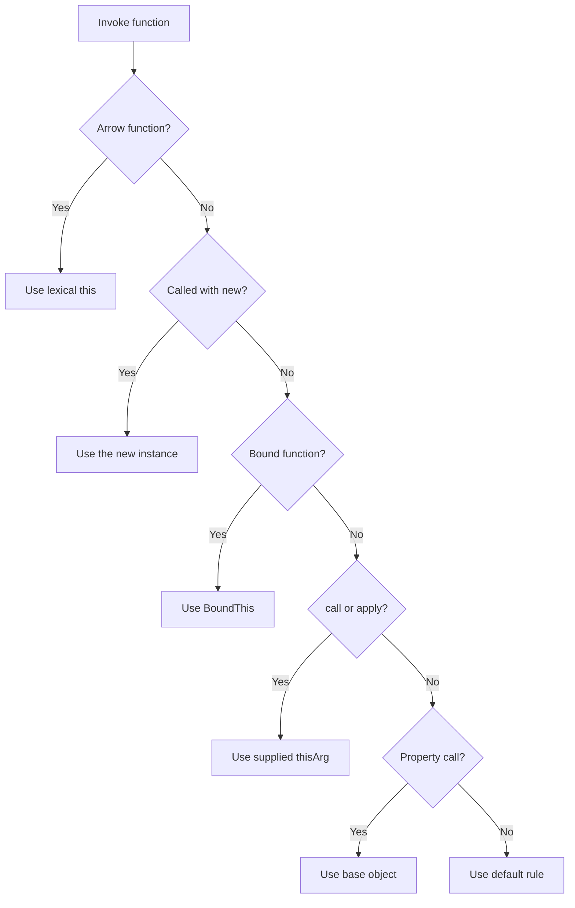

<TLDR>
  <TLDRCell label="what">
    <Term id="this-binding">this绑定</Term>决定普通函数本次调用中的`this`值。通常要看调用表达式，而不是函数写在哪里。
  </TLDRCell>
  <TLDRCell label="trap">
    `const fn = object.method`只复制函数值，不会附带`object`。箭头函数又遵循另一套规则：它没有自己的`this`，也不能被重新绑定。
  </TLDRCell>
  <TLDRCell label="fix">
    保留`object.method()`这种调用形式，或只创建一次`object.method.bind(object)`。需要继承外层`this`的短回调才使用箭头函数。
  </TLDRCell>
</TLDR>

## 是什么，为什么存在

`this`是函数调用获得的一个隐式值，普通函数可以用它访问本次调用的接收对象。它不是函数作用域中按名称查找的普通变量。对同一个函数值采用不同调用形式，可以得到不同的`this`。

这种机制让一个函数可以作为多个对象的方法复用，也让构造函数初始化新对象。`call()`、`apply()`和`bind()`则允许适配器、回调注册代码和框架明确提供接收对象。动态接收者是复用能力的来源，也是方法脱离对象后出错的原因。

你会在对象方法、类方法、访问器、事件处理器、定时器和数组回调中遇到`this`。阅读代码时，先找到实际调用表达式，例如`account.close()`、`close.call(account)`或`new Account()`。只查看`function close() { ... }`的定义通常无法得出答案。

箭头函数是重要例外。它从定义位置所在的<Term id="lexical-environment">词法环境</Term>取得`this`，不会在调用时创建自己的绑定。因此，箭头函数适合需要沿用外层方法接收者的回调，却通常不适合充当需要动态接收者的对象方法。

现代JavaScript经常用闭包和显式参数代替`this`，这并不让`this`过时。类方法、平台回调和既有库仍然依赖其调用约定。正确选择取决于API是否需要“同一操作作用于不同接收对象”这一能力。

## 工作原理

普通函数执行前，调用操作会确定`this`。属性调用`object.method()`保留了属性引用的基对象，所以`method`内的`this`是`object`。先求值并保存函数，再执行`fn()`，已经没有那个基对象。

`call(thisArg, ...args)`与`apply(thisArg, args)`立即调用目标函数。`bind(thisArg, ...args)`不立即调用，而是创建<Term id="bound-function">绑定函数</Term>，保存接收者和可选的前置实参。之后再用`call()`调用这个绑定函数，也不能替换已保存的接收者。

构造调用先创建对象，再以该对象作为目标构造函数的`this`。新对象的原型来自目标构造函数的`prototype`；如果构造函数显式返回另一个对象，那个对象会成为结果。对绑定函数使用`new`时，绑定的实参仍然生效，但绑定的`this`会被新对象取代。

箭头函数不执行这套动态绑定过程。它读取外层环境中的`this`，`call()`、`apply()`和`bind()`都不能改变该值。箭头函数也没有构造能力，因此`new arrow()`会抛出`TypeError`。

下面的流程适用于先识别函数种类、再判断调用形式。绑定函数与构造调用的顺序很重要；箭头函数则在流程入口处分流。



对普通函数可以按以下顺序审查：

1. 如果以`new`构造，使用新对象；绑定函数只保留前置实参。
2. 否则，如果目标是绑定函数，使用它保存的`this`。
3. 否则，如果通过`call()`或`apply()`调用，使用提供的`thisArg`。
4. 否则，如果是属性调用，使用点号或方括号左侧的基对象。
5. 否则，应用严格或非严格函数的默认规则。

这份顺序不是简单的语法优先级表。例如，`service.method.call(other)`最终由`call()`把`other`传给`method`；`service.boundMethod()`则仍使用绑定函数内部保存的接收者。要跟踪实际被调用的函数及其调用方式。

### 调用形式速查

下表假设`method`是读取`this`的普通严格函数，`arrow`是在外层创建的箭头函数。结果列描述函数体实际看到的接收者。

| 调用形式 | 函数体中的`this` | 关键原因 |
| --- | --- | --- |
| `object.method()` | `object` | 属性引用保留基对象 |
| `const fn = object.method; fn()` | `undefined` | 提取后只剩函数值 |
| `method.call(object, value)` | `object` | `call()`显式提供接收者 |
| `method.apply(object, [value])` | `object` | `apply()`显式提供接收者 |
| `method.bind(object)(value)` | `object` | 绑定函数保存接收者 |
| `new Constructor()` | 新实例 | 构造调用创建接收者 |
| `arrow.call(object)` | 外层的`this` | 箭头函数忽略动态接收者 |

参数与接收者是两个维度。`apply()`改变参数的提供形式，`bind()`可以同时固定接收者和部分参数；这不表示普通参数会自动成为`this`。反过来，方法点号左侧的对象不会自动作为第一个普通参数传入。

方法也不属于某个对象到不能复用。属性可以来自对象自身，也可以沿原型链找到；只要调用表达式是`receiver.method()`，普通方法就收到`receiver`。因此，方法定义位置与属性查找位置都不等于最终接收者。

## 示例

下面四个示例依次展示属性调用与显式绑定、回调中的方法丢失、箭头函数的词法`this`，以及绑定函数参与构造时的行为。所有输出均由本地Node 24执行对应文件得到。

### 从调用点确定接收者

同一个`formatJob`先作为方法调用，再通过`call()`、`apply()`和`bind()`使用。函数体没有变化，变化的是调用提供的接收者。

<Depth level="quick">

```javascript run title="call_sites.js"
'use strict';

function formatJob(prefix) {
  return `${prefix}:${this.queue}`;
}

const worker = { queue: 'critical', formatJob };

console.log(worker.formatJob('method'));
console.log(formatJob.call({ queue: 'batch' }, 'call'));
console.log(formatJob.apply({ queue: 'audit' }, ['apply']));

const bound = formatJob.bind({ queue: 'mail' }, 'bound');
console.log(bound());
```

```text
method:critical
call:batch
apply:audit
bound:mail
```

<TryToBreak items={['在严格模式下把formatJob保存到变量后直接调用', '把原始值作为call的thisArg', '尝试用call替换bound保存的接收者']} />

</Depth>

`worker.formatJob('method')`的点号左侧是`worker`，所以方法读到`critical`。`call()`和`apply()`的区别只在实参形式：前者逐个接收，后者接收类数组对象。两者都立即执行函数。

`bind()`返回新函数，并把`'bound'`保存为第一个实参。调用`bound()`时既没有重新选择接收者，也不必再次传入前缀。绑定函数与原函数不是同一个函数对象。

### 修复脱离对象的回调

`Array.prototype.map()`把回调作为普通函数调用，因此传入`meter.format`后不会自动保留`meter`。类方法中的代码按严格模式执行，第一次访问`this.unit`就会抛出`TypeError`。

```javascript run title="callback_receivers.js"
'use strict';

class Meter {
  constructor(unit) {
    this.unit = unit;
  }

  format(value) {
    return `${value}${this.unit}`;
  }
}

function render(formatter) {
  return [2, 5].map(formatter).join(', ');
}

const meter = new Meter('ms');

try {
  console.log(render(meter.format));
} catch (error) {
  console.log(error.name);
}

console.log(render(meter.format.bind(meter)));
console.log(render((value) => meter.format(value)));
```

```text
TypeError
2ms, 5ms
2ms, 5ms
```

一次绑定和箭头包装器都能表达所有权。需要稍后移除监听器或比较回调标识时，应把绑定结果保存在变量或实例字段中。每次执行`meter.format.bind(meter)`都会创建不同的函数对象。

箭头包装器本身不依赖自己的`this`，而是通过词法变量`meter`发起完整的方法调用。它也控制了只把`value`转发给方法，不会把`map()`额外提供的索引和数组误传给下游API。

### 观察箭头函数捕获的this

`makeReader()`是普通方法，它在每次调用时取得接收者。方法创建的箭头函数随后保留那次调用的`this`；对返回的函数使用`call()`不会覆盖它。

```javascript run title="lexical_this.js"
'use strict';

const dashboard = {
  label: 'primary',
  makeReader() {
    return () => this.label;
  },
};

const reader = dashboard.makeReader();
console.log(reader());
console.log(reader.call({ label: 'ignored' }));

const mirror = { label: 'mirror', makeReader: dashboard.makeReader };
console.log(mirror.makeReader()());
```

```text
primary
primary
mirror
```

前两个结果相同，因为`reader`已经从`dashboard.makeReader()`的执行中捕获`this`。最后把普通方法作为`mirror`的属性调用，所以它创建的新箭头函数捕获`mirror`。词法绑定发生在箭头函数创建时所在的执行环境，不是固定捕获源码旁边的对象字面量。

这一区别也解释了常见模式：普通方法负责接收实例，方法内部的箭头回调沿用实例。把外层方法本身改成箭头属性会改变契约，而不只是缩短语法。

### 构造调用覆盖绑定接收者

普通调用`BoundSession('ops')`使用`fallback`。同一个绑定函数放在`new`后面时，以新实例作为`this`，但仍把绑定的`'eu'`放在调用实参前面。

```javascript run title="bound_constructor.js"
'use strict';

function Session(region, id) {
  this.key = `${region}-${id}`;
}

const fallback = { key: 'unset' };
const BoundSession = Session.bind(fallback, 'eu');

BoundSession('ops');
const session = new BoundSession('42');

console.log(fallback.key);
console.log(session.key);
console.log(session instanceof Session);
console.log(session instanceof BoundSession);
```

```text
eu-ops
eu-42
true
true
```

构造出的`session`仍按目标函数`Session`的`prototype`参与`instanceof`检查。绑定函数可以用来预填构造参数，但这种技巧会隐藏真实构造器；公开API通常用命名工厂或类的静态方法更清楚。

如果`Session`显式返回一个非原始对象，`new`表达式会返回该对象而不是自动创建的实例。返回字符串、数字、布尔值、`null`或`undefined`不会替换实例。

## 陷阱

### 从定义位置猜普通函数的this

> [!PITFALL]
> 普通函数写在对象字面量或类附近，并不会永久绑定到那个对象。赋值、解构、参数传递和回调注册都可能留下一个没有原接收者的函数值。

**修复：** 在实际调用点检查点号、方括号、`call()`、`apply()`、`bind()`或`new`。若API必须独立传递方法，只绑定一次并保存结果，或者传入显式接收对象的包装器。

### 把箭头函数当作对象方法

> [!PITFALL]
> 对象字面量中的`run: () => this.task`不会让`this`指向该对象。箭头函数从外层取得`this`，对象字面量本身不会建立`this`绑定。

**修复：** 需要动态接收者时使用`run() { ... }`或普通函数。只在确实要继承外层方法接收者时使用箭头回调，并测试借用该方法到另一个对象后的行为。

### 依赖非严格模式的全局回退

> [!PITFALL]
> 脱离对象的普通函数在旧式非严格脚本中可能把`this`替换为`globalThis`，从而静默读写全局属性。模块和类方法是严格的，同一错误会变成`undefined`接收者和更早的`TypeError`。

**修复：** 以严格语义编写和测试代码，不把全局对象当作默认接收者。确实需要跨环境访问全局对象时显式使用`globalThis`；需要业务对象时显式传入或绑定它。

### 注册和移除时重复bind

> [!PITFALL]
> `subscribe(this.handle.bind(this))`与稍后的`unsubscribe(this.handle.bind(this))`创建两个不同函数。即使接收者和目标函数相同，第二个结果也不能注销第一个回调。

**修复：** 在构造阶段或初始化阶段绑定一次，把结果保存在字段中，并用同一个引用注册和移除。还要检查清理路径，避免绑定函数通过订阅关系让整个实例长期保持可达。

### 假设所有回调API都提供同一种this

> [!PITFALL]
> 回调由接收它的API调用；有的使用普通调用，有的接受`thisArg`，还有的规定特定接收者。把在一个API中有效的方法直接搬到另一个API，可能改变`this`和额外实参。

**修复：** 阅读回调API的调用契约，并用一个会访问接收者字段的测试验证。箭头回调会忽略API提供的`thisArg`；若要使用`thisArg`，必须传普通函数。

### 忽略new与返回对象的规则

> [!PITFALL]
> “绑定函数的`this`永远不变”和“构造函数总会返回新实例”都不准确。`new`会覆盖绑定接收者，而构造函数显式返回对象会覆盖自动创建的实例。

**修复：** 对可构造函数分别测试普通调用与`new`调用，并检查对象返回分支。不要把箭头函数用作构造器；需要限制调用方式时，使用`class`或明确的工厂函数。

<Depth level="deep">

## 会改变结论的边界情况

### 严格模式与接收者转换

严格普通函数保留调用者提供的`this`值。直接调用得到`undefined`；`fn.call(null)`得到`null`；原始值也保持原始值。类的构造器和方法始终使用严格语义，JavaScript模块也自动处于严格模式。

非严格普通函数会转换接收者。`undefined`或`null`会被替换为`globalThis`，字符串、数字、布尔值等原始值会被包装为对象。依赖这些转换会让代码随脚本类型和函数来源改变，因此不应把它们当作业务逻辑。

顶层`this`也由宿主和脚本类型决定。浏览器经典脚本、浏览器模块和Node CommonJS包装器的顶层结果并不相同。顶层箭头函数只会捕获该环境已经提供的值，所以不要用“它总是`window`”或“它总是`undefined`”来推理。

### 保留与丢失属性引用

`object.method()`与`object['method']()`都保留基对象。`object.method?.()`在方法存在时也保留接收者；可选链只增加空值短路，不会自动分离方法。普通括号`(object.method)()`同样不会丢失接收者。

解构`const { method } = object`、赋值`const method = object.method`和逗号表达式`(0, object.method)()`都只留下函数值。此后执行`method()`时应用默认规则。代码审查工具若只搜索变量名`method`，而不保留调用表达式结构，很容易漏掉这种语义变化。

访问器也从访问表达式取得`this`。继承来的getter在`child.value`中以`child`为接收者，而不是以定义getter的原型为接收者。`Reflect.get(target, key, receiver)`的第三个参数可以显式控制访问器看到的接收者，代理转发代码遗漏它时可能破坏行为。

### 构造、原型与super

构造调用通常把新对象连接到目标函数的<Term id="prototype-chain">原型链</Term>。绑定函数没有可供普通代码使用的自有`prototype`属性，但通过`new`调用时会把构造过程转发给目标函数。因此，示例中的实例同时满足对`Session`和`BoundSession`的`instanceof`检查。

`super.method()`从父类原型开始查找方法，却不会把父类原型用作`this`。找到的函数仍以当前实例作为接收者。这使父类方法能够操作派生实例，也意味着把该方法再次脱离调用仍会丢失实例。

构造器返回规则只区分对象与非对象，并不自动检查返回对象是否继承目标原型。显式返回普通对象会让`instanceof`、私有字段和原型方法不再符合调用者的直觉。审查生成的构造器时，应检查所有`return`分支，而不只是属性赋值。

### 绑定函数的标识与参数

每次`bind()`都创建新函数并保存目标函数、接收者和前置实参。再次绑定一个绑定函数可以继续添加前置实参，但不能替换第一次保存的`this`。这也是嵌套绑定常常可运行却难以理解的原因。

绑定函数会改变可观察元数据，例如`name`与`length`，其函数标识也不同于目标函数。大多数业务代码不应依赖精确的显示名称或参数个数，但装饰器、依赖注入容器和测试替身可能读取它们。绑定后应按新函数对象测试集成边界。

如果只需要固定数据而不需要动态接收者，闭包通常更直白。若方法需要访问对象内部状态并作为稳定回调长期存在，一次绑定能明确表达所有权。选择时同时考虑调用约定、函数标识和清理生命周期。

### 类字段箭头函数的代价与用途

类字段中的箭头函数在实例初始化时创建，并捕获正在初始化的实例。因此，`const handler = instance.handler`之后调用通常仍能访问该实例。这与原型上的普通类方法不同，后者在提取后没有接收者。

这种写法会为每个实例创建一个函数对象，而原型方法通常由实例共享。这里不应凭空推断性能结论，但函数标识和存放位置是可观察差异：`first.handler === second.handler`为`false`，而`first.method === second.method`通常为`true`。测试替身、装饰器和监听器清理可能关心这一区别。

不要把所有类方法机械改成箭头字段。需要方法借用、通过`call()`更换接收者或在原型上替换实现时，普通方法保留了这些能力。只在回调必须稳定绑定到实例，而且这一所有权属于类契约时选择箭头字段。

### 异步边界不会重绑已有调用

普通`async`方法在进入时按调用点确定`this`，越过`await`后仍使用同一次调用的接收者。`await`不会自己导致“this丢失”。真正的问题通常发生在方法进入之前已经被提取，或方法内部又把另一个普通函数作为回调传出。

审查异步代码时，应分别标出每个函数边界。`await service.load()`、`queue.then(service.normalize)`和`queue.then((value) => service.normalize(value))`是三种不同调用形式；是否异步并不能消除它们在接收者与额外实参上的差异。

### 按契约测试接收者

只测试`object.method()`会漏掉最常见的集成故障。一个依赖动态接收者的公开方法至少应覆盖它在文档允许的每种调用形式，而一个声称稳定绑定的回调则应验证函数标识和清理路径。

可以用以下顺序构造小型测试矩阵：

1. 以原对象的方法形式调用，并验证状态读写落在原对象上。
2. 把方法提取到变量后调用，记录预期是失败还是仍能工作。
3. 用另一个对象通过`call()`调用，验证方法是否允许借用。
4. 若API注册回调，实际触发回调并用同一引用执行注销。
5. 若函数可构造，同时覆盖普通调用、`new`和显式返回对象。

测试应观察状态落在哪个对象上，而不只是返回值。错误接收者有时恰好带有同名属性，让单次结果看似正确，却修改了错误实例。使用两个具有不同标记和初始状态的对象更容易暴露这种问题。

### 用显式参数消除隐式契约

并非每个操作都需要`this`。若函数只读取一个数据对象，而且没有方法借用或构造语义，把对象写成普通参数能让调用契约直接出现在函数签名中。提取和传递这种函数时不会丢失隐藏接收者。

对象方法仍适合维护实例不变量、支持多态或组织一组共享状态上的操作。选择显式参数还是`this`时，应看调用者需要哪种接口，而不是把其中一种写法当作普遍最佳实践。边界越容易把函数当作值传递，显式参数通常越容易审查。

重构时不能只机械替换函数头。把`this.value`改成`state.value`后，还要更新所有调用点、借用行为、子类覆盖和回调注册。用调用矩阵确认契约确实发生了预期变化。

</Depth>

<Checkpoint id="javascript/this-binding" />

## 延伸阅读

- [MDN：this](https://developer.mozilla.org/en-US/docs/Web/JavaScript/Reference/Operators/this)
- [MDN：Function.prototype.bind()](https://developer.mozilla.org/en-US/docs/Web/JavaScript/Reference/Global_Objects/Function/bind)
- [MDN：箭头函数表达式](https://developer.mozilla.org/en-US/docs/Web/JavaScript/Reference/Functions/Arrow_functions)
- [MDN：new运算符](https://developer.mozilla.org/en-US/docs/Web/JavaScript/Reference/Operators/new)
- [ECMAScript规范：OrdinaryCallBindThis](https://tc39.es/ecma262/multipage/ecmascript-language-functions-and-classes.html#sec-ordinarycallbindthis)
