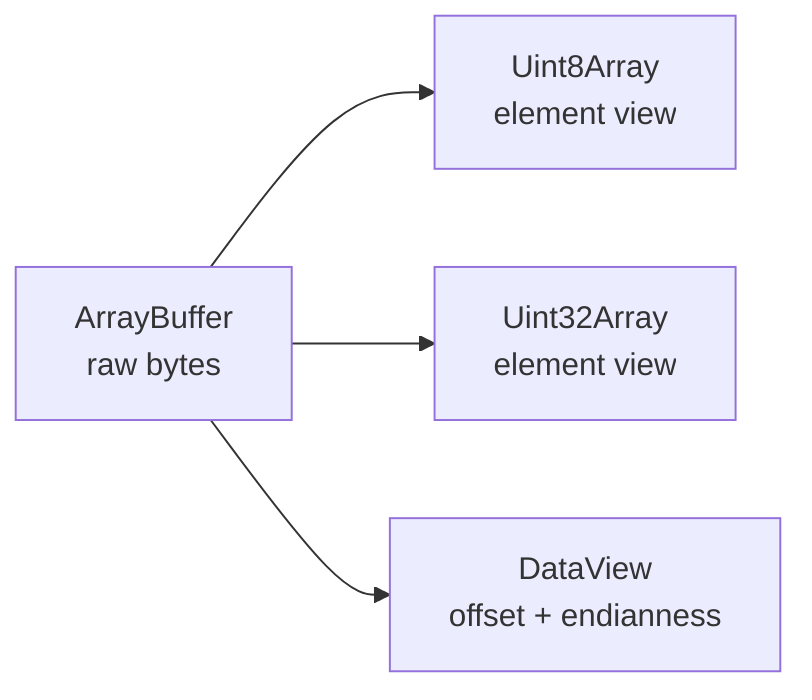

<TLDR>
  <TLDRCell label="what">
    An <Term id="array-buffer">ArrayBuffer</Term> holds bytes, a <Term id="typed-array">typed array</Term> interprets them as one fixed numeric type, and a <Term id="data-view">DataView</Term> reads and writes fields at chosen offsets and byte orders.
  </TLDRCell>
  <TLDRCell label="trap">
    A view doesn't necessarily own its data: `subarray()`, views built from a buffer, and other views may all point to the same bytes, while multibyte typed arrays use the runtime's native byte order.
  </TLDRCell>
  <TLDRCell label="fix">
    State whether an API accepts a buffer, a view, or a copy; when parsing an external format, preserve the exact `byteOffset` and `byteLength` and use `DataView` with an explicit byte order.
  </TLDRCell>
</TLDR>

## What it is and why it exists

An `ArrayBuffer` represents binary storage measured in bytes, but it has no indexing operation for reading a number. A typed array is a numeric view over that storage: `Uint8Array` interprets each element as one unsigned byte, while `Float32Array` interprets each four bytes as a binary32 floating-point value. `DataView` is also a view, but each call chooses the field type, byte offset, and <Term id="endianness">endianness</Term>.

A regular JavaScript array can mix arbitrary values, change length, and contain holes. Every typed-array index represents a numeric element, writes convert to the destination type, and the view can't grow with `push()`. Files, network frames, Canvas pixels, audio samples, WebGL attributes, and WebAssembly linear memory all pass bytes through these interfaces.

`new ArrayBuffer(n)` creates a fixed-length buffer. Node 24 also supports resizable buffers: supply `maxByteLength` at construction and the owner can call `resize()` within that limit. The old rule that every `ArrayBuffer` has an immutable size is therefore wrong; resizability belongs to the particular buffer.

Use a typed array for a run of values with one element type. Use `DataView` for mixed fields or an external format with a specified byte order. They often work together: a `DataView` parses the header, then `Uint8Array.subarray()` exposes a payload window. Start from the data format and choose a view, instead of treating a constructor name as a format specification.

## How it works

The buffer owns the bytes; a view describes how to access a region. Several views can overlap, and a write through any one of them is visible when another reads the shared bytes.



Bytes in a new buffer are initialized to zero. Every view has `buffer`, `byteOffset`, and `byteLength`; a typed array also exposes its element-counted `length` and the constructor's `BYTES_PER_ELEMENT`. `byteOffset` and `byteLength` are always byte counts, while `length` counts elements.

Indexed typed-array writes perform numeric conversion. Non-clamped unsigned integer types reduce values to their bit width, `Uint8ClampedArray` limits results to 0 through 255, and floating types round to a representable value. `BigInt64Array` and `BigUint64Array` take `bigint` values; writing an ordinary `number` directly is an error.

Multibyte typed arrays interpret data in the runtime's native byte order, with no parameter to switch it. Multibyte `DataView` methods take a `littleEndian` argument: omitted or `false` means big-endian, while `true` means little-endian. When an external format defines byte order, passing the argument on every call leaves that protocol decision visible in the code.

### Constructor shape determines ownership

The constructor arguments determine whether an operation allocates, copies, or shares. Pay particular attention to `length` versus `byteLength`, and to value conversion versus reinterpretation of raw bytes.

| Expression | New buffer | Length unit | Result |
| --- | --- | --- | --- |
| `new Uint16Array(4)` | Yes | 4 elements | Allocates 8 zero bytes |
| `new Uint16Array([1, 2])` | Yes | Input elements | Converts and copies two values |
| `new Uint16Array(otherView)` | Yes | Input elements | Converts and copies element by element |
| `new Uint16Array(buffer, offset, length)` | No | Byte offset, element length | Creates a view over the original buffer |
| `new DataView(buffer, offset, byteLength)` | No | Byte offset and byte length | Creates a general view over the original buffer |

Parse binary input in a stable order:

1. State whether the function accepts an `ArrayBuffer` or a particular view, then validate that type at the boundary.
2. Limit access with the input view's own `byteOffset` and `byteLength`.
3. Check the remaining byte count before reading each field or payload.
4. Read the signedness, width, and byte order required by the format, then validate the business range.

## Examples

These four examples build from shared bytes to offset packet parsing, copy-versus-view behavior, and resizable buffers. The shown output came from running each file locally with Node 24.14.0.

### Put two views over one buffer

The `DataView` writes a two-byte header in big-endian order, then the `Uint8Array` writes the payload. Neither object copies data from the other.

<Depth level="quick">

```javascript run title="shared_views.js"
const buffer = new ArrayBuffer(6);
const bytes = new Uint8Array(buffer);
const fields = new DataView(buffer);

fields.setUint16(0, 0x1234, false);
bytes.set([79, 75, 33, 0], 2);

console.log([...bytes]);
console.log(fields.getUint16(0, false).toString(16));
console.log(new TextDecoder().decode(bytes.subarray(2, 5)));
```

```text
[ 18, 52, 79, 75, 33, 0 ]
1234
OK!
```

</Depth>

The byte view shows `0x12` and `0x34` in that order because the write explicitly chose big-endian. The end position in `subarray(2, 5)` is exclusive, so the decoded range contains exactly three payload bytes.

Writing the header through a `Uint16Array` would instead make the byte order native. That may be the contract for data consumed only within one process, but it is too implicit for a file or network frame.

### Parse a packet with a nonzero offset

Real input is often a window into a larger receive buffer. A parser must restrict its `DataView` to that window instead of starting at index 0 of the backing buffer.

```javascript run title="parse_packet.js"
function parsePacket(bytes) {
  if (!(bytes instanceof Uint8Array)) {
    throw new TypeError('Expected Uint8Array');
  }

  const headerBytes = 8;
  if (bytes.byteLength < headerBytes) {
    throw new RangeError('Truncated header');
  }

  const view = new DataView(bytes.buffer, bytes.byteOffset, bytes.byteLength);
  const payloadLength = view.getUint16(2, false);
  if (headerBytes + payloadLength !== bytes.byteLength) {
    throw new RangeError('Invalid payload length');
  }

  return {
    version: view.getUint8(0),
    flags: view.getUint8(1),
    sequence: view.getUint32(4, false),
    payload: new TextDecoder().decode(bytes.subarray(headerBytes)),
  };
}

const storage = new Uint8Array([
  99, 99, 1, 5, 0, 3, 0, 0, 0, 42, 79, 75, 33, 88,
]);
const packet = storage.subarray(2, 13);
console.log(JSON.stringify(parsePacket(packet)));
```

```text
{"version":1,"flags":5,"sequence":42,"payload":"OK!"}
```

<TryToBreak items={['a packet shorter than 8 bytes', 'a declared payload length larger than the remaining bytes', 'a Uint8Array view whose byteOffset is not zero']} />

`storage` has a byte outside the packet at each end, exposing an implementation that ignores `byteOffset`. The length check runs before payload decoding, so a corrupt length field cannot turn into an out-of-bounds read.

This example requires the packet to fill the input view exactly. A protocol that allows trailing bytes can replace the equality check with an upper-bound check, but that choice must come from its format specification rather than parser guesswork.

### Compare `subarray()` with `slice()`

`subarray()` creates a shared window, while `slice()` creates an independent copy. Writes to the source or shared window are mutually visible; the earlier copy stays unchanged.

```javascript run title="copy_or_view.js"
const source = new Uint8Array([10, 20, 30, 40, 50]);
const windowView = source.subarray(1, 4);
const copy = source.slice(1, 4);

source[2] = 99;
windowView[0] = 77;

console.log([...source]);
console.log([...windowView]);
console.log([...copy]);
console.log(windowView.buffer === source.buffer);
console.log(copy.buffer === source.buffer);
```

```text
[ 10, 77, 99, 40, 50 ]
[ 77, 99, 40 ]
[ 20, 30, 40 ]
true
false
```

Sharing isn't necessarily a bug. A synchronous parser can use windows without pointless copies; when data is cached, passed to an uncontrolled caller, or retained across an asynchronous boundary, an independent copy usually gives clearer ownership.

`buffer.slice()` copies bytes too, but its indices are relative to the whole `ArrayBuffer`. When you hold only a local view, `view.slice()` is less likely to copy data outside that window by accident.

### Watch a length-tracking view

When the typed-array constructor omits `length`, a view over a resizable buffer tracks the available length. A view with an explicit length doesn't grow with the buffer, and it becomes temporarily out of bounds if shrinking crosses its end.

```javascript run title="resizable_buffer.js"
const buffer = new ArrayBuffer(4, { maxByteLength: 8 });
const tracking = new Uint8Array(buffer);
const fixed = new Uint8Array(buffer, 0, 4);

tracking.set([1, 2, 3, 4]);
buffer.resize(6);
tracking.set([5, 6], 4);

console.log(tracking.length, [...tracking]);
console.log(fixed.length, [...fixed]);

buffer.resize(2);
console.log(tracking.length, [...tracking]);
console.log(fixed.length, fixed[0]);
```

```text
6 [ 1, 2, 3, 4, 5, 6 ]
4 [ 1, 2, 3, 4 ]
2 [ 1, 2 ]
0 undefined
```

Growth supplies zero-initialized bytes, which the example then changes to 5 and 6. After the buffer shrinks to two bytes, the fixed view reports length 0; it does not become a new two-element window truncated to what remains.

A resizable buffer suits an owner that genuinely needs growth, but that doesn't mean every API should expose a mutable length. Pass a fixed-length view or copy at the boundary when a consumer relies on a stable size.

## Pitfalls

### Treating element counts as byte counts

> [!PITFALL]
> `new Uint32Array(buffer, 8, 4)` starts at byte 8 and contains 4 elements, so it needs 16 available bytes. Reading both units as bytes can select the wrong window or raise `RangeError`.

**Fix:** suffix layout constants with `Bytes` or `Elements`, and convert with `Type.BYTES_PER_ELEMENT`. Validate the offset, element count, and buffer boundary before constructing the view.

### Ignoring the input view's offset

> [!PITFALL]
> `new DataView(bytes.buffer)` sees the entire backing buffer, not the local window represented by `bytes`. A pooled Node.js `Buffer`, a `subarray()` result, or an input assembled from several packets may have a nonzero `byteOffset`.

**Fix:** preserve the window geometry with `new DataView(bytes.buffer, bytes.byteOffset, bytes.byteLength)`. Test fixtures should place sentinel bytes before and after the target instead of always starting at buffer index 0.

### Treating a shared window as a copy

> [!PITFALL]
> `subarray()` does not copy data, so later writes by the caller can change a saved window. Replacing every read-only window with `slice()` has the opposite problem: it silently changes memory and ownership behavior.

**Fix:** state in the API name or documentation whether the result is a borrowed view or an owned copy. Use `slice()` when isolation is required; keep `subarray()` when sharing is deliberate, and constrain who may write and when.

### Parsing specified byte order with a typed array

> [!PITFALL]
> `new Uint32Array(buffer)[0]` uses native byte order. Passing tests on a common little-endian machine doesn't prove that it parses a big-endian network field correctly.

**Fix:** use `DataView` for external multibyte fields and explicitly pass `true` or `false` on every read and write. Assert numbers from fixed byte fixtures rather than relying only on encode-then-decode round trips through the same implementation.

### Expecting writes to validate the range

> [!PITFALL]
> Writing 256 to a `Uint8Array` produces 0, and writing -1 produces 255; these out-of-range values normally don't throw. `Uint8ClampedArray` has different saturation behavior, and floating types introduce precision rounding.

**Fix:** validate `Number.isFinite()`, integer requirements, and the business range before assignment. Rely on typed-array conversion only when the format itself calls for modular or saturating conversion.

### Confusing value conversion with byte reinterpretation

> [!PITFALL]
> `new Uint8Array(uint16View)` converts each element value; it does not expose the two backing bytes of every `Uint16` element. Reading the raw representation requires a byte view over the same buffer with the right range.

**Fix:** first state whether the target operation is value conversion, byte copy, or byte reinterpretation. For reinterpretation, construct from `view.buffer`, `view.byteOffset`, and `view.byteLength`; for conversion, pass the original view itself.

### Reusing a view after its buffer changes

> [!PITFALL]
> Transferring an `ArrayBuffer` detaches the source, while shrinking a resizable buffer can put a fixed-length view out of bounds. An old view may report length 0 or return `undefined` for indexed access, and some methods throw.

**Fix:** give transfer or resizing one owner and stop using old views after that operation. Test invalidation across worker or asynchronous boundaries; an object still being in scope doesn't prove that its storage remains accessible.

<Depth level="deep">

## Element types and numeric conversion

JavaScript has no general `TypedArray` constructor for application code; choose a concrete constructor. Node 24 provides the following 12 types. Each has a fixed element width, and the destination type controls write behavior.

| Constructor | Bytes per element | Numeric category | Write behavior |
| --- | --- | --- | --- |
| `Int8Array` | 1 | `number` | Signed 8-bit integer conversion |
| `Uint8Array` | 1 | `number` | Unsigned 8-bit integer conversion |
| `Uint8ClampedArray` | 1 | `number` | Clamps to 0 through 255, then rounds |
| `Int16Array` | 2 | `number` | Signed 16-bit integer conversion |
| `Uint16Array` | 2 | `number` | Unsigned 16-bit integer conversion |
| `Int32Array` | 4 | `number` | Signed 32-bit integer conversion |
| `Uint32Array` | 4 | `number` | Unsigned 32-bit integer conversion |
| `Float16Array` | 2 | `number` | Rounds to IEEE 754 binary16 |
| `Float32Array` | 4 | `number` | Rounds to IEEE 754 binary32 |
| `Float64Array` | 8 | `number` | Stores IEEE 754 binary64 |
| `BigInt64Array` | 8 | `bigint` | Signed 64-bit integer conversion |
| `BigUint64Array` | 8 | `bigint` | Unsigned 64-bit integer conversion |

Integer conversion is not business validation. A color channel may need the saturation behavior of `Uint8ClampedArray`, while an out-of-range protocol version should usually be rejected. Choose a type together with an invalid-input policy, not from the binary layout alone.

Floating arrays don't store arbitrary-precision decimal numbers. `Float16Array` and `Float32Array` round earlier than ordinary JavaScript numbers, so equality checks should use a representable format value or an allowed error. Currency minor units and identifiers that must remain exact shouldn't be changed to floating point just to save bytes.

## Copying, sharing, and reinterpretation

These APIs look similar, but their ownership and conversion differ. Use this matrix during review instead of inferring behavior from variable names.

| Operation | New buffer | Shares writes with input | Meaning |
| --- | --- | --- | --- |
| `view.subarray(start, end)` | No | Yes | Creates a same-type window |
| `view.slice(start, end)` | Yes | No | Copies selected elements |
| `new SameType(view)` | Yes | No | Copies element values |
| `new OtherType(view)` | Yes | No | Converts and copies element values |
| `new OtherType(view.buffer, offset, length)` | No | Yes | Reinterprets shared bytes as another type |
| `view.buffer.slice(start, end)` | Yes | No | Copies bytes in backing-buffer coordinates |

The last row can escape a local view because `start` and `end` are relative to the backing buffer. To copy the raw bytes covered by any typed array, first construct `new Uint8Array(view.buffer, view.byteOffset, view.byteLength)`, then call `slice()` on that byte view.

When shared bytes are reinterpreted as a different element type, the offset must satisfy the new type's alignment requirement. For example, `new Uint32Array(buffer, 1)` throws `RangeError` because 1 isn't a multiple of 4. `DataView` has no such alignment restriction, so an unaligned format field doesn't require manual byte assembly.

## Resizable and transferable buffers

Only an `ArrayBuffer` constructed with `maxByteLength` is resizable, as reported by `resizable`. `resize(newLength)` can't exceed that maximum; growth adds zero-initialized bytes and shrinking discards trailing bytes. A typed-array view with no explicit length tracks the remaining buffer, while an explicit-length view keeps its declared range.

When a fixed-length view's range extends beyond a shrunken buffer, the whole view becomes out of bounds; it doesn't preserve the leading elements that still fit. The view can come back in bounds if the buffer later grows far enough, but discarded bytes don't return. A consumer that needs stable content should copy before resizing or prevent the owner from resizing concurrently.

`buffer.transfer()` creates a destination buffer and detaches the source; `transferToFixedLength()` makes a non-resizable destination. Structured-clone transfer in browsers and Node.js also detaches the sender's buffer. Transfer is useful for an explicit ownership handoff, but the old buffer and all its old views must be treated as consumed.

A `SharedArrayBuffer` isn't transferred this way; it lets multiple execution contexts see the same storage. Views still provide only an access shape, not synchronization. Coordination belongs to `Atomics` and a higher-level protocol, and shouldn't be inferred from ordinary `ArrayBuffer` examples.

## Bounds, alignment, and out-of-range access

A typed-array constructor requires `byteOffset` to be a multiple of the element width and the selected element range to fit the buffer. `DataView` permits any byte offset because its access methods can read unaligned fields. Their out-of-range reads differ too: typed-array indexed access returns `undefined`, while a `DataView` field read throws `RangeError`.

That difference doesn't replace explicit length checks. Exception-driven parsing mixes malformed input with programming errors, and code may consume fields read before the throw. A parser should prove that each complete field exists before reading it, then validate its value.

Node.js `Buffer` is a `Uint8Array` subclass, but it often represents a local window in a larger allocation. Passing only `buffer.buffer` to a browser-style helper can expose bytes outside that window. Preserve its offset and length together, or copy the required window at the API boundary.

## Ownership and API contracts

A parameter named only `data` hides the most important facts of a binary API. Its signature and documentation should at least state whether it accepts an `ArrayBuffer`, any `ArrayBufferView`, or a concrete `Uint8Array`; whether it reads the whole window; and whether it retains a reference during or after the call.

A borrowed view suits synchronous read-only work, with the caller retaining storage ownership afterward. If the callee caches the data, defers work, or hands it to other code, copying establishes independent ownership; for a cross-thread handoff of a large buffer, transfer can express ownership movement. The lifecycle determines the choice, without a made-up universal performance multiplier.

Return values need the same policy. Names such as `viewPayload()` and `copyPayload()`, or equally explicit documentation, prevent more mistakes than a generic `getPayload()`. Tests should verify identity and mutation propagation alongside byte snapshots.

## Describe the layout before accessing bytes

Put each field's offset, width, signedness, and byte order in a format description or named constants instead of scattering bare numbers across reads. Derive offsets from the end of the preceding field. A review can then see whether later fields moved with a format change.

A versioned format should read the smallest prefix shared by every version, validate the version, and only then enter its layout. An older parser should reject an unknown version explicitly instead of continuing with its current layout and producing plausible-looking values by accident.

Compare a variable field's length with the bytes remaining in the current view before creating a `subarray()`. If the length also drives allocation, validation against the field's representable width isn't enough; the API needs a separate limit based on its business contract.

Text payloads add an encoding-error policy. `TextDecoder` replaces malformed bytes by default; when a protocol requires strict UTF-8, construct it with `{ fatal: true }` and treat decoding failure as an invalid message.

## Testing binary parsers

An encoder and parser can share the same wrong assumption, so their round trip still passes. Keep at least one fixed byte fixture from the format specification or another implementation, then assert field values and byte order directly.

1. Truncate input at every field boundary, including empty input and one byte short.
2. Repeat success and failure cases with a view whose `byteOffset` is not zero.
3. Cover signed minima, maxima, zero, and representable values outside the business range.
4. Verify byte order with fixed big-endian and little-endian fixtures; a self round trip is only a supplement.
5. Mutate the source and returned view, then test references retained across resizing or transfer.

Error messages should distinguish insufficient bytes, a mismatched declared length, and an invalid field value. That lets callers decide whether to await more stream data, reject a corrupt message, or report an unsupported version. It also makes a generated parser's missing boundary check easier to locate in tests.

</Depth>

<Checkpoint id="javascript/typed-arrays" />

## Further reading

- [ECMAScript specification: ArrayBuffer objects](https://tc39.es/ecma262/multipage/structured-data.html#sec-arraybuffer-objects)
- [ECMAScript specification: TypedArray objects](https://tc39.es/ecma262/multipage/indexed-collections.html#sec-typedarray-objects)
- [MDN: ArrayBuffer](https://developer.mozilla.org/en-US/docs/Web/JavaScript/Reference/Global_Objects/ArrayBuffer)
- [MDN: TypedArray](https://developer.mozilla.org/en-US/docs/Web/JavaScript/Reference/Global_Objects/TypedArray)
- [MDN: DataView](https://developer.mozilla.org/en-US/docs/Web/JavaScript/Reference/Global_Objects/DataView)
- [Node.js 24: Buffer and TypedArray](https://nodejs.org/docs/latest-v24.x/api/buffer.html#buffers-and-typedarrays)
