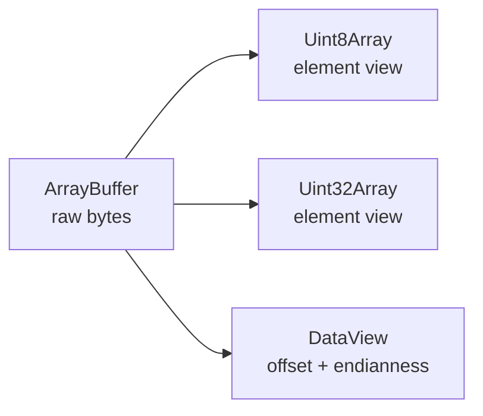

<TLDR>
  <TLDRCell label="what">
    <Term id="array-buffer">ArrayBuffer（数组缓冲区）</Term>保存字节，<Term id="typed-array">类型化数组（typed array）</Term>按一种固定数值类型解释这些字节，<Term id="data-view">DataView（数据视图）</Term>则按指定偏移和字节序读写字段。
  </TLDRCell>
  <TLDRCell label="trap">
    视图不一定拥有数据；`subarray()`、从缓冲区构造的视图以及其他视图可能指向同一批字节，而且多字节类型化数组使用运行平台的本机字节序。
  </TLDRCell>
  <TLDRCell label="fix">
    先写清 API 接收的是缓冲区、视图还是副本；解析外部格式时传入准确的 `byteOffset` 和 `byteLength`，并用 `DataView` 显式指定字节序。
  </TLDRCell>
</TLDR>

## 是什么，为什么存在

`ArrayBuffer` 表示一段按字节计数的二进制存储，本身没有读取某个数字的下标操作。类型化数组是这段存储上的数值视图，例如 `Uint8Array` 把每个元素解释为一个无符号字节，`Float32Array` 把每四个字节解释为一个二进制 32 位浮点数。`DataView` 也是视图，但每次调用都选择字段类型、字节偏移和<Term id="endianness">字节序（endianness）</Term>。

普通 JavaScript 数组可以混放任意值、改变长度并保留空槽。类型化数组的每个索引都对应一个数值元素，写入时会按目标类型转换，而且视图不能用 `push()` 增加元素。文件、网络帧、Canvas 像素、音频样本、WebGL 属性和 WebAssembly 线性内存都会把字节交给这套接口。

`new ArrayBuffer(n)` 创建的是固定长度缓冲区。Node 24 也支持可调整缓冲区：构造时提供 `maxByteLength` 后，可以在上限内调用 `resize()`。因此，「所有 `ArrayBuffer` 创建后都不能改变大小」已经不准确；是否可调整是缓冲区自身的属性。

连续同类型的数值适合类型化数组，混合字段或规定了字节序的外部格式适合 `DataView`。两者经常配合使用：`DataView` 解析头部，`Uint8Array.subarray()` 提供负载窗口。先确定数据格式，再选视图，不要把构造函数名称当成文件格式说明。

## 工作原理

缓冲区拥有字节，视图只描述怎样访问其中一段。多个视图可以覆盖同一区域；通过任意一个视图写入后，其他视图会从共享字节中读到变化。



新缓冲区中的字节初始化为零。每个视图都有 `buffer`、`byteOffset` 和 `byteLength`；类型化数组还公开按元素计数的 `length` 与构造函数的 `BYTES_PER_ELEMENT`。`byteOffset` 和 `byteLength` 始终以字节计数，`length` 才以元素计数。

类型化数组下标读写会执行数值转换。非钳制无符号整数类型会按位宽取模，`Uint8ClampedArray` 会把结果限制到 0 至 255，浮点类型会舍入到自身能表示的值。`BigInt64Array` 和 `BigUint64Array` 接受 `bigint`，不能把普通 `number` 直接写入。

多字节类型化数组按运行平台的本机字节序解释数据，API 不提供切换参数。`DataView` 的多字节读取与写入方法接收 `littleEndian` 参数；省略或传入 `false` 表示大端序，传入 `true` 表示小端序。外部格式规定字节序时，每次调用都明确传参会让协议意图留在代码中。

### 构造方式决定所有权

构造函数的参数形状决定操作是分配、复制还是共享。尤其要分清 `length` 和 `byteLength`，也要分清「转换元素值」与「重新解释原始字节」。

| 表达式 | 是否新建缓冲区 | 长度单位 | 结果 |
| --- | --- | --- | --- |
| `new Uint16Array(4)` | 是 | 4 个元素 | 分配 8 个零字节 |
| `new Uint16Array([1, 2])` | 是 | 输入元素 | 转换并复制两个值 |
| `new Uint16Array(otherView)` | 是 | 输入元素 | 逐元素转换并复制 |
| `new Uint16Array(buffer, offset, length)` | 否 | 偏移为字节，长度为元素 | 在原缓冲区上建立视图 |
| `new DataView(buffer, offset, byteLength)` | 否 | 偏移和长度都是字节 | 在原缓冲区上建立通用视图 |

解析二进制输入时可以按一个稳定顺序处理：

1. 明确函数接收 `ArrayBuffer` 还是某一种视图，并在入口验证类型。
2. 用视图自己的 `byteOffset` 和 `byteLength` 限定可访问范围。
3. 在读取每个字段或负载前验证剩余字节数。
4. 按格式规定的有符号性、宽度和字节序读取，再验证业务范围。

## 示例

下面四个示例依次展示共享字节、带偏移的数据包解析、复制与视图的区别，以及可调整缓冲区。输出由本地 Node 24.14.0 实际执行对应文件得到。

### 在同一缓冲区上建立两个视图

`DataView` 以大端序写入两字节头部，`Uint8Array` 写入后面的负载。两个对象没有互相复制数据。

<Depth level="quick">

```javascript run title="shared_views.js"
const buffer = new ArrayBuffer(6);
const bytes = new Uint8Array(buffer);
const fields = new DataView(buffer);

fields.setUint16(0, 0x1234, false);
bytes.set([79, 75, 33, 0], 2);

console.log([...bytes]);
console.log(fields.getUint16(0, false).toString(16));
console.log(new TextDecoder().decode(bytes.subarray(2, 5)));
```

```text
[ 18, 52, 79, 75, 33, 0 ]
1234
OK!
```

</Depth>

字节视图直接显示 `0x12` 和 `0x34`，因为写入方法明确选择了大端序。`subarray(2, 5)` 的结束位置不包含在结果中，所以解码范围恰好是三个负载字节。

如果改用 `Uint16Array` 写头部，字节排列将取决于本机字节序。数据只在同一进程内部消费时这可能符合契约；写文件或网络帧时则不够明确。

### 解析具有非零偏移的数据包

真实输入常是更大接收缓冲区中的一个窗口。解析器必须把 `DataView` 限定到这个窗口，而不是从底层缓冲区的索引 0 开始。

```javascript run title="parse_packet.js"
function parsePacket(bytes) {
  if (!(bytes instanceof Uint8Array)) {
    throw new TypeError('Expected Uint8Array');
  }

  const headerBytes = 8;
  if (bytes.byteLength < headerBytes) {
    throw new RangeError('Truncated header');
  }

  const view = new DataView(bytes.buffer, bytes.byteOffset, bytes.byteLength);
  const payloadLength = view.getUint16(2, false);
  if (headerBytes + payloadLength !== bytes.byteLength) {
    throw new RangeError('Invalid payload length');
  }

  return {
    version: view.getUint8(0),
    flags: view.getUint8(1),
    sequence: view.getUint32(4, false),
    payload: new TextDecoder().decode(bytes.subarray(headerBytes)),
  };
}

const storage = new Uint8Array([
  99, 99, 1, 5, 0, 3, 0, 0, 0, 42, 79, 75, 33, 88,
]);
const packet = storage.subarray(2, 13);
console.log(JSON.stringify(parsePacket(packet)));
```

```text
{"version":1,"flags":5,"sequence":42,"payload":"OK!"}
```

<TryToBreak items={['少于 8 字节的数据包', '声明的负载长度超过剩余字节', 'byteOffset 不为 0 的 Uint8Array 视图']} />

`storage` 前后各有不属于数据包的字节，这会暴露忽略 `byteOffset` 的实现。长度检查发生在负载解码之前，因此损坏的长度字段不会变成一次越界读取。

示例要求数据包刚好占满输入视图。允许尾随字节的协议可以把等号检查改成上界检查，但这个选择必须来自格式规范，不能由解析器猜测。

### 对比 `subarray()` 与 `slice()`

`subarray()` 创建共享窗口，`slice()` 创建独立副本。修改源数组或共享窗口会互相可见，旧副本保持不变。

```javascript run title="copy_or_view.js"
const source = new Uint8Array([10, 20, 30, 40, 50]);
const windowView = source.subarray(1, 4);
const copy = source.slice(1, 4);

source[2] = 99;
windowView[0] = 77;

console.log([...source]);
console.log([...windowView]);
console.log([...copy]);
console.log(windowView.buffer === source.buffer);
console.log(copy.buffer === source.buffer);
```

```text
[ 10, 77, 99, 40, 50 ]
[ 77, 99, 40 ]
[ 20, 30, 40 ]
true
false
```

共享并不一定是错误。同步解析器可以用窗口避免无意义的副本；若数据会被缓存、交给不受控调用方或跨越异步边界，独立副本通常能给出更清楚的所有权。

`buffer.slice()` 也复制字节，但它的索引相对于整个 `ArrayBuffer`。手中只有局部视图时，`view.slice()` 更不容易意外复制窗口之外的数据。

### 观察长度跟踪视图

省略类型化数组构造函数的 `length` 时，可调整缓冲区上的视图会跟踪可用长度。显式给出长度的视图不会随扩容增长，缩容越过它的末端时则会暂时越界。

```javascript run title="resizable_buffer.js"
const buffer = new ArrayBuffer(4, { maxByteLength: 8 });
const tracking = new Uint8Array(buffer);
const fixed = new Uint8Array(buffer, 0, 4);

tracking.set([1, 2, 3, 4]);
buffer.resize(6);
tracking.set([5, 6], 4);

console.log(tracking.length, [...tracking]);
console.log(fixed.length, [...fixed]);

buffer.resize(2);
console.log(tracking.length, [...tracking]);
console.log(fixed.length, fixed[0]);
```

```text
6 [ 1, 2, 3, 4, 5, 6 ]
4 [ 1, 2, 3, 4 ]
2 [ 1, 2 ]
0 undefined
```

扩容得到的新字节是零，随后示例把它们改成 5 和 6。固定长度视图在缓冲区缩到 2 字节后报告长度 0；这不是一个自动截短到两个元素的新窗口。

可调整缓冲区适合确实需要增长的所有者，不代表每个 API 都应暴露可变长度。消费者依赖稳定大小时，可以传入固定长度视图或在边界复制。

## 陷阱

### 把元素数当成字节数

> [!PITFALL]
> `new Uint32Array(buffer, 8, 4)` 从第 8 个字节开始并包含 4 个元素，也就是需要 16 个可用字节。把两个单位都理解为字节，可能造成错误窗口或 `RangeError`。

**修复方法：** 给布局常量加上 `Bytes` 或 `Elements` 后缀，并用 `Type.BYTES_PER_ELEMENT` 完成换算。在构造视图前验证偏移、元素数量和缓冲区边界。

### 忽略输入视图的偏移

> [!PITFALL]
> `new DataView(bytes.buffer)` 查看整个底层缓冲区，不是 `bytes` 表示的局部窗口。池化的 Node.js `Buffer`、`subarray()` 结果以及拼包后的输入都可能具有非零 `byteOffset`。

**修复方法：** 用 `new DataView(bytes.buffer, bytes.byteOffset, bytes.byteLength)` 保留窗口几何信息。测试夹具应在目标数据前后放置哨兵字节，不能总从缓冲区索引 0 开始。

### 把共享窗口当成副本

> [!PITFALL]
> `subarray()` 不复制数据，调用方之后的写入会改变已保存的窗口。相反，把本来只需读取的窗口一律改成 `slice()`，又会悄悄改变内存和所有权行为。

**修复方法：** 在 API 名称或文档中说明返回值是 borrowed view 还是 owned copy。需要隔离时使用 `slice()`；允许共享时保留 `subarray()`，并约束谁能在何时写入。

### 用类型化数组解析规定字节序的格式

> [!PITFALL]
> `new Uint32Array(buffer)[0]` 使用本机字节序。代码在常见的小端机器上通过测试，并不能证明它正确解析了大端网络字段。

**修复方法：** 对外部多字节字段使用 `DataView`，为每次读取和写入明确传递 `true` 或 `false`。用固定的字节夹具断言数值，不要只做同一实现的编码后解码往返测试。

### 期待写入自动验证范围

> [!PITFALL]
> 向 `Uint8Array` 写入 256 得到 0，写入 -1 得到 255；通常不会抛出越界数值错误。`Uint8ClampedArray` 的饱和行为不同，浮点类型还会发生精度舍入。

**修复方法：** 在赋值前验证 `Number.isFinite()`、整数要求和业务范围。只有格式本身需要取模或饱和转换时，才把类型化数组的转换规则当成所需行为。

### 混淆数值转换与字节重解释

> [!PITFALL]
> `new Uint8Array(uint16View)` 会逐元素转换数值，不会给出每个 `Uint16` 元素的两个底层字节。要查看原始表示，必须在同一缓冲区上建立字节视图，并保留正确范围。

**修复方法：** 先写出目标是 value conversion、byte copy 还是 byte reinterpretation。重解释时从 `view.buffer`、`view.byteOffset` 和 `view.byteLength` 构造视图；转换时则直接传入原视图。

### 缓冲区失效后继续使用视图

> [!PITFALL]
> 转移 `ArrayBuffer` 会分离原缓冲区，可调整缓冲区缩小后也可能让固定长度视图越界。旧视图可能报告长度 0、下标读取为 `undefined`，而某些方法会抛出异常。

**修复方法：** 为转移或调整大小指定唯一所有者，并在操作后停止使用旧视图。跨线程或异步边界时测试失效路径，不要把「对象仍在作用域内」误当成存储仍可访问。

## AI 时代

**生成代码在这里常犯的错**

模型生成的二进制解析器常用 `new DataView(input.buffer)`，丢掉 `Uint8Array` 或 Node.js `Buffer` 的非零偏移和局部长度。另一类代码用多字节类型化数组读取协议字段，实际依赖本机字节序；或者把 `slice()` 与 `subarray()` 互换，导致缓存数据随后被调用方修改。它还可能相信包头声明的长度，在检查剩余字节之前调用 `getUint32()` 或创建负载视图。

**让 AI 检查**

- 列出每个视图的 `buffer`、`byteOffset`、`byteLength`、元素类型和所有者，并标出共享区域。
- 用非零偏移输入逐字段追踪解析过程，说明每次长度检查发生在什么读取之前。
- 对每个复制或构造操作分类：数值转换、字节复制、共享视图或字节重解释。

**审查清单**

- 用截断头部、错误长度、反向字节序和视图前后哨兵字节运行解析测试。
- 检查所有外部多字节字段是否显式选择有符号性、宽度和字节序。
- 修改源与结果各一次，确认 `slice()`、`subarray()`、转移和缩容后的所有权符合契约。

**提示词词汇**

使用准确术语：`backing buffer`（底层缓冲区）、`ArrayBufferView`（缓冲区视图）、`byte offset`（字节偏移）、`element length`（元素长度）、`endianness`（字节序）、`length-tracking view`（长度跟踪视图）、`fixed-length view`（固定长度视图）、`detached buffer`（已分离缓冲区）、`aliasing`（别名共享）。要求模型给出字节布局和所有权表；「把字节转成数组」不足以说明转换语义。

<Depth level="deep">

## 元素类型与数值转换

JavaScript 没有供业务代码直接构造的通用 `TypedArray` 类型，应选择一个具体构造函数。Node 24 提供下面 12 种类型；每种类型的元素宽度固定，写入行为由目标类型决定。

| 构造函数 | 每个元素的字节数 | 接受的数值类别 | 写入要点 |
| --- | --- | --- | --- |
| `Int8Array` | 1 | `number` | 有符号 8 位整数转换 |
| `Uint8Array` | 1 | `number` | 无符号 8 位整数转换 |
| `Uint8ClampedArray` | 1 | `number` | 限制到 0 至 255 后舍入 |
| `Int16Array` | 2 | `number` | 有符号 16 位整数转换 |
| `Uint16Array` | 2 | `number` | 无符号 16 位整数转换 |
| `Int32Array` | 4 | `number` | 有符号 32 位整数转换 |
| `Uint32Array` | 4 | `number` | 无符号 32 位整数转换 |
| `Float16Array` | 2 | `number` | 舍入为 IEEE 754 binary16 |
| `Float32Array` | 4 | `number` | 舍入为 IEEE 754 binary32 |
| `Float64Array` | 8 | `number` | 存储 IEEE 754 binary64 |
| `BigInt64Array` | 8 | `bigint` | 有符号 64 位整数转换 |
| `BigUint64Array` | 8 | `bigint` | 无符号 64 位整数转换 |

整数转换不等于业务校验。比如颜色通道可能需要 `Uint8ClampedArray` 的饱和行为，而协议版本号通常应在超出范围时拒绝。选择类型时要同时考虑二进制格式和无效输入策略。

浮点数组保存的不是任意精度十进制数。`Float16Array` 和 `Float32Array` 会比普通 JavaScript 数值更早舍入，因此相等判断应基于格式能表示的值或允许误差。货币最小单位和必须精确的标识符不应仅为节省字节而改用浮点类型。

## 复制、共享与重解释

这些 API 名称相似，但所有权和转换方式不同。代码审查时可以直接使用下面的矩阵，而不是从变量名猜测。

| 操作 | 新缓冲区 | 与输入共享写入 | 语义 |
| --- | --- | --- | --- |
| `view.subarray(start, end)` | 否 | 是 | 建立同类型窗口 |
| `view.slice(start, end)` | 是 | 否 | 复制选中元素 |
| `new SameType(view)` | 是 | 否 | 复制元素值 |
| `new OtherType(view)` | 是 | 否 | 转换后复制元素值 |
| `new OtherType(view.buffer, offset, length)` | 否 | 是 | 以另一类型解释共享字节 |
| `view.buffer.slice(start, end)` | 是 | 否 | 按底层缓冲区坐标复制字节 |

最后一行最容易越过局部视图边界，因为 `start` 和 `end` 相对于底层缓冲区。若要从任意类型化数组复制它所覆盖的原始字节，可以先建立 `new Uint8Array(view.buffer, view.byteOffset, view.byteLength)`，再对这个字节视图调用 `slice()`。

不同元素类型重解释共享字节时，偏移必须满足新类型的对齐要求。比如 `new Uint32Array(buffer, 1)` 会抛出 `RangeError`，因为偏移 1 不是 4 的倍数。`DataView` 没有这项对齐限制，格式字段不对齐时无需手工逐字节拼接。

## 可调整与可转移缓冲区

带 `maxByteLength` 创建的 `ArrayBuffer` 才是可调整的，`resizable` 会报告这一事实。`resize(newLength)` 不能超过上限；扩容部分以零初始化，缩容会丢弃末尾字节。省略长度的类型化数组视图会跟踪剩余缓冲区，而显式长度视图保持原定范围。

固定长度视图的范围超出缩小后的缓冲区时，整个视图进入越界状态，不会只保留仍存在的前几个元素。缓冲区之后重新增长到足够大时，该视图可以重新进入范围，但缩容丢掉的字节不会恢复。消费方若需要稳定内容，应在调整前复制或禁止所有者同时调整大小。

`buffer.transfer()` 创建目标缓冲区并分离源缓冲区；`transferToFixedLength()` 的目标不可调整。浏览器与 Node.js 的结构化克隆转移也会分离发送方缓冲区。转移适合明确交接所有权，但必须把旧缓冲区和所有旧视图视为已消费对象。

`SharedArrayBuffer` 不会通过这种方式转移所有权，它允许多个执行上下文看到同一存储。此时视图只提供访问形式，不提供同步；并发协调属于 `Atomics` 和更高层协议的职责，不应从普通 `ArrayBuffer` 示例直接类推。

## 边界、对齐与越界

类型化数组构造函数要求 `byteOffset` 是元素宽度的整数倍，并要求所选元素范围落在缓冲区内。`DataView` 允许任意字节偏移，因为它的访问方法能读取不对齐字段。两者在越界读取上的表现也不同：类型化数组下标返回 `undefined`，`DataView` 的字段读取会抛出 `RangeError`。

这种差异不能替代显式长度检查。只依赖异常会把格式错误与程序错误混在一起，而且在抛错前已经读取的字段可能被上层使用。解析器应先证明完整字段存在，再读取并验证字段值。

Node.js `Buffer` 是 `Uint8Array` 的子类，但它常是更大分配区间上的局部视图。把 `buffer.buffer` 单独传给浏览器风格的辅助函数会暴露窗口之外的字节；应同时传递偏移和长度，或者在 API 边界复制所需窗口。

## 所有权与 API 契约

参数只写 `data` 会掩盖二进制 API 最重要的信息。签名和文档至少应说明接受 `ArrayBuffer`、任意 `ArrayBufferView` 还是具体 `Uint8Array`，是否读取完整窗口，以及调用期间或调用后是否保留引用。

借用视图适合同步只读处理，调用方在操作结束后仍拥有存储。被调用方要缓存数据、延迟处理或交给其他代码时，复制能建立独立所有权；需要跨线程交接大型缓冲区时，转移可以表达所有权移动。选择由生命周期决定，不需要编造通用性能倍数。

返回值也应采用同样规则。名称如 `viewPayload()`、`copyPayload()` 或明确的文档比统一叫 `getPayload()` 更能防止误用。测试应同时验证对象标识、修改传播和字节快照。

## 先描述布局，再访问字节

把每个字段的偏移、宽度、有符号性和字节序写进格式说明或具名常量，不要把裸数字散落在读取语句中。偏移应从前一字段的末端推导；格式调整后，代码审查才能看出后续字段是否一起移动。

有版本号的格式应先读取各版本共有的最小前缀，验证版本，再进入对应布局。旧解析器遇到未知版本时应明确拒绝，不能按当前布局继续读取并碰巧得到看似合理的值。

可变长度字段应先与当前视图的剩余字节比较，再创建 `subarray()`。若长度还会用于分配内存，仅通过格式字段宽度验证仍不够；API 需要符合业务上限的独立限制。

文本负载还有编码错误策略。`TextDecoder` 默认用替换字符处理无效字节；协议要求严格 UTF-8 时，应使用 `{ fatal: true }` 并把解码失败作为无效消息处理。

## 测试二进制解析器

编码器与解析器使用同一套错误假设时，往返测试仍可能通过。至少保留一个由格式规范或另一实现生成的固定字节夹具，并直接断言字段值和字节排列。

1. 在每个字段边界截断输入，包括空输入和只差一个字节的情况。
2. 用非零 `byteOffset` 的视图重复成功与失败用例。
3. 覆盖有符号最小值、最大值、零以及业务范围外的可表示值。
4. 用固定大端和小端夹具验证字节序，自身往返只能作为补充。
5. 修改源和返回视图，并测试调整大小或转移后仍被保留的引用。

错误消息应区分「字节不足」「声明长度不一致」和「字段值无效」。这种区分让调用方决定是等待更多流数据、拒绝损坏消息，还是报告不支持的版本，同时也让生成代码的边界遗漏更容易在测试中定位。

</Depth>

<Checkpoint id="javascript/typed-arrays" />

## 延伸阅读

- [ECMAScript 规范：ArrayBuffer 对象](https://tc39.es/ecma262/multipage/structured-data.html#sec-arraybuffer-objects)
- [ECMAScript 规范：TypedArray 对象](https://tc39.es/ecma262/multipage/indexed-collections.html#sec-typedarray-objects)
- [MDN：ArrayBuffer](https://developer.mozilla.org/en-US/docs/Web/JavaScript/Reference/Global_Objects/ArrayBuffer)
- [MDN：TypedArray](https://developer.mozilla.org/en-US/docs/Web/JavaScript/Reference/Global_Objects/TypedArray)
- [MDN：DataView](https://developer.mozilla.org/en-US/docs/Web/JavaScript/Reference/Global_Objects/DataView)
- [Node.js 24：Buffer 与 TypedArray](https://nodejs.org/docs/latest-v24.x/api/buffer.html#buffers-and-typedarrays)
