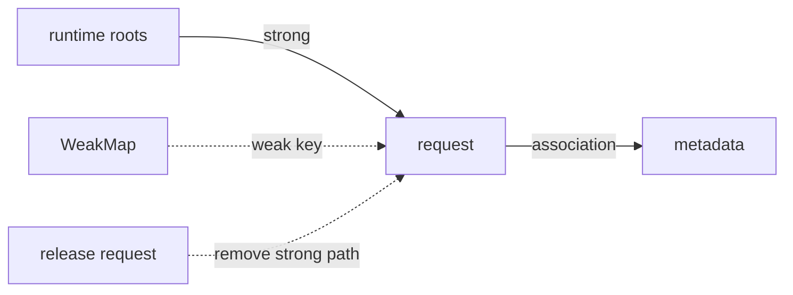

<TLDR>
  <TLDRCell label="what">
    `WeakMap` stores values by object identity, and `WeakSet` records object membership. Their weak keys or members do not, by themselves, prevent garbage collection.
  </TLDRCell>
  <TLDRCell label="trap">
    Neither collection is enumerable or has a `size`. They cannot replace `Map` and `Set` when you need to list, count, or serialize entries.
  </TLDRCell>
  <TLDRCell label="fix">
    Use a weak collection only when data should share an object's lifetime and the caller already holds that exact object. Prefer an ordinary collection otherwise.
  </TLDRCell>
</TLDR>

## What it is and why it exists

`WeakMap` and `WeakSet` are <Term id="weak-collection">weak collections</Term>. A `WeakMap` associates garbage-collectable keys with arbitrary values, while a `WeakSet` records whether garbage-collectable values are members. Their defining property is not the smaller API. It is that the collection alone does not keep a key or member alive.

An ordinary `Map` strongly references its object keys, and an ordinary `Set` strongly references its members. Those objects remain reachable as long as the collection is reachable. That ownership is often wrong for metadata attached to externally owned business objects, syntax-tree nodes, or DOM nodes.

Weak collections solve that attached-data lifetime problem. Common uses include caching a pure computation by object, storing library-internal metadata, and marking an object as processed. Querying code must already hold the original object; a weak collection cannot recover a key from an identifier, object contents, or serialized text.

In Node 24, eligible keys or members are objects and non-registered `Symbol` values. Arrays, functions, class instances, and proxies are all objects. Strings, numbers, `null`, `undefined`, and registered symbols returned by `Symbol.for()` cannot be weak keys.

These types belong in one topic rather than two. They share key eligibility, object identity, non-enumerability, and garbage-collection semantics. The only structural difference is that `WeakMap` stores an associated value while `WeakSet` stores membership.

## How it works

JavaScript's garbage collector starts at runtime roots and follows strong references. An object found through such a path has <Term id="reachability">reachability</Term>; only an object that cannot be found may be collected. The language API does not promise a specific algorithm, collection cycle, or schedule.

The edge from a weak collection to its key is not a strong reachability path by itself. In the diagram, once the application releases `request`, the `WeakMap` cannot keep the key alive through its own edge. After the key becomes unreachable, its associated metadata can be collected too.



A `WeakMap` association is commonly explained with <Term id="ephemeron">ephemeron</Term> semantics. Whether the value remains reachable depends on whether the key is reachable through a path outside the weak collection. This special rule lets a value refer back to its key without making `WeakMap → value → key` a self-justifying path that keeps the whole group alive forever.

`WeakMap` and `WeakSet` both match by <Term id="object-identity">object identity</Term>. Two objects with identical contents are still different keys. Mutating an object's properties does not change its identity, so a weak collection neither performs structural lookup nor needs to reindex a key after a property change.

Both types deliberately omit iterators, key lists, and element counts. If a program could enumerate weak keys, it could observe when garbage collection ran, and the same program might produce different results under different memory pressure or engine policies. Non-enumerability keeps that uncertainty out of ordinary control flow.

### API boundaries

| Type | Write | Query | Delete | Not provided |
| --- | --- | --- | --- | --- |
| `WeakMap` | `set(key, value)` | `get(key)`, `has(key)` | `delete(key)` | `size`, iteration, `clear()` |
| `WeakSet` | `add(value)` | `has(value)` | `delete(value)` | `size`, iteration, `clear()` |

`WeakMap.prototype.get()` returns `undefined` when a key is absent, but an entry may itself store `undefined`. Call `has()` when the distinction matters. `set()` returns its receiver, as does `add()`, so both methods support chaining.

The constructors can initialize a collection from an iterable, such as `new WeakMap([[key, value]])`. The weak collection remains non-iterable after initialization. An ineligible key or member encountered during construction throws `TypeError`; it is not skipped.

## Examples

The following three examples cover attached metadata, per-object caching, and recursive path marking. Their output comes from running each file locally with Node 24.

### Metadata and processing tags

The same order object is both a `WeakMap` key and a `WeakSet` member. A newly created object with the same contents does not match because the collections compare identity.

<Depth level="quick">

```javascript run title="metadata-and-tags.js"
const metadata = new WeakMap();
const processed = new WeakSet();

function inspect(order) {
  if (processed.has(order)) {
    return `${metadata.get(order).label}: skipped`;
  }

  const label = `order-${order.id}`;
  metadata.set(order, { label, fields: Object.keys(order).length });
  processed.add(order);
  return `${label}: ${metadata.get(order).fields} fields`;
}

const order = { id: 7, total: 42 };

console.log(inspect(order));
console.log(inspect(order));
console.log(metadata.has({ id: 7, total: 42 }));
```

```text
order-7: 2 fields
order-7: skipped
false
```

<TryToBreak items={['Pass the same object repeatedly', 'Pass a shallow copy with equal contents', 'Pass a frozen object']} />

</Depth>

The first call creates metadata and adds the processing tag. The second call hits both collections through the same object. The third query uses a new object and returns `false`. Freezing an object does not change this behavior because a weak collection does not write properties onto its key.

This pattern suits a library that attaches internal state to caller-owned objects. The caller sees no extra own property, and the library does not gain ownership merely by storing the state. The library must still control access to the `metadata` binding; `WeakMap` is not an authorization mechanism.

### Caching by configuration object

The cache uses the configuration object itself as its key. `has()` clearly distinguishes "not compiled" from any possible stored return value, and passing the same object repeatedly avoids another compilation.

```javascript run title="schema-cache.js"
const validators = new WeakMap();
let compilations = 0;

function validatorFor(schema) {
  if (validators.has(schema)) {
    return validators.get(schema);
  }

  compilations += 1;
  const required = [...schema.required];
  const validate = (input) =>
    required.every((key) => Object.hasOwn(input, key));

  validators.set(schema, validate);
  return validate;
}

const invoiceSchema = { required: ['id', 'total'] };
const sameShape = { required: ['id', 'total'] };

console.log(validatorFor(invoiceSchema)({ id: 'A', total: 0 }));
console.log(validatorFor(invoiceSchema)({ id: 'A' }));
validatorFor(invoiceSchema);
validatorFor(sameShape);
console.log(compilations);
```

```text
true
false
2
```

The second and third uses of `invoiceSchema` hit the same cache. `sameShape` looks identical but has a different identity, so it causes the second compilation. If structurally equal configurations should share results, define a stable structural key and use `Map`; do not expect `WeakMap` to perform deep comparison.

The example copies the `required` array during compilation. Otherwise, a later caller mutation could silently change the cached validator's behavior. A weak key solves cache lifetime only; it does not supply input immutability or an invalidation policy.

### Distinguishing shared references from cycles

Cycle detection must record the current recursive path, not every object seen during the entire traversal. Calling `delete()` when leaving a node prevents a shared child on another branch from being reported as a cycle.

```javascript run title="cycle-path.js"
function findCircularPath(root) {
  const ancestors = new WeakSet();

  function visit(value, path) {
    if (value === null || typeof value !== 'object') return null;
    if (ancestors.has(value)) return path;

    ancestors.add(value);
    for (const [key, child] of Object.entries(value)) {
      const found = visit(child, `${path}.${key}`);
      if (found !== null) return found;
    }
    ancestors.delete(value);
    return null;
  }

  return visit(root, 'root');
}

const address = { country: 'FR' };
const shared = { billing: address, shipping: address };
const circular = { id: 'A' };
circular.self = circular;

console.log(findCircularPath(shared));
console.log(findCircularPath(circular));
```

```text
null
root.self
```

`shared` is a directed acyclic object graph with two paths to the same address object. Only `circular.self` returns to a current ancestor. A `WeakSet` expresses membership well here, but correctness comes from pairing `add()` on entry with `delete()` on exit.

The function returns early when it finds a cycle, leaving the current path's members in `ancestors`. That does not affect another result because `ancestors` belongs to this call and then becomes unreachable as a whole. Hoisting the set to module scope for reuse would let this control flow contaminate the next check.

## Pitfalls

### Treating a weak collection as an observable cache

> [!PITFALL]
> Code for cache metrics or an administration page often reads `weakMap.size`, spreads `weakMap`, or calls `entries()`. Those members do not exist. Reading `size` produces `undefined`, while iteration throws `TypeError`.

**Fix:** Use `Map` with an explicit cleanup policy when the product must list, count, expire, or serialize every entry. Do not add a strong key list to "restore" weak-collection enumeration, because that cancels the weak keys' lifetime benefit.

### Using a non-collectable key

> [!PITFALL]
> String IDs, numbers, and registered symbols cannot be weak keys. Both `new WeakMap().set('u-1', data)` and `new WeakSet().add(Symbol.for('done'))` throw `TypeError` in Node 24.

**Fix:** Use `Map` when lookup is by stable ID. Use a weak collection only when the caller holds an object or non-registered symbol and the collection must not extend its lifetime; do not box a string temporarily just to satisfy the type rule.

### Reconstructing the key as a new object

> [!PITFALL]
> After `cache.set(user, result)`, `cache.get({ id: user.id })` does not hit. Equal contents, equal prototypes, and equal serialized forms cannot substitute for the original object's identity.

**Fix:** Define which object is the key at the interface boundary and pass that same reference along the call chain. If callers can provide only an ID or structural value, use `Map` with an explicitly normalized key and account for collisions and serialization boundaries.

### Treating WeakMap as a memory-leak repair switch

> [!PITFALL]
> A weak key removes only the collection's strong retention path to that key. An event listener, timer, closure, array, or another cache may still strongly reference the object. Changing one `Map` to `WeakMap` neither cuts those paths nor releases files or sockets.

**Fix:** Draw every strong path from runtime roots, and provide explicit unsubscribe or close operations for listeners and resources. Confirm a retention path with heap snapshots instead of inferring that the object is collectable from the collection type.

### Confusing "seen" with "current ancestor" in WeakSet

> [!PITFALL]
> A depth-first traversal that only calls `add()` reports a shared child as a cycle when it encounters that child on another branch. This is a graph-state definition error, not a consequence of weak references.

**Fix:** For cycle detection, make the set represent the current recursive path and pair `add()` with `delete()`. For deduplicated processing, keep the global "seen" set but do not report a repeated visit as a cycle.

## In the AI era

**What generated code gets wrong here**

After seeing "avoid memory leaks," models often replace `Map` with `WeakMap` mechanically while leaving `.size`, spread, dashboards, or string-ID keys in place. They also reconstruct `{ id }` at lookup and miss every time. In cycle checks, they commonly use one `WeakSet` for every previously seen node and mislabel shared references as cycles. Generated tests may expect an entry to disappear immediately after `global.gc()`, although the language neither promises collection timing nor exposes enumeration that could prove a particular weak key was removed.

**Ask your AI to check**

- List every weak-collection key or member expression and say whether it is an object or non-registered `Symbol` in Node 24.
- Draw every strong reference path from runtime roots to each key, especially listeners, closures, timers, arrays, and caches.
- Mark every requirement for enumeration, counting, serialization, or ID lookup, and decide whether it requires `Map` or `Set` instead.

**Review checklist**

- Query once with the same object and once with a new object of equal contents to confirm the intended identity contract.
- Search for `.size`, `for...of`, spread, `keys()`, `entries()`, and `JSON.stringify()` to catch code treating a weak collection as an ordinary one.
- Test recursive code with both a real cycle and a shared acyclic child, then check that `add()` and `delete()` paths are paired.

**Prompt vocabulary**

Use precise terms: `weak collection`（弱集合）, `garbage-collectable key`（可回收键）, `reachability`（可达性）, `strong reference path`（强引用路径）, `object identity`（对象标识）, `non-registered Symbol`（未注册 `Symbol`）, `ephemeron`（Ephemeron）, and `non-enumerable`（不可枚举）. Ask for a key-eligibility table and a retention-path diagram. "Make this cache weak" does not specify the lookup or lifetime contract.

<Depth level="deep">

## Reachability contracts and ephemerons

### Collection starts from root paths

<Term id="garbage-collection">Garbage collection</Term> asks whether an object can still be reached from roots, not whether one variable was assigned `null`. A closure, task queue, or host API may still hold it. Conversely, the collector can reclaim a cycle of objects when the whole group is unreachable from roots.

A weak collection does not let the program observe a weak key's death directly. After discarding the last known strong reference, code has also lost the key needed to query that entry. The engine may defer collection and may not run a collection that you can notice before the process exits.

Correctness therefore cannot depend on collection happening before the next line. Weak collections reduce unwanted retention relationships; they do not schedule mandatory cleanup. Transactions, locks, event subscriptions, and file handles still need deterministic release protocols.

### Back-references from values to keys

Reducing `WeakMap` to "weak key plus strong value" misses an important condition. An associated value remains reachable while its key is reachable through a path outside the weak collection. If the key can be found only by following the associated value back to it, that back-reference cannot prove the key alive.

That is what distinguishes an ephemeron from an ordinary pair of references. A collector may need to compute reachability repeatedly: find externally reachable keys, add their values to the reachable set, and continue until no objects are added. The specification defines observable results; engines may implement them with different internal algorithms.

If the application strongly references the associated value elsewhere and that value refers to the key, an ordinary `root → value → key` path exists. The key remains alive in that case. `WeakMap` ignores only its own edge to the key; it does not weaken references elsewhere in the object graph.

### Non-registered symbols

Modern JavaScript permits a non-registered `Symbol` as a `WeakMap` key or `WeakSet` member. Every `Symbol('token')` call produces a fresh unique value. Once the program loses that value, it cannot recreate it from the description, so the symbol has a collectable identity.

`Symbol.for('token')` returns a repeatable value from the global symbol registry. The registry makes it ineligible as a weak key, so passing it to `set()` or `add()` throws `TypeError`. Well-known symbols such as `Symbol.iterator` are not non-registered symbols either.

Older tutorials often state that weak collections "only accept objects." That was true in earlier ECMAScript editions but does not match Node 24. A check written as `typeof key === 'object' && key !== null` also rejects functions and eligible non-registered symbols incorrectly.

The table groups the inputs most often confused in Node 24. `WeakMap` keys and `WeakSet` members use the same eligibility rule.

| Input | Accepted | Reason |
| --- | --- | --- |
| `{}`, arrays, class instances | Yes | They are objects |
| Functions | Yes | A function is also an object |
| `Symbol('local')` | Yes | It is a non-registered symbol |
| `Symbol.for('shared')` | No | It belongs to the global symbol registry |
| `Symbol.iterator` | No | It is a specification-defined well-known symbol |
| Strings, numbers, Booleans | No | These primitives have no collectable identity |
| `null`, `undefined` | No | They are not collectable keys |

Application code rarely needs to reproduce the eligibility algorithm. Let `set()` or `add()` reject invalid boundary input, or validate deliberately from the interface contract. Hand-written checks often miss functions, cross-realm objects, or non-registered symbols.

### Identity, mutation, and invalidation

An object may be mutated after becoming a key. It still finds the same entry because a weak collection does not read properties to compute a structural key. A proxy and its target are also different identities; writing with the target and reading with the proxy does not match, or vice versa.

That stability makes object keys useful for attached metadata, but it does not keep cached results fresh automatically. If a result depends on mutable key properties, changing those properties still hits the old result. Options include freezing input, copying the required fields, calling `delete()` at the mutation boundary, or moving to an ordinary versioned key.

A cache must also account for exceptions and reentrancy. If computation throws before `set()`, the next call will usually retry. If computation synchronously reenters for the same key, it can duplicate work or recurse forever. Weak collections have no built-in "in progress" state, so model one explicitly when needed.

### Non-enumerability is a semantic boundary

The lack of `size` and iteration APIs is not an omitted convenience. An enumerable weak collection would let collection policy affect program output: a different memory-pressure level could produce a different key list. Enumeration might also strengthen keys temporarily, changing the lifetime it attempted to observe.

Developer tools sometimes display weak-collection contents for debugging, but that display is not a JavaScript API. A console may also hold temporary references while an object is expanded. A debugger snapshot does not prove that production code can enumerate entries or predict collection time.

To observe cache behavior, record request, hit, and computation counts without recording every key. If you must manage each cache entry, use `Map` and constrain its lifetime with a capacity limit, explicit invalidation, or timed cleanup.

### Testing the observable contract

Most weak-collection tests do not need to trigger garbage collection. Directly test that the same object matches, a different object does not, `delete()` returns the expected Boolean, and invalid keys throw `TypeError`. Those are deterministic public behaviors.

| Contract | Stable test |
| --- | --- |
| Query by object identity | Call `has()` with the original object and a new equal-looking object |
| Store `undefined` | Assert both `has(key)` and `get(key)` |
| Explicit deletion | Assert the first `delete(key)` is `true` and the second is `false` |
| Reject a string key | Assert that `set('id', value)` throws `TypeError` |
| No enumeration | Review the requirement instead of asserting an entry count after GC |

Node launched with `--expose-gc` can make `global.gc()` available to diagnostic scripts, but calling it still does not provide a language guarantee of immediate, per-object collection. Such tests are sensitive to optimization, debuggers, and local-variable liveness. They should not become ordinary unit-test correctness conditions.

When investigating real retention, use heap snapshots and allocation analysis from the target runtime. Find the strong path from a root to the object first, then decide which edge has the wrong owner. A falling memory graph is process evidence, not a substitute for an interface-level assertion.

### Distinguishing WeakRef and finalizers

`WeakMap` and `WeakSet` never hand their keys back to you. A query supplies a key already in hand, which is why these collections fit association and membership tests. `WeakRef` can attempt to retrieve a target, and `FinalizationRegistry` can register cleanup callbacks, but both expose more timing uncertainty.

Do not add a `WeakRef` or finalizer merely to observe when a weak-collection entry disappears. That turns a simple attached-data design into a protocol coupled to garbage-collector scheduling. Cache correctness, resource release, and business notifications should use explicit state and lifecycle events.

Finalizers have a few fallback uses, but they cannot replace `finally`, `dispose`, unsubscribe operations, or transaction completion. Weak collections are more restrained: they change retention without promising to execute user code.

### Private state and access boundaries

A module-local `WeakMap` can hold state for instances without exposing that state through reflection on the instances. If outside code cannot obtain the `WeakMap` binding, it can access the data only through the module's public methods. This is encapsulation through lexical scope.

That pattern is not the same as a language-level private field. Module code sharing the same `WeakMap` can read the state of any known instance, and a wrong receiver usually makes `get()` return `undefined`. A `#field` performs a private-brand check and throws `TypeError` for a wrong receiver.

Choose the representation from the interface. `WeakMap` is natural when data belongs to arbitrary objects created elsewhere. A private field is usually clearer when state belongs to one class and syntax should enforce access. Neither representation prevents a public method from returning a secret.

### Two meanings of traversal state

`WeakSet` works well for object-graph membership, but "member" must be defined first. Deduplicating a traversal records every object already processed, while cycle detection records only current recursive ancestors. The algorithms may use the same API but cannot share the same deletion rule.

Deduplication usually calls only `add()` and skips a later visit. Cycle detection calls `delete()` when it leaves a node, so only an edge back to an object still on the stack is a cycle. Naming both states `visited` makes this semantic difference easy to miss in review.

Cleanup during exceptions matters too. If the set belongs to one call, an exceptional exit can discard it as a whole. If code reuses the set, pair deletion with `try...finally` or create a new set at every top-level call. Weak references do not repair dirty algorithm state.

### Collection selection table

| Requirement | Choose | Reason |
| --- | --- | --- |
| Look up by string or numeric ID | `Map` | Primitives cannot be weak keys, and the ID is the stable lookup key |
| Enumerate, count, or serialize entries | `Map` / `Set` | Ordinary collections expose complete contents |
| Attach metadata to an external object | `WeakMap` | Metadata should not keep the object alive |
| Mark whether an external object was processed | `WeakSet` | Only membership lookup is needed, not an object list |
| Reuse results by structural equality | `Map` with a canonical key | Weak collections compare only identity |

Start the choice with an ownership sentence. "The key must exist as long as the cache exists" points to an ordinary collection. "The attached data matters only as long as the key exists" points to a weak collection. This is more reliable than starting from a collection name or a vague memory-optimization goal.

Do not describe a weak collection as a performance optimization. This topic provides no lookup-time or memory-usage measurements and assumes no particular engine data structure. It offers a different reachability contract; measure concrete performance in the target engine with realistic object counts and lifetimes.

### Reviewing ownership changes

The weak collection itself also has a lifetime. If its containing module, instance, or request context becomes unreachable, the collection and its associations can be reclaimed together without calling `delete()` for each item. Use `delete()` when business state must be invalidated now, not as a substitute for the collector.

While a key remains reachable elsewhere, its `WeakMap` value remains retained. Putting a large object in the value does not make that object weak; a long-lived key keeps the large value alive too. A cache review must check the intended lifetimes of both key and value.

Revisit the collection choice after refactoring an ownership boundary. A short-lived object managed elsewhere may become an application singleton, or metadata that never needed enumeration may gain an administration screen. The type may still compile while its lifetime contract has changed.

</Depth>

<Checkpoint id="javascript/weakmap-weakset" />

## Further reading

- [MDN: `WeakMap`](https://developer.mozilla.org/en-US/docs/Web/JavaScript/Reference/Global_Objects/WeakMap)
- [MDN: `WeakSet`](https://developer.mozilla.org/en-US/docs/Web/JavaScript/Reference/Global_Objects/WeakSet)
- [MDN: Keyed collections](https://developer.mozilla.org/en-US/docs/Web/JavaScript/Guide/Keyed_collections)
- [MDN: Memory management](https://developer.mozilla.org/en-US/docs/Web/JavaScript/Guide/Memory_management)
- [ECMAScript specification: `WeakMap` objects](https://tc39.es/ecma262/multipage/keyed-collections.html#sec-weakmap-objects)
- [ECMAScript specification: `WeakSet` objects](https://tc39.es/ecma262/multipage/keyed-collections.html#sec-weakset-objects)
