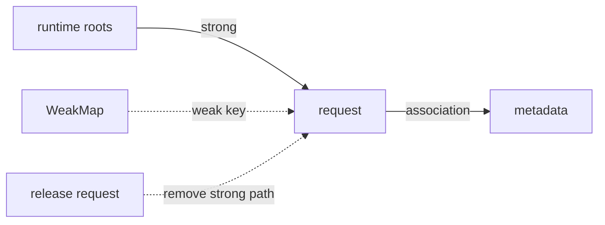

<TLDR>
  <TLDRCell label="what">
    `WeakMap`按对象标识保存值，`WeakSet`记录对象成员关系；集合中的弱键或弱成员不会单独阻止垃圾回收。
  </TLDRCell>
  <TLDRCell label="trap">
    两者都不可枚举，也没有`size`。它们不能替代需要列出、计数或序列化条目的`Map`与`Set`。
  </TLDRCell>
  <TLDRCell label="fix">
    只有当数据生命周期应跟随对象，而且查询方已经持有同一个对象时才用弱集合；其余情况优先使用普通集合。
  </TLDRCell>
</TLDR>

## 是什么，为什么存在

`WeakMap`和`WeakSet`是<Term id="weak-collection">弱集合（weak collection）</Term>。`WeakMap`把可回收的键关联到任意值，`WeakSet`只记录可回收值是否属于集合。它们最重要的性质不是API更少，而是集合本身不会让键或成员继续存活。

普通`Map`会强引用它的对象键，普通`Set`也会强引用成员。只要集合仍然可达，这些对象就仍然可达。若集合只是给外部对象附加元数据，这种所有权往往不合适：元数据不应反过来延长业务对象、语法树节点或DOM节点的生命周期。

弱集合解决的是这种附属数据的生命周期问题。常见用途包括按对象缓存纯计算结果、保存库内部元数据，以及标记某个对象是否已经处理。查询代码必须已经持有原来的对象；弱集合不会提供从标识符、对象内容或序列化文本找回键的能力。

在Node 24中，符合条件的键或成员是对象和未注册的`Symbol`。数组、函数、类实例与代理都属于对象。字符串、数字、`null`、`undefined`以及`Symbol.for()`返回的注册符号不能作为弱键。

这两个类型属于同一个概念，不需要拆成两篇。它们共享键资格、对象标识、不可枚举性和垃圾回收语义，区别只在于`WeakMap`保存关联值，而`WeakSet`保存成员状态。

## 工作原理

JavaScript的垃圾回收器从运行时根开始沿强引用查找对象。能通过这条路径找到的对象具有<Term id="reachability">可达性（reachability）</Term>，不能找到的对象才可能被回收。具体算法、回收轮次和发生时间不是语言API的承诺。

弱集合到键的边不会单独构成强可达路径。下图中，应用释放`request`后，`WeakMap`不能凭自己的边保住键。键不可达后，它对应的元数据也可以一起回收。



`WeakMap`的关联关系通常用<Term id="ephemeron">Ephemeron</Term>语义解释。值是否保持可达取决于键是否通过弱集合之外的路径可达。这个特殊规则允许值引用自己的键，而不让`WeakMap → value → key`形成一条使整组对象永远存活的自证路径。

`WeakMap`和`WeakSet`都按<Term id="object-identity">对象标识（object identity）</Term>匹配。两个内容相同的对象仍是两个键。对象属性后来发生变化也不会改变键的标识，因此弱集合不按结构查找，也不需要根据属性变化重新索引。

两者故意不公开迭代器、键列表或元素数量。如果程序能枚举弱键，就能观察垃圾回收何时发生，而同一段程序可能因内存压力和引擎策略得到不同结果。不可枚举性把这种不确定性挡在正常控制流之外。

### API边界

| 类型 | 写入 | 查询 | 删除 | 不提供 |
| --- | --- | --- | --- | --- |
| `WeakMap` | `set(key, value)` | `get(key)`、`has(key)` | `delete(key)` | `size`、迭代、`clear()` |
| `WeakSet` | `add(value)` | `has(value)` | `delete(value)` | `size`、迭代、`clear()` |

`WeakMap.prototype.get()`在键不存在时返回`undefined`，但条目本身也可以存储`undefined`。需要区分这两种状态时先调用`has()`。`set()`返回接收者，`add()`也返回接收者，因此两者都可以链式调用。

构造函数可以从可迭代输入初始化集合，例如`new WeakMap([[key, value]])`。初始化完成后的弱集合本身仍不可迭代。构造时遇到不合格的键或成员会抛出`TypeError`，不会跳过该项。

## 示例

下面三个示例分别展示附属元数据、按对象缓存和递归路径标记。输出由本地Node 24执行对应文件得到。

### 元数据与处理标记

同一个订单对象同时充当`WeakMap`的键和`WeakSet`的成员。新建一个内容相同的对象不会命中，因为集合比较的是标识。

<Depth level="quick">

```javascript run title="metadata-and-tags.js"
const metadata = new WeakMap();
const processed = new WeakSet();

function inspect(order) {
  if (processed.has(order)) {
    return `${metadata.get(order).label}: skipped`;
  }

  const label = `order-${order.id}`;
  metadata.set(order, { label, fields: Object.keys(order).length });
  processed.add(order);
  return `${label}: ${metadata.get(order).fields} fields`;
}

const order = { id: 7, total: 42 };

console.log(inspect(order));
console.log(inspect(order));
console.log(metadata.has({ id: 7, total: 42 }));
```

```text
order-7: 2 fields
order-7: skipped
false
```

<TryToBreak items={['连续传入同一个对象', '传入内容相同的浅拷贝', '传入被冻结的对象']} />

</Depth>

第一次调用创建元数据并添加处理标记，第二次调用通过同一对象命中。第三次查询使用新对象，所以返回`false`。冻结对象不会改变这种行为，因为弱集合不向键对象写属性。

这个模式适合库给调用方对象添加内部状态。调用方看不到额外的自有属性，库也不会仅因保存这份状态就取得对象所有权。不过，库仍需控制谁能访问`metadata`变量；`WeakMap`不是授权机制。

### 按配置对象缓存

缓存以配置对象本身为键。`has()`明确区分“尚未编译”和可能存储的任意返回值，重复传入同一对象时不会再次编译。

```javascript run title="schema-cache.js"
const validators = new WeakMap();
let compilations = 0;

function validatorFor(schema) {
  if (validators.has(schema)) {
    return validators.get(schema);
  }

  compilations += 1;
  const required = [...schema.required];
  const validate = (input) =>
    required.every((key) => Object.hasOwn(input, key));

  validators.set(schema, validate);
  return validate;
}

const invoiceSchema = { required: ['id', 'total'] };
const sameShape = { required: ['id', 'total'] };

console.log(validatorFor(invoiceSchema)({ id: 'A', total: 0 }));
console.log(validatorFor(invoiceSchema)({ id: 'A' }));
validatorFor(invoiceSchema);
validatorFor(sameShape);
console.log(compilations);
```

```text
true
false
2
```

`invoiceSchema`的第二次和第三次使用命中同一缓存。`sameShape`看起来相同，却有不同标识，所以触发第二次编译。若需求是让结构相同的配置共享结果，应定义稳定的结构键并使用`Map`，不能期待`WeakMap`做深比较。

示例在编译时复制了`required`数组。否则，调用方稍后修改原数组，已经缓存的验证器可能悄悄改变行为。弱键只解决缓存生命周期，不会提供输入不可变性或缓存失效策略。

### 区分共享引用与循环

循环检测需要记录当前递归路径，而不是记录整次遍历中见过的所有对象。离开一个节点时调用`delete()`，这样同一子对象出现在两个分支中不会被误报为环。

```javascript run title="cycle-path.js"
function findCircularPath(root) {
  const ancestors = new WeakSet();

  function visit(value, path) {
    if (value === null || typeof value !== 'object') return null;
    if (ancestors.has(value)) return path;

    ancestors.add(value);
    for (const [key, child] of Object.entries(value)) {
      const found = visit(child, `${path}.${key}`);
      if (found !== null) return found;
    }
    ancestors.delete(value);
    return null;
  }

  return visit(root, 'root');
}

const address = { country: 'FR' };
const shared = { billing: address, shipping: address };
const circular = { id: 'A' };
circular.self = circular;

console.log(findCircularPath(shared));
console.log(findCircularPath(circular));
```

```text
null
root.self
```

`shared`是有向无环对象图，只是两条路径指向同一个地址对象。`circular.self`才回到当前祖先。这里使用`WeakSet`表达成员关系很合适，但算法正确性来自入栈时`add()`、出栈时`delete()`的成对操作。

发现循环后函数提前返回，没有删除当时路径中的成员。这不会影响结果，因为`ancestors`只属于本次函数调用，随后会整体变得不可达。若把集合提升到模块级复用，这个控制流就会污染下一次检测。

## 陷阱

### 把弱集合当成可观察缓存

> [!PITFALL]
> 生成缓存统计或管理页面时，代码常会读取`weakMap.size`、展开`weakMap`，或调用`entries()`。这些成员不存在；`size`读取结果是`undefined`，迭代则会抛出`TypeError`。

**修复方法：** 若产品功能需要列出、计数、过期或序列化所有条目，就使用`Map`并明确清理策略。不要额外维护一个强引用键列表来“补上”弱集合的枚举能力，因为那会抵消弱键的生命周期优势。

### 使用不可回收的键

> [!PITFALL]
> 字符串ID、数字和注册符号都不能作为弱键。`new WeakMap().set('u-1', data)`与`new WeakSet().add(Symbol.for('done'))`都会在Node 24中抛出`TypeError`。

**修复方法：** 需要按稳定ID查询时使用`Map`。只有查询方持有对象或未注册符号，而且集合不应延长其生命周期时才使用弱集合；不要为了满足类型要求临时装箱字符串。

### 用新对象重新构造键

> [!PITFALL]
> `cache.set(user, result)`之后，`cache.get({ id: user.id })`不会命中。内容相同、原型相同甚至序列化结果相同都不能替代原对象的标识。

**修复方法：** 在接口上明确键是哪个对象，并沿调用链传递同一引用。若调用方只能提供ID或结构值，选择`Map`和显式规范化的键，同时处理碰撞与序列化边界。

### 把WeakMap当作内存泄漏修复器

> [!PITFALL]
> 弱键只移除集合到键的强保留路径。事件监听器、定时器、闭包、数组或另一个缓存仍可能强引用同一对象；只把某个`Map`改成`WeakMap`不会切断这些路径，也不会释放文件或套接字。

**修复方法：** 从运行时根画出所有强引用路径，并为监听器和资源提供明确的注销或关闭操作。用堆快照确认保留路径，而不是从集合类型推断对象已经可以回收。

### 让WeakSet混淆“见过”与“当前祖先”

> [!PITFALL]
> 深度遍历若只`add()`而不在返回时`delete()`，第二次遇到共享子对象就会被误判为循环。这是图算法状态定义错误，不是弱引用语义造成的。

**修复方法：** 检测循环时让集合表示当前递归路径，并用成对的`add()`与`delete()`维护它。若任务只是避免重复处理，则保留全局“见过”集合，但不要把重复访问报告成环。

<Depth level="deep">

## 可达性契约与Ephemeron

### 回收从根路径开始

<Term id="garbage-collection">垃圾回收（garbage collection）</Term>关心对象是否还能从根到达，而不是某个变量是否被赋成`null`。一个对象可能仍被闭包、任务队列或宿主API引用。反过来，即使对象组成引用环，只要整组对象不再从根可达，垃圾回收器仍可以回收它们。

弱集合不会让程序直接观察弱键的生死。丢弃最后一个已知强引用后，代码也失去了查询该条目的键。引擎可以延后回收，甚至在进程结束前都不执行一次能被你间接注意到的回收。

因此，正确性不能依赖“下一行代码之前已经回收”。弱集合适合减少不必要的保留关系，不适合安排必须发生的清理。事务、锁、事件订阅和文件句柄仍需要确定性的释放协议。

### 值到键的回边

把`WeakMap`简化成“弱键加上强值”容易漏掉一个关键条件。只要键通过弱集合之外的路径可达，关联值就应保持可达；若键只能通过该关联值反向到达，弱集合不能让这条回边证明键存活。

这正是Ephemeron与普通弱引用对的差别。垃圾回收器需要反复计算可达集合：先找出外部可达的键，再把这些键对应的值加入可达集合，直到没有新对象加入。规范定义可观察结果，引擎可以采用不同内部算法实现它。

若应用在别处强引用关联值，而这个值又引用键，那么存在`root → value → key`的普通强路径。此时键当然仍存活。`WeakMap`只忽略自己到键的边，不会削弱对象图中的其他引用。

### 未注册Symbol

现代JavaScript允许未注册`Symbol`作为`WeakMap`键和`WeakSet`成员。`Symbol('token')`每次产生新的唯一值，程序失去该值后无法凭描述重新取得它，因此它具有可回收的身份。

`Symbol.for('token')`从全局符号注册表返回可重复取得的值。注册表让它不满足弱键要求，所以传给`set()`或`add()`会抛出`TypeError`。内置的`Symbol.iterator`等知名符号同样不是未注册符号。

旧教程常断言弱集合“只能放对象”。这在早期ECMAScript版本中成立，但不符合Node 24的行为。类型检查若写成`typeof key === 'object' && key !== null`，还会错误拒绝函数和合格的未注册符号。

下表把Node 24中容易混淆的输入放在一起。`WeakMap`键和`WeakSet`成员遵循同一资格规则。

| 输入 | 可用 | 原因 |
| --- | --- | --- |
| `{}`、数组、类实例 | 是 | 都是对象 |
| 函数 | 是 | 函数也是对象 |
| `Symbol('local')` | 是 | 它是未注册符号 |
| `Symbol.for('shared')` | 否 | 它存在于全局符号注册表 |
| `Symbol.iterator` | 否 | 它是规范定义的知名符号 |
| 字符串、数字、布尔值 | 否 | 这些原始值没有可回收身份 |
| `null`、`undefined` | 否 | 它们不是可回收键 |

资格检查通常不应由业务代码重新实现。让`set()`或`add()`在边界拒绝无效输入，或者根据接口契约先做明确校验。自制判断很容易漏掉函数、跨realm对象或未注册符号。

### 身份、修改与缓存失效

对象作为键后可以继续修改。它仍然命中原条目，因为弱集合不读取属性来计算结构键。代理对象与其目标也是两个标识；用目标写入、用代理读取不会命中，反过来也一样。

这项稳定性让对象键很适合附属元数据，却不会自动让缓存结果保持新鲜。若结果依赖对象的可变属性，调用方修改属性后，旧结果仍会命中。可以冻结输入、复制所需字段、在修改边界调用`delete()`，或改用带版本的普通键。

缓存还要处理异常与重入。若计算在`set()`前抛错，下一次调用通常应重试；若计算会同步重入同一个键，代码可能重复工作或无限递归。弱集合没有内建的“计算中”状态，必要时要显式建模。

### 不可枚举性是语义边界

缺少`size`和迭代API不是功能遗漏。一个可枚举弱集合会让垃圾回收策略进入程序输出：内存压力不同，键列表就可能不同。它还可能在枚举期间临时强化键，从而改变本来想观察的生命周期。

开发者工具有时会为了调试显示弱集合内容，但这种显示不是程序可以依赖的JavaScript API。控制台也可能在展开对象时持有临时引用。调试界面的快照不能证明生产代码能枚举条目或预测回收时间。

若确实需要观测缓存命中率，可以记录请求次数、命中次数和计算次数，而不记录所有键。若必须逐条管理缓存，就使用`Map`，再通过容量上限、显式失效或定时清理约束生命周期。

### 测试可观察契约

大多数弱集合测试不需要触发垃圾回收。可以直接验证同一对象命中、不同对象不命中、`delete()`的返回值，以及非法键抛出`TypeError`。这些都是语言公开的确定行为。

| 契约 | 稳定测试 |
| --- | --- |
| 按对象标识查询 | 用原对象与内容相同的新对象分别调用`has()` |
| 可存储`undefined` | 同时断言`has(key)`与`get(key)` |
| 显式删除 | 断言第一次`delete(key)`为`true`，第二次为`false` |
| 拒绝字符串键 | 断言`set('id', value)`抛出`TypeError` |
| 不支持枚举 | 检查需求设计，不靠垃圾回收时机断言条目数 |

带`--expose-gc`的Node可以把`global.gc()`暴露给诊断脚本，但调用它也不构成逐对象、立即回收的语言保证。此类测试容易受优化、调试器和局部变量存活范围影响，不应成为普通单元测试的正确性依据。

需要调查真实保留问题时，使用目标运行时的堆快照和分配分析工具。先找到从根到对象的强路径，再判断其中哪条边的所有者有误。内存曲线下降只能提供过程证据，不能替代接口级断言。

### 与WeakRef和终结器的区别

`WeakMap`与`WeakSet`不会把键交还给你。查询必须提供已有键，所以它们适合关联与成员检查。`WeakRef`可以尝试取得目标，`FinalizationRegistry`可以登记清理回调，但两者有更明显的时序不确定性。

不要为了观察弱集合条目何时消失，就额外建立`WeakRef`或终结器。那会把原本简单的附属数据设计变成依赖垃圾回收调度的协议。缓存正确性、资源释放和业务通知都应使用显式状态与生命周期事件。

终结器适合少数兜底场景，不能替代`finally`、`dispose`、取消订阅或事务结束。弱集合本身更克制：它只改变保留关系，不承诺执行用户回调。

### 私有状态与访问边界

模块内的`WeakMap`可以保存实例对应的状态，外部代码无法通过反射实例属性找到这份状态。只要外部拿不到该`WeakMap`变量，就只能通过模块公开的方法访问数据。这是词法作用域形成的封装。

这种模式不等于语言级私有字段。共享同一`WeakMap`的模块代码可以读取任意已知实例的状态，错误接收者通常只会让`get()`返回`undefined`。`#field`则执行私有标记检查，错误接收者会抛出`TypeError`。

新代码应从接口需求选择表示。需要与外部创建的任意对象关联数据时，`WeakMap`很自然；状态属于一个类且应由语法强制访问时，私有字段通常更清楚。两种方式都不能自动隐藏公开方法返回的秘密。

### 遍历状态的两种含义

`WeakSet`很适合在对象图算法中记录成员，但“成员”必须先定义清楚。去重遍历需要记录所有已经处理的对象，循环检测则需要记录当前递归祖先。两种算法可能使用相同API，却不能共享同一套删除规则。

去重时通常只`add()`，后续再次看到对象就跳过。循环检测在离开节点时`delete()`，只有回到仍在栈上的对象才算环。把这两个状态都命名为`visited`，很容易让代码审查漏掉语义差别。

递归抛错时也要考虑清理。集合只属于本次调用，异常退出后整体丢弃即可；集合要被复用时，应使用`try...finally`配对删除，或者在每次顶层调用开始时创建新集合。弱引用不会修复脏状态。

### 集合选择表

| 需求 | 选择 | 原因 |
| --- | --- | --- |
| 按字符串或数字ID查询 | `Map` | 原始值不能作为弱键，且ID本身是稳定查找键 |
| 枚举、计数或序列化条目 | `Map` / `Set` | 普通集合公开完整内容 |
| 给外部对象附加元数据 | `WeakMap` | 元数据不应让对象继续存活 |
| 标记外部对象是否处理过 | `WeakSet` | 只需要成员查询，不需要列出对象 |
| 按结构相等复用结果 | `Map`加规范键 | 弱集合只比较标识 |

选择时先写出所有权句子：“只要缓存存在，键就必须存在”对应普通集合；“只要键存在，附属数据才有意义”对应弱集合。这比从集合名字或模糊的内存优化目标出发更可靠。

不要把弱集合称为性能优化。本文没有给出查找耗时或内存占用数字，也不假定某个引擎的数据结构。它提供的是不同的可达性契约；具体性能需要在目标引擎、实际对象数量和真实生命周期下测量。

### 审查所有权变化

弱集合本身也有生命周期。若包含它的模块、实例或请求上下文变得不可达，集合及其内部关联可以一起回收，不需要逐项调用`delete()`。`delete()`用于业务状态需要立即失效，而不是用于替代垃圾回收器。

键仍从外部可达时，`WeakMap`会保留对应值。把大对象放进值中不会让它天然变弱；只要长期存在的键仍存活，大值也仍存活。审查缓存时必须同时核对键和值的预期寿命。

重构所有权边界后应重新评估集合选择。原本由外部管理的短命对象可能变成应用级单例，原本无需枚举的元数据也可能新增管理界面。类型没有错，生命周期契约却可能已经变化。

</Depth>

<Checkpoint id="javascript/weakmap-weakset" />

## 延伸阅读

- [MDN：`WeakMap`](https://developer.mozilla.org/en-US/docs/Web/JavaScript/Reference/Global_Objects/WeakMap)
- [MDN：`WeakSet`](https://developer.mozilla.org/en-US/docs/Web/JavaScript/Reference/Global_Objects/WeakSet)
- [MDN：键控集合](https://developer.mozilla.org/en-US/docs/Web/JavaScript/Guide/Keyed_collections)
- [MDN：内存管理](https://developer.mozilla.org/en-US/docs/Web/JavaScript/Guide/Memory_management)
- [ECMAScript规范：`WeakMap`对象](https://tc39.es/ecma262/multipage/keyed-collections.html#sec-weakmap-objects)
- [ECMAScript规范：`WeakSet`对象](https://tc39.es/ecma262/multipage/keyed-collections.html#sec-weakset-objects)
