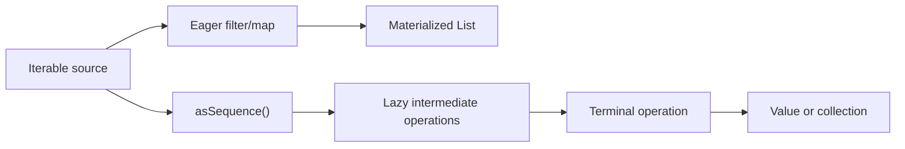

<TLDR>
  <TLDRCell label="what">
    Kotlin uses `List` for ordered, repeatable data, `Set` for unique elements, and `Map` for unique key-to-value associations; `Sequence` runs an operation chain on demand.
  </TLDRCell>
  <TLDRCell label="trap">
    `List`, `Set`, and `Map` are read-only interfaces, not guarantees that the underlying object is immutable; `associateBy()` also keeps the last value for a duplicate key.
  </TLDRCell>
  <TLDRCell label="fix">
    Choose a collection from the data invariants, decide between a shared view and a snapshot at ownership boundaries, and test key collisions, empty results, and sequence termination.
  </TLDRCell>
</TLDR>

## What it is and why it exists

A Kotlin collection type records a group of values and their relationships. `List<T>` preserves position and duplicates, `Set<T>` guarantees unique elements, and `Map<K, V>` guarantees unique keys that each associate with one value. The choice declares which of order, repetition, and keyed lookup belong to the business contract.

The collection API separates storage shape from processing. The same `filter()`, `map()`, `flatMap()`, `fold()`, and search operations work across many <Term id="iterable">iterables</Term>, so callers do not rewrite a loop for every implementation. You meet these types while parsing input, building indexes, aggregating orders, deduplicating identifiers, and passing data to Java APIs.

Kotlin also separates <Term id="read-only-collection">read-only collection</Term> interfaces from mutable collection interfaces. A read-only interface exposes no write operations, but it may be only a restricted view of the same mutable object; it is neither a persistent collection nor a deeply immutable value. This boundary limits which methods a piece of code can call, but it cannot revoke mutation rights held through other aliases.

A <Term id="sequence">sequence</Term> is not another persistent storage container. It describes how to produce values one at a time and postpones intermediate operations until a result is requested. Short-circuiting terminal operations consume only the needed elements, at the cost of making evaluation time, resource lifetime, and repeatability more important review concerns.

## How it works

### Three collection shapes

`List<T>` is ordered, uses zero-based indices, and may contain equal elements more than once. It suits queue snapshots, search results, and any data where position has meaning. Use `MutableList<T>` when elements or length must change, but a public function that only reads data can usually accept `List<T>` to narrow its permissions.

`Set<T>` decides whether an element is a duplicate through equality. It suits membership tests, processed IDs, and tag collections, but the `Set` interface itself promises no universal iteration order. Default factories often return an insertion-ordered implementation; do not rewrite that implementation detail as a contract for every `Set`. When order matters, use an explicitly ordered type or sort the result.

`Map<K, V>` stores key-value entries but does not inherit from `Collection`. `map[key]` returns `null` when a key is absent; if the value type already allows `null`, use `containsKey()` to distinguish a present null value from an absent key. The `keys`, `values`, and `entries` properties provide three collection views.

### Read-only interfaces, mutable interfaces, and ownership

`listOf()`, `setOf()`, and `mapOf()` return read-only interfaces; `mutableListOf()`, `mutableSetOf()`, and `mutableMapOf()` return interfaces with write operations. `val` prevents reference reassignment only, so `val names = mutableListOf("Ada")` still permits `names.add("Lin")`. Whether a name can be rebound, an interface can write, and an object can change are three separate questions.

Assigning a `MutableList<T>` to a `List<T>` does not copy the object. Both references still point to the same underlying list, and code holding a mutable reference can make the read-only view observe a change. Call `toList()` at an ownership boundary when you need a stable snapshot. If the elements themselves are mutable, this is still a shallow copy and later changes inside an element remain visible.

Collection operations come in two easily confused families. `sorted()`, `filter()`, and `map()` return result collections without changing the receiver; `sort()`, `removeAll()`, and assignment operations modify the original object and exist only on the matching mutable interfaces. During review, check both whether a returned value is used and whether another caller still shares the source collection.

### Eager operation chains

Calling `filter()` or `map()` on an `Iterable` traverses the input immediately and returns a new result. A multistep <Term id="collection-pipeline">collection pipeline</Term> usually materializes an intermediate collection between steps. The completed result can be traversed independently, and a failure in each step occurs when that step is called.

The same data can take an eager collection path or pass through `asSequence()` into a lazy path. The dividing line is not the spelling of the lambda; it is whether each operation receives and returns an `Iterable` or a `Sequence`.



Operation names express changes in data shape. `map()` produces one output for each input, `mapNotNull()` also drops transformed `null` values, and `flatMap()` flattens the iterable produced for every input by one level. `filter()` retains original elements that satisfy a predicate, while `partition()` returns the matching and nonmatching elements as two lists in one pass.

Aggregation operations fold many values into a smaller result. `fold(initial)` can return its initial value for an empty collection and permits an accumulator type different from the element type; `reduce()` starts with the first element, so its non-nullable version fails on an empty collection. When you need only one match, `firstOrNull()` expresses short-circuiting and an absent result more directly than `filter(...).first()`.

### Choose operations by result shape

Similar names can return completely different shapes. Writing the intended result type first and then choosing an operation is usually more reliable than guessing from a long list of extension functions.

| Intent | Operation | Result shape |
| --- | --- | --- |
| One-to-one transformation | `map()` | `List<R>` |
| Transform and discard nulls | `mapNotNull()` | `List<R>` |
| Split by a condition | `partition()` | `Pair<List<T>, List<T>>` |
| Index by a unique key | `associateBy()` | `Map<K, T>` |
| Retain every element for each key | `groupBy()` | `Map<K, List<T>>` |
| Accumulate from an initial value | `fold()` | Accumulator type `R` |

Some operations compress several states into one result. `firstOrNull()` uses `null` for both an empty collection and no match, while `singleOrNull()` also uses it when more than one element matches. If the business must distinguish those states, count, group, or return an explicit domain result instead.

### Keys, grouping, and conflict policy

`associate()`, `associateBy()`, and `associateWith()` build a `Map`. When several inputs produce the same key, later values overwrite earlier ones, so these functions are both transformations and implicit conflict policies. If keys should be unique but you cannot prove it, group first and inspect group sizes, or reject duplicates explicitly while building a mutable map.

`groupBy()` creates a `Map<K, List<T>>`, which fits code that needs every element in each group afterward. When only a count or accumulation is needed, `groupingBy()` returns a `Grouping`, then `eachCount()`, `fold()`, or `aggregate()` performs a grouped terminal operation. The shared word `group` does not make their different result shapes interchangeable.

Map iteration order depends on the concrete implementation. The default implementation of `mutableMapOf()` preserves insertion order, but `HashMap` supplies no such ordering contract. If a test depends on serialization order, sort entries at the output boundary or choose an explicitly order-preserving implementation instead of relying on the current printed result.

### Sequence evaluation boundaries

`asSequence()` creates a sequence view over an existing `Iterable`, `sequenceOf()` supplies finite values directly, and `generateSequence()` can calculate the next item from the previous one. On a sequence, `map()`, `filter()`, and `take()` return new sequences without pulling elements immediately. These steps are intermediate operations.

A <Term id="terminal-operation">terminal operation</Term> returns a non-sequence result and starts evaluation; examples include `toList()`, `first()`, `count()`, and `sum()`. Each input moves through the pipeline in turn, rather than every element completing the first step before moving to the second. `first()` and `take()` can stop early, while an operation such as `sorted()` must consume its whole upstream first.

A sequence is not an automatic optimization switch. Lazy wrappers have their own execution cost, and small inputs or one-step transformations may not benefit. Choose a sequence primarily for its evaluation semantics: whether you need short-circuiting, want to avoid intermediate results, may have infinite input, and can keep the data source alive through the terminal operation.

## Examples

### Choose `List`, `Set`, and `Map` from invariants

The ticket queue must retain position, so it uses a `List`. The owner collection needs only unique names, while the ID index needs to look up a ticket through a unique key.

<Depth level="quick">

```kotlin title="collection_shapes.kt"
data class Ticket(val id: String, val owner: String)

fun main() {
    val queue: List<Ticket> = listOf(
        Ticket("T-1", "Mina"),
        Ticket("T-2", "Bo"),
        Ticket("T-3", "Mina"),
    )

    val owners: Set<String> = queue.mapTo(linkedSetOf()) { it.owner }
    val byId: Map<String, Ticket> = queue.associateBy { it.id }

    println(queue.map { it.id })
    println(owners)
    println(byId["T-2"]?.owner)
    println(byId["missing"]?.owner ?: "not found")
}
```

```text
[T-1, T-2, T-3]
[Mina, Bo]
Bo
not found
```

</Depth>

`mapTo(linkedSetOf())` transforms owner names, removes duplicates, and preserves insertion order together. `associateBy()` is valid here because the sample's `id` values are unique; a production boundary must still validate that invariant. The missing key gets explicit text through the Elvis operator instead of treating `null` as an owner name.

### Separate a shared view from a snapshot

The `readOnlyView` below has no write methods but still shares an object with `mutableNames`. `snapshot` copied the elements present before mutation, so `Maya` does not appear in it afterward.

```kotlin title="views_and_copies.kt"
fun main() {
    val mutableNames = mutableListOf("Ada", "Lin")
    val readOnlyView: List<String> = mutableNames
    val snapshot: List<String> = mutableNames.toList()

    mutableNames += "Maya"

    println("view=$readOnlyView")
    println("snapshot=$snapshot")

    val sortedCopy = mutableNames.sorted()
    mutableNames.sortDescending()

    println("sorted copy=$sortedCopy")
    println("source=$mutableNames")
}
```

```text
view=[Ada, Lin, Maya]
snapshot=[Ada, Lin]
sorted copy=[Ada, Lin, Maya]
source=[Maya, Lin, Ada]
```

`sorted()` creates an ascending result, then `sortDescending()` changes the source list in place. Printing both lets you verify the distinction between returning a new collection and modifying the receiver. If the list elements themselves are mutable, `toList()` does not recursively copy them, so real isolation also requires copying element values.

### Accumulate without building group lists

This pipeline needs only the total quantity for each SKU, not the complete groups. `groupingBy().fold()` creates an independent accumulator for every key while leaving first-occurrence order visible in the result map.

```kotlin title="grouping_orders.kt"
data class OrderLine(val sku: String, val quantity: Int)

fun main() {
    val lines = listOf(
        OrderLine("tea", 2),
        OrderLine("coffee", 1),
        OrderLine("tea", 3),
        OrderLine("cake", 2),
    )

    val quantityBySku = lines
        .groupingBy { it.sku }
        .fold(0) { total, line -> total + line.quantity }

    val firstBulkSku = lines.firstOrNull { it.quantity >= 3 }?.sku

    println(quantityBySku)
    println(firstBulkSku ?: "none")
    println(lines.all { it.quantity > 0 })
}
```

```text
{tea=5, coffee=1, cake=2}
tea
true
```

`firstOrNull()` directly says "find the first bulk line or return null," while `all()` validates that every line has a positive quantity. This program only prints the validation result. A real boundary should reject an order when it finds a nonpositive quantity instead of continuing the aggregation.

### Observe when a sequence pulls values

Building `accepted` does not run `onEach()`. After `toList()` is called, the upstream starts reading one item at a time; `take(2)` stops after receiving two accepted values, so the final `4` is never visited.

```kotlin title="lazy_readings.kt"
fun main() {
    val readings = listOf(2, 7, 3, 9, 4)

    val accepted = readings
        .asSequence()
        .onEach { println("read $it") }
        .filter { it >= 5 }
        .map { it * 10 }

    println("pipeline created")
    println("result=${accepted.take(2).toList()}")
}
```

```text
pipeline created
read 2
read 7
read 3
read 9
result=[70, 90]
```

Remove the terminal operation and the read messages disappear too. Conversely, moving `take(2)` before `filter()` changes the meaning because only the first two inputs enter later steps. Operation order determines both the result and how far the upstream must be consumed.

## Pitfalls

### Treating a read-only interface as an immutable snapshot

> [!PITFALL]
> A function returning `List<T>` does not prove that the result stays unchanged. A caller may receive an alias to a list that the object's internals still modify.

**Fix:** Define the ownership contract first. A live view may be shared if its lifetime is documented; a stable snapshot needs a copy at the boundary. When elements are mutable objects, decide whether a shallow copy is sufficient instead of describing `toList()` as a deep copy.

### Confusing an absent key with a null value

> [!PITFALL]
> With `Map<K, V?>`, `map[key] == null` cannot tell whether the key is absent or present with `null` as its value.

**Fix:** Merge the states only when the business cares solely about a non-null value. When they differ, also use `containsKey()` or let the value type represent domain states such as `Present` and `Missing`. Do not use `getValue()` merely to erase nullability; it throws when the key is absent.

### Silently overwriting duplicate keys

> [!PITFALL]
> `associateBy { it.id }` looks like index construction, but a duplicate ID lets the later element overwrite the earlier one and shrinks the result.

**Fix:** State the conflict policy. If the latest value really wins, make that visible in the variable name. If keys must be unique, compare input and result sizes or inspect the old value during insertion. If one key may have several values, use `groupBy()`.

### Mutating a collection while iterating it

> [!PITFALL]
> Calling `items.remove(item)` inside `for (item in items)` makes iterator state disagree with collection state and commonly produces `ConcurrentModificationException`.

**Fix:** Use `removeAll { ... }` for predicate-based deletion or the iterator's own `remove()` method. If the goal is new data, return `filterNot()` and retain the source. Do not hide an unclear ownership model behind the accidental safety of looping over a copy.

### Depending on unspecified iteration order

> [!PITFALL]
> A `HashSet` or `HashMap` printing in a stable order for one sample does not make that order part of the interface contract. Generated tests often copy the current representation straight into an expected string.

**Fix:** If order belongs to the result, sort at the boundary or use an explicitly order-preserving implementation. If it does not, assert set or map equality rather than comparing `toString()`. Define a deterministic ordering rule before serialization as well.

### Using the wrong terminal operation on infinite or resource-backed sequences

> [!PITFALL]
> `generateSequence()` can have no end, and calling `toList()`, `count()`, or `sorted()` on such a sequence does not complete normally. A file line sequence that escapes the reader-closing scope also fails when it is eventually consumed.

**Fix:** Add `take()`, `first()`, or a business termination condition to a potentially infinite upstream. Complete terminal operations on resource-backed sequences while the resource remains open. For example, produce the final value inside a `useLines` callback instead of returning the lazy sequence outward.

## In the AI era

**What generated code gets wrong here**

Models often call a `List` an "immutable list," then let another `MutableList` alias modify the same object. They also build indexes with `associateBy()` without handling duplicate keys, use `map()` for logging side effects and discard its allocated result, or remove elements directly during iteration. Sequence failures are more specific: calling `toList()` on an infinite `generateSequence()`, returning `lineSequence()` beyond a closed reader, or inserting `asSequence()` as an "optimization" without reviewing terminal operations and operation order.

**Ask your AI to check**

- For every collection, identify its concrete type, mutable aliases, owner, and boundaries that need a stable snapshot.
- State the key-conflict policy of every map-building operation, then generate a duplicate-key test that either fails or merges explicitly.
- Trace upstream from every sequence terminal operation to confirm finite input, a live resource, and which operations can short-circuit.

**Review checklist**

- Mutate the source collection, then read any exposed read-only result again to verify that its view or snapshot behavior matches the contract.
- Test empty collections, duplicate keys, nullable map values, and hash collections without assumed ordering.
- Check whether transformation results are used, whether iteration mutates the same object, and whether every lazy pipeline is guaranteed to terminate.

**Prompt vocabulary**

Use the exact terms `read-only collection`, `mutable collection`, `backing collection`, `aliasing`, `defensive copy`, `key collision`, `eager evaluation`, `lazy sequence`, `intermediate operation`, `terminal operation`, and `short-circuiting`. Asking for an "ownership table" and an "element-by-element evaluation trace" is easier to verify than asking for "more idiomatic Kotlin collections."

<Depth level="deep">

## Equality defines collection semantics

Collections depend on element `equals()`, and hash-based implementations also depend on `hashCode()`. Structural equality for a `List` requires equal elements at corresponding positions, so a different order is normally unequal. A `Set` compares members rather than iteration positions; a `Map` compares key-value entries and likewise does not base structural equality on entry order.

If a property participating in `equals()` or `hashCode()` changes after an object enters a `HashSet` or becomes a `HashMap` key, a later lookup can search the wrong bucket. The object remains in the underlying structure yet may no longer be found or removed by its current value. Data classes with `var` properties are especially easy sources of this generated bug because primary-constructor properties participate in data-class equality and hashing by default.

A collection cannot decide business identity for you. Database records may be identical by immutable ID, or they may require every field to match; a case-insensitive username also needs normalization or a dedicated key type. Define equality first, then select a collection. Do not start with a `Set` and infer identity rules from whatever happens to be deduplicated.

Floating-point values need a domain policy too. `NaN`, signed zero, and rounded decimal values can produce duplicates that differ from business expectations. Before money, coordinates, or measurements become collection keys, choose a stable representation and normalization rule and test boundary values directly.

## Type variance and interoperability boundaries

Read-only `List<out T>` and `Set<out T>` are covariant in their element type because callers cannot insert incompatible values through these interfaces. If `Rectangle` is a `Shape`, code reading a `List<Rectangle>` can treat it as a `List<Shape>`. `MutableList<T>` cannot be covariant this way; otherwise, a receiver could insert another kind of `Shape` and violate the original list's rectangle-only constraint.

This difference explains why public read parameters should prefer read-only interfaces and why casting to `MutableList` is dangerous. The runtime object may be unwritable or owned elsewhere; a type cast does not establish mutation rights. When a function must emit elements, accept a write target such as `MutableCollection<in T>` or return a new collection the function owns.

Java collections cross the boundary without Kotlin's full read-only versus mutable guarantees. A Java method may mutate a list received from Kotlin or return a mutable object that Kotlin code declares through a read-only interface. The boundary adapter should copy, wrap, or share according to the real contract and separately handle the nullability uncertainty of Java platform types.

An array is not a `List` either. Arrays and specialized primitive arrays have their own equality, copying, and interoperability rules, so repeatedly converting between arrays and lists merely for call convenience blurs the boundary. Choose one primary representation for a public API from ownership, mutability, and target-platform needs, then centralize conversion at the edge.

## Evaluation, state, and repeated traversal

An eager collection operation owns its result when the function returns; a sequence stores the steps needed to produce one. If a predicate reads mutable state, two terminal operations on the same sequence can return different results even though the sequence object did not change. A side-effecting lambda inside a lazy pipeline also moves the time of the effect from declaration to consumption.

Most sequences can be traversed again, but the interface does not promise that every source supports it. A sequence adapted from a one-shot iterator constrains a second consumption, and resource streams are often naturally single-use. Materialize a clearly finite input as a `List` when repeated reading is required; for streaming, keep the sequence and its resource ownership inside the same operation scope.

Sequence `filter()` and `map()` operations can forward values one by one, while `sorted()`, some deduplication, and aggregations need state or the complete upstream. Putting a stateful operation on an infinite sequence may make a later `take()` useless because the upstream operation can never produce its first result. To decide whether a pipeline terminates, trace the actual operation order step by step.

Operations ending in `To` let callers supply a destination collection, as in `mapTo(destination)`. This makes result type and ownership explicit, but old destination contents remain beside new results; the destination is not cleared automatically. Whether reuse is appropriate depends on measurement and lifetime, not solely on the appearance of avoiding one allocation.

Review collection code along a fixed path: confirm data invariants, then interface permissions and aliases, then every step's result shape, and finally the evaluation boundary. The compiler checks types and available methods, but it cannot prove whether duplicate keys should overwrite, a snapshot should stay stable, or an infinite sequence satisfies the business termination rule.

## Empty input is an API contract

Filtering, pagination, and permission checks routinely produce empty collections. `first()`, `last()`, `single()`, and `reduce()` require the corresponding element and otherwise throw. Their `OrNull` variants place absence in the return type, while `fold(initial)` preserves its initial value when there are no elements.

Boolean aggregations follow their logical definitions on empty input. `all { predicate }` returns `true` because there is no counterexample; `any { predicate }` returns `false`, and `none { predicate }` returns `true`. Generated authorization code that sends an empty role list through `all` may accidentally pass a check. The business rule for empty input needs separate validation too.

`average()` returns `NaN` for an empty numeric collection, while `minOrNull()` and `maxOrNull()` return `null`. Before sending those results to JSON, a database, or sorting logic, decide what empty data means at the boundary. A default value, an absent value, and a rejected request are different contracts; do not select whichever most easily satisfies the type checker.

Safe suffixes can also erase useful distinctions. `singleOrNull()` cannot tell a caller whether there were zero or several matches, and `map[key]` cannot distinguish a missing key from a null value. When data-quality diagnostics matter, retain the count or use a sealed type that represents every state instead of guessing the cause from `null` later.

## Building results and copy depth

`buildList`, `buildSet`, and `buildMap` support conditional additions inside a restricted builder scope and return a read-only interface. The builder receiver should stay inside the lambda rather than leaking out for mutation after construction. This keeps the writable build phase separate from the read-only published result.

`toList()`, `toSet()`, and `toMap()` copy element references in the collection structure; they do not recursively copy an object graph. If a list contains a mutable `Customer`, the source and its copy still observe changes to that same `Customer`. Deep isolation needs a defined element-copy strategy, including rules for nested collections, caches, and external resources.

`mapTo()`, `filterTo()`, and `associateTo()` append results to a destination supplied by the caller. Existing destination contents normally remain, unlike the corresponding operations that return a new collection. When generated code reuses a shared destination, also check whether it must be cleared between calls and whether a partially written result can be observed after failure.

More copying is not automatically safer. Frequent copies can hide unclear ownership, while sharing every value lets mutation paths escape control. First define who may mutate and whether readers need a live view or a point-in-time snapshot; then choose copy boundaries. If cost affects the design, measure the target workload instead of citing a context-free conclusion.

## Determinism comes from explicit contracts

A collection's `toString()` is useful for diagnostics, not as a cross-process format. Hash implementations have no common interface-level order guarantee, and an element's own string representation can change. For stable output, choose a serialization format, field order, and collection ordering rule, then enforce them at the output boundary.

Kotlin's `sortedBy()` uses a <Term id="stable-sort">stable sort</Term>: elements whose comparison keys are equal retain their relative input order. Stability is not a total order. If the input comes from an unordered collection, the input order among equal keys had no business guarantee in the first place. Supply enough secondary keys in the comparator when results must be reproducible.

Tests should choose assertions from the contract instead of comparing every result as a list. This table keeps implementation accidents out of the requirements.

| Contract | Appropriate assertion |
| --- | --- |
| Position and duplicates matter | Compare a `List` |
| Only unique membership matters | Compare a `Set` |
| Only key-value associations matter | Compare a `Map` |
| Output order matters | Sort and compare a `List` |
| Duplicate keys are allowed | Compare `Map<K, List<V>>` or the domain merge result |

Standard mutable collections do not become thread-safe automatically. A read-only interface lacks write methods, but another thread can still mutate the underlying object through a mutable alias. Before publishing a collection across threads, choose an immutable snapshot, synchronized ownership, or a dedicated concurrent structure, then review visibility under the target platform's memory model.

Keep two claims separate: "the current output looks stable" and "the type and API promise stability." The first describes one run; only the second can support callers and tests. If generated code leaves ordering, conflict, and concurrency policies unstated, reviewers should treat them as undecided requirements rather than accepting current behavior as the default.

</Depth>

<Checkpoint id="kotlin/collections" />

## Further reading

- [Kotlin collections overview (official documentation source)](https://raw.githubusercontent.com/JetBrains/kotlin-web-site/master/docs/topics/collections-overview.md)
- [Kotlin collection operations overview (official documentation source)](https://raw.githubusercontent.com/JetBrains/kotlin-web-site/master/docs/topics/collection-operations.md)
- [Kotlin grouping operations (official documentation source)](https://raw.githubusercontent.com/JetBrains/kotlin-web-site/master/docs/topics/collection-grouping.md)
- [Kotlin sequences (official documentation source)](https://raw.githubusercontent.com/JetBrains/kotlin-web-site/master/docs/topics/sequences.md)
- [Kotlin collection ordering (official documentation source)](https://raw.githubusercontent.com/JetBrains/kotlin-web-site/master/docs/topics/collection-ordering.md)
