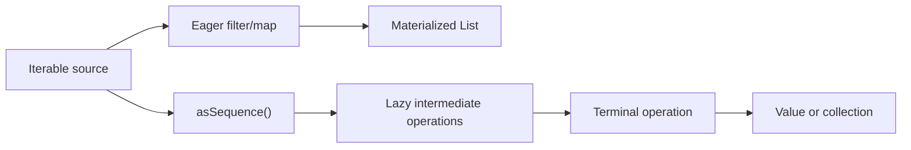

<TLDR>
  <TLDRCell label="what">
    Kotlin 用 `List` 表达有顺序且可重复的数据，用 `Set` 表达唯一元素，用 `Map` 表达唯一键到值的关联；`Sequence` 则按需执行操作链。
  </TLDRCell>
  <TLDRCell label="trap">
    `List`、`Set` 和 `Map` 只是只读接口，不保证底层对象不可变；`associateBy()` 遇到重复键时还会保留最后一个值。
  </TLDRCell>
  <TLDRCell label="fix">
    先按数据不变量选择集合类型，在所有权边界决定共享视图还是复制快照，并为键冲突、空结果和序列终结条件写测试。
  </TLDRCell>
</TLDR>

## 是什么，为什么存在

Kotlin 集合（collection）把一组值及其关系写进类型。`List<T>` 保留位置与重复项，`Set<T>` 保证元素唯一，`Map<K, V>` 保证键唯一并把每个键关联到一个值。选择类型不是语法偏好，而是在声明“顺序、重复和查找键”中的哪些性质属于业务契约。

集合 API 把存储结构与处理方式分开。相同的 `filter()`、`map()`、`flatMap()`、`fold()` 和查找操作可用于多种<Term id="iterable">可迭代对象（iterable）</Term>，调用方不必为每种实现重写循环。你会在解析输入、建立索引、聚合订单、去重标识符以及把数据交给 Java API 时使用这些类型。

Kotlin 还区分<Term id="read-only-collection">只读集合（read-only collection）</Term>接口与可变集合（mutable collection）接口。只读接口不暴露写操作，但它可能只是同一个可变对象的受限视图；它不是持久化集合，也不是深度不可变值。这个边界能限制某段代码可以调用的方法，却不能撤销其他别名持有的修改权限。

<Term id="sequence">序列（sequence）</Term>不是另一种持久存储容器。它描述如何逐项产生值，并把中间操作推迟到需要结果时执行。短路终结操作只消费必要的元素，代价是求值时间、资源生命周期和能否重复遍历都需要更明确地审查。

## 工作原理

### 三种集合形状

`List<T>` 是有顺序的集合，索引从零开始，相等元素可以出现多次。它适合队列快照、搜索结果和任何位置本身有意义的数据。需要修改元素或长度时使用 `MutableList<T>`，但公开函数若只读取数据，参数通常写成 `List<T>` 即可缩小权限。

`Set<T>` 依据相等性判断元素是否重复。它适合成员资格、已处理 ID 和标签集合，但 `Set` 接口本身不承诺一种通用遍历顺序。默认工厂常返回保留插入顺序的实现，这个实现细节不应被误写成所有 `Set` 的契约；顺序有意义时，应使用明确的有序类型或先排序结果。

`Map<K, V>` 存储键值条目，但不继承 `Collection`。`map[key]` 在键不存在时返回 `null`；若值类型本来就允许 `null`，还要用 `containsKey()` 区分“存在且值为空”与“键不存在”。`keys`、`values` 和 `entries` 分别提供三种集合视图。

### 只读接口、可变接口与所有权

`listOf()`、`setOf()` 和 `mapOf()` 返回只读接口；`mutableListOf()`、`mutableSetOf()` 和 `mutableMapOf()` 返回带写操作的接口。`val` 只阻止引用重新赋值，所以 `val names = mutableListOf("Ada")` 仍可调用 `names.add("Lin")`。名称是否可重新绑定、接口是否可写、对象是否会变化，是三个不同问题。

把 `MutableList<T>` 赋给 `List<T>` 不会复制对象。两个引用仍指向同一个底层列表，任何持有可变引用的代码都能让只读视图观察到变化。需要稳定快照时，在所有权边界调用 `toList()`；元素本身可变时，这仍只是浅复制，元素内部的后续修改仍可见。

集合写操作通常有两组容易混淆的名称。`sorted()`、`filter()` 和 `map()` 返回结果集合，不修改接收者；`sort()`、`removeAll()` 和赋值操作只在相应的可变接口上修改原对象。审查代码时应同时检查返回值是否被使用，以及原集合是否仍被其他调用方共享。

### 急切操作链

对 `Iterable` 调用 `filter()` 或 `map()` 时，操作会立即遍历输入并返回一个新结果。由多个步骤组成的<Term id="collection-pipeline">集合处理管道（collection pipeline）</Term>通常会在步骤之间物化中间集合。这样得到的结果可以独立遍历，也让每一步的失败发生在调用该步骤时。

同一份数据可以进入急切集合路径，也可以先通过 `asSequence()` 进入惰性路径。两条路径的分界点不是 lambda 的写法，而是每个操作接收并返回 `Iterable` 还是 `Sequence`。



操作名称表达数据形状变化。`map()` 为每个输入产生一个输出，`mapNotNull()` 同时丢弃转换出的 `null`，`flatMap()` 把每个输入产生的可迭代结果摊平成一层。`filter()` 保留满足谓词的原元素，`partition()` 则一次返回满足和不满足条件的两个列表。

聚合操作把多项值折叠成较小的结果。`fold(initial)` 对空集合也能返回初始值，并允许累加器类型不同于元素类型；`reduce()` 从首个元素开始，所以空集合版本会失败。只需查找一项时，`firstOrNull()` 比 `filter(...).first()` 更直接地表达短路与缺失结果。

### 先按结果形状选操作

相似名称可能返回完全不同的形状。先写出期望的结果类型，再选择操作，通常比从一长串扩展函数中猜测更可靠。

| 意图 | 操作 | 结果形状 |
| --- | --- | --- |
| 一对一转换 | `map()` | `List<R>` |
| 转换并丢弃空值 | `mapNotNull()` | `List<R>` |
| 按条件拆成两组 | `partition()` | `Pair<List<T>, List<T>>` |
| 为唯一键建立索引 | `associateBy()` | `Map<K, T>` |
| 保留每个键的全部元素 | `groupBy()` | `Map<K, List<T>>` |
| 从初始值累计 | `fold()` | 累加器类型 `R` |

有些操作会把多个状态压成同一种结果。`firstOrNull()` 用 `null` 同时表达空集合和无匹配项，`singleOrNull()` 还会把“匹配项超过一个”压成 `null`。业务必须区分这些状态时，应先计数、分组或返回明确的领域结果类型。

### 键、分组与冲突策略

`associate()`、`associateBy()` 和 `associateWith()` 会建立 `Map`。如果多个输入产生相同键，后面的值会覆盖前面的值，因此这些函数既是转换，也是隐含的冲突策略。键应当唯一却无法证明时，先 `groupBy()` 并检查组大小，或者在构建可变映射时显式拒绝重复键。

`groupBy()` 创建 `Map<K, List<T>>`，适合后续确实需要每个分组全部元素的场景。只需要计数或累加时，`groupingBy()` 返回一个 `Grouping`，再由 `eachCount()`、`fold()` 或 `aggregate()` 完成分组终结操作。两者的结果形状不同，不能只凭名称中的“group”互换。

映射的遍历顺序取决于具体实现。`mutableMapOf()` 的默认实现保留插入顺序，但 `HashMap` 不提供这项顺序契约。测试如果依赖序列化顺序，应在输出边界排序条目，或选择明确保序的实现，而不是依赖当前打印结果。

### 序列的求值边界

`asSequence()` 在现有 `Iterable` 上建立序列视图，`sequenceOf()` 直接提供有限值，`generateSequence()` 可以按前一项计算下一项。序列上的 `map()`、`filter()` 和 `take()` 返回新的序列，不会立即拉取元素。这些步骤称为中间操作（intermediate operation）。

产生非序列结果的<Term id="terminal-operation">终结操作（terminal operation）</Term>会启动求值，例如 `toList()`、`first()`、`count()` 和 `sum()`。每个输入元素会依次经过管道，而不是先让所有元素完成第一步再进入第二步。`first()` 与 `take()` 可以提前停止；`sorted()` 这类需要看到全部输入的操作则必须先消费上游。

序列不是自动的优化开关。惰性包装本身有执行成本，小型输入或单步转换不一定从中获益。选择它的首要依据应是求值语义：是否需要短路、是否要避免中间结果、输入是否可能无限，以及数据源能存活到终结操作完成。

## 示例

### 按不变量选择 `List`、`Set` 与 `Map`

工单队列需要保留位置，因此使用 `List`。负责人集合只需要唯一名称，ID 索引则需要通过唯一键查找工单。

<Depth level="quick">

```kotlin title="collection_shapes.kt"
data class Ticket(val id: String, val owner: String)

fun main() {
    val queue: List<Ticket> = listOf(
        Ticket("T-1", "Mina"),
        Ticket("T-2", "Bo"),
        Ticket("T-3", "Mina"),
    )

    val owners: Set<String> = queue.mapTo(linkedSetOf()) { it.owner }
    val byId: Map<String, Ticket> = queue.associateBy { it.id }

    println(queue.map { it.id })
    println(owners)
    println(byId["T-2"]?.owner)
    println(byId["missing"]?.owner ?: "not found")
}
```

```text
[T-1, T-2, T-3]
[Mina, Bo]
Bo
not found
```

</Depth>

`mapTo(linkedSetOf())` 同时完成名称转换、去重和插入顺序保留。`associateBy()` 在这里成立，是因为样例数据的 `id` 唯一；生产边界仍应验证这个不变量。缺失键通过 Elvis 操作符得到显式文本，不会把 `null` 误当作负责人名称。

### 区分共享视图与快照

下面的 `readOnlyView` 没有写方法，但仍与 `mutableNames` 共享对象。`snapshot` 在修改前复制了当时的元素，因此之后不会出现 `Maya`。

```kotlin title="views_and_copies.kt"
fun main() {
    val mutableNames = mutableListOf("Ada", "Lin")
    val readOnlyView: List<String> = mutableNames
    val snapshot: List<String> = mutableNames.toList()

    mutableNames += "Maya"

    println("view=$readOnlyView")
    println("snapshot=$snapshot")

    val sortedCopy = mutableNames.sorted()
    mutableNames.sortDescending()

    println("sorted copy=$sortedCopy")
    println("source=$mutableNames")
}
```

```text
view=[Ada, Lin, Maya]
snapshot=[Ada, Lin]
sorted copy=[Ada, Lin, Maya]
source=[Maya, Lin, Ada]
```

`sorted()` 创建升序结果，随后 `sortDescending()` 原地改变源列表。这两个结果同时打印，可以核对返回新集合与修改接收者的区别。若列表元素自身可变，`toList()` 不会递归复制元素，真正的隔离还需要复制元素值。

### 不创建分组列表地累加

这个管道只需要每个 SKU 的总数量，不需要保留完整分组。`groupingBy().fold()` 为每个键建立独立累加器，同时让首次出现顺序在结果映射中可见。

```kotlin title="grouping_orders.kt"
data class OrderLine(val sku: String, val quantity: Int)

fun main() {
    val lines = listOf(
        OrderLine("tea", 2),
        OrderLine("coffee", 1),
        OrderLine("tea", 3),
        OrderLine("cake", 2),
    )

    val quantityBySku = lines
        .groupingBy { it.sku }
        .fold(0) { total, line -> total + line.quantity }

    val firstBulkSku = lines.firstOrNull { it.quantity >= 3 }?.sku

    println(quantityBySku)
    println(firstBulkSku ?: "none")
    println(lines.all { it.quantity > 0 })
}
```

```text
{tea=5, coffee=1, cake=2}
tea
true
```

`firstOrNull()` 直接表达“找到首个批量行或返回空值”，`all()` 则验证每一行数量为正。这里的代码只打印验证结果；真实边界应在发现非正数量时拒绝订单，而不是继续聚合。

### 观察序列何时取值

构建 `accepted` 时没有执行 `onEach()`。调用 `toList()` 后，上游才开始逐项读取；`take(2)` 收到两个合格值后停止，所以最后的 `4` 没有被访问。

```kotlin title="lazy_readings.kt"
fun main() {
    val readings = listOf(2, 7, 3, 9, 4)

    val accepted = readings
        .asSequence()
        .onEach { println("read $it") }
        .filter { it >= 5 }
        .map { it * 10 }

    println("pipeline created")
    println("result=${accepted.take(2).toList()}")
}
```

```text
pipeline created
read 2
read 7
read 3
read 9
result=[70, 90]
```

把终结操作删掉后，读取日志也会消失。反过来，把 `take(2)` 放到 `filter()` 前面会改变含义，因为它只让最初两个输入进入后续步骤。操作顺序既决定结果，也决定上游需要被消费到哪里。

## 陷阱

### 把只读接口当作不可变快照

> [!PITFALL]
> 函数返回 `List<T>` 并不证明返回值以后保持不变。调用方可能拿到一个仍由对象内部修改的列表别名。

**修复：** 先定义所有权契约。实时视图可以共享并写清其生命周期；稳定快照要在边界复制。元素是可变对象时，再决定浅复制是否足够，不要把 `toList()` 描述成深复制。

### 混淆缺失键与空值

> [!PITFALL]
> 对 `Map<K, V?>` 使用 `map[key] == null`，无法判断键不存在，还是键存在但对应值就是 `null`。

**修复：** 业务只关心非空值时可以合并两种状态；必须区分时同时使用 `containsKey()`，或让值类型表达 `Present`、`Missing` 等领域状态。不要用 `getValue()` 只是为了消除可空类型，它会在缺失键时抛异常。

### 让重复键静默覆盖数据

> [!PITFALL]
> `associateBy { it.id }` 看起来像建立索引，但重复 ID 会让后一个元素覆盖前一个元素，结果大小因此缩小。

**修复：** 明确冲突策略。确实需要最后值时给变量命名体现这一点；要求唯一时比较输入数量与结果大小，或在插入时检查旧值；允许一键多值时使用 `groupBy()`。

### 遍历时修改同一个集合

> [!PITFALL]
> 在 `for (item in items)` 中直接调用 `items.remove(item)` 会使迭代器与集合状态不一致，常见结果是 `ConcurrentModificationException`。

**修复：** 按条件删除时使用 `removeAll { ... }`，或使用该迭代器自己的 `remove()`。若目标是产生新数据，用 `filterNot()` 返回结果并保留原集合；不要依赖复制后再循环的偶然安全性来隐藏所有权问题。

### 依赖未声明的遍历顺序

> [!PITFALL]
> `HashSet` 与 `HashMap` 的打印顺序在一组样例上稳定，不等于顺序属于接口契约。生成的测试常把当前表示直接写成期望字符串。

**修复：** 顺序属于结果时，在边界排序或使用明确的保序实现。顺序不属于结果时，按集合或映射相等性断言，不比较 `toString()`；序列化之前也应定义确定的排序规则。

### 对无限或资源型序列调用错误的终结操作

> [!PITFALL]
> `generateSequence()` 可以没有末尾，对这样的序列调用 `toList()`、`count()` 或 `sorted()` 不会正常结束。文件行序列若逃出关闭读取器的作用域，也会在真正消费时失败。

**修复：** 为可能无限的上游设置 `take()`、`first()` 或业务终止条件。资源型序列应在资源仍打开的词法作用域内完成终结操作，例如在 `useLines` 回调中生成最终值，而不是把延迟序列返回给外层。

## AI 时代

**生成代码在这里常犯的错**

模型经常把 `List` 称为“不可变列表”，随后又让另一个 `MutableList` 别名修改同一对象。它们也会用 `associateBy()` 建索引却不处理重复键，用 `map()` 执行日志等副作用并丢弃生成的列表，或者在遍历时直接删除元素。序列代码中的典型故障更具体：对无限 `generateSequence()` 调用 `toList()`，把 `lineSequence()` 返回到已关闭的读取器之外，或为了“优化”而插入 `asSequence()`，却没有检查终结操作与操作顺序。

**让 AI 检查**

- 为每个集合标出具体类型、可变别名、所有者和需要稳定快照的边界。
- 列出每个映射构造操作的键冲突策略，并为重复键生成一个失败或合并测试。
- 从每个序列终结操作逆向追踪上游，确认输入有限、资源仍打开，并说明哪些操作可以短路。

**审查清单**

- 修改源集合后再次读取公开的只读结果，验证视图或快照语义符合契约。
- 用空集合、重复键、可空映射值和未排序哈希集合测试边界。
- 检查转换返回值是否被使用，遍历期间是否修改同一对象，以及惰性管道是否一定会终结。

**提示词词汇**

使用准确术语：`read-only collection`（只读集合）、`mutable collection`（可变集合）、`backing collection`（底层集合）、`aliasing`（别名共享）、`defensive copy`（防御性复制）、`key collision`（键冲突）、`eager evaluation`（急切求值）、`lazy sequence`（惰性序列）、`intermediate operation`（中间操作）、`terminal operation`（终结操作）和 `short-circuiting`（短路）。要求 AI 给出“所有权表”和“逐元素求值轨迹”，比笼统要求“使用更地道的 Kotlin 集合”更容易核对。

<Depth level="deep">

## 相等性决定集合语义

集合依赖元素的 `equals()`，哈希实现还依赖 `hashCode()`。`List` 的结构相等要求对应位置的元素相等，因此顺序不同通常不相等。`Set` 比较成员而不比较遍历位置；`Map` 比较键值条目，同样不以条目顺序决定结构相等。

把对象放进 `HashSet` 或作为 `HashMap` 键后，如果参与 `equals()` 或 `hashCode()` 的属性发生变化，后续查找可能到错误的桶中。对象仍在底层结构里，却可能无法按当前值找到或删除。数据类包含 `var` 属性时尤其容易生成这种错误，因为主构造函数属性默认参与数据类的相等性与哈希计算。

集合不会替你决定业务身份。数据库记录可能按不可变 ID 相同，也可能要求所有字段都相同；大小写不敏感的用户名还需要规范化或专用键类型。先定义相等性，再选择集合；不要先使用 `Set`，然后根据碰巧得到的去重结果反推身份规则。

浮点值也需要领域策略。`NaN`、正负零和舍入后的十进制值可能让“重复”与业务理解不一致。金额、坐标或测量值进入集合键之前，应先选择稳定表示与规范化规则，并对边界值直接测试。

## 类型方差与互操作边界

只读 `List<out T>` 和 `Set<out T>` 在元素类型上协变，因为调用方不能通过这些接口插入不兼容值。若 `Rectangle` 是 `Shape`，读取 `List<Rectangle>` 的代码可以把它当作 `List<Shape>`。`MutableList<T>` 不能这样协变，否则接收方可能插入另一种 `Shape`，破坏原列表只含 `Rectangle` 的约束。

这个差异解释了为何公共读取参数应优先接收只读接口，也解释了为何把类型强制转换成 `MutableList` 很危险。运行时对象可能不可写，也可能由别处拥有；类型转换没有建立修改权限。需要输出元素时，接收 `MutableCollection<in T>` 这样的写入目标，或返回由函数自己创建的新集合。

Java 集合跨边界时没有 Kotlin 只读与可变接口的完整保证。Java 方法可能修改 Kotlin 传入的列表，也可能返回可变对象却被 Kotlin 代码声明成只读接口。边界适配层应根据真实契约选择复制、包装或共享，并单独处理 Java 平台类型带来的可空性不确定。

数组也不是 `List`。数组类型与专用基本类型数组有自己的相等、复制和互操作规则，不能仅为了调用方便就反复在数组和列表之间转换。公开 API 应按所有权、可变性和调用平台选择一种主要表示，再在边界集中转换。

## 求值、状态与重复遍历

急切集合操作在函数返回时已经拥有结果；序列则保存产生结果所需的步骤。若谓词读取可变状态，同一个序列在两次终结操作中可能得到不同结果，即使序列对象没变。把有副作用的 lambda 放进惰性管道，还会把副作用时间从声明处移动到消费处。

大多数序列可以重新遍历，但接口不承诺每种来源都可以。由一次性迭代器适配的序列会限制第二次消费，资源流也常天然只能使用一次。需要重复读取时，在明确且有限的边界物化为 `List`；需要流式处理时，则把序列及其资源所有权限制在同一操作范围。

序列中的 `filter()` 和 `map()` 可以逐项转发，而 `sorted()`、某些去重与聚合操作需要保存状态或消费全部上游。把状态型操作放在无限序列上时，后面的 `take()` 未必能救场，因为上游操作可能永远无法先产生第一个结果。判断管道能否终结时，要按实际操作顺序逐步推演。

带 `To` 后缀的操作允许调用方提供目标集合，例如 `mapTo(destination)`。这能明确结果类型和所有权，也会把旧内容与新结果放入同一对象；目标不会自动清空。复用目标是否合适应由测量和生命周期决定，不能只因它看起来少创建一个对象就默认采用。

审查集合代码时，可以沿一条固定路径检查：先确认数据不变量，再确认接口权限与别名，接着确认每步返回形状，最后确认求值边界。编译器能检查类型和可用方法，却无法证明重复键是否应覆盖、快照是否应稳定，或一个无限序列是否满足业务终止条件。

## 空输入是 API 契约

空集合不是罕见的特殊情况，而是过滤、分页和权限检查的自然结果。`first()`、`last()`、`single()` 和 `reduce()` 需要相应元素存在，否则会抛出异常。带 `OrNull` 后缀的版本把缺失放进返回类型，`fold(initial)` 则为无元素输入保留初始值。

布尔聚合在空集合上遵循逻辑定义。`all { predicate }` 返回 `true`，因为没有反例；`any { predicate }` 返回 `false`，`none { predicate }` 返回 `true`。生成的权限代码若把空角色列表交给 `all`，可能意外通过检查，所以谓词正确还不够，业务是否允许空输入也要单独验证。

`average()` 在空数字集合上返回 `NaN`，而 `minOrNull()` 与 `maxOrNull()` 返回 `null`。把这些结果写入 JSON、数据库或排序逻辑前，应在边界决定空数据的含义。默认值、缺失值和拒绝请求是不同契约，不能只选择最容易通过类型检查的一种。

安全后缀也可能抹去有用差异。`singleOrNull()` 无法告诉调用方究竟是零项还是多项，`map[key]` 无法区分缺失键与空值。需要诊断数据质量时，应保留计数或使用能表示各状态的密封类型，而不是在错误发生后再从 `null` 猜原因。

## 构造结果与复制深度

`buildList`、`buildSet` 和 `buildMap` 适合在一个受限构建作用域中执行条件添加，然后返回只读接口。构建器接收者只应在 lambda 内使用，不应泄漏并在构建完成后继续修改。它们让“构建阶段可写、发布阶段只读”的意图集中在一个表达式中。

`toList()`、`toSet()` 和 `toMap()` 复制的是集合结构中的元素引用，不会递归复制对象图。若列表装着可变的 `Customer`，源列表与副本仍会看到同一个 `Customer` 的属性变化。需要深度隔离时，要为元素定义复制策略，并明确嵌套集合、缓存和外部资源如何处理。

`mapTo()`、`filterTo()` 和 `associateTo()` 把结果追加到调用方提供的目标中。目标里已有的内容通常会保留，这与返回新集合的对应操作不同。生成代码复用共享目标时，还应检查调用间是否需要清空，以及失败到一半后留下的部分结果能否被观察。

复制也不是默认越多越安全。频繁复制可能掩盖模糊的所有权，而共享所有数据又会让修改路径失控。先定义谁能修改、读者需要视图还是时间点快照，再选择复制位置；若成本会影响设计，用目标工作负载测量，而不是引用脱离上下文的结论。

## 确定性来自显式契约

集合的 `toString()` 适合诊断，不适合作为跨进程格式。哈希实现没有统一的接口级顺序承诺，元素自己的字符串表示也可能改变。需要稳定输出时，应选择序列化格式、字段顺序和集合排序规则，并在输出边界执行这些规则。

Kotlin 的 `sortedBy()` 使用<Term id="stable-sort">稳定排序（stable sort）</Term>：比较键相等时保留输入中的相对顺序。稳定性不等于完整顺序；如果输入来自无序集合，相等键元素的输入顺序本来就没有业务保证。需要可重复结果时，应为比较器提供足够的次级键。

测试应按契约选择断言方式，而不是统一比较列表。下面的对应关系能避免把实现偶然性固化成需求。

| 契约 | 合适的断言 |
| --- | --- |
| 位置与重复项都有意义 | 比较 `List` |
| 只关心唯一成员 | 比较 `Set` |
| 只关心键值关联 | 比较 `Map` |
| 输出顺序有意义 | 排序后比较 `List` |
| 允许重复键 | 比较 `Map<K, List<V>>` 或领域合并结果 |

标准可变集合也不自动提供线程安全。只读接口没有写方法，但另一个线程仍可能通过可变别名修改底层对象。跨线程发布集合前，应选择不可变快照、同步所有权或专用并发结构，并依据平台内存模型审查可见性。

最终要区分“当前输出看起来稳定”与“类型和 API 承诺稳定”。前者只能说明一次运行，后者才能支撑调用方和测试。生成代码若没有写出排序、冲突与并发策略，审查者应把它们当作未决定的需求，而不是默认接受当前行为。

</Depth>

<Checkpoint id="kotlin/collections" />

## 延伸阅读

- [Kotlin 集合概览（官方文档源码）](https://raw.githubusercontent.com/JetBrains/kotlin-web-site/master/docs/topics/collections-overview.md)
- [Kotlin 集合操作概览（官方文档源码）](https://raw.githubusercontent.com/JetBrains/kotlin-web-site/master/docs/topics/collection-operations.md)
- [Kotlin 分组操作（官方文档源码）](https://raw.githubusercontent.com/JetBrains/kotlin-web-site/master/docs/topics/collection-grouping.md)
- [Kotlin 序列（官方文档源码）](https://raw.githubusercontent.com/JetBrains/kotlin-web-site/master/docs/topics/sequences.md)
- [Kotlin 集合排序（官方文档源码）](https://raw.githubusercontent.com/JetBrains/kotlin-web-site/master/docs/topics/collection-ordering.md)
