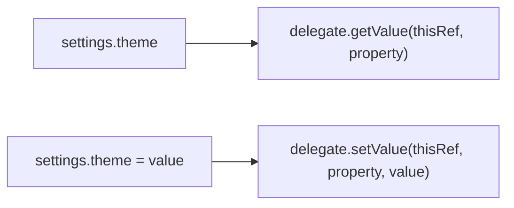

<TLDR>
  <TLDRCell label="what">
    A delegated property hands its access logic to another object: reads call `getValue()`, and writes also call `setValue()`.
  </TLDRCell>
  <TLDRCell label="trap">
    A delegate object can hold state. Reusing one mutable delegate by mistake makes several properties, or even several owners, share one value.
  </TLDRCell>
  <TLDRCell label="fix">
    Decide whether state belongs to a property, an owner, or the whole application before choosing `lazy`, a standard delegate, a property reference, or a custom delegate.
  </TLDRCell>
</TLDR>

## What it is and why it exists

A <Term id="delegated-property">delegated property</Term> is a property declared with `by`. It keeps an ordinary name and static type, but its getter and setter behavior comes from the <Term id="property-delegate">property delegate</Term> on the right of `by`. A caller sees only `settings.theme`; it doesn't need to know whether the value is computed lazily, read from a map, or validated before storage.

Delegation removes repeated access logic. Lazy initialization, change notifications, assignment interception, key-value storage, and input normalization can each live in a delegate. A normalizer, for example, then has one implementation instead of a setter in every form class.

You'll meet it in `val report by lazy { ... }`, `var name by Delegates.observable(...)`, `val id: String by map`, and custom library APIs. `by` can also forward an old property to a new one, which helps preserve source compatibility during a rename.

Property delegation isn't class delegation. `class Repository(store: Store) : Store by store` forwards interface members; `val token by loader` changes access to one property. This topic covers the second form.

Delegation changes initialization timing, state ownership, and thread semantics. An ordinary-looking property read may now execute code. Before choosing a delegate, state whether access has side effects and who owns its instance.

## How it works

### The `by` operator convention

A read-only `val value: T by delegate` requires an `operator fun getValue(...)`. A mutable `var value: T by delegate` also requires `operator fun setValue(...)`. A delegate doesn't have to implement an interface, though the standard `ReadOnlyProperty` and `ReadWriteProperty` interfaces make the signatures and type intent explicit.

`getValue()` receives the property owner as `thisRef` and a `KProperty<*>` that describes the property. `setValue()` also receives the new value. A member normally passes its current object as `thisRef`; top-level and local delegated properties have no owning instance, so their corresponding receiver is `null`.



The compiler checks the operator types. The return from `getValue()` must fit the property type, and the value parameter of `setValue()` must accept the property's values. `thisRef` may use the owner type or one of its supertypes, so a delegate can restrict itself to a particular kind of owner.

### Delegate expressions and state

The delegate expression of a member declaration is evaluated while its owning object is initialized. With `var name by NormalizedText()`, every owner gets a new `NormalizedText`; two such declarations in one owner also get separate delegate instances. State is naturally isolated by owner and property.

That isolation disappears when the right-hand side names a singleton or a shared variable. If the delegate stores a value in one of its own fields, every property bound to that instance reads and writes the same field. Sharing may be intentional, but the design must say so directly.

The compiler commonly generates a hidden field that stores the delegate object. This isn't the property's ordinary <Term id="backing-field">backing field</Term>: it holds the delegate, while the delegate decides whether a value exists and where it lives. The compiler omits this hidden field in some optimized cases described in the deep section.

### Standard-library delegates

`lazy` stores the result of the first successful computation for a `val`. Its default `SYNCHRONIZED` mode lets one thread run initialization and publishes that result to the others. If initialization throws, the value remains uninitialized and the next access tries again.

`Delegates.observable(initial)` calls its callback after the value has been written. It works for lightweight notification or change recording, but it can't reject the assignment. An exception from the callback doesn't restore the old value either.

`Delegates.vetoable(initial)` runs its predicate before a write. It saves the new value only when the predicate returns `true`; `false` leaves the old value in place. The assignment expression doesn't tell its caller that a value was rejected, so business validation that needs feedback usually belongs in an explicit method.

| Delegate | Callback timing | Can reject a write | Main ownership question |
| --- | --- | --- | --- |
| `lazy` | First read | Not applicable; `val` only | May the initializer retry or run concurrently? |
| `observable` | After the write | No | Do callback side effects match the property's lifetime? |
| `vetoable` | Before the write | Yes, by returning `false` | Can the caller learn why a write was rejected? |
| `Map` / `MutableMap` | Every access | Depends on the map operation | Do key names, value types, and model evolution agree? |

### Maps and property references

`Map<String, Any?>` provides delegate operators for read-only properties, and `MutableMap` also supports `var`. The key is the property name. This is useful when validated data already exists in key-value form, but a missing key or wrong runtime type fails during access, so delegation doesn't replace boundary parsing and validation.

A property can also delegate to another property, as in `var oldName by this::newName`. Reading or writing the old name directly accesses the new one. This is commonly paired with `@Deprecated` and `ReplaceWith` for a gradual rename; the two names don't hold separate state.

The compiler handles a property-reference delegate specially and doesn't need an ordinary `$delegate` field. A property reference expresses an alias, not an arbitrary `getValue()` or `setValue()` policy. Review it as an API migration entry point and decide when the old name can be removed.

## Examples

### Compute on first read

Constructing `Catalog` doesn't load the list. The first read of `featured` runs the initializer, and later reads return the same result.

<Depth level="quick">

```kotlin
class Catalog {
    private var loads = 0

    val featured: List<String> by lazy {
        loads += 1
        println("loading catalog")
        listOf("keyboard", "monitor")
    }

    fun loadCount(): Int = loads
}

fun main() {
    val catalog = Catalog()
    println(catalog.loadCount())
    println(catalog.featured.joinToString())
    println(catalog.featured.size)
    println(catalog.loadCount())
}
```

```text
0
loading catalog
keyboard, monitor
2
1
```

</Depth>

The two reads of `featured` produce only one `loading catalog` line. The cached result belongs to the `Lazy` instance, not to the text of the call expression. With the shown `lazy { ... }` declaration, every `Catalog` owns a separate cache.

The visible output makes timing easy to observe here. If a real initializer writes to a network service, charges an account, or sends a message, the retry after a failure may repeat that side effect. Put such actions in a service method with an explicit idempotency policy.

### Observe and veto writes

The `observable` callback sees the accepted coupon. `vetoable` runs before storing the item count, so the negative attempt prints its check but the final value remains `3`.

```kotlin
import kotlin.properties.Delegates

class Cart {
    var coupon: String by Delegates.observable("none") {
        property, oldValue, newValue ->
        println("${property.name}: $oldValue -> $newValue")
    }

    var itemCount: Int by Delegates.vetoable(1) {
        property, oldValue, newValue ->
        println("try ${property.name}: $oldValue -> $newValue")
        newValue >= 0
    }
}

fun main() {
    val cart = Cart()
    cart.coupon = "SAVE10"
    cart.itemCount = 3
    cart.itemCount = -1
    println(cart.itemCount)
}
```

```text
coupon: none -> SAVE10
try itemCount: 1 -> 3
try itemCount: 3 -> -1
3
```

`observable` receives an assignment even when the old and new values compare equal; the callback decides whether to ignore it. A `vetoable` predicate suits a small local invariant. An ordinary method is clearer when validation needs an error message, an asynchronous check, or an atomic update across several fields.

Both callbacks run synchronously on the assigning thread. They don't switch to a UI thread and they don't provide a lock. Concurrent access needs a synchronization policy at a higher level.

### Map storage and a compatibility alias

A map delegate accesses a key by property name. `name` then delegates to `displayName`, so a write through the old name immediately changes the `displayName` entry in the map.

```kotlin
class Profile(private val values: MutableMap<String, Any?>) {
    var displayName: String by values
    var loginCount: Int by values

    @Deprecated("Use displayName", ReplaceWith("displayName"))
    var name: String by this::displayName

    fun snapshot(): Map<String, Any?> = values.toSortedMap()
}

fun main() {
    val profile = Profile(
        mutableMapOf(
            "displayName" to "Ada",
            "loginCount" to 2,
        ),
    )

    profile.name = "Ada Lovelace"
    profile.loginCount += 1

    println(profile.displayName)
    println(profile.snapshot())
}
```

```text
Ada Lovelace
{displayName=Ada Lovelace, loginCount=3}
```

Renaming `displayName` also changes the map key, and existing data isn't migrated automatically. Production code should parse an external payload into a validated type first, or define a deliberate migration for old keys, instead of exposing an arbitrary JSON map as a domain object.

The old getter and setter use the same state as the new property. `@Deprecated` provides migration guidance but doesn't restrict runtime access. Check downstream source and binary compatibility requirements before removing the old name.

### Validate a custom delegate at binding time

`TextFields` is a delegate provider; it doesn't store text itself. Every property binding calls `provideDelegate()`, which validates the name and returns an independent `NormalizedText`, so `name` and `city` don't share a value.

```kotlin
import kotlin.properties.ReadWriteProperty
import kotlin.reflect.KProperty

class NormalizedText(initial: String) : ReadWriteProperty<Any?, String> {
    private var value = normalize(initial)

    override fun getValue(thisRef: Any?, property: KProperty<*>): String = value

    override fun setValue(
        thisRef: Any?,
        property: KProperty<*>,
        value: String,
    ) {
        this.value = normalize(value)
    }

    private fun normalize(input: String): String =
        input.trim().replace(Regex("\\s+"), " ")
}

class TextFields(private val allowed: Set<String>) {
    operator fun provideDelegate(
        thisRef: Any?,
        property: KProperty<*>,
    ): ReadWriteProperty<Any?, String> {
        require(property.name in allowed) {
            "unsupported field: ${property.name}"
        }
        return NormalizedText("")
    }
}

class ContactForm {
    private val textFields = TextFields(setOf("name", "city"))
    var name: String by textFields
    var city: String by textFields
}

fun main() {
    val form = ContactForm()
    form.name = "  Ada   Lovelace "
    form.city = " New   York "
    println("${form.name}|${form.city}")
}
```

```text
Ada Lovelace|New York
```

`provideDelegate()` runs as the owner is initialized and the property is bound; it doesn't run again on every read. If a property name isn't allowed, constructing `ContactForm` fails. That timing suits binding configuration, but not state that becomes ready later.

The return type is `ReadWriteProperty<Any?, String>`, so this delegate can bind to any owner. If the normalization rule belongs only to `ContactForm`, narrow the receiver type to `ContactForm` so an invalid owner fails at compile time.

## Pitfalls

> [!PITFALL]
> Turning a mutable delegate with one `value` field into an `object` makes every property bound to it share state. Two form instances overwrite each other as well, producing data leakage that looks intermittent.

**Fix:** Create a delegate instance per owner and property, or explicitly index shared storage by both `thisRef` and `property` when sharing is intentional. Interleave writes to two properties on two owners in tests; one happy path won't expose the aliasing.

> [!PITFALL]
> Treating `observable` as a transaction hook leaves partial state. Its callback runs after the new value is stored, and an exception from a database write or listener doesn't roll the property back.

**Fix:** Keep observation callbacks small and outside transaction consistency. When an operation must validate, persist, and commit atomically, use an explicit method that reports success or failure and place the property update at a defined point in that flow.

> [!PITFALL]
> When `vetoable` returns `false`, an ordinary assignment statement still finishes without giving the caller a rejection result or reason. Generated code often continues as if the new value took effect.

**Fix:** Reserve `vetoable` for local constraints that need no feedback. If a business operation must explain failure, expose an API such as `setQuantity(newValue): Result<Unit>` and require the caller to handle the result.

> [!PITFALL]
> Map delegation uses the property name as a runtime key and casts `Any?` to the declared type. A missing key raises `NoSuchElementException`, a wrong type raises a cast error, and a property rename silently changes the data contract.

**Fix:** Validate required keys, types, and versions once at the input boundary, then construct a typed model. If the map itself is the protocol, centralize stable key constants and migrations, and test missing keys, nulls, wrong types, and old key names.

> [!PITFALL]
> `LazyThreadSafetyMode.PUBLICATION` may run the initializer concurrently on several threads and guarantees only that one result is published. `NONE` has unspecified behavior under multithreaded access; choosing it as a generic faster mode bases correctness on an unproved thread assumption.

**Fix:** Document the initialization thread, whether the initializer is pure, and whether repeating it is safe. Use the default mode without reliable single-thread ownership. With `PUBLICATION`, make the initializer repeatable and free of external side effects.

<Depth level="deep">

## Delegation boundaries

### The compiler's conceptual translation

For an ordinary member delegate, the compiler conceptually stores the result of `delegateExpression` and has the generated getter call `getValue(this, propertyMetadata)`. A `var` setter similarly calls `setValue(this, propertyMetadata, newValue)`. This explains both why a delegate can see the owner and property name and why a property access can execute arbitrary code.

That translation is a semantic model, not a source-level API to depend on. JVM metadata storage, field names, and exact bytecode instructions can change across compiler versions. Application code should rely on the operator contract instead of looking up a `$delegate` field through reflection.

The compiler omits a delegate field in several provable cases, including property-reference delegates, named objects, a final `val` with a backing field and default getter in the same module, and some constant expressions. Omitting the field doesn't change source behavior, and it isn't a no-allocation promise for arbitrary custom delegates.

### The job of `provideDelegate`

When the object on the right of `by` provides `provideDelegate(thisRef, property)`, the compiler uses its return value as the real delegate. It calls the provider once while initializing the hidden delegate field. Getters and setters then interact only with the returned delegate, so a stateless provider can create independent state for each property.

Use this hook to validate the binding itself: the property name, annotations, owner type, or the existence of a registry key. An error appears during owner initialization instead of waiting for the first property access.

Binding code shouldn't read later properties that haven't been initialized yet. Kotlin constructs an object in declaration and initialization order, so a provider that calls back into the owner can observe partial state. Restricting checks to the `thisRef` type and `KProperty` metadata is usually safer.

### The three `lazy` thread modes

| Mode | Initialization contract | Visibility contract | Required assumption |
| --- | --- | --- | --- |
| `SYNCHRONIZED` | One thread completes initialization | Every thread sees the same result | Single-thread ownership can't be proved |
| `PUBLICATION` | The initializer may run concurrently more than once | One result is published for every reader | Repeated initialization is safe and has no dangerous side effects |
| `NONE` | No cross-thread guarantee | Behavior under multithreaded access is unspecified | One thread owns initialization and every read |

`PUBLICATION` doesn't promise that the business-defined "first computation to finish" wins. The library promises that one computed value is selected and competing results are discarded. Code must not infer the published candidate from scheduling order.

After an initializer throws, all three modes remain uninitialized and retry on the next access. Any external side effect produced before failure runs again on a retry. A safely repeatable construction belongs in the initializer; a one-time business action doesn't.

The thread mode governs initialization and publication of one `Lazy` instance. It doesn't make the returned object internally thread-safe. If the cached value is a `MutableList`, later concurrent mutations still need their own ownership or synchronization policy.

### Receiver types are a static boundary

In `ReadWriteProperty<in T, V>`, `T` is the property owner and `V` is the value type. Writing `Any?` for `T` makes reuse easy but gives up owner constraints. A delegate that needs `User.id` should use `ReadOnlyProperty<User, V>`, making an attempted binding to `Order` fail at compile time.

Operators can also be extension functions, so you needn't change the delegate class. This helps adapt a type you don't own, but resolution now depends on imports and scope. If generated code suddenly can't find `getValue()`, check the operator signature, receiver type, and whether the extension is in scope.

`KProperty<*>` supplies metadata such as a name, but reflection metadata isn't automatically a business key. Using `property.name` directly as a database column, remote JSON key, or persistent-file key makes a source rename change an external protocol. Give stable protocols explicit keys and use the property name only for diagnostics or binding validation.

### Local delegates and object lifetime

A local variable can be delegated, as in `val parsed by lazy { parse(input) }` inside a function. Reaching the declaration creates the delegate, while the first actual read computes the value. If control flow never reads it, the initializer never runs.

Every function entry creates a new local delegate, so its cache doesn't survive across calls. If caching should span calls, lift ownership into an explicit longer-lived object. Treating local `lazy` as global memoization is a common scope mistake in generated helper functions.

A member delegate stays reachable with its owner, while a top-level delegate commonly lives about as long as its class loader or process. A delegate that captures an `Activity`, request context, or closeable resource may extend that object's lifetime. Review the delegate instance's actual lifetime, not just the property's visibility modifier.

### Designing a custom delegate

First decide whether the delegate owns the value. A normalized-string delegate can store it directly; a logging delegate that wraps another delegate should leave storage to the wrapped object. A type that combines storage, network synchronization, validation, and UI notification hides too much work behind property syntax.

Keep getters predictable. Property syntax leads callers to expect a bounded read without external mutation. An operation that needs I/O, retries, cancellation, or an authorization check usually deserves a named function because the function makes its cost and failure visible.

A setter's failure policy must be evident in the API. Throwing, clamping, ignoring a write, and returning failure have different meanings, but property assignment has no result channel. When the caller must make a follow-up decision, an explicit command method is clearer than a result hidden inside a delegate.

Finally, check concurrency. Delegate fields are ordinary object fields and receive no automatic synchronization. A shared delegate must define mutual exclusion and visibility; even a delegate isolated to one owner may be accessed by several threads, so instance isolation doesn't imply thread safety.

### Counterexample-driven tests

Delegates need tests for timing and ownership more than tests for syntax. A small matrix should give every hidden assumption an input that can disprove it.

| Test axis | Smallest counterexample |
| --- | --- |
| Instance isolation | Interleave assignments to two properties on two owners |
| First access | Construct without reading, read twice, then read after an initializer throws |
| Assignment order | Observe the current value in a callback and make that callback throw |
| Map boundary | Missing key, explicit `null`, wrong type, and old key name |
| Concurrency | Let two threads perform first access and record count and result |

For a custom delegate, also verify that an invalid binding fails at compile time or owner initialization. If the delegate depends on the property name, add a rename test or static check so an IDE refactor can't change source code without migrating an external key.

You don't need to test compiler implementation details for every small delegate. Test your policy instead: state isolation, callback timing, post-exception state, and concurrency assumptions. Those contracts still matter after an implementation swap or compiler upgrade.

</Depth>

<Checkpoint id="kotlin/delegated-properties" />

## Further reading

These links lead to Kotlin's official documentation and standard-library sources. The guide defines the language rules; the source files show the exact contracts of the standard delegates and interfaces on the current branch.

- [Kotlin documentation source: Delegated properties](https://raw.githubusercontent.com/JetBrains/kotlin-web-site/master/docs/topics/delegated-properties.md)
- [Kotlin standard library source: `Delegates`](https://raw.githubusercontent.com/JetBrains/kotlin/master/libraries/stdlib/src/kotlin/properties/Delegates.kt)
- [Kotlin standard library source: Property delegate interfaces](https://raw.githubusercontent.com/JetBrains/kotlin/master/libraries/stdlib/src/kotlin/properties/Interfaces.kt)
- [Kotlin standard library source: `Lazy` and thread modes](https://raw.githubusercontent.com/JetBrains/kotlin/master/libraries/stdlib/src/kotlin/util/Lazy.kt)
