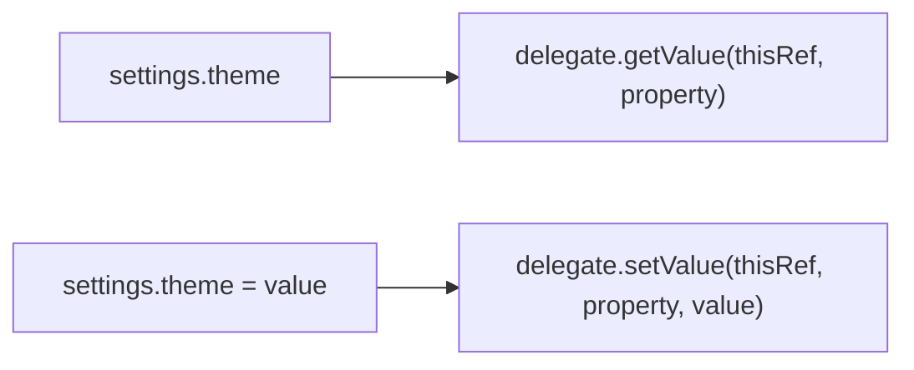

<TLDR>
  <TLDRCell label="what">
    委托属性（delegated property）把属性访问逻辑交给另一个对象；读取调用 `getValue()`，写入还会调用 `setValue()`。
  </TLDRCell>
  <TLDRCell label="trap">
    委托对象可以保存状态。错误地复用同一个可变委托，会让多个属性甚至多个对象共享一个值。
  </TLDRCell>
  <TLDRCell label="fix">
    先明确状态属于属性、对象还是应用全局，再选择 `lazy`、标准委托、属性引用或自定义委托，并测试访问时机和所有权。
  </TLDRCell>
</TLDR>

## 是什么，为什么存在

<Term id="delegated-property">委托属性（delegated property）</Term>是使用 `by` 声明的属性。属性仍有普通的名称和静态类型，但 getter 与 setter 的实现来自 `by` 右侧的<Term id="property-delegate">属性委托（property delegate）</Term>。调用方只看到 `settings.theme`，无需知道值是延迟计算、从映射读取，还是经过验证后保存。

它解决的是重复访问逻辑，而不是把属性本身移到别处。延迟初始化、变更通知、赋值拦截、键值存储和规范化输入都可以封装成委托。例如，规范化规则只需实现一次，不必散落在每个表单类的 setter 中。

你会在 `val report by lazy { ... }`、`var name by Delegates.observable(...)`、`val id: String by map` 以及自定义库 API 中遇到它。`by` 也能把旧属性转发到新属性，适合在重命名期间保留源码兼容性。

属性委托不同于类委托。`class Repository(store: Store) : Store by store` 转发的是接口成员；`val token by loader` 只改变一个属性的访问方式。本主题讨论后者。

委托会改变初始化时机、状态所有权和线程语义。一次看似普通的属性读取也可能执行代码。选择委托前，要先能说清楚访问是否有副作用，以及委托实例由谁持有。

## 工作原理

### `by` 与操作符约定

只读属性 `val value: T by delegate` 要求委托提供 `operator fun getValue(...)`。可变属性 `var value: T by delegate` 还要求 `operator fun setValue(...)`。委托不必实现某个接口，但标准库的 `ReadOnlyProperty` 与 `ReadWriteProperty` 能让签名和类型意图更清楚。

`getValue()` 接收属性所有者 `thisRef` 和描述属性的 `KProperty<*>`。`setValue()` 再接收新值。成员属性通常把当前对象作为 `thisRef`；顶层属性和局部委托没有所属实例，因此相应接收者为 `null`。



这两个操作符的类型约束会在编译期检查。`getValue()` 的返回类型必须能作为属性类型，`setValue()` 的值参数必须能接收属性值。`thisRef` 可以使用所有者类型或其超类型，这让委托能够限制自己只能绑定到某类对象。

### 委托表达式与状态

成员声明右侧的委托表达式会在所属对象初始化时求值。写成 `var name by NormalizedText()` 时，每次创建所属对象都会创建新的 `NormalizedText`；同一对象中的两个这样的声明也得到两个委托实例。状态自然按对象、按属性隔离。

如果右侧引用一个单例或共享变量，隔离就不再成立。委托把值保存在自身字段中时，所有绑定到该实例的属性都会读写同一字段。共享可以是设计目标，但必须显式建模，不能依赖调用方猜测。

委托通常让编译器生成一个保存委托对象的隐藏字段。这个字段不是属性的普通<Term id="backing-field">幕后字段（backing field）</Term>；它保存的是委托，实际值是否存在、存在哪里，由委托决定。某些优化情形会省略这个隐藏字段，深层部分会说明边界。

### 标准库委托

`lazy` 为 `val` 保存首次成功计算的结果。默认的 `SYNCHRONIZED` 模式保证一个线程执行初始化，并把结果发布给其他线程。初始化抛出异常时，值仍未初始化；下次访问会再次尝试。

`Delegates.observable(initial)` 在值已经写入后调用回调。回调适合发出轻量通知或记录变化，但它不能否决赋值。回调抛出异常也不会自动恢复旧值。

`Delegates.vetoable(initial)` 在写入前调用谓词。返回 `true` 才保存新值，返回 `false` 时属性保持旧值。赋值表达式不会告诉调用方是否被拒绝，因此需要反馈的业务验证通常更适合显式方法。

| 委托 | 回调时机 | 写入能否拒绝 | 主要所有权问题 |
| --- | --- | --- | --- |
| `lazy` | 首次读取 | 不适用，只能用于 `val` | 初始化器是否允许重试或并发执行 |
| `observable` | 写入之后 | 不能 | 回调副作用是否与属性生命周期一致 |
| `vetoable` | 写入之前 | 能，返回 `false` | 调用方能否得知拒绝原因 |
| `Map` / `MutableMap` | 每次访问 | 取决于映射操作 | 键名、值类型与模型演进是否同步 |

### 映射与属性引用

`Map<String, Any?>` 已提供适合只读属性的委托操作符，键就是属性名；`MutableMap` 还能支持 `var`。这种写法适合已经以键值形式存在且经过验证的数据。缺键或值类型不符会在运行时失败，所以它不能代替边界解析与校验。

属性也能委托给另一个属性，例如 `var oldName by this::newName`。读写旧名称会直接访问新名称。它常与 `@Deprecated` 和 `ReplaceWith` 配合，用于平滑重命名；两个名称不是两份状态。

属性引用委托经过编译器专门处理，不需要保存普通的 `$delegate` 字段。属性引用表达的是别名关系，而不是一个任意对象的 `getValue()` 或 `setValue()` 策略。审查时应把它当作 API 迁移入口，检查旧名称何时可以删除。

## 示例

### 首次读取才计算

`Catalog` 构造时不会加载列表。第一次读取 `featured` 才执行初始化器，后续读取返回同一个结果。

<Depth level="quick">

```kotlin
class Catalog {
    private var loads = 0

    val featured: List<String> by lazy {
        loads += 1
        println("loading catalog")
        listOf("keyboard", "monitor")
    }

    fun loadCount(): Int = loads
}

fun main() {
    val catalog = Catalog()
    println(catalog.loadCount())
    println(catalog.featured.joinToString())
    println(catalog.featured.size)
    println(catalog.loadCount())
}
```

```text
0
loading catalog
keyboard, monitor
2
1
```

</Depth>

两次读取 `featured` 只产生一次 `loading catalog`。缓存的是 `Lazy` 实例中的结果，不是调用表达式文本。如果每个 `Catalog` 都使用声明中的 `lazy { ... }`，每个实例各自拥有一份缓存。

这段初始化器有可见输出，便于观察时机。实际初始化器若执行网络写入、扣费或发送消息，失败后的自动重试可能重复副作用；应把这类动作移到有显式幂等策略的服务方法中。

### 观察写入与否决写入

`observable` 的回调看到已经接受的优惠码。`vetoable` 在商品数量写入前运行，所以负数尝试会打印检查过程，但最终值仍是 `3`。

```kotlin
import kotlin.properties.Delegates

class Cart {
    var coupon: String by Delegates.observable("none") {
        property, oldValue, newValue ->
        println("${property.name}: $oldValue -> $newValue")
    }

    var itemCount: Int by Delegates.vetoable(1) {
        property, oldValue, newValue ->
        println("try ${property.name}: $oldValue -> $newValue")
        newValue >= 0
    }
}

fun main() {
    val cart = Cart()
    cart.coupon = "SAVE10"
    cart.itemCount = 3
    cart.itemCount = -1
    println(cart.itemCount)
}
```

```text
coupon: none -> SAVE10
try itemCount: 1 -> 3
try itemCount: 3 -> -1
3
```

`observable` 即使新旧值相等也会收到赋值通知；是否忽略相等值由回调决定。`vetoable` 的谓词适合很小的本地不变量，但复杂验证需要错误信息、异步检查或多字段原子更新时，普通方法更清楚。

两个回调都在发起赋值的线程中同步运行。它们不会自动切换到 UI 线程，也不会提供锁。并发访问需要在更高层定义同步策略。

### 映射存储与兼容别名

映射委托按属性名访问键。`name` 再委托到 `displayName`，所以通过旧名称写入后，映射中的 `displayName` 也立即变化。

```kotlin
class Profile(private val values: MutableMap<String, Any?>) {
    var displayName: String by values
    var loginCount: Int by values

    @Deprecated("Use displayName", ReplaceWith("displayName"))
    var name: String by this::displayName

    fun snapshot(): Map<String, Any?> = values.toSortedMap()
}

fun main() {
    val profile = Profile(
        mutableMapOf(
            "displayName" to "Ada",
            "loginCount" to 2,
        ),
    )

    profile.name = "Ada Lovelace"
    profile.loginCount += 1

    println(profile.displayName)
    println(profile.snapshot())
}
```

```text
Ada Lovelace
{displayName=Ada Lovelace, loginCount=3}
```

如果把 `displayName` 重命名，映射键也随之改变，旧数据不会自动迁移。生产代码应先把外部载荷解析成经过校验的类型，或为旧键写明确的迁移规则，而不是把任意 JSON 映射直接暴露为领域对象。

旧属性的 setter、getter 和新属性使用同一份状态。`@Deprecated` 只产生迁移提示，不会限制运行时访问；删除旧名称前仍要检查下游源码和二进制兼容性要求。

### 在绑定时检查自定义委托

`TextFields` 是委托提供者，不直接保存文本。每次属性绑定都会调用 `provideDelegate()`，校验名称后返回一个独立的 `NormalizedText`，因此 `name` 与 `city` 不会共享值。

```kotlin
import kotlin.properties.ReadWriteProperty
import kotlin.reflect.KProperty

class NormalizedText(initial: String) : ReadWriteProperty<Any?, String> {
    private var value = normalize(initial)

    override fun getValue(thisRef: Any?, property: KProperty<*>): String = value

    override fun setValue(
        thisRef: Any?,
        property: KProperty<*>,
        value: String,
    ) {
        this.value = normalize(value)
    }

    private fun normalize(input: String): String =
        input.trim().replace(Regex("\\s+"), " ")
}

class TextFields(private val allowed: Set<String>) {
    operator fun provideDelegate(
        thisRef: Any?,
        property: KProperty<*>,
    ): ReadWriteProperty<Any?, String> {
        require(property.name in allowed) {
            "unsupported field: ${property.name}"
        }
        return NormalizedText("")
    }
}

class ContactForm {
    private val textFields = TextFields(setOf("name", "city"))
    var name: String by textFields
    var city: String by textFields
}

fun main() {
    val form = ContactForm()
    form.name = "  Ada   Lovelace "
    form.city = " New   York "
    println("${form.name}|${form.city}")
}
```

```text
Ada Lovelace|New York
```

`provideDelegate()` 在对象初始化、属性与委托建立关系时运行，不会在每次读取时再次运行。若属性名不在集合中，构造 `ContactForm` 就失败。该时机适合检查绑定配置，不适合依赖稍后才准备好的对象状态。

返回类型使用 `ReadWriteProperty<Any?, String>`，所以委托能绑定到任意所有者。若规范化规则只适用于 `ContactForm`，可以把接收者类型收紧为 `ContactForm`，让错误绑定直接无法编译。

## 陷阱

> [!PITFALL]
> 把保存单个 `value` 字段的可变委托做成 `object`，会让绑定到它的所有属性共享状态。两个表单实例也会互相覆盖，看起来像随机的数据串线。

**修复方法：** 为每个所有者、每个属性创建委托实例，或在确实需要共享的实现中按 `thisRef` 与 `property` 显式索引状态。测试时交错写入两个属性和两个所有者，不能只测一个快乐路径。

> [!PITFALL]
> 把 `observable` 当成事务钩子会产生半完成状态。回调运行时新值已经写入；如果数据库保存或监听器调用抛出异常，属性不会自动回滚。

**修复方法：** 让观察回调短小且不承担事务一致性。需要先验证、持久化并原子提交时，使用返回成功或失败的显式方法，把属性更新放在该流程的确定位置。

> [!PITFALL]
> `vetoable` 返回 `false` 时，普通赋值语句仍然结束，调用方拿不到拒绝结果和原因。生成代码常继续执行后续步骤，误以为新值已经生效。

**修复方法：** 仅把 `vetoable` 用于无需反馈的局部约束。业务操作若必须报告原因，改用 `setQuantity(newValue): Result<Unit>` 之类的 API，并让调用方处理失败。

> [!PITFALL]
> 映射委托把属性名当作运行时键，并把 `Any?` 转成声明类型。缺键会产生 `NoSuchElementException`，类型不符会产生类型转换异常；重命名属性还会悄悄改变数据契约。

**修复方法：** 在输入边界一次性检查必需键、类型与版本，再构造强类型模型。若映射本身就是协议，集中定义键常量和迁移规则，并为缺键、空值、错误类型与旧键写测试。

> [!PITFALL]
> `LazyThreadSafetyMode.PUBLICATION` 允许多个线程同时执行初始化器，只保证最终发布一个结果。`NONE` 在多线程访问下行为未指定；把它选作所谓更快模式会把正确性建立在未证明的线程假设上。

**修复方法：** 先写明初始化发生在哪个线程、初始化器是否纯粹，以及重复执行是否安全。没有可靠的单线程所有权时使用默认模式；使用 `PUBLICATION` 时让初始化器可重复执行且无外部副作用。

## AI 时代

**生成代码在这里常犯的错**

模型经常生成一个带 `private var value` 的 `object` 委托，然后把它复用于多个属性，导致字段和对象之间共享数据。另一种常见错误是让 `observable` 回调执行数据库写入或启动协程，却声称赋值具备事务性；回调失败后，内存中的新值已经存在。

线程相关的错误更隐蔽。生成代码会把 `lazy(NONE)` 当作无条件优化，或选择 `PUBLICATION` 后在初始化器里注册监听器、写文件、递增计费计数。并发首次访问时，这些副作用可能执行多次，即使所有读取者最后看到同一个发布值。

映射委托也容易被生成器过度使用。模型把未校验的反序列化结果直接转换成 `Map<String, Any?>`，再假定缺键、`null`、数字表示和属性重命名都由类型系统处理；实际上这些错误都推迟到了属性访问时。

**让 AI 检查**

- 列出每个 `by` 右侧表达式的实例数量，并说明其状态是按属性、按所有者还是全局共享。
- 跟踪 `observable`、`vetoable` 和 `lazy` 回调的执行时机、线程、异常路径与外部副作用。
- 为所有映射委托列出精确键名、运行时值类型、缺失策略和重命名迁移，并生成失败优先的测试。

**审查清单**

- 交错读写两个属性和两个所属对象，确认可变委托没有意外共享状态。
- 让初始化器和变更回调抛出异常，再检查属性值、重试行为和外部副作用。
- 从两个线程触发首次读取，并用计数器验证所选 `LazyThreadSafetyMode` 的实际约定。

**提示词词汇**

使用准确术语：`delegated property`（委托属性）、`property delegate`（属性委托）、`getValue/setValue operator`（取值／设值操作符）、`thisRef`（属性所有者）、`KProperty metadata`（属性元数据）、`delegate instance lifetime`（委托实例生命周期）、`safe publication`（安全发布）、`provideDelegate binding time`（委托绑定时机）。要求 AI 给出“所有者－属性－委托实例图”和“读取／写入时间线”，比笼统地要求“检查这个 Kotlin 属性”更容易发现共享与时序错误。

<Depth level="deep">

## 委托绑定的边界

### 编译器的概念转换

对普通成员委托，编译器在概念上保存 `delegateExpression` 的结果，并让生成的 getter 调用 `getValue(this, propertyMetadata)`。`var` 的 setter 类似，会调用 `setValue(this, propertyMetadata, newValue)`。这解释了为什么委托能看到所有者和属性名，也解释了为什么一次属性访问可以执行任意代码。

这个转换是语义模型，不是应依赖的源代码 API。JVM 后端如何存放属性元数据、字段叫什么，以及具体字节码指令都可能随编译器版本变化。应用代码应依赖操作符契约，而不是反射查找某个 `$delegate` 字段。

编译器会在若干可证明的情形省略委托字段，包括委托给属性引用、命名对象、同模块中带默认 getter 和幕后字段的最终 `val`，以及某些常量表达式。省略字段不改变属性在源码中的行为，也不是对任意自定义委托的无分配承诺。

### `provideDelegate` 的职责

若 `by` 右侧对象提供 `provideDelegate(thisRef, property)`，编译器用它的返回值作为真正委托。它在初始化隐藏委托字段时调用一次，之后 getter 和 setter 只与返回的委托交互。提供者本身可以无状态，返回的委托则可以按属性保存独立状态。

这个钩子用于验证绑定本身，例如属性名、注解、所有者类型或注册表中是否存在对应键。错误会在所属对象初始化时出现，比第一次访问属性时才发现配置错误更早。

绑定阶段不应读取尚未初始化的后续属性。Kotlin 按声明和初始化顺序构造对象，提供者如果回调所有者，很容易观察到部分初始化状态。把检查限制在 `thisRef` 的类型和 `KProperty` 元数据，通常更稳妥。

### `lazy` 的三种线程模式

| 模式 | 初始化次数约定 | 可见性约定 | 适用前提 |
| --- | --- | --- | --- |
| `SYNCHRONIZED` | 一个线程完成初始化 | 所有线程看到同一结果 | 无法证明单线程所有权 |
| `PUBLICATION` | 初始化器可能并发执行多次 | 只有一个结果被发布并供所有线程读取 | 初始化器可重复执行且没有危险副作用 |
| `NONE` | 不提供跨线程保证 | 多线程访问行为未指定 | 初始化与全部读取都由同一线程拥有 |

`PUBLICATION` 不是“最先完成的计算一定获胜”的业务契约。标准库只保证一个算出的值被采用，竞争中其他结果会被丢弃。代码不应根据调度顺序推断哪一个候选结果会发布。

三种模式在初始化器抛出异常后都会保持未初始化状态，并在下一次访问时重试。若失败前已经产生外部副作用，重试会再次执行它们。适合放入初始化器的是可安全重算的构造过程，而不是不可重复的业务动作。

线程模式解决的是一个 `Lazy` 实例的初始化与发布，不会让返回对象内部自动线程安全。如果缓存得到 `MutableList`，多个线程随后修改它仍需要单独的所有权或同步规则。

### 接收者类型是一道静态边界

`ReadWriteProperty<in T, V>` 中的 `T` 表示属性所有者，`V` 表示值类型。把 `T` 写成 `Any?` 便于复用，但放弃了所有者约束。委托需要访问 `User.id` 时，应使用 `ReadOnlyProperty<User, V>`，这样绑定到 `Order` 会编译失败。

操作符也可以作为扩展函数提供，不必修改委托类。这适合为你不拥有的类型补充委托协议，但会让解析依赖导入和作用域。生成代码若突然找不到 `getValue()`，应同时检查操作符签名、接收者类型以及扩展函数是否在作用域内。

`KProperty<*>` 提供名称等元数据，但反射元数据不等于业务键。把 `property.name` 直接用于数据库列、远程 JSON 或持久化文件，会让源码重命名改变外部协议。稳定协议应有显式键，并把属性名只用于诊断或绑定期校验。

### 局部委托与对象生命周期

局部变量也能使用委托，例如函数块中的 `val parsed by lazy { parse(input) }`。执行到声明处时会创建委托，第一次真正读取才计算值。如果控制流从不读取它，初始化器不会运行。

每次进入该函数都会创建新的局部委托，因此缓存不会跨调用保留。需要跨调用缓存时，应把所有权提升到明确的长生命周期对象中。把局部 `lazy` 误认为全局记忆化，是生成辅助函数时常见的范围错误。

成员委托与所属对象一起保持可达，顶层委托通常与类加载器或进程生命周期相近。委托若捕获 `Activity`、请求上下文或可关闭资源，可能延长其生命周期。审查捕获对象时，要看委托实例实际存活多久，而不只是属性的可见性修饰符。

### 自定义委托的设计检查

先决定委托是否拥有值。规范化字符串的委托可以直接保存值；日志委托若包裹另一个委托，则应把存储职责留给被包装者。一个类型同时负责存储、网络同步、验证和 UI 通知时，普通属性访问会隐藏过多工作。

getter 应尽量保持可预测。属性语法让调用方自然地假设读取成本有限且不会改变外部世界。需要 I/O、重试、取消或权限检查的操作通常更适合命名函数，因为函数能让成本与失败显眼。

setter 的失败策略必须从 API 看得出来。抛出异常、裁剪输入、忽略写入与返回失败各有不同语义，但属性赋值本身没有返回通道。若调用方必须作出后续决策，使用显式命令方法比把结果藏进委托更合适。

最后检查并发。委托的字段与普通对象字段一样，没有自动同步。共享委托实例需要定义互斥与可见性；每个所有者独立的委托也可能被多个线程访问，不能把实例隔离误认为线程安全。

### 反例驱动测试

委托最值得测试的是时机和所有权，而不是语法。最小测试矩阵应让每条隐含假设都有一个能推翻它的输入。

| 测试轴 | 最小反例 |
| --- | --- |
| 实例隔离 | 两个属性、两个所有者交错赋值 |
| 首次访问 | 构造后不读、连续读取、初始化抛出后再读 |
| 赋值顺序 | 回调中观察当前值，并让回调抛出异常 |
| 映射边界 | 缺键、显式 `null`、错误类型、旧键名 |
| 并发 | 两个线程同时首次读取，记录初始化次数与结果 |

测试自定义委托时，还应直接验证错误绑定能否在编译期或对象初始化时失败。若委托依赖属性名，加入一次重命名测试或静态检查，防止 IDE 重构只改源码而没有迁移外部键。

不必给每个简单委托编写编译器实现测试。重点是你的策略：状态是否隔离、回调何时发生、异常后留下什么，以及并发前提是否成立。这些才是更换实现或升级编译器后仍需要保持的契约。

</Depth>

<Checkpoint id="kotlin/delegated-properties" />

## 延伸阅读

以下链接指向 Kotlin 官方文档及标准库源码。文档页面说明语言规则，源码则给出标准委托与接口在当前分支中的准确契约。

- [Kotlin 文档源文件：委托属性](https://raw.githubusercontent.com/JetBrains/kotlin-web-site/master/docs/topics/delegated-properties.md)
- [Kotlin 标准库源码：`Delegates`](https://raw.githubusercontent.com/JetBrains/kotlin/master/libraries/stdlib/src/kotlin/properties/Delegates.kt)
- [Kotlin 标准库源码：属性委托接口](https://raw.githubusercontent.com/JetBrains/kotlin/master/libraries/stdlib/src/kotlin/properties/Interfaces.kt)
- [Kotlin 标准库源码：`Lazy` 与线程模式](https://raw.githubusercontent.com/JetBrains/kotlin/master/libraries/stdlib/src/kotlin/util/Lazy.kt)
